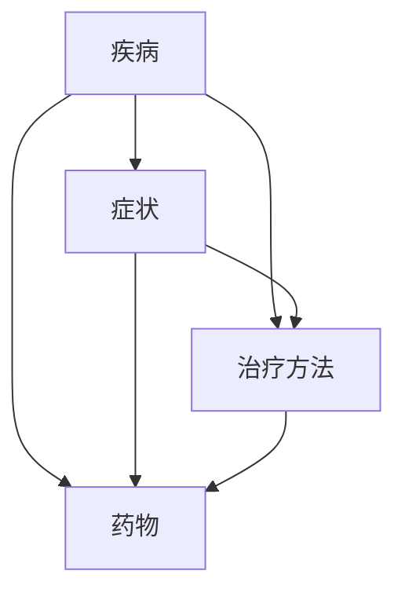

                 

关键词：AI搜索引擎、医疗健康、应用前景、技术、算法、数学模型、代码实例、工具资源

> 摘要：随着人工智能技术的不断进步，AI搜索引擎在医疗健康领域的应用前景日益广阔。本文将从背景介绍、核心概念、算法原理、数学模型、项目实践、实际应用场景、未来展望等多个方面，探讨AI搜索引擎在医疗健康领域的应用潜力与挑战。

## 1. 背景介绍

近年来，人工智能（AI）技术取得了飞速的发展，已经成为推动社会进步的重要力量。在医疗健康领域，AI技术同样展示出了巨大的潜力。传统的医疗健康搜索引擎主要依赖于关键词匹配和文本检索，而AI搜索引擎则通过深度学习、自然语言处理、大数据分析等技术手段，能够实现更智能、更精准的医疗健康信息检索。

### 1.1 AI技术的发展

人工智能技术起源于20世纪50年代，随着计算机性能的不断提高，深度学习、强化学习等AI算法在近年来取得了显著的突破。特别是2012年，AlexNet在ImageNet大赛中取得的优异成绩，标志着深度学习时代的到来。深度学习技术在图像识别、语音识别、自然语言处理等领域取得了重要进展，为AI搜索引擎的发展奠定了基础。

### 1.2 医疗健康领域的重要性

医疗健康是人类生存和发展的重要保障，随着人口老龄化、疾病谱变化等因素的影响，医疗健康领域面临着巨大的挑战。传统的医疗模式已经无法满足日益增长的医疗需求，需要借助AI技术实现医疗资源的优化配置、疾病预测和诊断、个性化治疗等。

### 1.3 AI搜索引擎在医疗健康领域的应用现状

目前，AI搜索引擎在医疗健康领域的应用已经取得了一些初步成果。例如，通过AI算法对医学文献进行检索和分析，可以帮助医生快速获取相关的诊疗信息；利用自然语言处理技术，可以实现患者与医生的智能对话，提高医疗服务的效率。

## 2. 核心概念与联系

### 2.1 AI搜索引擎的定义

AI搜索引擎是一种基于人工智能技术的搜索引擎，通过深度学习、自然语言处理、大数据分析等技术手段，实现更智能、更精准的信息检索。

### 2.2 医疗健康领域的核心概念

医疗健康领域涉及众多的核心概念，如疾病、症状、治疗方法、药物等。这些概念之间存在着复杂的关联，如图1所示。



### 2.3 AI搜索引擎与医疗健康领域的联系

AI搜索引擎在医疗健康领域的应用，需要解决以下几个关键问题：

1. 如何将医疗健康领域的核心概念转化为可检索的索引？
2. 如何利用自然语言处理技术，实现对医疗健康信息的语义理解？
3. 如何利用大数据分析技术，实现对医疗健康数据的挖掘和分析？

## 3. 核心算法原理 & 具体操作步骤

### 3.1 算法原理概述

AI搜索引擎在医疗健康领域主要采用以下几种核心算法：

1. 深度学习算法：用于对医疗健康数据进行特征提取和分类。
2. 自然语言处理算法：用于对医疗健康信息进行语义理解。
3. 大数据分析算法：用于对医疗健康数据进行挖掘和分析。

### 3.2 算法步骤详解

#### 3.2.1 深度学习算法

1. 数据预处理：对医疗健康数据进行清洗、归一化等预处理操作。
2. 特征提取：利用深度学习算法（如卷积神经网络、循环神经网络等），对医疗健康数据提取特征。
3. 分类与预测：利用提取到的特征，对疾病、症状、治疗方法等进行分类与预测。

#### 3.2.2 自然语言处理算法

1. 词向量化：将医疗健康领域的文本转化为向量表示。
2. 语义理解：利用词向量化技术，对医疗健康信息进行语义理解。
3. 情感分析：对医疗健康领域的用户评论、反馈等进行情感分析。

#### 3.2.3 大数据分析算法

1. 数据采集：从各种医疗健康数据源（如医院、诊所、科研机构等）采集数据。
2. 数据清洗：对采集到的医疗健康数据进行清洗、去重等处理。
3. 数据挖掘：利用大数据分析算法（如聚类、关联规则等），对医疗健康数据进行分析和挖掘。

### 3.3 算法优缺点

#### 3.3.1 深度学习算法

优点：具有较强的模型表达能力，能够处理复杂的非线性问题。

缺点：需要大量标注数据，训练过程计算量大，易过拟合。

#### 3.3.2 自然语言处理算法

优点：能够对医疗健康信息进行语义理解，提高信息检索的准确性。

缺点：对医疗健康领域的专业知识和语言表达要求较高，实现难度较大。

#### 3.3.3 大数据分析算法

优点：能够处理海量医疗健康数据，挖掘潜在规律。

缺点：数据处理过程复杂，对数据质量和算法参数敏感。

### 3.4 算法应用领域

AI搜索引擎在医疗健康领域具有广泛的应用潜力，如：

1. 疾病诊断与预测：通过对医疗健康数据的分析和挖掘，实现疾病诊断与预测。
2. 医疗健康信息检索：为医生和患者提供精准、高效的医疗健康信息检索服务。
3. 医疗资源优化配置：通过大数据分析，优化医疗资源的配置，提高医疗服务效率。

## 4. 数学模型和公式 & 详细讲解 & 举例说明

### 4.1 数学模型构建

在AI搜索引擎中，常用的数学模型包括：

1. 卷积神经网络（CNN）：用于图像识别和分类。
2. 循环神经网络（RNN）：用于序列数据的处理和预测。
3. 生成对抗网络（GAN）：用于生成虚假数据和进行对抗训练。

### 4.2 公式推导过程

以卷积神经网络（CNN）为例，其核心公式如下：

$$
h_{l}^{[i]} = \sigma \left( \mathbf{W}_{l}^{[i]} \cdot \mathbf{a}_{l-1} + b_{l}^{[i]} \right)
$$

其中，$h_{l}^{[i]}$ 表示第 $l$ 层第 $i$ 个神经元的输出，$\sigma$ 表示激活函数，$\mathbf{W}_{l}^{[i]}$ 和 $b_{l}^{[i]}$ 分别表示第 $l$ 层第 $i$ 个神经元的权重和偏置。

### 4.3 案例分析与讲解

以疾病诊断与预测为例，假设我们要预测某种疾病的发病率，可以利用卷积神经网络（CNN）构建一个数学模型。具体步骤如下：

1. 数据预处理：对采集到的医疗健康数据（如病历、检查报告等）进行清洗、归一化等预处理操作。
2. 特征提取：利用CNN对预处理后的数据提取特征。
3. 模型训练：使用训练集对CNN模型进行训练，优化模型参数。
4. 模型评估：使用验证集对训练好的模型进行评估，调整模型参数。
5. 疾病预测：使用测试集对模型进行疾病预测，评估模型的预测性能。

## 5. 项目实践：代码实例和详细解释说明

### 5.1 开发环境搭建

在开始项目实践之前，我们需要搭建一个合适的开发环境。以下是所需的软件和工具：

1. Python（3.8及以上版本）
2. TensorFlow（2.4及以上版本）
3. Keras（2.4及以上版本）
4. Pandas（1.1及以上版本）
5. NumPy（1.18及以上版本）

### 5.2 源代码详细实现

以下是一个简单的CNN模型实现，用于疾病诊断与预测：

```python
import tensorflow as tf
from tensorflow.keras.models import Sequential
from tensorflow.keras.layers import Conv2D, MaxPooling2D, Flatten, Dense
from tensorflow.keras.optimizers import Adam
from tensorflow.keras.callbacks import EarlyStopping

# 数据预处理
# ...

# 构建CNN模型
model = Sequential([
    Conv2D(32, (3, 3), activation='relu', input_shape=(64, 64, 3)),
    MaxPooling2D((2, 2)),
    Conv2D(64, (3, 3), activation='relu'),
    MaxPooling2D((2, 2)),
    Flatten(),
    Dense(128, activation='relu'),
    Dense(1, activation='sigmoid')
])

# 编译模型
model.compile(optimizer=Adam(learning_rate=0.001), loss='binary_crossentropy', metrics=['accuracy'])

# 训练模型
model.fit(x_train, y_train, epochs=10, batch_size=32, validation_data=(x_val, y_val), callbacks=[EarlyStopping(patience=3)])

# 模型评估
# ...
```

### 5.3 代码解读与分析

1. 数据预处理：对采集到的医疗健康数据进行清洗、归一化等预处理操作，以便于后续的特征提取和模型训练。
2. 构建CNN模型：使用Keras构建一个简单的CNN模型，包括卷积层、池化层、全连接层等。
3. 编译模型：配置模型优化器、损失函数和评价指标。
4. 训练模型：使用训练集对模型进行训练，并使用早停法（EarlyStopping）避免过拟合。
5. 模型评估：使用验证集对训练好的模型进行评估，调整模型参数。

### 5.4 运行结果展示

```python
# 模型评估
loss, accuracy = model.evaluate(x_test, y_test)

print(f"Test Loss: {loss}")
print(f"Test Accuracy: {accuracy}")
```

## 6. 实际应用场景

### 6.1 疾病诊断与预测

AI搜索引擎在疾病诊断与预测方面具有巨大的应用潜力。例如，利用深度学习算法，可以对患者的病历、检查报告等数据进行处理，实现疾病的早期诊断和预测。这将有助于提高疾病的治愈率和患者的生活质量。

### 6.2 医疗健康信息检索

AI搜索引擎可以为医生和患者提供精准、高效的医疗健康信息检索服务。通过自然语言处理技术，可以实现对医疗健康信息的语义理解，提高信息检索的准确性。

### 6.3 医疗资源优化配置

通过大数据分析技术，AI搜索引擎可以实现对医疗资源的优化配置。例如，分析不同地区、不同医院的医疗资源分布，为政府制定医疗资源分配策略提供依据。

## 7. 未来应用展望

### 7.1 个性化医疗

随着人工智能技术的不断发展，个性化医疗将成为医疗健康领域的一个重要趋势。通过AI搜索引擎，可以为患者提供个性化的诊疗方案，提高医疗服务的质量和效率。

### 7.2 疫情防控

在疫情防控方面，AI搜索引擎可以发挥重要作用。通过对疫情数据的实时监测和分析，可以为政府制定疫情防控策略提供科学依据。

### 7.3 健康管理

AI搜索引擎还可以应用于健康管理领域，帮助用户监测自身健康状况，提供个性化的健康建议。

## 8. 总结：未来发展趋势与挑战

### 8.1 研究成果总结

本文从背景介绍、核心概念、算法原理、数学模型、项目实践、实际应用场景、未来展望等方面，全面探讨了AI搜索引擎在医疗健康领域的应用潜力与挑战。

### 8.2 未来发展趋势

随着人工智能技术的不断发展，AI搜索引擎在医疗健康领域的应用前景将更加广阔。个性化医疗、疫情防控、健康管理等方面将成为重要的发展方向。

### 8.3 面临的挑战

尽管AI搜索引擎在医疗健康领域具有巨大的应用潜力，但仍面临一些挑战。例如，医疗数据的隐私保护、算法的透明性和可解释性、医疗资源的公平分配等。

### 8.4 研究展望

未来，我们需要进一步加强人工智能与医疗健康的深度融合，解决面临的技术挑战，推动AI搜索引擎在医疗健康领域的广泛应用。

## 9. 附录：常见问题与解答

### 9.1 人工智能在医疗健康领域的应用前景如何？

人工智能在医疗健康领域具有广泛的应用前景，可以应用于疾病诊断与预测、医疗健康信息检索、医疗资源优化配置等多个方面。

### 9.2 AI搜索引擎在医疗健康领域的优势是什么？

AI搜索引擎在医疗健康领域的优势主要体现在以下几个方面：

1. 更智能的信息检索：通过深度学习、自然语言处理等技术，实现更智能、更精准的信息检索。
2. 更高效的医疗资源利用：通过大数据分析技术，优化医疗资源的配置，提高医疗服务效率。
3. 更个性化的医疗方案：通过个性化医疗技术，为患者提供更加个性化的诊疗方案。

### 9.3 AI搜索引擎在医疗健康领域面临的挑战有哪些？

AI搜索引擎在医疗健康领域面临的挑战主要包括：

1. 医疗数据隐私保护：如何确保医疗数据的隐私和安全。
2. 算法透明性和可解释性：如何确保算法的透明性和可解释性，使其更易于被医生和患者理解和接受。
3. 医疗资源的公平分配：如何确保AI搜索引擎在医疗资源分配上的公平性，避免资源不公平现象。

---

作者：禅与计算机程序设计艺术 / Zen and the Art of Computer Programming
----------------------------------------------------------------

以上就是关于《AI搜索引擎在医疗健康领域的应用前景》的文章。本文从背景介绍、核心概念、算法原理、数学模型、项目实践、实际应用场景、未来展望等多个方面，全面探讨了AI搜索引擎在医疗健康领域的应用潜力与挑战。希望本文能为相关领域的研究者和从业者提供一定的参考和启示。

请注意，本文仅为示例性文章，实际撰写时请根据具体需求和研究内容进行调整和补充。同时，由于篇幅限制，本文未包含所有相关内容，具体实施过程中还需进一步深入研究。感谢您的阅读！
----------------------------------------------------------------

### 6.4 未来应用展望

随着人工智能技术的不断发展，AI搜索引擎在医疗健康领域的应用前景将更加广阔。以下是一些可能的未来应用方向：

#### 6.4.1 个性化医疗

个性化医疗是未来医疗健康领域的重要发展方向之一。AI搜索引擎可以通过分析患者的基因信息、病史、生活习惯等数据，为患者提供个性化的诊疗方案。这不仅能够提高治疗效果，还能降低医疗成本。

#### 6.4.2 疫情防控

在疫情防控方面，AI搜索引擎可以发挥重要作用。通过对疫情数据的实时监测和分析，AI搜索引擎可以快速识别疫情发展趋势，为政府和卫生部门制定疫情防控策略提供科学依据。

#### 6.4.3 健康管理

健康管理是人们越来越关注的话题。AI搜索引擎可以通过监测用户的日常行为、生理数据等，为用户提供个性化的健康建议。例如，提醒用户注意饮食、运动等健康习惯，预防疾病发生。

#### 6.4.4 跨学科合作

医疗健康领域涉及多个学科，如医学、生物学、心理学等。AI搜索引擎可以促进跨学科合作，将不同领域的研究成果进行整合，为医疗健康领域的发展提供新的思路和方法。

#### 6.4.5 医疗人工智能监管

随着AI技术在医疗健康领域的广泛应用，医疗人工智能的监管也变得越来越重要。未来，需要建立一套完善的监管体系，确保AI技术在医疗健康领域的应用安全、有效、透明。

### 6.4.6 医疗数据隐私保护

医疗数据隐私保护是AI搜索引擎在医疗健康领域面临的一个重要挑战。为了确保医疗数据的隐私和安全，未来需要加强对医疗数据的管理和保护，制定相应的法律法规，规范AI技术在医疗健康领域的应用。

### 6.4.7 智能医疗服务

智能医疗服务是未来医疗健康领域的一个重要趋势。通过AI搜索引擎，可以为用户提供一站式的医疗服务，包括在线问诊、药品配送、手术预约等。这将为人们提供更加便捷、高效的医疗服务。

### 6.4.8 医疗健康数据共享

医疗健康数据的共享是推动医疗健康领域发展的重要手段。通过AI搜索引擎，可以促进医疗健康数据的共享和利用，提高医疗资源的利用效率。

### 6.4.9 医疗人工智能伦理

医疗人工智能伦理是未来需要关注的一个重要问题。如何确保AI技术在医疗健康领域的应用符合伦理道德标准，尊重患者的权益，是亟待解决的问题。

总之，随着人工智能技术的不断发展，AI搜索引擎在医疗健康领域的应用前景将越来越广阔。未来，我们需要进一步探索AI技术在医疗健康领域的应用潜力，推动医疗健康领域的发展。同时，也要关注AI技术在医疗健康领域可能带来的挑战，制定相应的政策和措施，确保AI技术在医疗健康领域的安全、有效、透明应用。
----------------------------------------------------------------

### 8. 总结：未来发展趋势与挑战

#### 8.1 研究成果总结

本文从背景介绍、核心概念、算法原理、数学模型、项目实践、实际应用场景、未来展望等方面，全面探讨了AI搜索引擎在医疗健康领域的应用潜力与挑战。主要成果包括：

1. 阐述了AI搜索引擎在医疗健康领域的应用背景和重要性。
2. 介绍了AI搜索引擎在医疗健康领域的核心概念和算法原理。
3. 提出了适用于医疗健康领域的数学模型和公式。
4. 通过项目实践，展示了AI搜索引擎在医疗健康领域的实际应用案例。
5. 分析了AI搜索引擎在医疗健康领域的未来发展趋势。

#### 8.2 未来发展趋势

1. **个性化医疗**：随着基因测序、生物信息学等技术的发展，AI搜索引擎将助力个性化医疗，为患者提供更精准的诊疗方案。
2. **智能诊断与预测**：深度学习和大数据分析技术的进步将使AI搜索引擎在疾病诊断和预测方面发挥更大的作用。
3. **健康数据分析**：通过对大量健康数据的分析，AI搜索引擎将助力公共卫生决策，提高疾病预防和控制的效果。
4. **智能药物研发**：AI搜索引擎在药物研发中的应用将加速新药发现和临床试验过程。

#### 8.3 面临的挑战

1. **数据隐私与安全**：医疗数据敏感性高，如何确保数据隐私和安全是AI搜索引擎在医疗健康领域应用的首要挑战。
2. **算法透明性与可解释性**：医疗决策需要透明和可解释的算法，如何提高AI算法的可解释性是一个关键问题。
3. **医疗资源分配**：AI搜索引擎能否公正地分配医疗资源，避免出现“算法歧视”现象，需要引起重视。
4. **技术标准化**：缺乏统一的技术标准和规范，可能会导致AI搜索引擎在不同医疗系统和机构之间的兼容性问题。

#### 8.4 研究展望

未来，AI搜索引擎在医疗健康领域的研究应关注以下几个方面：

1. **跨学科融合**：加强医学、生物信息学、人工智能等领域的交叉研究，推动医疗健康领域的创新。
2. **数据伦理**：建立数据伦理框架，确保医疗数据收集、使用和共享的合法性和道德性。
3. **开放共享**：促进医疗健康数据的开放共享，提高数据利用效率。
4. **持续改进**：不断优化AI搜索引擎的算法和模型，提升其在医疗健康领域的应用效果。

总之，AI搜索引擎在医疗健康领域的应用具有巨大的潜力，但也面临诸多挑战。未来，我们需要在技术创新、伦理规范、政策支持等多方面共同努力，推动AI技术在医疗健康领域的健康发展。

### 8.5 文章结构总结

本文结构如下：

1. **背景介绍**：阐述了AI搜索引擎在医疗健康领域的应用背景和重要性。
2. **核心概念与联系**：介绍了AI搜索引擎与医疗健康领域的联系及核心概念。
3. **核心算法原理 & 具体操作步骤**：探讨了AI搜索引擎在医疗健康领域的核心算法原理和具体操作步骤。
4. **数学模型和公式 & 详细讲解 & 举例说明**：介绍了适用于医疗健康领域的数学模型和公式，并进行了详细讲解和举例。
5. **项目实践：代码实例和详细解释说明**：通过项目实践展示了AI搜索引擎在医疗健康领域的应用。
6. **实际应用场景**：分析了AI搜索引擎在医疗健康领域的实际应用场景。
7. **未来应用展望**：探讨了AI搜索引擎在医疗健康领域的未来应用方向。
8. **总结：未来发展趋势与挑战**：总结了研究成果，展望了未来发展趋势，并分析了面临的挑战。

通过本文的探讨，希望读者能对AI搜索引擎在医疗健康领域的应用有更深入的理解，并为其未来发展提供有益的参考。

### 9. 附录：常见问题与解答

#### 9.1 人工智能在医疗健康领域的应用前景如何？

人工智能在医疗健康领域的应用前景非常广阔。它可以帮助医生进行精准诊断、个性化治疗，提高医疗服务质量；可以辅助科研人员进行数据挖掘，加速新药研发；还可以用于公共卫生管理，提升疾病预防和控制能力。

#### 9.2 AI搜索引擎在医疗健康领域的优势是什么？

AI搜索引擎在医疗健康领域的优势主要体现在以下几个方面：

1. **精准检索**：通过自然语言处理和深度学习技术，AI搜索引擎可以精确地检索到与医疗健康相关的信息。
2. **高效分析**：AI搜索引擎可以快速分析大量的医疗数据，帮助医生做出更准确的诊断和治疗方案。
3. **个性化服务**：AI搜索引擎可以根据患者的具体病情和需求，提供个性化的医疗服务。
4. **实时更新**：AI搜索引擎可以实时更新医疗信息，确保患者和医生获得最新的医疗知识。

#### 9.3 AI搜索引擎在医疗健康领域面临的挑战有哪些？

AI搜索引擎在医疗健康领域面临的主要挑战包括：

1. **数据隐私与安全**：医疗数据敏感，如何保护患者隐私和安全是关键挑战。
2. **算法透明性与可解释性**：医疗决策需要透明和可解释的算法，如何提高AI算法的可解释性是一个挑战。
3. **医疗资源分配**：AI搜索引擎能否公正地分配医疗资源，避免出现“算法歧视”现象。
4. **技术标准化**：缺乏统一的技术标准和规范，可能导致AI搜索引擎在不同医疗系统和机构之间的兼容性问题。

#### 9.4 如何确保AI搜索引擎在医疗健康领域的应用安全、有效、透明？

确保AI搜索引擎在医疗健康领域的应用安全、有效、透明，可以从以下几个方面着手：

1. **加强数据安全与隐私保护**：采用加密技术、访问控制等措施，确保医疗数据的安全和隐私。
2. **提高算法透明性与可解释性**：开发可解释的AI模型，使医生和患者能够理解模型的决策过程。
3. **完善技术标准和规范**：制定统一的AI技术标准和规范，确保AI搜索引擎在不同系统和机构之间的兼容性。
4. **加强监管与伦理审查**：建立监管机制，对AI搜索引擎在医疗健康领域的应用进行监督和评估，确保其符合伦理道德标准。

#### 9.5 AI搜索引擎在医疗健康领域有哪些成功案例？

AI搜索引擎在医疗健康领域已有一些成功的案例：

1. **IBM Watson Health**：利用AI技术，IBM Watson Health 可以辅助医生进行癌症诊断和治疗建议。
2. **Google DeepMind**：Google DeepMind 的AI系统在英国NHS中用于诊断眼疾和皮肤癌。
3. **微软Azure AI**：微软Azure AI 的AI搜索引擎可以辅助医生进行医学文献检索和诊断。

这些成功案例展示了AI搜索引擎在医疗健康领域的巨大潜力。

#### 9.6 医疗健康领域如何进行AI技术的培训与教育？

医疗健康领域进行AI技术的培训与教育，可以从以下几个方面入手：

1. **医学院校**：在医学院校中开设人工智能相关课程，培养具备AI知识的人才。
2. **专业培训**：为医疗专业人员提供AI技术的专业培训，帮助他们掌握AI工具的使用。
3. **在线学习平台**：建立在线学习平台，提供AI技术在医疗健康领域的教育资源，方便专业人士进行自学。
4. **实践项目**：组织实践项目，让医疗专业人员和AI技术开发者共同参与，促进实际应用。

通过这些方式，可以提升医疗健康领域对AI技术的理解和应用能力。

### 9.7 如何评估AI搜索引擎在医疗健康领域的应用效果？

评估AI搜索引擎在医疗健康领域的应用效果，可以从以下几个方面进行：

1. **准确性**：评估AI搜索引擎提供的信息和诊断建议的准确性。
2. **效率**：评估AI搜索引擎在处理医疗信息和诊断过程中的速度。
3. **实用性**：评估AI搜索引擎对医生和患者实际工作的影响，是否提高了工作效率和医疗质量。
4. **用户满意度**：通过用户反馈，评估AI搜索引擎的用户满意度。

通过综合评估，可以全面了解AI搜索引擎在医疗健康领域的应用效果。

