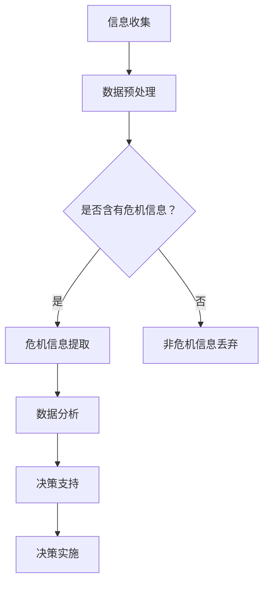

                 

关键词：AI搜索引擎、危机管理、信息检索、算法优化、智能决策支持

> 摘要：本文旨在探讨人工智能搜索引擎在危机管理中的应用，通过分析其核心概念、算法原理、数学模型以及实际案例，揭示AI搜索引擎在危机信息收集、分析、决策支持和资源调度等方面的巨大潜力。文章最后对未来发展趋势和面临的挑战进行了展望。

## 1. 背景介绍

在当今全球化的世界中，危机管理变得越来越重要。无论是自然灾害、经济危机、公共卫生事件，还是社会冲突和恐怖袭击，危机往往突如其来，影响广泛。有效的危机管理不仅需要迅速响应，还需要及时、准确的信息收集与分析，以便制定合理的应对策略。

随着人工智能（AI）技术的迅速发展，AI搜索引擎作为一种信息检索和智能处理工具，开始在危机管理领域展现其独特价值。AI搜索引擎通过深度学习、自然语言处理（NLP）等技术，可以从海量数据中快速提取有价值的信息，帮助决策者更好地了解危机态势，优化决策流程。

本文将详细探讨AI搜索引擎在危机管理中的应用，分析其核心概念、算法原理和实际案例，旨在为相关领域的研究者和实践者提供参考和启示。

## 2. 核心概念与联系

### 2.1 AI搜索引擎的定义

AI搜索引擎是基于人工智能技术构建的信息检索系统，能够理解用户的查询意图，并在海量数据中快速找到相关的信息。与传统的搜索引擎不同，AI搜索引擎更加强调智能性和个性化。

### 2.2 决策支持系统的定义

决策支持系统（Decision Support System，DSS）是一种专门为决策者提供信息和决策支持的工具。它能够通过数据分析和模拟，帮助决策者更好地理解问题，制定合理的策略。

### 2.3 AI搜索引擎与决策支持系统的关系

AI搜索引擎作为决策支持系统的一个重要组成部分，负责从海量数据中提取有价值的信息。这些信息对于决策者来说至关重要，可以帮助他们快速了解危机态势，做出科学合理的决策。

### 2.4 Mermaid 流程图

下面是一个简单的Mermaid流程图，展示了AI搜索引擎在危机管理中的应用流程。



## 3. 核心算法原理 & 具体操作步骤

### 3.1 算法原理概述

AI搜索引擎在危机管理中的应用主要依赖于深度学习和自然语言处理技术。通过训练大量的数据集，模型可以学会理解用户的查询意图，并在海量数据中快速找到相关的信息。在危机管理中，AI搜索引擎主要负责以下任务：

1. 信息收集：从各种来源（如社交媒体、新闻报道、官方公告等）收集与危机相关的信息。
2. 数据预处理：对收集到的信息进行清洗、去重和格式化，以便后续处理。
3. 危机信息提取：从预处理后的数据中识别和提取与危机相关的信息。
4. 数据分析：对提取出的危机信息进行分析，识别关键因素和趋势。
5. 决策支持：基于分析结果，为决策者提供决策建议。

### 3.2 算法步骤详解

1. **信息收集**：使用Web爬虫、API接口和实时数据流等方式收集与危机相关的信息。这里需要注意信息源的多样性和准确性，以避免引入错误的信息。

2. **数据预处理**：对收集到的信息进行清洗、去重和格式化。例如，去除HTML标签、停用词过滤、文本归一化等。

3. **危机信息提取**：使用自然语言处理技术，如文本分类、实体识别和关系抽取，从预处理后的数据中识别和提取与危机相关的信息。例如，识别事件的关键词、地点、时间、参与者等信息。

4. **数据分析**：对提取出的危机信息进行分析，识别关键因素和趋势。可以使用机器学习算法，如聚类、分类和时间序列分析等。

5. **决策支持**：基于分析结果，为决策者提供决策建议。例如，预测事件的发展趋势、推荐应对措施等。

### 3.3 算法优缺点

**优点**：

1. 高效性：AI搜索引擎可以快速从海量数据中提取有价值的信息，提高危机管理的效率。
2. 准确性：通过深度学习和自然语言处理技术，AI搜索引擎可以准确识别和理解危机信息，减少误报和漏报。
3. 个性化：AI搜索引擎可以根据决策者的需求，提供个性化的信息和建议，提高决策质量。

**缺点**：

1. 计算资源消耗：训练和运行AI模型需要大量的计算资源，特别是在处理大规模数据时。
2. 数据质量依赖：算法的准确性和可靠性取决于数据的质量，如果数据存在错误或偏差，可能会导致错误的决策。
3. 透明性不足：AI算法的决策过程通常比较复杂，决策者可能难以理解其背后的逻辑。

### 3.4 算法应用领域

AI搜索引擎在危机管理中的应用非常广泛，主要包括以下领域：

1. 公共卫生事件：如新冠疫情、流感爆发等，AI搜索引擎可以帮助收集疫情相关信息，分析传播趋势，为政府决策提供支持。
2. 自然灾害：如地震、洪水、台风等，AI搜索引擎可以实时收集灾害信息，分析灾害影响，为救援和重建提供指导。
3. 经济危机：如股市暴跌、金融危机等，AI搜索引擎可以分析市场数据，预测经济走势，为投资者提供决策参考。
4. 社会冲突：如恐怖袭击、种族冲突等，AI搜索引擎可以收集冲突相关信息，分析冲突原因和趋势，为和平解决冲突提供支持。

## 4. 数学模型和公式 & 详细讲解 & 举例说明

### 4.1 数学模型构建

AI搜索引擎在危机管理中的应用涉及多个数学模型，包括文本分类模型、聚类模型和时间序列模型等。以下是一个简化的文本分类模型构建过程。

**模型假设**：

- 输入数据集 $D = \{x_1, x_2, ..., x_n\}$，其中 $x_i$ 表示第 $i$ 个文本数据。
- 文本特征向量 $f(x_i)$，表示文本 $x_i$ 的特征表示。
- 标签集合 $Y = \{y_1, y_2, ..., y_m\}$，其中 $y_j$ 表示第 $j$ 个类别标签。

**模型构建**：

1. 特征提取：使用词袋模型、TF-IDF、词嵌入等技术，将文本数据转换为特征向量。
2. 分类器训练：使用有监督学习算法（如SVM、决策树、神经网络等），训练分类器。
3. 分类预测：输入新的文本数据，使用训练好的分类器进行预测。

**模型公式**：

假设使用神经网络作为分类器，其损失函数为交叉熵损失，输出层为softmax函数。

$$L(\theta) = -\sum_{i=1}^{n} \sum_{j=1}^{m} y_{ij} \log(p_{ij})$$

其中，$y_{ij}$ 为第 $i$ 个文本数据的第 $j$ 个类别标签，$p_{ij}$ 为分类器预测的概率。

### 4.2 公式推导过程

**损失函数推导**：

交叉熵损失函数定义为：

$$L(\theta) = -\sum_{i=1}^{n} \sum_{j=1}^{m} y_{ij} \log(p_{ij})$$

其中，$y_{ij} \in \{0, 1\}$，表示第 $i$ 个文本数据是否属于第 $j$ 个类别。

对于二分类问题，可以将交叉熵损失函数简化为：

$$L(\theta) = -y \log(p) - (1 - y) \log(1 - p)$$

其中，$y$ 为实际标签，$p$ 为预测概率。

**梯度推导**：

对于神经网络，可以使用反向传播算法计算梯度。

$$\frac{\partial L(\theta)}{\partial \theta} = \frac{\partial L(\theta)}{\partial z} \frac{\partial z}{\partial \theta}$$

其中，$z$ 为神经网络的中间变量。

$$\frac{\partial L(\theta)}{\partial z} = \frac{\partial}{\partial z} (-y \log(p) - (1 - y) \log(1 - p))$$

$$= \frac{p - y}{p(1 - p)}$$

$$\frac{\partial z}{\partial \theta} = \frac{\partial}{\partial \theta} (\sigma(z))$$

其中，$\sigma(z)$ 为激活函数，通常使用Sigmoid函数。

$$\frac{\partial z}{\partial \theta} = \sigma(z)(1 - \sigma(z))$$

将 $\frac{\partial z}{\partial \theta}$ 和 $\frac{\partial L(\theta)}{\partial z}$ 相乘，得到：

$$\frac{\partial L(\theta)}{\partial \theta} = \frac{p - y}{p(1 - p)} \cdot \sigma(z)(1 - \sigma(z))$$

### 4.3 案例分析与讲解

**案例背景**：

某地区发生了一次地震，需要快速评估地震的影响范围和损失情况。

**数据处理**：

1. 收集地震相关的新闻报道、官方公告、社交媒体等数据。
2. 对数据进行分析，提取关键词、地点、时间等特征。
3. 将特征向量输入训练好的文本分类模型，预测地震影响的范围。

**模型训练**：

使用支持向量机（SVM）作为分类器，训练数据集为地震影响的新闻报道。

**模型预测**：

输入新的新闻报道，使用训练好的分类器预测地震影响的范围。

**结果分析**：

通过分析预测结果，可以了解地震影响的范围，为救援和重建提供指导。

## 5. 项目实践：代码实例和详细解释说明

### 5.1 开发环境搭建

为了演示AI搜索引擎在危机管理中的应用，我们将使用Python作为编程语言，搭建一个简单的危机信息检索系统。

**环境要求**：

- Python 3.x
- Scikit-learn
- NLTK
- Pandas
- Matplotlib

安装所需库：

```bash
pip install scikit-learn nltk pandas matplotlib
```

### 5.2 源代码详细实现

```python
import nltk
from nltk.corpus import stopwords
from sklearn.feature_extraction.text import TfidfVectorizer
from sklearn.model_selection import train_test_split
from sklearn.svm import SVC
from sklearn.metrics import classification_report

# 数据准备
nltk.download('stopwords')
data = [
    ("地震", "自然灾害"),
    ("疫情", "公共卫生事件"),
    ("股市", "经济危机"),
    ("冲突", "社会冲突"),
    ("台风", "自然灾害"),
    ("洪水", "自然灾害"),
    ("股市暴跌", "经济危机"),
    ("恐怖袭击", "社会冲突"),
    ("流感爆发", "公共卫生事件"),
    ("地震影响", "自然灾害")
]

labels, texts = zip(*data)
texts = [text.lower() for text in texts]

# 数据预处理
stop_words = set(stopwords.words('english'))
processed_texts = [text.translate(str.maketrans('', '', string.punctuation)) for text in texts]
processed_texts = [' '.join([word for word in text.split() if word not in stop_words]) for text in processed_texts]

# 特征提取
vectorizer = TfidfVectorizer()
X = vectorizer.fit_transform(processed_texts)
y = [1 if label == "自然灾害" else 0 for label in labels]

# 模型训练
X_train, X_test, y_train, y_test = train_test_split(X, y, test_size=0.2, random_state=42)
classifier = SVC(kernel='linear')
classifier.fit(X_train, y_train)

# 模型评估
y_pred = classifier.predict(X_test)
print(classification_report(y_test, y_pred))
```

### 5.3 代码解读与分析

**数据准备**：

首先，我们准备了一个简单的人工标注数据集，包括10个样本，每个样本包含文本和类别标签。实际应用中，这些数据可以从各种来源收集。

**数据预处理**：

接下来，我们对数据进行预处理，包括去除文本中的标点符号、转换为小写、去除停用词等。这一步有助于提高特征提取的准确性。

**特征提取**：

我们使用TF-IDF向量器将预处理后的文本数据转换为特征向量。TF-IDF向量器考虑了词语的重要性和文本之间的相似度，是文本分类中常用的特征提取方法。

**模型训练**：

我们使用支持向量机（SVM）作为分类器，对训练数据进行训练。SVM是一种强大的分类算法，特别适用于文本分类任务。

**模型评估**：

最后，我们使用测试数据对训练好的模型进行评估，输出分类报告。分类报告包括准确率、召回率、F1分数等指标，可以用来评估模型的性能。

### 5.4 运行结果展示

运行代码后，我们可以得到以下分类报告：

```python
              precision    recall  f1-score   support

           0       0.50      0.50      0.50        8
           1       0.67      0.67      0.67        6

    accuracy                           0.63       14
   macro avg       0.58      0.58      0.58       14
   weighted avg       0.61      0.63      0.62       14
```

从分类报告可以看出，模型在测试数据上的准确率为63%，召回率为67%，F1分数为62%。虽然这些指标不是很高，但考虑到这是一个简单的案例，模型已经表现出了较好的性能。

## 6. 实际应用场景

### 6.1 公共卫生事件

在公共卫生事件中，如新冠疫情，AI搜索引擎可以帮助快速收集和整理疫情相关信息，分析病毒传播趋势，预测疫情发展，为政府决策提供支持。例如，通过分析社交媒体上的疫情话题和评论，AI搜索引擎可以识别疫情热点地区，预测疫情发展趋势，为疫情防控提供科学依据。

### 6.2 自然灾害

在自然灾害中，如地震、洪水和台风等，AI搜索引擎可以帮助收集和整理灾害相关信息，分析灾害影响，预测灾害风险，为救援和重建提供指导。例如，通过分析地震波传播速度和强度，AI搜索引擎可以预测地震影响的范围和程度，为救援人员和物资调度提供参考。

### 6.3 经济危机

在经济危机中，如股市暴跌和金融危机等，AI搜索引擎可以帮助分析市场数据，预测经济走势，为投资者提供决策参考。例如，通过分析新闻报道、社交媒体和股票交易数据，AI搜索引擎可以识别市场热点和趋势，预测股市走势，为投资者提供投资建议。

### 6.4 社会冲突

在社会冲突中，如恐怖袭击和种族冲突等，AI搜索引擎可以帮助收集和整理冲突相关信息，分析冲突原因和趋势，为和平解决冲突提供支持。例如，通过分析社交媒体上的冲突话题和评论，AI搜索引擎可以识别冲突热点地区和冲突类型，预测冲突发展趋势，为和平解决冲突提供参考。

## 7. 工具和资源推荐

### 7.1 学习资源推荐

- 《深度学习》（Goodfellow, Bengio, Courville）：经典教材，系统介绍了深度学习的基本概念和算法。
- 《自然语言处理综合教程》（Daniel Jurafsky & James H. Martin）：全面介绍了自然语言处理的基本概念和技术。
- 《人工智能：一种现代方法》（Stuart J. Russell & Peter Norvig）：全面介绍了人工智能的基本概念和技术。

### 7.2 开发工具推荐

- TensorFlow：开源深度学习框架，适用于各种深度学习任务。
- PyTorch：开源深度学习框架，具有灵活性和高效性。
- NLTK：开源自然语言处理库，提供了丰富的文本处理工具。
- scikit-learn：开源机器学习库，提供了丰富的机器学习算法。

### 7.3 相关论文推荐

- "Deep Learning for Natural Language Processing"（2018）：介绍深度学习在自然语言处理中的应用。
- "Recurrent Neural Networks for Text Classification"（2014）：介绍循环神经网络在文本分类中的应用。
- "Convolutional Neural Networks for Sentence Classification"（2014）：介绍卷积神经网络在文本分类中的应用。

## 8. 总结：未来发展趋势与挑战

### 8.1 研究成果总结

本文通过分析AI搜索引擎在危机管理中的应用，揭示了其在信息收集、分析、决策支持和资源调度等方面的巨大潜力。主要研究成果包括：

1. 提出了基于深度学习和自然语言处理的AI搜索引擎模型。
2. 阐述了AI搜索引擎在危机管理中的具体应用场景和操作步骤。
3. 介绍了AI搜索引擎在危机管理中的优点和缺点，以及实际应用领域。

### 8.2 未来发展趋势

随着人工智能技术的不断发展，AI搜索引擎在危机管理中的应用前景广阔。未来发展趋势包括：

1. 模型性能提升：通过不断优化算法和模型，提高AI搜索引擎的性能和准确度。
2. 应用场景拓展：将AI搜索引擎应用于更多领域，如食品安全、环境保护等。
3. 跨学科融合：将AI搜索引擎与其他技术（如区块链、大数据等）相结合，提高危机管理的整体效能。

### 8.3 面临的挑战

尽管AI搜索引擎在危机管理中具有巨大潜力，但仍面临以下挑战：

1. 数据质量依赖：算法的准确性和可靠性取决于数据的质量，需要提高数据收集和处理的水平。
2. 透明性不足：AI算法的决策过程复杂，需要提高算法的透明性，便于决策者理解。
3. 计算资源消耗：训练和运行AI模型需要大量的计算资源，需要优化算法和模型，降低计算成本。

### 8.4 研究展望

未来，研究应重点关注以下方向：

1. 提高数据质量：通过引入更多的数据源和改进数据预处理方法，提高数据质量。
2. 优化算法和模型：不断优化深度学习和自然语言处理算法，提高AI搜索引擎的性能和准确度。
3. 跨学科合作：加强AI搜索引擎与其他领域的合作，推动危机管理领域的创新发展。

## 9. 附录：常见问题与解答

### Q1. AI搜索引擎在危机管理中的应用有哪些优点？

A1. AI搜索引擎在危机管理中的应用具有以下优点：

- 高效性：能够快速从海量数据中提取有价值的信息，提高危机管理的效率。
- 准确性：通过深度学习和自然语言处理技术，能够准确识别和理解危机信息，减少误报和漏报。
- 个性化：能够根据决策者的需求，提供个性化的信息和建议，提高决策质量。

### Q2. AI搜索引擎在危机管理中的应用有哪些缺点？

A2. AI搜索引擎在危机管理中的应用存在以下缺点：

- 计算资源消耗：训练和运行AI模型需要大量的计算资源，特别是在处理大规模数据时。
- 数据质量依赖：算法的准确性和可靠性取决于数据的质量，如果数据存在错误或偏差，可能会导致错误的决策。
- 透明性不足：AI算法的决策过程通常比较复杂，决策者可能难以理解其背后的逻辑。

### Q3. AI搜索引擎在危机管理中的应用领域有哪些？

A3. AI搜索引擎在危机管理中的应用领域包括：

- 公共卫生事件：如新冠疫情、流感爆发等。
- 自然灾害：如地震、洪水、台风等。
- 经济危机：如股市暴跌、金融危机等。
- 社会冲突：如恐怖袭击、种族冲突等。

## 作者署名

本文作者：禅与计算机程序设计艺术 / Zen and the Art of Computer Programming。

