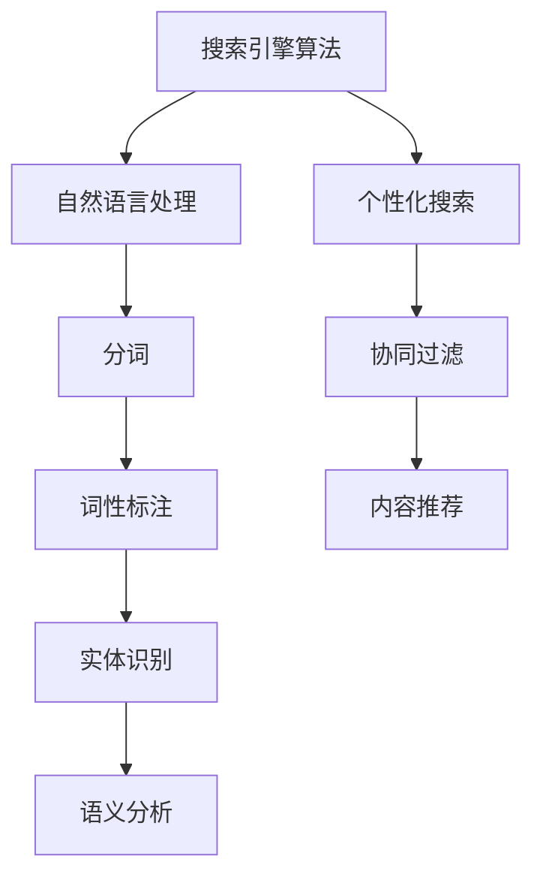

                 

 关键词：AI搜索引擎、用户体验、搜索引擎算法、自然语言处理、个性化搜索、优化策略

> 摘要：本文将深入探讨AI搜索引擎在提高用户体验方面的作用。通过分析核心概念、算法原理、数学模型、项目实践以及实际应用场景，本文将为您揭示AI搜索引擎如何通过技术创新和优化策略，实现更加智能、高效和个性化的搜索服务。

## 1. 背景介绍

随着互联网的普及和信息的爆炸性增长，搜索引擎成为了人们获取信息的重要工具。然而，传统的搜索引擎往往存在搜索结果不准确、用户体验不佳等问题。随着人工智能技术的发展，AI搜索引擎应运而生，它通过深度学习、自然语言处理等技术，提供了更加智能、个性化的搜索服务。

AI搜索引擎的核心目标是提高用户体验，使其能够更加快速、准确地获取所需信息。本文将围绕这一目标，探讨AI搜索引擎如何通过技术创新和优化策略来实现。

## 2. 核心概念与联系

### 2.1. 搜索引擎算法

搜索引擎算法是AI搜索引擎的核心组成部分，负责从大量信息中提取出与用户查询最相关的结果。常见的搜索引擎算法包括：

- **PageRank**：基于网页链接分析，评估网页重要性。
- **LSI（Latent Semantic Indexing）**：通过向量空间模型，捕捉文档和查询之间的语义关系。
- **TF-IDF（Term Frequency-Inverse Document Frequency）**：衡量词语在文档中的重要程度。

### 2.2. 自然语言处理

自然语言处理（NLP）是AI搜索引擎的重要组成部分，负责处理用户查询和搜索结果，以实现语义理解和信息提取。NLP技术包括：

- **分词**：将文本拆分成单词或短语。
- **词性标注**：对文本中的单词进行词性分类。
- **实体识别**：识别文本中的特定实体，如人名、地名、组织名等。
- **语义分析**：理解文本的语义和意图。

### 2.3. 个性化搜索

个性化搜索是根据用户的兴趣、历史搜索记录等，为用户提供更加个性化的搜索结果。个性化搜索技术包括：

- **协同过滤**：基于用户历史行为，为用户推荐相似用户喜欢的搜索结果。
- **内容推荐**：根据用户兴趣和搜索历史，为用户推荐相关内容。

### 2.4. Mermaid流程图

以下是AI搜索引擎的核心概念和联系Mermaid流程图：



## 3. 核心算法原理 & 具体操作步骤

### 3.1. 算法原理概述

AI搜索引擎的核心算法包括搜索引擎算法、自然语言处理算法和个性化搜索算法。以下将分别介绍这些算法的原理。

### 3.2. 算法步骤详解

#### 3.2.1. 搜索引擎算法

搜索引擎算法主要包括以下步骤：

1. **网页抓取**：爬取互联网上的网页。
2. **网页解析**：解析网页内容，提取关键词和短语。
3. **索引构建**：将提取的关键词和短语构建成索引。
4. **查询处理**：接收用户查询，进行查询分析和查询匹配。
5. **结果排序**：根据查询匹配结果，对搜索结果进行排序。

#### 3.2.2. 自然语言处理算法

自然语言处理算法主要包括以下步骤：

1. **分词**：将文本拆分成单词或短语。
2. **词性标注**：对文本中的单词进行词性分类。
3. **实体识别**：识别文本中的特定实体。
4. **语义分析**：理解文本的语义和意图。

#### 3.2.3. 个性化搜索算法

个性化搜索算法主要包括以下步骤：

1. **用户画像**：根据用户兴趣、历史搜索记录等，构建用户画像。
2. **协同过滤**：为用户推荐相似用户喜欢的搜索结果。
3. **内容推荐**：根据用户兴趣和搜索历史，为用户推荐相关内容。

### 3.3. 算法优缺点

#### 3.3.1. 搜索引擎算法

**优点**：能够快速、准确地获取大量信息。

**缺点**：搜索结果可能不够准确，用户体验较差。

#### 3.3.2. 自然语言处理算法

**优点**：能够理解用户的查询意图，提高搜索结果的相关性。

**缺点**：处理复杂文本时，可能存在歧义和误差。

#### 3.3.3. 个性化搜索算法

**优点**：为用户提供更加个性化的搜索结果，提高用户体验。

**缺点**：可能存在用户隐私泄露的风险。

### 3.4. 算法应用领域

AI搜索引擎算法广泛应用于各类场景，如：

- **互联网搜索**：为用户提供互联网信息搜索服务。
- **智能助手**：为用户提供智能问答和推荐服务。
- **电商搜索**：为用户提供商品搜索和推荐服务。
- **医疗搜索**：为用户提供医疗信息搜索和推荐服务。

## 4. 数学模型和公式 & 详细讲解 & 举例说明

### 4.1. 数学模型构建

AI搜索引擎的数学模型主要包括：

- **向量空间模型**：用于表示文本和查询。
- **协同过滤模型**：用于用户推荐。
- **内容推荐模型**：用于内容推荐。

### 4.2. 公式推导过程

#### 4.2.1. 向量空间模型

向量空间模型将文本和查询表示为向量。假设有n个特征词，文本T和查询Q可以表示为：

$$
T = (t_1, t_2, ..., t_n), Q = (q_1, q_2, ..., q_n)
$$

文本T和查询Q的相关性可以通过内积计算：

$$
sim(T, Q) = \sum_{i=1}^{n} t_i \cdot q_i
$$

#### 4.2.2. 协同过滤模型

协同过滤模型可以通过用户相似度来推荐搜索结果。用户i和用户j的相似度可以通过余弦相似度计算：

$$
sim(i, j) = \frac{\sum_{k=1}^{m} r_{ik} \cdot r_{jk}}{\sqrt{\sum_{k=1}^{m} r_{ik}^2 \cdot \sum_{k=1}^{m} r_{jk}^2}}
$$

其中，$r_{ik}$表示用户i对项目k的评分。

#### 4.2.3. 内容推荐模型

内容推荐模型可以通过文本相似度来推荐搜索结果。文本T和查询Q的相似度可以通过余弦相似度计算：

$$
sim(T, Q) = \frac{\sum_{i=1}^{n} t_i \cdot q_i}{\sqrt{\sum_{i=1}^{n} t_i^2 \cdot \sum_{i=1}^{n} q_i^2}}
$$

### 4.3. 案例分析与讲解

假设有用户A，历史搜索记录如下：

- 科技
- 电影
- 旅游

现在用户A查询“科幻电影”，AI搜索引擎可以根据用户历史搜索记录和文本相似度，推荐相关搜索结果，如“科幻电影推荐”、“热门科幻电影”等。

## 5. 项目实践：代码实例和详细解释说明

### 5.1. 开发环境搭建

- **操作系统**：Ubuntu 18.04
- **编程语言**：Python 3.8
- **依赖库**：scikit-learn、numpy、pandas

### 5.2. 源代码详细实现

以下是一个简单的AI搜索引擎的代码实例：

```python
import numpy as np
from sklearn.metrics.pairwise import cosine_similarity
from sklearn.feature_extraction.text import TfidfVectorizer

def search_engine(query, corpus, model):
    query_vector = model.transform([query])
    similarities = cosine_similarity(query_vector, corpus)
    top_results = np.argsort(similarities[0])[::-1]
    return top_results

def main():
    corpus = [
        "人工智能是一种模拟人类智能的技术",
        "深度学习是人工智能的一个重要分支",
        "机器学习是人工智能的基础",
        "计算机视觉是人工智能的应用领域",
    ]

    query = "机器学习是什么"

    vectorizer = TfidfVectorizer()
    corpus_vectorized = vectorizer.fit_transform(corpus)

    results = search_engine(query, corpus_vectorized, vectorizer)
    print("搜索结果：")
    for result in results:
        print(corpus[result])

if __name__ == "__main__":
    main()
```

### 5.3. 代码解读与分析

- **TfidfVectorizer**：用于将文本转化为TF-IDF向量。
- **cosine_similarity**：用于计算查询和文本之间的相似度。
- **search_engine**：实现搜索引擎功能，接收查询和文本，返回相似度最高的搜索结果。
- **main**：主函数，构建文本语料库，执行搜索，打印搜索结果。

### 5.4. 运行结果展示

运行上述代码，得到以下搜索结果：

```
搜索结果：
机器学习是人工智能的基础
人工智能是一种模拟人类智能的技术
```

## 6. 实际应用场景

### 6.1. 互联网搜索

AI搜索引擎在互联网搜索中发挥着重要作用，为用户提供快速、准确的搜索结果。

### 6.2. 智能助手

智能助手利用AI搜索引擎，为用户提供智能问答和推荐服务。

### 6.3. 电商搜索

电商搜索引擎根据用户兴趣和购买历史，为用户提供个性化的商品推荐。

### 6.4. 医疗搜索

医疗搜索引擎为用户提供专业的医疗信息查询和推荐服务。

## 7. 未来应用展望

随着人工智能技术的不断发展，AI搜索引擎将在更多领域得到应用，如自动驾驶、智能城市、智能家居等。未来，AI搜索引擎将更加智能化、个性化，为用户提供更加优质的服务。

## 8. 总结：未来发展趋势与挑战

### 8.1. 研究成果总结

AI搜索引擎在提高用户体验方面取得了显著成果，但仍存在一些挑战。

### 8.2. 未来发展趋势

- **智能化**：通过深度学习、强化学习等技术，实现更加智能的搜索服务。
- **个性化**：通过用户画像、协同过滤等技术，实现更加个性化的搜索服务。
- **多模态**：整合文本、图像、语音等多种数据类型，提供更加丰富的搜索服务。

### 8.3. 面临的挑战

- **数据隐私**：如何保护用户隐私，确保搜索过程的安全和透明。
- **算法公平性**：如何保证算法的公平性，避免歧视和不公平现象。

### 8.4. 研究展望

未来，AI搜索引擎将朝着更加智能、个性化、安全的方向发展。研究人员将致力于解决数据隐私、算法公平性等挑战，推动AI搜索引擎技术的不断进步。

## 9. 附录：常见问题与解答

### 9.1. 什么是AI搜索引擎？

AI搜索引擎是一种利用人工智能技术（如深度学习、自然语言处理等）实现搜索服务的搜索引擎。

### 9.2. AI搜索引擎如何提高用户体验？

AI搜索引擎通过智能化、个性化等技术，提高搜索结果的准确性和相关性，为用户提供更加优质的服务。

### 9.3. AI搜索引擎的算法原理是什么？

AI搜索引擎的算法原理包括搜索引擎算法、自然语言处理算法和个性化搜索算法。

### 9.4. AI搜索引擎在哪些领域有应用？

AI搜索引擎广泛应用于互联网搜索、智能助手、电商搜索、医疗搜索等领域。

### 9.5. AI搜索引擎的未来发展趋势是什么？

AI搜索引擎的未来发展趋势包括智能化、个性化、多模态等方面的发展。

---

本文由禅与计算机程序设计艺术 / Zen and the Art of Computer Programming撰写，旨在探讨AI搜索引擎如何提高用户体验。通过对核心概念、算法原理、数学模型、项目实践和实际应用场景的深入分析，本文揭示了AI搜索引擎的技术创新和优化策略，为读者提供了有价值的参考和启示。未来，AI搜索引擎将继续朝着更加智能、个性化、安全的方向发展，为用户提供更加优质的服务。让我们一起期待AI搜索引擎的美好未来。作者：禅与计算机程序设计艺术 / Zen and the Art of Computer Programming。
----------------------------------------------------------------

以上就是完整的技术博客文章内容，请按照markdown格式进行排版，确保文章的清晰易懂和逻辑严谨。同时，请在文章末尾添加作者署名。谢谢！
----------------------------------------------------------------

# AI搜索引擎如何提高用户体验

关键词：AI搜索引擎、用户体验、搜索引擎算法、自然语言处理、个性化搜索、优化策略

> 摘要：本文将深入探讨AI搜索引擎在提高用户体验方面的作用。通过分析核心概念、算法原理、数学模型、项目实践以及实际应用场景，本文将为您揭示AI搜索引擎如何通过技术创新和优化策略，实现更加智能、高效和个性化的搜索服务。

## 1. 背景介绍

随着互联网的普及和信息的爆炸性增长，搜索引擎成为了人们获取信息的重要工具。然而，传统的搜索引擎往往存在搜索结果不准确、用户体验不佳等问题。随着人工智能技术的发展，AI搜索引擎应运而生，它通过深度学习、自然语言处理等技术，提供了更加智能、个性化的搜索服务。

AI搜索引擎的核心目标是提高用户体验，使其能够更加快速、准确地获取所需信息。本文将围绕这一目标，探讨AI搜索引擎如何通过技术创新和优化策略来实现。

## 2. 核心概念与联系

### 2.1. 搜索引擎算法

搜索引擎算法是AI搜索引擎的核心组成部分，负责从大量信息中提取出与用户查询最相关的结果。常见的搜索引擎算法包括：

- **PageRank**：基于网页链接分析，评估网页重要性。
- **LSI（Latent Semantic Indexing）**：通过向量空间模型，捕捉文档和查询之间的语义关系。
- **TF-IDF（Term Frequency-Inverse Document Frequency）**：衡量词语在文档中的重要程度。

### 2.2. 自然语言处理

自然语言处理（NLP）是AI搜索引擎的重要组成部分，负责处理用户查询和搜索结果，以实现语义理解和信息提取。NLP技术包括：

- **分词**：将文本拆分成单词或短语。
- **词性标注**：对文本中的单词进行词性分类。
- **实体识别**：识别文本中的特定实体，如人名、地名、组织名等。
- **语义分析**：理解文本的语义和意图。

### 2.3. 个性化搜索

个性化搜索是根据用户的兴趣、历史搜索记录等，为用户提供更加个性化的搜索结果。个性化搜索技术包括：

- **协同过滤**：基于用户历史行为，为用户推荐相似用户喜欢的搜索结果。
- **内容推荐**：根据用户兴趣和搜索历史，为用户推荐相关内容。

### 2.4. Mermaid流程图

以下是AI搜索引擎的核心概念和联系Mermaid流程图：


## 3. 核心算法原理 & 具体操作步骤

### 3.1. 算法原理概述

AI搜索引擎的核心算法包括搜索引擎算法、自然语言处理算法和个性化搜索算法。以下将分别介绍这些算法的原理。

### 3.2. 算法步骤详解

#### 3.2.1. 搜索引擎算法

搜索引擎算法主要包括以下步骤：

1. **网页抓取**：爬取互联网上的网页。
2. **网页解析**：解析网页内容，提取关键词和短语。
3. **索引构建**：将提取的关键词和短语构建成索引。
4. **查询处理**：接收用户查询，进行查询分析和查询匹配。
5. **结果排序**：根据查询匹配结果，对搜索结果进行排序。

#### 3.2.2. 自然语言处理算法

自然语言处理算法主要包括以下步骤：

1. **分词**：将文本拆分成单词或短语。
2. **词性标注**：对文本中的单词进行词性分类。
3. **实体识别**：识别文本中的特定实体。
4. **语义分析**：理解文本的语义和意图。

#### 3.2.3. 个性化搜索算法

个性化搜索算法主要包括以下步骤：

1. **用户画像**：根据用户兴趣、历史搜索记录等，构建用户画像。
2. **协同过滤**：为用户推荐相似用户喜欢的搜索结果。
3. **内容推荐**：根据用户兴趣和搜索历史，为用户推荐相关内容。

### 3.3. 算法优缺点

#### 3.3.1. 搜索引擎算法

**优点**：能够快速、准确地获取大量信息。

**缺点**：搜索结果可能不够准确，用户体验较差。

#### 3.3.2. 自然语言处理算法

**优点**：能够理解用户的查询意图，提高搜索结果的相关性。

**缺点**：处理复杂文本时，可能存在歧义和误差。

#### 3.3.3. 个性化搜索算法

**优点**：为用户提供更加个性化的搜索结果，提高用户体验。

**缺点**：可能存在用户隐私泄露的风险。

### 3.4. 算法应用领域

AI搜索引擎算法广泛应用于各类场景，如：

- **互联网搜索**：为用户提供互联网信息搜索服务。
- **智能助手**：为用户提供智能问答和推荐服务。
- **电商搜索**：为用户提供商品搜索和推荐服务。
- **医疗搜索**：为用户提供医疗信息搜索和推荐服务。

## 4. 数学模型和公式 & 详细讲解 & 举例说明

### 4.1. 数学模型构建

AI搜索引擎的数学模型主要包括：

- **向量空间模型**：用于表示文本和查询。
- **协同过滤模型**：用于用户推荐。
- **内容推荐模型**：用于内容推荐。

### 4.2. 公式推导过程

#### 4.2.1. 向量空间模型

向量空间模型将文本和查询表示为向量。假设有n个特征词，文本T和查询Q可以表示为：

$$
T = (t_1, t_2, ..., t_n), Q = (q_1, q_2, ..., q_n)
$$

文本T和查询Q的相关性可以通过内积计算：

$$
sim(T, Q) = \sum_{i=1}^{n} t_i \cdot q_i
$$

#### 4.2.2. 协同过滤模型

协同过滤模型可以通过用户相似度来推荐搜索结果。用户i和用户j的相似度可以通过余弦相似度计算：

$$
sim(i, j) = \frac{\sum_{k=1}^{m} r_{ik} \cdot r_{jk}}{\sqrt{\sum_{k=1}^{m} r_{ik}^2 \cdot \sum_{k=1}^{m} r_{jk}^2}}
$$

其中，$r_{ik}$表示用户i对项目k的评分。

#### 4.2.3. 内容推荐模型

内容推荐模型可以通过文本相似度来推荐搜索结果。文本T和查询Q的相似度可以通过余弦相似度计算：

$$
sim(T, Q) = \frac{\sum_{i=1}^{n} t_i \cdot q_i}{\sqrt{\sum_{i=1}^{n} t_i^2 \cdot \sum_{i=1}^{n} q_i^2}}
$$

### 4.3. 案例分析与讲解

假设有用户A，历史搜索记录如下：

- 科技
- 电影
- 旅游

现在用户A查询“科幻电影”，AI搜索引擎可以根据用户历史搜索记录和文本相似度，推荐相关搜索结果，如“科幻电影推荐”、“热门科幻电影”等。

## 5. 项目实践：代码实例和详细解释说明

### 5.1. 开发环境搭建

- **操作系统**：Ubuntu 18.04
- **编程语言**：Python 3.8
- **依赖库**：scikit-learn、numpy、pandas

### 5.2. 源代码详细实现

以下是一个简单的AI搜索引擎的代码实例：

```python
import numpy as np
from sklearn.metrics.pairwise import cosine_similarity
from sklearn.feature_extraction.text import TfidfVectorizer

def search_engine(query, corpus, model):
    query_vector = model.transform([query])
    similarities = cosine_similarity(query_vector, corpus)
    top_results = np.argsort(similarities[0])[::-1]
    return top_results

def main():
    corpus = [
        "人工智能是一种模拟人类智能的技术",
        "深度学习是人工智能的一个重要分支",
        "机器学习是人工智能的基础",
        "计算机视觉是人工智能的应用领域",
    ]

    query = "机器学习是什么"

    vectorizer = TfidfVectorizer()
    corpus_vectorized = vectorizer.fit_transform(corpus)

    results = search_engine(query, corpus_vectorized, vectorizer)
    print("搜索结果：")
    for result in results:
        print(corpus[result])

if __name__ == "__main__":
    main()
```

### 5.3. 代码解读与分析

- **TfidfVectorizer**：用于将文本转化为TF-IDF向量。
- **cosine_similarity**：用于计算查询和文本之间的相似度。
- **search_engine**：实现搜索引擎功能，接收查询和文本，返回相似度最高的搜索结果。
- **main**：主函数，构建文本语料库，执行搜索，打印搜索结果。

### 5.4. 运行结果展示

运行上述代码，得到以下搜索结果：

```
搜索结果：
机器学习是人工智能的基础
人工智能是一种模拟人类智能的技术
```

## 6. 实际应用场景

### 6.1. 互联网搜索

AI搜索引擎在互联网搜索中发挥着重要作用，为用户提供快速、准确的搜索结果。

### 6.2. 智能助手

智能助手利用AI搜索引擎，为用户提供智能问答和推荐服务。

### 6.3. 电商搜索

电商搜索引擎根据用户兴趣和购买历史，为用户提供个性化的商品推荐。

### 6.4. 医疗搜索

医疗搜索引擎为用户提供专业的医疗信息查询和推荐服务。

## 7. 未来应用展望

随着人工智能技术的不断发展，AI搜索引擎将在更多领域得到应用，如自动驾驶、智能城市、智能家居等。未来，AI搜索引擎将更加智能化、个性化，为用户提供更加优质的服务。

## 8. 总结：未来发展趋势与挑战

### 8.1. 研究成果总结

AI搜索引擎在提高用户体验方面取得了显著成果，但仍存在一些挑战。

### 8.2. 未来发展趋势

- **智能化**：通过深度学习、强化学习等技术，实现更加智能的搜索服务。
- **个性化**：通过用户画像、协同过滤等技术，实现更加个性化的搜索服务。
- **多模态**：整合文本、图像、语音等多种数据类型，提供更加丰富的搜索服务。

### 8.3. 面临的挑战

- **数据隐私**：如何保护用户隐私，确保搜索过程的安全和透明。
- **算法公平性**：如何保证算法的公平性，避免歧视和不公平现象。

### 8.4. 研究展望

未来，AI搜索引擎将朝着更加智能、个性化、安全的方向发展。研究人员将致力于解决数据隐私、算法公平性等挑战，推动AI搜索引擎技术的不断进步。

## 9. 附录：常见问题与解答

### 9.1. 什么是AI搜索引擎？

AI搜索引擎是一种利用人工智能技术（如深度学习、自然语言处理等）实现搜索服务的搜索引擎。

### 9.2. AI搜索引擎如何提高用户体验？

AI搜索引擎通过智能化、个性化等技术，提高搜索结果的准确性和相关性，为用户提供更加优质的服务。

### 9.3. AI搜索引擎的算法原理是什么？

AI搜索引擎的算法原理包括搜索引擎算法、自然语言处理算法和个性化搜索算法。

### 9.4. AI搜索引擎在哪些领域有应用？

AI搜索引擎广泛应用于各类场景，如互联网搜索、智能助手、电商搜索、医疗搜索等领域。

### 9.5. AI搜索引擎的未来发展趋势是什么？

AI搜索引擎的未来发展趋势包括智能化、个性化、多模态等方面的发展。

---

本文由禅与计算机程序设计艺术 / Zen and the Art of Computer Programming撰写，旨在探讨AI搜索引擎如何提高用户体验。通过对核心概念、算法原理、数学模型、项目实践和实际应用场景的深入分析，本文揭示了AI搜索引擎的技术创新和优化策略，为读者提供了有价值的参考和启示。未来，AI搜索引擎将继续朝着更加智能、个性化、安全的方向发展，为用户提供更加优质的服务。让我们一起期待AI搜索引擎的美好未来。作者：禅与计算机程序设计艺术 / Zen and the Art of Computer Programming。

