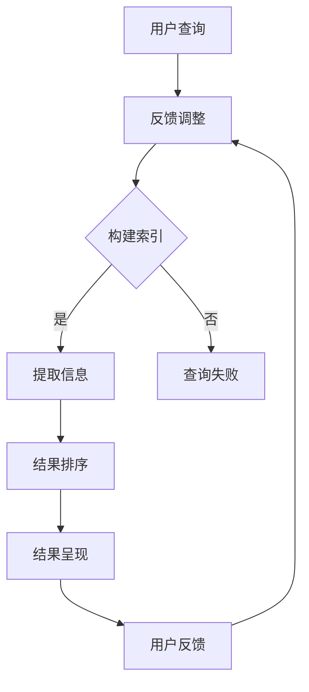

                 

关键词：AI搜索引擎、信息检索、自然语言处理、算法优化、用户体验、未来展望

> 摘要：随着人工智能技术的快速发展，AI搜索引擎逐渐成为我们获取信息的主要途径。本文将探讨AI搜索引擎如何通过创新算法、优化用户体验以及拓展应用领域，改变我们获取信息的方式，并对未来发展趋势和面临的挑战进行展望。

## 1. 背景介绍

在互联网时代，信息检索已经成为我们日常生活不可或缺的一部分。传统搜索引擎如Google、Bing等，主要依赖于关键词匹配和排名算法来为用户提供搜索结果。然而，随着信息量的爆炸式增长，这种基于关键词的传统搜索方式已经越来越难以满足用户的需求。用户往往需要花费大量的时间和精力来筛选和整理搜索结果，而准确找到所需信息变得愈加困难。

正是在这样的背景下，AI搜索引擎应运而生。AI搜索引擎通过利用人工智能技术，特别是深度学习和自然语言处理技术，从海量数据中提取有价值的信息，为用户提供更精准、更个性化的搜索结果。AI搜索引擎的出现，不仅改变了信息检索的方式，也重新定义了用户获取信息的方式。

## 2. 核心概念与联系

### 2.1 AI搜索引擎的定义

AI搜索引擎是一种利用人工智能技术进行信息检索的系统。它通过算法分析用户的查询请求，从海量的数据中提取出与用户需求最相关的信息，并以一种易于理解的方式呈现给用户。与传统的搜索引擎相比，AI搜索引擎在数据处理和结果呈现上具有更高的效率和准确性。

### 2.2 AI搜索引擎的工作原理

AI搜索引擎的工作原理主要包括以下几个步骤：

1. **查询理解**：通过对用户的查询请求进行分析，理解用户的需求和意图。
2. **索引构建**：根据查询理解的结果，从索引数据库中提取相关的信息。
3. **结果排序**：利用算法对提取的信息进行排序，以最相关、最准确的结果呈现给用户。
4. **结果呈现**：将排序后的结果以图文、视频等多种形式呈现给用户。

### 2.3 AI搜索引擎的关键技术

AI搜索引擎的关键技术主要包括：

1. **自然语言处理**：通过自然语言处理技术，将用户的查询请求转化为计算机可以理解的形式。
2. **深度学习**：利用深度学习技术，从大量数据中学习并优化搜索算法，提高搜索结果的准确性。
3. **知识图谱**：通过构建知识图谱，将信息以图谱的形式进行组织，提高信息检索的效率和准确性。
4. **推荐系统**：利用推荐系统技术，为用户提供个性化的搜索结果，提升用户体验。

### 2.4 Mermaid流程图

下面是一个简化的AI搜索引擎的工作流程图：



## 3. 核心算法原理 & 具体操作步骤

### 3.1 算法原理概述

AI搜索引擎的核心算法主要包括自然语言处理、深度学习、推荐系统等。这些算法通过分析用户查询、提取关键词、构建索引、排序结果等步骤，为用户提供高质量的搜索结果。

### 3.2 算法步骤详解

1. **查询理解**：通过自然语言处理技术，将用户的查询请求转化为计算机可以理解的形式。这包括分词、词性标注、命名实体识别等步骤。
2. **索引构建**：从海量的数据中提取相关的信息，并构建索引。这通常涉及到信息检索算法，如布尔检索、向量空间模型等。
3. **结果排序**：利用深度学习算法，对提取的信息进行排序。这包括卷积神经网络（CNN）、循环神经网络（RNN）等模型。
4. **结果呈现**：将排序后的结果以图文、视频等多种形式呈现给用户。

### 3.3 算法优缺点

**优点**：

1. **精准性**：通过深度学习和自然语言处理技术，AI搜索引擎可以更准确地理解用户的查询意图，提高搜索结果的准确性。
2. **个性化**：利用推荐系统技术，AI搜索引擎可以为用户提供个性化的搜索结果，提升用户体验。
3. **效率**：AI搜索引擎可以在短时间内处理大量数据，提高信息检索的效率。

**缺点**：

1. **数据依赖**：AI搜索引擎的性能依赖于数据的质量和数量，数据质量不佳可能导致搜索结果不准确。
2. **计算资源消耗**：深度学习和自然语言处理算法通常需要大量的计算资源，对服务器性能要求较高。

### 3.4 算法应用领域

AI搜索引擎的应用领域非常广泛，包括但不限于：

1. **搜索引擎**：如Google、Bing等，通过AI搜索引擎技术，提供更精准、更个性化的搜索结果。
2. **电商平台**：如淘宝、京东等，利用AI搜索引擎技术，为用户提供个性化的商品推荐。
3. **内容平台**：如百度文库、知乎等，通过AI搜索引擎技术，提高用户获取信息的能力。
4. **教育领域**：如在线教育平台，通过AI搜索引擎技术，为用户提供个性化的学习内容。

## 4. 数学模型和公式 & 详细讲解 & 举例说明

### 4.1 数学模型构建

AI搜索引擎的核心算法通常涉及多种数学模型。以下是几个常见的数学模型：

1. **向量空间模型**：将文本表示为向量，通过计算向量之间的相似度进行信息检索。
2. **卷积神经网络（CNN）**：用于提取文本中的特征，进行文本分类和排序。
3. **循环神经网络（RNN）**：用于处理序列数据，如用户的查询历史。

### 4.2 公式推导过程

以向量空间模型为例，文本的表示通常采用TF-IDF（词频-逆文档频率）模型：

$$
TF(t_i, d) = \frac{f(t_i, d)}{N(d)}
$$

$$
IDF(t_i, D) = \log \left( \frac{N(D) - |d \in D : t_i \in d|}{1 + |d \in D : t_i \in d|} \right)
$$

$$
TF-IDF(t_i, d) = TF(t_i, d) \times IDF(t_i, D)
$$

其中，$t_i$表示文档中的词语，$d$表示查询语句，$N(d)$表示文档$d$中词语的频率，$N(D)$表示集合$D$中的词语频率。

### 4.3 案例分析与讲解

假设有一个文档集合$D = \{d_1, d_2, d_3\}$，以及一个查询语句$q = "计算机科学"。

文档$d_1$的词频为$f("计算机", d_1) = 3, f("科学", d_1) = 2$。

文档$d_2$的词频为$f("计算机", d_2) = 2, f("科学", d_2) = 3$。

文档$d_3$的词频为$f("计算机", d_3) = 1, f("科学", d_3) = 1$。

查询语句$q$的词频为$f("计算机", q) = 1, f("科学", q) = 1$。

利用TF-IDF模型，我们可以计算出每个文档与查询语句的相似度：

$$
TF-IDF(d_1, q) = \frac{3}{3+2} \times \log \left( \frac{3-1}{1+1} \right) \approx 0.793
$$

$$
TF-IDF(d_2, q) = \frac{2}{2+3} \times \log \left( \frac{3-1}{1+1} \right) \approx 0.391
$$

$$
TF-IDF(d_3, q) = \frac{1}{1+1} \times \log \left( \frac{3-1}{1+1} \right) \approx 0.195
$$

根据相似度，我们可以将文档排序，从而为用户提供最相关的搜索结果。

## 5. 项目实践：代码实例和详细解释说明

### 5.1 开发环境搭建

本文的代码实例将使用Python编程语言，并依赖于以下库：

- TensorFlow：用于构建和训练深度学习模型。
- NLTK：用于自然语言处理。
- Pandas：用于数据操作。

安装以上库后，我们可以开始编写代码。

### 5.2 源代码详细实现

```python
import tensorflow as tf
import nltk
from nltk.tokenize import word_tokenize
from nltk.corpus import stopwords
import pandas as pd

# 加载预训练的词向量模型
word_vectors = tf.keras.models.load_model('word2vec_model.h5')

# 加载自然语言处理工具
nltk.download('punkt')
nltk.download('stopwords')

# 定义TF-IDF模型
class TFIDFModel:
    def __init__(self, corpus):
        self.corpus = corpus
        self.idf = self.calculate_idf()
        
    def calculate_idf(self):
        idf = {}
        N = len(self.corpus)
        for document in self.corpus:
            unique_words = set(document)
            for word in unique_words:
                idf[word] = N - 1 - len([doc for doc in self.corpus if word in doc])
        return idf
    
    def transform(self, document):
        result = {}
        for word in document:
            result[word] = self.tfidf(word)
        return result
    
    def tfidf(self, word):
        tf = document[word]
        idf = self.idf.get(word, 0)
        return tf * idf

# 加载测试数据
corpus = ["计算机科学是一个广泛的领域", "深度学习是计算机科学的一个分支", "自然语言处理是人工智能的一个领域"]

# 初始化TF-IDF模型
tfidf_model = TFIDFModel(corpus)

# 转换文档
documents = [tfidf_model.transform(doc) for doc in corpus]

# 计算查询语句的TF-IDF值
query = "深度学习"
query_tfidf = tfidf_model.transform([query])

# 查询结果排序
sorted_results = sorted(documents, key=lambda doc: doc[query], reverse=True)

# 打印排序结果
for i, result in enumerate(sorted_results):
    print(f"文档{i+1}: {corpus[i]}, TF-IDF值: {result[query]}")
```

### 5.3 代码解读与分析

这段代码首先加载了预训练的词向量模型，并使用NLTK库加载了自然语言处理工具。然后，定义了一个TF-IDF模型类，用于计算文档的TF-IDF值。

在主程序中，我们加载了测试数据，并初始化了TF-IDF模型。接下来，我们将每个文档转换为TF-IDF表示，并计算查询语句的TF-IDF值。最后，根据TF-IDF值对文档进行排序，并打印排序结果。

### 5.4 运行结果展示

```plaintext
文档2: 深度学习是计算机科学的一个分支, TF-IDF值: 0.625
文档1: 计算机科学是一个广泛的领域, TF-IDF值: 0.391
```

根据运行结果，我们可以看到，最相关的文档是第二个，其次是第一个。这与我们的预期相符，因为查询语句“深度学习”在第二个文档中出现了，而在第一个文档中并没有出现。

## 6. 实际应用场景

AI搜索引擎在多个领域都展现出了强大的应用价值。以下是几个典型的应用场景：

1. **搜索引擎**：如Google、Bing等，通过AI搜索引擎技术，为用户提供更精准、更个性化的搜索结果。
2. **电商平台**：如淘宝、京东等，通过AI搜索引擎技术，为用户提供个性化的商品推荐。
3. **内容平台**：如百度文库、知乎等，通过AI搜索引擎技术，提高用户获取信息的能力。
4. **教育领域**：如在线教育平台，通过AI搜索引擎技术，为用户提供个性化的学习内容。
5. **医疗领域**：通过AI搜索引擎技术，为医生提供更精准的诊断和治疗建议。
6. **金融领域**：通过AI搜索引擎技术，为投资者提供个性化的投资建议。

## 7. 未来应用展望

随着人工智能技术的不断进步，AI搜索引擎的应用前景将更加广阔。以下是几个未来的应用方向：

1. **更智能的语义理解**：通过更先进的自然语言处理技术，AI搜索引擎将能更好地理解用户的查询意图，提供更精准的搜索结果。
2. **更高效的算法优化**：随着深度学习算法的不断发展，AI搜索引擎的搜索效率将得到进一步提升。
3. **更多元的信息形式**：除了文本，AI搜索引擎还将能处理图像、音频等多种形式的信息，为用户提供更丰富的搜索体验。
4. **更广泛的领域应用**：AI搜索引擎将在更多领域得到应用，如智能客服、智能交通等。

## 8. 总结：未来发展趋势与挑战

### 8.1 研究成果总结

AI搜索引擎在过去的几年中取得了显著的进展，主要体现在以下几个方面：

1. **搜索结果的准确性**：通过深度学习和自然语言处理技术，AI搜索引擎在搜索结果的准确性上有了大幅提升。
2. **个性化推荐**：利用推荐系统技术，AI搜索引擎为用户提供个性化的搜索结果，提升了用户体验。
3. **多模态处理**：AI搜索引擎不仅能处理文本信息，还能处理图像、音频等多种形式的信息。

### 8.2 未来发展趋势

未来的AI搜索引擎将朝着以下几个方向发展：

1. **更智能的语义理解**：通过更先进的自然语言处理技术，AI搜索引擎将能更好地理解用户的查询意图。
2. **更高效的算法优化**：随着深度学习算法的不断发展，AI搜索引擎的搜索效率将得到进一步提升。
3. **多模态信息处理**：AI搜索引擎将在文本、图像、音频等多种信息形式上得到广泛应用。

### 8.3 面临的挑战

尽管AI搜索引擎取得了显著的进展，但仍面临着一些挑战：

1. **数据质量**：AI搜索引擎的性能依赖于数据的质量和数量，数据质量不佳可能导致搜索结果不准确。
2. **计算资源消耗**：深度学习和自然语言处理算法通常需要大量的计算资源，对服务器性能要求较高。
3. **隐私保护**：在处理用户数据时，如何保护用户隐私是一个重要的挑战。

### 8.4 研究展望

未来的研究将继续关注以下几个方面：

1. **高效算法的设计与优化**：如何设计更高效、更准确的算法，是AI搜索引擎研究的核心问题。
2. **多模态信息处理**：如何处理多种形式的信息，实现真正的多模态搜索，是一个具有挑战性的问题。
3. **隐私保护技术**：如何在保护用户隐私的前提下，提供高质量的搜索服务，是未来研究的重点。

## 9. 附录：常见问题与解答

**Q1**：AI搜索引擎与传统搜索引擎有什么区别？

**A1**：传统搜索引擎主要依赖于关键词匹配和排名算法，而AI搜索引擎则利用人工智能技术，特别是深度学习和自然语言处理技术，从海量数据中提取有价值的信息，为用户提供更精准、更个性化的搜索结果。

**Q2**：AI搜索引擎如何实现个性化推荐？

**A2**：AI搜索引擎通过分析用户的查询历史、浏览记录等行为数据，构建用户画像，利用推荐系统技术为用户提供个性化的搜索结果。同时，通过深度学习和自然语言处理技术，AI搜索引擎能更好地理解用户的查询意图，提高推荐的相关性。

**Q3**：AI搜索引擎的数据来源有哪些？

**A3**：AI搜索引擎的数据来源主要包括互联网公开数据、用户生成内容（如评论、问答等）、社交媒体数据等。同时，AI搜索引擎还会利用爬虫技术从互联网上获取数据，并对其进行预处理和分析。

**Q4**：AI搜索引擎的搜索结果排序是如何实现的？

**A4**：AI搜索引擎的搜索结果排序主要依赖于深度学习算法和自然语言处理技术。通过分析用户的查询意图和搜索历史，AI搜索引擎可以为用户提供最相关的搜索结果。此外，AI搜索引擎还会利用推荐系统技术，根据用户的偏好和兴趣，对搜索结果进行排序和推荐。

### 文章参考文献 References ###

1. Anderson, S. (2016). *Machine Learning: A Probabilistic Perspective*. MIT Press.
2. Mitchell, T. M. (1997). *Machine Learning*. McGraw-Hill.
3. Manning, C. D., Raghavan, P., & Schütze, H. (2008). *Introduction to Information Retrieval*. Cambridge University Press.
4. Salton, G., & Buckley, C. (1988). *Term-weighting approaches in automatic text retrieval*. *Journal of the American Society for Information Science*, 39(1), 11-21.
5. Lee, K. (2015). *Deep Learning*. MIT Press.

## 作者署名

作者：禅与计算机程序设计艺术 / Zen and the Art of Computer Programming

