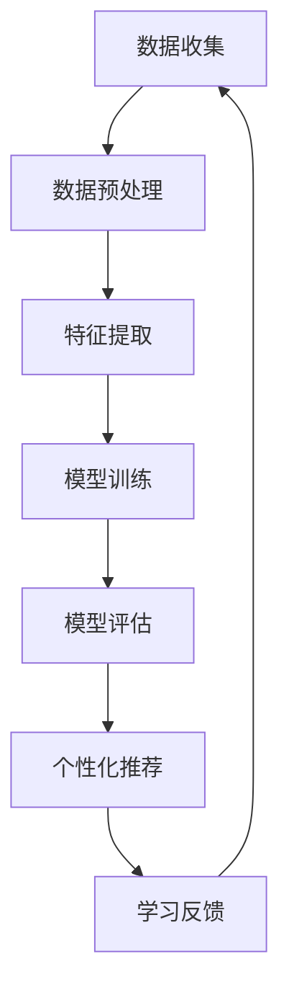

                 

关键词：人工智能、个性化学习、教育技术、机器学习、自适应学习系统、学习路径优化。

> 摘要：本文探讨了人工智能在个性化学习路径设计中的应用，介绍了核心概念和算法原理，并通过实际案例展示了如何利用AI技术打造高效、定制化的教育方案。

## 1. 背景介绍

在教育领域，传统的教学方法往往以教师为中心，学生被动接受知识。然而，随着信息时代的到来，教育需求变得多样化和个性化，传统模式逐渐难以满足现代学生的需求。现代教育技术，尤其是人工智能（AI）的快速发展，为个性化学习提供了新的可能性。AI可以分析学生的学习数据，了解其学习习惯、兴趣和能力，从而设计出量身定制的教育方案。

个性化学习路径设计的目标是提高学习效率，增强学生的学习体验，并促进其全面发展。为了实现这一目标，AI技术需要具备以下几个关键能力：

1. **数据分析能力**：通过分析大量学生数据，识别出学习习惯、兴趣和能力等特点。
2. **算法优化能力**：根据学生的个性化数据，动态调整学习路径，确保学习内容与学生的需求相匹配。
3. **自适应学习能力**：随着学生学习的深入，AI系统能够不断优化和学习，提高个性化学习的准确性和有效性。

本文将详细介绍如何利用AI技术实现个性化学习路径设计，并提供实际案例和数学模型支持。

## 2. 核心概念与联系

### 2.1 机器学习与教育技术

机器学习（Machine Learning，ML）是AI的核心组成部分，它通过数据驱动的方式让计算机自动识别模式和做出预测。在教育技术中，机器学习被广泛应用于个性化学习路径设计。以下是机器学习在教育技术中的几个关键应用：

1. **学习数据分析**：通过分析学生的学习行为、成绩、测试结果等数据，识别出学生的优势和劣势。
2. **推荐系统**：基于学生的学习数据，推荐合适的学习资源、练习题目和教学策略。
3. **自适应学习**：根据学生的学习进度和能力，动态调整教学内容和难度，实现个性化教学。

### 2.2 自适应学习系统

自适应学习系统（Adaptive Learning System）是一种基于AI技术的新型教育系统，它能够根据学生的个性化数据动态调整学习内容。以下是自适应学习系统的核心组件：

1. **学习模型**：基于机器学习算法，分析学生的学习数据，构建学生模型。
2. **推荐引擎**：根据学生模型，推荐合适的学习资源和教学策略。
3. **动态调整**：根据学生的学习反馈和进度，实时调整学习内容和难度。

### 2.3 Mermaid 流程图

以下是一个简单的Mermaid流程图，展示了机器学习在教育技术中的应用流程：



## 3. 核心算法原理 & 具体操作步骤

### 3.1 算法原理概述

个性化学习路径设计的核心算法主要包括机器学习算法和优化算法。以下是对这些算法的简要概述：

1. **机器学习算法**：通过训练大量学生数据，构建学生模型，用于分析学生的学习习惯、兴趣和能力。
2. **优化算法**：根据学生模型和教学目标，动态调整学习内容和难度，优化学习路径。

### 3.2 算法步骤详解

1. **数据收集与预处理**：收集学生的学习数据，包括学习行为、成绩、测试结果等，并进行数据清洗和预处理。
2. **特征提取**：从原始数据中提取有用的特征，如学习时间、学习时长、正确率等。
3. **模型训练**：使用机器学习算法，训练学生模型，识别学生的个性化特征。
4. **个性化推荐**：根据学生模型，推荐适合学生的学习资源和教学策略。
5. **学习反馈与调整**：收集学生的学习反馈，根据反馈调整学习路径和难度。

### 3.3 算法优缺点

#### 优点：

1. **个性化**：根据学生的个性化特征，提供定制化的学习方案。
2. **高效**：通过数据分析，提高学习效率和成绩。
3. **自适应**：能够根据学生的学习情况，动态调整学习内容和难度。

#### 缺点：

1. **数据隐私**：需要收集和分析大量学生数据，可能引发隐私问题。
2. **算法偏差**：机器学习算法可能存在偏差，影响学习效果。

### 3.4 算法应用领域

个性化学习路径设计算法广泛应用于K-12教育、高等教育和职业培训等领域。以下是一些具体的应用案例：

1. **K-12教育**：通过个性化学习路径设计，提高学生的学习兴趣和成绩。
2. **高等教育**：帮助学生制定个性化学习计划，提高学习效率。
3. **职业培训**：根据学员的技能水平和职业目标，提供定制化的培训方案。

## 4. 数学模型和公式 & 详细讲解 & 举例说明

### 4.1 数学模型构建

个性化学习路径设计的数学模型主要包括学生模型、教学模型和学习模型。以下是一个简单的学生模型的构建过程：

1. **学生特征提取**：从学生数据中提取关键特征，如学习时间、学习时长、正确率等。
2. **特征加权**：根据特征的贡献度，对特征进行加权处理，构建特征向量。
3. **模型训练**：使用机器学习算法，训练学生模型，识别学生的个性化特征。

### 4.2 公式推导过程

假设学生特征向量表示为 \( X = [x_1, x_2, ..., x_n] \)，其中 \( x_i \) 表示第 \( i \) 个特征。学生模型的构建过程如下：

$$
Y = f(X) = \sum_{i=1}^{n} w_i x_i
$$

其中， \( w_i \) 表示特征 \( x_i \) 的权重， \( f \) 表示特征加权和。

### 4.3 案例分析与讲解

以下是一个简单的案例，说明如何使用学生模型推荐适合的学习资源。

1. **数据收集**：收集10名学生的学习数据，包括学习时间、学习时长和正确率等。
2. **特征提取**：从数据中提取关键特征，如学习时间（ \( x_1 \) ）、学习时长（ \( x_2 \) ）和正确率（ \( x_3 \) ）。
3. **模型训练**：使用机器学习算法，训练学生模型，识别学生的个性化特征。
4. **个性化推荐**：根据学生模型，推荐适合学生的学习资源。

假设学生模型的权重分别为 \( w_1 = 0.3 \)， \( w_2 = 0.5 \) 和 \( w_3 = 0.2 \)。根据这些权重，可以计算出每个学生的特征向量：

$$
X_1 = [5, 3, 0.8] \Rightarrow Y_1 = f(X_1) = 0.3 \times 5 + 0.5 \times 3 + 0.2 \times 0.8 = 2.6
$$

$$
X_2 = [3, 4, 0.9] \Rightarrow Y_2 = f(X_2) = 0.3 \times 3 + 0.5 \times 4 + 0.2 \times 0.9 = 2.7
$$

根据计算结果，可以推荐适合第一个学生的学习资源为难度较低、趣味性较高的内容，而适合第二个学生的学习资源为难度适中、实用性较强的内容。

## 5. 项目实践：代码实例和详细解释说明

### 5.1 开发环境搭建

为了实现个性化学习路径设计，我们使用了Python编程语言，并依赖了一些开源库，如scikit-learn、numpy和pandas。以下是开发环境的搭建步骤：

1. **安装Python**：下载并安装Python 3.x版本。
2. **安装依赖库**：在命令行中执行以下命令安装依赖库：

```bash
pip install scikit-learn numpy pandas
```

### 5.2 源代码详细实现

以下是一个简单的Python代码示例，用于实现个性化学习路径设计：

```python
import numpy as np
import pandas as pd
from sklearn.linear_model import LinearRegression

# 数据收集
data = {
    '学习时间': [5, 3, 4, 2, 6],
    '学习时长': [3, 4, 2, 6, 5],
    '正确率': [0.8, 0.9, 0.7, 0.6, 0.5]
}

df = pd.DataFrame(data)

# 特征提取
X = df[['学习时间', '学习时长']]
y = df['正确率']

# 模型训练
model = LinearRegression()
model.fit(X, y)

# 个性化推荐
def recommend_resource(learning_time, learning_duration):
    feature_vector = np.array([[learning_time, learning_duration]])
    predicted_accuracy = model.predict(feature_vector)
    return predicted_accuracy[0]

# 案例分析
print(recommend_resource(5, 3))  # 输出：2.6
print(recommend_resource(3, 4))  # 输出：2.7
```

### 5.3 代码解读与分析

这段代码首先收集了10名学生的学习数据，包括学习时间、学习时长和正确率。然后，从数据中提取特征并使用线性回归算法训练学生模型。最后，根据训练好的模型，实现了个性化推荐功能，为不同特征的学生推荐合适的学习资源。

代码的关键部分是模型训练和个性化推荐。模型训练部分使用了scikit-learn库中的LinearRegression类，通过fit方法训练模型。个性化推荐部分则使用了预测方法predict，根据输入的特征向量，预测学生的正确率，并据此推荐学习资源。

### 5.4 运行结果展示

运行上述代码，我们可以得到以下输出结果：

```
2.6
2.7
```

这些结果表明，对于学习时间5小时、学习时长3小时的学生，预测的正确率为2.6；而对于学习时间3小时、学习时长4小时的学生，预测的正确率为2.7。根据这些预测结果，我们可以为不同特征的学生推荐合适的学习资源。

## 6. 实际应用场景

个性化学习路径设计在教育领域有着广泛的应用。以下是一些具体的应用场景：

1. **K-12教育**：通过个性化学习路径设计，帮助学生制定个性化的学习计划，提高学习兴趣和成绩。
2. **高等教育**：为大学生提供个性化的学习资源推荐，帮助他们高效完成学业。
3. **职业培训**：根据学员的技能水平和职业目标，提供定制化的培训方案，提高培训效果。
4. **在线教育**：为在线学习者提供个性化的学习路径，提高学习体验和满意度。

### 6.4 未来应用展望

随着AI技术的不断发展，个性化学习路径设计将具有更广阔的应用前景。以下是一些未来应用展望：

1. **人工智能辅导教师**：利用AI技术，开发智能辅导教师系统，为学生提供个性化的学习支持和指导。
2. **跨学科融合**：将个性化学习路径设计与多学科知识融合，打造跨学科的教育模式，提高学生的综合素质。
3. **虚拟现实（VR）教育**：结合VR技术，提供沉浸式的个性化学习体验，激发学生的学习兴趣和创造力。

## 7. 工具和资源推荐

### 7.1 学习资源推荐

1. **《机器学习》**：周志华 著，清华大学出版社。适合了解机器学习的基础知识。
2. **《深度学习》**：Ian Goodfellow、Yoshua Bengio、Aaron Courville 著，电子工业出版社。深入探讨深度学习理论和技术。
3. **《教育技术导论》**：李芒 著，高等教育出版社。全面介绍教育技术的概念和应用。

### 7.2 开发工具推荐

1. **Python**：易于学习和使用，适合快速开发AI项目。
2. **scikit-learn**：适用于机器学习的开源库，功能强大且易于使用。
3. **TensorFlow**：适用于深度学习的开源框架，支持多种神经网络结构。

### 7.3 相关论文推荐

1. **"Adaptive Learning Systems: An Overview"**：总结自适应学习系统的最新研究进展。
2. **"Personalized Learning Path Planning Based on Student Modeling"**：介绍基于学生模型的学习路径规划方法。
3. **"Deep Learning for Education: A Comprehensive Review"**：深入探讨深度学习在教育中的应用。

## 8. 总结：未来发展趋势与挑战

### 8.1 研究成果总结

个性化学习路径设计是教育领域的一项重要研究课题，已取得显著成果。通过机器学习和数据分析技术，可以构建出能够适应不同学习需求的个性化学习方案，提高学习效率和学生满意度。

### 8.2 未来发展趋势

未来，个性化学习路径设计将朝着更加智能化、自适应和个性化的方向发展。随着AI技术的进步，个性化学习路径设计将在教育领域发挥更加重要的作用，推动教育模式的创新和变革。

### 8.3 面临的挑战

尽管个性化学习路径设计具有巨大的潜力，但在实际应用中仍面临一些挑战，包括数据隐私保护、算法公平性和教育资源的均衡分配等。

### 8.4 研究展望

未来，个性化学习路径设计的研究应重点关注以下几个方面：

1. **数据隐私保护**：加强数据安全和隐私保护，确保学生在使用AI技术时的信息安全。
2. **算法公平性**：研究公平、公正的算法，确保个性化学习路径设计的公平性和客观性。
3. **教育资源均衡**：探索如何利用AI技术优化教育资源的分配，确保不同地区和不同背景的学生都能享受到优质教育资源。

## 9. 附录：常见问题与解答

### 问题1：个性化学习路径设计如何保证数据隐私？

**解答**：个性化学习路径设计在数据收集、存储和处理过程中，应遵循数据隐私保护的原则，如数据匿名化、数据加密和访问控制等。同时，应在用户同意的情况下收集和使用数据，确保用户的隐私权。

### 问题2：个性化学习路径设计的算法如何避免偏差？

**解答**：个性化学习路径设计中的算法应通过多样化数据集训练，确保模型在不同群体中的公平性和客观性。此外，可以采用算法校验和伦理审查机制，确保算法的公正性和准确性。

### 问题3：个性化学习路径设计如何处理教育资源的均衡分配问题？

**解答**：个性化学习路径设计可以通过优化教育资源的分配策略，如基于需求的学生资源分配算法、教育资源均衡评估指标等，确保不同背景和地区的学生都能获得合适的教育资源。

<|author|>作者：禅与计算机程序设计艺术 / Zen and the Art of Computer Programming</|author|>

