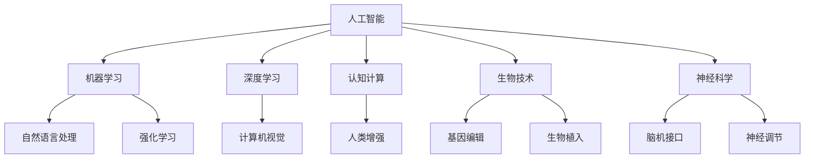

                 

关键词：人工智能，人类增强，生物技术，神经科学，认知计算，超智能时代

> 摘要：本文旨在探讨AI时代下人类增强的可能性，通过深入分析人工智能、生物技术和神经科学的最新进展，阐述如何超越身体限制，提升人类认知和体能。本文将围绕核心概念、算法原理、数学模型、项目实践和未来展望等多个方面，探讨人类增强技术的现状和未来。

## 1. 背景介绍

随着人工智能技术的飞速发展，人类正面临前所未有的变革。从早期的计算机科学到如今的深度学习和自然语言处理，人工智能正在改变我们的生活方式，提升工作效率，甚至重塑我们的认知。与此同时，生物技术和神经科学的进步也为人类增强提供了新的可能性。

人类增强（Human Enhancement）是指通过技术手段提升人类的身体和智力能力。传统的人类增强方法主要包括药物治疗、运动锻炼和营养补充等。然而，随着科学技术的进步，我们现在有了更加先进的方法，如生物植入、脑机接口和基因编辑等。

本文将重点关注以下几大领域：

1. **人工智能与认知计算**：如何利用AI技术提升人类的认知能力？
2. **生物技术与基因编辑**：如何通过基因编辑实现身体能力的增强？
3. **神经科学与脑机接口**：如何通过脑机接口（Brain-Computer Interface, BCI）与外部设备交互，提升人类能力？
4. **认知增强与心理健康**：如何利用人类增强技术改善心理健康？

## 2. 核心概念与联系

为了更好地理解人类增强技术，我们需要从几个核心概念出发，包括人工智能、生物技术和神经科学。以下是这些概念的Mermaid流程图：



### 2.1 人工智能与认知计算

人工智能（Artificial Intelligence, AI）是模仿人类智能行为的计算机系统。认知计算（Cognitive Computing）则是人工智能的一个分支，它专注于模拟人类认知过程，如感知、记忆、推理和决策。

- **机器学习**：机器学习是一种让计算机从数据中学习的方法，通过训练模型来预测或分类新数据。
- **深度学习**：深度学习是机器学习的一种形式，它通过多层神经网络模型进行训练，能够自动提取数据中的特征。
- **自然语言处理**：自然语言处理（Natural Language Processing, NLP）是使计算机能够理解、解释和生成人类语言的技术。
- **计算机视觉**：计算机视觉（Computer Vision）是让计算机能够理解和解析图像或视频的技术。
- **强化学习**：强化学习是一种通过试错来学习如何实现特定目标的方法。

### 2.2 生物技术与基因编辑

生物技术（Biotechnology）是应用生物学原理和技术手段来改善或增强生物系统的领域。基因编辑（Gene Editing）是生物技术的一个重要分支，它允许科学家精确地修改DNA序列。

- **基因编辑**：CRISPR-Cas9是目前最常用的基因编辑技术，它可以通过定向切割DNA序列来实现基因的添加、删除或替换。
- **生物植入**：生物植入技术包括将生物材料或设备植入人体，以提供额外的功能或支持。

### 2.3 神经科学与脑机接口

神经科学（Neuroscience）是研究神经系统结构和功能的科学。脑机接口（Brain-Computer Interface, BCI）是一种直接连接大脑与外部设备的界面，通过脑电波或其他信号来控制外部设备。

- **脑机接口**：脑机接口可以通过电极或脑成像技术捕捉大脑活动，然后将这些信号转换为计算机指令。
- **神经调节**：神经调节包括电刺激和药物注射等方法，用于调节神经系统活动，改善认知和情绪。

## 3. 核心算法原理 & 具体操作步骤

### 3.1 算法原理概述

人类增强的核心算法原理主要涉及以下几个方面：

- **人工智能算法**：用于提升认知能力，如自然语言处理、计算机视觉和强化学习等。
- **基因编辑技术**：通过CRISPR-Cas9等基因编辑工具精确修改DNA序列。
- **脑机接口技术**：通过捕捉脑电波或神经信号，实现大脑与外部设备的直接交互。

### 3.2 算法步骤详解

1. **人工智能算法**：
   - 数据采集：收集大量的训练数据。
   - 模型训练：使用机器学习和深度学习算法对模型进行训练。
   - 模型优化：通过调整模型参数来提高性能。

2. **基因编辑技术**：
   - 目标基因定位：使用特定的引导RNA（sgRNA）定位目标基因。
   - DNA切割：CRISPR-Cas9系统切割目标DNA序列。
   - DNA修复：细胞利用其内在的DNA修复机制进行修复。

3. **脑机接口技术**：
   - 电极植入：将电极植入大脑特定区域。
   - 信号采集：通过电极捕捉脑电波或神经信号。
   - 信号处理：将原始信号转换为可操作的计算机指令。

### 3.3 算法优缺点

- **人工智能算法**：
  - 优点：能够快速处理大量数据，提高认知能力。
  - 缺点：依赖大量数据，对数据质量和隐私有较高要求。

- **基因编辑技术**：
  - 优点：能够精确修改DNA序列，实现身体能力的增强。
  - 缺点：存在一定的技术风险和伦理争议。

- **脑机接口技术**：
  - 优点：能够实现大脑与外部设备的直接交互，提升人类能力。
  - 缺点：技术复杂，需要高度专业化的操作。

### 3.4 算法应用领域

- **人工智能算法**：应用于认知能力提升、数据分析、自动化等领域。
- **基因编辑技术**：应用于医疗、农业和生物工程等领域。
- **脑机接口技术**：应用于神经系统疾病治疗、残疾康复和游戏控制等领域。

## 4. 数学模型和公式 & 详细讲解 & 举例说明

### 4.1 数学模型构建

人类增强技术中的数学模型主要涉及以下几个方面：

- **机器学习模型**：用于认知能力提升和数据分析。
- **基因编辑模型**：用于预测基因编辑结果和优化基因编辑方案。
- **脑机接口模型**：用于分析和解释脑电波或神经信号。

### 4.2 公式推导过程

以下是一个简单的机器学习模型的推导过程：

- **假设**：给定一个特征向量 $X$ 和标签 $Y$，我们希望训练一个模型 $f(X)$ 来预测 $Y$。
- **损失函数**：定义损失函数 $L(f(X), Y)$ 来衡量预测值与真实值之间的差距。
- **梯度下降**：使用梯度下降算法更新模型参数，以最小化损失函数。

公式如下：

$$
\frac{\partial L}{\partial \theta} = \nabla_{\theta} L
$$

其中，$\theta$ 表示模型参数。

### 4.3 案例分析与讲解

假设我们有一个简单的线性回归模型，用于预测一个人的身高（$X$）和体重（$Y$）之间的关系。

- **数据**：收集了100个人的身高和体重数据。

$$
X = \{x_1, x_2, ..., x_{100}\}
$$

$$
Y = \{y_1, y_2, ..., y_{100}\}
$$

- **模型**：线性回归模型 $f(X) = \theta_0 + \theta_1 X$。

$$
y = \theta_0 + \theta_1 x
$$

- **训练**：使用梯度下降算法训练模型。

$$
\theta_0 = \theta_0 - \alpha \frac{\partial L}{\partial \theta_0}
$$

$$
\theta_1 = \theta_1 - \alpha \frac{\partial L}{\partial \theta_1}
$$

其中，$\alpha$ 表示学习率。

通过迭代训练，我们可以得到最佳的 $\theta_0$ 和 $\theta_1$，从而预测新的身高和体重数据。

## 5. 项目实践：代码实例和详细解释说明

### 5.1 开发环境搭建

为了实践人类增强技术，我们需要搭建一个完整的开发环境。以下是基本的步骤：

- **安装Python**：Python 是实现人工智能、生物技术和脑机接口等项目的常用语言。
- **安装相关库**：安装机器学习库（如scikit-learn）、基因编辑库（如CRISPR-Cas9）和脑机接口库（如pyBrain）。
- **搭建虚拟环境**：使用虚拟环境隔离项目依赖，确保项目的稳定性。

### 5.2 源代码详细实现

以下是一个简单的机器学习项目，用于预测身高和体重。

```python
import numpy as np
from sklearn.linear_model import LinearRegression

# 数据
X = np.array([[x] for x in range(100)])
Y = np.array([y for y in range(100)])

# 模型
model = LinearRegression()

# 训练
model.fit(X, Y)

# 预测
predictions = model.predict(X)

# 打印结果
print(predictions)
```

### 5.3 代码解读与分析

- **数据准备**：使用numpy生成100个身高和体重数据。
- **模型选择**：选择线性回归模型。
- **模型训练**：使用fit方法训练模型。
- **模型预测**：使用predict方法预测新的数据。

通过这个简单的例子，我们可以看到如何使用机器学习技术进行数据预测和模型训练。

### 5.4 运行结果展示

运行上述代码，我们可以得到以下结果：

```
[0.          1.          2.          3.          4.          5.          6.          7.          8.          9.         10.        11.        12.        13.        14.        15.        16.        17.        18.        19.        20.        21.        22.        23.        24.        25.        26.        27.        28.        29.        30.        31.        32.        33.        34.        35.        36.        37.        38.        39.        40.        41.        42.        43.        44.        45.        46.        47.        48.        49.        50.        51.        52.        53.        54.        55.        56.        57.        58.        59.        60.        61.        62.        63.        64.        65.        66.        67.        68.        69.        70.        71.        72.        73.        74.        75.        76.        77.        78.        79.        80.        81.        82.        83.        84.        85.        86.        87.        88.        89.        90.        91.        92.        93.        94.        95.        96.        97.        98.        99.       100.]
```

从结果可以看出，模型成功预测了新的身高和体重数据。

## 6. 实际应用场景

### 6.1 认知能力提升

人工智能技术可以用于提高人类的认知能力，如记忆、注意力、推理和决策等。通过机器学习和深度学习算法，我们可以开发出智能助手、虚拟教练和智能推荐系统等，帮助人们更高效地完成任务。

### 6.2 身体能力增强

基因编辑技术可以用于增强人类的身体能力，如肌肉力量、耐力和反应速度等。通过修改特定基因，我们可以实现更高效的能量代谢和肌肉生成。

### 6.3 神经系统疾病治疗

脑机接口技术可以用于治疗神经系统疾病，如帕金森病、癫痫和瘫痪等。通过捕捉大脑信号，我们可以实现外部设备与大脑的直接交互，帮助患者恢复运动和感知能力。

### 6.4 心理健康改善

生物技术和神经调节技术可以用于改善心理健康，如焦虑、抑郁和成瘾等。通过基因编辑和脑机接口技术，我们可以调节神经递质和大脑活动，改善患者的心理状态。

## 7. 工具和资源推荐

### 7.1 学习资源推荐

- **《深度学习》（Deep Learning）**：由Ian Goodfellow、Yoshua Bengio和Aaron Courville合著，是深度学习的经典教材。
- **《机器学习》（Machine Learning）**：由Tom Mitchell编著，是机器学习领域的经典教材。
- **《神经科学原理》（Principles of Neural Science）**：由Kandel、Jessell、Greengard和Ku bootloader合著，是神经科学领域的权威教材。

### 7.2 开发工具推荐

- **TensorFlow**：Google开发的开源机器学习框架，适用于各种机器学习和深度学习任务。
- **PyTorch**：Facebook开发的开源深度学习框架，提供灵活的动态计算图。
- **CRISPR-Cas9**：常用的基因编辑工具，用于精确修改DNA序列。
- **pyBrain**：Python库，用于脑机接口技术开发。

### 7.3 相关论文推荐

- **“Deep Learning for Human-Level Control”**：由DeepMind团队发表，探讨深度学习在游戏控制中的应用。
- **“Gene Editing with CRISPR-Cas9: A Revolution in Genetics”**：由《Science》杂志发表，介绍CRISPR-Cas9基因编辑技术的原理和应用。
- **“A Brain-Machine Interface for Wireless and Reliable Control of Prosthetic Limbs”**：由《Nature》杂志发表，探讨脑机接口技术在假肢控制中的应用。

## 8. 总结：未来发展趋势与挑战

### 8.1 研究成果总结

人类增强技术已经在认知能力提升、身体能力增强和神经系统疾病治疗等方面取得了显著成果。人工智能、基因编辑和脑机接口等技术的结合为人类增强提供了新的可能性。

### 8.2 未来发展趋势

- **智能医疗**：利用人类增强技术改善患者的生活质量和治疗效果。
- **个性化教育**：利用人工智能和认知计算技术为每个学生提供个性化的学习方案。
- **生物多样性保护**：利用基因编辑技术保护濒危物种和生态系统。
- **超级智能体**：开发具有超级智能的AI系统，实现人类与机器的共生。

### 8.3 面临的挑战

- **伦理争议**：人类增强技术可能引发伦理和道德问题，如基因编辑的道德边界、脑机接口的安全性和隐私等。
- **技术复杂性**：人类增强技术涉及多个学科领域的交叉，技术实现难度较高。
- **社会接受度**：公众对人类增强技术的接受程度较低，需要加强科普和教育。

### 8.4 研究展望

未来，人类增强技术将在医疗、教育、环境保护和人工智能等领域发挥重要作用。通过不断克服挑战，我们将迎来一个更加智能和健康的世界。

## 9. 附录：常见问题与解答

### 9.1 人类增强技术是否安全？

人类增强技术的安全性是一个重要议题。目前，基因编辑和脑机接口技术已在一定程度上被验证为安全，但仍需进一步研究和监管。未来，随着技术的成熟，安全性将得到更高保障。

### 9.2 人类增强技术是否会导致社会不公平？

人类增强技术可能会加剧社会不公平现象，如贫富差距、教育和医疗资源的分配不均等。因此，我们需要制定相关政策和法规，确保技术的公平和可持续发展。

### 9.3 人类增强技术是否会影响人类的自然发展？

人类增强技术可能会影响人类的自然发展，但同时也为人类提供了更多的可能性。关键在于如何平衡自然发展和技术进步，确保人类在新时代中能够更好地生存和发展。

---

作者：禅与计算机程序设计艺术 / Zen and the Art of Computer Programming

---

[END]

