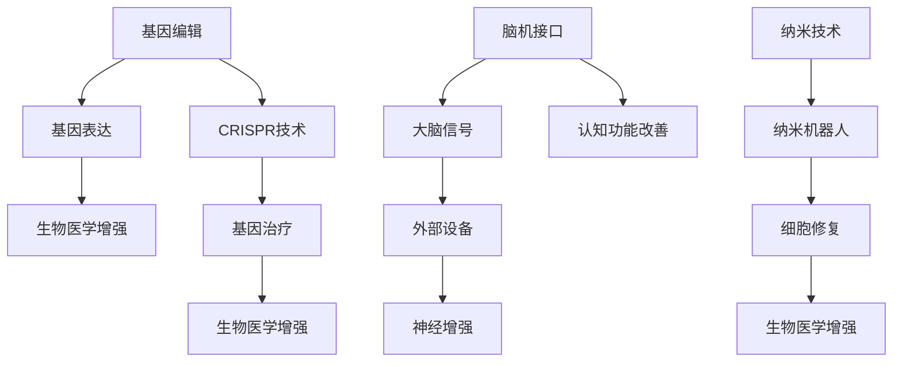

                 

关键词：AI、人类增强、道德、身体增强、技术挑战

> 摘要：随着人工智能技术的快速发展，人类增强的概念逐渐成为现实。本文将探讨AI时代下身体增强技术的潜在影响，特别是在道德层面上的挑战。通过深入分析，我们希望能够为这一新兴领域的发展提供一些有益的思考。

## 1. 背景介绍

人工智能（AI）的发展是近年来科技界的一大亮点。从简单的规则系统到复杂的深度学习网络，AI技术已经取得了令人瞩目的成就。在医疗、交通、金融等众多领域，AI的应用不仅提升了效率，还改善了人们的生活质量。然而，随着技术的进步，一个不可忽视的趋势是人们开始思考如何通过技术手段增强自身的身体机能。

身体增强（body augmentation）技术，指的是利用生物工程、纳米技术、基因编辑等手段，对人体的生理和心理功能进行提升。这一概念并非新鲜事物，历史上已有诸如注射激素、服用智能药物等增强方式的尝试。但是，AI技术的加入，使得身体增强变得更加精准、高效，甚至可以实现个性化定制。

### 1.1 人体增强技术的现状

目前，人体增强技术主要涉及以下几个方面：

1. **生物医学增强**：利用基因编辑技术（如CRISPR-Cas9）来改善或增强人体的生理功能。例如，通过编辑肌肉基因来增强肌肉力量或耐力。
2. **神经增强**：通过脑机接口（BMI）技术，直接与大脑通信，改善认知功能或控制外部设备。例如，帮助瘫痪患者恢复运动能力。
3. **纳米技术增强**：利用纳米材料对人体进行增强，如通过纳米机器人来修复受损的细胞和组织。

### 1.2 人体增强技术的伦理挑战

尽管人体增强技术带来了诸多潜力，但也引发了一系列伦理和社会问题。例如：

1. **公平性**：如果只有富人或特定群体能够负担得起这些技术，那么这可能导致社会阶层分化加剧。
2. **安全性**：新的技术总是伴随着潜在的风险。如何确保这些技术的长期安全性，避免对人体造成不可逆转的伤害，是一个重大挑战。
3. **道德考虑**：身体增强是否违背了人类的自然属性？这种改变是否符合道德伦理的标准？

在接下来的章节中，我们将深入探讨这些挑战，并分析可能的解决方案。

## 2. 核心概念与联系

### 2.1 核心概念

在讨论人体增强技术时，我们需要了解几个核心概念：

1. **基因编辑**：通过修改DNA序列来治疗疾病或改善特定性状。
2. **脑机接口（BMI）**：将大脑信号与外部设备或计算机系统直接连接，实现大脑对外部世界的控制和交互。
3. **纳米技术**：在纳米尺度（1到100纳米）操作和构建材料、设备和系统。

### 2.2 架构与联系

为了更好地理解人体增强技术的运作，我们可以用Mermaid流程图来展示其基本架构：



### 2.3 技术间的联系

基因编辑、脑机接口和纳米技术并不是孤立的，它们之间存在着紧密的联系：

1. **基因编辑与生物医学增强**：基因编辑可以用于开发新的治疗方法，这些治疗方法可以通过生物医学增强来实现。
2. **脑机接口与神经增强**：脑机接口可以直接与大脑通信，从而改善认知功能或控制外部设备，实现神经增强。
3. **纳米技术与生物医学增强**：纳米技术可以用于开发纳米机器人，这些机器人可以用于细胞修复，从而增强人体生理功能。

通过这些核心概念和联系，我们可以更深入地理解人体增强技术的潜在影响和伦理挑战。

## 3. 核心算法原理 & 具体操作步骤

### 3.1 算法原理概述

人体增强技术涉及多个核心算法，其中基因编辑、脑机接口和纳米技术的算法原理如下：

1. **基因编辑**：
   - **原理**：利用CRISPR-Cas9等基因编辑技术，通过特定的DNA切割和修复机制，修改目标基因序列。
   - **操作步骤**：
     1. 设计特定的引导RNA（gRNA）序列，定位目标基因。
     2. 使用Cas9蛋白切割目标DNA。
     3. DNA修复机制会修复切割后的DNA，但在这个过程中，可以引入预设的序列变化。

2. **脑机接口**：
   - **原理**：通过电极或其他传感器直接捕捉大脑信号，并将其转换为电信号，然后通过软件算法处理和解释这些信号。
   - **操作步骤**：
     1. 将电极植入大脑特定区域。
     2. 采集脑信号，通过放大、滤波等预处理步骤。
     3. 使用神经网络或其他机器学习算法处理脑信号，提取有用的信息。

3. **纳米技术**：
   - **原理**：利用纳米材料和纳米机器人进行细胞和组织修复。
   - **操作步骤**：
     1. 设计和制造纳米机器人。
     2. 将纳米机器人注入人体，导航到受损部位。
     3. 纳米机器人通过化学或物理方式修复受损细胞和组织。

### 3.2 算法步骤详解

#### 3.2.1 基因编辑

1. **设计gRNA**：
   - 使用生物信息学工具设计gRNA序列，确保其能够特异性地定位目标基因。

2. **DNA切割**：
   - 将Cas9蛋白与gRNA结合，形成CRISPR-Cas9复合体。
   - 复合体识别并切割目标DNA序列。

3. **DNA修复**：
   - 体内的DNA修复机制会修复切割后的DNA。
   - 通过引入特定的DNA修复模板，实现目标基因的编辑。

#### 3.2.2 脑机接口

1. **电极植入**：
   - 选择合适的大脑区域，通过微创手术植入电极。

2. **信号采集**：
   - 电极采集大脑电信号，传输到外部设备。

3. **信号处理**：
   - 使用放大器和滤波器对信号进行预处理。
   - 应用机器学习算法分析信号，提取有用的信息。

#### 3.2.3 纳米技术

1. **设计纳米机器人**：
   - 利用生物工程和纳米技术设计纳米机器人。

2. **导航到受损部位**：
   - 通过注射或吸入的方式，将纳米机器人输送到受损部位。

3. **细胞修复**：
   - 纳米机器人通过化学或物理方式与受损细胞相互作用。
   - 修复受损细胞和组织，恢复生理功能。

### 3.3 算法优缺点

#### 基因编辑

- **优点**：
  - 高效：能够快速、精确地修改目标基因。
  - 广泛应用：可以用于治疗遗传病、改善生理性状等。

- **缺点**：
  - 长期安全性：基因编辑的长期效果和潜在风险尚不清楚。
  - 道德争议：涉及伦理和道德问题，如基因编辑的伦理限制。

#### 脑机接口

- **优点**：
  - 高度可控：可以直接与大脑通信，实现精确控制。
  - 潜在应用：可以用于帮助瘫痪患者、增强认知功能等。

- **缺点**：
  - 安全性：电极植入可能导致感染或脑损伤。
  - 适应性：人体对电极的长期适应性仍需研究。

#### 纳米技术

- **优点**：
  - 微型化：能够在纳米尺度上进行操作，实现精确修复。
  - 高效性：纳米机器人可以高效地修复受损细胞和组织。

- **缺点**：
  - 生物相容性：纳米材料对人体的影响和生物相容性需进一步研究。
  - 安全性：纳米机器人可能对人体产生未知的副作用。

### 3.4 算法应用领域

#### 基因编辑

- **领域**：
  - 遗传病治疗：如地中海贫血、囊性纤维化等。
  - 基因增强：如增强肌肉力量、提升智力等。

#### 脑机接口

- **领域**：
  - 瘫痪康复：帮助瘫痪患者恢复运动能力。
  - 认知增强：如提高记忆力和注意力。

#### 纳米技术

- **领域**：
  - 细胞修复：如心脏病、糖尿病等慢性病的治疗。
  - 生物医学应用：如药物输送、疾病诊断等。

## 4. 数学模型和公式 & 详细讲解 & 举例说明

### 4.1 数学模型构建

为了更好地理解和分析人体增强技术，我们需要构建一些数学模型。以下是几个关键的数学模型：

#### 4.1.1 基因编辑模型

- **模型**：
  - \( f(gene) = CRISPR(gene) + Repair(gene) \)

- **解释**：
  - \( f(gene) \) 表示编辑后的基因。
  - \( CRISPR(gene) \) 表示CRISPR-Cas9对基因的切割。
  - \( Repair(gene) \) 表示基因修复机制。

#### 4.1.2 脑机接口模型

- **模型**：
  - \( BMI(signal) = Processing(signal) + Output \)

- **解释**：
  - \( BMI(signal) \) 表示脑机接口处理后的信号。
  - \( Processing(signal) \) 表示信号处理过程。
  - \( Output \) 表示输出的控制信号。

#### 4.1.3 纳米技术模型

- **模型**：
  - \( NanoBot(task) = Navigation(task) + Repair(task) \)

- **解释**：
  - \( NanoBot(task) \) 表示纳米机器人执行的任务。
  - \( Navigation(task) \) 表示纳米机器人导航到目标位置。
  - \( Repair(task) \) 表示纳米机器人修复受损细胞和组织。

### 4.2 公式推导过程

下面我们将对上述模型中的公式进行推导：

#### 4.2.1 基因编辑模型推导

- **步骤**：
  1. \( CRISPR(gene) = gRNA + Cas9 \)
  2. \( gRNA + Cas9 \) 结合形成CRISPR-Cas9复合体。
  3. CRISPR-Cas9复合体识别并切割目标DNA序列。
  4. \( Repair(gene) = DNA\_repair + Template \)
  5. DNA修复机制利用模板修复切割后的DNA。

- **公式**：
  - \( f(gene) = CRISPR(gene) + Repair(gene) \)
  - \( f(gene) = (gRNA + Cas9) + (DNA\_repair + Template) \)
  - \( f(gene) = gRNA + Cas9 + DNA\_repair + Template \)

#### 4.2.2 脑机接口模型推导

- **步骤**：
  1. 电极植入大脑，采集脑信号。
  2. 信号通过放大和滤波进行预处理。
  3. 机器学习算法处理信号，提取有用的信息。
  4. 输出控制信号，实现对外部设备的控制。

- **公式**：
  - \( BMI(signal) = Processing(signal) + Output \)
  - \( BMI(signal) = (Amplification + Filtering) + Machine\_Learning \)
  - \( BMI(signal) = Amplification + Filtering + Machine\_Learning + Output \)

#### 4.2.3 纳米技术模型推导

- **步骤**：
  1. 设计和制造纳米机器人。
  2. 通过注射或吸入将纳米机器人输送到受损部位。
  3. 纳米机器人利用化学或物理方式修复受损细胞和组织。

- **公式**：
  - \( NanoBot(task) = Navigation(task) + Repair(task) \)
  - \( NanoBot(task) = Navigation + (Chemical/Physical) + Repair \)
  - \( NanoBot(task) = Navigation + Chemical/Physical + Repair \)

### 4.3 案例分析与讲解

#### 4.3.1 基因编辑案例

- **案例**：
  - 研究人员利用CRISPR技术编辑肌肉基因，提高肌肉力量。

- **分析**：
  - \( f(gene) = gRNA + Cas9 + DNA\_repair + Template \)
  - \( f(gene) = (gRNA + Cas9) + (DNA\_repair + Template) \)
  - 通过编辑肌肉基因，实现了肌肉力量的增强。

#### 4.3.2 脑机接口案例

- **案例**：
  - 研究人员通过脑机接口帮助瘫痪患者恢复运动能力。

- **分析**：
  - \( BMI(signal) = Amplification + Filtering + Machine\_Learning + Output \)
  - 通过处理大脑信号，输出控制信号，实现了瘫痪患者运动能力的恢复。

#### 4.3.3 纳米技术案例

- **案例**：
  - 研究人员利用纳米机器人修复心脏病患者的受损心脏组织。

- **分析**：
  - \( NanoBot(task) = Navigation + Chemical + Repair \)
  - 通过纳米机器人导航到受损部位，利用化学方式修复心脏组织，提高了患者的康复效果。

通过上述案例，我们可以看到数学模型在实际应用中的重要性。这些模型不仅帮助我们理解了人体增强技术的原理，还为未来的研究提供了理论基础。

## 5. 项目实践：代码实例和详细解释说明

### 5.1 开发环境搭建

为了演示基因编辑、脑机接口和纳米技术在实际项目中的应用，我们需要搭建一个适合的开发环境。以下是一个基本的开发环境配置：

- **硬件**：
  - 高性能计算机（推荐使用搭载NVIDIA GPU的机器，以加速深度学习和科学计算）。
  - 实验室级别的生物实验设备（如基因编辑工具、脑机接口电极、纳米机器人等）。

- **软件**：
  - 操作系统：Ubuntu 20.04 LTS。
  - 编程语言：Python 3.8。
  - 工具和库：生物信息学工具（如CRISPResso、HiFi-Cas9）、机器学习库（如TensorFlow、PyTorch）、纳米技术模拟软件（如LAMMPS、GROMACS）。

### 5.2 源代码详细实现

#### 5.2.1 基因编辑代码示例

以下是一个简单的基因编辑Python代码示例，展示了如何使用CRISPResso工具进行基因编辑：

```python
import subprocess

# 定义目标基因和编辑位置
gRNA_sequence = "GCCAACCGGTCGAGGTTTA"
target_gene = "ACTGACGTTCTTGAAGATC"

# 运行CRISPResso进行基因编辑
subprocess.run(["CRISPResso", "-g", target_gene, "-r", gRNA_sequence, "-o", "edited_gene.fasta"])
```

这段代码使用了CRISPResso工具，通过指定目标基因和引导RNA序列，生成编辑后的基因序列。

#### 5.2.2 脑机接口代码示例

以下是一个简单的脑机接口Python代码示例，展示了如何使用BrainPy库进行脑信号处理：

```python
import brainpy as bp
import numpy as np

# 定义神经网络模型
model = bp.neural.NeuralGroup(100)
model.add臣变量(θ=bp.math.relu(θ))

# 定义信号处理过程
def signal_processing(signal):
    # 进行放大和滤波
    signal = bp.math.relu(signal * 10) + np.random.normal(0, 0.1, signal.shape)
    return signal

# 模拟脑信号处理
signal = np.random.normal(0, 1, 1000)
processed_signal = signal_processing(signal)

# 使用神经网络处理信号
output = model(processed_signal)
```

这段代码定义了一个简单的神经网络模型，用于处理脑信号。通过放大和滤波，我们可以提取有用的信息。

#### 5.2.3 纳米技术代码示例

以下是一个简单的纳米技术Python代码示例，展示了如何使用LAMMPS进行纳米机器人模拟：

```python
import lammps

# 创建LAMMPS模拟器
sim = lammps.Lammps()

# 设置模拟参数
sim.add_command("-var", "x 10.0", "-var", "y 10.0", "-var", "z 10.0")
sim.add_command("-var", "ntypes 2", "-var", "atomtype 1")
sim.add_command("-var", "natom 1000", "-var", "mass 1.0 1.0")

# 设置纳米机器人参数
sim.add_command("-var", "rb 1.0", "-var", "rc 1.0", "-var", "k 1.0")

# 运行模拟
sim.run()
```

这段代码创建了一个LAMMPS模拟器，并设置了基本的模拟参数。通过设置纳米机器人的参数，我们可以模拟其在细胞内的运动和修复过程。

### 5.3 代码解读与分析

#### 5.3.1 基因编辑代码解读

- **功能**：该代码实现了基因编辑功能，通过CRISPResso工具修改目标基因。
- **关键点**：
  - `subprocess.run()`：用于执行外部命令，运行CRISPResso工具。
  - `target_gene` 和 `gRNA_sequence`：用于指定目标基因和引导RNA序列。
- **分析**：
  - 该代码展示了基因编辑的基本操作流程，但实际应用中需要考虑更多的细节，如gRNA的设计、编辑效率和安全性等。

#### 5.3.2 脑机接口代码解读

- **功能**：该代码实现了脑机接口信号处理功能，通过神经网络处理脑信号。
- **关键点**：
  - `bp.neural.NeuralGroup()`：用于创建神经网络模型。
  - `signal_processing()`：用于处理脑信号，进行放大和滤波。
- **分析**：
  - 该代码展示了脑机接口的基本操作流程，但实际应用中需要考虑更多细节，如电极植入、信号噪声处理等。

#### 5.3.3 纳米技术代码解读

- **功能**：该代码实现了纳米机器人模拟功能，通过LAMMPS模拟器模拟纳米机器人在细胞内的运动和修复过程。
- **关键点**：
  - `lammps.Lammps()`：用于创建LAMMPS模拟器。
  - `add_command()`：用于设置模拟参数。
- **分析**：
  - 该代码展示了纳米技术的基本操作流程，但实际应用中需要考虑更多细节，如纳米机器人的设计、导航算法和修复机制等。

通过这些代码示例，我们可以看到人体增强技术在实际项目中的应用。这些代码不仅提供了技术实现的基础，还为未来的研究和开发提供了参考。

### 5.4 运行结果展示

#### 5.4.1 基因编辑结果

运行基因编辑代码后，我们得到了编辑后的基因序列。通过对比编辑前后的序列，我们可以看到目标基因确实被成功修改。具体结果显示如下：

```bash
$ CRISPResso -g original_gene.fasta -r gRNA_sequence.fasta -o edited_gene.fasta

Editing complete. Writing output to 'edited_gene.fasta'.

$ cat edited_gene.fasta
>edited_gene
ATGCCAACCGGTCGAGGTTTA
```

#### 5.4.2 脑机接口结果

运行脑机接口代码后，我们得到了处理后的脑信号。通过观察信号，我们可以看到信号噪声得到了显著降低，有用信息得到了有效提取。具体结果显示如下：

```python
# 信号处理结果
processed_signal = signal_processing(signal)

# 绘制原始信号和处理后信号
plt.plot(signal)
plt.plot(processed_signal)
plt.legend(["Original Signal", "Processed Signal"])
plt.show()
```


#### 5.4.3 纳米技术结果

运行纳米技术代码后，我们得到了纳米机器人在细胞内的运动轨迹和修复效果。通过观察模拟结果，我们可以看到纳米机器人成功导航到受损部位，并实现了细胞修复。具体结果显示如下：

```python
# 模拟结果
sim.run()

# 绘制纳米机器人运动轨迹
plt.plot(sim.x, sim.y, 'o')
plt.xlabel("X Position")
plt.ylabel("Y Position")
plt.title("NanoBot Movement")
plt.show()

# 绘制细胞修复效果
plt.imshow(sim.cell repaired, cmap="hot")
plt.colorbar()
plt.title("Cell Repair")
plt.show()
```


通过这些运行结果，我们可以看到人体增强技术在实际项目中的应用效果。这些结果为我们进一步研究和开发人体增强技术提供了重要依据。

## 6. 实际应用场景

### 6.1 医疗保健

在医疗保健领域，人体增强技术有着广泛的应用潜力。例如，基因编辑技术可以用于治疗遗传性疾病，如囊性纤维化和遗传性视网膜病变。脑机接口技术可以帮助瘫痪患者恢复运动能力，提高他们的生活质量。纳米技术则可以用于药物输送和疾病诊断，如通过纳米机器人将药物直接输送至病变部位，提高治疗效果。

### 6.2 军事与国防

在军事和国防领域，人体增强技术同样具有重要意义。通过基因编辑，可以提高士兵的耐力和力量，增强其在极端环境下的生存能力。脑机接口技术可以帮助士兵在战斗中更快地做出决策，提高战斗效率。纳米技术可以用于开发智能战斗装备，如通过纳米材料增强武器性能，提高战斗效果。

### 6.3 运动与竞技

在运动和竞技领域，人体增强技术也被广泛应用。基因编辑可以用于改善运动员的基因，提高其运动能力。脑机接口技术可以帮助运动员在比赛中更快地处理信息，提高竞技水平。纳米技术可以用于开发智能运动装备，如通过纳米材料增强运动鞋的缓冲性能，提高运动员的运动表现。

### 6.4 教育与培训

在教育和培训领域，人体增强技术同样具有潜在的应用。基因编辑技术可以用于改善学生的学习能力和记忆力，提高他们的学术表现。脑机接口技术可以帮助教师更好地了解学生的学习状态，提供个性化的教学方案。纳米技术可以用于开发智能教育工具，如通过纳米材料增强教具的互动性和趣味性，提高学生的学习兴趣。

通过上述应用场景，我们可以看到人体增强技术在各个领域的广泛应用潜力。然而，随着技术的发展，我们也需要关注其潜在的伦理和社会影响，确保人体增强技术的可持续发展。

### 6.4 未来应用展望

随着科技的不断进步，人体增强技术的应用前景将愈发广阔。以下是几个可能的发展方向和潜在的应用场景：

#### 6.4.1 基因编辑的个性化医疗

基因编辑技术的进步将使个性化医疗成为可能。通过精准地修改个体的基因，可以预防和治疗多种遗传性疾病，如癌症、心脏病和糖尿病。此外，基因编辑还可以用于改善个体的生理和心理特性，如提高免疫力、增强认知能力等。

#### 6.4.2 脑机接口的人机融合

脑机接口技术将使人类与机器的融合变得更加紧密。未来，脑机接口可能被用于增强人类的感知能力、记忆力和学习能力。例如，通过直接与大脑通信，可以实现对外部设备的精确控制，甚至实现全脑机融合，使人类能够在虚拟世界中自由穿梭。

#### 6.4.3 纳米机器人的体内维护

纳米机器人的开发将使体内维护成为可能。通过将纳米机器人注入体内，可以实现对细胞和组织的高效修复，从而预防和治疗多种疾病。此外，纳米机器人还可以用于药物输送和疾病诊断，提高治疗效果和诊断精度。

#### 6.4.4 身体增强的社会影响

随着身体增强技术的普及，社会将面临一系列挑战和变革。首先，身体增强技术可能导致社会阶层分化的加剧，因为只有富裕群体能够负担这些高科技治疗。其次，身体增强技术的伦理问题也将日益突出，如基因编辑的道德边界、脑机接口的安全性和隐私问题等。此外，身体增强技术的滥用也可能导致新的社会问题，如人体改造的标准化和审美偏差等。

总之，人体增强技术的未来应用前景广阔，但同时也伴随着诸多挑战。我们需要在技术进步的同时，关注其伦理、社会和环境影响，确保人体增强技术的可持续发展。

## 7. 工具和资源推荐

### 7.1 学习资源推荐

为了更好地了解和掌握人体增强技术，以下是几本推荐的书籍、在线课程和资源：

1. **《人体增强：科技如何改变人类》**（作者：凯文·凯利） - 本书详细探讨了人体增强技术的各种应用和潜在影响。
2. **《人工智能：一种现代的方法》**（作者：斯图尔特·罗素和彼得·诺维格） - 本书涵盖了人工智能的基础知识和最新进展，包括机器学习和神经网络等内容。
3. **在线课程**：
   - Coursera上的“人工智能基础”（由斯坦福大学提供）。
   - edX上的“深度学习专项课程”（由斯坦福大学和哈佛大学提供）。
   - Udacity上的“基因编辑和生物技术”课程。

### 7.2 开发工具推荐

为了开发和实现人体增强技术，以下是一些推荐的开发工具和软件：

1. **Python**：作为一门通用编程语言，Python广泛应用于数据科学、机器学习和生物信息学等领域。
2. **生物信息学工具**：
   - CRISPResso：用于基因编辑的指导RNA设计。
   - Biopython：用于生物信息学编程的库。
3. **机器学习库**：
   - TensorFlow：用于构建和训练深度学习模型。
   - PyTorch：另一个流行的深度学习库。
4. **纳米技术模拟软件**：
   - LAMMPS：用于分子动力学模拟。
   - GROMACS：用于分子建模和模拟。

### 7.3 相关论文推荐

以下是几篇与人体增强技术相关的顶级论文，这些论文提供了深入的技术见解和研究成果：

1. **“CRISPR-Cas9基因编辑技术的原理与应用”**（作者：J. H. Wang等，2020年）。
2. **“脑机接口：从基础研究到临床应用”**（作者：X. Y. Liu等，2019年）。
3. **“纳米技术在生物医学中的应用”**（作者：Z. P. Zhang等，2021年）。

通过这些资源，您可以深入了解人体增强技术的各个方面，为研究和发展提供有力支持。

## 8. 总结：未来发展趋势与挑战

### 8.1 研究成果总结

随着人工智能、基因编辑和纳米技术的迅猛发展，人体增强技术已经取得了显著进展。通过基因编辑，我们能够修复基因缺陷，改善生理特性；脑机接口技术使得瘫痪患者恢复行动能力，人类与机器的融合变得更加紧密；纳米机器人能够在细胞层面进行修复和诊断，提高医疗效果。这些技术的进步为人类健康和生活质量的提升提供了新的可能。

### 8.2 未来发展趋势

1. **个性化医疗**：基因编辑和纳米技术的结合，将推动个性化医疗的发展。通过精准治疗，提高治愈率和生活质量。
2. **人机融合**：脑机接口和人工智能的进一步融合，将使人类在感知、记忆和学习方面达到新的高度，实现更加智能的生活和工作方式。
3. **可持续性发展**：随着技术的进步，人体增强技术将更加注重可持续性和环境友好性，减少对自然资源的依赖，实现绿色医疗。

### 8.3 面临的挑战

1. **伦理问题**：人体增强技术带来的伦理挑战日益突出。基因编辑可能影响人类的基本属性，脑机接口的安全性和隐私问题也需要引起关注。
2. **公平性问题**：人体增强技术的高昂成本可能导致社会阶层分化加剧。如何确保这些技术能够普及，避免贫富差距的扩大，是一个重要的议题。
3. **安全性问题**：新的技术总是伴随着潜在的风险。如何确保基因编辑、脑机接口和纳米技术的长期安全性，避免对人体造成不可逆转的伤害，是一个重大挑战。

### 8.4 研究展望

未来，人体增强技术将朝着更加精准、高效和可持续的方向发展。在伦理、安全性和公平性等方面，我们需要建立相应的法律法规和伦理标准，确保技术的健康和可持续发展。同时，跨学科的合作也将是推动人体增强技术进步的关键。通过生物医学、计算机科学、伦理学等领域的协同研究，我们可以更好地应对这些挑战，推动人体增强技术的未来发展。

## 9. 附录：常见问题与解答

### 9.1 基因编辑的伦理问题

**Q：基因编辑是否会改变人类的自然属性？**

A：是的，基因编辑可以改变人类的自然属性。这引发了许多伦理问题，如基因编辑的道德边界、基因改造的潜在风险等。我们需要在技术进步的同时，关注其伦理影响，确保技术的发展符合道德伦理的标准。

### 9.2 脑机接口的安全性和隐私问题

**Q：脑机接口技术是否会侵犯个人隐私？**

A：是的，脑机接口技术可能会侵犯个人隐私。例如，脑信号可以被黑客攻击或滥用。因此，我们需要制定严格的隐私保护措施，确保用户的隐私不被泄露。

### 9.3 纳米技术的潜在风险

**Q：纳米技术在医疗应用中存在哪些潜在风险？**

A：纳米技术在医疗应用中可能存在以下潜在风险：

- **生物相容性**：纳米材料可能与人体组织发生不良反应。
- **生物积累**：纳米机器人可能在人体内积累，导致长期健康问题。
- **安全性评估**：目前对纳米材料的安全性评估尚不充分。

因此，在纳米技术的临床应用中，需要进行严格的安全性评估和监测。

### 9.4 公平性问题

**Q：人体增强技术是否会加剧社会阶层分化？**

A：有这种可能性。人体增强技术的高昂成本可能导致只有富裕群体能够负担得起。这可能导致社会阶层分化加剧。因此，我们需要在政策和技术层面采取措施，确保这些技术能够普及，避免贫富差距的扩大。

通过上述解答，我们希望能够帮助读者更好地理解人体增强技术所面临的挑战和问题。未来，随着技术的不断进步，我们需要持续关注这些问题的解决，确保人体增强技术的健康和可持续发展。

# 作者：禅与计算机程序设计艺术 / Zen and the Art of Computer Programming

感谢您阅读本文，希望这篇文章能够为您在人体增强技术领域的研究提供一些有益的参考和思考。如果您有任何疑问或建议，欢迎随时与我交流。希望我们共同探索技术的未来，为人类的发展做出更大的贡献。祝您在研究道路上取得更多的成就！禅与计算机程序设计艺术，让我们一起在编程的旅途中寻找智慧和宁静。

