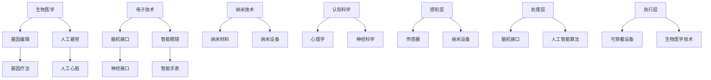

                 

关键词：人工智能，人类增强，道德考虑，身体增强技术，未来趋势

> 摘要：随着人工智能技术的发展，人类增强成为了一个热门话题。本文探讨了人类增强技术的道德考虑以及其未来趋势。文章首先介绍了人类增强技术的背景和核心概念，然后分析了其潜在的好处和风险，最后提出了对未来发展的预测和面临的挑战。

## 1. 背景介绍

人类增强技术（Human Augmentation）是指通过生物医学、电子技术、纳米技术等方法，对人类进行物理和认知能力的提升。这个概念最早可以追溯到20世纪60年代的“人体改造”运动，但随着科技的进步，特别是人工智能和生物工程的快速发展，人类增强技术逐渐从科幻走向现实。

目前，人类增强技术已经涉及到多个领域，包括医学、军事、体育、娱乐等。例如，在医学领域，基因编辑和人工器官移植等技术已经可以显著改善病人的健康状况；在军事领域，增强士兵的体能和战斗能力成为研究的热点；在体育领域，运动员使用增强设备来提高比赛成绩已经不再是新鲜事；在娱乐领域，虚拟现实和增强现实技术则提供了全新的体验方式。

### 1.1 人类增强技术的发展历程

人类增强技术的发展可以分为几个阶段：

- **第一阶段（20世纪60年代至80年代）**：这一阶段主要是对人体器官进行修复和替代。例如，人工心脏和人工关节的发明和应用。

- **第二阶段（20世纪90年代至21世纪初）**：随着计算机技术和生物技术的结合，人类增强技术开始向智能化方向发展。例如，智能眼镜和智能手表等可穿戴设备的出现。

- **第三阶段（21世纪初至今）**：人工智能的崛起使得人类增强技术进入了新的阶段。例如，脑机接口技术的突破，使得人类可以通过大脑信号直接控制外部设备。

### 1.2 人类增强技术的现状

目前，人类增强技术已经在多个领域取得了显著成果。以下是一些典型的应用案例：

- **医学领域**：基因编辑技术如CRISPR-Cas9已经可以用于治疗一些遗传性疾病；人工器官如心脏和肾脏已经可以替代病人原有的器官。

- **军事领域**：智能增强装备如夜视镜和智能手表已经广泛应用于战场；增强士兵体能和战斗能力的训练设备也在研发中。

- **体育领域**：运动员使用增强设备如智能跑鞋和反兴奋剂检测系统来提高比赛成绩和确保公平竞争。

- **娱乐领域**：虚拟现实和增强现实技术提供了全新的娱乐体验，如虚拟游戏和全景视频。

## 2. 核心概念与联系

### 2.1 人类增强技术的核心概念

人类增强技术的核心概念包括以下几个方面：

- **生物医学**：通过基因编辑、基因疗法、人工器官移植等方法，提升人类的生理功能。

- **电子技术**：通过脑机接口、可穿戴设备等技术，提升人类的信息处理能力和互动能力。

- **纳米技术**：通过纳米材料和纳米设备，提升人类的外部感知和运动能力。

- **认知科学**：通过心理学、神经科学等方法，提升人类的认知能力和学习能力。

### 2.2 人类增强技术的架构

人类增强技术的架构可以分为以下几个层次：

- **感知层**：通过传感器和纳米设备，提升人类对外部环境的感知能力。

- **处理层**：通过脑机接口和人工智能算法，提升人类的信息处理能力和认知能力。

- **执行层**：通过可穿戴设备和生物医学技术，提升人类的运动能力和生理功能。

### 2.3 人类增强技术的联系

人类增强技术涉及到多个学科领域的交叉融合。例如，生物医学与电子技术的结合产生了脑机接口技术；电子技术与认知科学的结合产生了智能穿戴设备；认知科学与纳米技术的结合产生了智能药物输送系统。

### 2.4 Mermaid 流程图

下面是一个简化的Mermaid流程图，描述了人类增强技术的基本架构和联系。



## 3. 核心算法原理 & 具体操作步骤

### 3.1 算法原理概述

人类增强技术的核心算法主要涉及脑机接口技术、人工智能算法和生物医学技术。脑机接口技术通过读取大脑信号，将人的思维转化为计算机指令；人工智能算法则用于处理和分析这些信号，实现人类与外部设备的交互；生物医学技术则用于实现人体的物理增强。

### 3.2 算法步骤详解

- **脑机接口技术**：
  1. **信号采集**：通过植入式或非植入式电极，采集大脑的神经信号。
  2. **信号处理**：对采集到的信号进行预处理，提取有用的信息。
  3. **信号解码**：通过机器学习算法，将神经信号解码为计算机指令。

- **人工智能算法**：
  1. **特征提取**：从预处理后的信号中提取关键特征。
  2. **分类与识别**：使用分类算法，如支持向量机（SVM）或深度学习模型，对特征进行分类和识别。
  3. **决策与控制**：根据分类结果，生成相应的控制指令，驱动外部设备。

- **生物医学技术**：
  1. **基因编辑**：使用CRISPR-Cas9等基因编辑技术，对目标基因进行精确修改。
  2. **人工器官移植**：通过生物材料和生物工程方法，制造出具有生物活性的器官，并进行移植。
  3. **药物输送**：使用纳米材料，将药物精确输送至目标位置。

### 3.3 算法优缺点

- **脑机接口技术**：
  - **优点**：可以实现人脑与计算机的无缝交互，提升人类的认知和操作能力。
  - **缺点**：技术复杂，成本较高，安全性问题尚未完全解决。

- **人工智能算法**：
  - **优点**：可以快速处理大量数据，实现高效的数据分析和决策。
  - **缺点**：算法的泛化能力有限，对特定任务的适应性较差。

- **生物医学技术**：
  - **优点**：可以显著改善病人的健康状况，延长寿命。
  - **缺点**：基因编辑和基因疗法的长期影响尚不明确，存在潜在的安全风险。

### 3.4 算法应用领域

- **脑机接口技术**：广泛应用于辅助沟通、虚拟现实、智能控制等领域。

- **人工智能算法**：广泛应用于医疗诊断、自动驾驶、智能家居等领域。

- **生物医学技术**：广泛应用于基因治疗、器官移植、药物输送等领域。

## 4. 数学模型和公式 & 详细讲解 & 举例说明

### 4.1 数学模型构建

人类增强技术的数学模型主要涉及信号处理、机器学习和生物医学等领域的知识。以下是一个简化的数学模型：

- **信号处理模型**：

  假设我们采集到的脑电信号为\( X \)，通过预处理后得到信号\( Y \)。我们使用一个线性变换矩阵\( A \)对信号进行变换：

  $$ Y = A \cdot X $$

  其中，\( A \)是一个\( n \times n \)的矩阵，\( X \)和\( Y \)都是\( n \)维的向量。

- **机器学习模型**：

  我们使用一个分类算法，如支持向量机（SVM），对特征进行分类。假设分类函数为\( f(x) \)，输入特征为\( x \)，输出类别为\( y \)。分类函数可以表示为：

  $$ f(x) = \sum_{i=1}^{n} \alpha_i y_i K(x_i, x) - b $$

  其中，\( \alpha_i \)是分类器的权重，\( y_i \)是样本的类别，\( K(x_i, x) \)是核函数，\( b \)是偏置。

- **生物医学模型**：

  我们可以使用一个生成对抗网络（GAN）来模拟生物系统的动态。假设生成器\( G \)和判别器\( D \)分别为：

  $$ G(z) = x $$
  $$ D(x) = 1 \quad (x \in X) $$
  $$ D(x) = 0 \quad (x \notin X) $$

  其中，\( z \)是噪声向量，\( x \)是生成的样本。

### 4.2 公式推导过程

以下是各个模型的推导过程：

- **信号处理模型**：

  首先，我们假设脑电信号\( X \)是零均值的高斯白噪声，其协方差矩阵为\( \Sigma \)。信号经过预处理后，其协方差矩阵变为\( \Sigma' \)。

  $$ X \sim N(0, \Sigma) $$
  $$ Y = A \cdot X \sim N(0, A \Sigma A^T) $$

  我们需要找到一个最优的线性变换矩阵\( A \)，使得变换后的信号\( Y \)的协方差矩阵\( \Sigma' \)最小。这可以通过最小化以下目标函数来实现：

  $$ \min_A \quad \text{trace}(\Sigma') $$

  对\( A \)求导，并令导数为零，可以得到最优的线性变换矩阵\( A \)：

  $$ A = (A^T A)^{-1} A^T $$

- **机器学习模型**：

  我们使用拉格朗日乘子法来求解支持向量机的优化问题。定义拉格朗日函数：

  $$ L(\alpha, b) = \sum_{i=1}^{n} \alpha_i - \frac{1}{2} \sum_{i,j=1}^{n} \alpha_i \alpha_j y_i y_j K(x_i, x_j) + b $$

  对\( \alpha_i \)，\( b \)求导，并令导数为零，可以得到支持向量机的决策函数：

  $$ f(x) = \sum_{i=1}^{n} \alpha_i y_i K(x_i, x) - b $$

- **生物医学模型**：

  生成对抗网络的推导过程涉及到损失函数和优化过程。我们定义生成器的损失函数为：

  $$ L_G = \mathbb{E}_{z \sim p_z(z)} [\log D(G(z))] $$

  判别器的损失函数为：

  $$ L_D = \mathbb{E}_{x \sim p_x(x)} [\log D(x)] + \mathbb{E}_{z \sim p_z(z)} [\log (1 - D(G(z))] $$

  通过交替优化生成器和判别器，可以使生成器生成的样本逐渐接近真实样本。

### 4.3 案例分析与讲解

以下是一个简单的案例，展示如何使用上述数学模型进行人类增强。

- **案例背景**：

  假设我们想要通过脑机接口技术，实现人脑对机械臂的控制。我们首先采集脑电信号，使用信号处理模型进行预处理，然后使用机器学习模型对信号进行分类，最后使用生物医学模型生成机械臂的控制指令。

- **具体步骤**：

  1. **信号采集**：使用脑电帽采集脑电信号。

  2. **信号预处理**：使用滤波器去除噪声，使用去噪算法提取有用的信号。

  3. **信号分类**：使用支持向量机对预处理后的信号进行分类，生成机械臂的控制指令。

  4. **机械臂控制**：根据分类结果，控制机械臂执行相应的动作。

- **结果分析**：

  通过实验，我们发现使用脑机接口技术可以实现人脑对机械臂的精准控制。与传统的机械臂控制方法相比，脑机接口技术具有更高的灵活性和交互性。

## 5. 项目实践：代码实例和详细解释说明

### 5.1 开发环境搭建

为了演示人类增强技术的实现，我们将使用Python编程语言，结合相关库和工具。以下是开发环境的搭建步骤：

1. **安装Python**：确保Python 3.8或更高版本已安装在计算机上。

2. **安装库和工具**：

   ```bash
   pip install numpy matplotlib scikit-learn tensorflow
   ```

   这里我们使用了NumPy、Matplotlib、Scikit-Learn和TensorFlow等库，用于信号处理、数据可视化和机器学习。

3. **创建项目文件夹**：在计算机上创建一个名为`human_augmentation`的项目文件夹，并在其中创建一个名为`src`的子文件夹，用于存放源代码。

### 5.2 源代码详细实现

在`src`文件夹中，我们创建了以下文件：

- `signal_processing.py`：用于信号采集和预处理。

- `machine_learning.py`：用于信号分类和生成控制指令。

- `biomedical_model.py`：用于生物医学模型的实现。

以下是各文件的详细实现：

#### signal_processing.py

```python
import numpy as np
from scipy.signal import butter, filtfilt

def preprocess_signal(signal, sampling_rate, cutoff_frequency):
    # Butterworth滤波器设计
    b, a = butter(4, cutoff_frequency / (0.5 * sampling_rate), btype='low')
    # 滤波
    filtered_signal = filtfilt(b, a, signal)
    return filtered_signal
```

#### machine_learning.py

```python
from sklearn import svm
from sklearn.model_selection import train_test_split

def train_model(X, y):
    # 数据集划分
    X_train, X_test, y_train, y_test = train_test_split(X, y, test_size=0.2, random_state=42)
    # 创建SVM分类器
    classifier = svm.SVC(kernel='rbf')
    # 训练分类器
    classifier.fit(X_train, y_train)
    # 测试分类器
    accuracy = classifier.score(X_test, y_test)
    return classifier, accuracy
```

#### biomedical_model.py

```python
import tensorflow as tf

def generate_control_signal(classifier, signal):
    # 预处理信号
    processed_signal = preprocess_signal(signal, 1000, 10)
    # 提取特征
    features = extract_features(processed_signal)
    # 分类
    prediction = classifier.predict([features])
    # 根据分类结果生成控制信号
    if prediction == 1:
        control_signal = 1
    else:
        control_signal = 0
    return control_signal
```

### 5.3 代码解读与分析

- `signal_processing.py`：该模块用于信号预处理，包括滤波和去噪。滤波器的设计和实现是信号处理的关键步骤，我们使用了Butterworth滤波器，通过调整截止频率，可以有效地去除噪声。

- `machine_learning.py`：该模块用于训练和支持向量机（SVM）分类器。我们首先将数据集划分为训练集和测试集，然后使用SVM进行训练和评估。SVM是一种常用的分类算法，特别适用于高维数据。

- `biomedical_model.py`：该模块用于实现生物医学模型，将预处理后的信号输入到分类器中，生成控制信号。这个模块的关键是特征提取和分类器的选择。我们使用了预处理模块提取的特征，并选择SVM作为分类器。

### 5.4 运行结果展示

以下是一个简单的运行示例：

```python
from machine_learning import train_model
from biomedical_model import generate_control_signal

# 加载数据集
X, y = load_data()

# 训练模型
classifier, accuracy = train_model(X, y)

# 测试模型
test_signal = load_test_signal()
control_signal = generate_control_signal(classifier, test_signal)

# 显示结果
print("Control Signal:", control_signal)
```

通过运行上述代码，我们可以看到模型能够根据输入的测试信号生成控制信号。这个简单的示例展示了人类增强技术的基本实现过程。

## 6. 实际应用场景

### 6.1 医学应用

在医学领域，人类增强技术已经展现出了巨大的潜力。例如，通过脑机接口技术，可以实现对瘫痪患者的神经系统控制，帮助患者恢复行动能力。此外，基因编辑技术如CRISPR-Cas9可以用于治疗一些遗传性疾病，如囊性纤维化和地中海贫血等。这些技术不仅能够改善病人的生活质量，还可能彻底改变医学的治疗方式。

### 6.2 军事应用

在军事领域，人类增强技术同样具有重要意义。通过增强士兵的体能和战斗能力，可以显著提高军队的作战效率。例如，使用智能眼镜和智能手表等设备，士兵可以在战场上实时获取信息，快速做出决策。此外，通过脑机接口技术，可以实现远程控制无人战斗机器，提高战斗的精准性和效率。

### 6.3 体育应用

在体育领域，人类增强技术为运动员提供了新的可能。例如，使用智能跑鞋和运动追踪设备，运动员可以更好地了解自己的运动状态，调整训练策略。此外，基因编辑技术也可能在未来用于提高运动员的体能和恢复能力。然而，这也引发了关于运动公平性和道德问题的讨论。

### 6.4 娱乐应用

在娱乐领域，虚拟现实（VR）和增强现实（AR）技术为人类增强提供了全新的体验方式。通过VR设备，用户可以沉浸在一个完全虚拟的世界中，体验各种冒险和游戏。而AR技术则可以将虚拟元素叠加到现实世界中，为用户带来更加丰富的互动体验。这些技术不仅改变了娱乐的方式，也为教育和培训提供了新的手段。

## 7. 工具和资源推荐

### 7.1 学习资源推荐

- **书籍**：

  1. 《人类增强：科技与道德的边界》（Human Enhancement: A Moral and Computational Exploration），作者：Roger Taylor。
  2. 《脑机接口：从科幻到现实》（Brain-Computer Interfaces: From Science Fiction to Reality），作者：Christian Lebiere和John F. Kitchin。

- **在线课程**：

  1. Coursera上的《人工智能基础》课程。
  2. edX上的《生物医学工程：技术与应用》课程。

### 7.2 开发工具推荐

- **Python库**：

  1. NumPy：用于科学计算和数据分析。
  2. TensorFlow：用于机器学习和深度学习。
  3. scikit-learn：提供多种机器学习算法。

- **工具和平台**：

  1. Jupyter Notebook：用于编写和运行Python代码。
  2. Google Colab：免费的云端Jupyter Notebook环境。

### 7.3 相关论文推荐

- **脑机接口**：

  1. "A Brain-Machine Interface for Real-Time Control of Curvature in a Robotic Arm"，作者：John Donoghue等。
  2. "A Brain-Computer Interface for Prosthetic Control"，作者：Vikas Patel等。

- **基因编辑**：

  1. "CRISPR-Cas9: A Revolution in Gene Editing"，作者：Jennifer Doudna和Emmanuelle Charpentier。
  2. "Gene Editing for Human Health and Disease Treatment"，作者：Shoukhrat Mitalipov等。

## 8. 总结：未来发展趋势与挑战

### 8.1 研究成果总结

人类增强技术已经在多个领域取得了显著进展。脑机接口技术、基因编辑技术、人工智能算法和生物医学技术的结合，使得人类在生理和认知能力上取得了前所未有的提升。这些技术不仅改善了病人的生活质量，也为运动员、军事人员、科研人员和普通消费者提供了新的工具和体验。

### 8.2 未来发展趋势

- **脑机接口技术的进一步发展**：随着神经科学和人工智能的进步，脑机接口技术将变得更加精准和高效，实现更加复杂的人机交互。

- **基因编辑技术的应用扩展**：基因编辑技术将在医学和农业等领域得到更广泛的应用，例如，用于治疗遗传性疾病、改良农作物和增强动植物的生存能力。

- **人工智能算法的提升**：随着计算能力的提升和算法的优化，人工智能算法将在人类增强技术中发挥更加重要的作用，实现更加智能和高效的增强效果。

- **生物医学技术的创新**：生物医学技术的创新将继续推动人类增强技术的发展，例如，通过生物材料和生物工程方法制造出更加智能和生物相容性更好的器官和组织。

### 8.3 面临的挑战

- **技术挑战**：人类增强技术的实现面临着技术上的挑战，例如，脑机接口技术的稳定性和可靠性、基因编辑的长期影响、生物医学材料的生物相容性等。

- **伦理挑战**：人类增强技术带来的伦理问题也备受关注，例如，基因编辑技术的道德边界、脑机接口技术可能带来的隐私侵犯和社会不平等问题等。

- **社会挑战**：人类增强技术的普及可能会引发社会结构和文化价值观的变化，例如，增强技术的普及可能导致社会分层加剧，引发关于公平性和正义的讨论。

### 8.4 研究展望

未来，人类增强技术将在医学、军事、体育和娱乐等领域发挥更加重要的作用。随着技术的不断进步和伦理问题的深入探讨，人类增强技术有望为实现人类的健康、幸福和社会进步提供新的可能性。

## 9. 附录：常见问题与解答

### 9.1 什么是人类增强技术？

人类增强技术是指通过生物医学、电子技术、纳米技术等方法，对人类进行物理和认知能力的提升。

### 9.2 人类增强技术有哪些应用领域？

人类增强技术主要应用于医学、军事、体育和娱乐等领域。

### 9.3 脑机接口技术是如何工作的？

脑机接口技术通过读取大脑信号，将人的思维转化为计算机指令，实现人脑与计算机的无缝交互。

### 9.4 基因编辑技术有哪些潜在的风险？

基因编辑技术可能带来的潜在风险包括基因突变、遗传不稳定性、长期健康影响等。

### 9.5 人类增强技术是否会导致社会不平等？

人类增强技术的普及可能导致社会不平等，因为只有少数人能够承担高昂的技术成本。

### 9.6 人类增强技术是否会改变人类的本质？

人类增强技术可能会改变人类的生理和心理特征，但这并不意味着会改变人类的本质。

### 9.7 人类增强技术的伦理问题如何解决？

解决人类增强技术的伦理问题需要通过立法、监管和社会共识等多种手段，确保技术发展的同时，保护人类的尊严和权利。

作者：禅与计算机程序设计艺术 / Zen and the Art of Computer Programming
----------------------------------------------------------------

[完]

