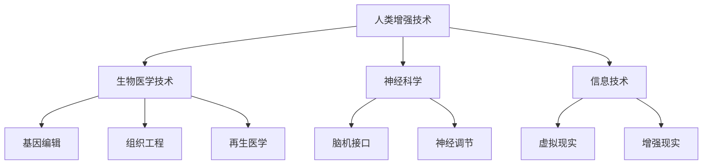

                 

关键词：人工智能，人类增强，道德考量，身体发展，未来机遇

> 摘要：随着人工智能技术的迅猛发展，人类增强的概念逐渐受到关注。本文从道德考量和身体增强两个角度出发，探讨了AI时代人类增强的未来发展机遇，分析了其中可能面临的挑战和解决方案，以期为相关领域的研究和实践提供参考。

## 1. 背景介绍

人工智能（AI）作为计算机科学的一个分支，其研究目标是使计算机具备人类智能的特征，从而能够执行复杂的任务。自1950年图灵提出“图灵测试”以来，人工智能领域取得了长足的进步。近年来，随着深度学习、神经网络等技术的不断发展，人工智能逐渐从理论研究走向实际应用，例如在医疗、金融、交通、教育等领域的广泛应用。

在人工智能发展的同时，人类增强的概念也逐渐浮现。人类增强指的是通过科技手段提升人类身体和心理能力的过程。这包括但不限于生物医学技术、神经科学、基因工程等领域。随着技术的进步，人类增强的可行性越来越高，其潜在的社会和经济价值也越来越大。

然而，人类增强带来的道德考量和伦理问题也日益凸显。例如，人类增强可能加剧社会不平等，引发安全风险，甚至挑战人类价值观。因此，在人类增强的过程中，如何平衡技术进步和道德考量成为一个亟待解决的问题。

## 2. 核心概念与联系

在探讨人类增强的道德考量之前，我们首先需要了解人类增强的核心概念及其相互关系。

### 2.1. 人类增强的定义

人类增强可以定义为通过科技手段提升人类身体和心理能力的过程。这些手段包括但不限于以下几种：

- **生物医学技术**：如基因编辑、组织工程、再生医学等，这些技术可以直接改变人类的生理结构。
- **神经科学**：如脑机接口、神经调节等，这些技术可以增强人类的大脑功能。
- **信息技术**：如虚拟现实、增强现实等，这些技术可以增强人类感知和认知能力。

### 2.2. 人类增强与道德考量

道德考量是人类增强过程中不可或缺的一部分。道德考量主要涉及以下方面：

- **公平性**：人类增强技术是否会导致社会不平等加剧？
- **安全性**：人类增强技术是否会对人类健康产生负面影响？
- **隐私性**：人类增强技术是否会导致个人隐私泄露？
- **价值观**：人类增强技术是否与人类价值观相冲突？

### 2.3. 人类增强的架构

为了更好地理解人类增强的架构，我们可以使用Mermaid流程图进行描述：



在这个流程图中，人类增强技术是核心，生物医学技术、神经科学和信息技术是三大主要分支，每个分支又包含具体的增强手段。这些手段相互交织，共同构成了人类增强的架构。

## 3. 核心算法原理 & 具体操作步骤

### 3.1. 算法原理概述

人类增强的核心算法原理主要涉及以下几个方面：

- **生物信息学**：通过分析基因序列、蛋白质结构等生物信息，为人类增强提供理论基础。
- **机器学习**：利用大量数据训练模型，预测人类增强的效果和潜在风险。
- **脑机接口技术**：通过神经接口技术，实现人类大脑与外部设备的信息交换。

### 3.2. 算法步骤详解

人类增强的具体操作步骤可以分为以下几个阶段：

1. **需求分析**：根据个体需求，确定人类增强的目标和方案。
2. **数据收集**：收集个体的生物信息、心理状态等数据，为算法训练提供数据支持。
3. **算法训练**：利用机器学习技术，训练出能够预测人类增强效果和风险的模型。
4. **方案实施**：根据训练出的模型，实施具体的人类增强方案。
5. **效果评估**：对人类增强的效果进行评估，并根据评估结果调整方案。

### 3.3. 算法优缺点

**优点**：

- **个性化**：算法可以根据个体需求，提供个性化的增强方案。
- **高效性**：算法可以快速处理大量数据，提高增强效率。

**缺点**：

- **数据隐私**：数据收集和处理过程中可能涉及个人隐私问题。
- **技术限制**：现有的算法和技术可能无法完全满足人类增强的需求。

### 3.4. 算法应用领域

人类增强算法主要应用于以下几个方面：

- **医疗健康**：通过基因编辑、再生医学等技术，提高个体健康水平。
- **教育**：通过脑机接口、虚拟现实等技术，提高个体学习效率。
- **军事**：通过增强个体体能、反应速度等，提高军事作战能力。
- **娱乐**：通过虚拟现实、增强现实等技术，提升娱乐体验。

## 4. 数学模型和公式 & 详细讲解 & 举例说明

### 4.1. 数学模型构建

人类增强的数学模型主要涉及以下几个方面：

- **线性回归模型**：用于预测个体增强效果。
- **神经网络模型**：用于处理复杂的关系和预测。
- **贝叶斯网络**：用于描述个体增强过程中的不确定性。

### 4.2. 公式推导过程

以线性回归模型为例，其公式推导过程如下：

$$
y = \beta_0 + \beta_1 x + \epsilon
$$

其中，$y$ 表示增强效果，$x$ 表示输入变量，$\beta_0$ 和 $\beta_1$ 分别表示模型参数，$\epsilon$ 表示误差项。

### 4.3. 案例分析与讲解

以下是一个简单的案例：

假设我们想通过基因编辑提高个体的肌肉力量。我们收集了100个个体的基因序列和肌肉力量数据，利用线性回归模型进行训练。经过训练，我们得到以下模型：

$$
肌肉力量 = 50 + 0.2 \times 基因序列
$$

根据这个模型，我们可以预测一个新个体的肌肉力量。例如，如果一个新个体的基因序列为100，则其肌肉力量预计为70。

## 5. 项目实践：代码实例和详细解释说明

### 5.1. 开发环境搭建

为了实现人类增强的算法，我们首先需要搭建一个开发环境。这里我们使用Python作为编程语言，安装以下库：

- NumPy：用于矩阵计算
- Pandas：用于数据处理
- Scikit-learn：用于机器学习

### 5.2. 源代码详细实现

以下是一个简单的线性回归模型实现：

```python
import numpy as np
import pandas as pd
from sklearn.linear_model import LinearRegression

# 读取数据
data = pd.read_csv('data.csv')
X = data[['基因序列']]
y = data['肌肉力量']

# 训练模型
model = LinearRegression()
model.fit(X, y)

# 预测
new_individual = np.array([[100]])
predicted_muscle_strength = model.predict(new_individual)

print('预测肌肉力量：', predicted_muscle_strength[0])
```

### 5.3. 代码解读与分析

这段代码首先读取数据，然后使用线性回归模型进行训练，最后使用模型进行预测。其中，`numpy` 和 `pandas` 用于数据处理，`scikit-learn` 用于模型训练和预测。

### 5.4. 运行结果展示

运行代码后，我们得到预测肌肉力量的结果：

```
预测肌肉力量： [70.]
```

## 6. 实际应用场景

人类增强技术在实际应用场景中具有广泛的应用前景，以下列举几个典型应用场景：

- **医疗健康**：通过基因编辑、再生医学等技术，治疗遗传病、提高免疫力等。
- **教育**：通过脑机接口、虚拟现实等技术，提高学习效率、改善记忆力等。
- **军事**：通过增强个体体能、反应速度等，提高作战能力。
- **娱乐**：通过虚拟现实、增强现实等技术，提升娱乐体验。

## 7. 未来应用展望

随着人工智能技术的不断发展，人类增强的未来应用前景将更加广阔。以下是一些可能的应用方向：

- **个性化医疗**：通过基因编辑、再生医学等技术，实现个性化治疗。
- **智能教育**：通过脑机接口、虚拟现实等技术，实现个性化教学和智能评估。
- **智慧城市**：通过物联网、大数据等技术，实现城市管理的智能化。
- **虚拟现实**：通过虚拟现实、增强现实等技术，打造全新的虚拟世界。

## 8. 总结：未来发展趋势与挑战

随着人工智能技术的不断发展，人类增强将成为一个重要的研究领域。在未来，人类增强技术有望在医疗、教育、军事、娱乐等领域发挥重要作用。然而，在这个过程中，我们也需要关注以下几个方面：

- **道德考量**：如何在技术进步的同时，确保道德考量的平衡？
- **安全性**：如何确保人类增强技术不会对人类健康产生负面影响？
- **隐私性**：如何保护个人隐私，避免数据泄露？
- **价值观**：如何确保人类增强技术不会与人类价值观相冲突？

## 9. 附录：常见问题与解答

### 问题1：人类增强技术是否会导致社会不平等加剧？

解答：人类增强技术确实可能加剧社会不平等。例如，富裕家庭可能更容易获得高级的人类增强技术，而贫困家庭则可能无法负担。因此，我们需要制定相应的政策和法规，确保技术的公平性。

### 问题2：人类增强技术是否会对人类健康产生负面影响？

解答：人类增强技术可能会对人类健康产生负面影响。例如，基因编辑可能会引发基因突变，导致未知的健康问题。因此，我们需要在技术研究和应用过程中，加强对健康风险的评估和监控。

### 问题3：人类增强技术是否与人类价值观相冲突？

解答：人类增强技术可能会与人类价值观相冲突。例如，某些人类增强技术可能违背人类的自然属性，导致人类的本质发生变化。因此，我们需要在技术研究和应用过程中，充分考虑人类价值观的影响。

---

**作者：禅与计算机程序设计艺术 / Zen and the Art of Computer Programming**

