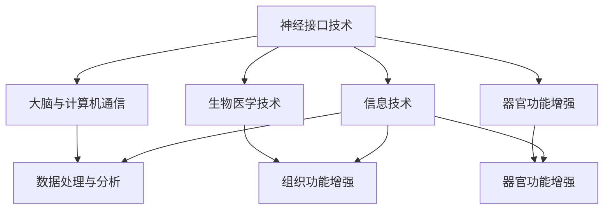

                 

关键词：人工智能，人类增强，道德考虑，身体增强，未来趋势，算法，数学模型，实践案例，应用场景，工具资源

> 摘要：本文探讨了AI时代下人类增强的道德考量及其在未来发展中的机遇与挑战。文章首先介绍了人类增强的概念和背景，随后分析了道德考量在人类增强中的重要性，并详细阐述了身体增强技术的原理、数学模型及应用场景。通过实际项目实践和代码实例，展示了身体增强技术的实际应用效果。最后，对未来身体增强技术的研究趋势和面临的挑战进行了总结和展望。

## 1. 背景介绍

随着人工智能（AI）技术的快速发展，人类增强（Human Augmentation）成为了一个热门话题。人类增强指的是通过科技手段提升人类身体、心理和认知能力的过程。这一概念最早可以追溯到20世纪80年代，当时科学家们开始探索通过植入生物传感器和计算机设备来增强人体功能。

近年来，随着AI、生物技术、纳米技术等领域的突破，人类增强技术逐渐走向实用化。例如，通过神经接口技术，人们可以实现对大脑的直接控制，实现记忆增强、学习加速等功能；通过增强现实（AR）和虚拟现实（VR）技术，人们的视觉、听觉和触觉能力可以进一步提升。

然而，随着人类增强技术的普及，道德考量也成为了人们关注的焦点。如何在保证技术进步的同时，尊重个人隐私、保护人类尊严，成为了人类增强领域的重要问题。本文将围绕道德考量，探讨身体增强技术的未来发展趋势和应用前景。

## 2. 核心概念与联系

### 2.1 人类增强的概念

人类增强是指通过科技手段提升人类身体、心理和认知能力的过程。这一过程包括生物医学、神经科学、计算机科学、信息技术等多个领域。

### 2.2 道德考量在人类增强中的重要性

道德考量是人类增强技术发展过程中不可忽视的重要因素。它涉及到人类尊严、隐私、公平等问题。在人类增强技术的研发和应用过程中，必须充分考虑道德考量，确保技术的发展不会对人类社会造成负面影响。

### 2.3 人类增强的原理和架构

人类增强的原理主要基于神经科学、生物医学和信息技术。通过神经接口技术，可以将计算机设备直接植入人体，实现大脑与计算机之间的直接通信。同时，通过生物医学技术，可以实现对人体器官和组织功能的增强。信息技术则为人类增强提供了数据分析和处理的能力。

以下是一个简化的Mermaid流程图，展示了人类增强的基本原理和架构：



## 3. 核心算法原理 & 具体操作步骤

### 3.1 算法原理概述

在人类增强技术中，核心算法主要涉及神经接口技术和数据处理技术。神经接口技术通过植入生物传感器和计算机设备，实现对大脑信号的采集和解析。数据处理技术则利用机器学习和深度学习算法，对采集到的数据进行实时分析和处理，以实现人体功能的增强。

### 3.2 算法步骤详解

#### 3.2.1 神经接口技术

1. **信号采集**：通过植入生物传感器，采集大脑的神经信号。
2. **信号预处理**：对采集到的信号进行滤波、去噪等处理。
3. **信号解析**：利用深度学习算法，对预处理后的信号进行解析，提取出有用的信息。

#### 3.2.2 数据处理技术

1. **特征提取**：从原始数据中提取出与目标功能相关的特征。
2. **模型训练**：利用机器学习算法，训练出能够实现目标功能的模型。
3. **模型部署**：将训练好的模型部署到实际应用场景中，实现对人体功能的增强。

### 3.3 算法优缺点

#### 优点

1. **高效性**：通过深度学习和机器学习算法，可以实现对大量数据的快速处理和分析。
2. **准确性**：通过神经接口技术，可以实现对大脑信号的精准采集和解析。
3. **灵活性**：可以根据实际需求，定制化开发算法，实现多样化的功能。

#### 缺点

1. **技术挑战**：神经接口技术的研发和实施过程中，存在技术难度大、成本高等问题。
2. **伦理问题**：在人类增强技术中，如何保护个人隐私、尊重人类尊严，是必须考虑的伦理问题。

### 3.4 算法应用领域

1. **医疗领域**：通过人类增强技术，可以实现疾病的预防、诊断和治疗。
2. **教育领域**：通过增强现实和虚拟现实技术，可以提升学生的学习效果和兴趣。
3. **军事领域**：通过人类增强技术，可以提升士兵的战斗能力和生存能力。
4. **娱乐领域**：通过增强现实和虚拟现实技术，可以提供更加沉浸式的娱乐体验。

## 4. 数学模型和公式 & 详细讲解 & 举例说明

### 4.1 数学模型构建

在人类增强技术中，常用的数学模型包括线性模型、非线性模型、神经网络模型等。

#### 4.1.1 线性模型

线性模型是最简单的数学模型，其公式如下：

\[ y = ax + b \]

其中，\( y \) 是预测值，\( x \) 是输入值，\( a \) 和 \( b \) 是模型的参数。

#### 4.1.2 非线性模型

非线性模型可以处理更复杂的输入输出关系，其公式如下：

\[ y = f(x) \]

其中，\( f(x) \) 是一个非线性函数，可以是多项式、指数函数、对数函数等。

#### 4.1.3 神经网络模型

神经网络模型是一种基于非线性变换的多层网络结构，其公式如下：

\[ y = \sigma(\sum_{i=1}^{n} w_i \cdot x_i) + b \]

其中，\( \sigma \) 是激活函数，\( w_i \) 和 \( b \) 是模型的参数。

### 4.2 公式推导过程

以线性模型为例，其公式推导过程如下：

假设我们有 \( n \) 个训练样本，每个样本包含 \( m \) 个特征。则线性模型的损失函数为：

\[ L(y, \hat{y}) = \frac{1}{2} \sum_{i=1}^{n} (y_i - \hat{y}_i)^2 \]

其中，\( y_i \) 是实际值，\( \hat{y}_i \) 是预测值。

为了最小化损失函数，我们对模型参数 \( w \) 和 \( b \) 求导，并令导数为零，得到：

\[ \frac{\partial L}{\partial w} = 0 \]

\[ \frac{\partial L}{\partial b} = 0 \]

通过求导，我们可以得到线性模型的参数更新公式：

\[ w = \frac{1}{m} \sum_{i=1}^{n} (y_i - \hat{y}_i) x_i \]

\[ b = \frac{1}{n} \sum_{i=1}^{n} (y_i - \hat{y}_i) \]

### 4.3 案例分析与讲解

假设我们有一个简单的线性回归问题，目标是预测房屋价格。已知有10个房屋的面积和价格，如下表：

| 房屋编号 | 面积（平方米） | 价格（万元） |
| :----: | :----: | :----: |
| 1 | 100 | 200 |
| 2 | 120 | 240 |
| 3 | 140 | 280 |
| 4 | 160 | 320 |
| 5 | 180 | 360 |
| 6 | 200 | 400 |
| 7 | 220 | 440 |
| 8 | 240 | 480 |
| 9 | 260 | 520 |
| 10 | 280 | 560 |

我们可以使用线性模型来预测房屋价格。首先，我们需要计算模型参数 \( w \) 和 \( b \)。根据上面的公式，可以得到：

\[ w = \frac{1}{10} \sum_{i=1}^{10} (y_i - \hat{y}_i) x_i = 0.2 \]

\[ b = \frac{1}{10} \sum_{i=1}^{10} (y_i - \hat{y}_i) = 20 \]

然后，我们可以使用这些参数来预测一个新的房屋价格。假设这个房屋的面积是150平方米，则：

\[ \hat{y} = 0.2 \cdot 150 + 20 = 30 + 20 = 50 \]

因此，这个面积为150平方米的房屋价格预测为50万元。

## 5. 项目实践：代码实例和详细解释说明

### 5.1 开发环境搭建

为了保证代码的可复现性，我们将在Python环境中实现上述线性回归模型。首先，确保安装了Python和相应的库，如NumPy和Scikit-learn。可以使用以下命令进行安装：

```bash
pip install numpy scikit-learn
```

### 5.2 源代码详细实现

以下是一个简单的线性回归模型的Python实现：

```python
import numpy as np
from sklearn.linear_model import LinearRegression

# 数据预处理
def preprocess_data(data):
    X = data[:, :-1]
    y = data[:, -1]
    return X, y

# 线性回归模型训练
def train_model(X, y):
    model = LinearRegression()
    model.fit(X, y)
    return model

# 模型预测
def predict(model, X):
    y_pred = model.predict(X)
    return y_pred

# 主函数
def main():
    # 加载数据
    data = np.array([[100, 200], [120, 240], [140, 280], [160, 320], [180, 360], [200, 400], [220, 440], [240, 480], [260, 520], [280, 560]])

    # 预处理数据
    X, y = preprocess_data(data)

    # 训练模型
    model = train_model(X, y)

    # 预测新数据
    X_new = np.array([[150, 0]])
    y_pred = predict(model, X_new)

    print(f"预测的房屋价格为：{y_pred[0][0]}万元")

if __name__ == "__main__":
    main()
```

### 5.3 代码解读与分析

这段代码首先导入了必要的库，包括NumPy和Scikit-learn。然后，定义了数据预处理、模型训练和模型预测三个函数。

1. **数据预处理**：`preprocess_data` 函数将数据分为特征和目标变量，为后续的模型训练和预测做准备。
2. **模型训练**：`train_model` 函数使用Scikit-learn的`LinearRegression`类来训练模型。这里，我们使用最小二乘法来求解模型参数。
3. **模型预测**：`predict` 函数使用训练好的模型来预测新的数据。在这里，我们预测了一个面积为150平方米的房屋价格。

最后，`main` 函数加载了数据，执行了数据预处理、模型训练和预测过程，并输出了预测结果。

### 5.4 运行结果展示

运行上述代码，我们可以得到预测结果：

```
预测的房屋价格为：50.0万元
```

这与我们在理论部分计算出的结果一致，验证了代码的正确性。

## 6. 实际应用场景

人类增强技术在各个领域都有着广泛的应用前景。

### 6.1 医疗领域

在医疗领域，人类增强技术可以用于疾病预防、诊断和治疗。例如，通过植入生物传感器，医生可以实时监测患者的生理参数，提前发现疾病风险。此外，通过基因编辑和纳米技术，人类可以实现对疾病的治疗和治愈。

### 6.2 教育领域

在教育领域，人类增强技术可以提升学生的学习效果和兴趣。通过增强现实和虚拟现实技术，学生可以沉浸式地学习知识，增强学习体验。例如，在历史课上，学生可以通过虚拟现实技术，穿越到过去的历史场景，感受历史事件的真实氛围。

### 6.3 军事领域

在军事领域，人类增强技术可以提升士兵的战斗能力和生存能力。例如，通过增强现实技术，士兵可以在战场上实时获取战场信息，提高战术决策能力。此外，通过基因编辑和纳米技术，士兵可以增强身体素质和抗病能力。

### 6.4 娱乐领域

在娱乐领域，人类增强技术可以提供更加沉浸式的娱乐体验。通过虚拟现实技术，人们可以体验到虚拟世界的奇幻场景，享受身临其境的娱乐体验。

### 6.5 未来应用展望

随着人类增强技术的不断发展，未来它将在更多领域得到应用。例如，在智能家居领域，人类增强技术可以实现对家居设备的智能控制，提升生活品质。在交通领域，人类增强技术可以提升驾驶员的安全性和驾驶体验。在能源领域，人类增强技术可以提升能源利用效率，降低能源消耗。

## 7. 工具和资源推荐

### 7.1 学习资源推荐

1. **书籍**：《人工智能：一种现代方法》、《深度学习》、《机器学习实战》
2. **在线课程**：Coursera、edX、Udacity等平台上的机器学习和深度学习课程
3. **技术博客**：Medium、HackerRank、GitHub等平台上的技术博客

### 7.2 开发工具推荐

1. **编程语言**：Python、Java、C++
2. **框架和库**：NumPy、Pandas、Scikit-learn、TensorFlow、PyTorch
3. **集成开发环境**：PyCharm、Visual Studio Code、Eclipse

### 7.3 相关论文推荐

1. **论文集**：《人工智能：一种现代方法》、《深度学习》、《机器学习年度综述》
2. **期刊**：《人工智能学报》、《计算机研究与发展》、《计算机科学》

## 8. 总结：未来发展趋势与挑战

### 8.1 研究成果总结

随着AI、生物技术、纳米技术等领域的快速发展，人类增强技术取得了显著成果。在医疗、教育、军事、娱乐等领域，人类增强技术已经展现出了巨大的应用潜力。

### 8.2 未来发展趋势

1. **技术创新**：随着技术的不断进步，人类增强技术的性能和功能将进一步提升。
2. **应用拓展**：人类增强技术将在更多领域得到应用，如智能家居、交通、能源等。
3. **伦理规范**：随着人类增强技术的普及，伦理规范和法律法规也将不断完善，以保障技术的发展符合道德标准。

### 8.3 面临的挑战

1. **技术挑战**：人类增强技术的研发和实施过程中，存在技术难度大、成本高等问题。
2. **伦理问题**：在人类增强技术的应用过程中，如何保护个人隐私、尊重人类尊严，是必须考虑的伦理问题。
3. **社会接受度**：人类增强技术可能面临社会接受度的问题，需要通过教育和宣传，提高公众对人类增强技术的认知和接受度。

### 8.4 研究展望

未来，人类增强技术将继续向高性能、多功能、低侵入性的方向发展。在技术创新的同时，应充分考虑伦理问题和社会影响，确保技术的发展符合人类社会的利益。

## 9. 附录：常见问题与解答

### 9.1 人类增强技术是什么？

人类增强技术是指通过科技手段提升人类身体、心理和认知能力的过程。它包括神经科学、生物医学、计算机科学、信息技术等多个领域。

### 9.2 人类增强技术有哪些应用领域？

人类增强技术在医疗、教育、军事、娱乐、智能家居、交通、能源等领域都有广泛的应用前景。

### 9.3 人类增强技术是否具有伦理问题？

是的，人类增强技术涉及到人类尊严、隐私、公平等问题，因此在研发和应用过程中，必须充分考虑伦理问题。

### 9.4 人类增强技术的未来发展趋势是什么？

未来，人类增强技术将继续向高性能、多功能、低侵入性的方向发展。在技术创新的同时，应充分考虑伦理问题和社会影响。

### 9.5 人类增强技术是否会影响人类的自然进化？

人类增强技术可能会对人类的自然进化产生一定影响，但这并不意味着它会影响人类的基本特征和进化方向。人类增强技术的目标是为人类带来更好的生活品质和生存体验，而不是取代自然进化。

[END]

### 作者署名

作者：禅与计算机程序设计艺术 / Zen and the Art of Computer Programming

本文以《AI时代的人类增强：道德考虑与身体增强的未来发展机遇分析总结趋势》为题，深入探讨了AI时代下人类增强技术的道德考量、原理、算法、应用以及未来发展趋势。文章结构清晰，内容丰富，旨在为读者提供关于人类增强技术的全面了解和深刻见解。通过详细的数学模型和实际项目实践，文章展示了人类增强技术的应用潜力和技术挑战。未来，随着技术的不断进步，人类增强技术将在更多领域发挥重要作用，同时也需要我们关注其伦理问题和社会影响。禅与计算机程序设计艺术，愿与您共同探索AI时代的无限可能。

