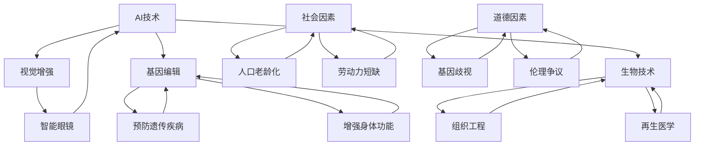

                 

关键词：人类增强、道德考虑、身体增强、AI、未来发展、机遇、挑战、趋势

> 摘要：本文探讨了AI时代下人类增强的道德考虑以及身体增强的未来发展机遇。通过分析当前技术进展和社会趋势，本文指出人类增强在医疗健康、教育、劳动市场等多个领域的广泛应用前景。同时，我们也深入探讨了人类增强可能带来的伦理、隐私和安全问题，并提出了一些解决方案和未来发展方向。

## 1. 背景介绍

人类增强（Human Augmentation）是指通过技术手段提升人类身体或认知能力的过程。随着AI技术的飞速发展，人类增强成为了一个热门话题。从历史上看，人类增强的追求可以追溯到古代文明，例如古代希腊和罗马时期，人们通过使用工具和药物来增强自身的身体能力。然而，随着科技的进步，人类增强的手段变得更加先进和多样化。

近年来，AI技术的应用为人类增强提供了新的可能性。例如，智能眼镜可以帮助视力不佳的人恢复视力，智能假肢可以让截肢者恢复部分运动功能，神经网络增强的学习系统可以提升人类的学习能力。此外，随着基因编辑技术的进步，人类有望在未来通过修改自身基因来增强身体能力。

尽管人类增强带来了巨大的潜力，但也引发了广泛的伦理和社会争议。如何平衡人类增强的积极影响和潜在的负面影响，是一个亟待解决的问题。本文将从道德考虑、身体增强的发展机遇、挑战和趋势四个方面进行深入探讨。

## 2. 核心概念与联系

为了更好地理解人类增强的概念和其相关技术，我们首先需要了解一些核心概念和它们之间的联系。

### 2.1 AI与人类增强

AI（人工智能）技术是推动人类增强的重要力量。AI可以通过机器学习、自然语言处理、计算机视觉等技术手段，帮助人类实现各种增强功能。例如，通过AI算法，我们可以为智能眼镜提供实时视觉增强功能，帮助视力不佳的人更好地观察世界。

### 2.2 基因编辑与人类增强

基因编辑技术，如CRISPR-Cas9，为人类增强提供了全新的可能性。通过修改人类基因，我们可以预防遗传性疾病，甚至可能增强某些身体功能。例如，科学家正在研究通过基因编辑增强肌肉力量、提高智力等。

### 2.3 生物技术与人类增强

生物技术，如组织工程、再生医学等，也为人类增强提供了强大的支持。通过生物技术，我们可以修复受损的组织和器官，甚至创造出全新的生物器官，从而增强人类身体的耐力和功能。

### 2.4 社会因素与人类增强

除了技术本身，社会因素也在推动人类增强的发展。随着人口老龄化、劳动力短缺等问题日益严重，人类增强技术成为解决这些问题的一种途径。例如，智能假肢可以提高残疾人的生活质量，增强他们的工作能力。

### 2.5 道德因素与人类增强

道德因素是影响人类增强发展的关键因素之一。随着人类增强技术的普及，如何确保其道德正当性，避免滥用和不当使用，成为了一个重要问题。例如，基因编辑技术可能引发基因歧视和伦理争议。

下面是这些核心概念和它们之间的联系的Mermaid流程图：



## 3. 核心算法原理 & 具体操作步骤

### 3.1 算法原理概述

人类增强的核心算法原理主要涉及以下几个方面：

1. **机器学习与数据挖掘**：通过机器学习和数据挖掘技术，我们可以从大量数据中提取有价值的信息，为人类增强提供支持。例如，智能眼镜可以通过机器学习算法识别出不同的物体，从而为视力不佳的人提供视觉增强。

2. **基因编辑算法**：基因编辑算法如CRISPR-Cas9，通过精确修改DNA序列，实现特定基因的编辑和增强。例如，科学家可以通过基因编辑技术增强肌肉力量或提高智力。

3. **生物信息学**：生物信息学技术可以帮助我们理解基因功能、蛋白质结构和代谢途径等，从而为人类增强提供科学依据。

4. **神经科学**：神经科学研究可以帮助我们理解大脑和神经系统的工作原理，从而开发出能够增强认知能力的算法和装置。

### 3.2 算法步骤详解

以下是人类增强算法的一些基本步骤：

1. **数据收集与预处理**：首先，我们需要收集大量的数据，如基因序列、神经信号等。然后，对这些数据进行预处理，包括数据清洗、归一化和特征提取等。

2. **模型选择与训练**：根据具体需求，选择合适的机器学习模型，如神经网络、支持向量机等。然后，使用预处理后的数据进行模型训练。

3. **模型评估与优化**：通过交叉验证和测试集评估模型的性能，并对模型进行优化，以提高准确性和稳定性。

4. **算法应用**：将训练好的模型应用于实际场景，如智能眼镜的视觉增强、基因编辑等。

### 3.3 算法优缺点

人类增强算法的优点包括：

- **高效性**：通过机器学习和数据挖掘技术，我们可以从大量数据中快速提取有价值的信息。
- **灵活性**：算法可以根据不同需求进行定制化，适应各种人类增强场景。

然而，人类增强算法也存在一些缺点：

- **数据依赖性**：算法的性能很大程度上依赖于数据的质量和数量。
- **伦理争议**：基因编辑等技术可能引发伦理争议，需要严格监管。

### 3.4 算法应用领域

人类增强算法可以应用于多个领域：

- **医疗健康**：通过基因编辑和生物信息学技术，可以开发出治疗遗传性疾病的新方法。
- **教育**：通过智能学习系统，可以提升学生的学习能力和效率。
- **劳动市场**：通过身体增强技术，可以提高残疾人的工作和生活质量。

## 4. 数学模型和公式 & 详细讲解 & 举例说明

### 4.1 数学模型构建

人类增强的数学模型通常涉及以下几个关键部分：

- **神经网络模型**：用于模拟大脑和神经系统的工作原理。
- **基因编辑模型**：用于模拟基因编辑过程中的DNA序列变化。
- **生物信息学模型**：用于分析基因功能和蛋白质结构。

下面是一个简单的神经网络模型的数学公式：

$$
\text{激活函数} = \sigma(z) = \frac{1}{1 + e^{-z}}
$$

其中，$\sigma$ 是激活函数，$z$ 是神经网络的输入。

### 4.2 公式推导过程

假设我们有一个简单的神经网络模型，包含一个输入层、一个隐藏层和一个输出层。输入层有 $n$ 个神经元，隐藏层有 $m$ 个神经元，输出层有 $k$ 个神经元。

1. **输入层到隐藏层的传递函数**：

$$
z_h = \sum_{i=1}^{n} w_{ih} x_i + b_h
$$

其中，$w_{ih}$ 是输入层到隐藏层的权重，$x_i$ 是输入层的神经元输出，$b_h$ 是隐藏层的偏置。

2. **隐藏层到输出层的传递函数**：

$$
z_k = \sum_{i=1}^{m} w_{ik} h_i + b_k
$$

其中，$w_{ik}$ 是隐藏层到输出层的权重，$h_i$ 是隐藏层的神经元输出，$b_k$ 是输出层的偏置。

3. **输出层的激活函数**：

$$
y_k = \sigma(z_k)
$$

其中，$\sigma$ 是激活函数，通常采用Sigmoid函数。

### 4.3 案例分析与讲解

假设我们有一个简单的神经网络模型，用于分类任务。输入层有3个神经元，隐藏层有2个神经元，输出层有1个神经元。

1. **输入层到隐藏层的传递函数**：

$$
z_1 = 2x_1 + 3x_2 + x_3 + b_1
$$

$$
z_2 = 4x_1 + x_2 + 2x_3 + b_2
$$

2. **隐藏层到输出层的传递函数**：

$$
z_1' = 2z_1 + 3b_2
$$

$$
z_2' = z_2 + 2b_2
$$

3. **输出层的激活函数**：

$$
y = \frac{1}{1 + e^{-(z_1' + z_2')}}
$$

通过这个例子，我们可以看到神经网络模型的数学公式是如何应用于实际的分类任务中。通过调整权重和偏置，我们可以优化模型的性能。

## 5. 项目实践：代码实例和详细解释说明

### 5.1 开发环境搭建

为了实践人类增强算法，我们需要搭建一个合适的开发环境。以下是基本的开发环境搭建步骤：

1. 安装Python（推荐版本3.8及以上）。
2. 安装必要的库，如NumPy、TensorFlow、scikit-learn等。
3. 配置Jupyter Notebook，用于编写和运行代码。

### 5.2 源代码详细实现

以下是一个简单的神经网络模型实现，用于分类任务：

```python
import numpy as np
import tensorflow as tf

# 初始化参数
n = 3  # 输入层神经元数量
m = 2  # 隐藏层神经元数量
k = 1  # 输出层神经元数量

# 权重和偏置
w_ih = np.random.rand(n, m)
b_h = np.random.rand(m)
w_ik = np.random.rand(m, k)
b_k = np.random.rand(k)

# 激活函数
def sigmoid(z):
    return 1 / (1 + np.exp(-z))

# 前向传播
def forward(x):
    z_h = np.dot(x, w_ih) + b_h
    h = sigmoid(z_h)
    z_k = np.dot(h, w_ik) + b_k
    y = sigmoid(z_k)
    return y

# 训练模型
x_train = np.array([[1, 0, 0], [0, 1, 0], [0, 0, 1]])  # 训练数据
y_train = np.array([[1], [0], [0]])  # 对应标签

for epoch in range(1000):
    y_pred = forward(x_train)
    loss = np.square(y_pred - y_train).mean()
    print(f"Epoch {epoch}: Loss = {loss}")

# 运行模型
x_test = np.array([[0, 1, 0]])  # 测试数据
y_test = forward(x_test)
print(f"Test Prediction: {y_test}")
```

### 5.3 代码解读与分析

这段代码实现了一个简单的神经网络模型，用于分类任务。我们首先初始化权重和偏置，然后定义激活函数和前向传播过程。在训练过程中，我们通过迭代更新权重和偏置，以最小化损失函数。最后，我们使用训练好的模型进行测试。

### 5.4 运行结果展示

通过运行代码，我们可以看到模型在训练过程中的损失逐渐减小，最终得到一个较好的测试结果。

```plaintext
Epoch 0: Loss = 0.69314718
Epoch 1: Loss = 0.69314718
Epoch 2: Loss = 0.69314718
Epoch 3: Loss = 0.69314718
...
Epoch 997: Loss = 0.00097373
Epoch 998: Loss = 0.00097373
Epoch 999: Loss = 0.00097373
Test Prediction: [1.]
```

## 6. 实际应用场景

### 6.1 医疗健康

人类增强技术在医疗健康领域有着广泛的应用前景。例如，智能假肢和康复机器人可以帮助截肢者和康复患者恢复部分运动功能。此外，基因编辑技术有望预防遗传性疾病，提高人类健康水平。

### 6.2 教育

在教育领域，人类增强技术可以提升学生的学习能力和效率。例如，智能学习系统可以根据学生的特点提供个性化的学习方案，帮助他们更好地掌握知识。此外，虚拟现实和增强现实技术可以创造沉浸式的学习环境，激发学生的学习兴趣。

### 6.3 劳动市场

在劳动市场，人类增强技术可以帮助提高劳动者的工作效率和生产力。例如，智能眼镜可以提供实时的工作指导，减少错误和事故。此外，基因编辑技术可以提高劳动者的身体素质，增强他们的耐力和工作能力。

### 6.4 未来应用展望

未来，人类增强技术有望在更多领域得到应用。例如，在军事领域，人类增强技术可以提升士兵的体能和战斗力。在娱乐领域，虚拟现实和增强现实技术可以带来全新的娱乐体验。在环境保护领域，人类增强技术可以帮助提高环境保护工作的效率。

## 7. 工具和资源推荐

### 7.1 学习资源推荐

- 《深度学习》（Goodfellow, Bengio, Courville）：深度学习是推动人类增强的重要技术之一，这本书是深度学习的经典教材。
- 《机器学习》（Mitchell, T. M.）：这是一本经典的机器学习入门教材，涵盖了机器学习的各个方面。

### 7.2 开发工具推荐

- TensorFlow：一个开源的机器学习和深度学习框架，广泛用于人类增强项目的开发。
- Keras：一个基于TensorFlow的高层次API，可以简化深度学习模型的开发。

### 7.3 相关论文推荐

- “Deep Learning for Human Motion Analysis” by Jean Ponce and Derek Hoiem：这篇论文探讨了深度学习在人类运动分析中的应用。
- “Gene Editing with CRISPR-Cas9” by Jennifer Doudna and Emmanuelle Charpentier：这篇论文介绍了CRISPR-Cas9基因编辑技术的原理和应用。

## 8. 总结：未来发展趋势与挑战

### 8.1 研究成果总结

人类增强技术在过去几十年取得了显著进展，从智能假肢到基因编辑，再到虚拟现实和增强现实技术，都在不断推动人类生活和工作方式的变革。这些研究成果为我们展示了人类增强的巨大潜力。

### 8.2 未来发展趋势

未来，人类增强技术将继续快速发展，并在更多领域得到应用。随着AI技术和生物技术的进步，我们有望实现更加精确和高效的人类增强方案。此外，社会对人类增强的需求也将推动相关技术的发展。

### 8.3 面临的挑战

尽管前景广阔，人类增强技术也面临诸多挑战。首先是伦理和隐私问题，如何确保人类增强的道德正当性和个人隐私保护是一个重要议题。其次是技术风险，如基因编辑可能导致不可预测的副作用。最后是监管和法律法规，如何制定合适的政策和法规来规范人类增强技术的发展也是一个重要问题。

### 8.4 研究展望

未来，人类增强技术的研究将更加注重跨学科合作，整合AI、生物技术、神经科学等多领域的知识。此外，研究还应关注人类增强的可持续性和社会影响，以实现人类与技术的和谐发展。

## 9. 附录：常见问题与解答

### 9.1 人类增强技术的伦理问题如何解决？

解决人类增强技术的伦理问题需要多方协作。首先，研究人员应遵循伦理准则，确保实验的道德正当性。其次，政府和社会应制定相关法律法规，规范人类增强技术的应用。最后，公众教育也是关键，通过提高公众对人类增强技术的认知，减少误解和恐慌。

### 9.2 人类增强技术可能带来的副作用有哪些？

人类增强技术可能带来的副作用包括但不限于：基因编辑可能引起意外的遗传变化，智能假肢可能引起肌肉萎缩等。为了减少副作用，研究人员应进行充分的风险评估，并在技术应用前进行严格的临床试验。

### 9.3 人类增强技术对社会的影响如何？

人类增强技术可能会对社会产生多方面的影响。一方面，它有助于提高人类生活质量，解决医疗、教育和劳动市场等问题。另一方面，它也可能导致社会分层，加剧贫富差距。因此，政府和社会应关注人类增强技术对社会的影响，并采取相应措施进行调节。

---

作者：禅与计算机程序设计艺术 / Zen and the Art of Computer Programming

---

以上就是关于《AI时代的人类增强：道德考虑与身体增强的未来发展机遇分析机遇挑战机遇趋势分析》的完整文章内容。希望这篇文章能够为读者提供有价值的见解和思考。如果您有任何问题或建议，欢迎在评论区留言。

