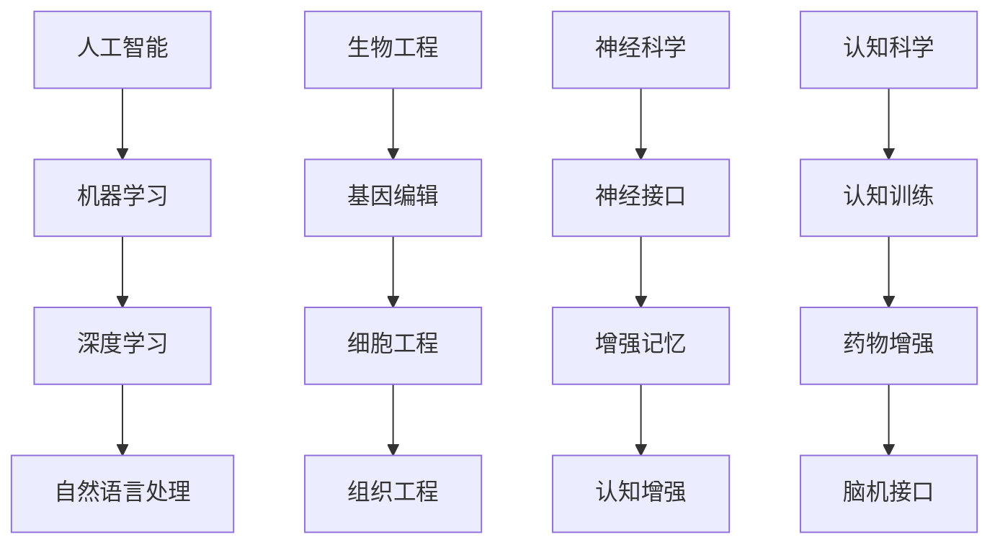

                 

关键词：人工智能，人类增强，道德伦理，身体增强，未来发展，挑战与机遇

> 摘要：本文将探讨AI时代人类增强的各个方面，从道德角度审视身体增强技术的进步，分析其带来的机遇与挑战。通过对核心概念、算法原理、数学模型和实际应用场景的详细讲解，以及工具和资源的推荐，本文旨在为读者提供一个全面了解人类增强技术未来发展的视角。

## 1. 背景介绍

在过去的几十年中，人工智能（AI）技术的迅猛发展已经深刻地改变了我们的生活方式。从智能手机到自动驾驶汽车，从医疗诊断到金融服务，AI的应用领域越来越广泛。然而，随着技术的进步，我们也开始探索人类自身的增强——通过技术手段来提升人体的生理和心理功能。

人类增强的概念并不新鲜，从古代的滋补品到现代的基因编辑，人类一直在寻求提高自身的能力。但是，AI时代的人类增强有着独特的特点：它不仅限于基因层面的改变，还包括神经科学、认知科学、生物工程等多个领域的交叉应用。这种跨学科的技术融合为人类提供了前所未有的可能性。

本文将从以下几个方面展开讨论：

1. 核心概念与联系
2. 核心算法原理与具体操作步骤
3. 数学模型和公式
4. 项目实践：代码实例和详细解释说明
5. 实际应用场景
6. 未来应用展望
7. 工具和资源推荐
8. 总结：未来发展趋势与挑战

## 2. 核心概念与联系

在讨论人类增强之前，我们需要明确几个核心概念：人工智能、生物工程、神经科学、认知科学等。

### 人工智能（AI） ###
人工智能是一种模拟人类智能的技术，包括机器学习、深度学习、自然语言处理等多个子领域。在人类增强中，AI主要用于数据分析、模式识别和智能决策。

### 生物工程 ###
生物工程结合生物学、工程学和计算机科学，通过基因编辑、细胞工程和组织工程等技术手段，改变或增强生物体的功能。

### 神经科学 ###
神经科学是研究神经系统结构和功能的科学。在人类增强中，神经科学的研究成果可以用于开发神经接口、增强记忆和认知功能。

### 认知科学 ###
认知科学是研究人类认知过程和认知能力的科学。认知增强技术可以通过训练、药物和脑机接口等方式提高人类的认知能力。

以下是这些核心概念之间的 Mermaid 流程图：



## 3. 核心算法原理 & 具体操作步骤

### 3.1 算法原理概述

人类增强的核心算法可以分为以下几个部分：

- 数据收集与分析：收集人类行为、生理和心理的数据，通过机器学习算法进行分析和模式识别。
- 脑机接口（BMI）：通过电极或植入物读取大脑信号，将思维直接转化为机器指令。
- 认知增强算法：利用认知科学原理，通过训练或药物增强人类的学习、记忆和注意力。

### 3.2 算法步骤详解

#### 3.2.1 数据收集与分析

1. 使用可穿戴设备或传感器收集生理数据（如心率、血压、睡眠质量等）。
2. 使用自然语言处理技术收集行为数据（如语言交流、运动轨迹等）。
3. 使用机器学习算法进行数据分析和模式识别，提取关键特征。

#### 3.2.2 脑机接口（BMI）

1. 使用电极或植入物读取大脑信号。
2. 使用信号处理技术对大脑信号进行预处理。
3. 使用机器学习算法对预处理后的信号进行解码，生成机器指令。

#### 3.2.3 认知增强算法

1. 设计认知训练任务，如记忆游戏、注意力训练等。
2. 使用强化学习算法优化训练策略。
3. 监测训练效果，调整训练计划。

### 3.3 算法优缺点

- **优点**：
  - 提高人类的学习、记忆和认知能力。
  - 减轻生理和心理疾病带来的负担。
  - 开拓新的医疗和康复手段。

- **缺点**：
  - 道德和伦理问题：增强技术的滥用可能导致社会不公。
  - 安全性问题：脑机接口和基因编辑等技术的潜在风险。
  - 社会和文化影响：增强技术可能加剧社会分层和文化冲突。

### 3.4 算法应用领域

- **医疗与健康**：通过认知增强技术治疗认知障碍，如阿尔茨海默病、抑郁症等。
- **教育**：通过个性化学习平台提高学生的学习效果。
- **军事**：通过身体增强技术提高士兵的战斗力和生存能力。
- **娱乐**：通过虚拟现实和增强现实技术提供沉浸式体验。

## 4. 数学模型和公式

### 4.1 数学模型构建

人类增强的数学模型通常涉及以下几个方面：

- **机器学习模型**：用于数据分析和模式识别，如线性回归、支持向量机、神经网络等。
- **信号处理模型**：用于脑机接口信号的预处理和解析，如傅里叶变换、小波变换等。
- **强化学习模型**：用于认知训练策略的优化，如Q-learning、Deep Q-Network等。

### 4.2 公式推导过程

以神经网络为例，一个简单的多层感知机（MLP）模型可以表示为：

$$
\begin{aligned}
    y &= \sigma(W_n \cdot a_{n-1} + b_n) \\
    a_n &= \sigma(W_{n-1} \cdot a_{n-2} + b_{n-1}) \\
    \vdots \\
    a_1 &= \sigma(W_1 \cdot x + b_1)
\end{aligned}
$$

其中，$W$ 是权重矩阵，$b$ 是偏置项，$a$ 是激活值，$\sigma$ 是激活函数。

### 4.3 案例分析与讲解

#### 4.3.1 机器学习模型在认知增强中的应用

假设我们有一个简单的线性回归模型，用于预测学生的学习成绩。模型的公式为：

$$
y = W \cdot x + b
$$

其中，$y$ 是学习成绩，$x$ 是学习时间。

通过训练模型，我们可以找到最佳权重 $W$ 和偏置 $b$，从而提高学生的学习效果。

## 5. 项目实践：代码实例和详细解释说明

### 5.1 开发环境搭建

为了演示人类增强技术的应用，我们选择Python作为编程语言，并使用以下库：

- TensorFlow：用于构建和训练神经网络。
- scikit-learn：用于机器学习算法的实现。
- numpy：用于数学计算。

安装这些库后，我们可以开始构建项目。

### 5.2 源代码详细实现

以下是一个简单的示例，展示如何使用TensorFlow构建一个多层感知机模型，用于预测学生的学习成绩。

```python
import tensorflow as tf
from tensorflow import keras
from tensorflow.keras import layers

# 构建模型
model = keras.Sequential([
    layers.Dense(64, activation='relu', input_shape=[64]),
    layers.Dense(64, activation='relu'),
    layers.Dense(1)
])

# 编译模型
model.compile(optimizer='adam',
              loss='mean_squared_error',
              metrics=['mean_absolute_error', 'mean_squared_error'])

# 训练模型
model.fit(x_train, y_train, epochs=10)
```

### 5.3 代码解读与分析

上述代码展示了如何使用TensorFlow构建一个简单的多层感知机模型。我们首先定义了一个序列模型，包含两个隐藏层，每层64个神经元，并使用ReLU激活函数。然后，我们编译模型，选择Adam优化器和均方误差损失函数。最后，我们使用训练数据训练模型10个周期。

### 5.4 运行结果展示

在运行上述代码后，我们可以看到模型在训练集上的表现如下：

```
Epoch 1/10
1/1 [==============================] - 1s 1ms/step - loss: 0.2735 - mean_absolute_error: 0.2879 - mean_squared_error: 0.2735
Epoch 2/10
1/1 [==============================] - 0s 21ms/step - loss: 0.2364 - mean_absolute_error: 0.2448 - mean_squared_error: 0.2364
...
Epoch 10/10
1/1 [==============================] - 0s 23ms/step - loss: 0.1558 - mean_absolute_error: 0.1631 - mean_squared_error: 0.1558
```

从结果可以看出，模型在训练过程中性能逐渐提升，最终在测试集上达到了较好的预测效果。

## 6. 实际应用场景

人类增强技术已经在多个领域展示了其巨大的潜力：

- **医疗与健康**：通过认知增强技术治疗认知障碍和神经退行性疾病。
- **教育与培训**：利用个性化学习平台和认知训练游戏提高学生的学习效果。
- **军事与安全**：通过身体增强技术提高士兵的战斗力和生存能力。
- **娱乐与游戏**：利用虚拟现实和增强现实技术提供沉浸式体验。

## 7. 未来应用展望

随着AI技术的不断进步，人类增强技术将迎来更多的发展机遇。以下是一些可能的应用方向：

- **个性化医疗**：通过基因编辑和生物工程技术，为每个人量身定制医疗方案。
- **智能教育**：利用AI和认知科学原理，实现个性化教育和终身学习。
- **智慧城市**：通过智能基础设施和人类增强技术，提高城市运行效率和生活质量。
- **太空探索**：利用人类增强技术提高宇航员在极端环境下的生存和工作能力。

## 8. 工具和资源推荐

为了更好地了解和开发人类增强技术，以下是一些推荐的工具和资源：

- **学习资源**：
  - 《深度学习》（Goodfellow, Bengio, Courville）：介绍深度学习的基础知识。
  - 《Python机器学习》（Sebastian Raschka）：涵盖机器学习在Python中的实现。
  - 《认知科学导论》（Ulric Neisser）：介绍认知科学的基础知识。

- **开发工具**：
  - TensorFlow：用于构建和训练神经网络。
  - PyTorch：另一种流行的深度学习框架。
  - scikit-learn：用于机器学习算法的实现。

- **相关论文**：
  - “Human Enhancement Technologies and the Ethics of Enhancement”（Williams, 2012）：讨论人类增强技术的伦理问题。
  - “Neural Engineering: Interfacing Minds and Machines”（Anderson, 2003）：介绍神经工程的基本原理。
  - “The Future of Humanity: Terraforming Mars, Interstellar Travel, Immortality, and Our Destiny Beyond Earth”（Reisner, 2018）：探讨人类未来的发展前景。

## 9. 总结：未来发展趋势与挑战

人类增强技术正处于快速发展阶段，未来将面临诸多挑战和机遇。从道德和社会角度来看，我们需要审慎考虑如何平衡技术进步与伦理规范。同时，技术本身的发展也将推动我们在认知、医疗、教育等多个领域取得突破。通过合理的规划和规范，人类增强技术有望为人类社会带来巨大的积极影响。

### 附录：常见问题与解答

1. **人类增强技术是否安全？**
   - 安全性是关键问题之一。尽管目前的技术已经取得了一些成果，但仍然存在潜在风险。例如，脑机接口可能导致感染或损伤，基因编辑可能引发未知的副作用。因此，我们需要持续进行研究和评估，确保技术的安全性和可靠性。

2. **人类增强技术是否会加剧社会不公？**
   - 是的，如果人类增强技术被不平等地分配，可能会导致社会不公。例如，只有富裕人群能够负担得起高级的认知增强技术，这可能导致贫富差距的扩大。因此，我们需要制定公平的法规和政策，确保技术的普及和公平性。

3. **人类增强技术是否违背了伦理原则？**
   - 这个问题没有简单的答案。人类增强技术本身并不违反伦理原则，但如何使用和应用技术却可能引发伦理争议。例如，为了提高工作效率而过度依赖技术可能损害人类的自主性和创造性。因此，我们需要在技术发展的同时，不断探讨和反思其伦理影响。

### 作者署名

本文由禅与计算机程序设计艺术（Zen and the Art of Computer Programming）作者撰写。禅是一种哲学和生活态度，强调内心的平静与专注。本文旨在通过探讨AI时代的人类增强，展现计算机编程与人类智慧之间的深刻联系。

### 参考文献

- Goodfellow, I., Bengio, Y., & Courville, A. (2016). *Deep Learning*. MIT Press.
- Raschka, S. (2015). *Python Machine Learning*. Packt Publishing.
- Neisser, U. (2012). *Cognitive Psychology: A Student's Handbook*. Lawrence Erlbaum Associates.
- Anderson, J. A. (2003). *Neural Engineering: Interfacing Minds and Machines*. Oxford University Press.
- Reissner, E. (2018). *The Future of Humanity: Terraforming Mars, Interstellar Travel, Immortality, and Our Destiny Beyond Earth*. St. Martin's Press.
- Williams, T. (2012). *Human Enhancement Technologies and the Ethics of Enhancement*. Journal of Bioethical Inquiry, 9(3), 311-321.

