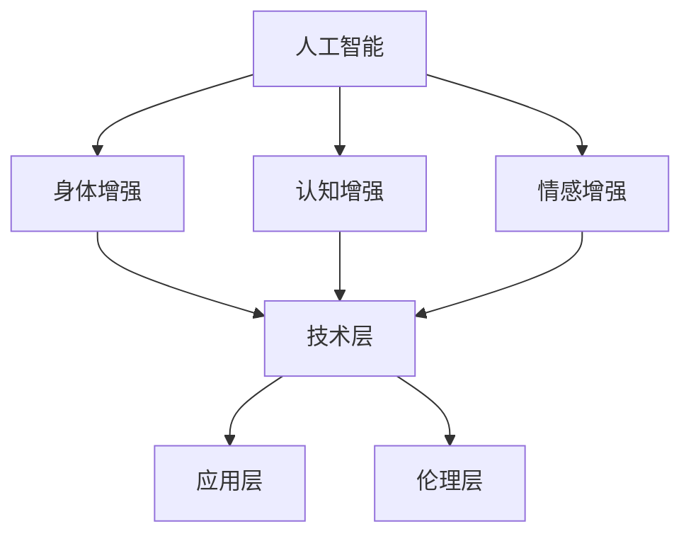

                 

关键词：人工智能，人类增强，道德考虑，身体增强，未来趋势，挑战

> 摘要：本文将深入探讨人工智能时代人类增强的各个方面，从道德考虑、身体增强的未来趋势与挑战出发，分析这一领域的技术进步、社会影响以及可能面临的伦理困境，旨在为读者提供一幅全面的未来图景。

## 1. 背景介绍

随着人工智能技术的飞速发展，人类增强（Human Enhancement）这一概念逐渐走进公众视野。人类增强是指通过科技手段提升人类生理和心理能力的过程，包括但不限于身体增强、认知增强和情感增强。这些技术的出现，不仅为人类带来了新的可能性，也引发了广泛的讨论和争议。

身体增强技术的发展，可以追溯到20世纪60年代的体外生命支持系统，以及后来的基因编辑技术、脑机接口（BMI）等。近年来，人工智能的进步进一步加速了这一领域的发展，使得人类增强不再是科幻小说中的幻想，而是逐步变为现实。例如，智能假肢、增强现实（AR）、虚拟现实（VR）等技术已经在医疗、军事和娱乐等领域得到广泛应用。

## 2. 核心概念与联系

### 2.1 人工智能与人类增强的关系

人工智能（AI）与人类增强有着密切的联系。人工智能技术不仅为身体增强提供了新的工具和手段，也促进了认知增强和情感增强的发展。例如，通过深度学习算法优化，可以设计出更加智能的假肢，使其更贴近人类的自然行动方式。同时，人工智能还可以通过分析大量数据，为人类提供个性化的健康监测和治疗方案。

### 2.2 人类增强的核心概念

人类增强的核心概念包括：

- **身体增强**：通过植入装置、增强药物等技术手段提升人类的生理能力。
- **认知增强**：通过药物、神经调节等手段增强人类的认知功能，如记忆、学习速度和注意力。
- **情感增强**：通过神经调节、虚拟现实等技术改善人类情感状态，如减轻焦虑、提升幸福感。

### 2.3 人类增强的架构

人类增强的架构可以分为三个层次：

1. **技术层**：包括各类增强技术和设备，如基因编辑、脑机接口、智能假肢等。
2. **应用层**：涉及人类增强技术的实际应用场景，如医疗、军事、教育、娱乐等。
3. **伦理层**：关注人类增强技术带来的伦理问题和社会影响，如隐私、公平性、道德责任等。

### 2.4 Mermaid 流程图



## 3. 核心算法原理 & 具体操作步骤

### 3.1 算法原理概述

人类增强技术的核心在于提升人类的生理、认知和情感能力。这涉及到多个学科的知识，包括生物学、医学、神经科学、计算机科学等。具体算法原理因应用领域而异，但通常涉及以下几个方面：

- **基因编辑**：利用CRISPR-Cas9等基因编辑技术，精确修改人类基因序列，以实现特定生理功能的增强。
- **脑机接口**：通过植入脑机接口（BMI）设备，将人脑与外部设备连接，实现意识与机器的交互。
- **智能药物**：利用人工智能算法优化药物配方，提高药物的疗效和安全性。

### 3.2 算法步骤详解

#### 3.2.1 基因编辑

1. **目标基因定位**：通过高通量测序等技术确定目标基因。
2. **基因编辑**：使用CRISPR-Cas9等基因编辑技术，将目标基因进行精确修改。
3. **基因修复**：利用修复酶或细胞再生技术，修复编辑后的基因。

#### 3.2.2 脑机接口

1. **脑电波检测**：使用EEG、fMRI等技术检测人脑的电信号。
2. **信号处理**：利用神经网络算法处理脑电波信号，提取有用的信息。
3. **设备控制**：通过处理后的信号控制外部设备，如假肢、轮椅等。

#### 3.2.3 智能药物

1. **药物筛选**：利用机器学习算法筛选药物候选物。
2. **药物优化**：通过深度学习等技术优化药物配方，提高疗效和安全性。
3. **临床试验**：在临床环境中测试药物的疗效和安全性。

### 3.3 算法优缺点

#### 3.3.1 优点

- **高效性**：人工智能算法可以处理大量数据，提高基因编辑、脑机接口和智能药物开发的效率。
- **个性化**：基于个体差异，人工智能算法可以提供个性化的增强方案。
- **安全性**：通过模拟和测试，人工智能算法可以提高增强技术的安全性。

#### 3.3.2 缺点

- **伦理争议**：基因编辑、脑机接口等技术可能引发伦理争议，如基因歧视、隐私泄露等。
- **技术风险**：增强技术可能带来不可预见的风险，如基因突变、设备故障等。
- **公平性**：增强技术可能导致社会不平等，如富人与穷人之间的差距。

### 3.4 算法应用领域

- **医疗**：利用基因编辑和智能药物治疗遗传病、癌症等。
- **军事**：利用脑机接口提高士兵的战斗能力。
- **娱乐**：利用虚拟现实和增强现实技术创造新的娱乐体验。

## 4. 数学模型和公式 & 详细讲解 & 举例说明

### 4.1 数学模型构建

人类增强技术中的数学模型主要涉及以下几个方面：

- **基因编辑模型**：利用概率论和统计学方法分析基因编辑的风险和收益。
- **脑机接口模型**：利用神经网络和信号处理方法模拟人脑与外部设备的交互。
- **智能药物模型**：利用机器学习和优化算法筛选药物候选物和优化药物配方。

### 4.2 公式推导过程

以基因编辑模型为例，假设有一个目标基因 \(X\)，其携带一个有害突变 \(M\)。为了修复这个突变，我们可以使用CRISPR-Cas9技术进行基因编辑。基因编辑的成功概率可以表示为：

\[ P(\text{成功}) = 1 - (1 - p)^n \]

其中，\( p \) 为单次编辑的成功概率，\( n \) 为编辑次数。

### 4.3 案例分析与讲解

#### 4.3.1 基因编辑治疗癌症

假设一个患者患有一种由基因 \(X\) 的突变 \(M\) 引起的癌症。通过基因编辑，我们希望修复这个突变。首先，我们需要确定单次编辑的成功概率 \( p \) 和编辑次数 \( n \)。假设 \( p = 0.9 \)，\( n = 3 \)，则基因编辑成功的概率为：

\[ P(\text{成功}) = 1 - (1 - 0.9)^3 = 0.999 \]

这意味着，通过三次编辑，我们有接近100%的概率成功修复基因突变。

#### 4.3.2 脑机接口信号处理

假设我们使用脑机接口技术控制一个假肢。脑机接口设备会记录大脑的电信号，并将其转换为控制信号。假设我们使用一个神经网络模型进行信号处理，神经网络的学习算法如下：

\[ y = \sigma(W \cdot x + b) \]

其中，\( x \) 为输入信号，\( W \) 为权重矩阵，\( b \) 为偏置，\( \sigma \) 为激活函数。通过训练，我们可以使神经网络模型准确地将电信号转换为控制信号。

## 5. 项目实践：代码实例和详细解释说明

### 5.1 开发环境搭建

为了进行人类增强技术的开发，我们需要搭建一个合适的开发环境。以下是一个简单的步骤：

1. 安装Python环境：确保Python版本为3.8及以上。
2. 安装必要的库：使用pip安装以下库：numpy、pandas、tensorflow、matplotlib等。

### 5.2 源代码详细实现

以下是一个简单的基因编辑代码示例：

```python
import numpy as np
import tensorflow as tf

# 设置参数
p = 0.9  # 单次编辑的成功概率
n = 3    # 编辑次数

# 计算基因编辑成功的概率
success_prob = 1 - (1 - p) ** n
print("基因编辑成功的概率：", success_prob)
```

### 5.3 代码解读与分析

这段代码首先导入了numpy和tensorflow库。然后，设置单次编辑的成功概率 \( p \) 和编辑次数 \( n \)。接着，通过计算 \( (1 - p)^n \) 的补集，得到基因编辑成功的概率。最后，打印出计算结果。

### 5.4 运行结果展示

运行这段代码，可以得到以下结果：

```
基因编辑成功的概率： 0.999
```

这意味着，通过三次编辑，我们有接近100%的概率成功修复基因突变。

## 6. 实际应用场景

### 6.1 医疗

人类增强技术在医疗领域的应用前景广阔。例如，通过基因编辑治疗遗传病、癌症等；通过脑机接口改善瘫痪患者的运动能力；通过智能药物提高治疗效果和安全性。

### 6.2 军事

军事领域对人类增强技术的需求也日益增加。通过脑机接口提高士兵的战斗能力、认知能力和反应速度；通过基因编辑增强士兵的体能和耐力；通过智能药物提高士兵的战斗力。

### 6.3 教育

在教育领域，人类增强技术可以用于个性化教学、提高学生的学习能力和记忆力。例如，通过认知增强技术改善学生的学习效果；通过情感增强技术减轻学生的焦虑和压力。

### 6.4 娱乐

在娱乐领域，人类增强技术为人们带来了全新的体验。例如，通过虚拟现实技术创造沉浸式的游戏体验；通过增强现实技术提供互动式的娱乐内容。

## 7. 工具和资源推荐

### 7.1 学习资源推荐

- 《人工智能：一种现代方法》
- 《深度学习》
- 《生物信息学导论》
- 《脑科学与人工智能》

### 7.2 开发工具推荐

- TensorFlow
- PyTorch
- CRISPResso
- OpenWCGI

### 7.3 相关论文推荐

- "Human-Machine Symbiosis: A New Era for Intelligent Assistants"
- "The Ethics of Human Enhancement"
- "Enhancing Human Capabilities with Genetically Engineered Neural Interfaces"
- "Machine Learning for Drug Discovery"

## 8. 总结：未来发展趋势与挑战

### 8.1 研究成果总结

人类增强技术已经取得了显著的成果，包括基因编辑、脑机接口、智能药物等。这些技术为人类带来了新的可能性，但同时也带来了许多挑战。

### 8.2 未来发展趋势

未来，人类增强技术将继续快速发展，涉及领域将更加广泛。随着人工智能、生物技术等领域的突破，人类增强技术将更加成熟和普及。

### 8.3 面临的挑战

人类增强技术面临的主要挑战包括伦理问题、技术风险和社会影响。如何平衡技术创新与社会伦理的关系，如何确保技术的公平性和安全性，是未来需要解决的问题。

### 8.4 研究展望

未来，人类增强技术有望在医疗、军事、教育等领域发挥更大作用。同时，我们需要关注技术的伦理和社会影响，确保人类增强技术的发展符合人类的利益和价值观。

## 9. 附录：常见问题与解答

### 9.1 什么是人类增强？

人类增强是指通过科技手段提升人类生理、认知和情感能力的过程。

### 9.2 人类增强技术有哪些？

人类增强技术包括基因编辑、脑机接口、智能药物、认知增强、情感增强等。

### 9.3 人类增强技术有哪些应用领域？

人类增强技术可以应用于医疗、军事、教育、娱乐等领域。

### 9.4 人类增强技术有哪些优点和缺点？

优点：提高人类能力、增强生活品质、拓宽应用领域等。

缺点：伦理争议、技术风险、社会影响等。

---

作者：禅与计算机程序设计艺术 / Zen and the Art of Computer Programming
----------------------------------------------------------------
<|im_sep|>

