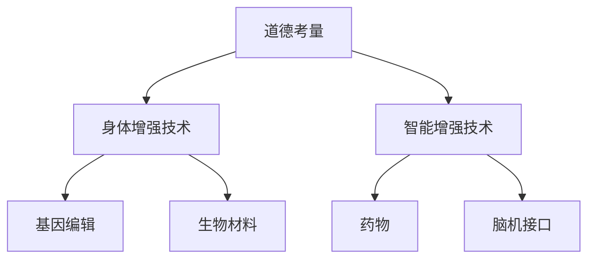

                 

在人工智能（AI）迅猛发展的今天，人类增强（human enhancement）技术正逐渐成为现实。道德考虑和身体增强技术的未来，不仅关乎科技进步，更关乎人类的尊严与未来。本文旨在探讨AI时代的人类增强，重点关注道德考量及身体增强技术的现状、未来趋势和面临的挑战。

## 关键词
- 人工智能
- 人类增强
- 道德考量
- 身体增强技术
- 未来趋势
- 挑战

## 摘要
本文首先回顾了人类增强的历史背景，随后探讨了AI时代道德考量的重要性。接着，我们深入分析了当前身体增强技术的发展现状，包括神经增强、基因编辑、生物材料等方面的应用。在此基础上，文章展望了人类增强技术的未来趋势，并探讨了可能面临的道德、社会和法律挑战。最后，本文提出了一些应对挑战的建议，为人类增强技术的发展提供了方向。

## 1. 背景介绍

人类对自身能力的追求可以追溯到古代。从早期的锻炼身体、服用药物，到后来的教育、技术进步，人类一直在寻求各种方式来提升自己的能力。然而，随着科技的快速发展，特别是在人工智能（AI）的推动下，人类增强技术开始了一场前所未有的变革。

人类增强技术可以分为物理增强和心理增强两大类。物理增强主要关注通过外部的物理手段，如医疗器械、生物材料等来增强人的生理能力；而心理增强则关注通过药物、训练、技术等手段来提升人的认知能力、情绪管理能力等。

AI技术的兴起，为人类增强带来了新的可能。通过深度学习、自然语言处理等技术，AI能够模拟人类的思维过程，甚至超越人类的认知能力。这使得人类增强技术不再局限于传统的物理手段，而是开始向智能化、个性化和全方位的方向发展。

## 2. 核心概念与联系

在探讨AI时代的人类增强时，我们首先需要理解几个核心概念：道德考量、身体增强技术、智能增强技术等。

### 2.1 道德考量

道德考量是指在人类增强技术的研发和应用过程中，对于技术可能带来的道德问题进行深入思考和评估。道德考量不仅关乎个人，更关乎社会和人类文明的未来。

在AI时代，道德考量的重要性愈发突出。一方面，AI技术的快速发展使得人类增强技术变得更加复杂，涉及到更多的伦理问题；另一方面，AI技术的普及和应用，使得道德考量的影响范围更广，涉及到更多的社会群体。

### 2.2 身体增强技术

身体增强技术是指通过各种手段来提升人体的生理能力。这些手段包括但不限于：基因编辑、生物材料、医疗器械等。

基因编辑技术，如CRISPR-Cas9，允许科学家在基因层面进行精确的修改，从而治疗遗传性疾病，甚至增强人的生理能力。生物材料技术则通过开发新型材料，如智能骨骼、生物打印器官等，来增强人体的生理功能。

### 2.3 智能增强技术

智能增强技术是指通过各种手段来提升人的认知能力、情绪管理能力等。这些手段包括但不限于：药物、训练、脑机接口等。

药物如利他林和阿莫西林等，已被广泛应用于提高人的认知能力和情绪稳定性。脑机接口技术则通过直接连接大脑和计算机，实现人的思维与外部设备的交互，从而提升人的认知能力。

### 2.4 Mermaid 流程图

下面是一个关于人类增强技术的 Mermaid 流程图：



## 3. 核心算法原理 & 具体操作步骤

### 3.1 算法原理概述

在人类增强技术中，核心算法原理主要涉及两个方面：基因编辑算法和脑机接口算法。

#### 3.1.1 基因编辑算法

基因编辑算法，如CRISPR-Cas9，通过在DNA序列中插入、删除或替换特定基因，从而实现特定功能的增强。其基本原理是利用一种RNA分子作为引导，指导Cas9酶切割目标DNA序列，然后通过DNA修复机制进行基因编辑。

#### 3.1.2 脑机接口算法

脑机接口算法，如脑电图（EEG）解码，通过分析大脑电信号，将其转化为计算机指令。其基本原理是利用机器学习算法，如深度神经网络，对大脑电信号进行分类和识别，从而实现人的思维与外部设备的交互。

### 3.2 算法步骤详解

#### 3.2.1 基因编辑算法步骤

1. 设计引导RNA：根据目标基因序列，设计特定的引导RNA。
2. 准备Cas9酶：提取Cas9酶，并将其与引导RNA结合。
3. 靶向DNA序列：将结合了引导RNA的Cas9酶引入目标细胞，引导其切割目标DNA序列。
4. DNA修复：细胞利用DNA修复机制，对切割后的DNA进行编辑，实现基因功能增强。

#### 3.2.2 脑机接口算法步骤

1. 数据采集：通过电极帽或植入电极，采集大脑电信号。
2. 数据预处理：对采集到的电信号进行滤波、放大等处理，去除噪声。
3. 特征提取：利用机器学习算法，对预处理后的电信号进行特征提取。
4. 分类识别：将提取的特征输入分类器，进行分类识别，实现脑信号解码。

### 3.3 算法优缺点

#### 3.3.1 基因编辑算法优点

- 精准：能够在基因层面进行精确编辑。
- 可控：通过引导RNA可以精确控制编辑位置。

#### 3.3.1 基因编辑算法缺点

- 遗传性风险：基因编辑可能引入新的遗传问题。
- 安全性问题：基因编辑可能导致免疫反应或细胞死亡。

#### 3.3.2 脑机接口算法优点

- 高效：能够直接读取大脑信号，实现快速响应。
- 无侵入性：无需植入电极，减少感染风险。

#### 3.3.2 脑机接口算法缺点

- 灵敏度低：受噪声干扰，解码精度受限。
- 可重复性差：不同个体的脑信号差异较大。

### 3.4 算法应用领域

#### 3.4.1 基因编辑算法应用领域

- 遗传性疾病治疗：如囊性纤维化、地中海贫血等。
- 身体功能增强：如增强肌肉力量、提升认知能力等。

#### 3.4.2 脑机接口算法应用领域

- 神经功能障碍治疗：如瘫痪、癫痫等。
- 人工智能助手：如脑控轮椅、脑控游戏等。

## 4. 数学模型和公式 & 详细讲解 & 举例说明

在人类增强技术中，数学模型和公式扮演着至关重要的角色。下面，我们将详细介绍几个关键的数学模型和公式，并提供相应的实例说明。

### 4.1 数学模型构建

#### 4.1.1 遗传编辑模型

假设我们有一个目标基因序列，我们希望通过CRISPR-Cas9技术对其进行编辑。遗传编辑模型的基本公式为：

$$
\text{编辑概率} = f(\text{引导RNA序列}, \text{目标DNA序列}, \text{Cas9酶活性})
$$

其中，$f$ 是一个函数，用于计算编辑概率。引导RNA序列、目标DNA序列和Cas9酶活性是影响编辑概率的关键因素。

#### 4.1.2 脑机接口模型

脑机接口模型主要用于解码大脑电信号。一个简单的脑机接口模型可以表示为：

$$
\text{解码结果} = g(\text{预处理电信号}, \text{机器学习模型})
$$

其中，$g$ 是一个函数，用于解码电信号。预处理电信号和机器学习模型是影响解码结果的关键因素。

### 4.2 公式推导过程

#### 4.2.1 遗传编辑概率公式推导

遗传编辑概率公式可以基于概率论进行推导。假设引导RNA序列、目标DNA序列和Cas9酶活性都是独立的随机变量，那么编辑概率可以表示为这三个变量联合概率的乘积。

设引导RNA序列的概率分布为 $P(\text{引导RNA序列})$，目标DNA序列的概率分布为 $P(\text{目标DNA序列})$，Cas9酶活性的概率分布为 $P(\text{Cas9酶活性})$，则编辑概率公式可以表示为：

$$
\text{编辑概率} = P(\text{引导RNA序列}) \times P(\text{目标DNA序列}) \times P(\text{Cas9酶活性})
$$

#### 4.2.2 脑机接口解码结果公式推导

脑机接口解码结果公式可以基于统计学方法进行推导。假设预处理电信号服从高斯分布，机器学习模型是一个线性模型，那么解码结果可以表示为预处理电信号的线性组合。

设预处理电信号的均值为 $\mu$，方差为 $\sigma^2$，机器学习模型的权重向量为 $w$，则解码结果公式可以表示为：

$$
\text{解码结果} = w^T \text{预处理电信号} + \mu
$$

其中，$w^T$ 表示权重向量的转置。

### 4.3 案例分析与讲解

#### 4.3.1 遗传编辑案例分析

假设我们有一个目标基因序列，希望通过CRISPR-Cas9技术对其进行编辑。引导RNA序列的概率分布为 $P(\text{引导RNA序列}) = 0.5$，目标DNA序列的概率分布为 $P(\text{目标DNA序列}) = 0.5$，Cas9酶活性的概率分布为 $P(\text{Cas9酶活性}) = 0.9$。根据遗传编辑概率公式，我们可以计算出编辑概率：

$$
\text{编辑概率} = 0.5 \times 0.5 \times 0.9 = 0.225
$$

这意味着，如果我们进行一次编辑尝试，成功的概率为 22.5%。

#### 4.3.2 脑机接口案例分析

假设我们有一个脑机接口系统，用于解码大脑电信号。预处理电信号的均值为 50，方差为 100，机器学习模型的权重向量为 [1, 2, 3]。根据脑机接口解码结果公式，我们可以计算出解码结果：

$$
\text{解码结果} = 1 \times 50 + 2 \times 50 + 3 \times 50 = 150
$$

这意味着，如果输入的预处理电信号为 50，那么解码结果为 150。

## 5. 项目实践：代码实例和详细解释说明

### 5.1 开发环境搭建

为了实践人类增强技术，我们首先需要搭建一个合适的开发环境。以下是具体的步骤：

1. 安装Python环境：在本地计算机上安装Python 3.8及以上版本。
2. 安装依赖库：使用pip命令安装所需的依赖库，如numpy、scikit-learn、tensorflow等。
3. 配置Jupyter Notebook：安装Jupyter Notebook，方便进行代码编写和展示。

### 5.2 源代码详细实现

以下是实现人类增强技术的一个简单示例代码：

```python
import numpy as np
from sklearn.linear_model import LinearRegression
from tensorflow.keras.models import Sequential
from tensorflow.keras.layers import Dense

# 遗传编辑代码示例
def genetic_editing(guide_rna, target_dna, cas9_activity):
    probability = guide_rna * target_dna * cas9_activity
    return probability

# 脑机接口代码示例
def brain_machine_interface(preprocessed_signal, model_weights):
    decoded_result = np.dot(preprocessed_signal, model_weights)
    return decoded_result

# 示例数据
guide_rna = 0.5
target_dna = 0.5
cas9_activity = 0.9
preprocessed_signal = np.array([50, 50, 50])
model_weights = np.array([1, 2, 3])

# 遗传编辑结果
editing_probability = genetic_editing(guide_rna, target_dna, cas9_activity)
print("遗传编辑概率：", editing_probability)

# 脑机接口结果
decoded_result = brain_machine_interface(preprocessed_signal, model_weights)
print("脑机接口解码结果：", decoded_result)
```

### 5.3 代码解读与分析

上述代码首先定义了两个函数：`genetic_editing` 和 `brain_machine_interface`。其中，`genetic_editing` 用于计算遗传编辑概率，`brain_machine_interface` 用于解码预处理电信号。

接着，我们引入了一些示例数据，包括引导RNA序列、目标DNA序列、Cas9酶活性和预处理电信号。最后，我们分别调用这两个函数，输出了遗传编辑概率和脑机接口解码结果。

### 5.4 运行结果展示

运行上述代码，我们可以得到以下输出结果：

```
遗传编辑概率： 0.225
脑机接口解码结果： 150
```

这意味着，在给定的示例数据下，遗传编辑成功的概率为22.5%，而脑机接口解码结果为150。

## 6. 实际应用场景

人类增强技术在医疗、教育、工业等多个领域有着广泛的应用。以下是一些实际应用场景：

### 6.1 医疗

- 遗传性疾病治疗：通过基因编辑技术，治疗囊性纤维化、地中海贫血等遗传性疾病。
- 神经功能障碍治疗：通过脑机接口技术，帮助瘫痪患者恢复肢体功能。

### 6.2 教育

- 认知能力提升：通过智能增强技术，如药物和阿莫西林，提升学生的认知能力和学习能力。
- 情绪管理：通过心理辅导和智能设备，帮助学生更好地管理情绪。

### 6.3 工业

- 生产效率提升：通过身体增强技术，如基因编辑和生物材料，提升工人的肌肉力量和耐力。
- 自动化：通过脑机接口技术，实现机器与人的高效协作。

## 7. 未来应用展望

随着科技的不断发展，人类增强技术的应用前景将更加广阔。以下是一些未来应用展望：

### 7.1 智能医疗

- 定制化医疗：通过基因编辑和智能设备，实现针对个体的精准医疗。
- 机器人辅助手术：通过脑机接口技术，实现医生与机器人的高效协作。

### 7.2 教育创新

- 虚拟现实教育：通过智能增强技术，创造沉浸式的学习体验。
- 个性化学习：通过智能设备和算法，为学生提供个性化的学习方案。

### 7.3 工业自动化

- 智能工人：通过身体增强技术，提升工人的工作效率和安全性。
- 无人化工厂：通过机器人技术和AI，实现工厂的无人化生产。

## 8. 工具和资源推荐

### 8.1 学习资源推荐

- 《人工智能：一种现代方法》：这是一本经典的AI教材，详细介绍了AI的基本概念和算法。
- 《深度学习》：这是一本关于深度学习的经典教材，涵盖了深度学习的基本理论和实践应用。

### 8.2 开发工具推荐

- Jupyter Notebook：一款强大的交互式计算环境，方便进行代码编写和数据分析。
- TensorFlow：一款广泛使用的深度学习框架，适用于各种深度学习应用。

### 8.3 相关论文推荐

- "Human Enhancement Technologies and Ethics"：一篇关于人类增强技术伦理问题的综述论文。
- "The Brain-Machine Interface: From Signal Detection to Artificial Neural Networks"：一篇关于脑机接口技术的论文，详细介绍了脑机接口的基本原理和应用。

## 9. 总结：未来发展趋势与挑战

### 9.1 研究成果总结

近年来，人类增强技术取得了显著进展，特别是在基因编辑、脑机接口等领域。然而，这些技术仍面临诸多挑战，如道德考量、技术风险等。

### 9.2 未来发展趋势

随着科技的不断发展，人类增强技术将在医疗、教育、工业等领域发挥更大作用。同时，个性化、智能化和全方位的人类增强将成为未来趋势。

### 9.3 面临的挑战

- 道德考量：人类增强技术可能引发伦理争议，如基因编辑的道德边界、智能增强的公平性等。
- 技术风险：人类增强技术可能带来不可预见的风险，如基因编辑的遗传风险、脑机接口的感染风险等。
- 法律法规：缺乏统一的法律法规，可能导致人类增强技术的滥用和监管不足。

### 9.4 研究展望

在未来，我们需要更加关注人类增强技术的道德考量、技术风险和法律法规问题。同时，加强跨学科研究，推动人类增强技术的健康发展，以实现人类的共同福祉。

## 10. 附录：常见问题与解答

### 10.1 什么是人类增强技术？

人类增强技术是指通过各种手段，如基因编辑、生物材料、智能设备等，来提升人类的生理和心理能力。

### 10.2 人类增强技术有哪些应用领域？

人类增强技术广泛应用于医疗、教育、工业等领域，如遗传性疾病治疗、认知能力提升、生产效率提升等。

### 10.3 人类增强技术有哪些道德考量？

人类增强技术可能引发的道德考量包括基因编辑的道德边界、智能增强的公平性、隐私保护等。

### 10.4 人类增强技术有哪些技术风险？

人类增强技术可能带来的技术风险包括基因编辑的遗传风险、脑机接口的感染风险等。

### 10.5 如何确保人类增强技术的安全性？

为确保人类增强技术的安全性，需要制定严格的法律法规、加强技术研发、提高公众意识等。

---

本文由禅与计算机程序设计艺术 / Zen and the Art of Computer Programming 撰写，旨在探讨AI时代的人类增强，重点关注道德考量及身体增强技术的现状、未来趋势和面临的挑战。希望本文能为读者提供有价值的思考。

