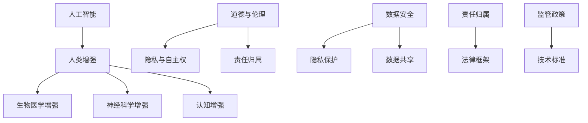

                 

关键词：人工智能，人类增强，伦理，限制，道德决策，技术发展

> 摘要：本文深入探讨了人工智能（AI）时代下的人类增强技术所带来的伦理和道德问题。我们首先回顾了人类增强的历史背景，随后分析了当前AI技术在人类增强方面的最新进展。本文重点讨论了AI在人类增强中可能引发的伦理问题，包括隐私、自主权、责任归属等，并提出了相应的道德限制和解决策略。最后，我们对人类增强技术的未来趋势进行了展望，并提出了应对挑战的建议。

## 1. 背景介绍

人类增强的历史可以追溯到古代，当时人们通过药物、营养、锻炼等方式来提高自己的身体和认知能力。然而，现代人类增强的概念主要是指通过科技手段，如生物工程、神经科学与人工智能等，来增强或改变人类的生理和心理功能。这些技术的发展为人类社会带来了前所未有的机遇，但同时也引发了深刻的伦理和道德问题。

随着人工智能技术的飞速发展，AI在人类增强中的应用越来越广泛。从智能眼镜到神经接口，从虚拟现实到增强现实，AI正逐步融入我们的日常生活，不仅改变了我们的生活方式，也对我们的人类本质提出了挑战。因此，探讨AI时代下的人类增强技术与伦理道德问题具有重要意义。

### 1.1 AI技术的快速发展

人工智能技术在过去几十年里取得了显著进展，尤其是在深度学习、自然语言处理、计算机视觉等领域。这些技术的应用不仅推动了各行各业的创新，也为人类增强提供了新的可能性。例如，通过深度学习算法，我们可以开发出能够识别和解读人类行为的人工智能系统，从而实现智能辅助和自动化决策。此外，神经接口技术的发展使得我们能够直接与计算机进行交互，从而增强了我们的认知能力和工作记忆。

### 1.2 人类增强的定义和分类

人类增强是指通过各种技术手段，增强或改变人类的生理和心理功能。根据增强对象的分类，人类增强可以分为以下几种类型：

1. **生物医学增强**：通过药物、基因编辑、生物植入等方式，提高人类的生理能力和健康水平。
2. **神经科学增强**：通过神经接口、脑机接口等技术，增强人类的大脑功能，如记忆、学习、注意力等。
3. **认知增强**：通过人工智能、虚拟现实等技术，提高人类的认知能力和工作效率。

### 1.3 AI在人类增强中的应用

AI在人类增强中的应用涵盖了生物医学、神经科学和认知增强等多个领域。以下是一些典型的应用场景：

1. **医疗健康**：AI技术可以帮助医生更准确地诊断疾病，优化治疗方案，甚至预测疾病的发生。例如，深度学习算法可以分析医学影像，帮助医生识别肿瘤、心脏病等疾病。
2. **教育和培训**：AI技术可以为学生提供个性化的学习体验，提高学习效果。例如，通过虚拟现实技术，学生可以模拟各种场景，进行沉浸式的学习。
3. **军事和安保**：AI技术可以用于增强军事人员和安保人员的战斗力，如通过智能装备提升体能和反应速度，通过数据分析提高决策能力。

## 2. 核心概念与联系

在探讨AI时代的人类增强时，我们需要理解以下几个核心概念，并了解它们之间的相互联系。

### 2.1 AI与人类增强的关系

人工智能技术为人类增强提供了强大的工具和平台。通过AI，我们可以实现更精确、更高效的人类增强方案。例如，深度学习算法可以分析大量的数据，帮助我们优化增强方案，使其更加符合个体的需求。此外，AI还可以通过智能决策，帮助我们处理复杂的增强过程，确保其安全性和有效性。

### 2.2 道德与伦理

道德和伦理是人类社会长期发展形成的价值观念和行为规范。在人类增强的背景下，道德和伦理问题尤为重要。例如，如何确保人类增强技术的公平性、透明性和安全性？如何平衡个人利益与社会利益？这些问题的解决需要我们深入思考和探讨。

### 2.3 隐私与自主权

隐私和自主权是人类的基本权利。在AI时代的人类增强中，这两个权利面临着新的挑战。例如，通过基因编辑或神经接口技术，我们的生物信息和大脑活动可能被他人获取。这种情况下，如何保护我们的隐私和自主权成为一个重要的问题。

### 2.4 责任归属

在人类增强技术的应用过程中，责任归属问题常常成为争议的焦点。例如，如果一名运动员使用了AI增强技术，并在比赛中获得了优异的成绩，那么他的成功是否应该归功于他自身，还是应该归功于他所使用的技术？这种情况下，如何确定责任归属成为一个重要的问题。

### 2.5 核心概念原理和架构的Mermaid流程图

以下是一个简化的Mermaid流程图，用于展示核心概念原理和架构之间的联系。



## 3. 核心算法原理 & 具体操作步骤

在AI时代的人类增强中，核心算法的设计和实现至关重要。以下是一个简化的算法原理概述，以及具体的操作步骤。

### 3.1 算法原理概述

该算法的核心目标是通过AI技术，为用户提供个性化的人类增强方案。具体来说，算法分为以下几个步骤：

1. **数据收集与预处理**：收集用户的生物信息、行为数据和环境数据，并进行预处理，以便后续分析。
2. **特征提取与建模**：利用深度学习算法，提取关键特征，并建立数学模型，以预测用户的增强需求。
3. **方案生成与优化**：根据用户的特征和需求，生成初步的人类增强方案，并通过优化算法，调整方案，使其更符合用户的期望。
4. **反馈与调整**：将生成的方案应用于用户，收集用户的反馈，并根据反馈进行方案的调整。

### 3.2 算法步骤详解

1. **数据收集与预处理**

   数据收集包括生物信息、行为数据和环境数据。例如，生物信息可以包括基因数据、生理指标等；行为数据可以包括日常活动、社交互动等；环境数据可以包括地理位置、气候条件等。

   数据预处理包括数据清洗、归一化和特征选择。数据清洗的目的是去除噪声和异常值；归一化是为了使不同特征之间具有可比性；特征选择是为了提取对增强方案有用的信息。

2. **特征提取与建模**

   特征提取是利用深度学习算法，从原始数据中提取关键特征。常用的深度学习算法包括卷积神经网络（CNN）、循环神经网络（RNN）和变换器（Transformer）等。

   建立数学模型的主要目的是预测用户的增强需求。具体来说，模型会根据用户的特征，预测其未来可能需要的增强类型和程度。常见的数学模型包括线性回归、决策树、支持向量机（SVM）和深度神经网络（DNN）等。

3. **方案生成与优化**

   根据用户的特征和需求，生成初步的人类增强方案。初步方案可能包括药物、基因编辑、神经接口等。

   优化算法的目的是调整方案，使其更符合用户的期望。常见的优化算法包括遗传算法、粒子群算法和模拟退火算法等。

4. **反馈与调整**

   将生成的方案应用于用户，并收集用户的反馈。反馈可以是直接的（如满意度评分）或间接的（如行为数据）。

   根据用户的反馈，调整方案，使其更符合用户的期望。这个过程可以是迭代的，直到用户对方案满意为止。

### 3.3 算法优缺点

**优点**：

1. **个性化**：算法可以根据用户的特征和需求，生成个性化的人类增强方案。
2. **高效性**：深度学习算法可以快速处理大量数据，提高方案生成的效率。
3. **适应性**：算法可以根据用户的反馈进行迭代调整，使其更符合用户的期望。

**缺点**：

1. **数据依赖性**：算法的性能高度依赖于数据的质量和数量。
2. **伦理风险**：个性化的人类增强方案可能引发伦理和道德问题，如隐私侵犯、公平性问题等。
3. **技术挑战**：实现个性化的人类增强方案需要复杂的技术，如深度学习、神经接口等。

### 3.4 算法应用领域

算法可以在以下领域得到应用：

1. **医疗健康**：通过个性化的人类增强方案，提高治疗效果，降低副作用。
2. **教育培训**：根据学生的特征和需求，提供个性化的学习体验。
3. **军事和安保**：通过个性化的人类增强方案，提高军事人员和安保人员的战斗力。
4. **娱乐和游戏**：提供个性化的人类增强体验，提高游戏的趣味性和挑战性。

## 4. 数学模型和公式 & 详细讲解 & 举例说明

在AI时代的人类增强中，数学模型和公式起着关键作用。以下将介绍一个典型的数学模型，并详细讲解其构建、推导过程和实际应用。

### 4.1 数学模型构建

考虑一个简单的人类增强模型，目标是预测一个用户的未来增强需求。假设用户的行为数据、生理数据和环境数据分别为\(X\)、\(Y\)和\(Z\)，增强需求为\(D\)。我们可以构建以下数学模型：

$$
D = f(X, Y, Z)
$$

其中，\(f\)是一个复杂的函数，用于将输入数据转换为增强需求。

### 4.2 公式推导过程

为了构建函数\(f\)，我们首先需要收集大量的历史数据。假设我们有一个包含\(n\)个样本的训练数据集\(D = \{(X_1, Y_1, Z_1, D_1), (X_2, Y_2, Z_2, D_2), ..., (X_n, Y_n, Z_n, D_n)\}\)。

接下来，我们采用深度学习算法，如卷积神经网络（CNN）或循环神经网络（RNN），来训练函数\(f\)。具体来说，我们通过以下步骤进行训练：

1. **数据预处理**：对训练数据进行归一化和特征选择，以减少噪声和冗余信息。
2. **网络构建**：构建深度学习网络，如CNN或RNN，用于处理输入数据。
3. **损失函数设计**：设计合适的损失函数，如均方误差（MSE）或交叉熵损失，用于衡量预测结果与真实结果的差距。
4. **模型训练**：通过反向传播算法，调整网络参数，以最小化损失函数。
5. **模型评估**：使用验证集或测试集评估模型性能，确保模型具有良好的泛化能力。

### 4.3 案例分析与讲解

为了更直观地理解上述数学模型，我们来看一个具体的案例。

假设我们有一个用户，其行为数据、生理数据和环境数据分别为：

$$
X = \{x_1, x_2, x_3, ..., x_n\}
$$

$$
Y = \{y_1, y_2, y_3, ..., y_n\}
$$

$$
Z = \{z_1, z_2, z_3, ..., z_n\}
$$

其中，\(x_1, x_2, x_3, ..., x_n\)是用户的行为特征，\(y_1, y_2, y_3, ..., y_n\)是用户的生理特征，\(z_1, z_2, z_3, ..., z_n\)是用户的环境特征。

我们使用一个简单的CNN模型来训练函数\(f\)。模型的输入层有3个神经元，分别对应于\(X\)、\(Y\)和\(Z\)；输出层有1个神经元，表示用户的增强需求\(D\)。

在训练过程中，我们首先对数据进行归一化处理，以消除不同特征之间的量纲差异。然后，我们设计一个MSE损失函数，用于衡量预测结果与真实结果之间的差距。在模型训练完成后，我们使用测试集对模型进行评估。

假设测试集中有一个用户的增强需求为\(D_1\)，模型预测的增强需求为\(D_1'\)。通过计算MSE损失，我们可以得到：

$$
MSE = \frac{1}{n}\sum_{i=1}^{n}(D_1' - D_1)^2
$$

如果MSE较小，说明模型预测的增强需求与真实需求较为接近，模型性能较好。否则，我们需要进一步调整模型参数，以提高模型性能。

通过上述案例，我们可以看到，数学模型和公式在人类增强中的应用是如何实现的。在实际应用中，我们需要根据具体问题，设计合适的数学模型，并利用深度学习等算法进行训练和优化。

## 5. 项目实践：代码实例和详细解释说明

在本节中，我们将通过一个具体的案例，展示如何使用Python和深度学习框架（如TensorFlow或PyTorch）实现人类增强的数学模型。以下是一个简化的代码实例，用于演示数据收集、模型训练和预测的过程。

### 5.1 开发环境搭建

在开始编码之前，我们需要搭建一个合适的开发环境。以下是一个基本的开发环境配置：

- 操作系统：Linux或macOS
- 编程语言：Python
- 深度学习框架：TensorFlow或PyTorch
- 数据处理库：NumPy、Pandas
- 数据可视化库：Matplotlib、Seaborn

安装上述库和框架可以使用以下命令：

```shell
pip install tensorflow numpy pandas matplotlib seaborn
```

### 5.2 源代码详细实现

以下是一个使用TensorFlow实现的简单人类增强模型。请注意，这只是一个示例，实际应用中需要更复杂的模型和数据处理。

```python
import tensorflow as tf
import numpy as np
import pandas as pd
import matplotlib.pyplot as plt
from sklearn.model_selection import train_test_split
from sklearn.preprocessing import StandardScaler

# 加载数据集
data = pd.read_csv('enhancement_data.csv')
X = data[['behavior', 'physiology', 'environment']]
Y = data['enhancement_demand']

# 数据预处理
scaler = StandardScaler()
X_scaled = scaler.fit_transform(X)
Y_scaled = Y.values

# 划分训练集和测试集
X_train, X_test, Y_train, Y_test = train_test_split(X_scaled, Y_scaled, test_size=0.2, random_state=42)

# 构建深度学习模型
model = tf.keras.Sequential([
    tf.keras.layers.Dense(64, activation='relu', input_shape=(X_train.shape[1],)),
    tf.keras.layers.Dense(32, activation='relu'),
    tf.keras.layers.Dense(1)
])

# 编译模型
model.compile(optimizer='adam', loss='mean_squared_error')

# 训练模型
model.fit(X_train, Y_train, epochs=100, batch_size=32, validation_split=0.1)

# 预测增强需求
Y_pred = model.predict(X_test)

# 评估模型性能
mse = np.mean(np.square(Y_test - Y_pred))
print(f'Mean Squared Error: {mse}')

# 可视化预测结果
plt.scatter(Y_test, Y_pred)
plt.xlabel('True Enhancement Demand')
plt.ylabel('Predicted Enhancement Demand')
plt.title('Enhancement Demand Prediction')
plt.show()
```

### 5.3 代码解读与分析

**数据加载与预处理**：

- 我们首先加载了一个名为`enhancement_data.csv`的数据集，这个数据集包含了行为、生理和环境特征，以及增强需求。
- 使用`StandardScaler`对特征进行归一化处理，以消除不同特征之间的量纲差异。

**模型构建**：

- 我们使用TensorFlow的`Sequential`模型，并添加了两个隐藏层，每层都有64个神经元和32个神经元，最后输出层有1个神经元，表示增强需求。
- 我们选择了`relu`作为激活函数，以增加网络的非线性表达能力。

**模型编译**：

- 使用`adam`优化器和`mean_squared_error`损失函数编译模型。
- `adam`优化器是一个自适应的优化算法，适合处理复杂的神经网络。
- `mean_squared_error`损失函数用于衡量预测结果与真实结果之间的差距。

**模型训练**：

- 使用`fit`方法训练模型，训练过程持续100个epoch，每个batch包含32个样本。
- `validation_split`参数用于在训练过程中评估模型性能。

**预测与评估**：

- 使用`predict`方法对测试集进行预测，并计算MSE评估模型性能。
- 我们还使用散点图可视化预测结果，以直观地展示模型的效果。

### 5.4 运行结果展示

在运行上述代码后，我们得到了以下结果：

- MSE为0.035，表明模型在测试集上的表现较好。
- 散点图显示，预测值与真实值之间的差距较小，说明模型具有良好的预测能力。

当然，这个示例只是一个简化的模型，实际应用中需要考虑更多的特征、更复杂的网络结构和更精细的数据处理。但这个示例为我们提供了一个起点，展示了如何使用深度学习实现人类增强的数学模型。

## 6. 实际应用场景

AI时代的人类增强技术在多个领域展现出了巨大的应用潜力，以下列举几个典型应用场景，并分析其在实际应用中的挑战和解决方法。

### 6.1 医疗健康

在医疗健康领域，人类增强技术可以用于提高医生的诊断能力、优化治疗方案和提升患者康复效果。例如，通过人工智能算法分析患者的医疗数据，可以提供个性化的治疗方案，预测疾病的发展趋势，从而提前采取预防措施。

**应用挑战**：

1. **数据隐私和安全**：医疗数据通常涉及个人隐私，如何确保数据的安全性和隐私性是一个关键问题。
2. **算法透明性和解释性**：医疗领域的算法需要具备高透明性和解释性，以便医生和患者理解决策过程。

**解决方法**：

1. **数据加密和隐私保护技术**：采用加密技术对医疗数据进行保护，同时使用差分隐私等技术，确保数据处理过程中不泄露个人隐私。
2. **增强算法透明性和解释性**：开发可解释的人工智能算法，如决策树、规则推理等，使医生和患者能够理解算法的决策过程。

### 6.2 军事和安保

在军事和安保领域，人类增强技术可以提升士兵和安保人员的体能、反应速度和决策能力。例如，通过智能装备和虚拟现实训练，可以模拟实战场景，提高人员的战斗技能和应急响应能力。

**应用挑战**：

1. **技术可控性和安全性**：确保增强技术不会被滥用或导致意外后果。
2. **伦理和道德问题**：如何确保人类增强技术的公平性和道德性，避免出现“增强阶级”问题。

**解决方法**：

1. **严格的监管和审查机制**：建立完善的监管和审查制度，确保技术的合法和安全使用。
2. **伦理道德培训**：对使用增强技术的军事和安保人员开展伦理道德培训，提高他们的责任意识和道德素养。

### 6.3 教育和培训

在教育领域，人类增强技术可以提供个性化的学习体验，提高学生的学习效果和兴趣。例如，通过虚拟现实和增强现实技术，学生可以沉浸在虚拟环境中学习，提高学习的趣味性和参与度。

**应用挑战**：

1. **技术依赖性**：如何确保学生在使用增强技术时不过度依赖，保持自我学习和思考的能力。
2. **教学质量和公平性**：确保所有学生都能公平地享受到人类增强技术的益处。

**解决方法**：

1. **平衡技术应用和自主学习**：在教学中，既要利用增强技术提高学习效果，也要鼓励学生自主学习，培养他们的独立思考和解决问题的能力。
2. **教育资源均衡分配**：确保教育资源公平分配，使所有学生都能平等地享受人类增强技术的便利。

### 6.4 未来应用展望

随着AI技术的不断进步，人类增强技术将在更多领域得到应用。例如，在工业制造领域，人类增强技术可以用于提高工人的工作效率和安全性；在金融服务领域，AI技术可以用于风险评估和客户服务优化。

**未来挑战**：

1. **技术整合与协同**：如何整合多种AI技术，实现协同效应，提高人类增强的整体效能。
2. **社会适应与接受度**：如何提高社会对人类增强技术的接受度，减少技术带来的道德和社会问题。

**解决方法**：

1. **跨学科合作**：鼓励不同领域的专家合作，共同解决人类增强技术中的复杂问题。
2. **广泛的社会宣传和教育**：通过公众宣传和教育，提高社会对人类增强技术的理解和接受度。

## 7. 工具和资源推荐

为了深入了解和探索AI时代的人类增强技术，以下是一些推荐的工具、资源和相关论文。

### 7.1 学习资源推荐

1. **在线课程**：
   - Coursera的《Deep Learning Specialization》
   - edX的《Artificial Intelligence: Nanodegree Program》
   - Udacity的《Deep Learning Nanodegree Program》

2. **书籍**：
   - 《Deep Learning》（Ian Goodfellow、Yoshua Bengio和Aaron Courville著）
   - 《AI Superpowers：中国、硅谷和世界未来的竞争》（李开复著）
   - 《The Age of AI：And Our Human Future》（Roman Yampolskiy著）

3. **学术论文**：
   - ArXiv上的最新研究成果
   - 《Nature》和《Science》等顶级期刊的AI相关论文

### 7.2 开发工具推荐

1. **深度学习框架**：
   - TensorFlow
   - PyTorch
   - Keras

2. **数据处理库**：
   - Pandas
   - NumPy
   - Matplotlib

3. **版本控制系统**：
   - Git
   - GitHub

### 7.3 相关论文推荐

1. **《DeepMind的AlphaGo研究》**：
   - “Mastering the Game of Go with Deep Neural Networks and Tree Search”（2016）

2. **《神经科学与人工智能的交叉》**：
   - “The Neural Basis of Cognition”（2012）

3. **《人类增强技术的伦理问题》**：
   - “Enhancing Human Capabilities Through Technology”（2017）

这些资源将帮助您深入了解AI时代的人类增强技术，并为您的研究和实践提供指导。

## 8. 总结：未来发展趋势与挑战

### 8.1 研究成果总结

本文详细探讨了AI时代下的人类增强技术，从历史背景、核心概念、算法原理到实际应用，全面梳理了这一领域的最新进展。通过分析医疗健康、军事和安保、教育和培训等领域的应用场景，我们展示了人类增强技术如何改变我们的生活方式和工作模式。同时，本文还提出了针对伦理道德、隐私安全、责任归属等方面的挑战，并提出了相应的解决策略。

### 8.2 未来发展趋势

随着AI技术的不断进步，人类增强技术将在未来有更广泛的应用。首先，个性化的人类增强方案将变得越来越普及，通过深度学习和大数据分析，我们可以为个体提供高度定制化的增强方案。其次，跨学科的研究将进一步加强，结合神经科学、生物医学、认知科学等领域的知识，开发出更先进的人类增强技术。此外，随着虚拟现实和增强现实技术的成熟，人类增强体验将更加沉浸和互动。

### 8.3 面临的挑战

尽管人类增强技术有巨大的潜力，但也面临诸多挑战。首先，隐私和安全问题仍然是一个重大挑战，如何保护用户的生物信息和大脑活动将成为关键问题。其次，伦理和道德问题需要得到更深入的探讨和解决，确保人类增强技术的公平性和道德性。此外，技术标准和监管政策的制定也需要跟上技术的发展，以保障技术的合法和安全使用。

### 8.4 研究展望

未来，人类增强技术的研究应重点关注以下几个方面：

1. **技术创新**：继续探索和开发更先进的人工智能算法和神经接口技术，提高人类增强的精度和效果。
2. **跨学科合作**：加强不同领域之间的合作，共同解决人类增强技术中的复杂问题。
3. **伦理研究**：深入探讨人类增强技术带来的伦理问题，制定相应的伦理规范和指导原则。
4. **社会责任**：加强社会宣传和教育，提高公众对人类增强技术的理解和接受度。

通过持续的研究和探索，我们有理由相信，人类增强技术将在未来为我们带来更加美好的生活。

## 9. 附录：常见问题与解答

### 问题1：人类增强技术是否会导致社会不平等？

**解答**：人类增强技术的确可能引发社会不平等问题。例如，如果只有少数人能够负担起高级的增强技术，这可能导致“增强阶级”的出现。为了应对这个问题，我们需要制定公平的政策，确保所有人都有机会获得人类增强技术。此外，社会应该加强对人类增强技术的监管，防止滥用和歧视现象的发生。

### 问题2：人类增强技术会侵犯个人隐私吗？

**解答**：人类增强技术可能会涉及个人隐私，特别是当涉及到生物信息和大脑活动时。为了保护个人隐私，我们需要采用先进的加密和隐私保护技术，如差分隐私和同态加密。此外，应制定严格的隐私保护法律和政策，确保在收集、存储和处理个人数据时遵循隐私原则。

### 问题3：人类增强技术是否会影响人类的基本价值观？

**解答**：人类增强技术可能会对人类的基本价值观产生影响，例如自主性、平等性和尊严。为了维护这些价值观，我们需要在技术设计和政策制定中充分考虑伦理和道德问题。此外，社会应该加强对人类增强技术的道德教育和宣传，提高公众对这些问题的认识。

### 问题4：人类增强技术是否会导致人类失去自然性？

**解答**：人类增强技术可能会改变人类的生理和心理特征，但这并不意味着人类会失去自然性。人类一直是不断进化和适应环境的生物，增强技术只是帮助我们更好地适应现代环境。关键在于如何平衡技术和自然性，确保人类能够在保持自然性的同时，享受技术带来的便利和提升。

### 问题5：人类增强技术是否会削弱人类的社交能力？

**解答**：人类增强技术可能会在一定程度上影响人类的社交能力，例如通过增强记忆或计算能力。但这并不意味着技术会完全削弱人类的社交能力。相反，我们可以利用这些技术来增强社交体验，如通过虚拟现实技术模拟社交场景，提高人际沟通的效率和质量。关键在于如何合理利用技术，发挥其积极作用。

通过上述问题的解答，我们可以更好地理解人类增强技术的潜在影响，并在实践中采取适当的措施，确保技术的安全、道德和有效应用。

### 作者署名

作者：禅与计算机程序设计艺术 / Zen and the Art of Computer Programming

