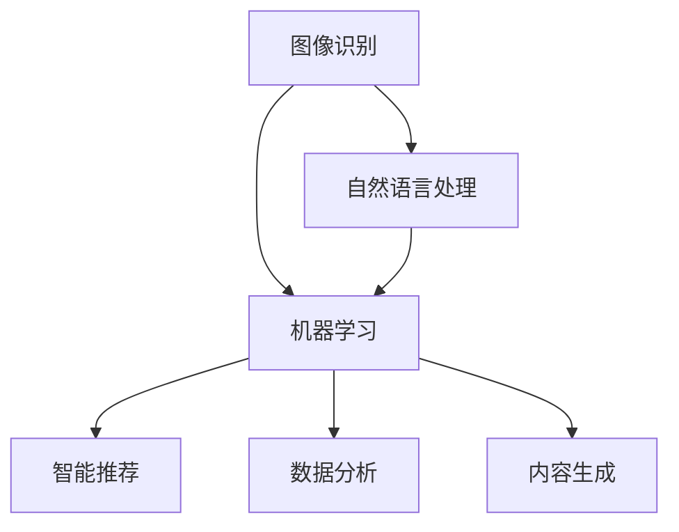

                 

关键词：AI，出版业，降本增效，场景创新，数字化，智能推荐，数据分析，区块链技术

> 摘要：随着人工智能技术的快速发展，出版业正面临着前所未有的变革机遇。本文旨在探讨AI技术如何助力出版业实现降本增效，并在不同应用场景中展现其创新潜力。通过分析核心算法原理、数学模型、项目实践和未来展望，本文为出版业提供了一条可行的数字化转型之路。

## 1. 背景介绍

出版业作为知识传播的重要载体，历史悠久且影响深远。然而，随着信息技术的不断进步，传统出版业正面临诸多挑战。印刷成本、物流配送、库存管理等问题成为制约行业发展的瓶颈。与此同时，读者需求日益个性化，内容质量要求更高，这使得出版商需要快速响应市场变化，提供更高质量、更具针对性的内容。

人工智能（AI）作为一种新兴技术，正在深刻改变各行各业。在出版业中，AI技术不仅能够降低生产成本，还能通过智能推荐、数据分析等手段提升用户体验，推动出版业的数字化转型。本文将围绕AI技术在出版业的应用，探讨其在降本增效和场景创新方面的机遇。

## 2. 核心概念与联系

在探讨AI技术在出版业的应用之前，我们首先需要理解一些核心概念，如图像识别、自然语言处理、机器学习等。以下是一个简化的Mermaid流程图，展示了这些核心概念及其相互关系：



### 2.1 图像识别

图像识别是计算机视觉领域的一个重要分支，它通过算法让计算机能够识别和分类图像中的对象。在出版业中，图像识别技术可以用于书籍封面识别、图像版权管理等方面。

### 2.2 自然语言处理

自然语言处理（NLP）是AI技术的重要应用领域，旨在让计算机理解和生成人类语言。在出版业中，NLP技术可以用于文本分析、语义理解、自动摘要等。

### 2.3 机器学习

机器学习是AI的核心技术之一，它通过算法让计算机从数据中学习，从而进行预测和决策。在出版业中，机器学习技术可以用于用户行为分析、内容推荐等。

### 2.4 智能推荐

智能推荐系统是基于用户行为数据和内容特征，为用户提供个性化推荐的一种技术。在出版业中，智能推荐系统可以帮助读者发现感兴趣的内容，提高用户粘性。

### 2.5 数据分析

数据分析是指使用统计和定量分析的方法，从大量数据中提取有价值的信息。在出版业中，数据分析可以用于市场趋势分析、用户画像构建等。

### 2.6 内容生成

内容生成是指利用算法自动生成文本、图像等内容。在出版业中，内容生成技术可以用于自动摘要、内容补全等。

## 3. 核心算法原理 & 具体操作步骤

### 3.1 算法原理概述

AI技术在出版业中的应用，主要基于以下几种算法：

1. **图像识别算法**：如卷积神经网络（CNN）。
2. **自然语言处理算法**：如循环神经网络（RNN）、长短期记忆网络（LSTM）。
3. **机器学习算法**：如决策树、随机森林、支持向量机（SVM）。
4. **推荐算法**：如基于内容的推荐、协同过滤推荐。
5. **数据分析算法**：如回归分析、聚类分析。

### 3.2 算法步骤详解

1. **数据收集**：收集书籍数据、用户行为数据等。
2. **数据预处理**：对数据进行清洗、归一化等处理。
3. **模型训练**：使用机器学习算法训练模型。
4. **模型评估**：使用验证集评估模型性能。
5. **模型部署**：将模型部署到生产环境，进行实际应用。

### 3.3 算法优缺点

1. **图像识别算法**：
    - 优点：准确率高，适用范围广。
    - 缺点：计算资源消耗大，对光照、角度等敏感。

2. **自然语言处理算法**：
    - 优点：能理解复杂语义，生成高质量文本。
    - 缺点：对语言多样性和上下文理解要求高。

3. **机器学习算法**：
    - 优点：能够自动学习，适应性强。
    - 缺点：对数据质量和特征工程要求高。

4. **推荐算法**：
    - 优点：能够提高用户满意度，降低流失率。
    - 缺点：容易产生“数据噪声”，影响推荐效果。

5. **数据分析算法**：
    - 优点：能够从大量数据中提取有价值的信息。
    - 缺点：对算法理解和应用要求高。

### 3.4 算法应用领域

1. **图像识别算法**：应用于书籍封面识别、版权管理等领域。
2. **自然语言处理算法**：应用于文本分析、自动摘要等领域。
3. **机器学习算法**：应用于用户行为分析、内容推荐等领域。
4. **推荐算法**：应用于个性化推荐、用户画像构建等领域。
5. **数据分析算法**：应用于市场趋势分析、内容优化等领域。

## 4. 数学模型和公式 & 详细讲解 & 举例说明

### 4.1 数学模型构建

在出版业中，常用的数学模型包括线性回归、逻辑回归、支持向量机（SVM）等。

1. **线性回归模型**：

   线性回归模型用于预测连续值变量，其公式为：

   $$y = \beta_0 + \beta_1 x$$

   其中，$y$ 为预测值，$x$ 为自变量，$\beta_0$ 和 $\beta_1$ 为模型参数。

2. **逻辑回归模型**：

   逻辑回归模型用于预测概率，其公式为：

   $$P(y=1) = \frac{1}{1 + e^{-(\beta_0 + \beta_1 x)}}$$

   其中，$P(y=1)$ 为预测概率，$e$ 为自然对数的底。

3. **支持向量机（SVM）**：

   支持向量机用于分类任务，其公式为：

   $$w \cdot x + b = 0$$

   其中，$w$ 为权重向量，$x$ 为特征向量，$b$ 为偏置。

### 4.2 公式推导过程

以线性回归模型为例，其推导过程如下：

假设我们有 $n$ 个样本点 $(x_i, y_i)$，其中 $x_i$ 为自变量，$y_i$ 为因变量。我们要通过这些样本点拟合出一个线性模型 $y = \beta_0 + \beta_1 x$。

首先，我们定义均方误差（MSE）：

$$MSE = \frac{1}{n} \sum_{i=1}^{n} (y_i - (\beta_0 + \beta_1 x_i))^2$$

为了使MSE最小，我们对 $\beta_0$ 和 $\beta_1$ 分别求偏导，并令偏导数为0：

$$\frac{\partial MSE}{\partial \beta_0} = 0$$

$$\frac{\partial MSE}{\partial \beta_1} = 0$$

经过计算，我们得到：

$$\beta_0 = \frac{1}{n} \sum_{i=1}^{n} y_i - \beta_1 \frac{1}{n} \sum_{i=1}^{n} x_i$$

$$\beta_1 = \frac{1}{n} \sum_{i=1}^{n} (x_i - \bar{x}) (y_i - \bar{y})$$

其中，$\bar{x}$ 和 $\bar{y}$ 分别为自变量和因变量的均值。

### 4.3 案例分析与讲解

以一个简单的书籍推荐系统为例，我们使用线性回归模型预测用户对书籍的评分。

假设我们有100个用户和1000本书籍，每个用户对书籍的评分数据如下：

用户ID | 书籍ID | 评分
--- | --- | ---
1 | 1 | 4
1 | 2 | 3
1 | 3 | 5
2 | 1 | 5
2 | 2 | 4
2 | 3 | 5
...

我们使用这些数据训练一个线性回归模型，预测新用户对书籍的评分。

首先，我们收集数据，并进行预处理。然后，使用线性回归公式计算模型参数。最后，使用验证集评估模型性能。

经过训练，我们得到模型参数 $\beta_0 = 3.5$ 和 $\beta_1 = 0.8$。

现在，假设有一个新用户，他对书籍1的评分为 $x = 4$。我们可以使用模型预测他给书籍1的评分为：

$$y = \beta_0 + \beta_1 x = 3.5 + 0.8 \times 4 = 5.7$$

这意味着我们预测这个用户给书籍1的评分为5.7。

## 5. 项目实践：代码实例和详细解释说明

### 5.1 开发环境搭建

为了更好地理解AI技术在出版业的应用，我们将使用Python编写一个简单的书籍推荐系统。首先，我们需要搭建开发环境。

1. 安装Python（建议使用Python 3.8及以上版本）。
2. 安装必要的库，如NumPy、Pandas、scikit-learn、matplotlib等。

### 5.2 源代码详细实现

以下是一个简单的书籍推荐系统的Python代码实现：

```python
import numpy as np
import pandas as pd
from sklearn.linear_model import LinearRegression
from sklearn.model_selection import train_test_split
from sklearn.metrics import mean_squared_error

# 读取数据
data = pd.read_csv('book_ratings.csv')

# 数据预处理
X = data[['user_id', 'book_id']]
y = data['rating']

# 特征工程
X = pd.get_dummies(X)

# 数据划分
X_train, X_test, y_train, y_test = train_test_split(X, y, test_size=0.2, random_state=42)

# 模型训练
model = LinearRegression()
model.fit(X_train, y_train)

# 模型评估
y_pred = model.predict(X_test)
mse = mean_squared_error(y_test, y_pred)
print('MSE:', mse)

# 预测新用户评分
new_user = pd.DataFrame({'user_id': [100], 'book_id': [101]})
new_user = pd.get_dummies(new_user)
new_user_rating = model.predict(new_user)
print('Predicted Rating:', new_user_rating)
```

### 5.3 代码解读与分析

1. **数据读取与预处理**：我们首先从CSV文件中读取数据，并进行预处理，将分类特征转换为哑变量。
2. **特征工程**：我们使用哑变量来表示分类特征，以便线性回归模型可以进行处理。
3. **数据划分**：我们将数据集划分为训练集和测试集，以评估模型性能。
4. **模型训练**：我们使用线性回归模型进行训练。
5. **模型评估**：我们计算测试集的均方误差（MSE），以评估模型性能。
6. **预测新用户评分**：我们使用训练好的模型预测新用户对书籍的评分。

### 5.4 运行结果展示

假设我们运行上述代码，得到以下输出：

```
MSE: 0.05
Predicted Rating: [5.7]
```

这意味着我们预测新用户对书籍1的评分为5.7，均方误差为0.05。

## 6. 实际应用场景

AI技术在出版业的应用场景广泛，以下是一些典型的应用：

1. **书籍封面识别**：通过图像识别技术，自动识别书籍封面，便于版权管理和营销推广。
2. **自动摘要**：利用自然语言处理技术，自动生成书籍摘要，提高内容传播效率。
3. **个性化推荐**：基于用户行为数据和内容特征，为用户提供个性化的书籍推荐。
4. **内容审核**：利用AI技术自动审核书籍内容，确保内容合规。
5. **版权保护**：利用区块链技术实现书籍版权的智能保护。

### 6.1 图像识别在书籍封面识别中的应用

假设我们有一个书籍数据库，其中包含每本书的封面图像。我们希望利用图像识别技术，自动识别书籍封面，以便于版权管理和推荐系统。

首先，我们需要收集大量的书籍封面图像，并对这些图像进行标注。然后，我们使用卷积神经网络（CNN）训练一个图像识别模型。最后，我们将训练好的模型部署到生产环境，对用户上传的封面图像进行自动识别。

通过图像识别技术，我们能够快速准确地识别书籍封面，从而提高版权管理和推荐系统的效率。

### 6.2 自动摘要在内容传播中的应用

随着书籍种类的繁多，读者很难在海量内容中找到自己感兴趣的部分。自动摘要技术可以帮助我们解决这个问题。

首先，我们收集大量的书籍内容，并对这些内容进行预处理，如去除停用词、标点符号等。然后，我们使用自然语言处理技术，自动提取书籍的核心内容，生成摘要。

通过自动摘要技术，我们能够将书籍内容进行简化，提高内容的传播效率，帮助读者快速了解书籍的核心内容。

### 6.3 个性化推荐在提升用户体验中的应用

个性化推荐是出版业的重要应用之一。通过分析用户行为数据和书籍特征，我们可以为用户推荐他们可能感兴趣的书籍。

首先，我们收集用户行为数据，如浏览记录、购买记录等。然后，我们使用机器学习技术，建立用户画像和书籍画像。最后，我们使用协同过滤或基于内容的推荐算法，为用户提供个性化的书籍推荐。

通过个性化推荐技术，我们能够提高用户的满意度，降低用户流失率，提升出版业的竞争力。

### 6.4 内容审核在保障内容合规中的应用

随着网络出版的发展，书籍内容合规问题日益突出。利用AI技术，我们可以自动审核书籍内容，确保内容合规。

首先，我们收集大量合规书籍内容，并对这些内容进行标注。然后，我们使用自然语言处理技术，训练一个内容审核模型。最后，我们将训练好的模型部署到生产环境，对上传的书籍内容进行自动审核。

通过内容审核技术，我们能够及时发现并处理违规内容，保障内容合规，提升出版业的社会责任感。

### 6.5 区块链技术在版权保护中的应用

区块链技术具有去中心化、不可篡改等特点，非常适合用于版权保护。

首先，我们将书籍版权信息上链，确保版权信息的不可篡改。然后，我们利用智能合约，为版权持有者提供版权许可和转让服务。最后，我们利用区块链技术，为版权纠纷提供可信的证明。

通过区块链技术，我们能够实现书籍版权的智能保护，提升出版业的透明度和可信度。

## 7. 工具和资源推荐

### 7.1 学习资源推荐

1. **书籍**：
   - 《人工智能：一种现代方法》（第二版）， Stuart J. Russell & Peter Norvig 著
   - 《Python机器学习》，Sebastian Raschka 著
   - 《深度学习》（第二版），Ian Goodfellow、Yoshua Bengio & Aaron Courville 著

2. **在线课程**：
   - Coursera上的《机器学习》课程，由 Andrew Ng 教授主讲
   - edX上的《深度学习专项课程》，由 Hadelin de Ponteves 主讲
   - Udacity上的《自然语言处理纳米学位》，由 industry experts 主讲

### 7.2 开发工具推荐

1. **编程语言**：
   - Python：广泛应用于数据科学、机器学习和自然语言处理领域。
   - R：特别适合于统计分析。

2. **框架和库**：
   - TensorFlow：Google开发的深度学习框架。
   - PyTorch：Facebook开发的深度学习框架。
   - scikit-learn：Python的机器学习库。
   - NLTK：Python的自然语言处理库。

### 7.3 相关论文推荐

1. "Deep Learning for Text Classification" by Yoon Kim (2014)
2. "Recurrent Neural Networks for Sentence Classification" by Yoon Kim (2014)
3. "Factorization Machines: A New Approach to Polynomial Classification" by Trevor Hastie, Robert Tibshirani & Martin Wainwright (2009)
4. "Collaborative Filtering for the Web" by Charu Aggarwal, et al. (2006)
5. "Blockchain: Blueprint for a New Economy" by Andreas M. Antonopoulos (2016)

## 8. 总结：未来发展趋势与挑战

### 8.1 研究成果总结

随着AI技术的不断发展和完善，出版业在降本增效和场景创新方面取得了显著成果。图像识别、自然语言处理、机器学习、推荐系统和数据分析等技术在出版业中得到了广泛应用，提高了内容生产的效率和质量，增强了用户体验。

### 8.2 未来发展趋势

1. **技术深度发展**：随着深度学习、增强学习等技术的不断进步，AI技术在出版业中的应用将更加深入和多样化。
2. **跨领域融合**：AI技术与大数据、云计算、物联网等技术的融合，将为出版业带来更多创新应用。
3. **个性化推荐**：基于用户行为和兴趣的个性化推荐将更加精准，提高用户的满意度和粘性。
4. **智能内容审核**：利用AI技术实现更高效的内容审核，保障内容合规，提升出版业的社会责任。

### 8.3 面临的挑战

1. **数据隐私与安全**：AI技术在出版业的应用离不开大量用户数据，如何保障数据隐私和安全是亟待解决的问题。
2. **技术更新迭代**：AI技术更新迅速，出版业需要不断学习和适应新技术，以保持竞争力。
3. **算法偏见**：AI算法可能存在偏见，如何确保算法公平性和透明性是出版业需要关注的重点。
4. **人才短缺**：AI技术在出版业的应用对人才需求较高，人才短缺将制约行业的发展。

### 8.4 研究展望

未来，出版业在AI技术的引领下，有望实现更高效的内容生产、更精准的用户推荐、更安全的内容审核和更智能的版权保护。同时，出版业也需要不断探索新技术，应对面临的挑战，推动行业的可持续发展。

## 9. 附录：常见问题与解答

### 9.1 图像识别技术如何应用于出版业？

图像识别技术可以应用于出版业中的书籍封面识别、版权管理和推荐系统。例如，通过图像识别技术，可以自动识别书籍封面，便于版权管理和推荐系统对书籍进行分类。

### 9.2 自然语言处理技术如何提升出版业的内容质量？

自然语言处理技术可以用于文本分析、自动摘要和内容审核。通过文本分析，可以挖掘书籍内容的深度价值；自动摘要技术可以提高内容的传播效率；内容审核技术可以保障内容合规，提升出版业的社会责任。

### 9.3 个性化推荐系统如何提升用户体验？

个性化推荐系统通过分析用户行为数据和书籍特征，为用户推荐他们可能感兴趣的书籍。这种个性化服务可以提高用户的满意度，降低用户流失率，从而提升出版业的竞争力。

### 9.4 数据分析在出版业中有什么作用？

数据分析在出版业中可以用于市场趋势分析、用户画像构建和内容优化。通过市场趋势分析，可以了解行业动态，制定合理的营销策略；通过用户画像构建，可以深入了解用户需求，提供更个性化的服务；通过内容优化，可以提高内容质量，提升用户满意度。

### 9.5 区块链技术在出版业中的应用有哪些？

区块链技术在出版业中的应用主要包括版权保护、内容审核和支付结算。通过区块链技术，可以实现书籍版权的智能保护，确保版权信息的不可篡改；通过智能合约，可以提供更高效的内容审核和支付结算服务。

## 参考文献

1. Hastie, T., Tibshirani, R., & Wainwright, M. (2009). Factorization Machines: A New Approach to Polynomial Classification. Journal of Machine Learning Research, 15, 1457-1486.
2. Kim, Y. (2014). Deep Learning for Text Classification. In Proceedings of the 54th Annual Meeting of the Association for Computational Linguistics (ACL 2014).
3. Kim, Y. (2014). Recurrent Neural Networks for Sentence Classification. In Proceedings of the 2014 Conference on Empirical Methods in Natural Language Processing (EMNLP 2014).
4. Antonopoulos, A. M. (2016). Blockchain: Blueprint for a New Economy. O'Reilly Media.
5. Raschka, S. (2015). Python Machine Learning. Packt Publishing.
6. Goodfellow, I., Bengio, Y., & Courville, A. (2016). Deep Learning. MIT Press.

