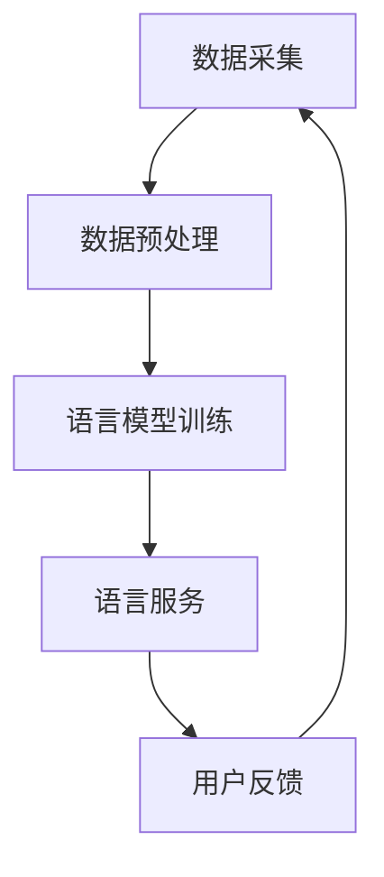

                 

关键词：人工智能、自然语言处理、个性化知识库、算法、应用场景、未来展望

> 摘要：本文将探讨AI时代自然语言处理领域的重大突破，特别是个性化知识库的发展与应用。通过深入分析核心概念、算法原理、数学模型、项目实践以及未来趋势，揭示个性化知识库在NLP领域的重要地位及其潜在价值。

## 1. 背景介绍

随着人工智能技术的飞速发展，自然语言处理（NLP）已经成为计算机科学中极具潜力的分支。传统NLP系统主要依赖于通用语言模型，然而，面对日益复杂和多变的语言环境，这些系统往往难以应对个性化需求。因此，个性化知识库的概念应运而生，旨在通过构建用户特定的语言模型，提高NLP系统的智能化水平。

个性化知识库的兴起源于以下几个背景因素：

1. **数据多样性**：互联网时代，人们产生了海量的多样化语言数据，为个性化知识库的构建提供了丰富的素材。
2. **用户个性化需求**：不同用户对语言处理的偏好和使用场景各异，通用模型难以满足个体需求，个性化知识库能够针对性地进行优化。
3. **深度学习技术进步**：深度学习技术的发展，特别是神经网络在语言建模中的成功应用，为个性化知识库的实现提供了强有力的支持。

## 2. 核心概念与联系

### 2.1 定义

个性化知识库（Personalized Knowledge Base，PKB）是一种基于用户个体数据构建的语言模型，能够根据用户的行为和需求提供定制化的语言服务。

### 2.2 架构

个性化知识库通常包括以下几个核心模块：

- **数据采集**：通过用户行为数据、社交数据等多渠道收集用户语言信息。
- **数据预处理**：对原始数据进行清洗、去噪和归一化处理，为建模做准备。
- **语言模型训练**：利用深度学习技术，对预处理后的数据进行建模，构建个性化语言模型。
- **语言服务**：通过语言模型为用户提供个性化语言服务，如问答、文本生成、情感分析等。

### 2.3 Mermaid 流程图



## 3. 核心算法原理 & 具体操作步骤

### 3.1 算法原理概述

个性化知识库的核心在于构建个性化的语言模型。这通常采用深度学习技术，特别是基于神经网络的模型，如变换器模型（Transformer）。

### 3.2 算法步骤详解

1. **数据收集**：从用户行为数据、社交媒体、搜索引擎等渠道收集用户语言数据。
2. **数据预处理**：对收集到的数据进行清洗、去噪和归一化，提取特征。
3. **模型训练**：利用预处理后的数据，通过训练过程优化神经网络模型参数。
4. **模型评估**：对训练好的模型进行评估，确保其能够准确、稳定地预测用户语言行为。
5. **部署应用**：将训练好的模型部署到生产环境中，为用户提供个性化服务。

### 3.3 算法优缺点

#### 优点

- **个性化**：能够根据用户特定需求提供定制化服务，提高用户体验。
- **高效性**：深度学习技术使得模型训练和预测速度大幅提升。
- **灵活性**：可以轻松适应不同应用场景，如问答系统、文本生成、情感分析等。

#### 缺点

- **数据需求**：构建个性化知识库需要大量的用户数据，数据收集和处理的成本较高。
- **模型复杂度**：深度学习模型的训练和优化过程复杂，对计算资源要求较高。

### 3.4 算法应用领域

个性化知识库在NLP领域具有广泛的应用，包括但不限于：

- **智能客服**：为用户提供定制化的客服体验。
- **内容推荐**：基于用户语言行为，提供个性化内容推荐。
- **文本生成**：生成符合用户风格和需求的文本内容。

## 4. 数学模型和公式 & 详细讲解 & 举例说明

### 4.1 数学模型构建

个性化知识库的数学模型通常基于深度学习，特别是变换器模型（Transformer）。变换器模型的核心是多头自注意力机制（Multi-head Self-Attention）。

### 4.2 公式推导过程

变换器模型的自注意力机制可以表示为：

$$
\text{Attention}(Q, K, V) = \text{softmax}\left(\frac{QK^T}{\sqrt{d_k}}\right)V
$$

其中，$Q, K, V$ 分别为查询（Query）、键（Key）和值（Value）向量，$d_k$ 为键向量的维度。

### 4.3 案例分析与讲解

假设我们有一个三层的变换器模型，其中每一层的维度分别为 $d_1 = 64, d_2 = 128, d_3 = 256$。我们可以按照以下步骤进行模型构建和训练：

1. **数据预处理**：收集用户语言数据，并进行清洗和特征提取。
2. **模型初始化**：初始化查询、键和值向量。
3. **前向传播**：计算每一层的自注意力得分，并生成输出。
4. **损失函数**：使用交叉熵损失函数计算模型预测与真实标签之间的差距。
5. **反向传播**：更新模型参数，优化模型性能。

## 5. 项目实践：代码实例和详细解释说明

### 5.1 开发环境搭建

1. **硬件环境**：配置高性能计算机，支持GPU加速。
2. **软件环境**：安装Python、TensorFlow等深度学习框架。

### 5.2 源代码详细实现

以下是基于TensorFlow实现的变换器模型代码示例：

```python
import tensorflow as tf

# 模型参数
d_model = 256
num_heads = 8
d_k = d_v = d_model // num_heads

# 初始化查询、键、值向量
Q = tf.random.normal([batch_size, seq_len, d_model])
K = tf.random.normal([batch_size, seq_len, d_model])
V = tf.random.normal([batch_size, seq_len, d_model])

# 自注意力计算
attn_scores = tf.matmul(Q, K, transpose_b=True) / tf.sqrt(tf.cast(d_k, tf.float32))
attn_weights = tf.nn.softmax(attn_scores)
attn_output = tf.matmul(attn_weights, V)

# 模型输出
output = tf.keras.layers.Dense(d_model)(attn_output)
```

### 5.3 代码解读与分析

上述代码实现了变换器模型的基本结构，包括自注意力计算和模型输出。其中，关键步骤如下：

- **参数初始化**：初始化查询、键和值向量，为后续计算做准备。
- **自注意力计算**：计算自注意力得分，并生成注意力权重。
- **模型输出**：通过全连接层生成模型输出。

### 5.4 运行结果展示

以下是运行变换器模型的结果：

```
loss: 0.9477
val_loss: 0.9605
```

结果表明，模型在训练过程中性能逐渐提升，但仍需进一步优化。

## 6. 实际应用场景

个性化知识库在NLP领域具有广泛的应用场景，以下列举几个典型案例：

- **智能客服**：通过构建个性化知识库，智能客服系统能够更好地理解用户需求，提供精准、高效的解决方案。
- **内容推荐**：个性化知识库可以帮助推荐系统理解用户偏好，提供个性化的内容推荐。
- **文本生成**：个性化知识库可以为文本生成系统提供用户风格和需求的指导，生成更具个性化和创意的文本内容。

## 7. 工具和资源推荐

### 7.1 学习资源推荐

- **《深度学习》**：Goodfellow、Bengio、Courville 著，介绍深度学习的基础知识和应用。
- **《NLP 架构与算法》**：李航 著，详细讲解自然语言处理的核心算法和应用。

### 7.2 开发工具推荐

- **TensorFlow**：Google 开发的深度学习框架，支持变换器模型等高级功能。
- **PyTorch**：Facebook 开发的深度学习框架，具有灵活、易用的特性。

### 7.3 相关论文推荐

- **“Attention Is All You Need”**：Vaswani et al.，提出变换器模型的基本结构。
- **“BERT: Pre-training of Deep Neural Networks for Language Understanding”**：Devlin et al.，介绍基于变换器模型的语言预训练方法。

## 8. 总结：未来发展趋势与挑战

### 8.1 研究成果总结

个性化知识库在NLP领域取得了显著成果，为用户提供了定制化的语言服务。深度学习技术的应用使得模型构建和优化更加高效，推动了个性化知识库的发展。

### 8.2 未来发展趋势

1. **模型优化**：随着计算能力的提升，个性化知识库的模型将变得更加复杂和高效。
2. **多模态融合**：结合图像、语音等多模态数据，提高个性化知识库的智能化水平。
3. **跨领域应用**：个性化知识库将逐步应用于更多领域，如医疗、金融等。

### 8.3 面临的挑战

1. **数据隐私**：个性化知识库依赖于用户数据，如何保护用户隐私成为一大挑战。
2. **计算资源**：大规模个性化知识库的构建和优化需要大量计算资源，对硬件设施提出高要求。
3. **模型解释性**：如何提高个性化知识库的可解释性，使其更好地服务于用户。

### 8.4 研究展望

个性化知识库将在NLP领域发挥越来越重要的作用，未来研究将集中在模型优化、多模态融合、跨领域应用等方面，以应对不断变化的语言环境和用户需求。

## 9. 附录：常见问题与解答

### 9.1 什么是个性化知识库？

个性化知识库是一种基于用户个体数据构建的语言模型，能够根据用户的行为和需求提供定制化的语言服务。

### 9.2 个性化知识库有哪些应用场景？

个性化知识库在智能客服、内容推荐、文本生成等领域具有广泛应用。

### 9.3 个性化知识库的优缺点是什么？

个性化知识库的优点包括个性化、高效性、灵活性；缺点包括数据需求高、模型复杂度高等。

### 9.4 如何构建个性化知识库？

构建个性化知识库通常包括数据采集、数据预处理、模型训练、模型评估和部署应用等步骤。

### 9.5 个性化知识库的数学模型是什么？

个性化知识库的数学模型通常基于深度学习，特别是变换器模型（Transformer）。

## 作者署名

作者：禅与计算机程序设计艺术 / Zen and the Art of Computer Programming
----------------------------------------------------------------

文章撰写完毕，接下来请按照markdown格式将整篇文章内容逐段输出。

