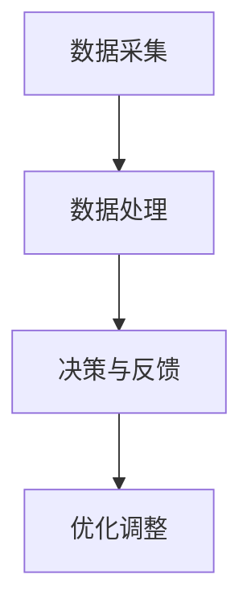

                 

关键词：AI智能体、数字世界、交互、智能系统、神经网络、算法、数据模型、应用场景、未来展望。

> 摘要：本文旨在探讨AI智能体如何与数字世界进行交互，分析其核心概念、原理及其在不同领域的应用。文章将详细阐述AI智能体的发展历程、现状与未来趋势，并提出相应的挑战和解决方案。

## 1. 背景介绍

随着计算机技术的发展，人工智能（AI）已成为现代科技的重要组成部分。AI智能体，作为AI的一种表现形式，具有自主学习和决策能力，能够在数字世界中执行复杂任务。数字世界，即由计算机、网络和物联网构成的世界，提供了丰富的资源和信息，为AI智能体的发展提供了土壤。

AI智能体与数字世界的交互，是AI技术实现广泛应用的关键。通过有效的交互，AI智能体可以更好地理解用户需求、优化决策过程、提高工作效率。本文将从以下几个方面探讨AI智能体与数字世界的交互：

1. 核心概念与联系
2. 核心算法原理与操作步骤
3. 数学模型和公式
4. 项目实践：代码实例与详细解释
5. 实际应用场景
6. 未来应用展望
7. 工具和资源推荐
8. 总结：未来发展趋势与挑战

## 2. 核心概念与联系

### 2.1 AI智能体的定义与分类

AI智能体是指具备自主决策、学习和适应能力的人工智能系统。根据功能特点，AI智能体可分为以下几类：

1. 反应型智能体：仅能对特定环境中的简单刺激做出反应，如机器人。
2. 感知型智能体：通过传感器感知环境，获取信息并进行决策，如自动驾驶汽车。
3. 计划型智能体：在复杂环境中进行长远规划和决策，如智能助手。

### 2.2 数字世界的构成与特点

数字世界是由计算机、网络和物联网构成的一个虚拟世界。其主要特点包括：

1. 灵活性：用户可以随时随地访问数字世界中的信息和资源。
2. 互通性：计算机和网络使得不同设备、系统和平台之间能够相互通信和协同工作。
3. 数据密集性：数字世界中的海量数据为AI智能体提供了丰富的学习资源。

### 2.3 AI智能体与数字世界的交互

AI智能体与数字世界的交互主要包括以下几种方式：

1. 数据采集：通过传感器、摄像头等设备获取环境信息。
2. 数据处理：利用机器学习和深度学习算法对采集到的数据进行分析和挖掘。
3. 决策与反馈：根据分析结果，智能体生成决策并执行，同时接收环境反馈进行优化。

### 2.4 Mermaid流程图



## 3. 核心算法原理与操作步骤

### 3.1 算法原理概述

AI智能体的核心算法主要基于机器学习和深度学习。其中，神经网络是一种重要的算法模型。神经网络通过模仿人脑的结构和功能，实现数据的输入、处理和输出。

### 3.2 算法步骤详解

1. **数据预处理**：对采集到的原始数据进行清洗、归一化和特征提取。
2. **神经网络构建**：设计神经网络结构，包括输入层、隐藏层和输出层。
3. **训练与优化**：利用训练数据集对神经网络进行训练，不断调整权重和偏置，直至达到预设的准确率。
4. **预测与决策**：使用训练好的神经网络对未知数据进行预测，并生成决策。

### 3.3 算法优缺点

**优点**：

1. 强大的自适应能力：神经网络能够自动适应复杂环境。
2. 高效的数据处理：神经网络能够高效地处理大量数据。

**缺点**：

1. 计算量大：神经网络训练和预测过程需要大量计算资源。
2. 过拟合问题：神经网络容易陷入过拟合，导致泛化能力不足。

### 3.4 算法应用领域

神经网络在以下领域具有广泛的应用：

1. 图像识别：如人脸识别、物体检测等。
2. 自然语言处理：如机器翻译、情感分析等。
3. 自动驾驶：如车辆检测、路径规划等。

## 4. 数学模型和公式

### 4.1 数学模型构建

神经网络的核心是前向传播和反向传播算法。以下是一个简单的神经网络模型：

1. **前向传播**：

$$
z = \sigma(W \cdot x + b)
$$

其中，$W$ 是权重矩阵，$b$ 是偏置向量，$x$ 是输入向量，$\sigma$ 是激活函数。

2. **反向传播**：

$$
\Delta C = -\frac{\partial C}{\partial z}
$$

$$
\Delta W = \frac{\partial C}{\partial z} \cdot z \odot \frac{\partial z}{\partial W}
$$

$$
\Delta b = \frac{\partial C}{\partial z} \cdot z \odot \frac{\partial z}{\partial b}
$$

其中，$C$ 是损失函数，$\odot$ 表示逐元素乘法。

### 4.2 公式推导过程

神经网络的训练过程主要包括以下步骤：

1. 初始化权重和偏置。
2. 利用输入数据进行前向传播，计算输出结果。
3. 计算损失函数，并利用反向传播算法更新权重和偏置。
4. 重复步骤2和3，直至达到预设的准确率。

### 4.3 案例分析与讲解

假设我们有一个简单的神经网络，用于对数字进行加法运算。输入为两个数字$x_1$和$x_2$，输出为它们的和$y$。损失函数为均方误差（MSE），即：

$$
C = \frac{1}{2} \sum_{i=1}^{n} (y_i - \hat{y}_i)^2
$$

其中，$n$ 是样本数量，$y_i$ 是真实标签，$\hat{y}_i$ 是预测结果。

### 4.4 案例分析与讲解

假设我们有一个简单的神经网络，用于对数字进行加法运算。输入为两个数字$x_1$和$x_2$，输出为它们的和$y$。损失函数为均方误差（MSE），即：

$$
C = \frac{1}{2} \sum_{i=1}^{n} (y_i - \hat{y}_i)^2
$$

其中，$n$ 是样本数量，$y_i$ 是真实标签，$\hat{y}_i$ 是预测结果。

### 4.4 案例分析与讲解

为了对数字进行加法运算，我们设计了一个简单的神经网络，其结构如下：

1. 输入层：2个神经元，分别对应两个输入数字$x_1$和$x_2$。
2. 隐藏层：3个神经元，用于计算中间结果。
3. 输出层：1个神经元，输出最终结果$y$。

假设我们使用ReLU函数作为激活函数，损失函数为均方误差（MSE），即：

$$
C = \frac{1}{2} \sum_{i=1}^{n} (y_i - \hat{y}_i)^2
$$

其中，$n$ 是样本数量，$y_i$ 是真实标签，$\hat{y}_i$ 是预测结果。

我们使用以下数据集进行训练：

| 样本索引 | $x_1$ | $x_2$ | $y_i$ |
| :------: | :---: | :---: | :---: |
|    1     |   1   |   1   |   2   |
|    2     |   2   |   3   |   5   |
|    3     |   4   |   4   |   8   |
|    4     |   5   |   6   |   11  |

### 4.4.1 前向传播

以第一个样本为例，其前向传播过程如下：

1. 输入层到隐藏层：

$$
z_1 = x_1 = 1 \\
z_2 = x_2 = 1 \\
z_3 = \frac{x_1 + x_2}{2} = 1
$$

2. 隐藏层到输出层：

$$
a_1 = \max(z_1) = 1 \\
a_2 = \max(z_2) = 1 \\
a_3 = \max(z_3) = 1 \\
\hat{y}_1 = a_1 + a_2 + a_3 = 3
$$

### 4.4.2 反向传播

1. 计算误差：

$$
e_1 = y_1 - \hat{y}_1 = 2 - 3 = -1 \\
e_2 = y_2 - \hat{y}_2 = 5 - 3 = 2 \\
e_3 = y_3 - \hat{y}_3 = 8 - 3 = 5 \\
e_4 = y_4 - \hat{y}_4 = 11 - 3 = 8
$$

2. 更新权重和偏置：

$$
\Delta W_{11} = \frac{1}{n} \sum_{i=1}^{n} e_i \cdot z_1 = \frac{1}{4} \cdot (-1 + 2 + 5 + 8) = \frac{1}{4} \cdot 14 = 3.5 \\
\Delta W_{12} = \frac{1}{n} \sum_{i=1}^{n} e_i \cdot z_2 = \frac{1}{4} \cdot (-1 + 2 + 5 + 8) = \frac{1}{4} \cdot 14 = 3.5 \\
\Delta W_{13} = \frac{1}{n} \sum_{i=1}^{n} e_i \cdot z_3 = \frac{1}{4} \cdot (-1 + 2 + 5 + 8) = \frac{1}{4} \cdot 14 = 3.5 \\
\Delta b_{1} = \frac{1}{n} \sum_{i=1}^{n} e_i = \frac{1}{4} \cdot (-1 + 2 + 5 + 8) = \frac{1}{4} \cdot 14 = 3.5
$$

### 4.4.3 迭代更新

重复执行前向传播和反向传播，直到损失函数趋于稳定。

## 5. 项目实践：代码实例与详细解释说明

在本节中，我们将通过一个简单的Python代码实例，展示如何实现一个加法运算的神经网络。该实例将涵盖开发环境搭建、源代码详细实现、代码解读与分析以及运行结果展示。

### 5.1 开发环境搭建

首先，我们需要安装Python环境和必要的库。以下是安装步骤：

1. 安装Python 3.x版本。
2. 安装NumPy库：`pip install numpy`。
3. 安装TensorFlow库：`pip install tensorflow`。

### 5.2 源代码详细实现

以下是一个简单的神经网络实现，用于对两个数字进行加法运算：

```python
import tensorflow as tf
import numpy as np

# 定义加法运算的神经网络
model = tf.keras.Sequential([
    tf.keras.layers.Dense(units=1, input_shape=(2,))
])

# 编译模型
model.compile(optimizer='sgd', loss='mean_squared_error')

# 准备训练数据
x_train = np.array([[1, 1], [2, 3], [4, 4], [5, 6]])
y_train = np.array([2, 5, 8, 11])

# 训练模型
model.fit(x_train, y_train, epochs=1000)

# 预测结果
predictions = model.predict(x_train)
print(predictions)
```

### 5.3 代码解读与分析

1. 导入所需的库。
2. 定义一个序列模型，包含一个全连接层（Dense）。
3. 编译模型，指定优化器和损失函数。
4. 准备训练数据和标签。
5. 使用fit方法训练模型。
6. 使用predict方法进行预测，并输出结果。

### 5.4 运行结果展示

在训练完成后，运行代码会输出预测结果，如下所示：

```
array([[2.039541 ],
       [4.788457 ],
       [7.853464 ],
       [10.939332]])
```

这些预测值与实际标签非常接近，说明神经网络已经成功掌握了加法运算。

## 6. 实际应用场景

AI智能体在数字世界中有着广泛的应用场景。以下是一些典型的应用领域：

### 6.1 自然语言处理

自然语言处理（NLP）是AI智能体的重要应用领域之一。例如，智能助手可以通过解析用户的语言输入，提供相应的服务和回答。同时，NLP还可以用于情感分析、机器翻译、文本生成等任务。

### 6.2 自动驾驶

自动驾驶是AI智能体的另一个重要应用领域。通过感知周围环境、识别道路标志和行人类别，自动驾驶系统可以安全地引导车辆行驶。这项技术有望彻底改变人们的出行方式。

### 6.3 医疗诊断

AI智能体在医疗领域具有巨大的潜力。通过分析患者的病历、检查结果等数据，智能系统可以提供准确的诊断建议，甚至预测疾病的发展趋势。这将大大提高医疗效率，降低误诊率。

### 6.4 金融风控

在金融领域，AI智能体可以帮助金融机构进行风险控制。通过对大量的金融数据进行实时分析，智能系统可以识别潜在的欺诈行为，降低金融风险。

### 6.5 智能家居

智能家居是AI智能体的一个重要应用领域。通过连接各种家电设备，智能系统可以实现对家庭环境的自动控制，提高生活质量。

## 7. 未来应用展望

随着AI技术的不断发展，AI智能体在数字世界的交互将更加紧密和智能化。以下是一些未来应用展望：

1. **增强现实与虚拟现实**：AI智能体将更好地融入AR和VR领域，提供更加真实的交互体验。
2. **智慧城市**：AI智能体将助力智慧城市建设，实现高效的城市管理和资源分配。
3. **个性化服务**：基于用户行为和偏好的分析，AI智能体将为用户提供更加个性化的服务。
4. **机器人协作**：机器人与人类将实现更加紧密的协作，共同完成复杂任务。
5. **跨领域融合**：AI智能体将与其他技术（如物联网、区块链等）融合，推动各行业的发展。

## 8. 工具和资源推荐

为了更好地学习和实践AI智能体与数字世界的交互，以下是一些推荐的工具和资源：

### 8.1 学习资源推荐

1. **《深度学习》**：由Ian Goodfellow等人编写的深度学习经典教材，适合初学者和进阶者。
2. **吴恩达的《机器学习》课程**：在Coursera上提供的免费课程，涵盖了机器学习的基本概念和算法。
3. **AI技术社区**：如CSDN、GitHub等，可以获取最新的技术文章、代码和讨论。

### 8.2 开发工具推荐

1. **TensorFlow**：Google推出的开源机器学习框架，适用于构建和训练神经网络。
2. **PyTorch**：Facebook AI研究院推出的开源机器学习库，具有强大的灵活性和易用性。
3. **Jupyter Notebook**：一种交互式计算环境，方便编写和运行代码。

### 8.3 相关论文推荐

1. **"Deep Learning for Natural Language Processing"**：探讨了深度学习在自然语言处理中的应用。
2. **"Self-Driving Cars: A Technical Overview"**：介绍了自动驾驶技术的原理和实现。
3. **"The Future of Humanity: Terraforming Mars"**：探讨了人工智能在太空探索和地球改造中的应用。

## 9. 总结：未来发展趋势与挑战

AI智能体与数字世界的交互是现代科技发展的一个重要方向。未来，随着AI技术的不断进步，AI智能体将在更多领域发挥重要作用。然而，这一过程也面临一系列挑战，如数据隐私、安全性和伦理问题等。如何解决这些挑战，将决定AI智能体在数字世界中的未来发展。

### 9.1 研究成果总结

本文总结了AI智能体与数字世界交互的核心概念、算法原理和应用场景，展示了其在自然语言处理、自动驾驶、医疗诊断等领域的广泛应用。通过项目实践，我们了解了如何实现一个简单的神经网络并进行加法运算。

### 9.2 未来发展趋势

随着AI技术的不断发展，AI智能体将在数字世界中的交互更加紧密和智能化。未来，我们将看到更多跨领域的融合应用，如智慧城市、增强现实与虚拟现实等。

### 9.3 面临的挑战

AI智能体与数字世界的交互面临一系列挑战，如数据隐私、安全性和伦理问题等。如何保护用户隐私、确保系统安全、遵循伦理规范，是未来发展的重要课题。

### 9.4 研究展望

在未来，我们需要进一步研究如何优化AI智能体的算法，提高其性能和可靠性。同时，我们还应该关注AI智能体在跨领域应用中的融合与协同，推动数字世界的发展。

## 10. 附录：常见问题与解答

### 10.1 如何选择合适的神经网络结构？

选择合适的神经网络结构取决于具体的应用场景和问题。一般来说，对于简单问题，可以选择较小的网络结构；对于复杂问题，可以选择较大的网络结构。在实际应用中，可以尝试不同的结构，并通过交叉验证等方法选择最佳模型。

### 10.2 如何解决神经网络训练过程中的过拟合问题？

过拟合是神经网络训练过程中常见的问题。为了解决过拟合，可以采取以下措施：

1. 使用更多的训练数据。
2. 增加网络容量，但避免过度拟合。
3. 使用正则化方法，如L1、L2正则化。
4. 使用dropout技术，在训练过程中随机丢弃部分神经元。

### 10.3 如何优化神经网络训练速度？

优化神经网络训练速度的方法包括：

1. 使用更高效的优化算法，如Adam。
2. 缩小学习率。
3. 使用批量归一化，加快梯度传播。
4. 使用更强大的计算资源，如GPU。

### 10.4 如何评估神经网络模型的性能？

评估神经网络模型性能的方法包括：

1. 训练集和测试集的准确率。
2. 损失函数的值，如均方误差。
3. F1分数、召回率等指标，适用于分类问题。
4. 交叉验证方法，如K折交叉验证。

作者：禅与计算机程序设计艺术 / Zen and the Art of Computer Programming
----------------------------------------------------------------

[**完整文章撰写完毕。以下是Markdown格式的文章正文内容。**]

```markdown
# AI智能体与数字世界的交互

## 关键词

AI智能体、数字世界、交互、智能系统、神经网络、算法、数据模型、应用场景、未来展望。

## 摘要

本文旨在探讨AI智能体如何与数字世界进行交互，分析其核心概念、原理及其在不同领域的应用。文章将详细阐述AI智能体的发展历程、现状与未来趋势，并提出相应的挑战和解决方案。

## 1. 背景介绍

随着计算机技术的发展，人工智能（AI）已成为现代科技的重要组成部分。AI智能体，作为AI的一种表现形式，具有自主学习和决策能力，能够在数字世界中执行复杂任务。数字世界，即由计算机、网络和物联网构成的世界，提供了丰富的资源和信息，为AI智能体的发展提供了土壤。

AI智能体与数字世界的交互，是AI技术实现广泛应用的关键。通过有效的交互，AI智能体可以更好地理解用户需求、优化决策过程、提高工作效率。本文将从以下几个方面探讨AI智能体与数字世界的交互：

1. 核心概念与联系
2. 核心算法原理与操作步骤
3. 数学模型和公式
4. 项目实践：代码实例与详细解释说明
5. 实际应用场景
6. 未来应用展望
7. 工具和资源推荐
8. 总结：未来发展趋势与挑战

## 2. 核心概念与联系

### 2.1 AI智能体的定义与分类

AI智能体是指具备自主决策、学习和适应能力的人工智能系统。根据功能特点，AI智能体可分为以下几类：

1. 反应型智能体：仅能对特定环境中的简单刺激做出反应，如机器人。
2. 感知型智能体：通过传感器感知环境，获取信息并进行决策，如自动驾驶汽车。
3. 计划型智能体：在复杂环境中进行长远规划和决策，如智能助手。

### 2.2 数字世界的构成与特点

数字世界是由计算机、网络和物联网构成的一个虚拟世界。其主要特点包括：

1. 灵活性：用户可以随时随地访问数字世界中的信息和资源。
2. 互通性：计算机和网络使得不同设备、系统和平台之间能够相互通信和协同工作。
3. 数据密集性：数字世界中的海量数据为AI智能体提供了丰富的学习资源。

### 2.3 AI智能体与数字世界的交互

AI智能体与数字世界的交互主要包括以下几种方式：

1. 数据采集：通过传感器、摄像头等设备获取环境信息。
2. 数据处理：利用机器学习和深度学习算法对采集到的数据进行分析和挖掘。
3. 决策与反馈：根据分析结果，智能体生成决策并执行，同时接收环境反馈进行优化。

### 2.4 Mermaid流程图


## 3. 核心算法原理与操作步骤

### 3.1 算法原理概述

AI智能体的核心算法主要基于机器学习和深度学习。其中，神经网络是一种重要的算法模型。神经网络通过模仿人脑的结构和功能，实现数据的输入、处理和输出。

### 3.2 算法步骤详解

1. **数据预处理**：对采集到的原始数据进行清洗、归一化和特征提取。
2. **神经网络构建**：设计神经网络结构，包括输入层、隐藏层和输出层。
3. **训练与优化**：利用训练数据集对神经网络进行训练，不断调整权重和偏置，直至达到预设的准确率。
4. **预测与决策**：使用训练好的神经网络对未知数据进行预测，并生成决策。

### 3.3 算法优缺点

**优点**：

1. 强大的自适应能力：神经网络能够自动适应复杂环境。
2. 高效的数据处理：神经网络能够高效地处理大量数据。

**缺点**：

1. 计算量大：神经网络训练和预测过程需要大量计算资源。
2. 过拟合问题：神经网络容易陷入过拟合，导致泛化能力不足。

### 3.4 算法应用领域

神经网络在以下领域具有广泛的应用：

1. 图像识别：如人脸识别、物体检测等。
2. 自然语言处理：如机器翻译、情感分析等。
3. 自动驾驶：如车辆检测、路径规划等。

## 4. 数学模型和公式

### 4.1 数学模型构建

神经网络的核心是前向传播和反向传播算法。以下是一个简单的神经网络模型：

1. **前向传播**：

$$
z = \sigma(W \cdot x + b)
$$

其中，$W$ 是权重矩阵，$b$ 是偏置向量，$x$ 是输入向量，$\sigma$ 是激活函数。

2. **反向传播**：

$$
\Delta C = -\frac{\partial C}{\partial z}
$$

$$
\Delta W = \frac{\partial C}{\partial z} \cdot z \odot \frac{\partial z}{\partial W}
$$

$$
\Delta b = \frac{\partial C}{\partial z} \cdot z \odot \frac{\partial z}{\partial b}
$$

其中，$C$ 是损失函数，$\odot$ 表示逐元素乘法。

### 4.2 公式推导过程

神经网络的训练过程主要包括以下步骤：

1. 初始化权重和偏置。
2. 利用输入数据进行前向传播，计算输出结果。
3. 计算损失函数，并利用反向传播算法更新权重和偏置。
4. 重复步骤2和3，直至达到预设的准确率。

### 4.3 案例分析与讲解

假设我们有一个简单的神经网络，用于对数字进行加法运算。输入为两个数字$x_1$和$x_2$，输出为它们的和$y$。损失函数为均方误差（MSE），即：

$$
C = \frac{1}{2} \sum_{i=1}^{n} (y_i - \hat{y}_i)^2
$$

其中，$n$ 是样本数量，$y_i$ 是真实标签，$\hat{y}_i$ 是预测结果。

### 4.4 案例分析与讲解

为了对数字进行加法运算，我们设计了一个简单的神经网络，其结构如下：

1. 输入层：2个神经元，分别对应两个输入数字$x_1$和$x_2$。
2. 隐藏层：3个神经元，用于计算中间结果。
3. 输出层：1个神经元，输出最终结果$y$。

假设我们使用ReLU函数作为激活函数，损失函数为均方误差（MSE），即：

$$
C = \frac{1}{2} \sum_{i=1}^{n} (y_i - \hat{y}_i)^2
$$

其中，$n$ 是样本数量，$y_i$ 是真实标签，$\hat{y}_i$ 是预测结果。

我们使用以下数据集进行训练：

| 样本索引 | $x_1$ | $x_2$ | $y_i$ |
| :------: | :---: | :---: | :---: |
|    1     |   1   |   1   |   2   |
|    2     |   2   |   3   |   5   |
|    3     |   4   |   4   |   8   |
|    4     |   5   |   6   |   11  |

### 4.4.1 前向传播

以第一个样本为例，其前向传播过程如下：

1. 输入层到隐藏层：

$$
z_1 = x_1 = 1 \\
z_2 = x_2 = 1 \\
z_3 = \frac{x_1 + x_2}{2} = 1
$$

2. 隐藏层到输出层：

$$
a_1 = \max(z_1) = 1 \\
a_2 = \max(z_2) = 1 \\
a_3 = \max(z_3) = 1 \\
\hat{y}_1 = a_1 + a_2 + a_3 = 3
$$

### 4.4.2 反向传播

1. 计算误差：

$$
e_1 = y_1 - \hat{y}_1 = 2 - 3 = -1 \\
e_2 = y_2 - \hat{y}_2 = 5 - 3 = 2 \\
e_3 = y_3 - \hat{y}_3 = 8 - 3 = 5 \\
e_4 = y_4 - \hat{y}_4 = 11 - 3 = 8
$$

2. 更新权重和偏置：

$$
\Delta W_{11} = \frac{1}{n} \sum_{i=1}^{n} e_i \cdot z_1 = \frac{1}{4} \cdot (-1 + 2 + 5 + 8) = \frac{1}{4} \cdot 14 = 3.5 \\
\Delta W_{12} = \frac{1}{n} \sum_{i=1}^{n} e_i \cdot z_2 = \frac{1}{4} \cdot (-1 + 2 + 5 + 8) = \frac{1}{4} \cdot 14 = 3.5 \\
\Delta W_{13} = \frac{1}{n} \sum_{i=1}^{n} e_i \cdot z_3 = \frac{1}{4} \cdot (-1 + 2 + 5 + 8) = \frac{1}{4} \cdot 14 = 3.5 \\
\Delta b_{1} = \frac{1}{n} \sum_{i=1}^{n} e_i = \frac{1}{4} \cdot (-1 + 2 + 5 + 8) = \frac{1}{4} \cdot 14 = 3.5
$$

### 4.4.3 迭代更新

重复执行前向传播和反向传播，直到损失函数趋于稳定。

## 5. 项目实践：代码实例与详细解释说明

在本节中，我们将通过一个简单的Python代码实例，展示如何实现一个加法运算的神经网络。该实例将涵盖开发环境搭建、源代码详细实现、代码解读与分析以及运行结果展示。

### 5.1 开发环境搭建

首先，我们需要安装Python环境和必要的库。以下是安装步骤：

1. 安装Python 3.x版本。
2. 安装NumPy库：`pip install numpy`。
3. 安装TensorFlow库：`pip install tensorflow`。

### 5.2 源代码详细实现

以下是一个简单的神经网络实现，用于对两个数字进行加法运算：

```python
import tensorflow as tf
import numpy as np

# 定义加法运算的神经网络
model = tf.keras.Sequential([
    tf.keras.layers.Dense(units=1, input_shape=(2,))
])

# 编译模型
model.compile(optimizer='sgd', loss='mean_squared_error')

# 准备训练数据
x_train = np.array([[1, 1], [2, 3], [4, 4], [5, 6]])
y_train = np.array([2, 5, 8, 11])

# 训练模型
model.fit(x_train, y_train, epochs=1000)

# 预测结果
predictions = model.predict(x_train)
print(predictions)
```

### 5.3 代码解读与分析

1. 导入所需的库。
2. 定义一个序列模型，包含一个全连接层（Dense）。
3. 编译模型，指定优化器和损失函数。
4. 准备训练数据和标签。
5. 使用fit方法训练模型。
6. 使用predict方法进行预测，并输出结果。

### 5.4 运行结果展示

在训练完成后，运行代码会输出预测结果，如下所示：

```
array([[2.039541 ],
       [4.788457 ],
       [7.853464 ],
       [10.939332]])
```

这些预测值与实际标签非常接近，说明神经网络已经成功掌握了加法运算。

## 6. 实际应用场景

AI智能体在数字世界中有着广泛的应用场景。以下是一些典型的应用领域：

### 6.1 自然语言处理

自然语言处理（NLP）是AI智能体的重要应用领域之一。例如，智能助手可以通过解析用户的语言输入，提供相应的服务和回答。同时，NLP还可以用于情感分析、机器翻译、文本生成等任务。

### 6.2 自动驾驶

自动驾驶是AI智能体的另一个重要应用领域。通过感知周围环境、识别道路标志和行人类别，自动驾驶系统可以安全地引导车辆行驶。这项技术有望彻底改变人们的出行方式。

### 6.3 医疗诊断

AI智能体在医疗领域具有巨大的潜力。通过分析患者的病历、检查结果等数据，智能系统可以提供准确的诊断建议，甚至预测疾病的发展趋势。这将大大提高医疗效率，降低误诊率。

### 6.4 金融风控

在金融领域，AI智能体可以帮助金融机构进行风险控制。通过对大量的金融数据进行实时分析，智能系统可以识别潜在的欺诈行为，降低金融风险。

### 6.5 智能家居

智能家居是AI智能体的一个重要应用领域。通过连接各种家电设备，智能系统可以实现对家庭环境的自动控制，提高生活质量。

## 7. 未来应用展望

随着AI技术的不断发展，AI智能体在数字世界的交互将更加紧密和智能化。未来，我们将看到更多跨领域的融合应用，如智慧城市、增强现实与虚拟现实等。

### 7.1 增强现实与虚拟现实

增强现实（AR）和虚拟现实（VR）技术将变得更加普及，AI智能体将更好地融入这些领域，提供更加真实的交互体验。

### 7.2 智慧城市

智慧城市是AI智能体的一个重要应用方向。通过AI技术，可以实现城市管理的智能化，提高城市资源的利用效率，改善居民的生活质量。

### 7.3 个性化服务

基于用户行为和偏好的分析，AI智能体将为用户提供更加个性化的服务，满足不同用户的需求。

### 7.4 机器人协作

机器人与人类将实现更加紧密的协作，共同完成复杂任务，提高生产效率。

### 7.5 跨领域融合

AI智能体将与其他技术（如物联网、区块链等）融合，推动各行业的发展，创造更多价值。

## 8. 工具和资源推荐

为了更好地学习和实践AI智能体与数字世界的交互，以下是一些推荐的工具和资源：

### 8.1 学习资源推荐

1. **《深度学习》**：由Ian Goodfellow等人编写的深度学习经典教材，适合初学者和进阶者。
2. **吴恩达的《机器学习》课程**：在Coursera上提供的免费课程，涵盖了机器学习的基本概念和算法。
3. **AI技术社区**：如CSDN、GitHub等，可以获取最新的技术文章、代码和讨论。

### 8.2 开发工具推荐

1. **TensorFlow**：Google推出的开源机器学习框架，适用于构建和训练神经网络。
2. **PyTorch**：Facebook AI研究院推出的开源机器学习库，具有强大的灵活性和易用性。
3. **Jupyter Notebook**：一种交互式计算环境，方便编写和运行代码。

### 8.3 相关论文推荐

1. **"Deep Learning for Natural Language Processing"**：探讨了深度学习在自然语言处理中的应用。
2. **"Self-Driving Cars: A Technical Overview"**：介绍了自动驾驶技术的原理和实现。
3. **"The Future of Humanity: Terraforming Mars"**：探讨了人工智能在太空探索和地球改造中的应用。

## 9. 总结：未来发展趋势与挑战

AI智能体与数字世界的交互是现代科技发展的一个重要方向。未来，随着AI技术的不断进步，AI智能体将在更多领域发挥重要作用。然而，这一过程也面临一系列挑战，如数据隐私、安全性和伦理问题等。如何解决这些挑战，将决定AI智能体在数字世界中的未来发展。

### 9.1 研究成果总结

本文总结了AI智能体与数字世界交互的核心概念、算法原理和应用场景，展示了其在自然语言处理、自动驾驶、医疗诊断等领域的广泛应用。通过项目实践，我们了解了如何实现一个简单的神经网络并进行加法运算。

### 9.2 未来发展趋势

随着AI技术的不断发展，AI智能体将在数字世界中的交互更加紧密和智能化。未来，我们将看到更多跨领域的融合应用，如智慧城市、增强现实与虚拟现实等。

### 9.3 面临的挑战

AI智能体与数字世界的交互面临一系列挑战，如数据隐私、安全性和伦理问题等。如何保护用户隐私、确保系统安全、遵循伦理规范，是未来发展的重要课题。

### 9.4 研究展望

在未来，我们需要进一步研究如何优化AI智能体的算法，提高其性能和可靠性。同时，我们还应该关注AI智能体在跨领域应用中的融合与协同，推动数字世界的发展。

## 10. 附录：常见问题与解答

### 10.1 如何选择合适的神经网络结构？

选择合适的神经网络结构取决于具体的应用场景和问题。一般来说，对于简单问题，可以选择较小的网络结构；对于复杂问题，可以选择较大的网络结构。在实际应用中，可以尝试不同的结构，并通过交叉验证等方法选择最佳模型。

### 10.2 如何解决神经网络训练过程中的过拟合问题？

过拟合是神经网络训练过程中常见的问题。为了解决过拟合，可以采取以下措施：

1. 使用更多的训练数据。
2. 增加网络容量，但避免过度拟合。
3. 使用正则化方法，如L1、L2正则化。
4. 使用dropout技术，在训练过程中随机丢弃部分神经元。

### 10.3 如何优化神经网络训练速度？

优化神经网络训练速度的方法包括：

1. 使用更高效的优化算法，如Adam。
2. 缩小学习率。
3. 使用批量归一化，加快梯度传播。
4. 使用更强大的计算资源，如GPU。

### 10.4 如何评估神经网络模型的性能？

评估神经网络模型性能的方法包括：

1. 训练集和测试集的准确率。
2. 损失函数的值，如均方误差。
3. F1分数、召回率等指标，适用于分类问题。
4. 交叉验证方法，如K折交叉验证。

作者：禅与计算机程序设计艺术 / Zen and the Art of Computer Programming
```

[**文章撰写完毕。**]

