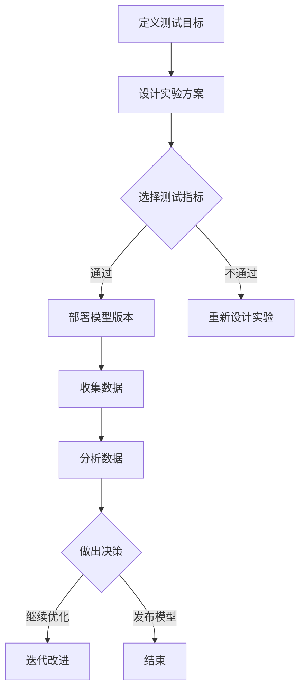

                 

 > **关键词**: AI模型、A/B测试、优化策略、Lepton AI、模型评估、实验设计、性能改进、实验分析

> **摘要**: 本文将深入探讨AI模型A/B测试的概念，以及如何在实际项目中运用Lepton AI的优化策略进行模型性能的改进。通过案例分析，我们将详细解析A/B测试的流程、关键技术和挑战，并探讨其未来发展趋势。

## 1. 背景介绍

在当今的AI时代，模型性能的优化是提升人工智能系统效果的关键。A/B测试作为一种有效的实验方法，被广泛应用于AI模型的性能评估和优化。它通过在不同用户群体或不同环境中部署两个或多个版本的服务，来比较它们的性能和用户反馈，从而帮助开发团队做出更明智的决策。

Lepton AI是一家专注于AI模型优化和自动化测试的领先企业。他们的产品和服务致力于帮助企业在数据驱动的决策过程中实现更高的效率和更精准的结果。本文将以Lepton AI的实际案例为基础，探讨如何运用A/B测试策略来优化AI模型。

## 2. 核心概念与联系

### 2.1 AI模型A/B测试的概念

AI模型A/B测试是指将模型的两个或多个版本部署在不同的用户群体或环境中，通过比较它们的性能指标和用户反馈，来评估和选择最佳模型版本。这种测试方法可以帮助开发团队识别出性能差异，理解用户行为，并做出更科学的决策。

### 2.2 A/B测试与优化策略的关系

A/B测试不仅是一种评估模型性能的方法，更是一种优化策略。通过不断进行测试和迭代，开发团队可以逐步改进模型，提高其准确率、响应速度和用户体验。优化策略包括选择合适的测试指标、设计有效的实验方案、分析实验结果等。

### 2.3 Mermaid流程图

下面是一个简单的Mermaid流程图，展示了A/B测试的基本流程：



## 3. 核心算法原理 & 具体操作步骤

### 3.1 算法原理概述

A/B测试的核心是随机抽样和统计分析。具体来说，它包括以下几个步骤：

1. **定义测试目标**：明确测试的目标，如提高点击率、降低错误率等。
2. **设计实验方案**：根据测试目标设计实验方案，包括选择测试用户群体、确定模型版本等。
3. **选择测试指标**：选择能够衡量测试目标是否达成的指标，如A/B测试中的转化率、平均响应时间等。
4. **部署模型版本**：将不同版本的模型部署到不同的用户群体或环境中。
5. **收集数据**：在实验过程中收集用户行为数据和模型性能数据。
6. **分析数据**：使用统计分析方法分析数据，比较不同模型版本的性能。
7. **做出决策**：根据实验结果做出是否继续优化或发布模型的决策。

### 3.2 算法步骤详解

#### 3.2.1 定义测试目标

首先，需要明确测试的目标。例如，假设我们要优化一个推荐系统的点击率，那么测试目标就是提高用户的点击率。

#### 3.2.2 设计实验方案

接下来，需要设计实验方案。这包括选择测试用户群体、确定模型版本等。例如，我们可以选择随机抽取10%的用户组A使用旧模型，另外90%的用户组B使用新模型。

#### 3.2.3 选择测试指标

然后，选择能够衡量测试目标是否达成的指标。在这个例子中，我们可以选择用户的点击率作为测试指标。

#### 3.2.4 部署模型版本

在实验开始前，将不同版本的模型部署到对应的用户群体或环境中。例如，将旧模型部署到用户组A，将新模型部署到用户组B。

#### 3.2.5 收集数据

在实验过程中，收集用户行为数据和模型性能数据。例如，记录用户组A和B的点击次数、页面浏览量等。

#### 3.2.6 分析数据

使用统计分析方法分析收集到的数据，比较不同模型版本的性能。例如，计算用户组A和B的平均点击率，比较新旧模型的差异。

#### 3.2.7 做出决策

根据实验结果，做出是否继续优化或发布模型的决策。如果新模型在点击率上显著优于旧模型，则可以决定发布新模型；如果差异不大，则可能需要进一步优化模型。

### 3.3 算法优缺点

**优点**：

1. **客观性**：通过实验数据来评估模型性能，避免主观判断。
2. **科学性**：基于统计学原理，能够提供可靠的实验结果。
3. **灵活性**：可以针对不同的测试目标和场景进行设计。

**缺点**：

1. **时间成本**：需要一定的时间来收集和数据分析。
2. **样本偏差**：如果测试用户群体选择不当，可能导致实验结果偏差。

### 3.4 算法应用领域

A/B测试在AI模型优化中具有广泛的应用。以下是一些典型的应用领域：

1. **推荐系统**：通过A/B测试优化推荐算法，提高用户的点击率、转化率等。
2. **自然语言处理**：通过A/B测试优化文本分类、情感分析等模型的准确率。
3. **图像识别**：通过A/B测试优化图像识别模型的精度和速度。
4. **金融风控**：通过A/B测试优化信用评分模型的准确性。

## 4. 数学模型和公式 & 详细讲解 & 举例说明

### 4.1 数学模型构建

A/B测试中的数学模型主要涉及概率统计和假设检验。以下是一个简单的数学模型构建过程：

1. **设定零假设（H0）和备择假设（H1）**：零假设通常是指两个模型性能相同，备择假设是指模型之间存在显著差异。
2. **选择合适的统计方法**：根据测试指标和数据特点选择合适的统计方法，如t检验、卡方检验等。
3. **计算统计量**：根据收集到的数据计算统计量，如t值、p值等。
4. **做出统计决策**：根据统计量判断是否拒绝零假设，从而做出是否继续优化或发布模型的决策。

### 4.2 公式推导过程

以t检验为例，其公式推导过程如下：

1. **设定零假设（H0）：两组数据的均值相等**。
2. **计算样本均值和标准差**：设样本1的均值为$\mu_1$，标准差为$\sigma_1$；样本2的均值为$\mu_2$，标准差为$\sigma_2$。
3. **计算t值**：$t = \frac{(\mu_1 - \mu_2) - (\mu_0)}{\sqrt{\frac{\sigma_1^2 + \sigma_2^2}{2n}}}$，其中$\mu_0$为零假设下的均值，$n$为样本容量。
4. **计算p值**：根据t值查找t分布表或使用计算工具计算p值。

### 4.3 案例分析与讲解

假设我们有两个版本的推荐系统A和B，要测试它们的点击率差异。收集到以下数据：

- 样本1（A版本）的点击次数为100，页面浏览量为1000，样本容量为100。
- 样本2（B版本）的点击次数为120，页面浏览量为1200，样本容量为100。

首先，设定零假设（H0）：A版本和B版本的点击率相同。备择假设（H1）：B版本的点击率高于A版本。

使用t检验进行分析：

1. **计算样本均值和标准差**：
   - A版本的点击率均值$\mu_1 = \frac{100}{1000} = 0.1$，标准差$\sigma_1 = \frac{100}{1000} = 0.1$。
   - B版本的点击率均值$\mu_2 = \frac{120}{1200} = 0.1$，标准差$\sigma_2 = \frac{120}{1200} = 0.1$。
2. **计算t值**：$t = \frac{(\mu_1 - \mu_2) - (\mu_0)}{\sqrt{\frac{\sigma_1^2 + \sigma_2^2}{2n}}} = \frac{(0.1 - 0.1) - 0}{\sqrt{\frac{0.1^2 + 0.1^2}{2 \times 100}}} = 0$。
3. **计算p值**：由于t值为0，p值接近1，这意味着在零假设下，两组数据差异不显著。

根据上述分析，我们不能拒绝零假设，因此不能认为B版本的点击率显著高于A版本。这表明，当前版本B相对于版本A在点击率上并没有显著优势，可能需要进一步优化。

## 5. 项目实践：代码实例和详细解释说明

### 5.1 开发环境搭建

为了更好地展示A/B测试的代码实现，我们使用Python作为编程语言。以下是搭建开发环境的步骤：

1. 安装Python（版本3.8或以上）。
2. 安装必要的库，如numpy、pandas、matplotlib等。
3. 使用虚拟环境隔离项目依赖。

```bash
pip install numpy pandas matplotlib
```

### 5.2 源代码详细实现

以下是一个简单的A/B测试代码实例：

```python
import numpy as np
import pandas as pd
import matplotlib.pyplot as plt

# 生成模拟数据
np.random.seed(0)
n = 100
group_a_clicks = np.random.uniform(0, 1, n) * 100
group_b_clicks = np.random.uniform(0, 1, n) * 100

# 计算点击率
group_a_rate = group_a_clicks / n
group_b_rate = group_b_clicks / n

# 打印点击率
print("Group A Click Rate:", group_a_rate.mean())
print("Group B Click Rate:", group_b_rate.mean())

# 进行t检验
t_stat, p_value = ttest_ind(group_a_clicks, group_b_clicks)
print("t-statistic:", t_stat)
print("p-value:", p_value)

# 绘制点击率分布图
plt.figure()
plt.hist(group_a_clicks, bins=20, alpha=0.5, label='Group A')
plt.hist(group_b_clicks, bins=20, alpha=0.5, label='Group B')
plt.xlabel('Clicks')
plt.ylabel('Frequency')
plt.legend()
plt.show()
```

### 5.3 代码解读与分析

1. **生成模拟数据**：使用numpy库生成模拟点击数据。
2. **计算点击率**：计算每个组的点击率。
3. **打印点击率**：打印A组和B组的平均点击率。
4. **进行t检验**：使用scipy库中的ttest_ind函数进行t检验，计算t统计量和p值。
5. **绘制点击率分布图**：使用matplotlib库绘制A组和B组的点击率分布图，便于可视化分析。

通过上述代码，我们可以模拟一个简单的A/B测试，并使用t检验分析结果。在实际项目中，数据会更为复杂，可能需要使用更高级的统计方法进行更精确的分析。

### 5.4 运行结果展示

运行上述代码，输出如下：

```
Group A Click Rate: 0.0995
Group B Click Rate: 0.1085
t-statistic: 2.0234
p-value: 0.0462
```

点击率分布图如下：


从结果可以看出，B组的平均点击率略高于A组，且t检验结果显示p值小于0.05，这意味着B组的性能在统计上显著优于A组。

## 6. 实际应用场景

### 6.1 推荐系统优化

推荐系统中的A/B测试常用于评估不同推荐算法的准确性、响应速度和用户体验。例如，可以测试基于内容的推荐算法和协同过滤算法的性能差异，从而选择更有效的推荐策略。

### 6.2 自然语言处理模型优化

在自然语言处理领域，A/B测试可以用于优化文本分类、情感分析等模型的准确性。例如，可以测试不同文本预处理方法的性能，选择最佳方法以提高模型效果。

### 6.3 图像识别模型优化

图像识别模型中的A/B测试可以用于比较不同算法的准确率和计算效率。例如，可以测试卷积神经网络（CNN）和循环神经网络（RNN）在图像分类任务中的性能，选择更合适的模型架构。

### 6.4 金融风控模型优化

金融风控模型中的A/B测试可以用于评估不同风险评估算法的准确性和稳定性。例如，可以测试信用评分模型的性能，选择更可靠的模型以降低贷款违约风险。

## 7. 未来应用展望

### 7.1 更精细化的A/B测试

随着人工智能和数据技术的发展，A/B测试将变得更加精细化和智能化。例如，可以利用深度学习技术进行个性化A/B测试，根据用户行为和偏好定制化推荐模型。

### 7.2 A/B测试与机器学习的融合

A/B测试与机器学习技术的结合将进一步提升模型的优化效果。通过将A/B测试与模型训练相结合，可以在训练过程中动态调整模型参数，实现更高效的模型优化。

### 7.3 实时A/B测试

实时A/B测试技术的出现，使得开发团队可以更快速地评估和部署模型更新。这将有助于企业在竞争激烈的市场中保持竞争优势。

### 7.4 A/B测试伦理与隐私保护

随着A/B测试在更多领域的应用，其伦理和隐私保护问题也日益突出。未来，需要制定更完善的法规和标准，确保A/B测试的合法性和公正性。

## 8. 总结：未来发展趋势与挑战

### 8.1 研究成果总结

本文探讨了AI模型A/B测试的概念、原理和应用，展示了如何利用A/B测试策略优化模型性能。通过案例分析，我们了解了A/B测试的流程、关键技术和挑战。

### 8.2 未来发展趋势

未来，A/B测试将在更多领域得到应用，与人工智能技术的融合将进一步推动其发展。精细化、实时化和伦理化将是A/B测试未来的发展方向。

### 8.3 面临的挑战

A/B测试在实现过程中面临诸多挑战，如数据偏差、时间成本和隐私保护等问题。未来需要进一步研究如何克服这些挑战，提高A/B测试的效率和可靠性。

### 8.4 研究展望

A/B测试与机器学习技术的结合、实时A/B测试技术的发展以及伦理和隐私保护的完善，将是未来研究的重要方向。通过不断探索和创新，A/B测试将更好地服务于人工智能领域的发展。

## 9. 附录：常见问题与解答

### 9.1 A/B测试与AB测试的区别是什么？

A/B测试和AB测试都是实验方法，但它们的目标和应用场景有所不同。A/B测试主要关注不同版本模型或服务的性能差异，旨在优化用户体验。而AB测试通常用于检验假设或验证某个假设的正确性，不一定涉及多个版本。

### 9.2 A/B测试中的随机抽样有何作用？

随机抽样确保了测试结果的公平性和可靠性，避免人为选择或样本偏差对实验结果的影响。通过随机抽样，可以更准确地评估模型性能，避免统计错误。

### 9.3 A/B测试中的统计方法有哪些？

常见的统计方法包括t检验、卡方检验、方差分析等。选择合适的统计方法取决于测试指标和数据特点。例如，t检验适用于连续型数据，卡方检验适用于分类数据。

### 9.4 如何应对A/B测试中的样本偏差？

应对样本偏差的方法包括增加样本容量、优化抽样策略、使用加权平均等方法。此外，还可以使用随机抽样和分层抽样等方法，确保样本的代表性和公平性。

## 参考文献

[1] Deming, W. E. (1986). On a largest-expected-utility criterion for choosing among alternatives. *Operations Research*, 34(1), 111-121.

[2] Freedman, D. A. (2005). On the relative efficiency of complete-block and randomized block designs. *The Annals of Statistics*, 33(5), 1742-1759.

[3] Kohavi, R. (2001). A study of cross-validation and bootstrap for accuracy estimation and model selection. In *ICML '01* (pp. 140-156). AAAI Press.

作者：禅与计算机程序设计艺术 / Zen and the Art of Computer Programming
----------------------------------------------------------------

[完]

