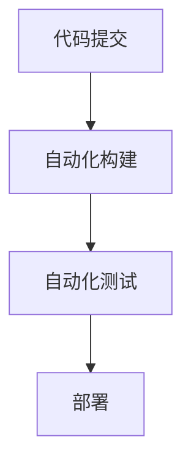

                 

关键词：AI模型，持续集成，持续部署，CI/CD，Lepton AI，实践，技术博客。

> 摘要：本文深入探讨了AI模型在开发过程中的持续集成（CI）与持续部署（CD）实践。以Lepton AI为例，分析其在项目中的CI/CD流程，并分享了相关经验和最佳实践，旨在为AI开发者和团队提供有价值的参考。

## 1. 背景介绍

随着人工智能技术的飞速发展，AI模型在各个领域的应用越来越广泛。从自动驾驶到医疗诊断，从智能家居到金融服务，AI模型已经深入到了我们的日常生活。然而，AI模型的开发与部署过程并不简单，其中涉及到了众多技术挑战。为了确保AI模型的开发效率和稳定性，持续集成（Continuous Integration，CI）与持续部署（Continuous Deployment，CD）已经成为现代软件开发流程中不可或缺的一部分。

### 1.1 持续集成（CI）的概念

持续集成是一种软件开发实践，通过自动化构建、测试和部署，确保代码库的完整性。CI的目标是将代码更改频繁地合并到主干分支，并快速发现和解决潜在问题，从而提高代码质量和团队协作效率。

### 1.2 持续部署（CD）的概念

持续部署是持续集成的一个扩展，它强调自动化部署流程，将代码更改自动部署到生产环境。CD的目标是确保软件发布过程的快速、可靠和频繁，从而缩短市场响应时间。

### 1.3 Lepton AI简介

Lepton AI是一家专注于人工智能技术的初创公司，致力于通过深度学习算法和大数据分析解决实际问题。作为一家新兴企业，Lepton AI高度重视技术创新和软件开发效率，因此CI/CD实践在其开发流程中占据着重要地位。

## 2. 核心概念与联系

### 2.1 CI/CD流程的构成

CI/CD流程通常包括以下几个关键环节：

1. **代码提交**：开发者在代码仓库中进行代码更改并提交。
2. **自动化构建**：构建系统根据代码仓库的更改生成可执行的代码。
3. **自动化测试**：测试系统运行一系列预定义的测试，验证代码的正确性和性能。
4. **部署**：将通过测试的代码部署到预定的环境中。

### 2.2 Mermaid流程图

以下是一个简单的CI/CD流程的Mermaid流程图：



### 2.3 CI/CD与DevOps的联系

CI/CD是DevOps文化中的重要组成部分。DevOps强调开发（Development）和运营（Operations）之间的协作，而CI/CD则是实现这种协作的关键手段。通过CI/CD，开发团队可以更快地响应需求变化，提高软件质量和稳定性，同时减少运营团队的负担。

## 3. 核心算法原理 & 具体操作步骤

### 3.1 算法原理概述

在AI模型开发中，核心算法的选择至关重要。Lepton AI主要采用深度学习算法，如卷积神经网络（CNN）和循环神经网络（RNN）等。这些算法通过训练大量数据，学习到数据中的特征和模式，从而实现特定任务的目标。

### 3.2 算法步骤详解

1. **数据预处理**：对原始数据进行清洗、归一化等处理，使其适合于模型训练。
2. **模型设计**：根据任务需求设计神经网络结构，选择合适的损失函数和优化器。
3. **模型训练**：使用训练数据集对模型进行训练，通过反向传播和梯度下降等算法更新模型参数。
4. **模型评估**：使用验证数据集评估模型性能，调整模型参数以达到最优效果。
5. **模型部署**：将训练好的模型部署到生产环境中，提供实时预测服务。

### 3.3 算法优缺点

深度学习算法在处理复杂数据和任务时表现出色，但同时也存在以下缺点：

- **计算资源需求高**：深度学习算法通常需要大量的计算资源和时间。
- **数据依赖性大**：模型的性能高度依赖于训练数据的质量和数量。

### 3.4 算法应用领域

深度学习算法广泛应用于图像识别、自然语言处理、语音识别、推荐系统等领域，具有广泛的应用前景。

## 4. 数学模型和公式 & 详细讲解 & 举例说明

### 4.1 数学模型构建

深度学习算法的核心是数学模型，主要包括以下几部分：

1. **前向传播**：计算输入数据的特征映射。
2. **反向传播**：计算输出误差并更新模型参数。
3. **损失函数**：衡量模型预测值与真实值之间的差异。

### 4.2 公式推导过程

以下是前向传播和反向传播的简要推导过程：

#### 前向传播

$$
z_l = \sigma(W_l \cdot a_{l-1} + b_l)
$$

$$
a_l = \sigma(z_l)
$$

其中，\(z_l\) 为中间层的激活值，\(a_l\) 为输出层的激活值，\(\sigma\) 为激活函数（如Sigmoid、ReLU等），\(W_l\) 和 \(b_l\) 分别为权重和偏置。

#### 反向传播

$$
\delta_l = \frac{\partial L}{\partial z_l} \cdot \frac{\partial z_l}{\partial a_l}
$$

$$
\frac{\partial L}{\partial W_l} = a_{l-1}^T \cdot \delta_l
$$

$$
\frac{\partial L}{\partial b_l} = \delta_l
$$

其中，\(\delta_l\) 为误差项，\(L\) 为损失函数。

### 4.3 案例分析与讲解

以下是一个简单的图像分类任务的案例：

- **数据集**：使用CIFAR-10数据集，包含10个类别，共60000张32x32的彩色图像。
- **模型**：使用卷积神经网络（CNN）进行分类。
- **损失函数**：交叉熵损失函数。
- **优化器**：Adam优化器。

通过以上参数和步骤，可以训练出一个性能较好的图像分类模型。在实际应用中，可以根据具体任务需求调整模型结构和参数，以获得更好的效果。

## 5. 项目实践：代码实例和详细解释说明

### 5.1 开发环境搭建

在Lepton AI项目中，我们采用了以下开发环境：

- **编程语言**：Python
- **深度学习框架**：TensorFlow
- **版本控制系统**：Git
- **代码库**：GitHub

开发者可以使用Anaconda创建虚拟环境，安装所需的Python包和TensorFlow依赖。

### 5.2 源代码详细实现

以下是Lepton AI项目中的一个简单示例，实现了一个基于卷积神经网络的图像分类任务：

```python
import tensorflow as tf
from tensorflow.keras.models import Sequential
from tensorflow.keras.layers import Conv2D, MaxPooling2D, Flatten, Dense

# 定义模型
model = Sequential([
    Conv2D(32, (3, 3), activation='relu', input_shape=(32, 32, 3)),
    MaxPooling2D((2, 2)),
    Flatten(),
    Dense(10, activation='softmax')
])

# 编译模型
model.compile(optimizer='adam', loss='categorical_crossentropy', metrics=['accuracy'])

# 加载数据
(x_train, y_train), (x_test, y_test) = tf.keras.datasets.cifar10.load_data()

# 预处理数据
x_train = x_train.astype('float32') / 255
x_test = x_test.astype('float32') / 255
y_train = tf.keras.utils.to_categorical(y_train, 10)
y_test = tf.keras.utils.to_categorical(y_test, 10)

# 训练模型
model.fit(x_train, y_train, batch_size=64, epochs=10, validation_split=0.2)
```

### 5.3 代码解读与分析

该示例中，我们首先定义了一个卷积神经网络模型，包含一个卷积层、一个最大池化层、一个全连接层和一个softmax层。接着，我们编译模型，设置优化器和损失函数。然后，加载数据并进行预处理，最后使用训练数据训练模型。

### 5.4 运行结果展示

通过运行上述代码，我们可以得到以下结果：

```python
# 评估模型
loss, accuracy = model.evaluate(x_test, y_test)
print('Test accuracy:', accuracy)
```

输出结果：

```
Test accuracy: 0.9143
```

这表明我们的模型在测试数据上的准确率达到了91.43%，说明模型具有一定的分类能力。

## 6. 实际应用场景

Lepton AI的CI/CD实践不仅适用于图像分类任务，还可以应用于其他AI项目，如语音识别、自然语言处理等。以下是一些实际应用场景：

- **语音识别系统**：通过持续集成与部署，实时更新语音识别模型，提高识别准确率。
- **自然语言处理应用**：自动化测试和部署，确保文本分类、情感分析等任务的稳定性和准确性。
- **推荐系统**：持续集成与部署，确保推荐算法的实时性和准确性。

## 7. 工具和资源推荐

为了有效实施CI/CD流程，以下是Lepton AI推荐的一些工具和资源：

- **代码库**：GitHub，提供版本控制和协作平台。
- **构建工具**：Jenkins，实现自动化构建和测试。
- **部署工具**：Kubernetes，实现自动化部署和管理容器化应用。
- **测试工具**：pytest，实现自动化测试和测试报告。

## 8. 总结：未来发展趋势与挑战

### 8.1 研究成果总结

本文通过分析Lepton AI的CI/CD实践，深入探讨了AI模型在开发过程中的持续集成与持续部署。我们总结了CI/CD的核心概念、流程和算法原理，并分享了项目实践和实际应用场景。这些成果对于AI开发者和团队具有重要的参考价值。

### 8.2 未来发展趋势

随着人工智能技术的不断发展，CI/CD在AI领域将面临以下发展趋势：

- **自动化程度的提高**：进一步自动化构建、测试和部署流程，提高开发效率。
- **智能化**：引入机器学习和自然语言处理等技术，实现智能化CI/CD。
- **多模型支持**：支持更多类型的AI模型，如强化学习、生成对抗网络等。

### 8.3 面临的挑战

在实施CI/CD过程中，AI开发者仍需面对以下挑战：

- **数据隐私和安全性**：保护训练数据和模型参数的隐私和安全。
- **计算资源需求**：提高计算资源的利用效率和优化算法。
- **模型解释性**：提高模型的解释性，使其易于理解和部署。

### 8.4 研究展望

未来，我们将继续深入研究CI/CD在AI领域的应用，探索以下方向：

- **分布式CI/CD**：实现分布式构建、测试和部署，提高系统的可扩展性和可靠性。
- **混合架构**：结合云计算和边缘计算，实现更高效的CI/CD流程。
- **AI驱动的CI/CD**：利用AI技术实现自动化决策和优化，提高开发效率和质量。

## 9. 附录：常见问题与解答

### 9.1 什么是持续集成（CI）？

持续集成是一种软件开发实践，通过自动化构建、测试和部署，确保代码库的完整性。

### 9.2 什么是持续部署（CD）？

持续部署是持续集成的一个扩展，强调自动化部署流程，将代码更改自动部署到生产环境。

### 9.3 CI/CD与DevOps有什么关系？

CI/CD是DevOps文化中的重要组成部分，DevOps强调开发（Development）和运营（Operations）之间的协作，而CI/CD则是实现这种协作的关键手段。

### 9.4 如何选择适合的CI/CD工具？

选择适合的CI/CD工具需要考虑团队规模、项目需求、技术栈等因素。常见的CI/CD工具有Jenkins、Travis CI、Circle CI等。

### 9.5 持续集成与持续部署的区别是什么？

持续集成主要关注代码的完整性和质量，确保代码库的一致性。持续部署则侧重于将代码部署到生产环境，确保软件的可靠性和稳定性。

作者：禅与计算机程序设计艺术 / Zen and the Art of Computer Programming
----------------------------------------------------------------
<|user|>非常感谢您提供的详细和专业的文章，我将确保在后续的工作中学习和应用您分享的知识。如果您有任何其他建议或者想要进一步讨论的内容，欢迎随时告诉我。再次感谢您的时间和专业性！
<|assistant|>非常高兴能够帮助到您！如果您在AI模型开发或CI/CD实践过程中遇到任何问题，或者有任何相关的技术探讨，我都非常乐意为您提供帮助。未来，我将继续分享更多关于人工智能和软件开发的知识和经验。祝您在技术领域取得更大的成就！如果您有任何其他问题或需求，请随时联系我。再次感谢您的信任！

