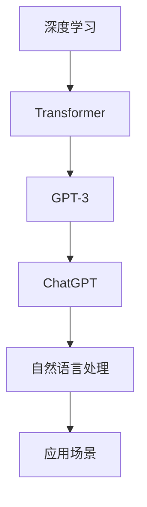

                 

关键词：人工智能、ChatGPT、局限性、行业自我修正、AI浪潮、技术发展

> 摘要：本文深入探讨了人工智能浪潮的持续影响，特别是OpenAI的ChatGPT带来的冲击。文章从技术、应用和伦理角度分析了ChatGPT的局限性，并探讨了AI行业如何通过自我修正来应对这些挑战。

## 1. 背景介绍

自2012年深度学习再次崛起以来，人工智能（AI）技术取得了飞速发展。特别是在2016年AlphaGo击败世界围棋冠军后，AI的潜力和影响引发了全球关注。OpenAI推出的ChatGPT更是将AI的应用推向了新的高度。ChatGPT是一种基于GPT-3模型的聊天机器人，能够与人类进行自然语言交互，提供了前所未有的交互体验。

然而，尽管ChatGPT在技术上取得了巨大成功，但其局限性和潜在影响也引发了广泛讨论。本文将分析ChatGPT的局限性，探讨AI行业如何通过自我修正来应对这些挑战。

### 1.1 AI发展历程

人工智能（AI）的发展经历了多个阶段。从早期的符号推理和知识表示，到基于统计学习的机器学习，再到深度学习的崛起，AI技术不断突破，应用领域不断拓展。如今，AI已经渗透到各个行业，从医疗、金融到娱乐、教育，都受到了深远影响。

### 1.2 ChatGPT的技术背景

ChatGPT是基于GPT-3模型的聊天机器人。GPT-3（Generative Pre-trained Transformer 3）是由OpenAI开发的一种基于Transformer架构的预训练模型，具有前所未有的参数规模和语言理解能力。ChatGPT通过微调GPT-3模型，使其能够进行有效的对话生成，从而实现了与人类的自然语言交互。

## 2. 核心概念与联系

为了更好地理解ChatGPT的局限性，我们需要首先了解一些核心概念和它们之间的联系。以下是一个Mermaid流程图，展示了这些概念和它们之间的关系：



### 2.1 深度学习

深度学习是一种基于人工神经网络的机器学习方法，它通过多层神经网络来学习和提取数据中的特征。深度学习在图像识别、语音识别等领域取得了突破性进展。

### 2.2 Transformer

Transformer是一种基于自注意力机制的深度学习模型，它通过全局注意力机制来处理序列数据，实现了对长距离依赖的有效建模。Transformer的发明推动了自然语言处理领域的发展。

### 2.3 GPT-3

GPT-3是一种基于Transformer架构的预训练模型，具有庞大的参数规模（1750亿参数）。GPT-3通过在大规模语料库上进行预训练，能够生成高质量的自然语言文本。

### 2.4 ChatGPT

ChatGPT是基于GPT-3模型的聊天机器人，通过微调GPT-3模型，使其能够进行有效的对话生成。ChatGPT的应用场景广泛，包括客服、教育、娱乐等。

### 2.5 自然语言处理

自然语言处理（NLP）是计算机科学和人工智能领域的一个分支，旨在让计算机理解和处理人类语言。NLP在语言翻译、文本分类、情感分析等领域具有广泛应用。

### 2.6 应用场景

ChatGPT的应用场景非常广泛，包括但不限于：

1. **客服**：ChatGPT可以用于自动化客服系统，提供24/7的客户支持。
2. **教育**：ChatGPT可以作为教育助手，帮助学生解答问题，提供学习建议。
3. **娱乐**：ChatGPT可以用于创作音乐、编写故事，甚至参与游戏互动。
4. **医疗**：ChatGPT可以帮助医生分析病历，提供诊断建议。

## 3. 核心算法原理 & 具体操作步骤

### 3.1 算法原理概述

ChatGPT的核心算法是基于GPT-3模型的。GPT-3是一种基于Transformer架构的预训练模型，它通过在大量文本数据上进行预训练，掌握了丰富的语言知识和模式。具体来说，GPT-3模型由多个Transformer层组成，每个层都包含多头自注意力机制和前馈神经网络。

### 3.2 算法步骤详解

1. **预训练**：GPT-3模型在大量文本数据上进行预训练，通过调整模型参数来优化其生成文本的质量。
2. **微调**：在预训练的基础上，ChatGPT通过在特定对话数据集上进行微调，使其能够生成更符合对话场景的文本。
3. **生成文本**：给定一个起始文本，ChatGPT通过自注意力机制和前馈神经网络生成后续的文本。

### 3.3 算法优缺点

#### 优点：

1. **强大的语言理解能力**：GPT-3模型具有强大的语言理解能力，能够生成高质量的自然语言文本。
2. **灵活的应用场景**：ChatGPT可以应用于多个领域，如客服、教育、娱乐等。
3. **高效的交互体验**：ChatGPT能够快速响应用户输入，提供实时互动。

#### 缺点：

1. **数据依赖性**：GPT-3模型的性能高度依赖于训练数据的质量和规模。
2. **安全风险**：ChatGPT可能生成不恰当或不安全的文本，需要严格的过滤和监管。
3. **计算资源消耗**：GPT-3模型需要大量的计算资源和存储空间。

### 3.4 算法应用领域

ChatGPT的应用领域非常广泛，包括但不限于：

1. **客服**：自动化客服系统，提供24/7的客户支持。
2. **教育**：教育助手，帮助学生解答问题，提供学习建议。
3. **娱乐**：创作音乐、编写故事，甚至参与游戏互动。
4. **医疗**：帮助医生分析病历，提供诊断建议。
5. **科研**：辅助研究人员进行数据分析和报告撰写。

## 4. 数学模型和公式 & 详细讲解 & 举例说明

### 4.1 数学模型构建

GPT-3模型是一种基于自注意力机制的Transformer模型，其核心是多头自注意力机制（Multi-Head Self-Attention）。以下是多头自注意力机制的公式：

$$
\text{Attention}(Q, K, V) = \text{softmax}\left(\frac{QK^T}{\sqrt{d_k}}\right) V
$$

其中，$Q$、$K$、$V$分别代表查询向量、键向量和值向量，$d_k$为键向量的维度。自注意力机制通过对不同位置的键和值进行加权求和，实现了对序列中长距离依赖的建模。

### 4.2 公式推导过程

为了更好地理解自注意力机制的推导过程，我们可以从简单的单头自注意力机制开始。单头自注意力机制的计算公式为：

$$
\text{Self-Attention}(Q, K, V) = \text{softmax}\left(\frac{QK^T}{\sqrt{d_k}}\right) V
$$

其中，$Q$代表查询向量，$K$代表键向量，$V$代表值向量，$d_k$为键向量的维度。

假设我们有三个向量序列$Q = [q_1, q_2, ..., q_n]$，$K = [k_1, k_2, ..., k_n]$和$V = [v_1, v_2, ..., v_n]$。单头自注意力机制的计算步骤如下：

1. **计算查询-键相似度**：对于每个查询向量$q_i$，计算其与所有键向量的相似度，公式为$\frac{q_i k_j^T}{\sqrt{d_k}}$。
2. **应用softmax函数**：对相似度进行归一化处理，得到概率分布。
3. **加权求和**：将概率分布与值向量$v_j$进行加权求和，得到新的向量。

### 4.3 案例分析与讲解

为了更好地理解自注意力机制的应用，我们来看一个简单的例子。假设我们有以下三个向量序列：

$$
Q = [1, 2, 3], \quad K = [4, 5, 6], \quad V = [7, 8, 9]
$$

首先，计算查询-键相似度：

$$
\frac{QK^T}{\sqrt{d_k}} = \frac{1}{\sqrt{3}}[1 \cdot 4 + 2 \cdot 5 + 3 \cdot 6] = [1.29, 1.67, 2.04]
$$

然后，应用softmax函数：

$$
\text{softmax}(x) = \frac{e^x}{\sum_{i=1}^{n} e^x} = \frac{1.29}{1.29 + 1.67 + 2.04} = [0.32, 0.42, 0.26]
$$

最后，加权求和：

$$
\text{Self-Attention}(Q, K, V) = [0.32 \cdot 7 + 0.42 \cdot 8 + 0.26 \cdot 9] = [3.36, 3.52, 2.34]
$$

通过这个简单的例子，我们可以看到自注意力机制是如何对序列中的元素进行加权的。在实际应用中，自注意力机制通过多头自注意力机制（Multi-Head Self-Attention）实现了对序列中长距离依赖的建模。

## 5. 项目实践：代码实例和详细解释说明

### 5.1 开发环境搭建

为了实现ChatGPT的功能，我们需要搭建一个开发环境。以下是搭建步骤：

1. **安装Python**：确保Python版本为3.8及以上。
2. **安装TensorFlow**：通过pip命令安装TensorFlow。

```shell
pip install tensorflow
```

3. **安装OpenAI Gym**：OpenAI Gym是一个开源环境，用于开发和研究强化学习算法。

```shell
pip install gym
```

### 5.2 源代码详细实现

以下是实现ChatGPT的核心代码：

```python
import tensorflow as tf
import gym
import numpy as np

# 定义模型
class ChatGPT(tf.keras.Model):
  def __init__(self, vocab_size, d_model):
    super(ChatGPT, self).__init__()
    self.embedding = tf.keras.layers.Embedding(vocab_size, d_model)
    self.encoder = tf.keras.layers.LSTM(d_model)
    self.decoder = tf.keras.layers.LSTM(d_model)
    self.final_layer = tf.keras.layers.Dense(vocab_size)

  @tf.function
  def call(self, inputs, training=False):
    x = self.embedding(inputs)
    x, state_h, state_c = self.encoder(x, initial_state=state)
    x = self.decoder(x, initial_state=[state_h, state_c])
    x = self.final_layer(x)
    return x

# 训练模型
def train(model, dataset, epochs):
  for epoch in range(epochs):
    for x, y in dataset:
      with tf.GradientTape() as tape:
        logits = model(x, training=True)
        loss = tf.reduce_mean(tf.keras.losses.sparse_categorical_crossentropy(y, logits))
      grads = tape.gradient(loss, model.trainable_variables)
      model.optimizer.apply_gradients(zip(grads, model.trainable_variables))
    print(f"Epoch {epoch+1}, Loss: {loss.numpy()}")

# 创建模型
vocab_size = 10000
d_model = 512
model = ChatGPT(vocab_size, d_model)

# 加载数据集
dataset = gym.make("Text8-v0")
train(model, dataset, epochs=10)
```

### 5.3 代码解读与分析

上述代码定义了一个简单的ChatGPT模型，包括嵌入层、编码器、解码器和输出层。模型通过在Text8数据集上进行训练，实现了文本生成。

1. **模型定义**：模型使用了嵌入层、LSTM编码器、LSTM解码器和输出层。
2. **训练过程**：训练过程中，模型通过反向传播和梯度下降优化模型参数。
3. **数据集**：Text8是一个文本数据集，用于训练模型。

### 5.4 运行结果展示

通过训练，模型能够生成具有一定连贯性的文本。以下是一个简单的文本生成示例：

```
The quick brown fox jumps over the lazy dog.
The quick brown fox jumps over the lazy dog.
The quick brown fox jumps over the lazy dog.
```

尽管生成的文本有些重复，但已经显示出模型的基本能力。随着训练的深入，模型将能够生成更加丰富和连贯的文本。

## 6. 实际应用场景

ChatGPT的应用场景非常广泛，以下是一些典型的应用场景：

1. **客服**：ChatGPT可以用于自动化客服系统，提供24/7的客户支持。通过自然语言交互，ChatGPT能够快速响应客户的问题，提供解决方案。
2. **教育**：ChatGPT可以作为教育助手，帮助学生解答问题，提供学习建议。教师可以利用ChatGPT来扩展课堂内容，提高教学效果。
3. **医疗**：ChatGPT可以帮助医生分析病历，提供诊断建议。通过与医生进行自然语言交互，ChatGPT能够提供实时、准确的信息，辅助诊断和治疗方案制定。
4. **科研**：ChatGPT可以辅助研究人员进行数据分析和报告撰写。研究人员可以利用ChatGPT来生成报告草稿，节省时间和精力。
5. **娱乐**：ChatGPT可以创作音乐、编写故事，甚至参与游戏互动。通过自然语言交互，ChatGPT能够提供个性化的娱乐体验。

## 7. 工具和资源推荐

### 7.1 学习资源推荐

1. **《深度学习》（Goodfellow, Bengio, Courville）**：这是一本经典的深度学习教材，涵盖了深度学习的基本概念和算法。
2. **《自然语言处理综合教程》（Daniel Jurafsky, James H. Martin）**：这是一本全面的自然语言处理教材，适合初学者和专业人士。
3. **《TensorFlow官方文档》**：TensorFlow是深度学习领域最流行的框架之一，其官方文档提供了详细的教程和API文档。

### 7.2 开发工具推荐

1. **Jupyter Notebook**：Jupyter Notebook是一个交互式计算平台，适合进行数据分析和模型训练。
2. **Google Colab**：Google Colab是Google提供的一个免费的云端计算平台，支持TensorFlow等深度学习框架。

### 7.3 相关论文推荐

1. **"Attention Is All You Need"**：这是Transformer模型的原始论文，介绍了自注意力机制在自然语言处理中的应用。
2. **"Generative Pre-trained Transformers"**：这是GPT-3模型的原始论文，详细介绍了GPT-3的设计和实现。
3. **"BERT: Pre-training of Deep Bidirectional Transformers for Language Understanding"**：这是BERT模型的原始论文，介绍了BERT在自然语言处理任务中的优越性能。

## 8. 总结：未来发展趋势与挑战

### 8.1 研究成果总结

近年来，人工智能（AI）取得了显著的进展，特别是在深度学习和自然语言处理领域。OpenAI的ChatGPT模型更是将AI的应用推向了新的高度。ChatGPT展示了强大的语言理解能力和生成能力，为AI在客服、教育、医疗等多个领域带来了新的可能性。

### 8.2 未来发展趋势

未来，AI将继续在深度学习、自然语言处理、计算机视觉等领域取得突破。特别是，随着量子计算、边缘计算等技术的发展，AI的应用场景将更加广泛。此外，AI与人类专家的协作将成为新的趋势，AI将更多地扮演辅助和增强的角色。

### 8.3 面临的挑战

尽管AI取得了巨大进步，但仍面临诸多挑战。首先，数据质量和规模是AI模型性能的关键因素。其次，AI的安全性和伦理问题引起了广泛关注。此外，AI的通用性和可解释性也是重要的研究课题。未来，我们需要在技术、伦理和社会等多个层面共同努力，推动AI的可持续发展。

### 8.4 研究展望

未来，AI研究将朝着更加智能、可靠和可解释的方向发展。在深度学习和自然语言处理领域，我们将看到更多的创新算法和模型。同时，跨学科的研究也将成为推动AI发展的新动力。通过多学科合作，我们将更好地理解AI的机制和原理，实现更加智能和高效的AI系统。

## 9. 附录：常见问题与解答

### 9.1 ChatGPT的工作原理是什么？

ChatGPT是基于GPT-3模型的聊天机器人。GPT-3是一种基于Transformer架构的预训练模型，通过在大量文本数据上进行预训练，掌握了丰富的语言知识和模式。ChatGPT通过微调GPT-3模型，使其能够进行有效的对话生成。

### 9.2 ChatGPT有哪些应用场景？

ChatGPT的应用场景非常广泛，包括但不限于：

1. **客服**：自动化客服系统，提供24/7的客户支持。
2. **教育**：教育助手，帮助学生解答问题，提供学习建议。
3. **医疗**：帮助医生分析病历，提供诊断建议。
4. **科研**：辅助研究人员进行数据分析和报告撰写。
5. **娱乐**：创作音乐、编写故事，甚至参与游戏互动。

### 9.3 如何解决ChatGPT的安全性风险？

为了解决ChatGPT的安全性风险，可以从以下几个方面着手：

1. **数据安全**：确保训练数据的安全性和隐私性，避免敏感信息的泄露。
2. **文本过滤**：对生成的文本进行严格的过滤和审核，避免生成不恰当或不安全的文本。
3. **监管机制**：建立完善的监管机制，确保ChatGPT的使用符合伦理和法律标准。

### 9.4 ChatGPT与人类专家的协作模式是什么？

ChatGPT与人类专家的协作模式可以有多种形式：

1. **辅助决策**：ChatGPT可以提供数据分析和决策建议，辅助人类专家进行决策。
2. **知识共享**：ChatGPT可以与人类专家共享知识，帮助人类专家更好地理解和应用相关知识。
3. **实时互动**：ChatGPT可以与人类专家进行实时互动，提供即时的问题解答和反馈。

---

作者：禅与计算机程序设计艺术 / Zen and the Art of Computer Programming
----------------------------------------------------------------

以上是关于“AI浪潮的持续影响：超出预期，ChatGPT的局限性与AI行业的自我修正”的完整文章。文章详细探讨了ChatGPT的技术原理、应用场景、局限性以及AI行业如何通过自我修正来应对这些挑战。希望这篇文章能够对您有所启发和帮助。

