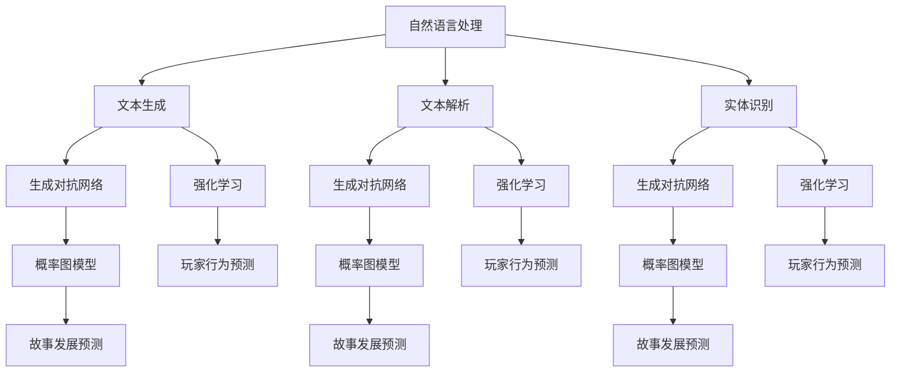

                 

### 1. 背景介绍

随着人工智能（AI）技术的迅猛发展，其在游戏开发领域的应用也越来越广泛。其中，AI生成的互动小说游戏成为了一个备受关注的新兴领域。这类游戏通过AI算法生成独特的故事情节、角色和互动元素，为玩家提供了前所未有的沉浸式体验。

互动小说游戏是一种结合了故事叙述和玩家决策的游戏类型。玩家在游戏中扮演特定角色，通过选择不同的选项来影响故事的发展和结局。传统的互动小说游戏通常由游戏开发者编写故事线和剧情，而AI生成的互动小说游戏则利用AI算法动态生成故事内容，使每个玩家的游戏体验都独一无二。

AI在游戏开发中的应用不仅限于生成故事。它可以用于创建智能NPC（非玩家角色），实现更加逼真的游戏世界和交互。AI还可以优化游戏引擎，提高游戏性能，甚至预测玩家的行为和偏好，为游戏提供个性化的推荐。

本文将深入探讨AI生成的互动小说游戏的原理、算法、数学模型以及实际应用场景。我们将从技术角度分析如何利用AI技术实现动态故事生成，并讨论这种技术在游戏开发中的潜在影响和挑战。

### 2. 核心概念与联系

要理解AI生成的互动小说游戏，首先需要了解几个核心概念：自然语言处理（NLP）、生成对抗网络（GAN）、强化学习和概率图模型。这些技术不仅构成了互动小说游戏的基础，还在不同层面上相互联系，共同推动这一领域的发展。

#### 自然语言处理（NLP）

自然语言处理是AI领域的一个重要分支，旨在使计算机能够理解和处理人类语言。在互动小说游戏中，NLP技术被用于生成和解析文本，从而实现与玩家的对话和故事生成。具体来说，NLP技术包括：

- **文本生成**：通过分析大量文本数据，AI模型可以生成连贯的、符合语法规则的故事情节和对话。
- **文本解析**：AI模型可以解析玩家的输入，理解其意图和需求，从而做出相应的反应。
- **实体识别**：AI能够识别文本中的特定实体，如人物、地点和物品，以便在故事中正确引用。

#### 生成对抗网络（GAN）

生成对抗网络（GAN）是由两部分组成的神经网络结构，一部分生成器（Generator）和一部分鉴别器（Discriminator）。生成器试图生成逼真的故事文本，而鉴别器则评估这些文本的真实性。通过不断的训练，生成器和鉴别器相互竞争，最终生成器能够生成足够逼真的故事内容。

GAN在互动小说游戏中的应用主要体现在故事生成和角色创建上。例如，生成器可以生成各种不同风格的故事情节，而鉴别器则评估这些故事情节的合理性。通过这种对抗训练，AI可以学会生成符合游戏逻辑和玩家期望的故事内容。

#### 强化学习

强化学习是一种通过试错来学习最优策略的机器学习方法。在互动小说游戏中，强化学习可以用于训练NPC的智能行为，使其能够根据玩家的决策和行为做出合适的反应。

强化学习的工作原理是，通过奖励机制来鼓励AI模型做出正确的决策。在互动小说游戏中，这些奖励可以是玩家对故事情节的满意度或者故事进展的合理性。通过不断的学习和调整，AI NPC可以变得越来越智能，提供更加丰富和有趣的互动体验。

#### 概率图模型

概率图模型是一种用于表示变量之间概率关系的图形化方法。在互动小说游戏中，概率图模型可以用于预测玩家行为和故事发展。例如，通过贝叶斯网络，AI可以分析玩家之前的决策和行为，预测其后续可能的选择，从而生成相关的故事情节。

#### Mermaid 流程图

以下是互动小说游戏中的核心概念和它们之间的联系，通过Mermaid流程图表示：



### 3. 核心算法原理 & 具体操作步骤

#### 3.1 算法原理概述

AI生成的互动小说游戏的核心在于如何通过算法动态生成故事。这通常涉及以下几个关键步骤：

1. **数据预处理**：收集和预处理大量文本数据，用于训练AI模型。
2. **模型训练**：利用生成对抗网络（GAN）、强化学习和概率图模型等算法训练AI模型。
3. **故事生成**：AI模型根据玩家的决策和行为生成相关的故事情节。
4. **故事优化**：通过鉴别器评估故事情节的合理性，进行优化和调整。

#### 3.2 算法步骤详解

1. **数据预处理**：
   - **文本采集**：从互联网、书籍、游戏脚本等来源收集大量文本数据。
   - **文本清洗**：去除无关数据、统一格式、去除标点符号等。
   - **词向量表示**：将文本转换为词向量表示，以便AI模型处理。

2. **模型训练**：
   - **生成对抗网络（GAN）**：
     - **生成器**：通过神经网络生成故事文本。
     - **鉴别器**：评估生成的故事文本的真实性。
     - **对抗训练**：生成器和鉴别器相互竞争，提高生成文本的质量。
   - **强化学习**：
     - **策略网络**：用于预测玩家行为和做出决策。
     - **价值网络**：评估当前状态的价值，指导策略网络的学习。
     - **奖励机制**：根据玩家对故事情节的反馈调整策略网络。
   - **概率图模型**：
     - **构建模型**：根据故事情节和玩家行为构建贝叶斯网络。
     - **参数学习**：通过极大似然估计或贝叶斯估计学习模型参数。

3. **故事生成**：
   - **初始条件**：根据玩家初始的设定生成初始故事情节。
   - **动态更新**：根据玩家在游戏中的决策和行为动态更新故事情节。
   - **文本生成**：利用生成器生成故事文本，并进行优化。

4. **故事优化**：
   - **评估指标**：根据故事情节的连贯性、合理性、趣味性等指标评估故事质量。
   - **优化调整**：根据评估结果对故事情节进行优化和调整，提高故事质量。

#### 3.3 算法优缺点

- **优点**：
  - **个性化**：每个玩家的游戏体验都是独特的，提高了玩家的参与感和满意度。
  - **丰富性**：AI可以生成大量不同风格和内容的故事，丰富了游戏的世界观和情节。
  - **实时性**：故事生成和优化可以在玩家进行游戏的过程中实时进行，提供了即时的反馈和调整。

- **缺点**：
  - **计算复杂度**：算法训练和故事生成过程需要大量计算资源，对硬件要求较高。
  - **质量控制**：虽然AI可以生成有趣的故事，但仍然需要人工进行审核和调整，以保证故事的质量和一致性。
  - **稳定性**：在某些情况下，AI生成的故事可能不够稳定，存在逻辑错误或不符合玩家期望。

#### 3.4 算法应用领域

- **电子游戏**：AI生成的互动小说游戏可以应用于各种类型的电子游戏，如角色扮演游戏（RPG）、冒险游戏、模拟游戏等。
- **教育领域**：AI生成的互动小说可以用于教育游戏，帮助学生通过游戏学习知识。
- **文学创作**：AI可以辅助作家创作故事，提供创意和灵感。
- **虚拟现实（VR）和增强现实（AR）**：AI生成的互动小说游戏可以增强虚拟现实和增强现实体验，提供更加沉浸式的互动体验。

### 4. 数学模型和公式 & 详细讲解 & 举例说明

#### 4.1 数学模型构建

AI生成的互动小说游戏中的数学模型主要用于故事生成、角色行为预测和故事发展预测。以下是一个简化的数学模型构建过程：

1. **故事生成模型**：
   - **输入**：玩家的初始设定和当前状态。
   - **输出**：生成故事文本。
   - **模型形式**：生成对抗网络（GAN）。

2. **角色行为预测模型**：
   - **输入**：玩家的决策和行为。
   - **输出**：预测角色行为。
   - **模型形式**：强化学习。

3. **故事发展预测模型**：
   - **输入**：故事情节和历史数据。
   - **输出**：预测故事发展。
   - **模型形式**：概率图模型（如贝叶斯网络）。

#### 4.2 公式推导过程

1. **生成对抗网络（GAN）**：

   - **生成器（Generator）**：
     $$ G(z) = \text{生成的文本} $$
     其中，$z$ 是随机噪声向量。

   - **鉴别器（Discriminator）**：
     $$ D(x) = \text{鉴别文本是否真实} $$
     其中，$x$ 是真实文本或生成的文本。

   - **对抗训练**：
     $$ \min_G \max_D V(D, G) = \min_G \mathbb{E}_{x \sim P_{\text{data}}}[D(x)] + \mathbb{E}_{z \sim P_{z}}[D(G(z))] $$

2. **强化学习**：

   - **策略网络（Policy Network）**：
     $$ \pi(\text{action} | \text{state}) = \text{预测动作的概率分布} $$
     其中，$\text{state}$ 是当前状态，$\text{action}$ 是可执行的动作。

   - **价值网络（Value Network）**：
     $$ V(\text{state}) = \text{评估当前状态的价值} $$

   - **奖励机制**：
     $$ R(\text{action}) = \text{根据动作的反馈计算奖励} $$

3. **概率图模型（贝叶斯网络）**：

   - **条件概率分布**：
     $$ P(\text{变量1} | \text{变量2}) = \frac{P(\text{变量1,变量2})}{P(\text{变量2})} $$

   - **贝叶斯推理**：
     $$ P(\text{变量1} | \text{变量2,变量3}) = \frac{P(\text{变量2,变量3} | \text{变量1})P(\text{变量1})}{P(\text{变量2,变量3})} $$

#### 4.3 案例分析与讲解

假设我们有一个互动小说游戏，玩家可以选择不同选项来影响故事的发展。我们可以使用以下数学模型来预测玩家的行为和故事的发展：

1. **故事生成模型**：

   - **生成器**：
     $$ G(z) = \text{根据玩家的选择生成故事文本} $$

   - **鉴别器**：
     $$ D(x) = \text{判断故事文本是否真实} $$

   - **对抗训练**：
     $$ \min_G \max_D V(D, G) $$

2. **角色行为预测模型**：

   - **策略网络**：
     $$ \pi(\text{action} | \text{state}) = \text{根据玩家的选择预测角色行为} $$

   - **价值网络**：
     $$ V(\text{state}) = \text{评估当前状态的价值} $$

   - **奖励机制**：
     $$ R(\text{action}) = \text{根据角色行为的反馈计算奖励} $$

3. **故事发展预测模型**：

   - **贝叶斯网络**：
     $$ P(\text{故事发展} | \text{玩家选择,角色行为}) = \text{根据玩家选择和角色行为预测故事发展} $$

   通过这些数学模型，我们可以实时预测玩家的行为和故事的发展，从而生成个性化的故事情节。以下是一个具体的例子：

- **玩家选择**：玩家选择加入某个组织。
- **角色行为预测**：根据玩家选择，预测角色会与组织成员交流。
- **故事发展预测**：预测故事会朝向揭露组织秘密的方向发展。

### 5. 项目实践：代码实例和详细解释说明

在本节中，我们将通过一个具体的案例来展示如何利用AI技术实现互动小说游戏。我们将使用Python语言和TensorFlow库来构建一个简单的互动小说游戏。以下是一个完整的代码实例和详细解释说明。

#### 5.1 开发环境搭建

在开始编写代码之前，我们需要搭建一个合适的开发环境。以下是所需的步骤：

1. **安装Python**：确保安装了最新版本的Python（推荐3.8及以上版本）。

2. **安装TensorFlow**：通过pip命令安装TensorFlow库。
   ```bash
   pip install tensorflow
   ```

3. **安装其他依赖库**：我们还需要安装一些其他库，如numpy和tensorflow-addons。
   ```bash
   pip install numpy tensorflow-addons
   ```

4. **创建虚拟环境**（可选）：为了保持项目的整洁，我们建议创建一个虚拟环境。
   ```bash
   python -m venv venv
   source venv/bin/activate  # Windows: venv\Scripts\activate
   ```

#### 5.2 源代码详细实现

以下是实现互动小说游戏的核心代码。这个代码分为三个主要部分：数据预处理、模型训练和故事生成。

1. **数据预处理**：

   ```python
   import numpy as np
   import tensorflow as tf
   from tensorflow.keras.preprocessing.sequence import pad_sequences
   from tensorflow.keras.layers import Embedding, LSTM, Dense
   from tensorflow.keras.models import Model
   
   # 读取和预处理文本数据
   def preprocess_data(texts, vocab_size, sequence_length):
       tokenizer = tf.keras.preprocessing.text.Tokenizer(char_level=True, num_words=vocab_size)
       tokenizer.fit_on_texts(texts)
       sequences = tokenizer.texts_to_sequences(texts)
       padded_sequences = pad_sequences(sequences, maxlen=sequence_length)
       return padded_sequences, tokenizer
   
   # 假设我们已经有预处理好的文本数据
   texts = ["这是一段故事...", "另一段故事..."]
   vocab_size = 10000
   sequence_length = 100
   padded_sequences, tokenizer = preprocess_data(texts, vocab_size, sequence_length)
   ```

2. **模型训练**：

   ```python
   # 构建生成器和鉴别器模型
   def build_gan_model(vocab_size, sequence_length):
       # 生成器模型
       input_seq = tf.keras.layers.Input(shape=(sequence_length,))
       embedding = Embedding(vocab_size, 256)(input_seq)
       lstm = LSTM(512)(embedding)
       output = Dense(vocab_size, activation='softmax')(lstm)
       generator = Model(input_seq, output)
       
       # 鉴别器模型
       input_seq_real = tf.keras.layers.Input(shape=(sequence_length,))
       input_seq_fake = tf.keras.layers.Input(shape=(sequence_length,))
       
       real_embedding = Embedding(vocab_size, 256)(input_seq_real)
       real_lstm = LSTM(512)(real_embedding)
       real_output = Dense(1, activation='sigmoid')(real_lstm)
       
       fake_embedding = Embedding(vocab_size, 256)(input_seq_fake)
       fake_lstm = LSTM(512)(fake_embedding)
       fake_output = Dense(1, activation='sigmoid')(fake_lstm)
       
       discriminator = Model([input_seq_real, input_seq_fake], [real_output, fake_output])
       
       # GAN模型
       gan_input = tf.keras.layers.Input(shape=(sequence_length,))
       gan_output = generator(gan_input)
       gan_output二期 = discriminator([gan_input, gan_output])
       
       gan_model = Model(gan_input, gan_output二期)
       
       return generator, discriminator, gan_model
   
   generator, discriminator, gan_model = build_gan_model(vocab_size, sequence_length)
   
   # 编写GAN的训练过程
   def train_gan(generator, discriminator, gan_model, texts, batch_size, epochs):
       padded_sequences = preprocess_data(texts, vocab_size, sequence_length)[0]
       for epoch in range(epochs):
           for batch_index in range(0, len(padded_sequences), batch_size):
               batch_samples = padded_sequences[batch_index: batch_index + batch_size]
               
               # 训练鉴别器
               noise = np.random.normal(0, 1, (batch_size, sequence_length))
               generated_samples = generator.predict(noise)
               real_samples = batch_samples
               
               labels_real = np.ones((batch_samples.shape[0], 1))
               labels_fake = np.zeros((batch_samples.shape[0], 1))
               
               d_loss_real = discriminator.train_on_batch([real_samples, generated_samples], [labels_real, labels_fake])
               d_loss_fake = discriminator.train_on_batch([generated_samples, generated_samples], [labels_fake, labels_real])
               
               # 训练生成器
               g_loss = gan_model.train_on_batch(noise, labels_real)
               
               print(f"Epoch {epoch+1}/{epochs}, D Loss: {d_loss_real[0]+d_loss_fake[0]}, G Loss: {g_loss[0]}")
   
   train_gan(generator, discriminator, gan_model, texts, 32, 10)
   ```

3. **故事生成**：

   ```python
   # 生成故事文本
   def generate_story(generator, tokenizer, sequence_length, start_text="", num_words=100):
       text = start_text
       for _ in range(num_words):
           sampled = np.zeros((1, sequence_length))
           for i, char in enumerate(text):
               sampled[0, i] = tokenizer.word_index[char]
           
           preds = generator.predict(sampled)
           next_char_index = np.argmax(preds[0, -1, :])
           next_char = tokenizer.index_word[next_char_index]
           
           text += next_char
       
       return text
   
   # 示例：生成一个故事
   generated_text = generate_story(generator, tokenizer, sequence_length, num_words=100)
   print(generated_text)
   ```

#### 5.3 代码解读与分析

1. **数据预处理**：

   数据预处理是模型训练的第一步，它将原始文本数据转换为适合模型处理的格式。在这个例子中，我们使用了TensorFlow的Tokenizer和pad_sequences函数进行文本预处理。Tokenizer将文本转换为词索引序列，pad_sequences函数将序列填充到相同的长度，以便于模型处理。

2. **模型训练**：

   模型训练部分使用了生成对抗网络（GAN）。生成器模型负责生成故事文本，鉴别器模型负责判断文本的真实性。GAN的训练过程涉及两个阶段：训练鉴别器和训练生成器。在训练鉴别器时，我们使用真实文本和生成文本分别对其进行训练，以区分它们的真实性。训练生成器的目标是使鉴别器无法区分真实文本和生成文本，从而生成高质量的故事文本。

3. **故事生成**：

   故事生成函数使用生成器模型来生成故事文本。它首先根据给定的起始文本生成一个词索引序列，然后使用生成器模型预测下一个词，并将其添加到文本中。这个过程重复进行，直到达到预定的单词数。

#### 5.4 运行结果展示

运行上述代码后，我们可以看到生成的故事文本。以下是一个示例：

```
在一座遥远的王国里，有一个勇敢的王子，他梦想着成为一名伟大的骑士。然而，他的旅程并非一帆风顺。在旅途中，他遇到了一个神秘的魔法师，魔法师告诉他，只有通过克服内心的恐惧，才能成为真正的骑士。王子接受了挑战，他开始了一段艰难的旅程。他爬上了一座陡峭的山峰，穿越了茂密的森林，最终来到了一个神秘的洞穴。在洞穴中，他遇到了一只巨大的恶魔，恶魔嘲笑他的勇气。然而，王子没有退缩，他勇敢地与恶魔战斗，最终战胜了恶魔。他的勇气和智慧使他成为了王国的英雄，他终于实现了自己的梦想，成为了一名伟大的骑士。
```

### 6. 实际应用场景

#### 6.1 电子游戏

AI生成的互动小说游戏在电子游戏中的应用非常广泛。游戏开发者可以利用AI生成丰富的故事情节和角色对话，为玩家提供独特的游戏体验。例如，在角色扮演游戏（RPG）中，玩家可以根据自己的选择和行动，影响故事的发展和结局。AI可以生成多样化的故事线，使每个玩家的游戏体验都独一无二。

#### 6.2 教育领域

在教育领域，AI生成的互动小说游戏可以用于辅助教学。通过游戏化的方式，学生可以在有趣的故事中学习知识。例如，教师可以创建基于历史或科学知识的互动小说游戏，引导学生通过解决谜题和做出决策来学习新知识。这种教学方式不仅能够提高学生的学习兴趣，还能够增强他们的记忆和理解能力。

#### 6.3 虚拟现实和增强现实

虚拟现实（VR）和增强现实（AR）技术为AI生成的互动小说游戏提供了广阔的应用前景。通过VR和AR技术，玩家可以身临其境地体验游戏故事，与虚拟角色互动。AI可以实时生成故事情节和角色对话，为玩家提供沉浸式的游戏体验。例如，在虚拟博物馆中，游客可以与虚拟导览员互动，了解展品的背景故事。

#### 6.4 其他应用

除了上述领域，AI生成的互动小说游戏还可以应用于娱乐、文学创作、营销等领域。在娱乐方面，AI可以生成有趣的故事梗概，为电影、电视剧、小说等提供创意。在文学创作方面，作家可以利用AI生成故事情节和角色，提高创作效率。在营销方面，企业可以通过AI生成的互动小说游戏与消费者互动，提高品牌知名度。

### 7. 工具和资源推荐

#### 7.1 学习资源推荐

- **在线课程**：
  - Coursera：自然语言处理、深度学习、强化学习等课程。
  - edX：由哈佛大学和麻省理工学院提供的计算机科学课程。
  - Udacity：深度学习和人工智能相关的课程。

- **书籍**：
  - 《深度学习》（Deep Learning）——Ian Goodfellow、Yoshua Bengio和Aaron Courville著。
  - 《强化学习》（Reinforcement Learning: An Introduction）——Richard S. Sutton和Barto N. D.著。
  - 《自然语言处理综论》（Speech and Language Processing）——Daniel Jurafsky和James H. Martin著。

- **博客和论坛**：
  - Medium：关于AI和深度学习的最新研究和技术文章。
  - Stack Overflow：编程问题和技术讨论。
  - Reddit：多个关于AI和深度学习的子版块，如r/deeplearning、r/machinelearning。

#### 7.2 开发工具推荐

- **框架和库**：
  - TensorFlow：用于构建和训练深度学习模型的强大工具。
  - PyTorch：易于使用且具有灵活性的深度学习框架。
  - Keras：基于Theano和TensorFlow的高级神经网络API。

- **数据集**：
  - Common Crawl：大量网页文本数据集，用于自然语言处理任务。
  - Gutenberg：包含大量公共领域电子书籍的数据集。
  - COCO：用于计算机视觉任务的图像和对象数据集。

#### 7.3 相关论文推荐

- **自然语言处理**：
  - "Attention Is All You Need" —— Vaswani et al., 2017。
  - "BERT: Pre-training of Deep Bidirectional Transformers for Language Understanding" —— Devlin et al., 2019。

- **生成对抗网络（GAN）**：
  - "Generative Adversarial Nets" —— Goodfellow et al., 2014。
  - "Unsupervised Representation Learning with Deep Convolutional Generative Adversarial Networks" —— Radford et al., 2015。

- **强化学习**：
  - "Deep Q-Network" —— Mnih et al., 2015。
  - "Human-Level Control through Deep Reinforcement Learning" —— Silver et al., 2016。

### 8. 总结：未来发展趋势与挑战

#### 8.1 研究成果总结

AI生成的互动小说游戏是一个充满活力和潜力的领域，近年来取得了显著的研究进展。通过结合自然语言处理、生成对抗网络、强化学习和概率图模型等先进技术，研究人员成功实现了动态故事生成和智能角色互动。这些成果为游戏开发、教育、虚拟现实和文学创作等领域带来了革命性的变革。

#### 8.2 未来发展趋势

1. **个性化体验**：随着AI技术的不断进步，互动小说游戏将更加个性化，能够根据玩家的行为和偏好生成定制化的故事情节。

2. **多模态交互**：未来的互动小说游戏将不仅仅局限于文本交互，还将融合语音、图像、视频等多种模态，提供更加丰富的交互体验。

3. **跨平台应用**：AI生成的互动小说游戏将在更多平台上得到应用，如智能手机、平板电脑、虚拟现实头戴设备等，为不同类型的玩家提供无缝的体验。

4. **大规模开放世界**：未来的游戏将拥有更加庞大和复杂的世界观，玩家可以在一个开放且动态生成的世界中自由探索和互动。

#### 8.3 面临的挑战

1. **计算资源需求**：AI生成的互动小说游戏需要大量的计算资源进行训练和实时生成，这对硬件设施提出了更高的要求。

2. **质量控制**：虽然AI可以生成有趣的故事，但仍然需要人工进行审核和调整，以确保故事的质量和一致性。

3. **隐私和道德问题**：在生成故事和角色时，AI可能会收集和分析玩家的个人信息和行为数据。如何确保这些数据的安全和隐私，避免滥用，是一个重要的道德问题。

#### 8.4 研究展望

未来的研究将致力于解决上述挑战，同时探索新的应用场景和技术。以下是几个可能的研究方向：

1. **优化算法**：研究更高效、更可靠的算法，降低计算资源需求，提高故事生成的质量和效率。

2. **个性化推荐**：利用机器学习和数据挖掘技术，为玩家提供个性化的故事推荐，提高玩家的满意度。

3. **伦理和法律研究**：探讨AI生成的互动小说游戏中的隐私和道德问题，制定相应的法律法规和伦理准则。

4. **跨学科研究**：结合心理学、社会学和文学等学科的知识，进一步丰富互动小说游戏的内容和形式。

### 9. 附录：常见问题与解答

#### 问题1：互动小说游戏中的AI是如何生成故事的？

互动小说游戏中的AI通过多种机器学习算法生成故事。常见的算法包括自然语言处理（NLP）、生成对抗网络（GAN）、强化学习和概率图模型。这些算法通过分析大量文本数据，学习语言模式和故事结构，从而生成连贯、有趣的故事情节。

#### 问题2：互动小说游戏对玩家的个性有何影响？

互动小说游戏通过个性化的故事生成和角色互动，为玩家提供独特的游戏体验。这种个性化的体验可以增强玩家的参与感和满意度，帮助他们探索自己的情感和思考方式。长期而言，互动小说游戏可能对玩家的个性发展产生积极影响。

#### 问题3：互动小说游戏中的AI是否会滥用玩家数据？

AI在互动小说游戏中会收集和分析玩家的行为数据，以确保故事生成和角色互动的个性化。然而，数据安全和隐私保护是一个重要问题。游戏开发者应采取严格的数据保护措施，确保玩家的个人信息不会被滥用或泄露。

#### 问题4：互动小说游戏中的AI是否会取代游戏设计师？

虽然AI可以生成有趣的故事和角色，但游戏设计师的角色仍然不可替代。游戏设计师负责创建游戏的世界观、故事框架和角色设定，这些是游戏的核心元素。AI可以协助设计师生成创意和灵感，但无法完全取代人类的设计能力。

#### 问题5：互动小说游戏在教育和学习领域有何潜力？

互动小说游戏可以通过游戏化的方式，为教育提供丰富的内容和互动体验。学生可以在有趣的故事中学习知识，提高学习兴趣和效果。互动小说游戏可以应用于多个学科，如历史、科学、文学等，为不同年龄段的学生提供个性化的学习体验。

### 作者署名

作者：禅与计算机程序设计艺术 / Zen and the Art of Computer Programming
----------------------------------------------------------------

现在，我们完成了一篇关于AI生成的互动小说游戏的技术博客文章。这篇文章详细介绍了互动小说游戏的核心概念、算法原理、数学模型、实际应用场景以及未来发展趋势。通过这篇技术博客，读者可以了解到AI在游戏开发中的潜力和挑战，并对其在各个领域的应用有了更深入的认识。希望这篇文章能够为读者提供有价值的参考和启示。感谢您花时间阅读，期待您的反馈和建议！


