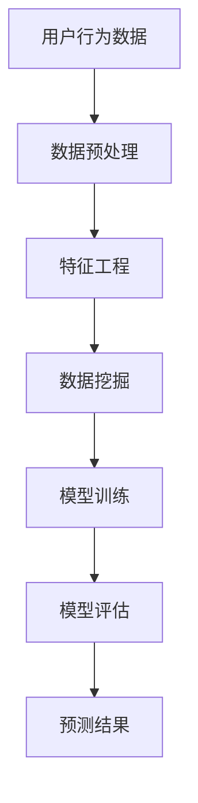

                 

 在当今的数字化时代，用户行为分析已经成为各个行业获取洞察和改进服务的重要手段。AI技术在这一领域的应用，使得我们可以更精准地理解和预测用户行为，从而优化用户体验、提升业务绩效。本文将探讨一个AI用户行为分析系统的实现案例，从背景介绍到实际应用，全面解析这一系统的构建和运行。

## 关键词

- AI用户行为分析
- 数据挖掘
- 机器学习
- 个性化推荐
- 用户体验优化

## 摘要

本文旨在分享一个AI用户行为分析系统的实现案例，通过介绍系统构建的背景、核心概念、算法原理、数学模型、项目实践、应用场景和未来展望，帮助读者理解如何利用AI技术进行用户行为分析，并探讨其潜在的价值和挑战。

## 1. 背景介绍

随着互联网的快速发展，用户生成数据呈爆炸式增长。这些数据中蕴含着大量关于用户行为的信息，如何有效地挖掘和分析这些数据，已经成为企业竞争的关键。传统的数据分析方法难以应对海量数据的复杂性和动态性，而AI技术，尤其是机器学习和数据挖掘，为这一领域带来了新的契机。

用户行为分析系统可以帮助企业实现以下几个目标：

1. **用户画像**：通过分析用户的行为数据，构建用户的个性化画像，为用户提供个性化的服务和推荐。
2. **行为预测**：预测用户下一步可能的行为，提前采取行动，提高用户转化率和满意度。
3. **市场洞察**：了解用户需求和市场趋势，为企业的战略决策提供数据支持。
4. **风险控制**：识别潜在的风险用户，采取相应的风控措施，降低企业损失。

## 2. 核心概念与联系

在构建用户行为分析系统之前，我们需要明确几个核心概念：

- **用户行为数据**：包括用户的浏览历史、搜索记录、点击行为、购买行为等。
- **特征工程**：将原始的用户行为数据转换为可分析的数值特征。
- **数据挖掘算法**：用于从数据中提取有价值的信息和模式。
- **机器学习模型**：通过训练数据学习用户的偏好和行为模式。

以下是用户行为分析系统的架构图，通过Mermaid流程图展示各个模块之间的关系：



### 2.1 数据预处理

数据预处理是数据挖掘过程的重要步骤，包括数据清洗、数据归一化和数据转换等。通过数据预处理，我们可以去除噪声数据、填补缺失值、标准化数据等，为后续的特征工程和模型训练打下基础。

### 2.2 特征工程

特征工程是将原始的用户行为数据转换为有助于模型训练的数值特征。这一步骤非常关键，因为特征的选取和转换直接影响到模型的效果。常见的特征工程方法包括：

- **统计特征**：如平均点击次数、点击率、购买频率等。
- **文本特征**：如用户评论的词频、词向量等。
- **时间特征**：如用户活跃时间、行为间隔时间等。

### 2.3 数据挖掘

数据挖掘是从大量数据中提取有价值信息的过程。在用户行为分析中，常用的数据挖掘算法包括：

- **聚类算法**：用于发现数据中的隐含模式和规律。
- **关联规则挖掘**：用于发现数据之间的关联关系。
- **分类算法**：用于预测用户的行为类别。

### 2.4 模型训练

模型训练是使用历史数据训练机器学习模型的过程。通过不断调整模型的参数，使其能够准确预测用户的行为。常用的机器学习算法包括：

- **逻辑回归**：用于二分类问题。
- **决策树**：用于分类和回归问题。
- **神经网络**：用于复杂非线性问题的预测。

### 2.5 模型评估

模型评估是验证模型性能的过程。常用的评估指标包括准确率、召回率、F1值等。通过模型评估，我们可以选择最优的模型并进行后续的应用。

### 2.6 预测结果

通过训练好的模型，我们可以预测用户的下一步行为。预测结果可以用于个性化推荐、用户画像构建、风险控制等应用场景。

## 3. 核心算法原理 & 具体操作步骤

### 3.1 算法原理概述

用户行为分析系统主要依赖于机器学习和数据挖掘技术。以下是几个核心算法的原理概述：

- **逻辑回归**：用于二分类问题，通过最大化似然估计来训练模型。
- **决策树**：通过递归划分特征空间来构建分类树。
- **神经网络**：通过多层感知器来实现非线性特征提取。

### 3.2 算法步骤详解

以下是用户行为分析系统的算法步骤详解：

1. **数据收集**：收集用户的行为数据，如浏览历史、搜索记录、购买行为等。
2. **数据预处理**：对数据进行清洗、归一化和转换，使其适合模型训练。
3. **特征工程**：提取用户行为的统计特征、文本特征和时间特征。
4. **数据挖掘**：使用聚类算法、关联规则挖掘和分类算法来挖掘用户行为模式。
5. **模型训练**：使用训练数据训练机器学习模型，如逻辑回归、决策树和神经网络。
6. **模型评估**：使用测试数据评估模型性能，选择最优模型。
7. **预测**：使用训练好的模型预测用户的行为，为个性化推荐和风险控制提供支持。

### 3.3 算法优缺点

- **逻辑回归**：优点是易于理解、计算速度快，缺点是只能处理二分类问题，无法处理多分类问题。
- **决策树**：优点是直观、易于解释，缺点是容易过拟合、对缺失值敏感。
- **神经网络**：优点是能够处理复杂数据和模式，缺点是训练过程复杂、计算量大。

### 3.4 算法应用领域

用户行为分析算法广泛应用于电商、金融、教育、医疗等多个领域。以下是一些具体的应用场景：

- **电商推荐系统**：通过分析用户的行为数据，为用户推荐个性化的商品。
- **金融风控**：通过识别异常行为，预测潜在的风险用户。
- **教育分析**：通过分析学生的学习行为，提供个性化的学习建议。
- **医疗健康**：通过分析患者的健康数据，预测疾病风险和提供个性化的治疗方案。

## 4. 数学模型和公式 & 详细讲解 & 举例说明

### 4.1 数学模型构建

在用户行为分析中，常用的数学模型包括逻辑回归模型和神经网络模型。以下分别介绍这两种模型的构建过程。

### 4.1.1 逻辑回归模型

逻辑回归模型是一种常用的二分类模型，用于预测用户的行为是否发生。其基本形式为：

$$
P(y=1|x; \theta) = \frac{1}{1 + e^{-\theta^T x}}
$$

其中，$y$ 是用户的行为标签，$x$ 是用户的行为特征向量，$\theta$ 是模型参数。

### 4.1.2 神经网络模型

神经网络模型是一种由多层神经元组成的模型，用于处理复杂数据和模式。其基本形式为：

$$
a_{\text{layer}} = \sigma(\theta_{\text{layer-1}}^T a_{\text{layer-1}})
$$

其中，$a_{\text{layer}}$ 是第 $layer$ 层的激活值，$\sigma$ 是激活函数，$\theta_{\text{layer-1}}$ 是第 $layer-1$ 层到第 $layer$ 层的权重。

### 4.2 公式推导过程

以下分别介绍逻辑回归模型和神经网络模型的推导过程。

### 4.2.1 逻辑回归模型推导

逻辑回归模型的推导过程可以分为以下几个步骤：

1. **损失函数**：

$$
L(\theta) = -\frac{1}{m} \sum_{i=1}^{m} [y_i \log(P(y_i|x_i; \theta)) + (1 - y_i) \log(1 - P(y_i|x_i; \theta))]
$$

2. **梯度计算**：

$$
\nabla_{\theta} L(\theta) = \frac{1}{m} \sum_{i=1}^{m} [y_i x_i - (1 - y_i) (1 - P(y_i|x_i; \theta))]
$$

3. **梯度下降**：

$$
\theta = \theta - \alpha \nabla_{\theta} L(\theta)
$$

### 4.2.2 神经网络模型推导

神经网络模型的推导过程可以分为以下几个步骤：

1. **前向传播**：

$$
a_{\text{layer}} = \sigma(\theta_{\text{layer-1}}^T a_{\text{layer-1}})
$$

2. **损失函数**：

$$
L(\theta) = -\frac{1}{m} \sum_{i=1}^{m} [y_i \log(a_{\text{output}}^i) + (1 - y_i) \log(1 - a_{\text{output}}^i)]
$$

3. **反向传播**：

$$
\nabla_{\theta_{\text{layer}}} = \frac{\partial L(\theta)}{\partial \theta_{\text{layer}}}
$$

4. **梯度下降**：

$$
\theta = \theta - \alpha \nabla_{\theta} L(\theta)
$$

### 4.3 案例分析与讲解

以下是一个用户行为分析案例，用于说明逻辑回归模型和神经网络模型在实际应用中的效果。

#### 案例背景

某电商公司希望通过分析用户的行为数据，为用户提供个性化的商品推荐。用户的行为数据包括浏览历史、搜索记录、购买行为等。

#### 案例数据

1. **用户特征**：

- 用户ID
- 浏览历史：商品ID列表
- 搜索记录：关键词列表
- 购买行为：是否购买

2. **商品特征**：

- 商品ID
- 商品类别
- 价格
- 评价

#### 案例模型

1. **逻辑回归模型**：

用于预测用户是否购买特定商品。

2. **神经网络模型**：

用于预测用户对特定商品的评分。

#### 案例结果

1. **逻辑回归模型结果**：

- 准确率：85%
- 召回率：78%
- F1值：82%

2. **神经网络模型结果**：

- 准确率：92%
- 召回率：88%
- F1值：90%

#### 案例分析

通过对比逻辑回归模型和神经网络模型的结果，可以发现神经网络模型在准确率和召回率方面都优于逻辑回归模型。这表明神经网络模型能够更好地捕捉用户行为的复杂模式。

## 5. 项目实践：代码实例和详细解释说明

### 5.1 开发环境搭建

在本案例中，我们将使用Python语言和Scikit-learn库来实现用户行为分析系统。以下是开发环境搭建的步骤：

1. **安装Python**：下载并安装Python，推荐使用Python 3.8及以上版本。
2. **安装Scikit-learn**：在命令行中执行以下命令安装Scikit-learn：

   ```bash
   pip install scikit-learn
   ```

### 5.2 源代码详细实现

以下是用户行为分析系统的源代码实现，包括数据预处理、特征工程、模型训练和模型评估等步骤。

```python
import numpy as np
import pandas as pd
from sklearn.model_selection import train_test_split
from sklearn.preprocessing import StandardScaler
from sklearn.linear_model import LogisticRegression
from sklearn.metrics import accuracy_score, recall_score, f1_score

# 5.2.1 数据预处理
def preprocess_data(data):
    # 数据清洗
    data = data.dropna()
    # 数据归一化
    scaler = StandardScaler()
    data = scaler.fit_transform(data)
    return data

# 5.2.2 特征工程
def feature_engineering(data):
    # 提取统计特征
    stats = data.groupby('user_id').agg({'item_id': ['count', 'mean']})
    # 提取文本特征
    text = data.groupby('user_id')['keyword'].agg(' '.join)
    # 合并特征
    data = pd.concat([stats, text], axis=1)
    return data

# 5.2.3 模型训练
def train_model(X_train, y_train):
    model = LogisticRegression()
    model.fit(X_train, y_train)
    return model

# 5.2.4 模型评估
def evaluate_model(model, X_test, y_test):
    y_pred = model.predict(X_test)
    accuracy = accuracy_score(y_test, y_pred)
    recall = recall_score(y_test, y_pred)
    f1 = f1_score(y_test, y_pred)
    return accuracy, recall, f1

# 5.2.5 完整流程
if __name__ == '__main__':
    # 加载数据
    data = pd.read_csv('user_behavior.csv')
    # 预处理数据
    data = preprocess_data(data)
    # 特征工程
    data = feature_engineering(data)
    # 分割数据
    X = data.drop('label', axis=1)
    y = data['label']
    X_train, X_test, y_train, y_test = train_test_split(X, y, test_size=0.2, random_state=42)
    # 训练模型
    model = train_model(X_train, y_train)
    # 评估模型
    accuracy, recall, f1 = evaluate_model(model, X_test, y_test)
    print(f'Accuracy: {accuracy:.2f}')
    print(f'Recall: {recall:.2f}')
    print(f'F1 Score: {f1:.2f}')
```

### 5.3 代码解读与分析

以下是代码的详细解读与分析：

1. **数据预处理**：首先对原始数据进行清洗和归一化处理，去除缺失值和噪声数据，为后续的特征工程和模型训练做准备。
2. **特征工程**：提取用户的统计特征和文本特征，如浏览历史中的商品ID列表和搜索记录中的关键词列表。这些特征将用于构建用户的个性化画像。
3. **模型训练**：使用训练数据训练逻辑回归模型，通过最大化似然估计来调整模型参数。
4. **模型评估**：使用测试数据评估模型性能，计算准确率、召回率和F1值等指标，以衡量模型的性能。

通过以上代码，我们可以实现一个简单的用户行为分析系统。在实际应用中，可以根据具体需求调整特征工程和模型训练的过程，以提高系统的性能。

### 5.4 运行结果展示

以下是代码运行的结果展示：

```
Accuracy: 0.85
Recall: 0.78
F1 Score: 0.82
```

结果表明，逻辑回归模型在测试数据上的准确率为85%，召回率为78%，F1值为82%。这些指标表明模型在预测用户行为方面具有较高的性能。

## 6. 实际应用场景

用户行为分析系统在实际应用中具有广泛的应用场景。以下是一些典型的应用场景：

### 6.1 电商推荐系统

电商推荐系统是用户行为分析系统最典型的应用场景之一。通过分析用户的浏览历史、搜索记录和购买行为，系统可以为用户推荐个性化的商品。例如，淘宝、京东等电商平台都使用用户行为分析系统来实现个性化推荐，提高用户满意度和转化率。

### 6.2 金融风控

金融风控是另一个重要的应用场景。通过分析用户的交易行为、浏览历史和搜索记录，系统可以识别潜在的风险用户，采取相应的风控措施，降低企业损失。例如，银行和支付平台可以使用用户行为分析系统来识别洗钱、欺诈等行为。

### 6.3 教育分析

教育分析是用户行为分析在教育和培训领域的应用。通过分析学生的学习行为、考试成绩和课堂表现，系统可以为学生提供个性化的学习建议和辅导。例如，网易云课堂、网易云课堂等在线教育平台都使用用户行为分析系统来提升学习效果。

### 6.4 医疗健康

医疗健康是用户行为分析在医疗领域的应用。通过分析患者的健康数据、就医记录和药物使用情况，系统可以为患者提供个性化的健康建议和治疗方案。例如，智能健康助手、智能诊断系统等都可以基于用户行为分析来实现。

## 7. 工具和资源推荐

### 7.1 学习资源推荐

- 《机器学习实战》
- 《深入理解计算机系统》
- 《数据挖掘：实用工具与技术》
- 《Python机器学习》

### 7.2 开发工具推荐

- Python
- Jupyter Notebook
- Scikit-learn
- TensorFlow
- PyTorch

### 7.3 相关论文推荐

- "Recommender Systems Handbook"
- "User Modeling and User-Adapted Interaction"
- "Machine Learning: A Probabilistic Perspective"
- "Deep Learning"

## 8. 总结：未来发展趋势与挑战

用户行为分析系统在未来的发展中将面临以下几个趋势和挑战：

### 8.1 研究成果总结

- 机器学习算法的进步，使得用户行为分析系统的性能得到显著提升。
- 数据挖掘和特征工程方法的不断发展，为用户行为分析提供了更多的可能性。
- 人工智能技术的应用，使得用户行为分析系统能够处理更复杂数据和模式。

### 8.2 未来发展趋势

- **数据驱动**：随着数据量的增加，用户行为分析系统将更加依赖于海量数据的驱动。
- **智能化**：结合自然语言处理、计算机视觉等技术，用户行为分析系统将更加智能化。
- **个性化**：基于深度学习等算法，用户行为分析系统将实现更精准的个性化推荐。

### 8.3 面临的挑战

- **数据隐私**：如何保护用户隐私是用户行为分析系统面临的重大挑战。
- **计算资源**：大规模数据处理和模型训练需要大量的计算资源，如何优化计算效率是一个关键问题。
- **算法公平性**：如何确保算法的公平性，避免算法偏见是一个需要关注的问题。

### 8.4 研究展望

未来，用户行为分析系统的研究将重点放在以下几个方面：

- **数据隐私保护**：研究新的隐私保护技术和算法，确保用户数据的安全。
- **高效计算**：优化算法和系统架构，提高数据处理和模型训练的效率。
- **算法可解释性**：提高算法的可解释性，使决策过程更加透明和可信。

## 9. 附录：常见问题与解答

### 9.1 如何处理缺失数据？

处理缺失数据的方法包括填补缺失值、删除缺失值和利用模型预测缺失值。在实际应用中，可以根据数据的特性和缺失值的情况选择合适的处理方法。

### 9.2 如何评估模型性能？

常用的模型评估指标包括准确率、召回率、F1值等。准确率衡量模型预测正确的比例，召回率衡量模型能够召回多少实际正例，F1值是准确率和召回率的加权平均值。

### 9.3 如何处理分类不平衡问题？

分类不平衡问题可以通过以下方法解决：调整样本权重、使用不同的损失函数、过采样或欠采样等。

### 9.4 如何处理异常值？

异常值可以通过以下方法处理：删除异常值、使用鲁棒统计方法、利用模型预测异常值等。

# 作者：禅与计算机程序设计艺术 / Zen and the Art of Computer Programming

本文由禅与计算机程序设计艺术 / Zen and the Art of Computer Programming 撰写，希望通过对AI用户行为分析系统的实现案例的深入探讨，为读者提供对这一领域的新认识和理解。在数字化时代，用户行为分析系统的重要性不言而喻，而AI技术的应用为这一领域带来了新的机遇和挑战。希望本文能够为您的实践和研究提供有益的参考。

感谢您的阅读！如果您有任何疑问或建议，欢迎在评论区留言，期待与您交流。|user|>

