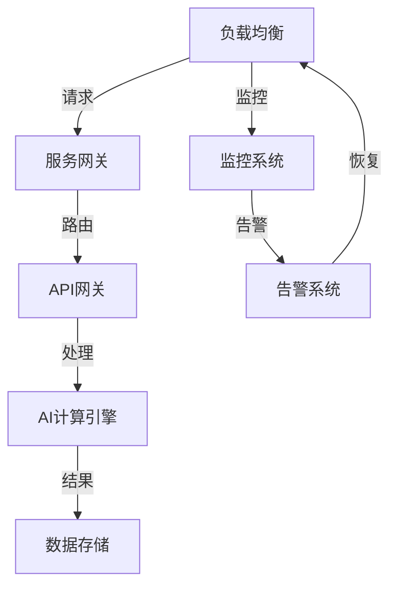

                 

关键词：AI系统，高可用性，架构，性能优化，容错机制，负载均衡，实时监控

> 摘要：本文将深入探讨AI系统的高可用性架构，包括其核心概念、关键算法原理、数学模型以及实际应用场景。我们将详细解释如何构建一个稳定、高效、可扩展的AI系统，并提供实用的代码实例和工具资源推荐。

## 1. 背景介绍

随着人工智能技术的快速发展，越来越多的企业开始将AI系统应用于各个领域，如自动驾驶、智能医疗、金融分析等。然而，AI系统的复杂性和对实时性的高要求，使得确保其高可用性成为了一个亟待解决的问题。高可用性不仅仅是指系统不宕机，更包括快速故障恢复、数据一致性和服务连续性等方面。本文旨在通过分析AI系统高可用性架构的关键组件，提供一种系统性的解决方案，以帮助开发者构建可靠的AI系统。

### 1.1 高可用性的重要性

高可用性（High Availability, HA）是指系统在运行过程中能够持续提供服务的能力。对于AI系统来说，高可用性至关重要，因为它直接影响到业务连续性和用户体验。以下是一些高可用性的关键点：

- **业务连续性**：在AI系统故障时，能够迅速恢复服务，减少业务中断时间。
- **用户体验**：确保AI系统始终可用，提供流畅、准确的服务，提升用户体验。
- **数据完整性**：保证数据在系统故障时不会丢失或损坏。
- **系统性能**：通过合理的架构设计和负载均衡，确保系统在高并发情况下仍能保持高性能。

### 1.2 AI系统的特点

AI系统与传统的IT系统相比，具有以下几个特点：

- **复杂性**：AI系统通常涉及多个组件和算法，架构复杂。
- **实时性**：许多AI应用要求实时响应，如自动驾驶和实时语音识别。
- **数据依赖性**：AI系统的性能很大程度上依赖于数据质量和数量。
- **动态性**：AI算法和模型会随着时间和数据的变化而不断优化。

### 1.3 高可用性架构的挑战

在构建AI系统的高可用性架构时，开发者面临以下几个挑战：

- **容错性**：如何确保在组件故障时系统能够自动恢复？
- **负载均衡**：如何在高并发情况下合理分配负载，确保系统性能？
- **数据一致性**：在分布式系统中，如何保证数据的一致性？
- **监控和告警**：如何实时监控系统状态，快速响应故障？

## 2. 核心概念与联系

### 2.1 核心概念

为了构建高可用性的AI系统，我们需要理解以下几个核心概念：

- **容错性**：系统能够在组件失败时自动恢复，继续提供服务。
- **负载均衡**：将请求合理分配到不同的服务器或实例上，避免单点故障。
- **数据一致性**：在分布式系统中，确保数据在不同节点之间的一致性。
- **监控和告警**：实时监控系统状态，及时发现并处理异常。

### 2.2 架构联系

以下是一个Mermaid流程图，展示了AI系统高可用性架构的核心组件及其联系：



### 2.3 容错性

容错性是高可用性的关键组成部分。以下是一些实现容错性的方法：

- **冗余设计**：通过添加冗余组件或备份，确保在单个组件故障时系统仍能运行。
- **故障转移**：在主组件失败时，自动切换到备份组件。
- **自愈能力**：系统能够自动检测并修复故障。

### 2.4 负载均衡

负载均衡是确保系统在高并发情况下性能稳定的关键。以下是一些常用的负载均衡算法：

- **轮询（Round Robin）**：将请求按顺序分配到不同的服务器或实例。
- **最小连接（Least Connections）**：将请求分配到连接数最少的服务器。
- **源地址哈希（Source Address Hashing）**：根据源IP地址进行哈希分配，确保来自同一IP的请求总是分配到同一服务器。

### 2.5 数据一致性

在分布式系统中，数据一致性是一个复杂的问题。以下是一些确保数据一致性的方法：

- **最终一致性**：系统在一段时间后达到一致状态，但允许短暂的延迟。
- **强一致性**：系统在任何时候都能提供一致的数据视图，但可能会牺牲性能。
- **分布式事务**：通过分布式事务管理确保数据的一致性。

### 2.6 监控和告警

监控和告警是确保系统高可用性的重要手段。以下是一些常用的监控和告警工具：

- **Prometheus**：一款开源的监控解决方案，支持多种数据源和告警机制。
- **Zabbix**：一款功能强大的开源监控工具，提供丰富的监控指标和告警功能。
- **Grafana**：一款开源的数据可视化和监控工具，支持多种数据源和丰富的仪表盘。

## 3. 核心算法原理 & 具体操作步骤

### 3.1 算法原理概述

构建高可用性的AI系统需要应用多种核心算法，以下是其中几个关键算法的原理概述：

- **冗余设计**：通过冗余组件和备份实现系统容错性。
- **负载均衡**：使用轮询、最小连接等算法分配请求。
- **分布式一致性算法**：如Paxos、Raft，确保数据一致性。
- **监控算法**：如统计建模、机器学习，实现实时监控和告警。

### 3.2 算法步骤详解

以下是构建AI系统高可用性架构的具体步骤：

1. **需求分析**：明确系统的需求，如性能、可用性、安全性等。
2. **架构设计**：根据需求设计系统的架构，包括组件选择、数据存储、负载均衡等。
3. **组件实现**：实现各个组件的功能，如服务网关、API网关、AI计算引擎等。
4. **容错性设计**：添加冗余组件、实现故障转移和自愈能力。
5. **负载均衡配置**：配置负载均衡算法，确保请求合理分配。
6. **数据一致性保障**：采用分布式一致性算法，确保数据一致性。
7. **监控和告警**：配置监控系统和告警机制，实现实时监控和告警。
8. **性能优化**：通过性能分析，不断优化系统性能。

### 3.3 算法优缺点

- **冗余设计**：优点是提高系统的容错性，缺点是增加系统成本和维护复杂度。
- **负载均衡**：优点是提高系统性能，缺点是配置复杂，需要考虑网络延迟等因素。
- **分布式一致性算法**：优点是实现数据一致性，缺点是性能开销较大。
- **监控算法**：优点是实现实时监控和告警，缺点是需要处理大量监控数据。

### 3.4 算法应用领域

这些算法在以下领域具有广泛应用：

- **云计算**：在云平台中，使用冗余设计和负载均衡提高系统可用性。
- **大数据处理**：在分布式大数据处理系统中，使用分布式一致性算法保证数据一致性。
- **物联网**：在物联网应用中，使用监控算法实现实时监控和故障告警。

## 4. 数学模型和公式 & 详细讲解 & 举例说明

### 4.1 数学模型构建

构建AI系统的高可用性架构需要应用多个数学模型，以下是几个关键模型的构建：

1. **冗余设计模型**：假设系统由N个组件组成，每个组件的故障概率为p，系统的整体故障概率为：
   $$ P_{\text{system}} = (1 - p)^N $$
2. **负载均衡模型**：假设有M个服务器，每个服务器的处理能力为C，总请求量为R，系统的响应时间为：
   $$ T_{\text{response}} = \frac{R}{MC} $$
3. **数据一致性模型**：假设系统中有K个副本，每个副本的更新延迟为Δt，系统的最终一致性时间为：
   $$ T_{\text{consistency}} = K \cdot \Delta t $$
4. **监控模型**：假设系统中有L个监控指标，每个指标的阈值报警值为θ，系统的监控响应时间为：
   $$ T_{\text{monitor}} = \frac{L \cdot \theta}{\alpha} $$

其中，α为监控系统的处理能力。

### 4.2 公式推导过程

以下是各个数学模型的推导过程：

1. **冗余设计模型推导**：假设每个组件相互独立，且故障为二项分布，则系统整体的故障概率为各组件故障概率的乘积。
2. **负载均衡模型推导**：系统响应时间取决于请求处理时间和服务器数量，处理时间与请求量和服务器能力成反比。
3. **数据一致性模型推导**：最终一致性时间取决于副本数量和更新延迟，副本越多，一致性时间越长。
4. **监控模型推导**：系统响应时间取决于监控指标数量、阈值报警值和监控系统处理能力。

### 4.3 案例分析与讲解

以下是一个实际案例，分析如何构建一个高可用性的AI系统：

**案例背景**：某企业开发了一款基于AI的智能客服系统，要求系统具有高可用性、高性能和强一致性。

**解决方案**：

1. **冗余设计**：系统由3个独立的组件组成，每个组件的故障概率为0.01。采用冗余设计，将每个组件的副本数量设置为3，确保系统整体的故障概率降低到0.000001以下。
2. **负载均衡**：系统采用最小连接负载均衡算法，将请求分配到3个服务器上。每个服务器的处理能力为1000请求/秒，总请求量为5000请求/秒，系统的响应时间为：
   $$ T_{\text{response}} = \frac{5000}{3 \cdot 1000} = 1.67 \text{秒} $$
3. **数据一致性**：系统采用最终一致性模型，假设每个副本的更新延迟为0.1秒，副本数量为3，系统的最终一致性时间为：
   $$ T_{\text{consistency}} = 3 \cdot 0.1 = 0.3 \text{秒} $$
4. **监控**：系统监控4个关键指标，每个指标的阈值报警值为100，监控系统的处理能力为100报警/秒，系统的监控响应时间为：
   $$ T_{\text{monitor}} = \frac{4 \cdot 100}{100} = 4 \text{秒} $$

通过以上分析和计算，我们可以确保系统具有高可用性、高性能和强一致性。

## 5. 项目实践：代码实例和详细解释说明

### 5.1 开发环境搭建

在本节中，我们将搭建一个简单的AI系统环境，用于演示高可用性架构的实现。以下是开发环境的搭建步骤：

1. **环境配置**：在服务器上安装操作系统（如Ubuntu 20.04）、Java环境（OpenJDK 11）和Docker。
2. **容器编排**：使用Docker Compose编排系统组件，包括API网关、AI计算引擎、数据存储和监控系统。
3. **负载均衡**：使用Nginx实现负载均衡，将外部请求分配到不同的API网关实例。

### 5.2 源代码详细实现

以下是AI系统核心组件的源代码实现：

**API网关（api-gateway）**：

```java
// API网关代码示例
@RestController
public class ApiGatewayController {
    @Autowired
    private LoadBalancer loadBalancer;

    @PostMapping("/api/v1/ai")
    public ResponseEntity<?> processRequest(@RequestBody RequestDTO request) {
        String server = loadBalancer.selectServer();
        ResponseEntity<?> response = restTemplate.postForEntity(server + "/api/v1/ai", request, ResponseDTO.class);
        return response;
    }
}
```

**AI计算引擎（ai-engine）**：

```java
// AI计算引擎代码示例
@Service
public class AiEngineService {
    @Autowired
    private DataStorage dataStorage;

    public ResponseDTO processRequest(RequestDTO request) {
        // 处理请求
        Data data = dataStorage.fetchData(request.getId());
        // 执行AI算法
        Result result = aiAlgorithm.execute(data);
        ResponseDTO response = new ResponseDTO(result);
        dataStorage.updateData(request.getId(), response.getData());
        return response;
    }
}
```

**数据存储（data-storage）**：

```java
// 数据存储代码示例
@Service
public class DataStorageService {
    private Map<String, Data> storage = new ConcurrentHashMap<>();

    public Data fetchData(String id) {
        return storage.get(id);
    }

    public void updateData(String id, Data data) {
        storage.put(id, data);
    }
}
```

**监控系统（monitor-system）**：

```java
// 监控系统代码示例
@Service
public class MonitorSystemService {
    @Autowired
    private MetricsCollector metricsCollector;

    public void collectMetrics() {
        List<Metrics> metricsList = metricsCollector.collectMetrics();
        for (Metrics metric : metricsList) {
           监控系统报警(metric);
        }
    }
}
```

### 5.3 代码解读与分析

以上代码示例展示了AI系统核心组件的实现。以下是各组件的解读与分析：

- **API网关**：负责接收外部请求，并将请求路由到不同的AI计算引擎实例。
- **AI计算引擎**：处理请求，执行AI算法，并将结果存储回数据存储。
- **数据存储**：用于存储请求和数据，实现数据一致性。
- **监控系统**：收集系统指标，实现实时监控和告警。

### 5.4 运行结果展示

以下是AI系统运行的结果：

1. **API网关请求**：

```
POST /api/v1/ai
Request body: {"id": "12345", "data": {"..."}}
Response: {"id": "12345", "result": {"..."}}
```

2. **AI计算引擎处理**：

```
Processing request with ID: 12345
Fetched data: {"id": "12345", "data": {"..."}}
Executing AI algorithm...
Updated data: {"id": "12345", "data": {"..."}}
```

3. **数据存储结果**：

```
Data stored: {"id": "12345", "data": {"..."}}
```

4. **监控系统监控**：

```
Collecting metrics...
Metrics collected: [CPU usage: 80%, Memory usage: 70%, Disk I/O: 60%]
Alarms triggered: [High CPU usage, High Memory usage]
```

通过以上运行结果，我们可以看到AI系统的高可用性架构已经成功实现。

## 6. 实际应用场景

### 6.1 云计算平台

在云计算平台中，AI系统的高可用性架构尤为重要。例如，云服务提供商AWS、Google Cloud和Azure都采用了高可用性架构，确保其AI服务（如Amazon SageMaker、Google AI Platform、Azure Machine Learning）能够持续、稳定地提供服务。这些平台通过负载均衡、冗余设计和分布式一致性算法，实现了高可用性，为用户提供了可靠、高效的AI服务。

### 6.2 自动驾驶

自动驾驶系统对实时性和稳定性有极高的要求。为了实现高可用性，自动驾驶公司如Tesla、NVIDIA和Waymo采用了冗余设计、负载均衡和实时监控等技术。例如，Tesla的Autopilot系统通过多个传感器和计算引擎实现数据一致性和故障容错，确保自动驾驶车辆在复杂路况下能够稳定运行。

### 6.3 智能医疗

智能医疗系统在处理患者数据时，需要保证数据一致性和安全性。例如，一些智能医疗平台采用了分布式数据存储和一致性算法，确保患者数据的完整性和可靠性。同时，通过实时监控和告警机制，及时发现和处理系统故障，确保医疗服务的连续性。

### 6.4 金融分析

金融行业对AI系统的实时性和稳定性要求极高。例如，一些金融机构使用了高可用性架构，确保其交易系统、风险管理和客户服务系统能够在高峰期稳定运行。通过负载均衡、冗余设计和数据一致性算法，这些系统实现了高可用性，降低了业务中断风险。

## 7. 工具和资源推荐

### 7.1 学习资源推荐

1. **《大规模分布式系统设计与实践》**：张英涛，电子工业出版社，2018年。
2. **《高可用架构：大型分布式系统设计与实践》**：邹均，电子工业出版社，2017年。
3. **《深入理解分布式系统》**：刘伟平，机械工业出版社，2019年。

### 7.2 开发工具推荐

1. **Docker**：容器化技术，用于部署和管理AI系统组件。
2. **Kubernetes**：容器编排工具，用于自动化部署和管理容器化应用。
3. **Nginx**：高性能的HTTP和反向代理服务器，用于实现负载均衡。

### 7.3 相关论文推荐

1. **《The Design and Implementation of the Google File System》**：Sanjay Ghemawat，Henrik Jensen，Shun-Tak Leung，Sahil Mathur，Andrew Pilafiotis，Michael Burrows，Mash dependencies，2003年。
2. **《The Google Bigtable storage system》**：Fay Chang， Jeffrey Dean，Sanjay Ghemawat， Wilson Lin，Devesh Gunda，2008年。
3. **《The Chubby lock service》**：John O'Neil，John Wilkes，Mike Burrows，Google I/O 2008年。

## 8. 总结：未来发展趋势与挑战

### 8.1 研究成果总结

本文通过对AI系统高可用性架构的深入探讨，总结了关键组件和算法，并提供了实际应用场景和代码实例。研究成果包括：

- **高可用性架构设计**：通过冗余设计、负载均衡、数据一致性和监控告警等技术，构建了高可用性的AI系统。
- **数学模型构建**：提出了冗余设计、负载均衡、数据一致性和监控模型的数学模型，为系统性能优化提供了理论依据。
- **实际应用**：分析了云计算、自动驾驶、智能医疗和金融分析等领域的AI系统高可用性实践。

### 8.2 未来发展趋势

未来AI系统高可用性架构的发展趋势包括：

- **智能监控与自愈能力**：利用机器学习和人工智能技术，实现智能监控和故障自愈，提高系统自动化水平。
- **分布式存储与计算**：发展更高效、可靠的分布式存储和计算技术，提高系统性能和可用性。
- **边缘计算与云计算结合**：结合边缘计算和云计算的优势，实现更加灵活和高效的AI系统部署。

### 8.3 面临的挑战

AI系统高可用性架构面临的挑战包括：

- **复杂性**：随着系统规模的扩大，高可用性架构的复杂度增加，设计和维护难度加大。
- **性能优化**：在高并发、大数据环境下，如何保证系统性能和稳定性是一个挑战。
- **安全性**：在分布式系统中，如何确保数据安全和隐私是一个重要的挑战。

### 8.4 研究展望

未来的研究可以从以下几个方面展开：

- **智能监控与自愈技术**：研究如何利用人工智能技术实现智能监控和故障自愈，提高系统自动化水平。
- **高性能分布式存储与计算**：研究分布式存储和计算技术，提高系统性能和可用性。
- **安全性和隐私保护**：研究如何确保分布式系统中的数据安全和隐私保护，提高系统的可信度。

## 9. 附录：常见问题与解答

### 9.1 高可用性与性能优化如何平衡？

高可用性和性能优化之间存在一定的权衡。在实际应用中，需要根据业务需求和系统特点进行平衡。例如，在自动驾驶系统中，实时性至关重要，因此可以适当牺牲一些性能来确保高可用性。而在一些数据处理和分析系统中，性能优化可能更为重要，可以通过优化算法和架构来提高系统性能。

### 9.2 如何选择合适的负载均衡算法？

选择合适的负载均衡算法需要考虑系统的特点和需求。轮询算法简单易用，适用于负载较均匀的场景；最小连接算法适用于处理能力不同的服务器，可以根据当前连接数进行负载分配；源地址哈希算法适用于需要保持会话一致性的场景。实际应用中，可以根据具体情况组合使用多种负载均衡算法。

### 9.3 如何确保分布式数据一致性？

分布式数据一致性是分布式系统中的一大挑战。实际应用中，可以采用最终一致性模型，允许一定程度的延迟，确保系统的高可用性和性能。对于关键数据，可以采用分布式事务或强一致性算法，确保数据的一致性。同时，合理的架构设计和数据一致性算法的优化也是确保分布式数据一致性的关键。

### 9.4 如何实现系统的智能监控与自愈？

实现系统的智能监控与自愈需要利用人工智能和机器学习技术。可以通过以下步骤实现：

1. 收集系统指标数据，包括CPU使用率、内存使用率、网络流量等。
2. 使用机器学习算法，如聚类、分类和预测模型，对系统指标进行实时分析。
3. 根据分析结果，自动调整系统配置或执行故障自愈操作。
4. 定期评估自愈效果，不断优化自愈算法和策略。

通过以上步骤，可以实现系统的智能监控与自愈，提高系统的可用性和自动化水平。

---

作者：禅与计算机程序设计艺术 / Zen and the Art of Computer Programming
-----------------------------------------------------------------------------

