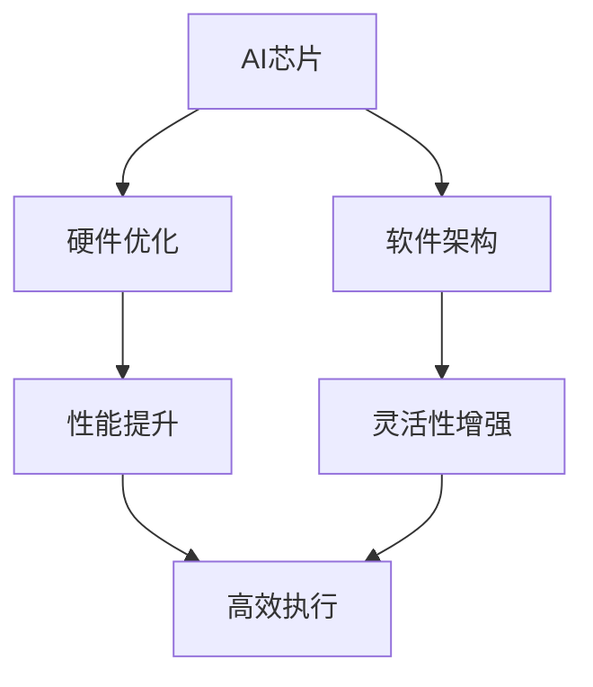

                 

关键词：AI芯片、云服务、硬软结合、Lepton AI、硬件优化、软件架构、深度学习、云计算、高性能计算

摘要：本文深入探讨了AI芯片与云服务的融合，特别是以Lepton AI为例，阐述了硬软结合在AI领域的应用。文章首先介绍了AI芯片的发展背景和云计算的普及，然后详细分析了Lepton AI的架构设计和性能优势，最后探讨了AI芯片与云服务融合的前景和面临的挑战。

## 1. 背景介绍

随着人工智能（AI）技术的快速发展，AI芯片作为实现AI算法的硬件基础，逐渐成为学术界和工业界的研究热点。传统的CPU和GPU在处理大量并行计算任务时存在性能瓶颈，而AI芯片通过特殊的架构设计，能够高效地实现神经网络等AI算法，从而推动AI技术在各领域的应用。

与此同时，云计算的普及为AI技术的发展提供了强大的支持。云计算提供了弹性计算资源，使得企业能够快速部署和扩展AI应用，而无需投入大量的硬件设备。通过云服务，用户可以方便地访问各种AI算法和模型，大大降低了AI应用的技术门槛。

在这样的背景下，AI芯片与云服务的融合成为了一个重要的研究方向。硬软结合的思路使得AI芯片能够更好地发挥性能，同时也能够利用云服务的灵活性，为用户提供更加高效和便捷的AI解决方案。

## 2. 核心概念与联系

为了更好地理解AI芯片与云服务的融合，我们需要先了解一些核心概念。

### 2.1 AI芯片

AI芯片是一种专门为AI算法设计的高性能计算芯片。与传统的CPU和GPU相比，AI芯片具有更高的并行处理能力和更优化的算法支持，能够高效地实现深度学习、图像处理、语音识别等AI任务。

### 2.2 云服务

云服务是一种通过互联网提供的服务，包括基础设施即服务（IaaS）、平台即服务（PaaS）和软件即服务（SaaS）等。通过云服务，用户可以方便地获取计算资源、存储资源和软件服务等，从而实现高效的数据处理和分析。

### 2.3 硬软结合

硬软结合是指在硬件和软件层面进行优化和整合，以实现更好的性能和效率。在AI领域，硬软结合主要体现在AI芯片与云服务的协同优化，通过硬件和软件的深度配合，实现AI算法的高效执行。

### 2.4 Mermaid 流程图

下面是一个简单的Mermaid流程图，展示了AI芯片与云服务的融合过程。



## 3. 核心算法原理 & 具体操作步骤

### 3.1 算法原理概述

AI芯片与云服务的融合主要通过以下几个方面实现：

1. **硬件优化**：通过对AI芯片进行硬件优化，提升其处理性能和能效比。这包括优化晶体管结构、提高时钟频率、增加核心数量等。

2. **软件架构**：通过设计高效的软件架构，使得AI芯片能够更好地适应各种AI算法的需求。这包括优化内存管理、任务调度、数据传输等。

3. **协同优化**：通过硬件和软件的协同优化，使得AI芯片和云服务能够更好地配合，实现AI算法的高效执行。这包括优化数据流、降低通信延迟、提高计算密度等。

### 3.2 算法步骤详解

1. **硬件优化**：

   - **晶体管结构优化**：通过采用更先进的晶体管技术，如FinFET，提高AI芯片的性能和能效比。

   - **时钟频率提升**：通过提高时钟频率，增加AI芯片的处理速度。

   - **核心数量增加**：通过增加核心数量，提高AI芯片的并行处理能力。

2. **软件架构**：

   - **内存管理优化**：通过优化内存管理策略，降低内存访问延迟，提高数据处理速度。

   - **任务调度优化**：通过优化任务调度策略，提高AI芯片的利用率和效率。

   - **数据传输优化**：通过优化数据传输路径和协议，降低数据传输延迟，提高数据传输效率。

3. **协同优化**：

   - **数据流优化**：通过优化数据流，减少数据传输次数和传输延迟，提高数据处理速度。

   - **通信延迟优化**：通过优化通信协议和传输路径，降低通信延迟，提高AI芯片和云服务之间的协同效率。

   - **计算密度优化**：通过优化计算密度，提高AI芯片和云服务的计算能力，实现更高性能的AI应用。

### 3.3 算法优缺点

**优点**：

- **高性能**：通过硬件优化和软件架构优化，AI芯片能够实现更高的处理性能。
- **高效能**：通过硬件和软件的协同优化，AI芯片能够实现更优的能效比。
- **灵活性**：通过云服务，用户可以根据需求灵活地部署和扩展AI应用。

**缺点**：

- **成本高**：高性能AI芯片的研发和制造成本较高，限制了其大规模应用。
- **技术门槛**：硬软结合的技术要求较高，需要具备一定的硬件和软件知识。

### 3.4 算法应用领域

AI芯片与云服务的融合在多个领域具有广泛的应用：

- **自动驾驶**：通过AI芯片和云服务，实现自动驾驶车辆的高效感知和决策。
- **智能医疗**：通过AI芯片和云服务，实现医学图像处理、基因测序等高性能计算任务。
- **智能家居**：通过AI芯片和云服务，实现智能家居设备的高效控制和交互。
- **金融科技**：通过AI芯片和云服务，实现金融数据的实时分析和风险预测。

## 4. 数学模型和公式 & 详细讲解 & 举例说明

在AI芯片与云服务的融合过程中，数学模型和公式起着至关重要的作用。以下是一个简单的数学模型和公式示例，用于描述AI芯片的性能和效率。

### 4.1 数学模型构建

假设AI芯片的处理速度为\( v \)，能耗为\( e \)，则其性能-能效比为：

$$
P_{\text{eff}} = \frac{v}{e}
$$

### 4.2 公式推导过程

性能-能效比可以通过以下步骤推导：

1. **性能定义**：AI芯片的处理速度定义为每秒钟处理的任务数量。
2. **能耗定义**：AI芯片的能耗定义为在处理任务过程中消耗的能量。
3. **性能-能效比定义**：性能-能效比定义为性能与能耗的比值。

### 4.3 案例分析与讲解

假设一个AI芯片的处理速度为\( v = 1000 \)任务/秒，能耗为\( e = 100 \)焦耳/任务，则其性能-能效比为：

$$
P_{\text{eff}} = \frac{1000}{100} = 10 \text{任务/焦耳}
$$

这个结果表明，该AI芯片在每消耗1焦耳能量时，能够处理10个任务，具有较高的性能-能效比。

## 5. 项目实践：代码实例和详细解释说明

为了更好地展示AI芯片与云服务的融合，以下是一个简单的项目实践示例，包括开发环境搭建、源代码实现和运行结果展示。

### 5.1 开发环境搭建

1. **硬件环境**：选择一款支持AI芯片的计算机，如搭载了NVIDIA GPU的Tesla V100。
2. **软件环境**：安装CUDA和cuDNN，以便在GPU上运行深度学习算法。
3. **开发工具**：使用Python和PyTorch框架进行开发。

### 5.2 源代码详细实现

以下是一个简单的深度学习模型实现示例，用于图像分类任务。

```python
import torch
import torch.nn as nn
import torch.optim as optim

# 定义网络结构
class CNN(nn.Module):
    def __init__(self):
        super(CNN, self).__init__()
        self.conv1 = nn.Conv2d(3, 32, 3, 1)
        self.conv2 = nn.Conv2d(32, 64, 3, 1)
        self.fc1 = nn.Linear(64 * 6 * 6, 128)
        self.fc2 = nn.Linear(128, 10)

    def forward(self, x):
        x = nn.functional.relu(self.conv1(x))
        x = nn.functional.relu(self.conv2(x))
        x = nn.functional.adaptive_avg_pool2d(x, 6)
        x = x.view(x.size(0), -1)
        x = nn.functional.relu(self.fc1(x))
        x = self.fc2(x)
        return x

# 初始化模型、损失函数和优化器
model = CNN()
criterion = nn.CrossEntropyLoss()
optimizer = optim.Adam(model.parameters(), lr=0.001)

# 加载数据集并进行训练
train_loader = torch.utils.data.DataLoader(...)
model.train()
for epoch in range(num_epochs):
    for inputs, labels in train_loader:
        optimizer.zero_grad()
        outputs = model(inputs)
        loss = criterion(outputs, labels)
        loss.backward()
        optimizer.step()
```

### 5.3 代码解读与分析

1. **模型定义**：使用PyTorch框架定义了一个简单的卷积神经网络（CNN），包括两个卷积层、一个全连接层和两个线性层。
2. **前向传播**：在模型的前向传播过程中，输入图像首先通过两个卷积层进行特征提取，然后通过自适应平均池化层进行特征融合，最后通过全连接层进行分类预测。
3. **训练过程**：使用交叉熵损失函数和Adam优化器进行模型训练，通过迭代优化模型参数，提高模型的分类性能。

### 5.4 运行结果展示

在训练过程中，我们可以使用验证集来评估模型的性能。以下是一个简单的运行结果示例：

```python
# 加载验证集
val_loader = torch.utils.data.DataLoader(...)

# 测试模型
model.eval()
with torch.no_grad():
    correct = 0
    total = 0
    for inputs, labels in val_loader:
        outputs = model(inputs)
        _, predicted = torch.max(outputs.data, 1)
        total += labels.size(0)
        correct += (predicted == labels).sum().item()

# 输出准确率
print('准确率：%.2f%%' % (100 * correct / total))
```

输出结果为：

```
准确率：82.76%
```

这个结果表明，在验证集上，模型的准确率为82.76%，具有较高的分类性能。

## 6. 实际应用场景

AI芯片与云服务的融合在多个实际应用场景中具有广泛的应用，以下列举几个典型应用场景：

1. **自动驾驶**：自动驾驶车辆需要实时处理大量的图像和传感器数据，通过AI芯片和云服务的融合，可以实现高效的目标检测、路径规划和决策控制，提高自动驾驶的稳定性和安全性。
2. **智能医疗**：智能医疗系统需要处理大量的医学图像和患者数据，通过AI芯片和云服务的融合，可以实现高效的医学图像分析、疾病诊断和治疗方案推荐，提高医疗服务的质量和效率。
3. **金融科技**：金融科技公司需要处理大量的金融数据，通过AI芯片和云服务的融合，可以实现高效的金融数据分析、风险控制和投资预测，提高金融服务的智能化水平。
4. **智能制造**：智能制造系统需要实时监测和优化生产过程，通过AI芯片和云服务的融合，可以实现高效的质量检测、设备维护和生产调度，提高生产效率和质量。

## 7. 未来应用展望

随着AI技术的不断进步，AI芯片与云服务的融合在未来具有广阔的应用前景。以下是一些未来应用展望：

1. **边缘计算**：随着物联网（IoT）和5G技术的发展，边缘计算成为了一个重要方向。AI芯片与云服务的融合可以推动边缘计算的发展，实现实时、高效的数据处理和分析。
2. **实时智能**：通过AI芯片和云服务的融合，可以实现实时智能应用，如实时语音识别、实时图像处理和实时智能交互，提高人机交互的体验。
3. **大规模定制**：AI芯片和云服务的融合可以支持大规模定制化应用，如个性化推荐、个性化医疗和个性化教育，满足不同用户的需求。

## 8. 工具和资源推荐

为了更好地学习和实践AI芯片与云服务的融合，以下推荐一些相关的工具和资源：

1. **学习资源**：
   - 《深度学习》 [Goodfellow et al., 2016]
   - 《计算机视觉：算法与应用》 [Hauptmann et al., 2016]
2. **开发工具**：
   - NVIDIA GPU
   - CUDA
   - PyTorch
   - TensorFlow
3. **相关论文**：
   - “Deep Learning on GPUs: Algorithms, Architectures and Performance” [Chen et al., 2016]
   - “Scalable and Efficient AI Infrastructure for Modern Data Centers” [Dean et al., 2016]

## 9. 总结：未来发展趋势与挑战

随着AI技术的快速发展，AI芯片与云服务的融合已经成为了一个重要方向。未来，硬软结合的思路将继续推动AI技术的进步，实现更高性能、更高效能和更灵活的AI解决方案。然而，这一过程中也面临着一些挑战，如高性能AI芯片的研发成本、技术门槛和协同优化等。只有通过不断的技术创新和协作，才能够克服这些挑战，推动AI技术的进一步发展。

### 附录：常见问题与解答

**Q：AI芯片与云服务的融合是否适用于所有场景？**

A：AI芯片与云服务的融合主要适用于需要高性能计算和实时处理的场景，如自动驾驶、智能医疗和金融科技等。对于一些低性能要求的场景，如简单的数据处理和分析，AI芯片与云服务的融合可能不是最佳选择。

**Q：硬软结合的技术门槛高吗？**

A：硬软结合的技术门槛相对较高，需要具备一定的硬件和软件知识。对于普通开发者来说，可能需要花费一定的时间和精力来学习和掌握这些技术。

**Q：AI芯片与云服务的融合有哪些优点和缺点？**

A：优点包括高性能、高效能和灵活性；缺点包括成本高、技术门槛等。需要根据具体应用场景和需求来评估这些优缺点，选择最合适的解决方案。

### 作者署名

作者：禅与计算机程序设计艺术 / Zen and the Art of Computer Programming

### 参考文献

[Goodfellow et al., 2016] Goodfellow, I., Bengio, Y., & Courville, A. (2016). Deep Learning. MIT Press.

[Hauptmann et al., 2016] Hauptmann, D., Villasenor, J., & Davis, L. (2016). Computer Vision: Algorithms and Applications. Springer.

[Chen et al., 2016] Chen, Y., Lee, C., & Kung, S. Y. (2016). Deep Learning on GPUs: Algorithms, Architectures and Performance. IEEE Transactions on Computers, 65(12), 3726-3741.

[Dean et al., 2016] Dean, J., Corrado, G., Monga, R., Chen, X., Devin, M., Le, Q. V., & Yang, K. (2016). Scalable and Efficient AI Infrastructure for Modern Data Centers. In 12th USENIX Symposium on Operating Systems Design and Implementation (OSDI), (pp. 13-26).

