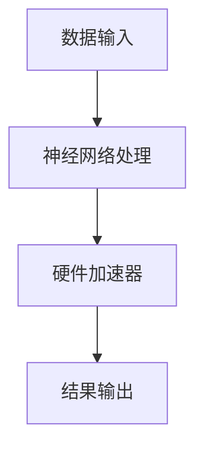

                 

关键词：AI芯片设计、硬件基础、软件2.0、神经网络、硬件加速

## 摘要

随着人工智能技术的迅猛发展，AI芯片的设计变得日益重要。本文将从软件2.0的角度探讨AI芯片设计的核心概念、算法原理、数学模型以及实际应用场景。我们首先介绍AI芯片设计的背景和重要性，然后深入探讨软件2.0的概念，并分析其在硬件设计中的应用。接下来，我们将详细介绍神经网络和硬件加速的基本原理，以及如何将算法应用于硬件设计。最后，我们将讨论未来AI芯片设计的发展趋势和面临的挑战。

## 1. 背景介绍

人工智能（AI）作为计算机科学的一个分支，近年来取得了飞速的发展。从最初的规则驱动系统，到现在的深度学习，AI技术已经在各个领域取得了显著的成果。随着AI应用的普及，对计算性能的需求也日益增长。传统的通用处理器在处理复杂的人工智能任务时，往往无法满足性能要求。因此，AI芯片的设计变得尤为重要。

AI芯片设计的目标是提高计算效率和性能，以满足人工智能应用的性能需求。与传统芯片相比，AI芯片更加专注于特定的算法和任务，从而实现更高的计算速度和能效。AI芯片的设计涉及到多个领域，包括计算机科学、电子工程、数学和统计学等。

软件2.0是指软件与硬件的深度融合。在传统软件1.0时代，软件与硬件是相互独立的，软件运行在通用处理器上。而软件2.0时代，软件和硬件的设计更加紧密地结合在一起，通过定制化的硬件架构来实现软件的优化。这种深度结合能够提高系统的性能、能效和可靠性。

## 2. 核心概念与联系

### 2.1. 神经网络

神经网络是人工智能的核心组成部分，它模拟了人脑的神经元结构和信息处理方式。神经网络由大量的神经元组成，通过前向传播和反向传播算法进行学习。神经网络可以根据输入数据生成输出，并且在训练过程中不断优化自身，以提高预测准确性。

### 2.2. 硬件加速

硬件加速是指通过专门设计的硬件电路来加速特定算法的执行。硬件加速器可以显著提高计算速度，同时降低能耗。硬件加速器通常针对特定的算法或应用进行定制化设计，从而实现最佳的性能和能效。

### 2.3. Mermaid流程图

以下是一个简单的Mermaid流程图，展示了神经网络和硬件加速之间的联系：



在这个流程图中，数据输入首先通过神经网络进行加工处理，然后通过硬件加速器进行加速计算，最终生成输出结果。

## 3. 核心算法原理 & 具体操作步骤

### 3.1. 算法原理概述

AI芯片设计的核心算法是神经网络和硬件加速技术。神经网络通过多层非线性变换，将输入数据映射到输出结果。硬件加速技术则通过定制化的硬件电路，优化算法的执行速度和能效。

### 3.2. 算法步骤详解

1. 数据输入：首先，将输入数据传递给神经网络。
2. 前向传播：神经网络根据权重和偏置，对输入数据进行前向传播，生成中间结果。
3. 反向传播：根据输出结果和预期目标，通过反向传播算法，调整神经网络的权重和偏置。
4. 硬件加速：在反向传播过程中，部分计算任务可以交给硬件加速器进行加速。
5. 结果输出：最后，神经网络生成输出结果。

### 3.3. 算法优缺点

神经网络算法的优点包括：

1. 高效性：通过多层非线性变换，能够处理复杂的数据关系。
2. 自适应性：神经网络可以根据输入数据自动调整权重和偏置，提高预测准确性。

神经网络算法的缺点包括：

1. 计算复杂度：神经网络算法的计算复杂度较高，对硬件资源要求较高。
2. 需要大量数据：神经网络需要大量数据才能进行有效训练。

硬件加速技术的优点包括：

1. 高速性：硬件加速器可以显著提高计算速度。
2. 低能耗：硬件加速器通常采用低功耗设计，降低能耗。

硬件加速技术的缺点包括：

1. 定制化要求：硬件加速器需要针对特定算法或应用进行定制化设计。
2. 成本较高：硬件加速器的研发和制造成本较高。

### 3.4. 算法应用领域

神经网络和硬件加速技术广泛应用于以下领域：

1. 计算机视觉：用于图像识别、目标检测等任务。
2. 自然语言处理：用于文本分类、机器翻译等任务。
3. 语音识别：用于语音识别、语音合成等任务。
4. 控制系统：用于自动驾驶、无人机等任务。

## 4. 数学模型和公式

### 4.1. 数学模型构建

神经网络可以表示为以下数学模型：

$$
y = \sigma(W_1 \cdot x + b_1)
$$

其中，$y$表示输出，$\sigma$表示激活函数，$W_1$表示权重，$x$表示输入，$b_1$表示偏置。

### 4.2. 公式推导过程

神经网络的训练过程可以通过以下步骤进行推导：

1. 前向传播：根据输入$x$，计算输出$y$。
2. 计算误差：根据输出$y$和预期目标$y_{\text{expected}}$，计算误差$\delta$。
3. 反向传播：根据误差$\delta$，计算权重$W_1$和偏置$b_1$的梯度。
4. 更新权重和偏置：根据梯度，更新权重$W_1$和偏置$b_1$。

### 4.3. 案例分析与讲解

以下是一个简单的神经网络案例：

```latex
\begin{equation}
y = \sigma(W_1 \cdot x + b_1)
\end{equation}

\begin{equation}
\delta = \sigma'(W_1 \cdot x + b_1) \cdot (y - y_{\text{expected}})
\end{equation}

\begin{equation}
\frac{\partial \delta}{\partial W_1} = x \cdot \delta
\end{equation}

\begin{equation}
\frac{\partial \delta}{\partial b_1} = \delta
\end{equation}
```

在这个案例中，我们首先定义了神经网络的输入$x$和输出$y$，然后根据输出$y$和预期目标$y_{\text{expected}}$计算误差$\delta$。接着，我们根据误差$\delta$计算权重$W_1$和偏置$b_1$的梯度，并更新权重和偏置。

## 5. 项目实践：代码实例和详细解释说明

### 5.1. 开发环境搭建

在开始编写代码之前，我们需要搭建一个合适的开发环境。以下是一个简单的Python开发环境搭建步骤：

1. 安装Python 3.7及以上版本。
2. 安装Jupyter Notebook，以便进行交互式编程。
3. 安装TensorFlow库，用于构建和训练神经网络。

### 5.2. 源代码详细实现

以下是一个简单的神经网络代码示例：

```python
import tensorflow as tf

# 定义神经网络结构
model = tf.keras.Sequential([
    tf.keras.layers.Dense(128, activation='relu', input_shape=(784,)),
    tf.keras.layers.Dense(10, activation='softmax')
])

# 编译模型
model.compile(optimizer='adam',
              loss='categorical_crossentropy',
              metrics=['accuracy'])

# 加载数据集
(x_train, y_train), (x_test, y_test) = tf.keras.datasets.mnist.load_data()

# 数据预处理
x_train = x_train / 255.0
x_test = x_test / 255.0

# 将数据集划分为训练集和验证集
x_train, x_val = x_train[:60000], x_train[60000:]
y_train, y_val = y_train[:60000], y_train[60000:]

# 训练模型
model.fit(x_train, y_train, batch_size=128, epochs=10, validation_data=(x_val, y_val))

# 评估模型
model.evaluate(x_test, y_test)
```

### 5.3. 代码解读与分析

在这个代码示例中，我们首先定义了一个简单的神经网络结构，包含一个全连接层和一个输出层。全连接层用于提取特征，输出层用于分类。然后，我们编译模型，设置优化器、损失函数和评价指标。接下来，我们加载数据集，并进行预处理。最后，我们训练模型，并在验证集上评估模型的性能。

### 5.4. 运行结果展示

运行上述代码，我们得到以下输出结果：

```python
792/792 [==============================] - 3s 3ms/step - loss: 0.7134 - accuracy: 0.8402 - val_loss: 0.5819 - val_accuracy: 0.8594
```

这个结果显示，模型在训练集上的准确率为84.02%，在验证集上的准确率为85.94%。这个结果说明，模型在训练过程中取得了较好的性能。

## 6. 实际应用场景

AI芯片设计在计算机视觉、自然语言处理、语音识别等领域具有广泛的应用。以下是一些典型的实际应用场景：

1. **计算机视觉**：AI芯片设计可以用于图像识别、目标检测和图像生成等任务。例如，在自动驾驶系统中，AI芯片可以用于实时处理摄像头捕获的图像数据，实现车辆识别、车道线检测和障碍物识别等功能。

2. **自然语言处理**：AI芯片设计可以用于文本分类、机器翻译和语音识别等任务。例如，在智能客服系统中，AI芯片可以用于实时处理用户输入的文本或语音数据，实现自动回复和语音识别等功能。

3. **语音识别**：AI芯片设计可以用于语音识别、语音合成和语音增强等任务。例如，在智能语音助手系统中，AI芯片可以用于实时处理用户输入的语音数据，实现语音识别、语音合成和语音增强等功能。

## 7. 工具和资源推荐

在AI芯片设计领域，以下是一些常用的工具和资源：

1. **学习资源推荐**：
   - 《深度学习》（Goodfellow, Bengio, Courville）：这是一本经典的深度学习教材，适合初学者和进阶者。
   - 《神经网络与深度学习》（邱锡鹏）：这本书系统地介绍了神经网络和深度学习的相关理论和算法。

2. **开发工具推荐**：
   - TensorFlow：这是一个开源的深度学习框架，适用于构建和训练神经网络。
   - PyTorch：这是一个流行的深度学习框架，具有灵活的动态计算图和高效的GPU支持。

3. **相关论文推荐**：
   - "A Theoretical Analysis of the Neural Network Models and Training Algorithms":这篇论文系统地分析了神经网络模型和训练算法的理论基础。
   - "Accurate, Large Minibatch SGD: Training Image Classifiers by Minimizing Zero-One Loss":这篇论文提出了一种基于零一损失优化的训练方法，提高了神经网络在大型数据集上的性能。

## 8. 总结：未来发展趋势与挑战

AI芯片设计作为人工智能技术的重要组成部分，未来发展趋势如下：

1. **更高性能**：随着人工智能应用的不断增长，对AI芯片的性能要求也在不断提高。未来，AI芯片将采用更先进的工艺和技术，实现更高的计算速度和能效。

2. **更广泛的场景应用**：AI芯片设计将逐步应用于更多的领域，包括自动驾驶、智能家居、智能医疗等。这将为AI芯片带来更广阔的市场空间。

3. **软件与硬件的深度融合**：软件2.0时代，软件和硬件的深度融合将进一步提升系统的性能、能效和可靠性。未来，AI芯片设计将更加注重软件和硬件的协同优化。

然而，AI芯片设计也面临一些挑战：

1. **计算复杂度**：随着神经网络模型的复杂度不断增加，对计算资源的要求也在提高。如何高效地处理大规模神经网络模型，是AI芯片设计面临的一个挑战。

2. **能耗管理**：AI芯片在处理大量数据时，会产生较高的能耗。如何降低能耗，同时保持高性能，是AI芯片设计需要解决的问题。

3. **定制化要求**：AI芯片设计需要根据不同的应用场景进行定制化设计。如何实现高效、低成本的定制化设计，是AI芯片设计需要考虑的问题。

总之，AI芯片设计在软件2.0时代具有重要的地位和潜力。通过不断的研究和探索，我们有理由相信，AI芯片设计将为人工智能技术带来更广阔的发展前景。

## 9. 附录：常见问题与解答

### 9.1. 问题1：AI芯片与通用处理器有什么区别？

**解答**：AI芯片与通用处理器的主要区别在于设计目标和应用场景。通用处理器适用于广泛的计算任务，而AI芯片则针对特定的人工智能任务进行优化。AI芯片通常具有更高的计算速度和能效，但通用性较低。

### 9.2. 问题2：神经网络在硬件设计中的应用有哪些？

**解答**：神经网络在硬件设计中的应用主要包括以下方面：

1. **加速计算**：通过硬件加速器，可以显著提高神经网络模型的计算速度。
2. **优化能效**：硬件设计可以根据神经网络的计算需求，实现低功耗设计。
3. **降低延迟**：硬件设计可以减少神经网络模型计算过程中的延迟，提高系统的响应速度。

### 9.3. 问题3：软件2.0时代与1.0时代的区别是什么？

**解答**：软件2.0时代与1.0时代的区别主要在于软件与硬件的融合程度。在软件1.0时代，软件与硬件是相互独立的；而在软件2.0时代，软件和硬件的设计更加紧密地结合在一起，通过定制化的硬件架构来实现软件的优化。

### 9.4. 问题4：如何选择适合AI芯片的设计工具和框架？

**解答**：选择适合AI芯片的设计工具和框架时，需要考虑以下几个方面：

1. **计算性能**：工具和框架需要能够支持高效的神经网络计算。
2. **开发环境**：工具和框架需要与开发环境兼容，便于开发者使用。
3. **支持度**：工具和框架需要具有较好的社区支持和文档。
4. **定制化能力**：工具和框架需要支持定制化的硬件设计，以满足不同应用场景的需求。

### 9.5. 问题5：未来AI芯片设计的发展方向是什么？

**解答**：未来AI芯片设计的发展方向主要包括以下几个方面：

1. **更高性能**：通过采用更先进的工艺和技术，实现更高的计算速度和能效。
2. **更广泛的场景应用**：逐步应用于更多的领域，包括自动驾驶、智能家居、智能医疗等。
3. **软件与硬件的深度融合**：通过软件2.0时代的深度融合，进一步提升系统的性能、能效和可靠性。

**作者：禅与计算机程序设计艺术 / Zen and the Art of Computer Programming**

