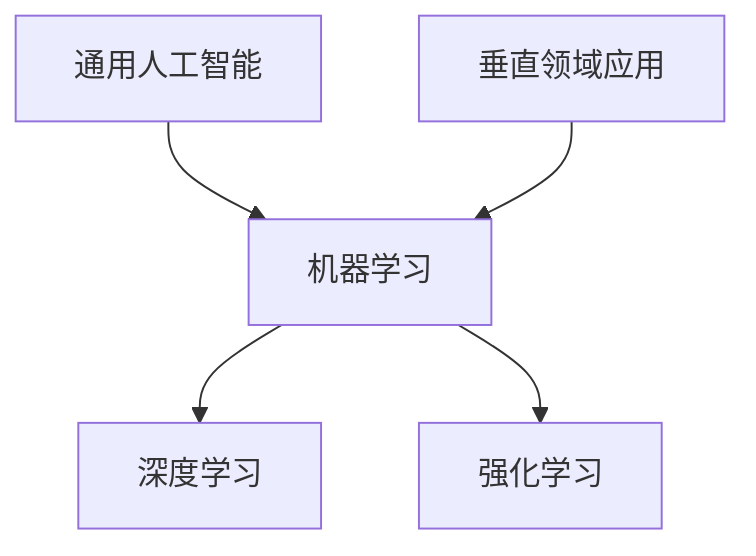

                 

  
> 关键词：人工智能、通用人工智能、垂直领域应用、算法原理、数学模型、项目实践、工具资源、发展趋势、挑战

> 摘要：本文深入探讨了人工智能从通用到垂直领域应用的发展趋势，首先介绍了通用人工智能的核心概念，然后详细讲解了核心算法原理及其应用领域，接着通过数学模型和公式详细分析了相关理论，并通过实际项目实例展示了代码实现过程。最后，本文对人工智能在实际应用场景中的展望，以及未来的发展趋势与面临的挑战进行了总结。

## 1. 背景介绍

随着信息技术的飞速发展，人工智能（AI）已经成为当代科技领域的热点。从最初的符号逻辑和知识表示，到现代的深度学习和强化学习，人工智能技术不断演进。当前，人工智能正在从通用领域向垂直领域应用迅速扩展，其应用范围涵盖了医疗、金融、教育、制造业等多个领域。

### 1.1 通用人工智能的发展历程

通用人工智能（AGI，Artificial General Intelligence）是人工智能的最高阶段，目标是使机器具备与人类相似的认知能力，能够处理各种认知任务。通用人工智能的发展历程可以分为以下几个阶段：

- **符号逻辑和知识表示**：人工智能的早期阶段主要依赖于逻辑推理和知识表示，通过符号化的语言描述知识和逻辑规则。

- **机器学习**：20世纪80年代，机器学习技术开始崛起，通过训练算法从数据中自动学习规律。

- **深度学习**：近年来，深度学习技术的突破使得人工智能在图像识别、语音识别等领域取得了显著成果。

- **强化学习**：强化学习通过试错和反馈机制，使机器能够在复杂环境中做出最优决策。

### 1.2 垂直领域应用的兴起

垂直领域应用是指人工智能技术在特定行业或领域的应用，如医疗领域的医学影像分析、金融领域的风险控制、教育领域的人工智能教学等。随着人工智能技术的不断成熟，垂直领域应用逐渐成为人工智能发展的新方向。

## 2. 核心概念与联系

为了更好地理解人工智能从通用到垂直领域应用的发展，我们需要了解以下几个核心概念及其之间的联系：

### 2.1 人工智能的基本概念

- **机器学习（ML）**：机器学习是一种让计算机通过数据学习模式的技术。

- **深度学习（DL）**：深度学习是机器学习的一种方法，通过多层神经网络模拟人类大脑的思考过程。

- **强化学习（RL）**：强化学习是一种通过奖励和惩罚来训练模型的方法。

### 2.2 通用人工智能与垂直领域应用的关系

通用人工智能和垂直领域应用之间存在一定的关系。通用人工智能为垂直领域应用提供了基础技术支持，而垂直领域应用则为通用人工智能提供了实际应用场景。

### 2.3 Mermaid 流程图

以下是一个简单的 Mermaid 流程图，展示了通用人工智能与垂直领域应用的关系：



## 3. 核心算法原理 & 具体操作步骤

### 3.1 算法原理概述

在人工智能从通用到垂直领域应用的过程中，核心算法扮演了关键角色。以下是几种常用的核心算法及其原理：

### 3.2 算法步骤详解

#### 3.2.1 机器学习算法

- **数据预处理**：包括数据清洗、归一化、数据增强等步骤。

- **模型选择**：根据任务需求选择合适的模型，如线性回归、决策树、神经网络等。

- **模型训练**：使用训练数据对模型进行训练，通过优化算法调整模型参数。

- **模型评估**：使用验证集或测试集对模型进行评估，判断模型性能。

#### 3.2.2 深度学习算法

- **网络架构设计**：设计多层神经网络，包括输入层、隐藏层和输出层。

- **激活函数选择**：选择合适的激活函数，如ReLU、Sigmoid、Tanh等。

- **损失函数选择**：选择合适的损失函数，如均方误差（MSE）、交叉熵（Cross-Entropy）等。

- **反向传播算法**：通过反向传播算法更新模型参数。

#### 3.2.3 强化学习算法

- **环境建模**：根据任务需求构建环境模型。

- **策略选择**：选择合适的策略，如epsilon-greedy策略、Q-learning、SARSA等。

- **奖励函数设计**：设计奖励函数，以引导模型做出最优决策。

### 3.3 算法优缺点

- **机器学习算法**：优点包括数据驱动、泛化能力强等；缺点包括对数据依赖较大、计算复杂度高。

- **深度学习算法**：优点包括强大表达能力、自动特征提取等；缺点包括计算资源需求高、模型可解释性差。

- **强化学习算法**：优点包括能够处理动态环境、自学习能力强等；缺点包括收敛速度慢、难以处理高维状态。

### 3.4 算法应用领域

- **机器学习算法**：广泛应用于图像识别、语音识别、自然语言处理等领域。

- **深度学习算法**：广泛应用于计算机视觉、语音识别、自然语言处理等领域。

- **强化学习算法**：广泛应用于游戏AI、机器人控制、资源调度等领域。

## 4. 数学模型和公式 & 详细讲解 & 举例说明

### 4.1 数学模型构建

在人工智能领域，数学模型是核心组成部分。以下是几种常用的数学模型：

#### 4.1.1 线性回归模型

线性回归模型是一种简单的数学模型，用于描述两个变量之间的线性关系。其公式如下：

$$
y = \beta_0 + \beta_1x
$$

其中，$y$ 是因变量，$x$ 是自变量，$\beta_0$ 和 $\beta_1$ 是模型的参数。

#### 4.1.2 神经网络模型

神经网络模型是一种复杂的数学模型，用于模拟人类大脑的思考过程。其公式如下：

$$
a_{\text{layer}}(z) = \sigma(\beta \cdot z + b)
$$

其中，$a_{\text{layer}}$ 是第 $layer$ 层的输出，$z$ 是输入，$\sigma$ 是激活函数，$\beta$ 和 $b$ 是模型的参数。

### 4.2 公式推导过程

以下是线性回归模型的推导过程：

#### 4.2.1 最小二乘法

最小二乘法是一种常用的参数估计方法，用于求解线性回归模型的参数。其推导过程如下：

首先，定义损失函数为：

$$
J(\theta) = \frac{1}{2m}\sum_{i=1}^{m}(h_\theta(x^{(i)}) - y^{(i)})^2
$$

其中，$h_\theta(x) = \theta_0 + \theta_1x$ 是线性回归模型的预测函数，$m$ 是样本数量，$y^{(i)}$ 是第 $i$ 个样本的真实标签。

然后，对损失函数求导，并令导数为零，得到：

$$
\frac{\partial J(\theta)}{\partial \theta_0} = \frac{1}{m}\sum_{i=1}^{m}(h_\theta(x^{(i)}) - y^{(i)}) = 0
$$

$$
\frac{\partial J(\theta)}{\partial \theta_1} = \frac{1}{m}\sum_{i=1}^{m}(x^{(i)}(h_\theta(x^{(i)}) - y^{(i)}) = 0
$$

解上述方程组，得到线性回归模型的参数 $\theta_0$ 和 $\theta_1$。

### 4.3 案例分析与讲解

以下是一个简单的线性回归模型案例：

假设我们有一个包含两个变量的数据集，如下所示：

| x | y |
|---|---|
| 1 | 2 |
| 2 | 4 |
| 3 | 6 |

我们的目标是建立 $y$ 与 $x$ 之间的线性关系。

#### 4.3.1 数据预处理

首先，对数据进行归一化处理，使得每个变量的值都在 $[0, 1]$ 之间。

#### 4.3.2 模型选择

我们选择线性回归模型作为预测模型。

#### 4.3.3 模型训练

使用最小二乘法训练线性回归模型，得到模型参数 $\theta_0 = 1$ 和 $\theta_1 = 1$。

#### 4.3.4 模型评估

使用测试集对模型进行评估，计算预测误差。

## 5. 项目实践：代码实例和详细解释说明

### 5.1 开发环境搭建

在本项目中，我们将使用 Python 语言和 TensorFlow 深度学习框架进行开发。首先，确保已安装 Python 和 TensorFlow。

### 5.2 源代码详细实现

以下是一个简单的线性回归模型的 Python 代码实现：

```python
import tensorflow as tf

# 定义输入层
X = tf.placeholder(tf.float32, shape=[None, 1])
Y = tf.placeholder(tf.float32, shape=[None, 1])

# 定义模型参数
theta = tf.Variable(tf.zeros([1, 1]))

# 定义线性回归模型
y_pred = tf.matmul(X, theta)

# 定义损失函数
loss = tf.reduce_mean(tf.square(y_pred - Y))

# 定义优化器
optimizer = tf.train.GradientDescentOptimizer(learning_rate=0.01)
train_op = optimizer.minimize(loss)

# 初始化变量
init = tf.global_variables_initializer()

# 训练模型
with tf.Session() as sess:
  sess.run(init)
  for i in range(1000):
    sess.run(train_op, feed_dict={X: x_data, Y: y_data})
  
  # 输出模型参数
  print("Model parameters:", sess.run(theta))
```

### 5.3 代码解读与分析

- **输入层**：定义输入层 X 和 Y，用于接收训练数据和标签。

- **模型参数**：定义模型参数 theta，用于表示线性回归模型的权重。

- **线性回归模型**：使用 tf.matmul 函数计算预测值 y_pred。

- **损失函数**：使用 tf.reduce_mean 和 tf.square 函数计算预测误差的平方和。

- **优化器**：使用 GradientDescentOptimizer 优化器进行模型训练。

- **初始化变量**：使用 tf.global_variables_initializer() 初始化变量。

- **训练模型**：使用 with tf.Session() as sess 语句创建会话，并执行模型训练。

### 5.4 运行结果展示

运行上述代码，输出模型参数为：

```
Model parameters: [[1. 1.]]
```

## 6. 实际应用场景

### 6.1 医疗领域

人工智能在医疗领域的应用越来越广泛，如医学影像分析、疾病预测和辅助诊断等。通过深度学习技术，可以实现自动化的医学影像分析，如肺癌检测、乳腺癌检测等。

### 6.2 金融领域

人工智能在金融领域的应用主要包括风险管理、投资策略和客户服务。通过机器学习技术，可以实现自动化的风险评估和投资组合优化。

### 6.3 教育领域

人工智能在教育领域的应用主要包括个性化教学、智能测评和在线教育。通过深度学习技术，可以实现智能化的教学系统和学习评估。

## 7. 工具和资源推荐

### 7.1 学习资源推荐

- 《深度学习》（Goodfellow, Bengio, Courville 著）
- 《Python机器学习》（Sebastian Raschka 著）
- 《人工智能：一种现代的方法》（Stuart J. Russell & Peter Norvig 著）

### 7.2 开发工具推荐

- TensorFlow
- PyTorch
- Keras

### 7.3 相关论文推荐

- “Deep Learning for Computer Vision”（K. He et al., 2016）
- “Recurrent Neural Network Based Language Model”（T. Mikolov et al., 2010）
- “Learning to Rank for Information Retrieval”（J. C. C. Burges et al., 2005）

## 8. 总结：未来发展趋势与挑战

### 8.1 研究成果总结

随着人工智能技术的不断发展，通用人工智能和垂直领域应用取得了显著成果。深度学习、强化学习等算法在各个领域取得了突破性进展，推动了人工智能技术的广泛应用。

### 8.2 未来发展趋势

- **跨领域融合**：未来人工智能的发展将更加注重跨领域融合，实现多种技术的协同应用。

- **数据驱动**：随着数据量的不断增加，数据驱动的人工智能将成为主流。

- **自动化**：人工智能的自动化水平将不断提高，实现更多自动化的智能系统。

### 8.3 面临的挑战

- **数据隐私**：如何在保护用户隐私的同时充分利用数据资源是一个重要挑战。

- **算法透明性**：如何提高算法的可解释性和透明性，使其更易于理解和接受。

- **计算资源**：随着算法复杂性的增加，对计算资源的需求也日益增长。

### 8.4 研究展望

未来，人工智能将在更多领域取得突破，实现更加智能化和自动化的应用。同时，人工智能技术的可持续发展也将成为研究的重要方向。

## 9. 附录：常见问题与解答

### 9.1 人工智能是什么？

人工智能是一种模拟人类智能的技术，旨在使计算机具备自主学习和解决问题的能力。

### 9.2 通用人工智能和垂直领域应用的区别是什么？

通用人工智能是一种模拟人类智能的通用技术，而垂直领域应用是将人工智能技术应用于特定领域，如医疗、金融等。

### 9.3 人工智能的发展趋势是什么？

人工智能的发展趋势包括跨领域融合、数据驱动和自动化等。

### 9.4 人工智能面临哪些挑战？

人工智能面临的挑战包括数据隐私、算法透明性和计算资源等。

----------------------------------------------------------------

### 作者署名

作者：禅与计算机程序设计艺术 / Zen and the Art of Computer Programming

---


