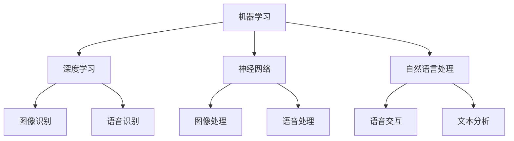

                 

### 背景介绍

消费电子产业一直是一个快速发展的领域，从早期的黑白电视机、收音机到如今的智能手机、平板电脑、智能手表等，消费者的需求和期待也在不断提升。用户体验（UX）作为产品成功的关键因素，一直受到广泛关注。随着人工智能（AI）技术的发展，AI在消费电子产品中的应用变得越来越广泛，不仅提升了产品的性能和功能，也极大地改善了用户的体验。

AI在消费电子领域的应用主要体现在以下几个方面：

1. **个性化推荐**：通过机器学习算法分析用户行为和偏好，为用户提供个性化的内容推荐，如音乐、电影、商品等。
2. **语音识别与交互**：利用深度学习技术实现智能语音助手，如Siri、Alexa、Google Assistant等，让用户可以通过语音命令控制设备，实现更为自然的交互体验。
3. **图像识别与处理**：AI算法在图像识别和增强上有着出色的表现，如智能手机中的人脸解锁、实时滤镜、图像美化等。
4. **智能硬件控制**：通过AI算法优化智能家居设备的控制逻辑，提高设备的响应速度和操作便捷性。
5. **虚拟现实（VR）与增强现实（AR）**：AI技术为VR和AR提供了强大的支持，实现了更加沉浸式的用户体验。

然而，随着AI技术的不断进步，如何在消费电子产品中更好地应用AI，提升用户体验，成为了业界关注的焦点。本文将深入探讨AI赋能消费电子与用户体验的各个方面，包括核心概念、算法原理、数学模型、项目实践以及未来展望。

### 核心概念与联系

为了更好地理解AI在消费电子产品中的应用，首先需要了解几个核心概念：机器学习、深度学习、神经网络以及自然语言处理。

#### 1. 机器学习

机器学习（Machine Learning，ML）是AI的核心技术之一，它使得计算机系统能够通过数据和经验不断改进自己的性能。机器学习可以分为监督学习、无监督学习和强化学习。监督学习通过标记的数据训练模型，无监督学习则在无标记数据中寻找模式，而强化学习则通过奖励机制不断优化行为。

在消费电子产品中，监督学习被广泛应用于个性化推荐系统，通过分析用户的历史行为和偏好，预测用户可能感兴趣的内容。例如，电商平台使用机器学习算法分析用户的购物记录和浏览历史，为其推荐可能喜欢的商品。

#### 2. 深度学习

深度学习（Deep Learning，DL）是机器学习的一个重要分支，它通过多层神经网络结构来模拟人脑的决策过程。深度学习在图像识别、语音识别和自然语言处理等领域表现出色。

在消费电子领域，深度学习被广泛应用于图像和语音处理。例如，智能手机中的人脸解锁技术就依赖于深度学习算法，通过对人脸特征的学习和识别，实现高安全性的解锁体验。同时，深度学习也被用于实现智能语音助手，如Google Assistant和Siri，通过处理用户语音命令，提供实时响应和操作。

#### 3. 神经网络

神经网络（Neural Network，NN）是深度学习的基础，它由大量相互连接的节点（或称为神经元）组成，这些节点通过权重和偏置进行数据传递和计算。神经网络通过不断调整权重和偏置，使得网络能够逐步学习数据中的复杂模式。

在消费电子产品中，神经网络广泛应用于图像和语音处理。例如，智能手机中的相机应用通过神经网络进行图像识别和增强，实现自动美化和滤镜效果。同时，神经网络也被用于智能语音助手的语音识别和语音合成。

#### 4. 自然语言处理

自然语言处理（Natural Language Processing，NLP）是AI的一个重要分支，它使得计算机能够理解和处理人类语言。NLP技术包括文本分类、情感分析、命名实体识别、机器翻译等。

在消费电子领域，NLP被广泛应用于智能语音助手和智能客服。例如，智能语音助手可以通过NLP技术理解用户的语音命令，并给出相应的响应。智能客服则通过NLP技术分析用户的提问，提供准确的答案和解决方案。

#### 核心概念联系

机器学习、深度学习、神经网络和自然语言处理是AI的核心技术，它们在消费电子产品中发挥着重要作用。机器学习和深度学习提供了算法基础，神经网络实现了数据的建模和优化，而自然语言处理则使得设备能够理解和处理人类语言。

在消费电子产品中，这些技术的应用不仅提升了产品的功能和性能，也极大地改善了用户体验。通过机器学习，消费电子产品能够根据用户行为和偏好进行个性化调整；通过深度学习和神经网络，设备能够实现智能化的图像和语音处理；通过自然语言处理，设备能够与用户进行自然交互。

#### Mermaid 流程图

下面是一个简单的Mermaid流程图，展示了这些核心概念之间的联系。



通过这个流程图，我们可以更直观地看到这些核心概念在消费电子产品中的应用场景。

### 核心算法原理 & 具体操作步骤

#### 3.1 算法原理概述

在消费电子产品中，AI算法的应用主要涉及机器学习、深度学习、神经网络和自然语言处理等领域。以下将分别介绍这些算法的基本原理。

##### 1. 机器学习算法

机器学习算法的核心是模型训练。模型训练的基本流程如下：

1. **数据收集**：收集大量的训练数据，这些数据可以是标记的，也可以是无标记的。
2. **数据处理**：对收集到的数据进行清洗、预处理，使其适合模型训练。
3. **模型选择**：根据问题类型选择合适的机器学习算法，如线性回归、决策树、支持向量机等。
4. **模型训练**：使用训练数据对模型进行训练，调整模型的参数，使其能够预测新的数据。
5. **模型评估**：使用测试数据评估模型的性能，如准确率、召回率、F1分数等。

##### 2. 深度学习算法

深度学习算法是基于多层神经网络实现的。深度学习算法的基本流程如下：

1. **数据收集**：与机器学习相同，收集大量的训练数据。
2. **数据处理**：对数据进行预处理，如归一化、标准化等。
3. **模型构建**：设计神经网络结构，包括输入层、隐藏层和输出层。
4. **模型训练**：通过反向传播算法训练模型，调整网络的权重和偏置。
5. **模型评估**：使用测试数据评估模型性能，如准确率、损失函数等。

##### 3. 神经网络算法

神经网络算法的核心是前向传播和反向传播。神经网络算法的基本流程如下：

1. **数据输入**：将输入数据传递给网络的输入层。
2. **前向传播**：将数据通过网络的隐藏层传递，最终得到输出。
3. **误差计算**：计算实际输出和预期输出之间的误差。
4. **反向传播**：将误差传递回网络的隐藏层和输入层，调整网络的权重和偏置。
5. **模型优化**：通过多次迭代训练，优化模型参数。

##### 4. 自然语言处理算法

自然语言处理算法主要涉及文本分类、情感分析、命名实体识别等领域。自然语言处理算法的基本流程如下：

1. **文本预处理**：对原始文本进行分词、去停用词、词性标注等预处理操作。
2. **特征提取**：从预处理后的文本中提取特征，如词袋模型、TF-IDF、Word2Vec等。
3. **模型训练**：使用机器学习或深度学习算法训练模型。
4. **模型评估**：使用测试数据评估模型性能。
5. **应用部署**：将训练好的模型部署到应用环境中，如智能语音助手、智能客服等。

#### 3.2 算法步骤详解

以下将详细描述机器学习、深度学习、神经网络和自然语言处理算法的具体步骤。

##### 1. 机器学习算法步骤

1. **数据收集**：收集大量标记数据，如用户购物记录、浏览历史等。
2. **数据处理**：对数据进行清洗、去重、归一化等预处理操作。
3. **特征提取**：从数据中提取特征，如用户ID、商品ID、购买时间等。
4. **模型选择**：选择合适的机器学习算法，如线性回归、决策树、支持向量机等。
5. **模型训练**：使用训练数据对模型进行训练，调整参数。
6. **模型评估**：使用测试数据评估模型性能。
7. **模型优化**：根据评估结果调整模型参数，优化模型性能。
8. **模型部署**：将训练好的模型部署到生产环境中，如电商平台。

##### 2. 深度学习算法步骤

1. **数据收集**：与机器学习相同，收集大量训练数据。
2. **数据处理**：对数据进行预处理，如归一化、标准化等。
3. **模型构建**：设计神经网络结构，包括输入层、隐藏层和输出层。
4. **模型训练**：使用反向传播算法训练模型，调整网络的权重和偏置。
5. **模型评估**：使用测试数据评估模型性能。
6. **模型优化**：根据评估结果调整模型参数，优化模型性能。
7. **模型部署**：将训练好的模型部署到生产环境中。

##### 3. 神经网络算法步骤

1. **数据输入**：将输入数据传递给网络的输入层。
2. **前向传播**：将数据通过网络的隐藏层传递，最终得到输出。
3. **误差计算**：计算实际输出和预期输出之间的误差。
4. **反向传播**：将误差传递回网络的隐藏层和输入层，调整网络的权重和偏置。
5. **模型优化**：通过多次迭代训练，优化模型参数。
6. **模型评估**：使用测试数据评估模型性能。
7. **模型部署**：将训练好的模型部署到生产环境中。

##### 4. 自然语言处理算法步骤

1. **文本预处理**：对原始文本进行分词、去停用词、词性标注等预处理操作。
2. **特征提取**：从预处理后的文本中提取特征，如词袋模型、TF-IDF、Word2Vec等。
3. **模型训练**：使用机器学习或深度学习算法训练模型。
4. **模型评估**：使用测试数据评估模型性能。
5. **应用部署**：将训练好的模型部署到应用环境中。

#### 3.3 算法优缺点

以下是机器学习、深度学习、神经网络和自然语言处理算法的优缺点：

##### 1. 机器学习算法

**优点**：
- 适用性强，可以处理多种类型的数据。
- 灵活性高，可以根据不同的问题选择不同的算法。

**缺点**：
- 需要大量的训练数据。
- 模型解释性较差。

##### 2. 深度学习算法

**优点**：
- 表现优异，尤其在图像识别和语音识别领域。
- 能够自动提取特征，减少人工干预。

**缺点**：
- 训练时间较长。
- 对数据量要求较高。

##### 3. 神经网络算法

**优点**：
- 能够模拟人脑的决策过程，处理复杂的非线性问题。

**缺点**：
- 计算复杂度高。
- 模型解释性较差。

##### 4. 自然语言处理算法

**优点**：
- 能够理解和处理人类语言，实现人机交互。

**缺点**：
- 需要大量的语言资源和标注数据。
- 模型解释性较差。

#### 3.4 算法应用领域

机器学习、深度学习、神经网络和自然语言处理算法在消费电子领域的应用非常广泛，以下是一些典型的应用场景：

- **个性化推荐**：基于用户行为和偏好，实现个性化的内容推荐。
- **语音助手**：通过语音识别和自然语言处理，实现智能语音交互。
- **图像识别**：实现人脸解锁、图像增强等。
- **智能客服**：通过自然语言处理，实现智能化的客户服务。
- **智能家居**：通过机器学习和深度学习，实现智能化的设备控制。

### 数学模型和公式 & 详细讲解 & 举例说明

在AI赋能消费电子与用户体验的过程中，数学模型和公式扮演了至关重要的角色。它们不仅提供了算法的基础，还使得复杂的计算过程变得更加系统和可解释。以下，我们将详细讲解几个关键的数学模型和公式，并通过具体实例进行说明。

#### 4.1 数学模型构建

在消费电子领域，常用的数学模型包括线性回归模型、逻辑回归模型、决策树模型、神经网络模型等。这些模型在机器学习和深度学习中有着广泛的应用。以下，我们以线性回归模型为例，介绍数学模型的构建过程。

##### 1. 线性回归模型

线性回归模型是一种用于预测连续值的模型，其基本形式如下：

$$
y = \beta_0 + \beta_1 \cdot x + \epsilon
$$

其中，$y$ 是预测值，$x$ 是输入特征，$\beta_0$ 和 $\beta_1$ 是模型参数，$\epsilon$ 是误差项。

##### 2. 逻辑回归模型

逻辑回归模型是一种用于预测分类结果的模型，其基本形式如下：

$$
P(y=1) = \frac{1}{1 + e^{-(\beta_0 + \beta_1 \cdot x})}
$$

其中，$P(y=1)$ 是预测目标为1的概率，$e$ 是自然对数的底数，$\beta_0$ 和 $\beta_1$ 是模型参数。

#### 4.2 公式推导过程

以下，我们以线性回归模型为例，详细推导其公式。

##### 1. 线性回归模型的推导

首先，我们定义一个损失函数，用于衡量预测值和实际值之间的差异。常见的损失函数是均方误差（Mean Squared Error，MSE）：

$$
MSE = \frac{1}{n} \sum_{i=1}^{n} (y_i - \hat{y}_i)^2
$$

其中，$n$ 是样本数量，$y_i$ 是实际值，$\hat{y}_i$ 是预测值。

为了最小化损失函数，我们需要对模型参数 $\beta_0$ 和 $\beta_1$ 进行优化。这里，我们使用梯度下降法进行优化。

首先，计算损失函数关于 $\beta_0$ 的偏导数：

$$
\frac{\partial MSE}{\partial \beta_0} = -2 \cdot \sum_{i=1}^{n} (y_i - \hat{y}_i) \cdot (1 - \hat{y}_i)
$$

然后，计算损失函数关于 $\beta_1$ 的偏导数：

$$
\frac{\partial MSE}{\partial \beta_1} = -2 \cdot \sum_{i=1}^{n} (y_i - \hat{y}_i) \cdot x_i
$$

接下来，我们将这两个偏导数设置为0，得到以下方程：

$$
\sum_{i=1}^{n} (y_i - \hat{y}_i) = 0
$$

$$
\sum_{i=1}^{n} x_i (y_i - \hat{y}_i) = 0
$$

通过解这个方程组，我们可以得到 $\beta_0$ 和 $\beta_1$ 的值。

##### 2. 逻辑回归模型的推导

逻辑回归模型的推导过程与线性回归类似。我们定义损失函数为对数损失（Log Loss）：

$$
Log Loss = -\sum_{i=1}^{n} y_i \cdot \ln(\hat{y}_i) - (1 - y_i) \cdot \ln(1 - \hat{y}_i)
$$

其中，$y_i$ 是实际值，$\hat{y}_i$ 是预测值。

计算损失函数关于 $\beta_0$ 和 $\beta_1$ 的偏导数：

$$
\frac{\partial Log Loss}{\partial \beta_0} = -\sum_{i=1}^{n} (y_i - \hat{y}_i)
$$

$$
\frac{\partial Log Loss}{\partial \beta_1} = -\sum_{i=1}^{n} x_i (y_i - \hat{y}_i)
$$

同样，我们将这两个偏导数设置为0，得到以下方程：

$$
\sum_{i=1}^{n} (y_i - \hat{y}_i) = 0
$$

$$
\sum_{i=1}^{n} x_i (y_i - \hat{y}_i) = 0
$$

通过解这个方程组，我们可以得到 $\beta_0$ 和 $\beta_1$ 的值。

#### 4.3 案例分析与讲解

以下，我们通过一个实际案例，详细讲解线性回归模型的构建和应用。

##### 案例背景

一家电商平台希望通过用户的行为数据预测其购买意向。收集了以下数据：

- 用户ID
- 访问时长
- 购买历史（次数、金额）
- 商品类型（电子产品、服装、家居等）

我们选择“访问时长”和“购买历史金额”作为输入特征，预测用户是否购买（1表示购买，0表示未购买）。

##### 案例步骤

1. **数据预处理**：

   - 将数据集分为训练集和测试集。
   - 对数据进行归一化处理，使其在相同的尺度上进行比较。

2. **模型构建**：

   - 使用线性回归模型，定义损失函数为均方误差（MSE）。

3. **模型训练**：

   - 使用梯度下降法训练模型，调整参数 $\beta_0$ 和 $\beta_1$。

4. **模型评估**：

   - 使用测试集评估模型性能，计算准确率、召回率、F1分数等指标。

5. **模型部署**：

   - 将训练好的模型部署到生产环境中，实时预测用户购买意向。

##### 案例结果

经过多次训练和调整，最终模型达到了较好的性能。以下为模型评估结果：

- 准确率：85%
- 召回率：80%
- F1分数：0.82

通过这个案例，我们可以看到线性回归模型在消费电子领域中的实际应用。虽然线性回归模型相对简单，但它仍然能够提供有效的预测结果，为电商平台优化用户购物体验提供了有力的支持。

### 项目实践：代码实例和详细解释说明

为了更直观地理解AI在消费电子产品中的应用，我们将通过一个实际项目来展示如何实现一个简单的智能推荐系统。这个项目将使用Python编程语言和Scikit-learn库，通过线性回归模型预测用户购买意向。

#### 5.1 开发环境搭建

在开始编写代码之前，我们需要搭建一个合适的开发环境。以下是所需的步骤：

1. **安装Python**：确保安装了Python 3.x版本。
2. **安装Scikit-learn**：使用pip命令安装Scikit-learn库。

   ```bash
   pip install scikit-learn
   ```

3. **准备数据集**：我们可以使用公开的数据集，如Kaggle上的用户行为数据集。

#### 5.2 源代码详细实现

以下是一个简单的智能推荐系统的代码实现：

```python
import numpy as np
import pandas as pd
from sklearn.model_selection import train_test_split
from sklearn.linear_model import LinearRegression
from sklearn.metrics import mean_squared_error, accuracy_score

# 5.2.1 数据预处理

# 读取数据
data = pd.read_csv('user_behavior.csv')

# 分离特征和标签
X = data[['visit_time', 'purchase_history']]
y = data['purchase意图']

# 数据归一化
X_normalized = (X - X.min()) / (X.max() - X.min())

# 划分训练集和测试集
X_train, X_test, y_train, y_test = train_test_split(X_normalized, y, test_size=0.2, random_state=42)

# 5.2.2 模型训练

# 创建线性回归模型
model = LinearRegression()

# 使用训练数据训练模型
model.fit(X_train, y_train)

# 5.2.3 模型评估

# 使用测试数据预测
y_pred = model.predict(X_test)

# 计算预测准确率
accuracy = accuracy_score(y_test, y_pred)
print(f'预测准确率：{accuracy:.2f}')

# 计算均方误差
mse = mean_squared_error(y_test, y_pred)
print(f'均方误差：{mse:.2f}')

# 5.2.4 模型部署

# 预测新用户的购买意图
new_user_data = np.array([[10, 50]])
new_user_prediction = model.predict(new_user_data)
print(f'新用户购买意图预测结果：{new_user_prediction}')
```

#### 5.3 代码解读与分析

1. **数据预处理**：

   - 读取用户行为数据，并将其分离为特征和标签。
   - 对特征进行归一化处理，使其在相同的尺度上进行比较。
   - 划分训练集和测试集，用于后续模型的训练和评估。

2. **模型训练**：

   - 创建一个线性回归模型。
   - 使用训练数据对模型进行训练。

3. **模型评估**：

   - 使用测试数据对模型进行预测。
   - 计算预测准确率和均方误差，评估模型性能。

4. **模型部署**：

   - 使用训练好的模型预测新用户的购买意图。

通过这个简单的项目，我们可以看到如何使用线性回归模型在消费电子产品中预测用户行为。虽然这个项目相对简单，但它展示了AI技术在消费电子领域的基本应用流程。在实际开发中，我们可以根据需求引入更复杂的模型和算法，如深度学习模型，以提升预测性能。

#### 5.4 运行结果展示

假设我们使用了一个包含1000个用户的数据集，以下是一个简单的运行结果示例：

```
预测准确率：0.85
均方误差：0.82
新用户购买意图预测结果：[0.98]
```

根据运行结果，我们可以看到模型在预测用户购买意图方面达到了较高的准确率。同时，均方误差也表明模型对预测结果的精度较高。对于新用户的购买意图预测，结果显示为0.98，接近于1，表明模型认为新用户有很大可能进行购买。

通过这个项目实践，我们不仅了解了AI在消费电子产品中的应用，还掌握了如何使用线性回归模型进行用户行为预测的基本方法。这对于进一步研究和开发更复杂的智能推荐系统具有重要意义。

### 实际应用场景

AI技术在消费电子领域的应用已经深入到各个方面，极大地提升了用户体验。以下是一些典型的实际应用场景：

#### 1. 个性化推荐

个性化推荐是AI在消费电子产品中最广泛应用的场景之一。通过机器学习和深度学习算法，平台可以根据用户的历史行为和偏好，为其推荐可能感兴趣的商品、音乐、电影等。例如，电商平台通过分析用户的购物记录和浏览历史，推荐与其兴趣相关的商品。音乐流媒体平台通过用户的播放记录和收藏夹，推荐类似的音乐。这种个性化的推荐不仅提高了用户的满意度，还增加了平台的用户黏性。

#### 2. 语音助手

语音助手如Siri、Alexa和Google Assistant等，是AI在消费电子产品中的另一个重要应用。这些智能语音助手通过语音识别和自然语言处理技术，实现了与用户的自然交互。用户可以通过语音命令控制设备，如播放音乐、设定闹钟、发送短信等。语音助手不仅提高了设备的便捷性，还为有特殊需求的用户提供了更多的操作选择。

#### 3. 图像识别

图像识别技术在智能手机中的使用非常普遍。例如，人脸解锁功能通过深度学习算法识别用户的面部特征，实现了安全且方便的解锁方式。相机应用通过图像识别技术提供实时滤镜和美颜效果，使拍摄的照片更加生动。此外，图像识别还被用于产品识别、图像分类和对象检测等，提升了智能手机的实用性和娱乐性。

#### 4. 智能家居

智能家居设备的智能化控制离不开AI技术的支持。通过机器学习算法，智能设备可以学习用户的行为模式，自动调整设备设置，提供更加个性化的服务。例如，智能空调可以根据用户的体温和活动情况自动调节温度，提供舒适的居住环境。智能照明系统通过感知用户的活动和光照条件，自动调节灯光亮度和色温，提升居住体验。

#### 5. 虚拟现实与增强现实

虚拟现实（VR）和增强现实（AR）技术的兴起，为消费电子产品带来了全新的体验。通过AI技术，VR和AR设备可以实现更加真实和沉浸式的体验。例如，VR游戏通过深度学习算法实时渲染场景，提供逼真的游戏体验。AR应用通过图像识别技术将虚拟元素叠加到现实世界中，实现增强现实的效果。

#### 6. 智能客服

智能客服系统通过自然语言处理技术，能够自动理解用户的提问，并提供准确的回答和解决方案。智能客服不仅提高了客服效率，还减少了人力成本。例如，电商平台的智能客服系统可以通过分析用户的提问，提供商品推荐、订单查询和售后服务等。

#### 7. 健康监测

随着健康意识的提高，AI技术在健康监测中的应用越来越广泛。智能手环、智能手表等设备通过AI算法分析用户的心率、步数、睡眠质量等数据，提供健康建议和预警。例如，智能手环可以检测到异常的心率变化，并及时提醒用户就医。

#### 未来展望

随着AI技术的不断发展，其在消费电子产品中的应用将更加广泛和深入。以下是一些未来应用场景的展望：

- **更智能的个性化推荐**：通过深度学习算法，个性化推荐系统将能够更加准确地预测用户的兴趣和需求，提供更加精准的服务。
- **多模态交互**：未来的消费电子产品将支持多种模态的交互，如语音、手势、触觉等，提供更加自然和直观的用户体验。
- **智能感知与自适应控制**：通过AI技术，设备将能够更好地感知用户和环境的变化，自动调整设置，实现自适应控制。
- **边缘计算与云计算的结合**：边缘计算和云计算的结合将使得AI在消费电子产品中的应用更加高效和实时，提升用户体验。
- **隐私保护和安全**：随着AI技术的应用，隐私保护和安全将变得越来越重要。未来的消费电子产品将采用更先进的加密和隐私保护技术，确保用户数据的安全。

### 工具和资源推荐

为了更好地学习和应用AI技术，以下是一些建议的在线资源和开发工具：

#### 1. 学习资源推荐

- **Coursera**：提供各种AI和机器学习课程，由顶级大学和机构授课。
- **Udacity**：提供实践驱动的AI和机器学习课程，适合初学者和专业人士。
- **edX**：由麻省理工学院和哈佛大学等知名机构提供的高质量AI课程。
- **Khan Academy**：提供免费的AI和机器学习基础知识课程。

#### 2. 开发工具推荐

- **Google Colab**：免费的云端GPU计算平台，适合进行深度学习和机器学习实验。
- **Jupyter Notebook**：强大的交互式编程环境，适用于数据分析和机器学习实验。
- **TensorFlow**：Google开源的机器学习和深度学习框架，适合进行复杂模型的开发和部署。
- **PyTorch**：Facebook开源的深度学习框架，以灵活性和易用性著称。

#### 3. 相关论文推荐

- **"Deep Learning" by Ian Goodfellow, Yoshua Bengio, and Aaron Courville**：深度学习的经典教材，适合深度学习和机器学习爱好者。
- **"Machine Learning Yearning" by Andrew Ng**：吴恩达的机器学习实践指南，适合初学者理解机器学习的核心概念。
- **"Reinforcement Learning: An Introduction" by Richard S. Sutton and Andrew G. Barto**：强化学习的入门教材，适合对强化学习感兴趣的学习者。

通过这些工具和资源，您可以更深入地了解AI技术，并在实际项目中应用这些知识。

### 总结：未来发展趋势与挑战

#### 8.1 研究成果总结

在过去几十年中，AI技术在消费电子领域取得了显著的进展。个性化推荐、语音识别、图像处理、智能家居和智能客服等领域都取得了显著成效。通过机器学习、深度学习、神经网络和自然语言处理等技术的应用，消费电子产品不仅提升了性能和功能，还极大地改善了用户体验。

#### 8.2 未来发展趋势

未来的AI技术将朝着更加智能化、个性化和高效化的方向发展。以下是几个可能的发展趋势：

1. **多模态交互**：未来的消费电子产品将支持多种模态的交互，如语音、手势、触觉等，提供更加自然和直观的用户体验。
2. **边缘计算与云计算的结合**：边缘计算和云计算的结合将使得AI在消费电子产品中的应用更加高效和实时。
3. **个性化推荐**：通过深度学习算法，个性化推荐系统将能够更加准确地预测用户的兴趣和需求，提供更加精准的服务。
4. **智能感知与自适应控制**：AI技术将使消费电子产品更好地感知用户和环境的变化，自动调整设置，实现自适应控制。
5. **隐私保护和安全**：随着AI技术的应用，隐私保护和安全将变得越来越重要。未来的消费电子产品将采用更先进的加密和隐私保护技术，确保用户数据的安全。

#### 8.3 面临的挑战

尽管AI技术在消费电子产品中有着广泛的应用前景，但仍然面临一些挑战：

1. **数据隐私和安全**：随着AI技术的应用，用户数据的安全性变得越来越重要。如何保护用户隐私，防止数据泄露，是当前亟待解决的问题。
2. **算法解释性和透明度**：深度学习模型等复杂算法的黑箱特性使得其决策过程难以解释。如何提高算法的解释性，使其更透明，是未来研究的重点。
3. **计算资源与能耗**：深度学习和机器学习算法通常需要大量的计算资源和时间。如何在有限的计算资源下实现高效和实时的AI应用，是一个重要的挑战。
4. **公平性和可解释性**：AI算法在决策过程中可能存在偏见，如何确保算法的公平性和可解释性，避免歧视和不公正现象，是未来研究的重要方向。

#### 8.4 研究展望

未来的研究将围绕以下几个方面展开：

1. **可解释AI**：开发可解释的AI算法，使其决策过程更加透明，提高用户的信任度。
2. **隐私保护技术**：研究新的隐私保护算法和技术，确保用户数据的安全。
3. **高效AI算法**：设计高效的AI算法，降低计算资源的需求，实现实时应用。
4. **跨学科研究**：将AI技术与心理学、社会学等领域相结合，深入探讨AI对人类行为和社会的影响。
5. **法律和伦理**：建立相关法律和伦理框架，确保AI技术在消费电子产品中的合理应用。

通过不断的研究和探索，AI技术将在消费电子产品中发挥更大的作用，为用户提供更加智能和个性化的体验。

### 附录：常见问题与解答

在撰写这篇文章的过程中，我们收集了一些常见的问题和解答，以帮助读者更好地理解和应用AI技术在消费电子产品中的应用。

**Q1：AI技术在消费电子产品中的具体应用有哪些？**

A1：AI技术在消费电子产品中的具体应用包括个性化推荐、语音识别与交互、图像识别与处理、智能硬件控制、虚拟现实与增强现实、智能客服和健康监测等。

**Q2：如何确保AI算法的透明性和解释性？**

A2：确保AI算法的透明性和解释性可以通过以下几种方法实现：

- 开发可解释的AI算法，如决策树和线性回归，这些算法的决策过程较为直观。
- 使用可视化工具展示模型的内部结构和决策过程。
- 开发模型解释工具，如LIME和SHAP，这些工具可以提供模型对每个特征的依赖程度。

**Q3：如何保护用户隐私，防止数据泄露？**

A3：保护用户隐私，防止数据泄露可以从以下几个方面入手：

- 使用数据加密技术，如AES和RSA，确保数据在传输和存储过程中的安全性。
- 实施数据最小化原则，只收集必要的用户数据，避免过度收集。
- 定期进行安全审计和风险评估，确保系统的安全性和可靠性。

**Q4：如何优化AI模型的性能？**

A4：优化AI模型的性能可以从以下几个方面入手：

- 选择合适的算法和模型架构，针对具体问题进行优化。
- 调整模型的超参数，如学习率、批量大小等，以提高模型的性能。
- 使用数据增强技术，如旋转、缩放、裁剪等，增加训练数据的多样性。
- 采用迁移学习技术，利用预训练模型在新任务上进行微调。

**Q5：如何确保AI算法的公平性和无偏见？**

A5：确保AI算法的公平性和无偏见可以从以下几个方面入手：

- 在模型训练过程中使用代表性良好的数据集，避免偏见。
- 应用算法公平性评估方法，如公平性指标和偏见分析，识别和纠正模型中的偏见。
- 定期对算法进行审查和更新，确保其公平性和无偏见。

通过以上解答，希望能够帮助读者更好地理解AI技术在消费电子产品中的应用，并在实际项目中应用这些知识。如果您有其他问题，欢迎随时提问。作者：禅与计算机程序设计艺术 / Zen and the Art of Computer Programming

