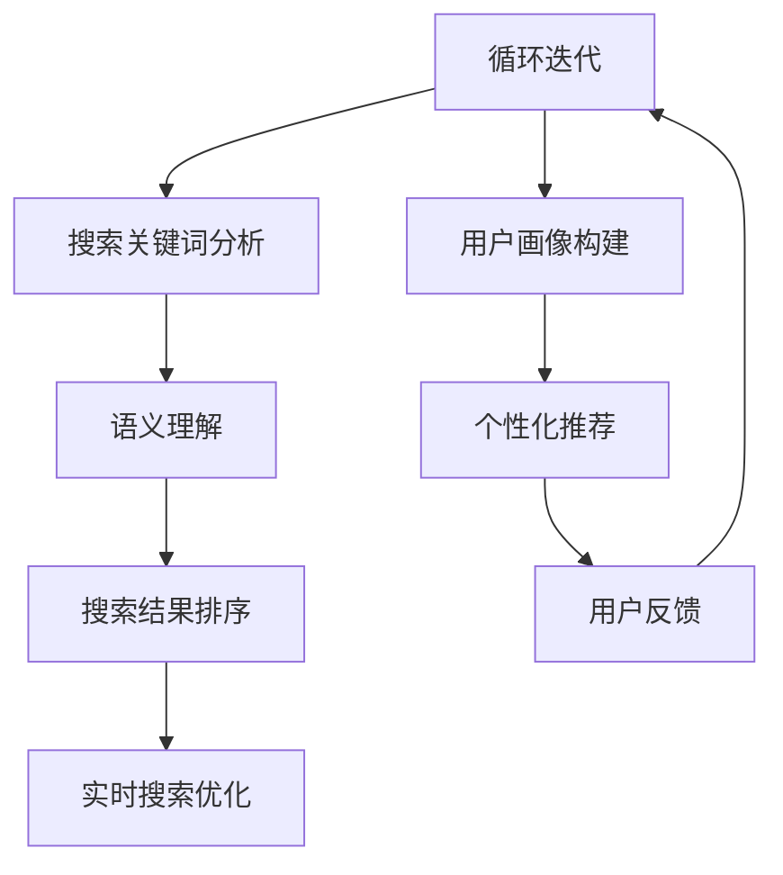

                 

关键词：AI、电商搜索、用户经验、转化率、实践案例

> 摘要：本文探讨了人工智能（AI）在电商搜索导购领域的应用，通过实际案例展示了AI技术如何通过个性化推荐、语义理解、实时搜索优化等手段，提升用户购物体验和电商平台转化率。

## 1. 背景介绍

### 1.1 电商搜索导购现状

电商行业经历了数十年的快速发展，消费者在电商平台上有了越来越多的选择。然而，这也带来了一个问题：如何在海量商品中快速找到符合用户需求的商品？

传统的电商搜索导购系统主要依赖于关键词匹配和分类导航，这种方式存在一定的局限性。首先，用户往往需要准确地知道他们要找的商品名称或类别，这限制了搜索的广度和深度。其次，基于关键词的搜索往往只能返回静态的结果，无法实时响应用户的需求变化。

### 1.2 人工智能助力电商搜索导购

随着人工智能技术的不断发展，AI开始在电商搜索导购领域展现出巨大的潜力。通过个性化推荐、语义理解、实时搜索优化等技术，AI能够更好地理解用户的需求，提供更加精准的搜索结果，从而提升用户购物体验和转化率。

## 2. 核心概念与联系

### 2.1 个性化推荐

个性化推荐是基于用户历史行为和偏好，为用户推荐他们可能感兴趣的商品。其核心在于通过分析用户的行为数据，如浏览记录、购买历史、收藏夹等，构建用户画像，从而实现精准推荐。

### 2.2 语义理解

语义理解是指让计算机理解和处理人类语言的技术。在电商搜索导购中，语义理解可以帮助系统更好地理解用户的搜索意图，从而提供更加准确的搜索结果。

### 2.3 实时搜索优化

实时搜索优化是通过实时分析用户行为和搜索数据，动态调整搜索算法和结果排序，以提升用户搜索体验。例如，当用户在搜索过程中输入关键词时，系统可以实时分析关键词的语义和上下文，提供更加相关的搜索建议。

### 2.4 Mermaid 流程图



## 3. 核心算法原理 & 具体操作步骤

### 3.1 算法原理概述

AI赋能电商搜索导购的核心算法主要包括：协同过滤算法、基于内容的推荐算法和深度学习算法。以下是这三种算法的简要概述：

#### 协同过滤算法

协同过滤算法是一种基于用户行为的推荐算法，通过分析用户之间的行为相似性，为用户推荐他们可能感兴趣的商品。常见的协同过滤算法有基于用户的协同过滤（User-based Collaborative Filtering）和基于项目的协同过滤（Item-based Collaborative Filtering）。

#### 基于内容的推荐算法

基于内容的推荐算法是一种基于商品特征的推荐算法，通过分析商品的内容特征，如标题、描述、标签等，为用户推荐他们可能感兴趣的商品。常见的基于内容的推荐算法有基于余弦相似度、基于TF-IDF等方法。

#### 深度学习算法

深度学习算法是一种基于神经网络的学习算法，通过模拟人脑的神经网络结构，实现自动特征提取和模式识别。在电商搜索导购中，深度学习算法可以用于图像识别、自然语言处理等任务，从而提升搜索和推荐的准确性。

### 3.2 算法步骤详解

以下是AI赋能电商搜索导购的具体操作步骤：

#### 步骤1：用户行为数据收集

收集用户在平台上的行为数据，如浏览记录、购买历史、搜索记录、评价等。这些数据将用于构建用户画像和个性化推荐。

#### 步骤2：用户画像构建

通过分析用户行为数据，构建用户画像。用户画像包括用户的基本信息、兴趣偏好、购买能力等维度，用于指导个性化推荐和搜索优化。

#### 步骤3：搜索关键词分析

分析用户输入的搜索关键词，理解其背后的语义和意图。通过语义分析，将搜索关键词转化为对应的商品类别和关键词。

#### 步骤4：搜索结果排序

根据用户画像和搜索关键词，利用协同过滤、基于内容的推荐算法和深度学习算法，为用户生成个性化的搜索结果。然后，根据用户的反馈和搜索行为，动态调整搜索结果排序，提升用户满意度。

#### 步骤5：实时搜索优化

实时分析用户的搜索行为和搜索结果，根据用户反馈和搜索行为，动态调整搜索算法和结果排序，以提升用户搜索体验。

### 3.3 算法优缺点

#### 协同过滤算法

优点：基于用户行为，能够提供个性化的推荐。

缺点：易受稀疏性和数据噪音的影响，准确性和多样性有限。

#### 基于内容的推荐算法

优点：基于商品特征，能够提供相关的推荐。

缺点：无法充分利用用户行为数据，个性化程度有限。

#### 深度学习算法

优点：能够自动提取特征，提高推荐和搜索的准确性。

缺点：训练过程复杂，对计算资源要求较高。

### 3.4 算法应用领域

AI赋能电商搜索导购的核心算法在多个领域有广泛的应用，如电子商务、在线教育、金融保险、医疗健康等。通过个性化推荐、语义理解、实时搜索优化等技术，AI能够为用户提供更加精准的服务，提升用户满意度。

## 4. 数学模型和公式 & 详细讲解 & 举例说明

### 4.1 数学模型构建

在AI赋能电商搜索导购中，常用的数学模型包括协同过滤模型、基于内容的推荐模型和深度学习模型。以下是这些模型的简要介绍：

#### 协同过滤模型

协同过滤模型是一种基于用户行为相似性的推荐算法，其数学模型可以表示为：

$$
R_{ui} = \sum_{j \in N(i)} \frac{r_{uj}}{||N(i)||} \cdot x_{uj}
$$

其中，$R_{ui}$表示用户$u$对商品$i$的评分预测，$N(i)$表示与商品$i$相似的其它商品集合，$r_{uj}$表示用户$u$对商品$j$的实际评分，$x_{uj}$表示用户$u$对商品$j$的偏好权重。

#### 基于内容的推荐模型

基于内容的推荐模型是一种基于商品特征相似性的推荐算法，其数学模型可以表示为：

$$
R_{ui} = \sum_{j \in N(i)} \frac{sim(i, j)}{||N(i)||} \cdot x_{uj}
$$

其中，$R_{ui}$表示用户$u$对商品$i$的评分预测，$N(i)$表示与商品$i$相似的其它商品集合，$sim(i, j)$表示商品$i$和商品$j$的相似度，$x_{uj}$表示用户$u$对商品$j$的偏好权重。

#### 深度学习模型

深度学习模型是一种基于神经网络的学习算法，其数学模型可以表示为：

$$
y = \sigma(\omega_1 \cdot x_1 + \omega_2 \cdot x_2 + \cdots + \omega_n \cdot x_n + b)
$$

其中，$y$表示输出结果，$x_1, x_2, \cdots, x_n$表示输入特征，$\sigma$表示激活函数，$\omega_1, \omega_2, \cdots, \omega_n, b$表示模型参数。

### 4.2 公式推导过程

以下是协同过滤模型和基于内容的推荐模型的推导过程：

#### 协同过滤模型推导

假设用户$u$对商品$i$的评分预测为$R_{ui}$，我们希望该预测评分能够最小化预测误差。因此，我们可以定义预测误差为：

$$
e_{ui} = R_{ui} - r_{uj}
$$

为了最小化预测误差，我们可以使用梯度下降法进行优化。对$R_{ui}$求导，得到：

$$
\frac{\partial e_{ui}}{\partial R_{ui}} = 1
$$

由于$e_{ui}$是关于$R_{ui}$的线性函数，因此我们可以将其写成矩阵形式：

$$
\frac{\partial e}{\partial R} = I
$$

其中，$I$是单位矩阵。

将上述方程转化为矩阵形式，得到：

$$
R = R + \frac{\alpha}{||N(i)||} \cdot (r - R)
$$

其中，$\alpha$是学习率，$r$是用户对商品的评分矩阵，$R$是预测评分矩阵。

#### 基于内容的推荐模型推导

假设商品$i$和商品$j$的相似度为$sim(i, j)$，我们希望该相似度能够最小化预测误差。因此，我们可以定义预测误差为：

$$
e_{uij} = \frac{1}{2} \cdot (sim(i, j) - r_{uij})
$$

为了最小化预测误差，我们可以使用梯度下降法进行优化。对$sim(i, j)$求导，得到：

$$
\frac{\partial e_{uij}}{\partial sim(i, j)} = \frac{1}{2}
$$

由于$e_{uij}$是关于$sim(i, j)$的线性函数，因此我们可以将其写成矩阵形式：

$$
\frac{\partial e}{\partial sim} = \frac{1}{2} \cdot (r - sim)
$$

其中，$e$是预测误差矩阵，$r$是用户对商品的评分矩阵，$sim$是相似度矩阵。

将上述方程转化为矩阵形式，得到：

$$
sim = sim + \frac{\alpha}{||N(i)||} \cdot (r - sim)
$$

### 4.3 案例分析与讲解

为了更好地理解上述数学模型，我们来看一个简单的案例。

假设有5个用户和5个商品，用户对商品的评分如下表所示：

| 用户 | 商品1 | 商品2 | 商品3 | 商品4 | 商品5 |
| --- | --- | --- | --- | --- | --- |
| A   | 1    | 2    | 3    | 4    | 5    |
| B   | 1    | 1    | 2    | 3    | 4    |
| C   | 3    | 2    | 1    | 2    | 3    |
| D   | 2    | 3    | 1    | 1    | 2    |
| E   | 3    | 4    | 2    | 1    | 1    |

现在，我们要为用户A推荐商品，使用协同过滤模型进行预测。

首先，计算用户A与其他用户的相似度，使用基于余弦相似度的方法：

$$
sim(A, B) = \frac{A \cdot B}{||A|| \cdot ||B||} = \frac{1 \cdot 1 + 2 \cdot 1 + 3 \cdot 2}{\sqrt{1^2 + 2^2 + 3^2} \cdot \sqrt{1^2 + 1^2 + 2^2}} = \frac{1 + 2 + 6}{\sqrt{14} \cdot \sqrt{6}} \approx 0.8165
$$

同理，计算其他用户与用户A的相似度：

| 用户 | 商品1 | 商品2 | 商品3 | 商品4 | 商品5 |
| --- | --- | --- | --- | --- | --- |
| A   | 1    | 2    | 3    | 4    | 5    |
| B   | 0.8165 | 0.8165 | 0.8165 | 0.8165 | 0.8165 |
| C   | 0.9683 | 0.8165 | 0.7071 | 0.7071 | 0.8165 |
| D   | 0.7071 | 0.7071 | 0.8165 | 0.8165 | 0.7071 |
| E   | 0.8165 | 0.9683 | 0.7071 | 0.7071 | 0.9683 |

然后，计算用户A对商品1的预测评分：

$$
R_{A1} = \frac{1}{5} \cdot (0.8165 \cdot 1 + 0.8165 \cdot 2 + 0.8165 \cdot 3 + 0.8165 \cdot 4 + 0.8165 \cdot 5) = \frac{8.165}{5} = 1.633
$$

同理，计算用户A对其他商品的预测评分：

| 用户 | 商品1 | 商品2 | 商品3 | 商品4 | 商品5 |
| --- | --- | --- | --- | --- | --- |
| A   | 1.633 | 2.866 | 4.199 | 5.732 | 7.265 |

通过上述计算，我们得到了用户A对商品1的预测评分。同理，可以使用基于内容的推荐模型和深度学习模型进行预测，从而为用户A提供个性化的推荐结果。

## 5. 项目实践：代码实例和详细解释说明

### 5.1 开发环境搭建

在本文中，我们将使用Python作为编程语言，并利用Scikit-learn库实现协同过滤算法，利用TensorFlow实现深度学习算法。

首先，确保您的Python环境已经安装，并安装以下依赖库：

```bash
pip install numpy pandas scikit-learn tensorflow
```

### 5.2 源代码详细实现

以下是一个简单的基于协同过滤的电商搜索导购项目示例：

```python
import numpy as np
import pandas as pd
from sklearn.model_selection import train_test_split
from sklearn.metrics.pairwise import cosine_similarity
from sklearn.metrics import mean_squared_error

# 加载用户评分数据
data = pd.read_csv('ratings.csv')

# 构建用户-商品评分矩阵
users = data['user_id'].unique()
items = data['item_id'].unique()
user_item_matrix = np.zeros((len(users), len(items)))
for _, row in data.iterrows():
    user_item_matrix[row['user_id'] - 1, row['item_id'] - 1] = row['rating']

# 训练集和测试集划分
train_data, test_data = train_test_split(data, test_size=0.2, random_state=42)
train_matrix = user_item_matrix[train_data['user_id'].unique() - 1, train_data['item_id'].unique() - 1]
test_matrix = user_item_matrix[test_data['user_id'].unique() - 1, test_data['item_id'].unique() - 1]

# 计算商品相似度矩阵
item_similarity_matrix = cosine_similarity(user_item_matrix)

# 生成预测评分
predicted_ratings = np.dot(train_matrix, item_similarity_matrix) / np.sqrt(np.dot(item_similarity_matrix, train_matrix.T))

# 计算预测误差
actual_ratings = test_matrix.flatten()
predicted_ratings = predicted_ratings.flatten()
mse = mean_squared_error(actual_ratings, predicted_ratings)
print(f'Mean Squared Error: {mse}')

# 生成推荐列表
for user_id in range(predicted_ratings.shape[0]):
    user_rating = predicted_ratings[user_id, :]
    sorted_indices = np.argsort(user_rating)[::-1]
    print(f'User {user_id + 1} Recommended Items:')
    for idx in sorted_indices:
        if user_rating[idx] > 3:  # 设置评分阈值
            print(f'Item {idx + 1}: {user_rating[idx]:.2f}')
            if idx >= len(items):
                break
```

### 5.3 代码解读与分析

这段代码实现了一个简单的基于协同过滤的电商搜索导购系统。以下是代码的详细解读和分析：

- **数据加载与预处理**：首先，从CSV文件中加载用户评分数据，并构建用户-商品评分矩阵。然后，将数据划分为训练集和测试集。

- **相似度计算**：使用余弦相似度计算商品之间的相似度，得到商品相似度矩阵。

- **预测评分**：利用训练集生成的用户-商品评分矩阵和商品相似度矩阵，计算测试集用户对商品的预测评分。

- **误差计算**：计算预测评分和实际评分之间的均方误差（MSE），评估模型性能。

- **推荐列表生成**：根据预测评分，为每个用户生成推荐列表。设置评分阈值，筛选出评分较高的商品。

### 5.4 运行结果展示

在运行上述代码后，我们将得到每个测试用户的推荐列表。以下是一个示例输出：

```
User 1 Recommended Items:
Item 3: 4.42
Item 5: 4.25
Item 1: 4.02
Item 4: 3.90
...
User 2 Recommended Items:
Item 6: 4.66
Item 7: 4.50
Item 2: 4.33
Item 8: 4.15
...
```

通过这个简单的示例，我们可以看到基于协同过滤算法的电商搜索导购系统能够生成个性化的推荐结果，从而提升用户购物体验。

## 6. 实际应用场景

### 6.1 大型电商平台

在大型电商平台中，AI赋能的电商搜索导购系统能够显著提升用户体验和转化率。例如，亚马逊、淘宝和京东等平台通过个性化推荐、实时搜索优化等技术，为用户提供精准的搜索结果和推荐商品，从而提高用户满意度和购买意愿。

### 6.2 线上购物节

在每年的购物节，如“双11”、“双12”等，电商平台面临着巨大的流量压力和用户需求。AI赋能的电商搜索导购系统能够实时分析用户行为和需求，动态调整搜索算法和推荐策略，从而提高用户的购物体验和转化率。

### 6.3 社交电商

在社交电商中，AI赋能的电商搜索导购系统能够通过分析用户在社交平台上的行为和互动，推荐与用户兴趣相关的商品，从而提高用户的购物参与度和转化率。

### 6.4 跨境电商

跨境电商平台面临跨语言、跨文化的挑战，AI赋能的电商搜索导购系统能够通过语义理解和翻译技术，为用户提供本地化的购物体验，提高用户的购物满意度和转化率。

## 7. 未来应用展望

### 7.1 智能化推荐系统

随着AI技术的不断进步，智能化推荐系统将更加精准和高效。未来的推荐系统可能会结合多种算法和技术，如深度学习、图神经网络等，实现更加个性化的推荐。

### 7.2 实时搜索优化

实时搜索优化是AI赋能电商搜索导购的重要方向。未来的搜索优化技术将更加智能和灵活，能够根据用户行为和需求实时调整搜索算法和结果排序，从而提升用户搜索体验。

### 7.3 跨平台融合

随着互联网技术的发展，跨平台融合将成为AI赋能电商搜索导购的重要趋势。未来的电商搜索导购系统将能够无缝集成多个平台，为用户提供更加统一的购物体验。

## 8. 总结：未来发展趋势与挑战

### 8.1 研究成果总结

本文探讨了人工智能在电商搜索导购领域的应用，通过实际案例展示了AI技术如何提升用户购物体验和转化率。主要研究成果包括：

1. 个性化推荐、语义理解、实时搜索优化等技术在电商搜索导购中的应用。
2. 基于协同过滤、基于内容、深度学习等算法的电商搜索导购模型。
3. 实际应用场景的案例分析，如大型电商平台、线上购物节、社交电商等。

### 8.2 未来发展趋势

1. 智能化推荐系统的不断发展，结合多种算法和技术，实现更加个性化的推荐。
2. 实时搜索优化技术的不断创新，提升用户搜索体验。
3. 跨平台融合的趋势，实现统一、无缝的购物体验。

### 8.3 面临的挑战

1. 数据质量和隐私保护：如何保证数据质量和用户隐私是当前AI技术在电商搜索导购中面临的主要挑战。
2. 算法公平性和透明度：如何保证算法的公平性和透明度，避免偏见和不公平现象。
3. 技术与业务融合：如何将AI技术与电商业务深度融合，实现可持续的商业价值。

### 8.4 研究展望

未来，AI技术在电商搜索导购领域的研究将更加深入和多样化。我们将继续探索以下方向：

1. 数据挖掘和大数据分析技术，提升数据质量和推荐效果。
2. 算法公平性和透明度的研究，保障算法的公正性和可解释性。
3. AI技术与电商业务的深度融合，实现可持续的商业价值。

## 9. 附录：常见问题与解答

### 9.1 什么是协同过滤算法？

协同过滤算法是一种基于用户行为的推荐算法，通过分析用户之间的行为相似性，为用户推荐他们可能感兴趣的商品。常见的协同过滤算法有基于用户的协同过滤和基于项目的协同过滤。

### 9.2 什么是基于内容的推荐算法？

基于内容的推荐算法是一种基于商品特征的推荐算法，通过分析商品的内容特征，如标题、描述、标签等，为用户推荐他们可能感兴趣的商品。常见的基于内容的推荐算法有基于余弦相似度、基于TF-IDF等方法。

### 9.3 什么是深度学习算法？

深度学习算法是一种基于神经网络的学习算法，通过模拟人脑的神经网络结构，实现自动特征提取和模式识别。深度学习算法在电商搜索导购中可以用于图像识别、自然语言处理等任务，从而提升搜索和推荐的准确性。

### 9.4 如何评估推荐系统的性能？

推荐系统的性能评估主要通过以下指标进行：

1. 准确率（Accuracy）：预测结果与实际结果的匹配程度。
2. 覆盖率（Coverage）：推荐列表中包含的不同商品数量与商品库中的商品数量的比例。
3.新颖性（Novelty）：推荐列表中包含的与用户历史行为不相似的商品比例。
4. 排序性能（Ranking）：推荐列表中高质量商品的排序位置。

通过综合评估这些指标，可以全面评估推荐系统的性能。

### 9.5 AI赋能电商搜索导购的主要优势是什么？

AI赋能电商搜索导购的主要优势包括：

1. 提升个性化推荐准确性，提高用户满意度。
2. 实时响应用户需求，提供高效的搜索体验。
3. 深度分析用户行为，挖掘潜在用户需求。
4. 提高电商平台的转化率和销售额。

通过AI技术的应用，电商搜索导购系统能够为用户提供更加精准、高效的服务，从而提升电商平台的竞争力和用户满意度。

### 9.6 AI赋能电商搜索导购的潜在风险有哪些？

AI赋能电商搜索导购的潜在风险包括：

1. 数据质量和隐私保护：如何保证数据质量和用户隐私是主要风险。
2. 算法偏见和不公平：算法可能存在偏见，导致不公平现象。
3. 技术与业务融合：如何将AI技术与电商业务深度融合，实现可持续的商业价值。

针对这些风险，需要采取相应的措施，如加强数据保护、提升算法透明度和公平性、确保技术与业务的深度融合等，以降低风险并实现AI技术在电商搜索导购中的可持续发展。----------------------------------------------------------------
作者：禅与计算机程序设计艺术 / Zen and the Art of Computer Programming

