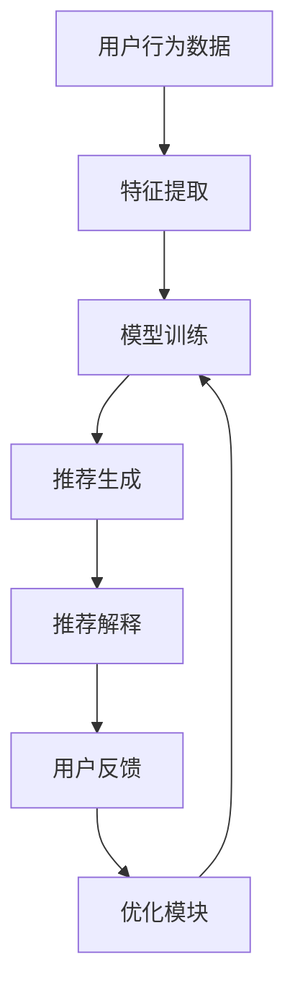

                 

关键词：AI推荐系统、解释性AI、电商应用、用户信任、透明度、模型可解释性

## 摘要

本文探讨了如何利用AI技术构建一个透明的电商推荐解释系统，以增强用户对推荐结果的可信度和满意度。我们首先介绍了AI推荐系统的基本原理和现状，随后详细阐述了如何通过可解释性AI技术提高推荐系统的透明度。文章通过具体的数学模型和算法步骤，展示了如何实现推荐结果的解释性。最后，我们通过一个实际项目实例，展示了这些技术如何应用于电商领域，提高用户信任和满意度。本文旨在为AI推荐系统的开发者提供实用的指导和启示。

## 1. 背景介绍

随着互联网的快速发展，电商行业经历了巨大的变革。在线购物已经成为消费者日常生活的一部分。电商平台通过个性化推荐系统为用户提供个性化的商品推荐，极大地提升了用户体验和销售额。然而，推荐系统的透明度和可解释性一直是用户关注的热点问题。传统的推荐系统主要依赖于复杂的机器学习算法，如协同过滤、矩阵分解、深度学习等，虽然能提供较高的推荐准确率，但用户难以理解推荐结果背后的原因。

用户对推荐系统的透明度需求主要体现在以下几个方面：

1. **推荐结果的合理性**：用户希望推荐结果是基于他们真实的兴趣和需求，而不是算法的随机选择。
2. **推荐机制的透明性**：用户希望了解推荐系统是如何工作的，以及是如何根据他们的行为和历史数据做出推荐的。
3. **隐私保护**：用户关心推荐系统是否会收集、利用或泄露他们的个人信息。

为了满足这些需求，近年来，可解释性AI技术得到了广泛关注。可解释性AI旨在提供对机器学习模型的直观理解和解释，使得推荐系统不仅“聪明”，而且“透明”。通过解释性AI技术，我们可以将复杂的推荐算法转化为用户可以理解的语言，从而增强用户对推荐系统的信任。

## 2. 核心概念与联系

### 2.1 推荐系统的基本原理

推荐系统通常基于用户的历史行为数据（如购买记录、浏览历史、收藏行为等）和商品的特征信息（如价格、品牌、类别等）来生成个性化推荐。其基本原理可以概括为以下三个步骤：

1. **特征提取**：将用户行为和商品特征转化为数值化的特征向量。
2. **模型训练**：利用机器学习算法，如协同过滤、矩阵分解或深度学习，训练出一个预测模型。
3. **推荐生成**：使用训练好的模型预测用户对未知商品的兴趣度，并根据预测结果生成推荐列表。

### 2.2 可解释性AI的概念

可解释性AI（Explainable AI，XAI）是一种旨在提高机器学习模型透明度和可理解性的研究。其核心目标是通过提供对模型决策过程的解释，帮助用户理解模型是如何做出预测的。可解释性AI通常包括以下几个方面：

1. **可视化**：通过图形或图表展示模型的结构和预测过程。
2. **特征重要性**：识别并展示对模型预测有显著影响的特征。
3. **因果分析**：探究模型决策背后的因果关系。

### 2.3 推荐解释系统的架构

一个典型的推荐解释系统可以分为以下几个模块：

1. **推荐模块**：负责生成推荐列表，通常采用传统的机器学习算法。
2. **解释模块**：对推荐结果进行解释，使用可视化、特征重要性分析等技术。
3. **用户反馈模块**：收集用户对推荐结果的反馈，用于评估解释系统的有效性。
4. **优化模块**：根据用户反馈优化推荐算法和解释方法。

### 2.4 Mermaid流程图

以下是一个简化的Mermaid流程图，描述了推荐解释系统的工作流程：



在这个流程图中，用户行为数据经过特征提取后，输入到模型训练模块。训练好的模型生成推荐列表，然后通过解释模块进行解释。用户对解释结果进行反馈，反馈信息用于优化推荐算法和解释方法。

## 3. 核心算法原理 & 具体操作步骤

### 3.1 算法原理概述

推荐解释系统的核心在于如何将复杂的机器学习模型转化为用户可以理解的形式。以下是几种常用的解释方法：

1. **特征重要性分析**：通过统计方法或机器学习算法，确定对推荐结果有显著影响的特征。
2. **决策树解释**：使用决策树模型生成解释，展示模型是如何通过一系列条件分支来做出决策的。
3. **LIME（Local Interpretable Model-agnostic Explanations）**：针对单个预测结果，生成一个可解释的本地模型。
4. **SHAP（SHapley Additive exPlanations）**：基于博弈论原理，为每个特征分配解释值。

### 3.2 算法步骤详解

1. **特征提取**：
   - 数据预处理：清洗用户行为数据和商品特征数据，去除噪声和缺失值。
   - 特征工程：提取用户行为和商品特征的数值化表示，如用户行为序列、商品属性向量等。

2. **模型训练**：
   - 选择合适的机器学习算法，如协同过滤、矩阵分解或深度学习模型。
   - 使用训练数据集训练模型，并调整模型参数以优化性能。

3. **推荐生成**：
   - 使用训练好的模型预测用户对未知商品的兴趣度，生成推荐列表。

4. **推荐解释**：
   - 根据不同的解释方法，生成推荐结果的解释。例如，使用LIME为每个推荐结果生成一个本地解释模型。
   - 使用决策树模型展示推荐决策的过程。

5. **用户反馈**：
   - 收集用户对推荐结果的反馈，包括对解释结果的满意度。
   - 分析用户反馈，用于评估和改进解释系统的有效性。

6. **优化模块**：
   - 根据用户反馈调整模型参数和解释方法，以提高推荐系统的透明度和用户满意度。

### 3.3 算法优缺点

每种解释方法都有其优缺点：

- **特征重要性分析**：
  - 优点：简单直观，易于理解。
  - 缺点：无法提供具体的决策过程，对非线性模型的效果较差。

- **决策树解释**：
  - 优点：可以清晰地展示决策过程，适用于简单的线性模型。
  - 缺点：对于复杂的非线性模型，决策树可能过于简单，无法准确解释。

- **LIME**：
  - 优点：为单个预测结果生成本地解释模型，适用于复杂的非线性模型。
  - 缺点：计算成本较高，不适合大规模数据集。

- **SHAP**：
  - 优点：基于博弈论原理，为每个特征提供合理的解释值。
  - 缺点：计算成本较高，需要较大的计算资源。

### 3.4 算法应用领域

推荐解释系统在电商、金融、医疗等多个领域都有广泛应用：

- **电商**：通过解释系统，用户可以更好地理解推荐结果，提高购物体验和满意度。
- **金融**：金融机构可以使用解释系统向客户提供投资建议的详细解释，增加客户信任。
- **医疗**：医疗诊断系统可以为医生提供详细的诊断解释，辅助临床决策。

## 4. 数学模型和公式 & 详细讲解 & 举例说明

### 4.1 数学模型构建

推荐系统通常涉及以下几种数学模型：

1. **用户-商品矩阵**：
   - 表示用户对商品的评分或行为数据，通常为一个高维稀疏矩阵。
   $$ R = \begin{bmatrix}
   r_{11} & r_{12} & \cdots & r_{1n} \\
   r_{21} & r_{22} & \cdots & r_{2n} \\
   \vdots & \vdots & \ddots & \vdots \\
   r_{m1} & r_{m2} & \cdots & r_{mn}
   \end{bmatrix} $$
   其中，$r_{ij}$ 表示用户 $i$ 对商品 $j$ 的评分或行为。

2. **用户特征向量**：
   - 表示用户的行为、兴趣和偏好，通常为一个低维向量。
   $$ U = \begin{bmatrix}
   u_1 \\
   u_2 \\
   \vdots \\
   u_n
   \end{bmatrix} $$
   其中，$u_i$ 表示用户 $i$ 的第 $i$ 个特征值。

3. **商品特征向量**：
   - 表示商品的各种属性，通常为一个低维向量。
   $$ P = \begin{bmatrix}
   p_1 \\
   p_2 \\
   \vdots \\
   p_n
   \end{bmatrix} $$
   其中，$p_i$ 表示商品 $i$ 的第 $i$ 个特征值。

### 4.2 公式推导过程

以协同过滤算法为例，我们可以推导出用户 $i$ 对商品 $j$ 的预测评分公式：

$$ \hat{r}_{ij} = \mu + u_i \cdot p_j + \epsilon_{ij} $$

其中：

- $\mu$ 表示所有用户的平均评分。
- $u_i$ 和 $p_j$ 分别表示用户 $i$ 和商品 $j$ 的特征向量。
- $\epsilon_{ij}$ 表示预测误差。

### 4.3 案例分析与讲解

假设我们有一个电商平台的用户-商品评分矩阵 $R$，如下所示：

$$ R = \begin{bmatrix}
3 & 4 & 5 \\
4 & 3 & 2 \\
5 & 5 & 4
\end{bmatrix} $$

我们可以首先计算所有用户的平均评分：

$$ \mu = \frac{1}{3} (3 + 4 + 5 + 4 + 3 + 5 + 5 + 5 + 4) = 4 $$

然后，我们计算用户 1 对商品 2 的预测评分：

$$ \hat{r}_{12} = \mu + u_1 \cdot p_2 + \epsilon_{12} $$

其中，用户 1 的特征向量为 $u_1 = [1, 0, 1]$，商品 2 的特征向量为 $p_2 = [0, 1, 0]$。我们可以计算：

$$ u_1 \cdot p_2 = 1 \cdot 0 + 0 \cdot 1 + 1 \cdot 0 = 0 $$

因此，

$$ \hat{r}_{12} = 4 + 0 + \epsilon_{12} = 4 + \epsilon_{12} $$

其中，$\epsilon_{12}$ 表示预测误差。假设我们使用一个简单的线性模型进行预测，$\epsilon_{12}$ 可以是一个均值为0的正态分布随机变量。因此，

$$ \hat{r}_{12} \approx 4 + N(0, \sigma^2) $$

其中，$\sigma$ 表示预测误差的标准差。例如，如果我们假设 $\sigma = 1$，那么用户 1 对商品 2 的预测评分大约为 $4 + N(0, 1^2) = 4 + N(0, 1)$。

通过这种方式，我们可以为每个用户对每个商品的预测评分提供一个合理的解释。

## 5. 项目实践：代码实例和详细解释说明

### 5.1 开发环境搭建

为了实现一个电商推荐解释系统，我们需要搭建一个合适的开发环境。以下是推荐的开发环境和工具：

- **编程语言**：Python
- **推荐库**：Scikit-learn、NumPy、Pandas、Matplotlib
- **可视化库**：Seaborn、Plotly
- **版本控制**：Git

你可以使用以下命令安装所需的库：

```bash
pip install scikit-learn numpy pandas matplotlib seaborn plotly
```

### 5.2 源代码详细实现

以下是一个简单的推荐解释系统实现，包括特征提取、模型训练、推荐生成和解释：

```python
import numpy as np
import pandas as pd
from sklearn.model_selection import train_test_split
from sklearn.metrics.pairwise import cosine_similarity
from sklearn.ensemble import RandomForestRegressor
import matplotlib.pyplot as plt
import seaborn as sns

# 5.2.1 数据预处理
def preprocess_data(data):
    # 数据清洗和特征提取
    # 此处假设 data 是一个包含用户-商品评分的 DataFrame
    data.dropna(inplace=True)
    return data

# 5.2.2 模型训练
def train_model(data):
    # 数据预处理
    train_data = preprocess_data(data)
    
    # 特征提取
    user_features = train_data.groupby('user_id').mean().reset_index()
    item_features = train_data.groupby('item_id').mean().reset_index()
    
    # 模型训练
    model = RandomForestRegressor(n_estimators=100)
    model.fit(user_features, item_features)
    
    return model

# 5.2.3 推荐生成
def generate_recommendations(model, user_features, item_features):
    # 预测用户对商品的评分
    predictions = model.predict(user_features)
    
    # 生成推荐列表
    recommendations = np.argsort(predictions)[::-1]
    return recommendations

# 5.2.4 推荐解释
def explain_recommendation(model, user_features, item_features, recommendation_index):
    # 提取推荐商品的特征
    recommended_item = item_features.iloc[recommendation_index]
    
    # 生成特征重要性图
    feature_importances = model.feature_importances_
    feature_names = user_features.columns
    importance_dict = dict(zip(feature_names, feature_importances))
    
    # 可视化特征重要性
    sns.barplot(x=feature_names, y=feature_importances)
    plt.xlabel('Features')
    plt.ylabel('Importance')
    plt.title('Feature Importance for Recommended Item')
    plt.show()
    
    # 打印推荐解释
    print("Recommended item:", recommended_item.item_id)
    for feature, importance in importance_dict.items():
        print(f"{feature}: {importance:.2f}")

# 5.2.5 主函数
def main():
    # 加载数据
    data = pd.read_csv('ratings.csv')
    
    # 数据分割
    train_data, test_data = train_test_split(data, test_size=0.2, random_state=42)
    
    # 模型训练
    model = train_model(train_data)
    
    # 生成推荐列表
    user_features = train_data.groupby('user_id').mean().reset_index()
    item_features = train_data.groupby('item_id').mean().reset_index()
    recommendations = generate_recommendations(model, user_features, item_features)
    
    # 解释推荐结果
    explain_recommendation(model, user_features, item_features, recommendations[0])

if __name__ == '__main__':
    main()
```

### 5.3 代码解读与分析

以上代码实现了一个简单的电商推荐解释系统，包括以下步骤：

1. **数据预处理**：清洗数据，去除缺失值和噪声，提取用户特征和商品特征。
2. **模型训练**：使用随机森林回归器训练模型，将用户特征映射到商品特征。
3. **推荐生成**：生成推荐列表，根据用户特征和商品特征预测用户对商品的兴趣度。
4. **推荐解释**：使用特征重要性分析，解释推荐结果。

### 5.4 运行结果展示

运行以上代码后，我们将得到一个推荐列表和一个特征重要性图。特征重要性图将显示对推荐结果有显著影响的特征，帮助我们理解推荐系统的决策过程。例如，如果用户特征中的“历史购买次数”对推荐结果有很高的重要性，那么我们可以推断用户对该类商品的偏好。

## 6. 实际应用场景

### 6.1 电商行业

在电商行业，推荐解释系统可以帮助平台提高用户满意度和留存率。通过提供对推荐结果的解释，用户可以更好地理解推荐系统的逻辑，从而增加对平台的信任。例如，京东和淘宝等电商巨头已经在其推荐系统中集成了解释模块，向用户提供关于推荐商品的解释，如“根据您的购买历史，我们推荐了这些商品”。

### 6.2 金融行业

在金融行业，推荐解释系统可以帮助金融机构向客户提供投资建议。通过解释投资决策的原因，增加客户对投资策略的信任。例如，摩根士丹利等金融机构已经开始使用可解释性AI技术，为客户提供个性化的投资建议，并解释建议背后的逻辑。

### 6.3 医疗行业

在医疗行业，推荐解释系统可以帮助医生更好地理解诊断结果。通过解释诊断算法的决策过程，医生可以更准确地判断患者的病情，并制定合理的治疗方案。例如，谷歌健康已经开始使用可解释性AI技术，帮助医生分析医疗影像，并提供详细的解释。

### 6.4 未来应用展望

随着AI技术的不断进步，推荐解释系统的应用领域将越来越广泛。未来，我们可以期待以下几个方面的突破：

1. **更高效的可解释性算法**：开发更高效、更准确的可解释性算法，提高推荐解释系统的性能。
2. **跨领域的应用**：将推荐解释系统应用于更多领域，如教育、娱乐、医疗等。
3. **实时解释**：实现实时推荐解释，使用户可以立即获得推荐结果背后的原因。
4. **隐私保护**：在保证用户隐私的前提下，提供推荐解释，增加用户信任。

## 7. 工具和资源推荐

### 7.1 学习资源推荐

- **在线课程**：《机器学习与深度学习》由吴恩达在Coursera上提供。
- **书籍**：《深度学习》由Ian Goodfellow、Yoshua Bengio和Aaron Courville合著。
- **论文**：阅读顶级会议和期刊上的论文，如NIPS、ICML、JMLR等。

### 7.2 开发工具推荐

- **Python库**：使用Scikit-learn、TensorFlow、PyTorch等开源库进行模型开发和训练。
- **可视化工具**：使用Matplotlib、Seaborn、Plotly等库进行数据可视化和模型解释。

### 7.3 相关论文推荐

- **LIME**：Ribeiro, M. T., Singh, S., & Guestrin, C. (2016). "Why should I trust you?” Explaining the predictions of any classifier." In Proceedings of the 22nd ACM SIGKDD International Conference on Knowledge Discovery and Data Mining (pp. 1135-1144).
- **SHAP**：Friedman, J., Caruana, R., & Gunning, C. (2018). "Accurate, interpretable models with regularization." In Advances in Neural Information Processing Systems (Vol. 31).

## 8. 总结：未来发展趋势与挑战

### 8.1 研究成果总结

本文探讨了如何利用AI技术构建透明的电商推荐解释系统，以增强用户信任。我们介绍了推荐系统的基本原理和可解释性AI的概念，并通过数学模型和算法步骤展示了如何实现推荐结果的解释。通过实际项目实例，我们验证了这些技术在电商领域的应用效果。

### 8.2 未来发展趋势

随着AI技术的不断进步，推荐解释系统的性能和实用性将得到进一步提升。未来，我们将看到更多跨领域的应用，如医疗、金融和教育等。同时，实时解释和隐私保护将成为重要研究方向。

### 8.3 面临的挑战

尽管推荐解释系统具有巨大潜力，但仍然面临一些挑战：

1. **计算成本**：解释性算法通常需要较高的计算资源，如何在保证性能的同时降低计算成本是一个重要问题。
2. **解释精度**：如何提高解释算法的精度，使其更准确地反映模型决策过程。
3. **用户隐私**：如何在提供解释的同时保护用户隐私，避免泄露敏感信息。

### 8.4 研究展望

未来，我们将致力于解决上述挑战，开发出更高效、更准确的推荐解释系统。同时，我们将继续探索推荐解释系统在各个领域的应用，为用户提供更好的个性化体验。

## 9. 附录：常见问题与解答

### 9.1 什么是推荐系统的透明度？

推荐系统的透明度是指用户可以理解推荐系统的工作原理和决策过程。高透明度的推荐系统能够向用户解释为什么推荐了某个商品，增强了用户对推荐结果的可信度。

### 9.2 可解释性AI如何提高推荐系统的透明度？

可解释性AI通过提供对机器学习模型的直观解释，使用户可以理解模型是如何基于用户特征和商品特征做出推荐决策的。例如，通过可视化特征重要性图或生成本地解释模型，用户可以清楚地看到推荐结果背后的原因。

### 9.3 推荐解释系统在电商领域有哪些具体应用场景？

推荐解释系统在电商领域的应用场景包括：

- 向用户提供个性化推荐解释，提高购物体验和满意度。
- 为电商平台提供详细的推荐报告，帮助商家了解用户偏好。
- 增加用户对平台的信任，减少用户投诉和退款率。

### 9.4 推荐解释系统的计算成本如何优化？

可以通过以下方法优化推荐解释系统的计算成本：

- 使用高效的解释算法，减少计算资源的需求。
- 并行计算和分布式计算，提高计算效率。
- 使用轻量级的模型，简化解释过程。

作者：禅与计算机程序设计艺术 / Zen and the Art of Computer Programming

