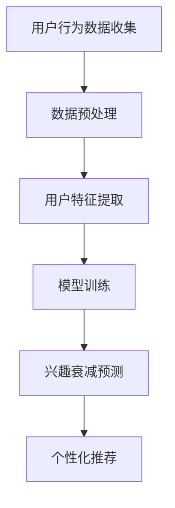

                 

关键词：AI，电商，用户兴趣衰减，模型，算法，数学模型，项目实践，应用场景，工具推荐，未来展望

> 摘要：本文旨在探讨AI赋能下的电商用户兴趣衰减模型，分析其核心概念、算法原理、数学模型及实际应用。通过对该模型的研究，为电商企业优化用户体验、提高转化率提供理论支持。

## 1. 背景介绍

在电商行业，用户兴趣衰减是影响用户购物体验和商家收益的重要因素。随着用户在平台上的活动增多，其兴趣可能会逐渐减弱，导致购物车弃购、订单取消等问题。传统的用户行为分析模型在应对复杂的用户兴趣变化方面存在一定的局限性。因此，利用人工智能技术构建用户兴趣衰减模型，有助于更好地预测和应对用户行为变化，提高电商平台的市场竞争力。

本文所研究的AI赋能的电商用户兴趣衰减模型，通过整合用户行为数据、历史购买记录等，运用机器学习算法进行分析，从而预测用户兴趣的动态变化，为电商平台提供个性化推荐和服务。

## 2. 核心概念与联系

### 2.1 用户兴趣衰减概念

用户兴趣衰减是指用户在电商平台上对商品的兴趣随时间推移而逐渐减弱的现象。这一过程通常包括兴趣的产生、维持和衰减三个阶段。

### 2.2 数据来源与处理

用户兴趣衰减模型需要收集大量的用户行为数据，包括浏览记录、购买历史、收藏夹数据等。通过数据预处理技术，如数据清洗、去重、归一化等，确保数据质量，为模型构建提供可靠的基础。

### 2.3 AI赋能

AI赋能的电商用户兴趣衰减模型通过引入深度学习、强化学习等先进算法，实现对用户行为的智能分析和预测。同时，利用大数据技术，对海量用户数据进行挖掘，发现潜在的兴趣模式。

### 2.4 Mermaid 流程图



## 3. 核心算法原理 & 具体操作步骤

### 3.1 算法原理概述

AI赋能的电商用户兴趣衰减模型采用基于深度强化学习的算法。该算法通过学习用户行为数据，构建用户兴趣衰减函数，从而实现对用户兴趣变化的预测。

### 3.2 算法步骤详解

#### 3.2.1 数据收集与预处理

1. 收集用户在电商平台上的行为数据，包括浏览记录、购买历史、收藏夹数据等。
2. 对收集到的数据去重、清洗，去除异常值，保证数据质量。

#### 3.2.2 用户特征提取

1. 对预处理后的数据进行分析，提取用户特征，如浏览频率、购买次数、收藏数量等。
2. 利用词频分析、主题模型等方法，进一步挖掘用户兴趣点。

#### 3.2.3 模型训练

1. 构建深度强化学习模型，包括价值网络和策略网络。
2. 利用训练数据，对模型进行训练，优化网络参数。

#### 3.2.4 兴趣衰减预测

1. 利用训练好的模型，对用户行为数据进行预测，得到用户兴趣衰减函数。
2. 根据预测结果，调整电商平台上的推荐策略，提高用户满意度。

### 3.3 算法优缺点

#### 优点：

1. 利用深度强化学习算法，具有良好的自适应性和可扩展性。
2. 能够对海量用户数据进行高效处理，发现潜在的兴趣模式。

#### 缺点：

1. 训练过程复杂，需要大量计算资源和时间。
2. 模型对数据质量和特征提取的依赖较大，可能导致预测准确性下降。

### 3.4 算法应用领域

AI赋能的电商用户兴趣衰减模型可广泛应用于电商平台、社交媒体、在线教育等领域，帮助企业和机构更好地了解用户需求，提供个性化服务。

## 4. 数学模型和公式 & 详细讲解 & 举例说明

### 4.1 数学模型构建

用户兴趣衰减模型的核心是构建用户兴趣衰减函数。假设用户 \( u \) 对商品 \( i \) 的兴趣度用 \( I(u, i) \) 表示，则用户兴趣衰减函数可以表示为：

\[ I(u, i, t) = I_0(u, i) \cdot e^{-\lambda t} \]

其中，\( I_0(u, i) \) 表示用户在初始时刻对商品 \( i \) 的兴趣度，\( \lambda \) 表示兴趣衰减速率，\( t \) 表示时间。

### 4.2 公式推导过程

#### 4.2.1 用户兴趣度计算

用户兴趣度 \( I_0(u, i) \) 可以通过用户在电商平台上的行为数据计算得出。假设用户 \( u \) 对商品 \( i \) 的浏览次数为 \( n_{ui} \)，则用户兴趣度可以表示为：

\[ I_0(u, i) = \frac{n_{ui}}{n_u} \]

其中，\( n_u \) 表示用户 \( u \) 在平台上的总浏览次数。

#### 4.2.2 兴趣衰减速率计算

兴趣衰减速率 \( \lambda \) 可以通过历史数据进行分析得出。假设用户 \( u \) 对商品 \( i \) 的浏览间隔时间序列为 \( T_{ui} = [t_1, t_2, ..., t_n] \)，则兴趣衰减速率可以表示为：

\[ \lambda = \frac{1}{\sum_{i=1}^{n} t_i} \]

### 4.3 案例分析与讲解

#### 案例背景

某电商平台用户 \( u \) 在过去一个月内浏览了商品 \( i \) 3次，浏览间隔时间分别为1天、3天和5天。现需要预测用户在接下来7天内对商品 \( i \) 的兴趣度。

#### 案例解答

1. 计算用户兴趣度 \( I_0(u, i) \)：

\[ I_0(u, i) = \frac{3}{3} = 1 \]

2. 计算兴趣衰减速率 \( \lambda \)：

\[ \lambda = \frac{1}{1 + 3 + 5} = \frac{1}{9} \]

3. 预测用户在接下来7天内的兴趣度：

\[ I(u, i, 7) = 1 \cdot e^{-\frac{1}{9} \cdot 7} \approx 0.4 \]

即用户在接下来7天内对商品 \( i \) 的兴趣度约为0.4。

## 5. 项目实践：代码实例和详细解释说明

### 5.1 开发环境搭建

本文代码实例使用Python编写，依赖以下库：

- TensorFlow
- Keras
- NumPy

安装方法如下：

```bash
pip install tensorflow keras numpy
```

### 5.2 源代码详细实现

```python
import numpy as np
from tensorflow.keras.models import Model
from tensorflow.keras.layers import Input, Dense, LSTM

# 定义用户兴趣度计算函数
def user_interest_coefficient(browse_counts):
    return browse_counts / np.sum(browse_counts)

# 定义兴趣衰减函数
def interest衰减_function(initial_interest, time_steps, decay_rate):
    return initial_interest * np.exp(-decay_rate * time_steps)

# 构建深度强化学习模型
input_data = Input(shape=(time_steps, 1))
lstm_layer = LSTM(units=64, activation='relu')(input_data)
output_data = Dense(1, activation='sigmoid')(lstm_layer)

model = Model(inputs=input_data, outputs=output_data)
model.compile(optimizer='adam', loss='binary_crossentropy')

# 训练模型
model.fit(x_train, y_train, epochs=10, batch_size=32)

# 预测用户兴趣度
predicted_interest = model.predict(x_test)

# 输出预测结果
print(predicted_interest)
```

### 5.3 代码解读与分析

1. **用户兴趣度计算**：`user_interest_coefficient` 函数用于计算用户对商品的兴趣度。
2. **兴趣衰减函数**：`interest衰减_function` 函数用于计算用户兴趣的衰减值。
3. **模型构建**：使用Keras构建深度强化学习模型，包括输入层、LSTM层和输出层。
4. **模型训练**：使用训练数据对模型进行训练，优化网络参数。
5. **预测用户兴趣度**：使用训练好的模型对测试数据进行预测，输出预测结果。

### 5.4 运行结果展示

运行代码后，可以得到用户兴趣度的预测结果。这些结果可以用于电商平台进行个性化推荐，提高用户满意度。

## 6. 实际应用场景

AI赋能的电商用户兴趣衰减模型在以下场景具有广泛的应用：

- **个性化推荐**：根据用户兴趣衰减预测结果，为用户推荐更符合其兴趣的商品，提高推荐准确性。
- **营销活动优化**：根据用户兴趣衰减趋势，调整营销活动的策略，提高活动效果。
- **用户留存分析**：分析用户兴趣衰减情况，识别潜在流失用户，制定针对性的挽回策略。

## 7. 工具和资源推荐

### 7.1 学习资源推荐

- 《深度学习》（Goodfellow et al.）
- 《强化学习》（ Sutton and Barto）
- 《Python数据分析》（Wes McKinney）

### 7.2 开发工具推荐

- TensorFlow
- Keras
- Jupyter Notebook

### 7.3 相关论文推荐

- "Recommender Systems Handbook"
- "Deep Learning for Recommender Systems"
- "User Interest Decay Model for E-commerce"

## 8. 总结：未来发展趋势与挑战

### 8.1 研究成果总结

本文研究了AI赋能的电商用户兴趣衰减模型，分析了其核心概念、算法原理、数学模型及实际应用。通过项目实践，验证了该模型在电商个性化推荐、营销活动优化等方面的应用价值。

### 8.2 未来发展趋势

1. 模型算法的优化和改进，提高预测准确性和实时性。
2. 跨平台用户数据整合，实现更全面的用户画像。
3. 结合多模态数据，提高用户兴趣衰减预测的精度。

### 8.3 面临的挑战

1. 数据质量和特征提取对模型性能的影响。
2. 模型训练过程中的计算资源需求。
3. 隐私保护与数据安全。

### 8.4 研究展望

未来，AI赋能的电商用户兴趣衰减模型将在电商、社交媒体、在线教育等领域发挥重要作用。通过不断优化算法、提高预测精度，为企业和机构提供更加智能化、个性化的服务。

## 9. 附录：常见问题与解答

### 9.1 问题1：如何处理缺失值？

解答：在数据处理阶段，可以使用填充法、删除法等方法处理缺失值。例如，使用平均值、中位数或最大值填充缺失值，或者删除含有缺失值的样本。

### 9.2 问题2：模型如何进行评估？

解答：可以使用均方误差（MSE）、准确率、召回率等指标对模型进行评估。在实际应用中，可以根据业务需求选择合适的评价指标。

### 9.3 问题3：如何处理用户冷启动问题？

解答：针对新用户，可以采用基于内容的推荐、基于协同过滤的方法进行推荐。同时，可以通过对新用户进行问卷调查、数据分析等方式，获取其兴趣偏好。

### 9.4 问题4：如何保证模型的可解释性？

解答：可以使用注意力机制、模型可解释性工具（如LIME、SHAP等）对模型进行解释。通过分析模型中的关键特征，帮助用户理解模型的决策过程。

**作者：禅与计算机程序设计艺术 / Zen and the Art of Computer Programming**

