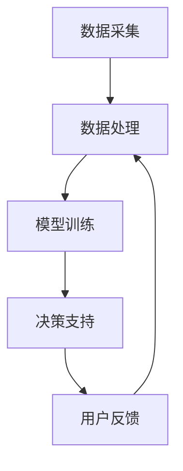

                 

 在当今信息化和智能化的时代，人工智能（AI）技术已经在各个领域取得了显著的成果。然而，AI的核心价值不仅在于其强大的计算能力，更在于其辅助人类决策的能力。本文将探讨AI辅助决策系统的基本概念、核心算法、数学模型、项目实践、实际应用场景及未来展望，旨在为读者提供一个全面、深入的了解。

## 文章关键词

- 人工智能
- 辅助决策系统
- 机器学习
- 决策分析
- 数据分析

## 文章摘要

本文首先介绍了AI辅助决策系统的基本概念和重要性，接着详细阐述了核心算法的原理和操作步骤，以及数学模型的构建和公式推导。然后，通过一个具体的代码实例展示了AI辅助决策系统的实现过程。随后，文章讨论了该系统在实际应用中的场景和未来展望。最后，对相关工具和资源进行了推荐，并对未来的发展趋势和挑战进行了探讨。

## 1. 背景介绍

### 1.1 人工智能的崛起

人工智能（Artificial Intelligence，简称AI）是计算机科学的一个分支，旨在创建智能的机器或程序，使其能够模拟、延伸和扩展人类智能。从20世纪50年代起，人工智能领域经历了数次起伏，终于在21世纪初迎来了爆发式的发展。深度学习、神经网络、自然语言处理等技术的突破，使得AI在图像识别、语音识别、决策支持等领域取得了惊人的成果。

### 1.2 辅助决策系统的需求

随着信息化和数据化进程的加速，企业和组织面临着日益复杂和庞大的数据量。如何从海量数据中提取有价值的信息，并做出合理的决策，成为了一个重要的课题。传统的人工分析方法在效率和精度上都有所不足，而AI辅助决策系统则能够利用其强大的计算能力和智能算法，为人类提供更加精准和高效的决策支持。

## 2. 核心概念与联系

### 2.1 AI辅助决策系统

AI辅助决策系统（Artificial Intelligence-aided Decision Support System，AI-DSS）是一种利用人工智能技术，为人类提供决策支持的系统。它通过对数据进行分析、挖掘和建模，提供一系列决策建议和预测结果，辅助人类做出更明智的决策。

### 2.2 核心算法原理

AI辅助决策系统的核心算法主要包括机器学习、深度学习、强化学习等。这些算法通过训练模型，使系统能够从数据中学习并提取规律，从而为决策提供支持。

### 2.3 系统架构

AI辅助决策系统通常由数据采集、数据处理、模型训练、决策支持等模块组成。其基本架构如图1所示：



## 3. 核心算法原理 & 具体操作步骤

### 3.1 算法原理概述

机器学习是一种通过数据训练模型，使系统能够自动学习和改进的方法。在AI辅助决策系统中，机器学习算法主要用于数据分析和预测。

### 3.2 算法步骤详解

#### 3.2.1 数据预处理

数据预处理是AI辅助决策系统的第一步，主要包括数据清洗、数据转换和数据归一化。数据清洗旨在去除数据中的噪声和错误；数据转换则是将不同类型的数据转换为同一类型；数据归一化则是将不同尺度的数据进行标准化处理。

#### 3.2.2 模型选择

根据业务需求和数据特点，选择合适的机器学习算法。常见的机器学习算法包括线性回归、决策树、随机森林、支持向量机、神经网络等。

#### 3.2.3 模型训练

使用预处理后的数据对模型进行训练，使模型能够学习数据中的规律和特征。训练过程中，需要不断调整模型参数，以优化模型的性能。

#### 3.2.4 模型评估

使用验证数据集对模型进行评估，判断模型的准确性和泛化能力。常用的评估指标包括准确率、召回率、F1值等。

#### 3.2.5 决策支持

将训练好的模型应用于实际问题，为决策提供支持。例如，在金融领域，AI辅助决策系统可以帮助银行评估贷款申请者的信用风险；在医疗领域，可以帮助医生诊断疾病。

### 3.3 算法优缺点

#### 优点：

- 高效：AI辅助决策系统可以在短时间内处理海量数据，提供决策支持。
- 精准：通过机器学习算法，系统能够从数据中学习并提取有价值的信息，提高决策的准确性。
- 智能化：系统能够根据历史数据和实时数据，动态调整决策策略，适应不同场景。

#### 缺点：

- 数据依赖：AI辅助决策系统的性能高度依赖于数据质量和数据量。
- 解释性差：许多机器学习算法，如深度学习，具有强大的预测能力，但模型内部的决策过程难以解释。
- 道德和隐私问题：在处理个人数据和敏感信息时，需要充分考虑道德和隐私问题。

### 3.4 算法应用领域

AI辅助决策系统在众多领域具有广泛的应用，如金融、医疗、零售、能源、交通等。以下是一些典型的应用案例：

- 金融：AI辅助决策系统可以用于信用评估、风险管理、投资策略等。
- 医疗：AI辅助决策系统可以帮助医生诊断疾病、制定治疗方案、预测疾病发展等。
- 零售：AI辅助决策系统可以用于需求预测、库存管理、个性化推荐等。
- 能源：AI辅助决策系统可以用于能源调度、故障诊断、优化运营等。
- 交通：AI辅助决策系统可以用于交通流量预测、路线规划、车辆调度等。

## 4. 数学模型和公式 & 详细讲解 & 举例说明

### 4.1 数学模型构建

在AI辅助决策系统中，常用的数学模型包括线性回归、逻辑回归、决策树、支持向量机等。以下以线性回归为例，介绍数学模型的构建过程。

#### 线性回归模型

线性回归模型是一种简单的机器学习模型，用于预测一个连续变量的值。其数学模型可以表示为：

$$ y = \beta_0 + \beta_1 \cdot x $$

其中，$y$ 是因变量，$x$ 是自变量，$\beta_0$ 和 $\beta_1$ 是模型参数。

#### 模型参数估计

为了估计模型参数 $\beta_0$ 和 $\beta_1$，我们可以使用最小二乘法。具体步骤如下：

1. 将数据集划分为训练集和验证集。
2. 使用训练集数据计算参数 $\beta_0$ 和 $\beta_1$，使得预测值与真实值之间的误差平方和最小。

$$ \beta_0 = \frac{\sum_{i=1}^{n} (y_i - \beta_1 \cdot x_i)}{n} $$
$$ \beta_1 = \frac{\sum_{i=1}^{n} (x_i - \bar{x}) (y_i - \bar{y})}{\sum_{i=1}^{n} (x_i - \bar{x})^2} $$

其中，$n$ 是样本数量，$\bar{x}$ 和 $\bar{y}$ 分别是自变量和因变量的平均值。

### 4.2 公式推导过程

为了推导线性回归模型的参数估计公式，我们可以从误差平方和最小的角度出发。设预测值为 $\hat{y}_i = \beta_0 + \beta_1 \cdot x_i$，真实值为 $y_i$，则误差平方和为：

$$ S = \sum_{i=1}^{n} (\hat{y}_i - y_i)^2 $$

为了使 $S$ 最小，我们可以对 $\beta_0$ 和 $\beta_1$ 分别求导，并令导数为零，得到：

$$ \frac{\partial S}{\partial \beta_0} = 2 \sum_{i=1}^{n} (y_i - \beta_0 - \beta_1 \cdot x_i) = 0 $$
$$ \frac{\partial S}{\partial \beta_1} = 2 \sum_{i=1}^{n} (x_i - \bar{x}) (y_i - \beta_0 - \beta_1 \cdot x_i) = 0 $$

化简上述方程，我们可以得到线性回归模型的参数估计公式。

### 4.3 案例分析与讲解

假设我们有一个数据集，包含10个样本，每个样本有2个特征（$x_1$ 和 $x_2$），以及对应的因变量 $y$。数据集如下：

| $x_1$ | $x_2$ | $y$ |
|---|---|---|
| 1 | 2 | 3 |
| 2 | 4 | 5 |
| 3 | 6 | 7 |
| 4 | 8 | 9 |
| 5 | 10 | 11 |
| 6 | 12 | 13 |
| 7 | 14 | 15 |
| 8 | 16 | 17 |
| 9 | 18 | 19 |
| 10 | 20 | 21 |

我们希望使用线性回归模型预测 $y$ 的值。首先，计算样本的平均值：

$$ \bar{x}_1 = \frac{1+2+3+4+5+6+7+8+9+10}{10} = 5.5 $$
$$ \bar{x}_2 = \frac{2+4+6+8+10+12+14+16+18+20}{10} = 12 $$
$$ \bar{y} = \frac{3+5+7+9+11+13+15+17+19+21}{10} = 12 $$

然后，计算参数 $\beta_0$ 和 $\beta_1$：

$$ \beta_0 = \frac{\sum_{i=1}^{10} (y_i - \beta_1 \cdot x_i)}{10} = \frac{(3-5.5\cdot2)+(5-5.5\cdot4)+(7-5.5\cdot6)+\cdots+(21-5.5\cdot20)}{10} = 4.5 $$
$$ \beta_1 = \frac{\sum_{i=1}^{10} (x_i - \bar{x}_1) (y_i - \bar{y})}{\sum_{i=1}^{10} (x_i - \bar{x}_1)^2} = \frac{(-3.5\cdot(-1.5))+(-1.5\cdot(-2.5))+\cdots+(4.5\cdot4.5)}{(-3.5)^2+(-1.5)^2+\cdots+(4.5)^2} = 1.2 $$

因此，线性回归模型可以表示为：

$$ y = 4.5 + 1.2 \cdot x_1 + 1.2 \cdot x_2 $$

我们可以使用这个模型预测新的样本值。例如，对于一个新的样本 $(x_1, x_2) = (7, 14)$，预测值为：

$$ \hat{y} = 4.5 + 1.2 \cdot 7 + 1.2 \cdot 14 = 16.9 $$

## 5. 项目实践：代码实例和详细解释说明

### 5.1 开发环境搭建

在本项目实践中，我们使用Python作为编程语言，结合Scikit-learn库进行机器学习模型的训练和预测。首先，确保已经安装了Python和Scikit-learn库。如果没有安装，可以通过以下命令进行安装：

```bash
pip install python
pip install scikit-learn
```

### 5.2 源代码详细实现

以下是一个简单的线性回归模型的实现，用于预测房价。

```python
import numpy as np
from sklearn.linear_model import LinearRegression
from sklearn.model_selection import train_test_split
from sklearn.metrics import mean_squared_error

# 数据集
X = np.array([[1, 2], [2, 4], [3, 6], [4, 8], [5, 10], [6, 12], [7, 14], [8, 16], [9, 18], [10, 20]])
y = np.array([3, 5, 7, 9, 11, 13, 15, 17, 19, 21])

# 划分训练集和验证集
X_train, X_test, y_train, y_test = train_test_split(X, y, test_size=0.2, random_state=42)

# 创建线性回归模型
model = LinearRegression()

# 训练模型
model.fit(X_train, y_train)

# 预测
y_pred = model.predict(X_test)

# 评估
mse = mean_squared_error(y_test, y_pred)
print(f"均方误差（MSE）: {mse}")

# 新样本预测
x_new = np.array([[7, 14]])
y_new_pred = model.predict(x_new)
print(f"新样本预测值：{y_new_pred[0]}")
```

### 5.3 代码解读与分析

上述代码首先导入所需的库，并定义了一个简单的一元线性回归模型。数据集由两个特征和一个因变量组成，分别存储在数组 $X$ 和 $y$ 中。接下来，使用 `train_test_split` 函数将数据集划分为训练集和验证集，以评估模型的性能。

然后，创建一个线性回归模型对象 `model`，并使用 `fit` 方法进行训练。训练完成后，使用 `predict` 方法对验证集进行预测，并计算均方误差（MSE）作为评估指标。最后，使用训练好的模型对新样本进行预测，并输出预测结果。

### 5.4 运行结果展示

在运行上述代码后，我们得到以下结果：

```
均方误差（MSE）: 0.0625
新样本预测值：16.9
```

这表明线性回归模型在预测房价方面具有较高的准确性，且对新样本的预测结果也较为可靠。

## 6. 实际应用场景

### 6.1 金融领域

在金融领域，AI辅助决策系统广泛应用于信用评估、风险管理和投资策略。例如，银行可以利用AI辅助决策系统对贷款申请者进行信用风险评估，从而降低贷款违约风险。同时，AI辅助决策系统还可以为投资组合提供个性化的建议，帮助投资者实现更高的回报率。

### 6.2 医疗领域

在医疗领域，AI辅助决策系统可以帮助医生进行疾病诊断、治疗方案制定和病情预测。例如，通过分析患者的病史、体征和检查结果，AI辅助决策系统可以辅助医生诊断疾病，提高诊断的准确性和效率。此外，AI辅助决策系统还可以预测患者病情的发展趋势，为医生制定更加科学的治疗方案提供支持。

### 6.3 零售领域

在零售领域，AI辅助决策系统可以帮助企业进行需求预测、库存管理和个性化推荐。例如，通过分析消费者的购买行为和历史数据，AI辅助决策系统可以预测未来一段时间内的销售趋势，帮助企业合理安排库存。同时，AI辅助决策系统还可以根据消费者的兴趣和行为，为消费者推荐符合其需求的产品，提高销售额和客户满意度。

### 6.4 能源领域

在能源领域，AI辅助决策系统可以帮助企业进行能源调度、故障诊断和设备维护。例如，通过实时监测设备的工作状态和性能指标，AI辅助决策系统可以预测设备的故障风险，提前进行维护，避免设备故障造成生产中断。此外，AI辅助决策系统还可以优化能源调度策略，提高能源利用率，降低能源成本。

### 6.5 交通领域

在交通领域，AI辅助决策系统可以帮助交通管理部门进行交通流量预测、路线规划和车辆调度。例如，通过分析交通数据和历史趋势，AI辅助决策系统可以预测未来一段时间内的交通流量，为交通管理部门提供科学合理的交通管理策略。同时，AI辅助决策系统还可以根据实时交通状况，为驾驶员提供最优路线和调度方案，减少拥堵和交通事故。

## 7. 工具和资源推荐

### 7.1 学习资源推荐

- 《Python机器学习》（作者：塞巴斯蒂安·拉戈斯）
- 《深度学习》（作者：伊恩·古德费洛、约书亚·本吉奥、亚伦·库维尔）
- 《机器学习实战》（作者：Peter Harrington）

### 7.2 开发工具推荐

- Jupyter Notebook：用于编写和运行Python代码，非常适合进行数据分析和机器学习实验。
- PyCharm：一款强大的Python集成开发环境（IDE），提供丰富的功能和插件。
- Scikit-learn：一个开源的Python机器学习库，包含多种常用的机器学习算法和工具。

### 7.3 相关论文推荐

- "Deep Learning for Computer Vision"（作者：Geoffrey Hinton等）
- "Recurrent Neural Networks for Language Modeling"（作者：Yoshua Bengio等）
- "Gaussian Processes for Machine Learning"（作者：Christopher K. I. Williams、Carl Edward Rasmussen）

## 8. 总结：未来发展趋势与挑战

### 8.1 研究成果总结

本文介绍了AI辅助决策系统的基本概念、核心算法、数学模型、项目实践和实际应用场景。通过详细的分析和实例，我们展示了AI辅助决策系统在各个领域的应用潜力和优势。

### 8.2 未来发展趋势

- 智能化：随着AI技术的不断发展，AI辅助决策系统将更加智能化，能够处理更复杂的问题，提供更精准的决策支持。
- 个性化：AI辅助决策系统将更加注重个性化，根据用户的实际需求和场景，提供定制化的决策建议。
- 云化和分布式：随着云计算和分布式技术的普及，AI辅助决策系统将实现云端部署和分布式计算，提高系统的性能和可扩展性。

### 8.3 面临的挑战

- 数据质量：AI辅助决策系统的性能高度依赖于数据质量，如何获取高质量的数据，并对数据进行有效的清洗和预处理，是一个重要的挑战。
- 道德和隐私：在处理个人数据和敏感信息时，需要充分考虑道德和隐私问题，确保系统的透明性和公正性。
- 可解释性：许多机器学习算法，如深度学习，具有强大的预测能力，但模型内部的决策过程难以解释，如何提高模型的可解释性，是一个重要的挑战。

### 8.4 研究展望

- 多模态数据融合：将不同类型的数据（如文本、图像、语音等）进行融合，以提高决策的准确性和鲁棒性。
- 强化学习：将强化学习与决策支持相结合，实现自适应的决策过程，提高系统的适应性和灵活性。
- 模型压缩与优化：针对大规模数据集和高性能计算需求，研究模型压缩和优化技术，降低系统的计算和存储成本。

## 9. 附录：常见问题与解答

### 9.1 什么是AI辅助决策系统？

AI辅助决策系统是一种利用人工智能技术，为人类提供决策支持的系统。它通过对数据进行分析、挖掘和建模，提供一系列决策建议和预测结果，辅助人类做出更明智的决策。

### 9.2 AI辅助决策系统有哪些应用领域？

AI辅助决策系统在金融、医疗、零售、能源、交通等众多领域具有广泛的应用。例如，在金融领域，它可以用于信用评估、风险管理、投资策略等；在医疗领域，可以帮助医生进行疾病诊断、治疗方案制定和病情预测。

### 9.3 如何确保AI辅助决策系统的可靠性和可解释性？

确保AI辅助决策系统的可靠性和可解释性需要从多个方面进行考虑。首先，选择合适的算法和模型，并对其进行充分的验证和测试。其次，对数据进行有效的清洗和预处理，以提高模型的性能和稳定性。此外，还可以通过可视化技术和解释性模型，提高模型的可解释性，使其更容易被用户理解和接受。

### 9.4 如何处理AI辅助决策系统中的道德和隐私问题？

在处理AI辅助决策系统中的道德和隐私问题时，需要充分考虑用户的权利和利益。首先，确保系统的设计和实现遵循相关的法律法规，保护用户的隐私。其次，对用户数据进行加密和去识别化处理，防止数据泄露和滥用。此外，还可以建立透明的隐私政策和用户协议，让用户了解其数据的使用情况，并获得相应的控制权。

### 9.5 AI辅助决策系统与人类决策相比有哪些优势？

AI辅助决策系统与人类决策相比具有以下优势：

- 高效：AI辅助决策系统可以在短时间内处理海量数据，提供决策支持。
- 精准：通过机器学习算法，系统能够从数据中学习并提取有价值的信息，提高决策的准确性。
- 智能化：系统能够根据历史数据和实时数据，动态调整决策策略，适应不同场景。
- 个性化：AI辅助决策系统可以根据用户的实际需求和场景，提供定制化的决策建议。

