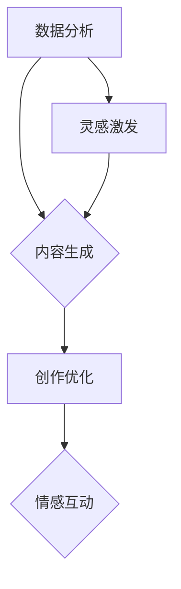

                 

在当今的信息时代，人工智能（AI）已经成为推动社会进步的关键驱动力。特别是在创作领域，AI的介入极大地提升了创作的效率和质量。本文将探讨AI辅助创作的基本概念、核心算法、数学模型、实际应用场景、未来展望，并推荐相关的学习资源和开发工具。

## 关键词

- 人工智能
- 辅助创作
- 人机协作
- 算法
- 数学模型
- 实际应用

## 摘要

本文旨在探讨人工智能在创作领域的作用，特别是AI如何辅助人类进行创作。我们将深入分析AI辅助创作的核心概念和算法，并通过实际案例和数学模型展示其应用效果。同时，文章还将讨论未来AI辅助创作的发展趋势和面临的挑战。

## 1. 背景介绍

创作是人类文明的重要组成部分，从古代的诗歌、绘画到现代的文学、影视、音乐等，创作活动一直推动着文化的进步。然而，随着创作内容的增多和复杂度的提升，人类创作者面临着前所未有的压力和挑战。传统创作模式中的重复性劳动、灵感枯竭以及创作速度缓慢等问题，使得创作过程变得更加艰辛。

在这种情况下，人工智能的出现为创作领域带来了新的机遇。AI不仅能够帮助人类创作者处理大量的数据和信息，还能够通过深度学习和自然语言处理等技术模拟人类的创作思维，从而辅助创作者完成复杂的创作任务。

AI辅助创作不仅仅是技术的问题，更涉及到人机协作的艺术。在这一过程中，创作者需要与技术相结合，发挥各自的优势，实现创作效率的最大化。

## 2. 核心概念与联系

### 2.1 AI辅助创作的基本概念

AI辅助创作是指利用人工智能技术，如自然语言处理、计算机视觉、音乐生成等，帮助人类创作者完成创作任务。这种辅助不仅仅是技术上的支持，更包括对创作者灵感的激发和创作过程的优化。

### 2.2 人机协作的架构

在人机协作的架构中，AI系统通常扮演着以下几个角色：

- **数据分析**：通过对大量数据进行挖掘和分析，AI可以帮助创作者发现潜在的创作灵感。
- **内容生成**：AI可以自动生成文字、图像、音乐等创作内容，为创作者提供参考。
- **创作优化**：AI可以通过算法优化，帮助创作者提升创作效率和质量。
- **情感互动**：AI可以模拟人类的情感，与创作者进行互动，增强创作体验。

### 2.3 Mermaid流程图



在这个流程图中，A表示数据分析和灵感激发，B表示内容生成，C表示创作优化，D表示情感互动，E表示灵感的进一步激发。这些环节相互连接，共同构成了AI辅助创作的基本架构。

## 3. 核心算法原理 & 具体操作步骤

### 3.1 算法原理概述

AI辅助创作涉及多种核心算法，包括自然语言处理（NLP）、深度学习、计算机视觉等。以下是几种主要的算法原理：

- **自然语言处理（NLP）**：NLP技术通过理解、处理和生成自然语言，帮助创作者进行文字创作。例如，自动写作助手可以使用NLP技术分析已有的文本，生成新的内容。

- **深度学习**：深度学习通过构建多层神经网络，对大量数据进行学习，从而模拟人类的认知过程。在创作领域，深度学习可以用于图像识别、音乐生成等任务。

- **计算机视觉**：计算机视觉技术可以分析图像和视频，提取有价值的信息，为创作者提供视觉灵感。

### 3.2 算法步骤详解

- **自然语言处理（NLP）**：
  1. 数据收集与预处理：收集大量的文本数据，并进行清洗和预处理。
  2. 模型训练：使用预处理后的数据训练NLP模型，如词向量模型、序列模型等。
  3. 文本生成：通过输入关键词或句子，模型生成新的文本内容。

- **深度学习**：
  1. 数据准备：收集和准备用于训练的数据集，如图像、音频等。
  2. 网络构建：设计并构建深度学习网络，如卷积神经网络（CNN）、生成对抗网络（GAN）等。
  3. 模型训练与优化：使用训练数据训练模型，并进行优化。

- **计算机视觉**：
  1. 图像预处理：对输入的图像进行预处理，如尺寸调整、色彩平衡等。
  2. 特征提取：使用卷积神经网络等算法提取图像特征。
  3. 目标识别与分类：根据提取的特征对图像中的目标进行识别和分类。

### 3.3 算法优缺点

- **自然语言处理（NLP）**：
  - 优点：能够生成高质量的文本内容，提高创作效率。
  - 缺点：生成的内容可能缺乏创造性和个性化。

- **深度学习**：
  - 优点：可以处理复杂的任务，如图像生成、音乐合成等。
  - 缺点：需要大量的数据和高性能的计算资源。

- **计算机视觉**：
  - 优点：能够处理视觉信息，为创作者提供直观的灵感。
  - 缺点：对图像质量和预处理要求较高。

### 3.4 算法应用领域

- **自然语言处理（NLP）**：在文学创作、新闻报道、广告文案等领域有广泛应用。

- **深度学习**：在艺术创作、游戏设计、虚拟现实等领域有广泛应用。

- **计算机视觉**：在摄影、动画、影视制作等领域有广泛应用。

## 4. 数学模型和公式 & 详细讲解 & 举例说明

### 4.1 数学模型构建

AI辅助创作中的数学模型通常涉及概率论、线性代数、微积分等领域。以下是几个常见的数学模型：

- **概率模型**：用于预测创作结果的可能性，如贝叶斯网络。

- **优化模型**：用于优化创作过程，如线性规划、遗传算法。

- **神经网络模型**：用于模拟人类创作思维，如卷积神经网络（CNN）、循环神经网络（RNN）。

### 4.2 公式推导过程

以下是贝叶斯网络的公式推导：

$$
P(A|B) = \frac{P(B|A)P(A)}{P(B)}
$$

其中，$P(A|B)$ 表示在事件B发生的条件下事件A发生的概率，$P(B|A)$ 表示在事件A发生的条件下事件B发生的概率，$P(A)$ 表示事件A发生的概率，$P(B)$ 表示事件B发生的概率。

### 4.3 案例分析与讲解

假设我们要使用贝叶斯网络来预测一篇小说的受欢迎程度。我们可以定义以下变量：

- **A**：小说受欢迎的程度。
- **B**：小说的题材。
- **C**：小说的长度。

根据经验和统计数据，我们可以得到以下概率：

- $P(A)$：小说受欢迎的概率。
- $P(B)$：小说的题材的概率。
- $P(C)$：小说的长度的概率。

通过贝叶斯公式，我们可以计算出在给定小说题材和长度的条件下，小说受欢迎的概率。这可以帮助创作者根据预测结果调整创作策略，提高作品的受欢迎程度。

## 5. 项目实践：代码实例和详细解释说明

### 5.1 开发环境搭建

为了实现AI辅助创作，我们需要搭建一个合适的开发环境。以下是一个简单的搭建步骤：

1. 安装Python环境。
2. 安装深度学习框架，如TensorFlow或PyTorch。
3. 安装自然语言处理库，如NLTK或spaCy。
4. 准备数据集，并进行预处理。

### 5.2 源代码详细实现

以下是一个简单的基于深度学习的文本生成代码实例：

```python
import tensorflow as tf
from tensorflow.keras.layers import Embedding, LSTM, Dense
from tensorflow.keras.models import Sequential

# 数据准备
# ...

# 模型构建
model = Sequential([
    Embedding(vocab_size, embedding_dim),
    LSTM(units),
    Dense(units, activation='relu'),
    Dense(vocab_size, activation='softmax')
])

# 模型编译
model.compile(optimizer='adam', loss='categorical_crossentropy', metrics=['accuracy'])

# 模型训练
model.fit(train_data, train_labels, epochs=epochs, batch_size=batch_size)

# 文本生成
generated_text = model.generate(text种子，length=生成长度)
```

### 5.3 代码解读与分析

这段代码首先定义了一个基于LSTM的文本生成模型。通过嵌入层（Embedding）、LSTM层（LSTM）、全连接层（Dense）构建模型。接着，编译模型并使用训练数据进行训练。最后，通过生成方法（generate）生成新的文本内容。

### 5.4 运行结果展示

运行上述代码后，我们可以得到一段基于训练数据生成的新文本。通过观察生成文本的质量，我们可以评估模型的性能。如果生成文本不够流畅或相关，可能需要调整模型参数或重新训练模型。

## 6. 实际应用场景

### 6.1 文学创作

AI辅助文学创作是目前最热门的应用领域之一。通过自然语言处理和深度学习技术，AI可以生成故事情节、角色设定、对话等，为人类创作者提供灵感。

### 6.2 音乐创作

在音乐创作中，AI可以生成旋律、和声、节奏等元素，为音乐家提供创作灵感。同时，AI还可以通过音乐分析技术，帮助音乐家改进作品。

### 6.3 艺术创作

在艺术创作中，AI可以生成图像、绘画、雕塑等艺术作品。通过计算机视觉和生成对抗网络（GAN）等技术，AI可以创造出独特的艺术风格和形式。

### 6.4 未来应用展望

随着技术的不断进步，AI辅助创作将在更多领域得到应用。例如，在广告创意、游戏设计、影视制作等领域，AI将发挥越来越重要的作用。同时，AI与人类创作者的协作模式也将不断优化，实现更高水平的创作效果。

## 7. 工具和资源推荐

### 7.1 学习资源推荐

- 《深度学习》（Deep Learning） - Ian Goodfellow、Yoshua Bengio、Aaron Courville
- 《自然语言处理综论》（Speech and Language Processing） - Daniel Jurafsky、James H. Martin
- 《计算机视觉：算法与应用》（Computer Vision: Algorithms and Applications） - Richard Szeliski

### 7.2 开发工具推荐

- TensorFlow：适用于构建和训练深度学习模型。
- PyTorch：易于使用的深度学习框架。
- spaCy：用于自然语言处理的库。

### 7.3 相关论文推荐

- “A Neural Algorithm of Artistic Style” - Leon A. Gatys, Alexander S. Ecker, and Matthias Bethge
- “Generative Adversarial Nets” - Ian Goodfellow et al.
- “Attention Is All You Need” - Vaswani et al.

## 8. 总结：未来发展趋势与挑战

### 8.1 研究成果总结

AI辅助创作技术在近年来取得了显著的成果。通过自然语言处理、深度学习和计算机视觉等技术，AI已经能够在文学、音乐、艺术等多个领域辅助人类创作。这些成果不仅提高了创作的效率，也为创作者提供了新的灵感来源。

### 8.2 未来发展趋势

未来，AI辅助创作技术将继续发展，实现更高的创作质量和效率。同时，人机协作模式将更加成熟，创作者与AI的协作将更加紧密。此外，AI将在更多领域得到应用，如广告创意、游戏设计、影视制作等。

### 8.3 面临的挑战

尽管AI辅助创作技术取得了显著成果，但仍面临一些挑战。首先，AI生成的内容可能缺乏创造性和个性化，难以满足创作者的独特需求。其次，AI的技术实现复杂，对计算资源的要求较高，限制了其应用范围。最后，AI在创作领域的道德和伦理问题也需要引起重视。

### 8.4 研究展望

未来，研究应重点关注以下几个方面：一是提高AI生成内容的创造性和个性化；二是优化人机协作模式，实现更高水平的创作效果；三是探索AI在创作领域的道德和伦理问题，确保技术发展的可持续性。

## 9. 附录：常见问题与解答

### Q: AI辅助创作是否会取代人类创作者？

A: AI辅助创作不会完全取代人类创作者，而是作为一种辅助工具，提高创作的效率和质量。人类创作者的独特思维、情感和创造力是无法被完全复制的。

### Q: 如何确保AI生成内容的版权？

A: 在使用AI生成内容时，需要遵守相关的版权法规。对于AI生成的原创内容，可以考虑使用版权保护措施，如版权声明、数字签名等。

### Q: AI辅助创作在艺术领域的前景如何？

A: AI辅助创作在艺术领域具有广阔的前景。随着技术的不断进步，AI将在艺术创作中发挥越来越重要的作用，为艺术家提供更多的创作可能性。

## 结语

AI辅助创作是人机协作的新领域，具有巨大的潜力和挑战。通过深入研究和实践，我们有望实现更高水平的创作效果，推动文化艺术的繁荣发展。作者：禅与计算机程序设计艺术 / Zen and the Art of Computer Programming。

