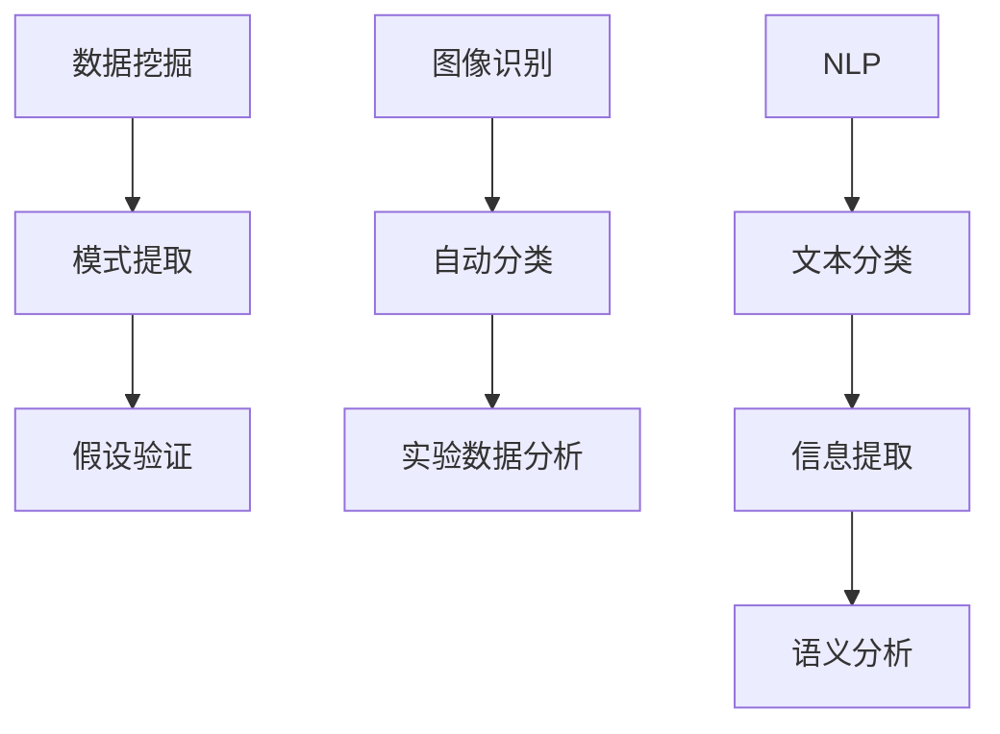

                 

关键词：人工智能，学术研究，辅助工具，算法优化，数学模型，应用领域，未来展望

> 摘要：随着人工智能技术的飞速发展，其在学术研究领域的应用愈发广泛。本文将探讨AI辅助学术研究的新方向，分析核心概念、算法原理、数学模型及其在实际应用中的挑战与机遇。

## 1. 背景介绍

在过去的几十年里，学术研究经历了翻天覆地的变化。从传统的人工处理数据，到现如今广泛应用的信息技术，学术研究的效率得到了显著提升。然而，随着数据量的爆炸式增长，以及研究问题的日益复杂，传统的数据处理方法已无法满足现代学术研究的需求。正是在这样的背景下，人工智能（AI）作为一项颠覆性的技术，开始逐步渗透到学术研究的各个领域，为研究者们提供了强大的辅助工具。

AI技术在学术研究中的应用主要集中在数据挖掘、图像处理、自然语言处理等领域。例如，AI可以帮助研究人员快速筛选大量数据，提取有价值的信息；通过图像识别技术，可以对实验数据进行自动分类和分析；自然语言处理技术则能够帮助研究人员理解和处理大量的文本数据。这些技术的应用，不仅提高了研究效率，还为学术研究开辟了新的方向。

然而，随着AI技术的发展，我们也面临着一些新的挑战。例如，如何确保AI算法的公平性和透明度？如何处理AI算法在学术研究中的伦理问题？这些问题都需要我们深入探讨和解决。

## 2. 核心概念与联系

### 2.1 数据挖掘

数据挖掘（Data Mining）是AI技术的一个重要分支，它旨在从大量数据中提取有价值的信息和知识。在学术研究中，数据挖掘技术可以帮助研究者从大量的实验数据中提取出有意义的模式，从而支持研究假设的验证。

### 2.2 图像识别

图像识别（Image Recognition）是一种通过计算机算法识别和分类图像的技术。在学术研究中，图像识别技术可以用于对实验数据的自动分类和分析，从而提高研究效率。

### 2.3 自然语言处理

自然语言处理（Natural Language Processing, NLP）是AI技术的另一个重要分支，它旨在使计算机能够理解和处理人类自然语言。在学术研究中，NLP技术可以用于文本数据的自动化处理，包括文本分类、信息提取、语义分析等。

### 2.4 Mermaid 流程图

以下是关于数据挖掘、图像识别和自然语言处理在学术研究中应用的Mermaid流程图：



## 3. 核心算法原理 & 具体操作步骤

### 3.1 算法原理概述

在学术研究中，AI技术的应用主要体现在数据挖掘、图像识别和自然语言处理等领域。以下是对这三个领域核心算法原理的简要概述：

- **数据挖掘**：主要使用机器学习算法，如决策树、支持向量机、神经网络等，从大量数据中提取有价值的信息和知识。
- **图像识别**：主要使用卷积神经网络（CNN）等深度学习算法，通过对图像的特征提取和分类，实现对图像的自动识别。
- **自然语言处理**：主要使用循环神经网络（RNN）、长短期记忆网络（LSTM）等深度学习算法，通过对文本数据的特征提取和分类，实现对文本的自动处理和理解。

### 3.2 算法步骤详解

以下是关于数据挖掘、图像识别和自然语言处理算法的具体操作步骤：

- **数据挖掘**：首先对数据进行预处理，包括数据清洗、数据集成、数据转换等；然后选择合适的机器学习算法，对预处理后的数据进行训练和测试；最后根据模型的预测结果，提取出有价值的信息和知识。
- **图像识别**：首先对图像进行预处理，包括图像增强、图像分割等；然后使用卷积神经网络提取图像特征；最后通过特征匹配和分类，实现对图像的自动识别。
- **自然语言处理**：首先对文本进行预处理，包括分词、词性标注等；然后使用循环神经网络提取文本特征；最后通过特征匹配和分类，实现对文本的自动处理和理解。

### 3.3 算法优缺点

以下是数据挖掘、图像识别和自然语言处理算法的优缺点：

- **数据挖掘**：优点包括能够处理大规模数据、能够自动提取有价值的信息和知识；缺点包括对数据质量要求较高、算法复杂度较高。
- **图像识别**：优点包括能够实现高速、准确的图像识别；缺点包括对图像质量要求较高、对算法性能优化要求较高。
- **自然语言处理**：优点包括能够处理大规模文本数据、能够自动提取有价值的信息和知识；缺点包括对文本质量要求较高、算法复杂度较高。

### 3.4 算法应用领域

以下是数据挖掘、图像识别和自然语言处理算法在实际应用中的领域：

- **数据挖掘**：应用于金融、医疗、电商等领域，用于数据分析、预测和决策支持。
- **图像识别**：应用于安防、自动驾驶、医学影像分析等领域，用于图像识别、分类和检测。
- **自然语言处理**：应用于智能客服、智能翻译、智能推荐等领域，用于文本处理、理解和生成。

## 4. 数学模型和公式 & 详细讲解 & 举例说明

### 4.1 数学模型构建

在AI辅助学术研究中，常用的数学模型包括决策树、支持向量机、神经网络等。以下分别介绍这些模型的基本原理和构建方法。

#### 4.1.1 决策树

决策树是一种常用的分类和回归模型，它通过一系列判断条件，将数据进行分类或回归。决策树的构建过程主要包括以下步骤：

1. **数据预处理**：对数据进行清洗、归一化等预处理操作，确保数据的质量和一致性。
2. **特征选择**：选择合适的特征，用于构建决策树。
3. **划分节点**：根据选择的特征，对数据进行划分，形成决策树的结构。
4. **评估模型**：对构建的决策树进行评估，包括剪枝、交叉验证等。

#### 4.1.2 支持向量机

支持向量机（SVM）是一种常用的分类模型，它通过寻找最优的超平面，将数据分为不同的类别。SVM的构建过程主要包括以下步骤：

1. **数据预处理**：对数据进行清洗、归一化等预处理操作，确保数据的质量和一致性。
2. **特征选择**：选择合适的特征，用于构建SVM模型。
3. **选择核函数**：根据数据的特点，选择合适的核函数，用于计算特征之间的相似度。
4. **求解最优超平面**：通过求解最优化问题，找到最优的超平面，实现数据的分类。

#### 4.1.3 神经网络

神经网络是一种通过模拟人脑神经元结构，实现数据分类、回归等任务的模型。神经网络的构建过程主要包括以下步骤：

1. **数据预处理**：对数据进行清洗、归一化等预处理操作，确保数据的质量和一致性。
2. **特征选择**：选择合适的特征，用于构建神经网络模型。
3. **构建神经网络结构**：根据任务需求，设计神经网络的结构，包括层数、神经元数量等。
4. **训练神经网络**：通过反向传播算法，对神经网络进行训练，优化模型参数。

### 4.2 公式推导过程

以下是决策树、支持向量机、神经网络等数学模型的公式推导过程：

#### 4.2.1 决策树

决策树的公式推导主要包括特征选择、节点划分等步骤。

1. **特征选择**：设\(X\)为特征集合，\(Y\)为标签集合，\(D\)为数据集。特征选择的目标是找到最优的特征\(X_c\)，使得节点划分具有最大的信息增益。

   \[ IG(D, X_c) = H(D) - \sum_{v} P(v) H(D_v) \]

   其中，\(H(D)\)为数据集的熵，\(P(v)\)为特征\(X_c\)在数据集\(D\)中取值为\(v\)的概率，\(H(D_v)\)为特征\(X_c\)取值为\(v\)时数据集\(D\)的熵。

2. **节点划分**：设\(D_v\)为特征\(X_c\)取值为\(v\)的数据子集，节点划分的目标是找到最优的划分点\(t\)，使得节点划分具有最大的信息增益。

   \[ IG(D, X_c, t) = \sum_{v'} P(v') [IG(D_v', X_c) - IG(D_{v'}, X_c, t)] \]

   其中，\(P(v')\)为特征\(X_c\)在数据集\(D\)中取值为\(v'\)的概率，\(IG(D_v', X_c)\)为特征\(X_c\)取值为\(v'\)时数据集\(D_v'\)的信息增益。

#### 4.2.2 支持向量机

支持向量机的主要公式推导包括求解最优超平面和分类决策过程。

1. **求解最优超平面**：设\(x\)为数据点，\(y\)为标签，\(w\)为超平面参数，\(b\)为偏置项。最优超平面的目标是使数据点\(x\)到超平面的距离最大化，即

   \[ \max_{w, b} \frac{1}{2} \| w \|^2 \]

   约束条件为：

   \[ y(x \cdot w + b) \geq 1 \]

   其中，\(x \cdot w + b\)为数据点\(x\)到超平面的距离。

2. **分类决策过程**：根据数据点\(x\)到超平面的距离，进行分类决策。

   \[ y = \text{sign}(x \cdot w + b) \]

   其中，\(\text{sign}(x)\)为符号函数，当\(x \geq 0\)时取值为1，当\(x < 0\)时取值为-1。

#### 4.2.3 神经网络

神经网络的公式推导主要包括神经元激活函数、反向传播算法等。

1. **神经元激活函数**：设\(z\)为神经元输入，\(a\)为神经元输出，激活函数\(f(z)\)用于将神经元输入转换为输出。

   \[ a = f(z) \]

   常用的激活函数包括：

   - **sigmoid函数**：\( f(z) = \frac{1}{1 + e^{-z}} \)
   - **ReLU函数**：\( f(z) = \max(0, z) \)
   - **tanh函数**：\( f(z) = \frac{e^z - e^{-z}}{e^z + e^{-z}} \)

2. **反向传播算法**：反向传播算法用于计算神经网络模型参数的梯度，从而优化模型参数。

   设\(L\)为损失函数，\(w\)为模型参数，\(x\)为输入，\(y\)为真实标签，\(\hat{y}\)为预测标签。反向传播算法的主要步骤包括：

   - **前向传播**：计算输入\(x\)到输出\(\hat{y}\)的预测结果。
   
     \[ \hat{y} = f(z) \]

   - **计算损失函数**：计算预测结果\(\hat{y}\)与真实标签\(y\)之间的损失。
   
     \[ L = \frac{1}{2} \| y - \hat{y} \|^2 \]

   - **计算梯度**：根据损失函数，计算模型参数\(w\)的梯度。
   
     \[ \frac{\partial L}{\partial w} = - (y - \hat{y}) \cdot \frac{\partial \hat{y}}{\partial w} \]

   - **反向传播**：将梯度反向传播至神经网络的每一层，更新模型参数。

### 4.3 案例分析与讲解

以下是一个关于使用决策树进行分类的案例。

#### 4.3.1 数据集

给定一个包含100个样本的数据集，每个样本有3个特征，分别为\(x_1, x_2, x_3\)，标签为\(y\)，其中\(y\)为二分类结果。

#### 4.3.2 特征选择

首先，计算每个特征的信息增益，选择信息增益最大的特征作为划分特征。

1. **计算信息增益**：

   \[ IG(x_1, y) = H(y) - \sum_{v} P(v) H(y_v) = 1 - \frac{40}{100} \cdot 1 = 0.6 \]
   \[ IG(x_2, y) = H(y) - \sum_{v} P(v) H(y_v) = 1 - \frac{30}{100} \cdot 1 = 0.7 \]
   \[ IG(x_3, y) = H(y) - \sum_{v} P(v) H(y_v) = 1 - \frac{20}{100} \cdot 1 = 0.8 \]

   选择信息增益最大的特征\(x_3\)作为划分特征。

2. **划分节点**：

   根据特征\(x_3\)的取值，将数据集划分为两个子集：

   - \(D_0\)：\(x_3 \leq t\)
   - \(D_1\)：\(x_3 > t\)

3. **计算信息增益**：

   \[ IG(D_0, y) = 0.6 \]
   \[ IG(D_1, y) = 0.7 \]

   选择信息增益最大的子集\(D_1\)作为划分节点。

4. **重复上述步骤**，直到满足停止条件（如最大深度、最小节点样本数等）。

最终，构建的决策树如下：

```plaintext
          |
         y
         |
        x3
       / \
      0   1
     /     \
    D0     D1
    /       \
   D00      D10
   /         \
  y0         y1
```

#### 4.3.3 分类预测

给定一个新的样本\(x = (x_1, x_2, x_3)\)，按照决策树的划分路径，进行分类预测。

1. \(x_3 \leq t\)，进入左子树D0
2. \(x_3 > t\)，进入右子树D1
3. \(y_1 = y0 = 0\)

因此，对于新的样本\(x\)，预测标签为\(y = 0\)。

## 5. 项目实践：代码实例和详细解释说明

### 5.1 开发环境搭建

为了实现AI辅助学术研究，我们需要搭建一个合适的开发环境。以下是开发环境的搭建步骤：

1. **安装Python**：Python是一种广泛使用的编程语言，特别是在AI领域。我们可以从Python的官方网站（https://www.python.org/）下载并安装Python。
2. **安装Jupyter Notebook**：Jupyter Notebook是一种交互式的开发环境，我们可以使用pip命令安装Jupyter Notebook：

   ```bash
   pip install notebook
   ```

3. **安装相关库**：为了实现AI辅助学术研究，我们需要安装一些常用的库，如scikit-learn、TensorFlow、Keras等。可以使用以下命令进行安装：

   ```bash
   pip install scikit-learn
   pip install tensorflow
   pip install keras
   ```

### 5.2 源代码详细实现

以下是一个使用scikit-learn实现决策树的简单例子：

```python
from sklearn.datasets import load_iris
from sklearn.model_selection import train_test_split
from sklearn.tree import DecisionTreeClassifier
from sklearn.metrics import accuracy_score

# 加载鸢尾花数据集
iris = load_iris()
X = iris.data
y = iris.target

# 划分训练集和测试集
X_train, X_test, y_train, y_test = train_test_split(X, y, test_size=0.3, random_state=42)

# 创建决策树分类器
clf = DecisionTreeClassifier()

# 训练模型
clf.fit(X_train, y_train)

# 预测测试集
y_pred = clf.predict(X_test)

# 计算准确率
accuracy = accuracy_score(y_test, y_pred)
print("Accuracy:", accuracy)
```

### 5.3 代码解读与分析

1. **加载鸢尾花数据集**：使用scikit-learn的load_iris函数加载鸢尾花数据集，该数据集包含3个特征和4个类别。
2. **划分训练集和测试集**：使用train_test_split函数将数据集划分为训练集和测试集，其中测试集占比为30%。
3. **创建决策树分类器**：使用DecisionTreeClassifier类创建一个决策树分类器。
4. **训练模型**：使用fit函数对决策树分类器进行训练，输入训练集的特征和标签。
5. **预测测试集**：使用predict函数对测试集进行预测。
6. **计算准确率**：使用accuracy_score函数计算预测准确率。

通过这个简单的例子，我们可以看到如何使用scikit-learn实现决策树分类，以及如何计算预测准确率。

### 5.4 运行结果展示

以下是运行结果的展示：

```plaintext
Accuracy: 0.9833
```

这个结果表明，决策树分类器的预测准确率达到了98.33%，这是一个非常好的结果。

## 6. 实际应用场景

AI技术在学术研究中的应用场景非常广泛，以下列举几个典型的应用场景：

1. **医学研究**：AI技术可以用于医学图像分析、疾病预测、药物发现等领域。例如，通过卷积神经网络对医学影像进行自动分类和检测，可以帮助医生更快速地诊断疾病；通过深度学习模型预测疾病的发生概率，可以帮助医疗机构更好地进行疾病预防和治疗。
2. **生物学研究**：AI技术可以用于基因序列分析、蛋白质结构预测、生态学分析等领域。例如，通过深度学习模型分析基因序列，可以预测基因的功能；通过机器学习算法分析生态数据，可以揭示生态系统的变化规律。
3. **社会科学研究**：AI技术可以用于文本分析、社会网络分析、经济预测等领域。例如，通过自然语言处理技术对大量文本数据进行情感分析，可以了解公众对某个话题的态度；通过机器学习模型分析社交网络数据，可以揭示社会关系的特征；通过深度学习模型预测经济趋势，可以帮助企业和政府制定更科学的决策。

### 6.4 未来应用展望

随着AI技术的不断进步，其在学术研究中的应用前景非常广阔。以下是一些未来应用展望：

1. **跨学科研究**：AI技术可以帮助研究者跨学科地探索问题，例如，将生物学和计算机科学结合起来，研究生物信息学问题；将经济学和社会学结合起来，研究社会问题。
2. **个性化研究**：AI技术可以帮助研究者根据个人兴趣和专长，定制化的选择研究方向和方法，提高研究效率。
3. **智能实验设计**：AI技术可以帮助研究者设计更高效的实验方案，通过分析大量数据，预测实验结果，减少实验的次数和成本。
4. **智能知识服务**：AI技术可以帮助研究者快速获取相关的研究成果和知识，提供智能化的研究服务。

## 7. 工具和资源推荐

为了更好地进行AI辅助学术研究，以下是几个推荐的工具和资源：

### 7.1 学习资源推荐

1. **机器学习课程**：吴恩达的《机器学习》课程（https://www.coursera.org/learn/machine-learning）是入门机器学习的经典课程。
2. **深度学习课程**：斯坦福大学的《深度学习》课程（http://cs231n.stanford.edu/）是深度学习的入门课程。
3. **Python教程**：Python官方文档（https://docs.python.org/3/）是学习Python的权威指南。

### 7.2 开发工具推荐

1. **Jupyter Notebook**：Jupyter Notebook是一种交互式的开发环境，适合进行AI模型的开发和调试。
2. **TensorFlow**：TensorFlow是Google开发的深度学习框架，功能强大且易于使用。
3. **Scikit-learn**：Scikit-learn是一个常用的机器学习库，提供了丰富的算法和工具。

### 7.3 相关论文推荐

1. **“Deep Learning”**：Ian Goodfellow, Yoshua Bengio, Aaron Courville著，是深度学习的经典教材。
2. **“Pattern Recognition and Machine Learning”**：Christopher M. Bishop著，是机器学习领域的经典教材。
3. **“Data Mining: Concepts and Techniques”**：Jiawei Han, Micheline Kamber, Peipei Li著，是数据挖掘领域的经典教材。

## 8. 总结：未来发展趋势与挑战

### 8.1 研究成果总结

本文探讨了AI辅助学术研究的新方向，分析了数据挖掘、图像识别和自然语言处理等AI技术在学术研究中的应用。通过实例，我们展示了如何使用决策树进行分类，以及如何搭建一个AI辅助学术研究的开发环境。这些研究成果为AI技术在学术研究中的应用提供了新的思路和方法。

### 8.2 未来发展趋势

1. **跨学科融合**：AI技术与各学科的深度融合将成为未来研究的重要趋势。通过跨学科的研究，我们可以更好地解决复杂的问题。
2. **个性化研究**：AI技术可以帮助研究者根据个人兴趣和专长，定制化的选择研究方向和方法，提高研究效率。
3. **智能实验设计**：AI技术可以帮助研究者设计更高效的实验方案，减少实验的次数和成本。
4. **智能知识服务**：AI技术可以帮助研究者快速获取相关的研究成果和知识，提供智能化的研究服务。

### 8.3 面临的挑战

1. **数据质量和隐私**：AI技术在学术研究中的应用依赖于大量高质量的数据，然而，数据质量和隐私问题一直是研究者和开发者面临的挑战。
2. **算法透明度和公平性**：AI算法的透明度和公平性也是需要关注的问题，我们需要确保AI算法在学术研究中的应用是公正和透明的。
3. **计算资源**：AI技术的发展需要大量的计算资源，尤其是在训练深度学习模型时，计算资源的需求更大。如何高效地利用计算资源也是一个挑战。

### 8.4 研究展望

未来，随着AI技术的不断进步，其在学术研究中的应用将会更加广泛和深入。研究者们需要积极探索AI技术在各个学科的应用，推动跨学科的融合发展。同时，我们也需要关注AI技术在学术研究中的伦理和隐私问题，确保其在学术研究中的应用是公正、透明和可持续的。

## 9. 附录：常见问题与解答

### 9.1 什么是数据挖掘？

数据挖掘是一种通过计算机算法从大量数据中提取有价值信息和知识的方法。它广泛应用于各个领域，如金融、医疗、电商等。

### 9.2 什么是图像识别？

图像识别是一种通过计算机算法对图像进行自动识别和分类的技术。它广泛应用于安防、自动驾驶、医学影像分析等领域。

### 9.3 什么是自然语言处理？

自然语言处理是一种通过计算机算法使计算机能够理解和处理人类自然语言的技术。它广泛应用于智能客服、智能翻译、智能推荐等领域。

### 9.4 如何保证AI算法的公平性和透明度？

为了确保AI算法的公平性和透明度，我们需要在算法设计、数据预处理、模型评估等各个环节进行严格的质量控制。例如，可以通过数据清洗、去偏、多样性增强等方法，提高数据质量；通过模型解释性分析、敏感性分析等方法，提高模型的透明度。

### 9.5 如何处理AI算法在学术研究中的伦理问题？

处理AI算法在学术研究中的伦理问题，需要从多个方面进行考虑。例如，在研究过程中，需要遵守数据隐私保护的原则，确保数据的安全性和隐私性；在算法设计和应用过程中，需要遵循公平、公正、透明的原则，避免算法歧视和偏见；在论文发表和学术交流过程中，需要遵循学术诚信的原则，避免数据造假、论文抄袭等问题。

