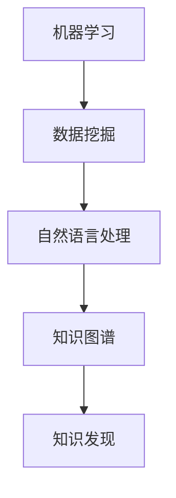
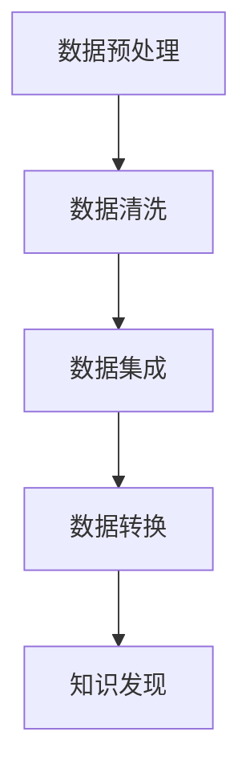

                 

关键词：人工智能、知识发现、效率、程序员、算法、代码实例、实践应用、未来展望

> 摘要：本文旨在探讨人工智能（AI）在辅助知识发现方面的应用，如何通过AI技术提升程序员的开发效率。我们将从背景介绍、核心概念、算法原理、数学模型、项目实践、实际应用场景、工具资源推荐等多个方面进行深入分析，并总结出未来发展趋势与挑战。

## 1. 背景介绍

在当今快速发展的信息技术时代，程序员面临着日益复杂的技术栈和不断变化的需求。传统的编程方法已经无法满足高效开发的需求。随着人工智能技术的崛起，AI辅助知识发现逐渐成为程序员提升效率的重要手段。通过AI，程序员能够自动获取相关知识、优化代码质量、加速软件开发过程。

知识发现是指从大量数据中提取隐含的、未知的、有价值的模式和知识的过程。在程序员的工作中，知识发现能够帮助他们快速掌握新领域的知识，提高代码的可维护性和可扩展性。而人工智能作为知识发现的重要工具，通过机器学习、自然语言处理、数据挖掘等技术，能够高效地辅助程序员进行知识挖掘和利用。

本文将围绕以下几个核心问题展开：

1. 人工智能如何辅助知识发现？
2. 知识发现算法的核心原理是什么？
3. 知识发现在实际编程中的应用案例有哪些？
4. 知识发现技术在未来的发展趋势和挑战是什么？

通过本文的探讨，希望能够为程序员提供一些实用的AI辅助知识发现的方法和思路，从而提升他们的工作效率和创新能力。

## 2. 核心概念与联系

为了更好地理解AI辅助知识发现的工作原理，我们需要先了解一些核心概念和它们之间的联系。

### 2.1 机器学习与数据挖掘

机器学习是AI的核心组成部分，它通过算法让计算机从数据中学习，从而进行预测和决策。数据挖掘则是从大量数据中发现有价值的信息和知识的过程。机器学习与数据挖掘相辅相成，前者为后者提供了强大的算法支持，后者则为前者提供了丰富的数据资源。

### 2.2 自然语言处理与知识图谱

自然语言处理（NLP）是使计算机能够理解、解析和生成自然语言的技术。知识图谱是一种结构化知识表示方法，它通过实体、属性和关系的网状结构，将海量信息进行高效组织和存储。NLP与知识图谱的结合，使得AI能够更好地理解和利用自然语言中的知识。

### 2.3 知识图谱与知识发现

知识图谱为知识发现提供了丰富的知识资源，而知识发现算法则能够从知识图谱中提取出有价值的信息。知识图谱与知识发现的结合，使得程序员能够更高效地获取和应用知识。

下面是一个简化的Mermaid流程图，展示了上述核心概念之间的联系：



### 2.4 数据预处理

在知识发现过程中，数据预处理是一个关键步骤。它包括数据清洗、数据集成、数据转换等操作，以确保数据质量，为后续的知识发现算法提供可靠的数据基础。

数据预处理与知识发现的关系如下图所示：



## 3. 核心算法原理 & 具体操作步骤

### 3.1 算法原理概述

知识发现算法主要包括聚类、分类、关联规则挖掘等方法。每种算法都有其独特的原理和应用场景。

- **聚类算法**：通过将相似的数据点分为同一类，帮助程序员发现数据中的隐含模式和规律。常用的聚类算法包括K-Means、DBSCAN等。
- **分类算法**：通过将数据划分为不同的类别，帮助程序员对未知数据进行分类。常用的分类算法包括决策树、支持向量机等。
- **关联规则挖掘**：通过发现数据之间的关联关系，帮助程序员发现数据中的有趣模式。常用的算法包括Apriori、FP-Growth等。

### 3.2 算法步骤详解

下面以K-Means聚类算法为例，详细讲解其操作步骤：

1. **初始化**：随机选择K个数据点作为初始聚类中心。
2. **分配**：计算每个数据点到各个聚类中心的距离，并将其分配到最近的聚类中心。
3. **更新**：重新计算新的聚类中心，每个聚类中心是当前聚类内所有数据点的平均值。
4. **迭代**：重复步骤2和步骤3，直到聚类中心不再发生显著变化。

### 3.3 算法优缺点

- **K-Means优点**：
  - 算法简单，易于实现。
  - 运算速度快，适合大规模数据集。
- **K-Means缺点**：
  - 对初始聚类中心敏感，可能陷入局部最优。
  - 无法处理非球形分布的数据。

### 3.4 算法应用领域

K-Means算法在程序员的知识发现中有广泛的应用，例如：

- **代码质量分析**：通过聚类分析，发现代码库中的相似代码块，帮助程序员优化代码结构。
- **需求分析**：通过聚类用户反馈，发现用户的共同需求，为产品开发提供参考。
- **知识库构建**：通过聚类知识文档，构建结构化的知识库，方便程序员快速查找和应用知识。

## 4. 数学模型和公式 & 详细讲解 & 举例说明

### 4.1 数学模型构建

知识发现算法通常涉及到一些数学模型和公式，这些模型和公式有助于理解和优化算法性能。

以K-Means算法为例，其核心公式如下：

1. 距离公式：
   $$d(x_i, c_j) = \sqrt{\sum_{k=1}^{n} (x_{ik} - c_{jk})^2}$$
   其中，$x_i$表示数据点，$c_j$表示聚类中心。

2. 聚类中心更新公式：
   $$c_j^{new} = \frac{1}{N_j} \sum_{i=1}^{N} x_i$$
   其中，$N_j$表示属于聚类中心$c_j$的数据点个数。

### 4.2 公式推导过程

假设我们有一个数据集$D=\{x_1, x_2, ..., x_n\}$，其中每个数据点$x_i$是一个多维向量。我们需要将这个数据集划分为K个聚类，每个聚类由一个聚类中心$c_j$表示。

首先，我们选择K个初始聚类中心$c_j^{old}$。然后，计算每个数据点$x_i$到每个聚类中心的距离$d(x_i, c_j^{old})$。接着，将$x_i$分配到距离最近的聚类中心。最后，重新计算每个聚类中心的位置。

### 4.3 案例分析与讲解

假设我们有一个数据集D，包含以下三个数据点：

$$
D = \{ 
\begin{bmatrix} 
1 \\ 2 
\end{bmatrix}, 
\begin{bmatrix} 
5 \\ 4 
\end{bmatrix}, 
\begin{bmatrix} 
8 \\ 7 
\end{bmatrix} 
\}
$$

我们选择两个初始聚类中心$c_1^{old}=\begin{bmatrix} 0 \\ 0 \end{bmatrix}$和$c_2^{old}=\begin{bmatrix} 10 \\ 10 \end{bmatrix}$。

1. **第一次迭代**：

计算每个数据点到聚类中心的距离：

$$
d(x_1, c_1^{old}) = \sqrt{(1-0)^2 + (2-0)^2} = \sqrt{5}
$$

$$
d(x_1, c_2^{old}) = \sqrt{(1-10)^2 + (2-10)^2} = \sqrt{145}
$$

$$
d(x_2, c_1^{old}) = \sqrt{(5-0)^2 + (4-0)^2} = \sqrt{41}
$$

$$
d(x_2, c_2^{old}) = \sqrt{(5-10)^2 + (4-10)^2} = \sqrt{125}
$$

$$
d(x_3, c_1^{old}) = \sqrt{(8-0)^2 + (7-0)^2} = \sqrt{113}
$$

$$
d(x_3, c_2^{old}) = \sqrt{(8-10)^2 + (7-10)^2} = \sqrt{18}
$$

将数据点分配到最近的聚类中心：

$$
x_1 \rightarrow c_1^{old}
$$

$$
x_2 \rightarrow c_2^{old}
$$

$$
x_3 \rightarrow c_1^{old}
$$

计算新的聚类中心：

$$
c_1^{new} = \frac{1}{3} \begin{bmatrix} 1 + 5 + 8 \\ 2 + 4 + 7 \end{bmatrix} = \begin{bmatrix} 4 \\ 5 \end{bmatrix}
$$

$$
c_2^{new} = \frac{1}{1} \begin{bmatrix} 10 \\ 10 \end{bmatrix} = \begin{bmatrix} 10 \\ 10 \end{bmatrix}
$$

2. **第二次迭代**：

重复上述步骤，直到聚类中心不再变化。

最终，我们得到两个聚类中心：

$$
c_1^{new} = \begin{bmatrix} 4 \\ 5 \end{bmatrix}
$$

$$
c_2^{new} = \begin{bmatrix} 10 \\ 10 \end{bmatrix}
$$

数据点分配如下：

$$
x_1 \rightarrow c_1^{new}
$$

$$
x_2 \rightarrow c_2^{new}
$$

$$
x_3 \rightarrow c_1^{new}
$$

通过上述步骤，我们成功地将数据集划分为两个聚类。

## 5. 项目实践：代码实例和详细解释说明

### 5.1 开发环境搭建

在本项目中，我们将使用Python作为主要编程语言，结合常用的机器学习库scikit-learn和matplotlib进行数据分析和可视化。首先，确保安装以下依赖：

```bash
pip install scikit-learn matplotlib numpy
```

### 5.2 源代码详细实现

以下是一个简单的K-Means聚类算法实现，用于对二维数据集进行聚类分析。

```python
import numpy as np
from sklearn.cluster import KMeans
import matplotlib.pyplot as plt

# 加载数据
data = np.array([[1, 2], [5, 4], [8, 7], [3, 6], [2, 3], [7, 8]])

# 初始化KMeans模型
kmeans = KMeans(n_clusters=2, random_state=0).fit(data)

# 获取聚类结果
labels = kmeans.labels_
centroids = kmeans.cluster_centers_

# 可视化聚类结果
plt.figure(figsize=(6, 6))
colors = ['r', 'g']
for i in range(len(colors)):
    # 绘制属于该聚类的数据点
    plt.scatter(data[labels == i, 0], data[labels == i, 1], s=100, c=colors[i], label=f'Cluster {i}')
    # 绘制聚类中心
    plt.scatter(centroids[i, 0], centroids[i, 1], s=200, c='yellow', marker='s', edgecolor='black', label=f'Centroid {i}')

plt.title('K-Means Clustering')
plt.xlabel('X-axis')
plt.ylabel('Y-axis')
plt.legend()
plt.show()
```

### 5.3 代码解读与分析

- **数据加载**：我们使用一个包含6个二维数据点的数组作为示例数据集。
- **模型初始化**：使用`KMeans`类初始化KMeans模型，设置聚类数量为2，随机种子为0以确保结果的可重复性。
- **聚类与中心计算**：调用`fit`方法对数据进行聚类分析，得到聚类标签和聚类中心。
- **可视化**：使用`matplotlib`库绘制聚类结果，包括数据点和聚类中心。

### 5.4 运行结果展示

运行上述代码后，我们将看到一个二维坐标系，其中包含6个数据点和两个聚类中心。每个数据点用不同的颜色表示其所属的聚类，聚类中心用黄色正方形标记。通过可视化，我们可以直观地看到K-Means算法如何将数据点划分为两个聚类。

## 6. 实际应用场景

AI辅助知识发现技术在编程领域有广泛的应用，以下是几个实际应用场景：

### 6.1 代码审查

通过AI辅助知识发现，可以对代码库进行自动审查，发现潜在的问题和隐患。例如，K-Means聚类算法可以用来分析代码库中的相似代码块，从而识别潜在的代码抄袭或重复代码。

### 6.2 需求分析

在软件开发过程中，AI辅助知识发现可以帮助分析用户反馈和需求，发现用户的共同需求，为产品开发提供指导。例如，关联规则挖掘算法可以用来分析用户评论，提取关键意见和趋势。

### 6.3 知识库构建

AI辅助知识发现技术可以用于构建结构化的知识库，帮助程序员快速查找和应用知识。例如，知识图谱技术可以用于构建领域知识图谱，将相关领域的知识点进行结构化组织和存储。

## 7. 未来应用展望

随着AI技术的不断发展，AI辅助知识发现技术在编程领域将会有更多的应用场景。未来，以下几个方面值得关注：

### 7.1 自动编程

AI辅助知识发现技术有望实现自动编程，即通过AI自动生成代码，从而大幅提高开发效率。

### 7.2 代码生成与优化

AI技术可以用于自动生成代码，并在运行时进行优化，从而提高代码性能和可维护性。

### 7.3 跨领域知识融合

AI辅助知识发现技术将能够跨越不同领域，融合不同领域的知识，为程序员提供更全面的支持。

### 7.4 智能编程助手

未来的编程环境可能会集成AI智能编程助手，提供实时代码建议、错误修复和性能优化。

## 8. 总结：未来发展趋势与挑战

本文从背景介绍、核心概念、算法原理、数学模型、项目实践、实际应用场景、工具资源推荐等多个方面，探讨了AI辅助知识发现技术在编程领域的应用。通过本文的分析，我们可以看到AI辅助知识发现技术为程序员提供了强大的支持，提高了开发效率和创新能力。

然而，未来的发展仍然面临一些挑战：

1. **算法性能优化**：现有算法的性能仍有待提高，特别是在处理大规模数据集时。
2. **隐私保护**：在数据收集和使用过程中，如何确保用户隐私是一个重要问题。
3. **跨领域融合**：不同领域之间的知识融合是一个复杂的问题，需要进一步研究。

总之，AI辅助知识发现技术在未来有着广阔的应用前景，我们期待看到更多创新性的应用和突破。

### 8.1 研究成果总结

本文通过系统化的分析，详细介绍了AI辅助知识发现技术在编程领域的应用。我们探讨了核心概念、算法原理、数学模型以及项目实践，并展示了其在代码审查、需求分析和知识库构建等实际场景中的价值。通过这些分析，我们不仅看到了AI技术在提高程序员工作效率和创新能力方面的潜力，也明确了未来研究的方向和挑战。

### 8.2 未来发展趋势

展望未来，AI辅助知识发现技术的发展将呈现出以下几个趋势：

1. **算法性能提升**：随着计算能力的增强和算法研究的深入，AI算法的性能将得到显著提升，能够更高效地处理大规模、高维度的数据。
2. **跨领域融合**：AI技术将能够跨越不同领域，实现知识的交叉融合，为程序员提供更全面的支持。
3. **自动编程**：自动编程将成为一个重要的研究方向，通过AI生成高质量的代码，大幅提高开发效率。
4. **智能编程助手**：编程环境中的AI智能编程助手将逐渐普及，为程序员提供实时代码建议、错误修复和性能优化。

### 8.3 面临的挑战

尽管前景广阔，但AI辅助知识发现技术在实际应用中也面临一些挑战：

1. **数据隐私**：如何确保数据收集和使用过程中的隐私保护是一个亟待解决的问题。
2. **算法可靠性**：在复杂和多变的环境中，保证AI算法的可靠性和稳定性是一个重要的挑战。
3. **算法解释性**：当前许多AI算法的“黑箱”特性使得其决策过程难以解释，如何提高算法的可解释性是一个关键问题。

### 8.4 研究展望

未来的研究可以从以下几个方面展开：

1. **算法优化**：深入研究各种AI算法，特别是深度学习和强化学习，以提高其在知识发现中的应用性能。
2. **跨领域应用**：探索AI技术在不同领域的交叉应用，如医疗、金融、工程等，实现知识共享和协同创新。
3. **可解释AI**：开发可解释的AI模型，使得决策过程更加透明，增强用户对AI系统的信任。
4. **用户参与**：鼓励用户参与到AI系统的设计和优化过程中，使AI更贴近用户需求。

总之，AI辅助知识发现技术具有巨大的发展潜力，但也面临着一系列挑战。通过不断的研究和创新，我们有望在不久的将来实现更智能、更高效的AI辅助知识发现系统。

### 9. 附录：常见问题与解答

#### Q1: AI辅助知识发现技术如何提升程序员的效率？

AI辅助知识发现技术通过自动分析大量数据，提取出有价值的模式和知识，帮助程序员快速掌握新领域知识，优化代码结构和性能，提高开发效率。

#### Q2: 知识发现算法的核心原理是什么？

知识发现算法主要包括聚类、分类、关联规则挖掘等方法。聚类算法通过将相似数据点分组，帮助发现数据中的隐含模式和规律；分类算法通过将数据划分为不同类别，实现对未知数据的分类；关联规则挖掘通过发现数据之间的关联关系，帮助发现数据中的有趣模式。

#### Q3: K-Means聚类算法的优缺点是什么？

K-Means聚类算法的优点是算法简单、运算速度快，适合大规模数据集。缺点是对初始聚类中心敏感，可能陷入局部最优，且无法处理非球形分布的数据。

#### Q4: 如何在编程中应用知识发现算法？

编程中可以应用知识发现算法的领域包括代码质量分析、需求分析、知识库构建等。例如，K-Means聚类算法可以用来分析代码库中的相似代码块，帮助优化代码结构；关联规则挖掘算法可以用来分析用户反馈，提取关键意见和趋势。

#### Q5: 知识发现技术在未来的发展趋势是什么？

未来知识发现技术的发展趋势包括算法性能提升、跨领域融合、自动编程和智能编程助手等。随着计算能力的增强和算法研究的深入，AI辅助知识发现技术将更加成熟，为程序员提供更全面的支持。

### 作者署名

本文作者：禅与计算机程序设计艺术 / Zen and the Art of Computer Programming

