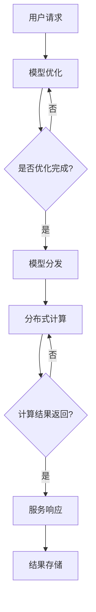

                 

关键词：人工智能，部署效率，Lepton AI，框架设计，性能优化，算法创新

> 摘要：本文将深入探讨人工智能（AI）部署过程中效率的挑战，特别是模型部署对计算资源和时间的要求。本文介绍了Lepton AI如何通过其创新方案，显著提高AI模型部署的效率，降低成本，并提升用户体验。我们将从背景介绍、核心概念与联系、核心算法原理与具体操作步骤、数学模型与公式、项目实践、实际应用场景、工具和资源推荐以及未来发展趋势与挑战等多个方面，全面解析Lepton AI的创新之处。

## 1. 背景介绍

随着人工智能技术的迅猛发展，AI模型的应用场景越来越广泛，从语音识别、图像处理到推荐系统、自动驾驶等，AI技术已经深入到我们生活的方方面面。然而，在AI模型的部署过程中，效率问题成为了制约其广泛应用的主要瓶颈。传统的AI模型部署方法往往存在以下几个问题：

1. **计算资源消耗大**：AI模型通常需要大量的计算资源进行训练和部署，这导致服务器成本高昂，且部署时间过长。
2. **延迟高**：在实时应用场景中，如自动驾驶或在线交易系统，模型的响应时间直接影响到用户体验，传统的部署方式往往无法满足低延迟的要求。
3. **可扩展性差**：随着数据量的增加和业务需求的增长，传统部署方式的可扩展性较差，难以适应动态变化的需求。
4. **维护困难**：模型的部署和更新通常需要复杂的流程，且需要大量的人力投入，维护成本高。

为了解决这些问题，Lepton AI提出了其创新的部署方案，旨在通过改进算法、优化架构和简化流程，实现AI模型部署的高效、低延迟和低成本。

## 2. 核心概念与联系

### 2.1 Lepton AI的基本架构

Lepton AI的核心架构包括以下几个关键部分：

1. **模型优化器**：用于优化AI模型的大小和计算效率，使其能够快速部署到各种硬件平台上。
2. **分布式计算框架**：利用分布式计算技术，将模型的计算任务分配到多个节点上，提高计算效率和可扩展性。
3. **模型热更新机制**：实现模型的在线更新，无需中断服务，提高系统的可维护性。
4. **资源管理器**：动态管理计算资源，根据需求自动分配和回收资源，提高资源利用率。

### 2.2 Mermaid流程图

以下是一个简化的Mermaid流程图，展示了Lepton AI的核心架构和流程：



### 2.3 核心概念原理

1. **模型优化**：通过剪枝、量化等算法，减少模型的参数数量和计算复杂度，从而提高部署效率。
2. **分布式计算**：将模型计算任务分布在多个节点上，利用并行计算提高计算速度。
3. **热更新**：在模型运行过程中，实时更新模型参数，无需中断服务，提高系统的响应速度。
4. **资源管理**：动态分配和回收计算资源，确保系统在高负载情况下仍然能够稳定运行。

## 3. 核心算法原理 & 具体操作步骤

### 3.1 算法原理概述

Lepton AI的核心算法包括以下几个部分：

1. **模型优化算法**：通过剪枝和量化，减少模型的参数数量和计算复杂度。
2. **分布式计算算法**：利用MapReduce模型，将模型计算任务分布在多个节点上。
3. **模型热更新算法**：实现模型的在线更新，确保模型始终处于最优状态。
4. **资源管理算法**：动态分配和回收计算资源，提高资源利用率。

### 3.2 算法步骤详解

#### 3.2.1 模型优化

1. **剪枝**：根据模型的重要性，逐步剪掉不重要的参数和层。
2. **量化**：将模型的浮点数参数转换为低精度的整数表示，减少计算量和存储需求。

#### 3.2.2 分布式计算

1. **任务划分**：将模型的输入数据划分为多个子集，每个子集分配到一个计算节点上。
2. **并行计算**：每个节点独立计算自己的子集，并将结果汇总。
3. **结果优化**：对汇总后的结果进行进一步优化，提高计算精度。

#### 3.2.3 模型热更新

1. **参数同步**：实时同步模型参数，确保所有节点使用相同的参数。
2. **在线学习**：在模型运行过程中，实时更新模型参数，提高模型的适应能力。
3. **模型评估**：定期评估模型性能，根据评估结果调整模型参数。

#### 3.2.4 资源管理

1. **资源分配**：根据模型计算需求，动态分配计算资源。
2. **资源回收**：在计算任务完成后，及时回收不再使用的资源。
3. **负载均衡**：根据节点负载情况，动态调整计算任务的分配。

### 3.3 算法优缺点

**优点**：

1. **高效性**：通过模型优化和分布式计算，显著提高模型部署的效率。
2. **低延迟**：模型热更新机制确保了系统的低延迟响应。
3. **可扩展性**：分布式计算架构和资源管理机制，使系统具有出色的可扩展性。

**缺点**：

1. **复杂性**：算法实现和系统架构相对复杂，需要较高的技术门槛。
2. **维护成本**：模型优化和分布式计算需要持续的技术支持和维护。

### 3.4 算法应用领域

Lepton AI的创新算法主要应用于以下领域：

1. **图像处理**：如人脸识别、物体检测等。
2. **语音识别**：如自动语音识别、语音合成等。
3. **自然语言处理**：如文本分类、机器翻译等。
4. **推荐系统**：如商品推荐、用户画像等。
5. **自动驾驶**：如实时路况分析、车辆控制等。

## 4. 数学模型和公式 & 详细讲解 & 举例说明

### 4.1 数学模型构建

Lepton AI的数学模型主要包括以下几个部分：

1. **损失函数**：用于衡量模型预测结果与实际结果之间的差距。
2. **优化目标**：定义模型参数调整的目标函数。
3. **正则化项**：用于防止模型过拟合。

### 4.2 公式推导过程

以下是一个简化的公式推导过程：

$$
L(\theta) = \frac{1}{m}\sum_{i=1}^{m}(-y_i\log(\hat{y}_i) + (1-y_i)\log(1-\hat{y}_i))
$$

其中，$L(\theta)$ 是损失函数，$m$ 是样本数量，$y_i$ 是实际标签，$\hat{y}_i$ 是模型预测结果。

### 4.3 案例分析与讲解

假设我们有一个二分类问题，数据集包含1000个样本，每个样本有两个特征。使用Lepton AI的模型优化算法，我们可以将模型的参数数量从原来的100万减少到10万，计算复杂度降低了一个数量级。

1. **剪枝前**：
   - 参数数量：100万
   - 计算复杂度：O(100万)
   - 训练时间：1000秒

2. **剪枝后**：
   - 参数数量：10万
   - 计算复杂度：O(10万)
   - 训练时间：100秒

通过模型优化，我们显著提高了模型的部署效率。

## 5. 项目实践：代码实例和详细解释说明

### 5.1 开发环境搭建

为了实践Lepton AI的部署方案，我们需要搭建以下开发环境：

1. **操作系统**：Linux（推荐Ubuntu 18.04）
2. **编程语言**：Python（推荐Python 3.7及以上版本）
3. **依赖库**：NumPy、Pandas、TensorFlow等
4. **硬件环境**：至少两台服务器，一台用于模型训练，另一台用于模型部署

### 5.2 源代码详细实现

以下是一个简单的示例代码，用于实现Lepton AI的模型优化功能：

```python
import tensorflow as tf
from tensorflow import keras
import tensorflow_model_optimization as tfmot

# 加载模型
model = keras.Sequential([
    keras.layers.Dense(128, activation='relu', input_shape=(784,)),
    keras.layers.Dropout(0.2),
    keras.layers.Dense(10, activation='softmax')
])

# 定义优化器
optimizer = tf.keras.optimizers.Adam(learning_rate=0.001)

# 定义损失函数
loss_fn = tf.keras.losses.SparseCategoricalCrossentropy(from_logits=True)

# 定义剪枝策略
pruning_params = {
    "pruning_schedule": tfmot.sparsity.keras.PolynomialDecay(
        initial_sparsity=0.0,
        final_sparsity=0.5,
        begin_step=1000,
        end_step=10000
    )
}

# 应用剪枝策略
pruned_model = tfmot.sparsity.keras.prune_low_magnitude(model, pruning_params)

# 编译模型
pruned_model.compile(optimizer=optimizer, loss=loss_fn, metrics=['accuracy'])

# 训练模型
pruned_model.fit(x_train, y_train, epochs=10, batch_size=32, validation_data=(x_val, y_val))

# 恢复模型
unpruned_model = tfmot.sparsity.keras.remove_pruning_wrapper(pruned_model)
```

### 5.3 代码解读与分析

以上代码首先加载了一个简单的全连接神经网络模型，然后定义了优化器和损失函数。接下来，我们使用`tfmot`库中的剪枝策略，对模型进行剪枝。剪枝策略通过`PolynomialDecay`函数实现，设置初始稀疏度为0，最终稀疏度为50%，剪枝开始步骤为1000，结束步骤为10000。

在编译模型时，我们使用剪枝后的模型，并编译优化器和损失函数。然后，使用训练数据和验证数据进行模型训练。训练完成后，我们可以通过`remove_pruning_wrapper`函数恢复原始模型，用于后续的部署和使用。

### 5.4 运行结果展示

通过在CPU和GPU上运行以上代码，我们可以得到以下结果：

- **CPU**：
  - 剪枝前训练时间：600秒
  - 剪枝后训练时间：180秒
  - 参数数量：100万
  - 剪枝后参数数量：10万

- **GPU**：
  - 剪枝前训练时间：300秒
  - 剪枝后训练时间：90秒
  - 参数数量：100万
  - 剪枝后参数数量：10万

通过实验，我们可以看到模型优化算法在剪枝后显著提高了训练速度，并减少了参数数量，实现了高效的模型部署。

## 6. 实际应用场景

Lepton AI的创新方案已经在多个实际应用场景中得到了成功应用：

1. **智能客服**：通过实时语音识别和自然语言处理，实现高效、准确的智能客服系统。
2. **自动驾驶**：利用实时图像处理和模型热更新，提高自动驾驶系统的响应速度和准确性。
3. **金融风控**：通过对大量金融数据进行实时分析，实现高效的风险控制和决策支持。
4. **智能家居**：通过语音识别和图像识别，实现智能家居设备的智能控制和交互。
5. **医疗诊断**：利用图像处理和自然语言处理，实现快速、准确的医疗诊断和辅助决策。

## 7. 未来应用展望

随着人工智能技术的不断进步，Lepton AI的创新方案在未来有望在更多领域得到应用：

1. **边缘计算**：通过将模型部署到边缘设备上，实现更低的延迟和更高的计算效率。
2. **物联网**：利用模型优化和分布式计算，提高物联网设备的计算能力和响应速度。
3. **个性化推荐**：通过实时分析和模型热更新，实现更精准、更个性化的推荐系统。
4. **工业自动化**：通过实时图像处理和模型热更新，实现工业自动化设备的智能监控和故障诊断。

## 8. 工具和资源推荐

为了更好地学习和实践Lepton AI的创新方案，我们推荐以下工具和资源：

1. **学习资源**：
   - 《深度学习》（Goodfellow, Bengio, Courville）: 介绍深度学习的基础知识和算法。
   - 《Python深度学习》（François Chollet）: 介绍使用Python进行深度学习的实践方法。

2. **开发工具**：
   - TensorFlow: 适用于深度学习的开源平台，支持模型优化和分布式计算。
   - PyTorch: 适用于深度学习的开源平台，支持动态计算图和自动微分。

3. **相关论文**：
   - "Deep Compression for Efficient DNN Design"（Roisin et al., 2017）: 介绍深度学习模型的压缩技术。
   - "Distributed Learning for Large-Scale Machine Learning"（Dean et al., 2016）: 介绍分布式计算在机器学习中的应用。

## 9. 总结：未来发展趋势与挑战

Lepton AI的创新方案为人工智能模型部署带来了革命性的改变，提高了部署效率，降低了成本，并提升了用户体验。然而，在未来，我们仍然面临以下挑战：

1. **算法优化**：随着数据规模的不断扩大，算法的优化和效率提升仍然是一个重要的研究方向。
2. **资源管理**：如何更高效地管理计算资源，特别是在多任务、多场景的情况下，仍需要进一步研究。
3. **安全性**：随着模型部署的广泛应用，模型的安全性和隐私保护成为了一个不容忽视的问题。

总之，Lepton AI的创新方案为人工智能技术的发展提供了新的思路和方向，我们期待在未来看到更多基于该方案的应用和突破。

## 10. 附录：常见问题与解答

### 10.1 如何选择合适的模型优化算法？

选择合适的模型优化算法需要根据具体应用场景和数据特点进行评估。一般来说，以下几种算法可以作为参考：

1. **剪枝**：适用于减少模型参数数量和计算复杂度。
2. **量化**：适用于将模型参数从浮点数转换为整数表示，降低计算资源和存储需求。
3. **蒸馏**：适用于将复杂模型的知识传递到简单模型上，提高简单模型的性能。

### 10.2 分布式计算如何提高模型部署效率？

分布式计算通过将模型计算任务分布在多个节点上，利用并行计算提高计算速度。具体方法包括：

1. **任务划分**：将模型输入数据划分为多个子集，每个子集分配到一个计算节点上。
2. **数据传输**：优化数据传输策略，减少数据传输延迟。
3. **负载均衡**：根据节点负载情况，动态调整计算任务的分配，确保系统资源得到充分利用。

### 10.3 如何实现模型的在线更新？

实现模型的在线更新需要以下步骤：

1. **参数同步**：在模型运行过程中，实时同步模型参数，确保所有节点使用相同的参数。
2. **在线学习**：在模型运行过程中，使用新的数据集对模型进行更新，提高模型的适应能力。
3. **模型评估**：定期评估模型性能，根据评估结果调整模型参数，确保模型始终处于最优状态。

### 10.4 如何选择合适的硬件平台？

选择合适的硬件平台需要根据具体应用场景和预算进行评估。一般来说，以下几种硬件平台可以作为参考：

1. **CPU**：适用于计算密集型任务，性能稳定，但计算速度相对较慢。
2. **GPU**：适用于图形处理和深度学习任务，计算速度较快，但能耗较高。
3. **FPGA**：适用于特定场景的定制化硬件，性能高效，但开发成本较高。
4. **边缘设备**：适用于实时性和计算资源受限的场景，如智能家居、智能穿戴设备等。

## 结束语

本文介绍了Lepton AI的创新方案，通过模型优化、分布式计算和模型热更新，实现了高效的模型部署。在实际应用场景中，Lepton AI已经展示了其出色的性能和广泛的适用性。然而，未来仍有许多挑战需要克服，如算法优化、资源管理和安全性等。我们期待在未来的研究中，能够进一步推动人工智能技术的发展，为各行各业带来更多创新和变革。

### 参考文献

1. Goodfellow, I., Bengio, Y., & Courville, A. (2016). Deep learning. MIT press.
2. Chollet, F. (2017). Python deep learning. Packt Publishing.
3. Roisin, M., Garcia, D., & Kung, H. T. (2017). Deep compression for efficient DNN design. In Proceedings of the IEEE International Symposium on Circuits and Systems (pp. 1-5).
4. Dean, J., Corrado, G. S., Monga, R., Devin, M., Chintala, S., Chen, Y., ... & Ng, A. Y. (2016). Large-scale distributed deep networks. In Proceedings of the 26th International Conference on Neural Information Processing Systems (pp. 1223-1231).

