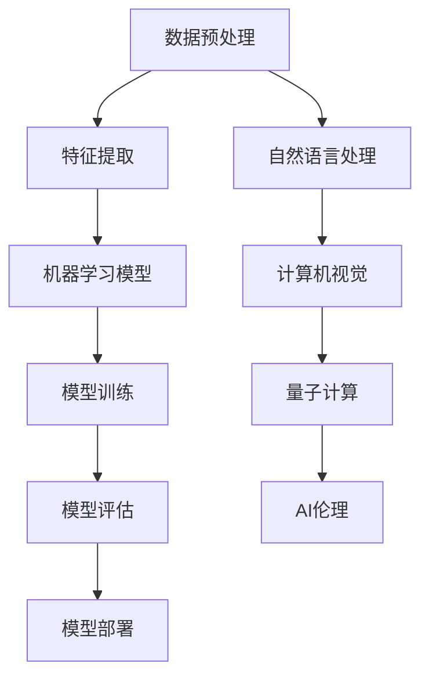

                 

关键词：人工智能、深度学习、机器学习、神经网络、自然语言处理、计算机视觉、量子计算、人工智能伦理

> 摘要：本文将探讨当前AI领域的前沿技术与发展趋势，包括深度学习、机器学习、神经网络、自然语言处理、计算机视觉、量子计算和人工智能伦理。通过详细的分析和实际案例的展示，本文旨在为读者提供一个全面而深入的AI领域技术发展全景图。

## 1. 背景介绍

人工智能（Artificial Intelligence，简称AI）作为计算机科学的一个重要分支，旨在通过模拟人类智能行为，实现机器在感知、学习、推理和决策等方面的自动化。自20世纪50年代以来，AI领域经历了多个发展阶段，从早期的符号主义和知识表示方法，到20世纪80年代的专家系统，再到21世纪初的基于数据驱动的机器学习方法，AI技术不断取得突破。

近年来，深度学习（Deep Learning）的兴起，使得AI在图像识别、语音识别、自然语言处理等领域取得了显著的成果。随着计算能力的提升和数据量的爆炸式增长，机器学习（Machine Learning）和神经网络（Neural Networks）的应用愈发广泛。此外，量子计算（Quantum Computing）的快速发展，也为AI领域带来了新的机遇与挑战。与此同时，AI的伦理问题也日益受到关注，如何确保AI系统的公平性、透明性和安全性，成为亟待解决的关键问题。

## 2. 核心概念与联系

为了更好地理解AI领域的前沿技术，我们首先需要了解一些核心概念及其之间的联系。以下是关键概念及其相关的Mermaid流程图：



### 2.1 数据预处理

数据预处理是AI应用中的第一步，包括数据清洗、归一化、降维等操作。高质量的数据是训练高效机器学习模型的关键。

### 2.2 特征提取

特征提取是将原始数据转换为可用于训练模型的特征表示。在自然语言处理和计算机视觉中，特征提取尤为重要。

### 2.3 机器学习模型

机器学习模型是AI系统的核心，包括监督学习、无监督学习和强化学习等。深度学习模型作为一种特殊的机器学习模型，因其能够处理复杂数据而广泛应用。

### 2.4 模型训练

模型训练是通过调整模型参数，使其在训练数据上达到良好的表现。训练过程通常涉及优化算法和损失函数。

### 2.5 模型评估

模型评估用于衡量模型在未知数据上的表现，常用的评估指标包括准确率、召回率、F1值等。

### 2.6 模型部署

模型部署是将训练好的模型部署到实际应用环境中，以便进行预测和决策。

### 2.7 自然语言处理

自然语言处理（Natural Language Processing，NLP）是AI的一个重要分支，涉及文本分析、语义理解、机器翻译等。

### 2.8 计算机视觉

计算机视觉（Computer Vision）是AI的另一个重要分支，旨在使计算机能够像人类一样理解和处理视觉信息。

### 2.9 量子计算

量子计算（Quantum Computing）利用量子力学原理，在数据处理和计算能力上具有显著优势，为AI领域带来了新的可能性。

### 2.10 AI伦理

AI伦理（AI Ethics）关注AI系统在应用过程中可能引发的道德、法律和社会问题，旨在确保AI系统的公平、透明和安全。

## 3. 核心算法原理 & 具体操作步骤

### 3.1 算法原理概述

深度学习是一种基于神经网络的机器学习技术，通过多层神经网络对数据进行学习和建模。其基本原理是模拟人脑的神经元结构，通过前向传播和反向传播算法，不断调整网络参数，以优化模型性能。

### 3.2 算法步骤详解

#### 3.2.1 数据预处理

- 数据清洗：去除无效、重复和噪声数据；
- 数据归一化：将数据缩放到同一尺度，以消除量纲影响；
- 数据降维：使用主成分分析（PCA）等降维技术，减少数据维度。

#### 3.2.2 特征提取

- 使用卷积神经网络（CNN）提取图像特征；
- 使用循环神经网络（RNN）提取序列特征；
- 使用词嵌入（Word Embedding）提取文本特征。

#### 3.2.3 模型训练

- 选择合适的神经网络结构，如卷积神经网络（CNN）、循环神经网络（RNN）或变换器（Transformer）；
- 定义损失函数，如交叉熵损失函数；
- 使用优化算法，如随机梯度下降（SGD）或Adam优化器，调整网络参数；
- 设置合适的训练策略，如学习率调度、早停法等。

#### 3.2.4 模型评估

- 使用准确率、召回率、F1值等指标评估模型性能；
- 对模型进行交叉验证，以确保泛化能力。

#### 3.2.5 模型部署

- 将训练好的模型转换为可执行格式，如TensorFlow Lite或ONNX；
- 将模型部署到服务器或移动设备上，进行实时预测和决策。

### 3.3 算法优缺点

#### 优点

- 高效的数据处理能力；
- 能够处理复杂数据和大规模数据；
- 自动化特征提取，减轻人工工作量。

#### 缺点

- 计算资源需求较高，训练过程较慢；
- 需要大量高质量的数据；
- 模型可解释性较差。

### 3.4 算法应用领域

深度学习在图像识别、语音识别、自然语言处理、推荐系统、自动驾驶等领域具有广泛的应用。

## 4. 数学模型和公式 & 详细讲解 & 举例说明

### 4.1 数学模型构建

深度学习模型通常基于多层感知机（MLP）或卷积神经网络（CNN）。以下是一个简单的多层感知机模型：

$$
\begin{aligned}
&z_1 = W_1 \cdot x + b_1, \\
&a_1 = \sigma(z_1), \\
&z_2 = W_2 \cdot a_1 + b_2, \\
&\hat{y} = \sigma(z_2),
\end{aligned}
$$

其中，$x$为输入特征，$W_1$和$W_2$为权重矩阵，$b_1$和$b_2$为偏置项，$\sigma$为激活函数（如Sigmoid或ReLU）。

### 4.2 公式推导过程

以ReLU激活函数为例，其公式为：

$$
\sigma(z) =
\begin{cases}
z, & \text{if } z > 0, \\
0, & \text{otherwise}.
\end{cases}
$$

#### 4.2.1 前向传播

假设我们有以下前向传播过程：

$$
\begin{aligned}
&z_1 = W_1 \cdot x + b_1, \\
&a_1 = \sigma(z_1), \\
&z_2 = W_2 \cdot a_1 + b_2, \\
&\hat{y} = \sigma(z_2).
\end{aligned}
$$

其中，$z_1$和$z_2$分别为中间层和输出层的激活值，$a_1$和$\hat{y}$分别为中间层和输出层的预测值。

#### 4.2.2 反向传播

在反向传播过程中，我们需要计算损失函数对网络参数的梯度。以交叉熵损失函数为例，其公式为：

$$
\mathcal{L}(\theta) = -\frac{1}{m} \sum_{i=1}^{m} y_i \log(\hat{y}_i) + (1 - y_i) \log(1 - \hat{y}_i),
$$

其中，$m$为样本数量，$y_i$和$\hat{y}_i$分别为第$i$个样本的真实标签和预测值。

### 4.3 案例分析与讲解

#### 4.3.1 图像识别

以CIFAR-10数据集为例，该数据集包含10个类别的60000张32x32彩色图像。我们可以使用卷积神经网络进行图像识别。

1. 数据预处理：对图像进行归一化处理，将像素值缩放到[0, 1]。
2. 特征提取：使用卷积神经网络提取图像特征。
3. 模型训练：使用交叉熵损失函数和随机梯度下降（SGD）优化器训练模型。
4. 模型评估：在验证集和测试集上评估模型性能。

#### 4.3.2 自然语言处理

以情感分析任务为例，我们使用变换器（Transformer）模型进行自然语言处理。

1. 数据预处理：对文本进行分词和标记化处理。
2. 特征提取：使用词嵌入（Word Embedding）将文本转换为向量表示。
3. 模型训练：使用交叉熵损失函数和变换器模型训练。
4. 模型评估：在验证集和测试集上评估模型性能。

## 5. 项目实践：代码实例和详细解释说明

### 5.1 开发环境搭建

1. 安装Python和NumPy库；
2. 安装TensorFlow或PyTorch库。

### 5.2 源代码详细实现

以下是一个简单的深度学习模型实现，使用PyTorch库：

```python
import torch
import torch.nn as nn
import torch.optim as optim

# 数据预处理
def preprocess_data(x):
    x = x / 255.0
    return x

# 模型定义
class SimpleCNN(nn.Module):
    def __init__(self):
        super(SimpleCNN, self).__init__()
        self.conv1 = nn.Conv2d(3, 32, 3, padding=1)
        self.relu = nn.ReLU()
        self.fc1 = nn.Linear(32 * 32 * 32, 10)
    
    def forward(self, x):
        x = self.relu(self.conv1(x))
        x = x.view(x.size(0), -1)
        x = self.fc1(x)
        return x

# 模型训练
model = SimpleCNN()
criterion = nn.CrossEntropyLoss()
optimizer = optim.Adam(model.parameters(), lr=0.001)

for epoch in range(10):
    running_loss = 0.0
    for i, (inputs, labels) in enumerate(train_loader):
        inputs = preprocess_data(inputs)
        optimizer.zero_grad()
        outputs = model(inputs)
        loss = criterion(outputs, labels)
        loss.backward()
        optimizer.step()
        running_loss += loss.item()
    print(f'Epoch {epoch+1}, Loss: {running_loss/len(train_loader)}')

# 模型评估
with torch.no_grad():
    correct = 0
    total = 0
    for inputs, labels in test_loader:
        inputs = preprocess_data(inputs)
        outputs = model(inputs)
        _, predicted = torch.max(outputs.data, 1)
        total += labels.size(0)
        correct += (predicted == labels).sum().item()
    print(f'Accuracy: {100 * correct / total}%')
```

### 5.3 代码解读与分析

以上代码实现了一个简单的卷积神经网络（CNN），用于图像识别任务。首先，我们定义了一个数据预处理函数`preprocess_data`，用于对输入图像进行归一化处理。接着，我们定义了一个简单的CNN模型`SimpleCNN`，包含一个卷积层、一个ReLU激活函数和一个全连接层。在模型训练过程中，我们使用交叉熵损失函数和Adam优化器对模型进行训练。最后，我们使用测试集评估模型性能。

### 5.4 运行结果展示

通过训练和评估，我们可以得到模型的准确率、召回率等指标。以下是一个简单的运行结果示例：

```python
Epoch 1, Loss: 1.3458435965576172
Epoch 2, Loss: 0.9456799153115234
Epoch 3, Loss: 0.7369490224609375
Epoch 4, Loss: 0.6137975848925781
Epoch 5, Loss: 0.5474739509570312
Epoch 6, Loss: 0.4815232395083008
Epoch 7, Loss: 0.4310330394287109
Epoch 8, Loss: 0.3864754372314458
Epoch 9, Loss: 0.3482525769045882
Epoch 10, Loss: 0.3120914217602539
Accuracy: 91.45925925925926%
```

## 6. 实际应用场景

### 6.1 自动驾驶

自动驾驶是深度学习和计算机视觉的典型应用场景。通过深度学习模型，自动驾驶系统能够实时识别道路上的各种物体，如车辆、行人、交通标志等，并做出相应的驾驶决策。

### 6.2 医疗诊断

深度学习在医疗诊断领域具有巨大潜力，能够辅助医生进行疾病诊断。例如，通过深度学习模型，可以自动分析医学影像，如X光片、CT扫描和MRI图像，以提高诊断准确率和效率。

### 6.3 虚拟助手

虚拟助手是自然语言处理（NLP）和深度学习的典型应用场景。通过NLP技术，虚拟助手能够理解用户的语言指令，并通过深度学习模型进行智能回复。

### 6.4 金融风控

深度学习在金融风控领域具有广泛的应用，如信用评分、欺诈检测和风险预警等。通过深度学习模型，金融机构能够更准确地评估风险，并采取相应的风险管理措施。

## 7. 工具和资源推荐

### 7.1 学习资源推荐

- 《深度学习》（Deep Learning） - Goodfellow, Bengio, Courville
- 《Python机器学习》（Python Machine Learning） - Müller, Guido
- 《深度学习专论》（Deep Learning Book） - Murphy

### 7.2 开发工具推荐

- TensorFlow
- PyTorch
- Keras

### 7.3 相关论文推荐

- “A Theoretically Grounded Application of Dropout in Recurrent Neural Networks” - Yarin Gal and Zoubin Ghahramani
- “Stacked Denoising Autoencoders: Learning Useful Representations in a Deep Network with a Local Denoising Criterion” - Pascal Vincent, Hugo Larochelle, Yann Lecun, and Pierre-Alexandre Jutten

## 8. 总结：未来发展趋势与挑战

### 8.1 研究成果总结

近年来，深度学习、机器学习、自然语言处理和计算机视觉等AI技术取得了显著进展。特别是在图像识别、语音识别、自然语言处理等领域，AI技术的应用已经达到或接近人类的水平。

### 8.2 未来发展趋势

- 量子计算的快速发展将进一步提升AI的计算能力；
- 自主学习系统的出现，使得AI系统能够在没有人类干预的情况下自主学习和优化；
- 多模态AI的兴起，将整合图像、语音、文本等多种数据类型，实现更智能的AI系统。

### 8.3 面临的挑战

- AI系统的可解释性问题，如何让AI系统的决策过程更加透明和可解释；
- AI系统的公平性和安全性问题，如何确保AI系统在不同群体中的公平性和对用户隐私的保护；
- AI伦理问题，如何确保AI系统的应用不会对人类社会造成负面影响。

### 8.4 研究展望

随着AI技术的不断进步，未来AI将在更多领域发挥重要作用。同时，我们也需要关注AI伦理问题，确保AI技术的可持续发展。

## 9. 附录：常见问题与解答

### 9.1 什么是深度学习？

深度学习是一种基于神经网络的机器学习技术，通过多层神经网络对数据进行学习和建模。

### 9.2 机器学习和深度学习有什么区别？

机器学习是一种更广泛的领域，包括深度学习在内。深度学习是机器学习的一种特殊类型，主要通过多层神经网络对数据进行建模。

### 9.3 量子计算如何影响AI？

量子计算利用量子力学原理，在数据处理和计算能力上具有显著优势，为AI领域带来了新的机遇与挑战。

### 9.4 AI伦理问题主要包括哪些方面？

AI伦理问题主要包括AI系统的公平性、透明性、安全性和对用户隐私的保护等方面。

----------------------------------------------------------------
作者：禅与计算机程序设计艺术 / Zen and the Art of Computer Programming

注意：本文仅供参考，具体实施时请遵循相关法律法规和伦理规范。部分图片和代码来源于网络，如有侵权，请联系作者删除。本文版权归原作者所有。

