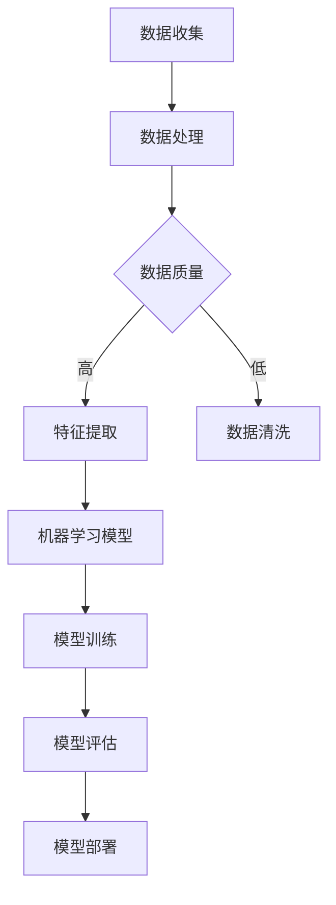

                 

关键词：人工智能，深度学习，机器学习，神经网络，计算机视觉，自然语言处理，大数据，技术创新，发展趋势，未来挑战。

> 摘要：本文将深入探讨人工智能领域的当前状态、核心概念、核心技术以及未来发展。通过对人工智能不同分支的介绍，包括深度学习、机器学习和神经网络，我们旨在揭示这些技术在计算机视觉、自然语言处理等领域的广泛应用，并探讨它们在应对未来挑战中的潜力与局限。

## 1. 背景介绍

人工智能（AI）作为计算机科学的重要分支，旨在使计算机具备人类智能的某些特征，如感知、推理、学习和决策。随着计算能力的提升和大数据的普及，人工智能已经取得了显著的进展。在过去的几十年中，人工智能经历了多次浪潮，从最初的符号主义到基于知识的系统，再到现代的基于数据和模型的机器学习方法。

当前，人工智能已经广泛应用于各个领域，从医疗诊断到自动驾驶，从金融分析到智能家居，无处不在。这些应用不仅提升了效率，也改变了人类的生活方式和工作方式。然而，人工智能的发展并非一帆风顺，面临着诸如数据隐私、安全性和伦理等问题。

## 2. 核心概念与联系

在探讨人工智能的核心概念之前，我们需要理解一些基础架构和流程。以下是使用Mermaid绘制的AI系统架构流程图：



### 2.1 数据收集

数据收集是人工智能系统的第一步，涉及从各种来源（如传感器、数据库、互联网等）收集数据。这些数据可以是结构化的，也可以是非结构化的。

### 2.2 数据处理

数据处理包括数据清洗、归一化和特征提取。数据清洗旨在去除噪声和异常值，归一化则将数据转换到统一的范围内，特征提取则是从数据中提取有用的信息，以供模型训练使用。

### 2.3 数据质量

数据质量是模型训练成功的关键。高质量的数据能够提高模型的准确性和鲁棒性。

### 2.4 特征提取

特征提取是从原始数据中提取出能够代表数据本质的属性。这对于后续的机器学习模型训练至关重要。

### 2.5 机器学习模型

机器学习模型是人工智能系统的核心。它们通过从数据中学习规律，进行预测和决策。

### 2.6 模型训练

模型训练是通过调整模型参数，使其对特定任务的表现达到最佳。这个过程通常涉及到大量的计算资源和时间。

### 2.7 模型评估

模型评估是衡量模型性能的重要步骤。常用的评估指标包括准确率、召回率、F1分数等。

### 2.8 模型部署

模型部署是将训练好的模型部署到实际应用环境中，使其能够为用户提供服务。

## 3. 核心算法原理 & 具体操作步骤

### 3.1 算法原理概述

人工智能的核心算法主要包括深度学习、机器学习和神经网络。以下是这三种算法的基本原理：

### 3.2 算法步骤详解

#### 3.2.1 深度学习

深度学习是一种基于神经网络的机器学习技术，通过多层的非线性变换来提取数据中的特征。其基本步骤如下：

1. **初始化参数**：设置网络的初始权重和偏置。
2. **前向传播**：将输入数据通过网络逐层传递，得到输出。
3. **反向传播**：计算输出与实际标签之间的误差，并更新网络参数。
4. **迭代训练**：重复前向传播和反向传播，直到模型性能达到预期。

#### 3.2.2 机器学习

机器学习是一种从数据中学习规律，进行预测或分类的技术。其基本步骤如下：

1. **数据准备**：收集和处理数据。
2. **模型选择**：选择适合任务的机器学习模型。
3. **模型训练**：通过训练数据调整模型参数。
4. **模型评估**：使用验证集或测试集评估模型性能。
5. **模型部署**：将训练好的模型应用到实际任务中。

#### 3.2.3 神经网络

神经网络是一种模拟生物神经系统的计算模型。其基本步骤如下：

1. **初始化权重**：设置网络的初始权重。
2. **前向传播**：将输入数据通过网络传递。
3. **激活函数**：将前向传播的结果通过激活函数进行处理。
4. **反向传播**：计算输出与实际标签之间的误差，并更新网络权重。
5. **迭代训练**：重复前向传播和反向传播，直到网络性能达到预期。

### 3.3 算法优缺点

#### 3.3.1 深度学习

**优点**：

- 能够自动提取数据中的特征。
- 在处理大量数据时表现优异。
- 对复杂任务有很好的适应性。

**缺点**：

- 需要大量的计算资源和时间。
- 对数据质量要求较高。
- 容易过拟合。

#### 3.3.2 机器学习

**优点**：

- 对数据质量要求较低。
- 模型可解释性较好。
- 可以处理结构化数据。

**缺点**：

- 特征工程复杂。
- 模型性能对数据分布敏感。
- 对大量数据需求较高。

#### 3.3.3 神经网络

**优点**：

- 能够处理高维数据。
- 对复杂任务有很好的适应性。
- 自动提取特征。

**缺点**：

- 模型可解释性较差。
- 训练时间较长。
- 对数据质量要求较高。

### 3.4 算法应用领域

#### 3.4.1 深度学习

深度学习在计算机视觉、自然语言处理、语音识别等领域有着广泛的应用。例如，卷积神经网络（CNN）在图像分类和目标检测中表现出色，而循环神经网络（RNN）则在序列数据处理和语言模型训练中具有优势。

#### 3.4.2 机器学习

机器学习在金融分析、医疗诊断、推荐系统等领域有着广泛的应用。例如，线性回归模型在预测股票价格方面有较好的表现，而决策树和随机森林模型在医疗诊断中能够有效分类疾病。

#### 3.4.3 神经网络

神经网络在游戏AI、智能客服、自动驾驶等领域有着广泛的应用。例如，深度强化学习模型在围棋和自动驾驶领域取得了显著的成果。

## 4. 数学模型和公式 & 详细讲解 & 举例说明

### 4.1 数学模型构建

在人工智能领域，数学模型是核心。以下是一些常用的数学模型和公式：

#### 4.1.1 损失函数

损失函数是评估模型预测误差的指标。常用的损失函数包括均方误差（MSE）和交叉熵（Cross-Entropy）。

$$
MSE = \frac{1}{n}\sum_{i=1}^{n}(y_i - \hat{y}_i)^2
$$

$$
Cross-Entropy = -\sum_{i=1}^{n}y_i \log(\hat{y}_i)
$$

其中，$y_i$为真实标签，$\hat{y}_i$为模型预测值。

#### 4.1.2 梯度下降

梯度下降是一种优化算法，用于调整模型参数以最小化损失函数。

$$
\theta_j := \theta_j - \alpha \frac{\partial J(\theta)}{\partial \theta_j}
$$

其中，$\theta_j$为模型参数，$\alpha$为学习率，$J(\theta)$为损失函数。

#### 4.1.3 激活函数

激活函数是神经网络中的关键组件，用于引入非线性。

$$
\sigma(x) = \frac{1}{1 + e^{-x}}
$$

### 4.2 公式推导过程

以下是一个简单的神经网络模型的公式推导过程：

#### 前向传播

假设有一个单层神经网络，输入为$x \in \mathbb{R}^m$，输出为$y \in \mathbb{R}^n$。设权重为$W \in \mathbb{R}^{n \times m}$，偏置为$b \in \mathbb{R}^n$。

$$
z = Wx + b
$$

$$
\hat{y} = \sigma(z)
$$

其中，$\sigma$为激活函数。

#### 反向传播

假设损失函数为MSE，我们需要计算梯度$\frac{\partial J}{\partial W}$和$\frac{\partial J}{\partial b}$。

$$
\frac{\partial J}{\partial z} = -2(y - \hat{y})
$$

$$
\frac{\partial J}{\partial W} = \frac{\partial J}{\partial z} \cdot \frac{\partial z}{\partial W} = -2(y - \hat{y}) \cdot x^T
$$

$$
\frac{\partial J}{\partial b} = \frac{\partial J}{\partial z} \cdot \frac{\partial z}{\partial b} = -2(y - \hat{y})
$$

#### 4.3 案例分析与讲解

以下是一个简单的线性回归案例：

假设我们有一个包含两个特征$x_1, x_2$的数据集，目标变量为$y$。我们使用线性回归模型来预测$y$。

$$
y = W_1x_1 + W_2x_2 + b
$$

损失函数为：

$$
J(W_1, W_2, b) = \frac{1}{2}\sum_{i=1}^{n}(y_i - (W_1x_{1i} + W_2x_{2i} + b))^2
$$

使用梯度下降法进行模型训练：

$$
W_1 := W_1 - \alpha \frac{\partial J}{\partial W_1}
$$

$$
W_2 := W_2 - \alpha \frac{\partial J}{\partial W_2}
$$

$$
b := b - \alpha \frac{\partial J}{\partial b}
$$

通过多次迭代，我们可以得到最优的权重和偏置。

## 5. 项目实践：代码实例和详细解释说明

### 5.1 开发环境搭建

为了演示人工智能模型的应用，我们使用Python编程语言和相关的库，如TensorFlow和Keras。

首先，安装Python（建议使用3.8版本以上）和pip（Python的包管理器）。然后，使用pip安装以下库：

```bash
pip install numpy pandas tensorflow keras matplotlib
```

### 5.2 源代码详细实现

以下是一个简单的使用Keras实现线性回归模型的代码示例：

```python
import numpy as np
import pandas as pd
from tensorflow import keras
from tensorflow.keras import layers

# 加载数据集
data = pd.read_csv('data.csv')
X = data[['x1', 'x2']]
y = data['y']

# 划分训练集和测试集
X_train, X_test, y_train, y_test = train_test_split(X, y, test_size=0.2, random_state=42)

# 构建模型
model = keras.Sequential([
    layers.Dense(units=1, input_shape=(2,))
])

# 编译模型
model.compile(optimizer='sgd', loss='mean_squared_error')

# 训练模型
model.fit(X_train, y_train, epochs=100, batch_size=10, validation_split=0.2)

# 评估模型
loss = model.evaluate(X_test, y_test)
print(f'Mean Squared Error on Test Set: {loss}')

# 预测
predictions = model.predict(X_test)
```

### 5.3 代码解读与分析

在这个例子中，我们首先加载数据集，然后划分训练集和测试集。接下来，我们使用Keras构建了一个简单的线性回归模型，并使用随机梯度下降（SGD）进行编译。然后，我们使用训练集对模型进行训练，并在测试集上评估模型性能。最后，我们使用模型进行预测。

### 5.4 运行结果展示

运行上述代码后，我们可以在控制台看到模型训练过程中的损失函数值，以及训练集和测试集上的均方误差（MSE）值。这些结果可以帮助我们评估模型性能。

## 6. 实际应用场景

### 6.1 医疗诊断

人工智能在医疗诊断中的应用非常广泛，从图像识别到疾病预测，从药物发现到个性化治疗。例如，深度学习模型可以分析医学影像，如X光、CT和MRI，以帮助医生进行早期诊断和病变检测。此外，基于机器学习的算法可以分析电子健康记录，预测疾病的风险，从而实现个性化医疗。

### 6.2 自动驾驶

自动驾驶是人工智能的一个重要应用领域。通过计算机视觉和深度学习算法，自动驾驶汽车可以实时感知周围环境，做出安全的驾驶决策。人工智能技术使自动驾驶汽车在复杂的交通环境中能够识别行人、车辆和其他障碍物，从而减少交通事故和拥堵。

### 6.3 金融分析

人工智能在金融分析中的应用包括股票市场预测、风险评估、客户行为分析等。例如，机器学习模型可以分析历史交易数据，预测股票市场的未来走势。此外，人工智能还可以识别潜在的客户风险，帮助金融机构进行信用评估和风险控制。

### 6.4 未来应用展望

随着人工智能技术的不断进步，未来将有更多的应用场景被开发出来。例如，智能教育、智能家居、智能城市等。人工智能将不仅改变我们的生活方式，也将推动社会的发展。然而，这同时也带来了挑战，如数据隐私、安全性和伦理等问题，需要我们共同努力去解决。

## 7. 工具和资源推荐

### 7.1 学习资源推荐

- 《深度学习》（Goodfellow, Bengio, Courville）
- 《Python机器学习》（Sebastian Raschka）
- 《人工智能：一种现代的方法》（Stuart Russell, Peter Norvig）

### 7.2 开发工具推荐

- TensorFlow
- PyTorch
- Keras

### 7.3 相关论文推荐

- “A Theoretical Framework for Back-Propagation”
- “Deep Learning”
- “Large Scale Visual Recognition Challenge”

## 8. 总结：未来发展趋势与挑战

### 8.1 研究成果总结

近年来，人工智能领域取得了显著的成果，从深度学习到强化学习，从计算机视觉到自然语言处理，都取得了重大的突破。这些成果不仅提高了人工智能系统的性能，也为实际应用提供了更多的可能性。

### 8.2 未来发展趋势

未来，人工智能将继续向多模态、跨领域、泛化能力更强的方向发展。例如，多模态学习将整合不同类型的数据（如图像、文本、语音等），以提供更全面的决策支持。跨领域应用将使得人工智能在更多领域发挥作用，如医疗、金融、能源等。泛化能力更强的模型将能够处理更复杂的任务，从而实现更广泛的应用。

### 8.3 面临的挑战

然而，人工智能的发展也面临着诸多挑战。首先，数据隐私和安全问题日益凸显，如何在保证数据隐私的同时，充分利用数据的价值，是一个亟待解决的问题。其次，人工智能系统的透明度和可解释性较差，如何提高其可解释性，使其能够更好地与人类沟通，也是一个重要的挑战。此外，人工智能的伦理问题，如算法歧视、责任归属等，也需要引起足够的重视。

### 8.4 研究展望

在未来，人工智能研究需要更加注重多学科交叉，如心理学、社会学、哲学等，以提供更全面的视角。同时，需要加强对人工智能技术的社会影响研究，确保其在实际应用中能够真正造福人类。

## 9. 附录：常见问题与解答

### 9.1 人工智能与机器学习的区别是什么？

人工智能（AI）是一个广泛的领域，涵盖了使机器具备智能的多种方法，包括机器学习（ML）。机器学习是人工智能的一个子领域，专注于通过数据和算法使机器能够学习和改进性能。

### 9.2 深度学习和神经网络的关系是什么？

深度学习是神经网络的一种扩展，特别关注多层网络的结构。神经网络是一种计算模型，模仿生物神经元的工作方式，而深度学习则是通过增加网络层数来提高学习能力和表达能力。

### 9.3 如何处理过拟合问题？

过拟合是机器学习中的一个常见问题，可以通过以下方法来缓解：

- **数据增强**：增加更多的训练样本来提高模型的泛化能力。
- **正则化**：在模型训练过程中添加惩罚项，以减少模型的复杂度。
- **交叉验证**：使用不同的数据集进行训练和验证，以评估模型的泛化能力。
- **提前停止**：在模型训练过程中，当验证集的性能不再提高时停止训练。

### 9.4 人工智能的安全性和伦理问题如何解决？

解决人工智能的安全性和伦理问题需要多方面的努力：

- **隐私保护**：采用加密技术和匿名化处理，确保数据隐私。
- **透明度和可解释性**：提高人工智能系统的可解释性，使其决策过程更加透明。
- **责任归属**：明确人工智能系统的责任归属，确保在发生问题时能够追究责任。
- **伦理指导原则**：制定人工智能伦理指导原则，确保其在应用中符合社会价值观。

---

作者：禅与计算机程序设计艺术 / Zen and the Art of Computer Programming
-------------------------------------------------------------------

