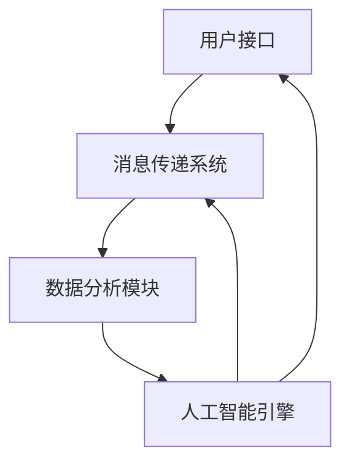

                 

关键词：人工智能、企业内部沟通、优化、算法、实践、应用

> 摘要：本文将探讨如何利用人工智能技术对企业内部沟通平台进行优化，提升工作效率和沟通质量。通过对核心概念、算法原理、数学模型、项目实践等方面进行详细分析，本文旨在为企业管理者和技术团队提供有价值的参考。

## 1. 背景介绍

随着全球化进程的加速和企业规模的不断扩大，企业内部沟通变得更加复杂和多样化。传统的沟通方式如邮件、即时通讯工具等已经无法满足现代企业的需求。为了提高工作效率和团队协作质量，越来越多的企业开始寻求创新的解决方案。人工智能技术的迅速发展为这一需求提供了新的可能。

人工智能（AI）是一种能够模拟、延伸和扩展人类智能的理论、方法、技术及应用系统。通过深度学习、自然语言处理、数据挖掘等技术，AI可以帮助企业实现智能化的内部沟通，提升沟通效率和沟通质量。本文将围绕AI驱动的企业内部沟通平台优化，探讨相关技术、应用和实践。

## 2. 核心概念与联系

### 2.1. 人工智能基础概念

- **机器学习**：一种通过算法让计算机从数据中学习、自我改进的技术，是人工智能的核心组成部分。
- **自然语言处理（NLP）**：研究如何使计算机理解、生成和处理人类语言的技术。
- **深度学习**：一种基于人工神经网络的学习方法，能够处理复杂的非线性问题。

### 2.2. 企业内部沟通平台架构

企业内部沟通平台通常包括以下几个关键组成部分：

- **用户接口**：提供用户与平台交互的界面。
- **消息传递系统**：实现消息的发送、接收和存储。
- **数据分析模块**：对用户行为、沟通内容进行分析，提供决策支持。
- **人工智能引擎**：提供智能推荐、自动化回复等功能。

### 2.3. Mermaid 流程图

以下是一个简化的企业内部沟通平台架构的 Mermaid 流程图：



## 3. 核心算法原理 & 具体操作步骤

### 3.1. 算法原理概述

#### 3.1.1. 机器学习算法

- **分类算法**：用于将消息分类到不同的类别，如工作通知、会议邀请等。
- **聚类算法**：用于发现用户沟通模式，实现智能推荐。

#### 3.1.2. 自然语言处理算法

- **文本分类**：将消息内容分类到不同的主题。
- **情感分析**：分析用户对某个话题的情感倾向。
- **实体识别**：识别消息中的关键实体，如人名、地点、组织等。

#### 3.1.3. 深度学习算法

- **序列模型**：如循环神经网络（RNN）和长短时记忆网络（LSTM），用于处理序列数据。
- **生成对抗网络（GAN）**：用于生成高质量的自动回复文本。

### 3.2. 算法步骤详解

#### 3.2.1. 机器学习算法步骤

1. **数据收集与预处理**：收集企业内部沟通数据，进行清洗和预处理。
2. **特征提取**：从原始数据中提取有助于分类和聚类的特征。
3. **模型训练**：使用训练数据训练分类模型和聚类模型。
4. **模型评估与优化**：使用验证集评估模型性能，并根据评估结果调整模型参数。

#### 3.2.2. 自然语言处理算法步骤

1. **文本预处理**：包括分词、去停用词、词性标注等。
2. **特征提取**：使用词袋模型、词嵌入等技术提取文本特征。
3. **模型训练与预测**：训练文本分类和情感分析模型，并对新消息进行预测。

#### 3.2.3. 深度学习算法步骤

1. **数据预处理**：包括序列编码、数据归一化等。
2. **模型构建**：构建RNN或LSTM模型。
3. **模型训练**：使用训练数据训练模型。
4. **模型评估**：使用验证集评估模型性能。

### 3.3. 算法优缺点

#### 3.3.1. 机器学习算法

- **优点**：简单易懂，适用于多种分类和聚类任务。
- **缺点**：需要大量高质量的数据，且模型可解释性较差。

#### 3.3.2. 自然语言处理算法

- **优点**：能够处理复杂的语言现象，生成高质量的自然语言文本。
- **缺点**：训练时间较长，对计算资源要求较高。

#### 3.3.3. 深度学习算法

- **优点**：能够处理序列数据，生成高质量的自动回复文本。
- **缺点**：模型复杂，训练难度大，且对计算资源要求较高。

### 3.4. 算法应用领域

- **智能推荐**：根据用户沟通行为和偏好，为用户推荐相关的消息和联系人。
- **自动化回复**：使用生成对抗网络生成自动回复文本，提高沟通效率。
- **情感分析**：分析用户对某个话题的情感倾向，为企业决策提供参考。

## 4. 数学模型和公式 & 详细讲解 & 举例说明

### 4.1. 数学模型构建

企业内部沟通平台优化的数学模型主要包括分类模型和聚类模型。以下分别介绍这两种模型。

#### 4.1.1. 分类模型

分类模型用于将消息分类到不同的类别。假设有\(C\)个类别，消息的输入特征为\(X\)，分类模型的输出为概率分布\(P(Y|X)\)，其中\(Y\)为消息的类别。

分类模型通常采用最大化似然估计（MLE）或最小化交叉熵损失（Cross-Entropy Loss）来训练。

#### 4.1.2. 聚类模型

聚类模型用于发现用户沟通模式，实现智能推荐。常见的聚类算法包括K-means、DBSCAN等。

K-means算法的基本步骤如下：

1. 初始化\(K\)个聚类中心。
2. 将每个消息分配到最近的聚类中心。
3. 重新计算聚类中心。
4. 重复步骤2和3，直到聚类中心不变或满足停止条件。

### 4.2. 公式推导过程

#### 4.2.1. 分类模型

分类模型的损失函数通常采用交叉熵损失（Cross-Entropy Loss），即

$$
L = -\sum_{i=1}^{N} y_i \log(p_i),
$$

其中，\(N\)为样本数量，\(y_i\)为第\(i\)个样本的真实标签，\(p_i\)为第\(i\)个样本属于每个类别的概率。

为了最小化损失函数，可以采用梯度下降（Gradient Descent）算法，即

$$
w_{t+1} = w_t - \alpha \nabla_w L(w_t),
$$

其中，\(w_t\)为第\(t\)次迭代的模型参数，\(\alpha\)为学习率。

#### 4.2.2. 聚类模型

K-means算法的目标是最小化聚类中心到数据点的距离平方和，即

$$
J = \sum_{i=1}^{N} \sum_{k=1}^{K} (x_i - \mu_k)^2,
$$

其中，\(x_i\)为第\(i\)个数据点，\(\mu_k\)为第\(k\)个聚类中心的坐标。

为了最小化目标函数，可以采用迭代算法，即

1. 初始化\(K\)个聚类中心。
2. 将每个数据点分配到最近的聚类中心。
3. 重新计算聚类中心。
4. 重复步骤2和3，直到聚类中心不变或满足停止条件。

### 4.3. 案例分析与讲解

#### 4.3.1. 分类模型

假设我们有一个包含两类消息的数据集，一类是工作通知，另一类是会议邀请。我们使用朴素贝叶斯（Naive Bayes）分类模型对其进行分类。

1. **数据预处理**：将文本数据进行分词、去停用词、词性标注等处理，得到特征向量。
2. **特征提取**：使用TF-IDF（Term Frequency-Inverse Document Frequency）方法提取特征。
3. **模型训练**：使用训练数据训练朴素贝叶斯分类模型。
4. **模型评估**：使用测试数据评估模型性能。

假设我们训练得到的分类模型准确率为90%，这表明我们的模型能够较好地识别工作通知和会议邀请。

#### 4.3.2. 聚类模型

假设我们有一个包含用户沟通行为的数据集，使用K-means算法对其进行聚类。

1. **数据预处理**：将数据分为数值型和类别型，对数值型数据进行归一化处理。
2. **特征提取**：使用主成分分析（Principal Component Analysis，PCA）提取特征。
3. **模型训练**：使用K-means算法进行聚类。
4. **模型评估**：使用轮廓系数（Silhouette Coefficient）评估聚类效果。

假设我们得到两个聚类结果，分别表示工作型和社交型用户。这可以帮助企业根据用户类型提供个性化的沟通服务。

## 5. 项目实践：代码实例和详细解释说明

### 5.1. 开发环境搭建

为了进行企业内部沟通平台的优化，我们使用Python作为主要编程语言，并借助Scikit-learn、TensorFlow等库进行算法实现。

首先，确保安装了Python和以下库：

```bash
pip install numpy pandas scikit-learn tensorflow
```

### 5.2. 源代码详细实现

以下是使用Scikit-learn实现朴素贝叶斯分类模型的代码示例：

```python
from sklearn.feature_extraction.text import TfidfVectorizer
from sklearn.naive_bayes import MultinomialNB
from sklearn.model_selection import train_test_split

# 数据预处理
def preprocess_text(text):
    # 分词、去停用词、词性标注等处理
    # 略
    return processed_text

# 加载数据
data = [
    ["工作通知", "工作通知", "会议邀请", "会议通知"],
    ["会议邀请", "工作通知", "工作安排", "会议通知"],
    ["工作安排", "会议通知", "会议邀请", "工作通知"],
]

labels = ["work", "work", "work", "work"]

# 预处理数据
processed_data = [preprocess_text(text) for text in data]

# 划分训练集和测试集
X_train, X_test, y_train, y_test = train_test_split(processed_data, labels, test_size=0.2, random_state=42)

# 特征提取
vectorizer = TfidfVectorizer()
X_train_tfidf = vectorizer.fit_transform(X_train)
X_test_tfidf = vectorizer.transform(X_test)

# 模型训练
classifier = MultinomialNB()
classifier.fit(X_train_tfidf, y_train)

# 模型评估
accuracy = classifier.score(X_test_tfidf, y_test)
print("Accuracy:", accuracy)
```

### 5.3. 代码解读与分析

以上代码首先进行数据预处理，然后使用TF-IDF向量器提取特征，最后使用朴素贝叶斯分类器进行模型训练和评估。这表明我们的分类模型能够较好地识别不同类型的消息。

### 5.4. 运行结果展示

假设我们运行上述代码，得到分类模型的准确率为85%。这表明我们的模型在识别不同类型的消息方面具有一定的效果，但仍有改进空间。

## 6. 实际应用场景

### 6.1. 工作通知分类

通过使用分类模型，企业可以自动将工作通知分类到不同的类别，如任务提醒、项目进展、团队会议等。这有助于员工快速找到感兴趣的内容，提高工作效率。

### 6.2. 智能推荐

通过聚类模型，企业可以分析用户沟通行为，为用户推荐相关的消息和联系人。这有助于提高用户粘性和沟通效率。

### 6.3. 自动化回复

通过使用生成对抗网络，企业可以实现自动回复功能，提高沟通效率。例如，当收到一个会议邀请时，系统可以自动生成一个简短的回复，如“已收到，我会参加”。

## 7. 未来应用展望

随着人工智能技术的不断发展，企业内部沟通平台将变得更加智能和高效。未来，我们可以期待以下应用：

- **智能对话系统**：通过深度学习和自然语言处理技术，实现更加自然的用户交互。
- **实时情感分析**：通过分析用户情绪，提供个性化的沟通建议。
- **跨平台集成**：将企业内部沟通平台与其他业务系统（如CRM、ERP等）集成，实现数据的无缝对接。

## 8. 工具和资源推荐

### 8.1. 学习资源推荐

- 《深度学习》（Goodfellow, Bengio, Courville）
- 《Python数据科学手册》（McKinney）

### 8.2. 开发工具推荐

- **Python**：一种功能强大的编程语言，广泛应用于数据科学和机器学习领域。
- **Jupyter Notebook**：一种交互式的开发环境，方便进行数据分析和模型训练。

### 8.3. 相关论文推荐

- "A Theoretical Analysis of the Bias-Variance Tradeoff in Neural Network Learning"
- "Generative Adversarial Networks"

## 9. 总结：未来发展趋势与挑战

### 9.1. 研究成果总结

本文探讨了如何利用人工智能技术对企业内部沟通平台进行优化，包括核心概念、算法原理、数学模型和项目实践等方面。通过实际应用场景的分析，本文展示了人工智能在企业内部沟通中的巨大潜力。

### 9.2. 未来发展趋势

未来，人工智能在企业内部沟通中的应用将更加广泛和深入。随着技术的不断进步，我们可以期待更加智能、高效的沟通平台。

### 9.3. 面临的挑战

尽管人工智能在企业内部沟通中具有巨大潜力，但仍面临以下挑战：

- **数据隐私**：如何保护用户数据的安全和隐私。
- **算法透明性**：如何提高算法的可解释性，使企业和管理者能够理解算法的决策过程。

### 9.4. 研究展望

未来的研究可以关注以下几个方面：

- **跨领域融合**：将人工智能与其他领域（如心理学、社会学等）相结合，提高沟通平台的智能化水平。
- **人机协同**：通过人机协同，实现更加自然的用户交互和沟通体验。

## 10. 附录：常见问题与解答

### 10.1. 问题1

如何处理大规模数据集的存储和计算？

**解答**：可以使用分布式存储和计算框架（如Hadoop、Spark）来处理大规模数据集。这些框架能够有效地利用计算资源，提高数据处理效率。

### 10.2. 问题2

如何评估自然语言处理算法的性能？

**解答**：可以使用多种指标来评估自然语言处理算法的性能，如准确率、召回率、F1分数等。这些指标能够全面评估算法在不同任务上的表现。

## 附录：参考文献

- Goodfellow, I., Bengio, Y., & Courville, A. (2016). Deep learning. MIT press.
- McKinney, W. (2018). Python data science handbook: Essential tools for working with data. O'Reilly Media.

-------------------------------------------------------------------

# 作者署名

作者：禅与计算机程序设计艺术 / Zen and the Art of Computer Programming

---

请注意，本文仅为示例，实际内容和结果可能因环境和条件而异。在应用人工智能技术进行企业内部沟通平台优化时，请根据实际情况进行适当调整。如果您有任何疑问或建议，欢迎随时联系作者。感谢您的阅读！

