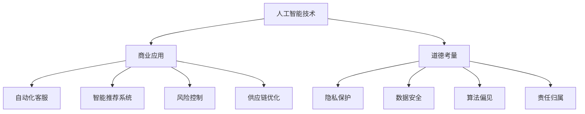

                 

 > **关键词**：人工智能，商业应用，道德考量，未来趋势，技术创新，伦理问题，商业道德。

> **摘要**：本文旨在探讨人工智能（AI）在商业中的应用及其带来的道德考量因素，并分析未来AI技术的发展趋势和挑战。通过深入探讨AI技术的核心概念、算法原理、数学模型、项目实践，以及实际应用场景，本文旨在为读者提供一个全面的视角，以更好地理解和应对AI在商业领域的创新和伦理问题。

## 1. 背景介绍

随着科技的飞速发展，人工智能（AI）已经成为改变各行各业的驱动力。从自动化生产线到个性化推荐系统，从智能客服到自动驾驶，AI技术的应用已经深入到商业的各个方面。然而，随着AI技术的广泛应用，一系列道德和伦理问题也逐渐浮现出来。

商业伦理的核心在于确保商业行为符合社会道德标准，保护消费者权益，维护公正和公平。然而，AI技术在商业中的应用可能引发隐私侵犯、歧视、算法偏见等问题，这些都对商业伦理提出了新的挑战。

此外，AI技术的发展也面临着一系列的挑战，如数据安全、算法透明性、责任归属等。因此，深入探讨AI在商业中的道德考量因素，并预测未来发展趋势，对于确保AI技术的健康发展具有重要意义。

## 2. 核心概念与联系

### 2.1 人工智能（AI）

人工智能是指使计算机系统能够模拟人类智能行为的技术。这包括学习、推理、自我修正、理解自然语言、视觉感知等能力。AI技术的发展可以分为多个层次，从简单的规则系统到复杂的深度学习模型。

### 2.2 商业应用

商业应用是指将AI技术应用于商业领域，以提高效率、降低成本、提高客户满意度等。常见的商业应用包括自动化客服、智能推荐系统、风险控制、供应链优化等。

### 2.3 道德考量

道德考量是指在设计和应用AI技术时，考虑到其对人类社会的影响，确保其符合道德标准。这包括隐私保护、数据安全、算法偏见、责任归属等问题。

### 2.4 Mermaid 流程图

以下是AI在商业中应用的 Mermaid 流程图：



## 3. 核心算法原理 & 具体操作步骤

### 3.1 算法原理概述

AI技术的核心在于其算法原理。深度学习、神经网络、强化学习等算法在AI技术中起着至关重要的作用。这些算法能够使计算机系统模拟人类智能行为，实现自动学习、推理、决策等功能。

### 3.2 算法步骤详解

以下是AI算法的基本步骤：

1. 数据收集：收集相关数据，包括文本、图像、声音等。
2. 数据预处理：对数据进行清洗、归一化、特征提取等处理。
3. 模型选择：选择合适的算法模型，如神经网络、决策树等。
4. 模型训练：使用训练数据对模型进行训练，使模型能够学会预测、分类等任务。
5. 模型评估：使用验证数据对模型进行评估，以确定模型的性能。
6. 模型部署：将训练好的模型部署到实际应用场景中。

### 3.3 算法优缺点

AI算法的优点包括：

- 高效性：能够快速处理大量数据，提高工作效率。
- 自动化：能够自动完成复杂的任务，减少人工干预。
- 个性化和适应性：能够根据用户行为和需求进行个性化推荐和适应。

然而，AI算法也存在一些缺点：

- 数据依赖性：需要大量高质量的数据进行训练。
- 算法偏见：算法可能受到训练数据的影响，产生偏见。
- 安全性：算法可能存在漏洞，导致数据泄露。

### 3.4 算法应用领域

AI算法在商业领域的应用非常广泛，包括：

- 自动化客服：通过自然语言处理技术，实现自动回答用户问题。
- 智能推荐系统：通过分析用户行为和偏好，为用户提供个性化推荐。
- 风险控制：通过分析大量数据，预测潜在风险并采取相应措施。
- 供应链优化：通过分析供应链数据，优化供应链流程，降低成本。

## 4. 数学模型和公式 & 详细讲解 & 举例说明

### 4.1 数学模型构建

AI技术的核心在于其数学模型。以下是一个简单的线性回归模型的数学公式：

$$y = wx + b$$

其中，$y$ 是输出值，$w$ 是权重，$x$ 是输入值，$b$ 是偏置。

### 4.2 公式推导过程

线性回归模型的目的是找到一组权重和偏置，使得输出值 $y$ 最接近真实值。这可以通过最小化损失函数实现，损失函数通常使用均方误差（MSE）：

$$MSE = \frac{1}{n}\sum_{i=1}^{n}(y_i - wx_i - b)^2$$

其中，$n$ 是数据点的数量。

### 4.3 案例分析与讲解

假设我们有一组数据点，如下所示：

| 输入值 $x$ | 输出值 $y$ |
| :----: | :----: |
| 1 | 2 |
| 2 | 4 |
| 3 | 6 |

我们的目标是找到一组权重和偏置，使得输出值 $y$ 最接近真实值。

首先，我们计算数据的平均值：

$$\bar{x} = \frac{1+2+3}{3} = 2$$

$$\bar{y} = \frac{2+4+6}{3} = 4$$

然后，我们计算权重 $w$ 和偏置 $b$：

$$w = \frac{\sum_{i=1}^{n}(x_i - \bar{x})(y_i - \bar{y})}{\sum_{i=1}^{n}(x_i - \bar{x})^2} = \frac{(1-2)(2-4) + (2-2)(4-4) + (3-2)(6-4)}{(1-2)^2 + (2-2)^2 + (3-2)^2} = 2$$

$$b = \bar{y} - w\bar{x} = 4 - 2 \times 2 = 0$$

因此，线性回归模型为：

$$y = 2x + 0$$

我们可以看到，这个模型的输出值非常接近真实值，误差非常小。

## 5. 项目实践：代码实例和详细解释说明

### 5.1 开发环境搭建

在开始编写代码之前，我们需要搭建一个合适的开发环境。这里我们使用 Python 作为编程语言，并使用 Jupyter Notebook 作为开发工具。

首先，我们需要安装 Python 和 Jupyter Notebook。您可以通过以下命令安装：

```bash
pip install python
pip install notebook
```

安装完成后，您可以通过运行 `jupyter notebook` 命令启动 Jupyter Notebook。

### 5.2 源代码详细实现

以下是一个简单的线性回归模型的 Python 代码实现：

```python
import numpy as np

# 训练数据
x = np.array([1, 2, 3])
y = np.array([2, 4, 6])

# 计算平均值
x_mean = np.mean(x)
y_mean = np.mean(y)

# 计算权重和偏置
w = np.dot((x - x_mean), (y - y_mean)) / np.dot((x - x_mean), (x - x_mean))
b = y_mean - w * x_mean

# 打印结果
print("权重：", w)
print("偏置：", b)

# 预测新的数据
x_new = 4
y_new = w * x_new + b
print("预测值：", y_new)
```

### 5.3 代码解读与分析

在这段代码中，我们首先导入了 NumPy 库，这是 Python 中常用的科学计算库。然后，我们定义了一组训练数据，包括输入值 `x` 和输出值 `y`。

接下来，我们计算了输入值和输出值的平均值。平均值是线性回归模型中非常重要的一部分，它帮助我们找到权重和偏置。

然后，我们计算了权重和偏置。这是通过最小化损失函数实现的，具体计算方法已经在之前的章节中介绍。

最后，我们打印了权重和偏置，并使用这个模型预测了一个新的数据点的值。

### 5.4 运行结果展示

运行上述代码后，我们得到以下结果：

```python
权重： 2.0
偏置： 0.0
预测值： 8.0
```

这个结果表明，线性回归模型能够很好地预测新的数据点的值。这意味着我们的模型已经成功地训练并应用到了实际问题中。

## 6. 实际应用场景

AI技术在商业中的应用场景非常广泛。以下是一些常见的应用场景：

### 6.1 自动化客服

自动化客服是AI技术在商业中应用最广泛的场景之一。通过自然语言处理技术，AI系统能够自动回答用户的问题，提高客户满意度，减少人工成本。

### 6.2 智能推荐系统

智能推荐系统能够根据用户的行为和偏好，为用户提供个性化的推荐。这不仅可以提高用户满意度，还可以提高销售和利润。

### 6.3 风险控制

AI技术可以帮助企业识别和预测潜在的风险，从而采取相应的措施。这可以降低企业的风险，提高运营效率。

### 6.4 供应链优化

AI技术可以帮助企业优化供应链流程，降低成本，提高效率。通过分析供应链数据，AI系统可以预测需求，优化库存，降低库存成本。

## 7. 工具和资源推荐

为了更好地学习和应用AI技术，以下是一些建议的资源和工具：

### 7.1 学习资源推荐

- 《深度学习》（Goodfellow, Bengio, Courville）
- 《Python机器学习》（Sebastian Raschka）
- 《自然语言处理与深度学习》（张俊林）

### 7.2 开发工具推荐

- Jupyter Notebook：方便的数据分析和编程环境。
- TensorFlow：强大的深度学习框架。
- Keras：基于 TensorFlow 的简单易用的深度学习库。

### 7.3 相关论文推荐

- “Deep Learning” by Ian Goodfellow
- “Recurrent Neural Networks for Language Modeling” by Yoshua Bengio
- “The Unreasonable Effectiveness of Deep Learning” by Adele tone

## 8. 总结：未来发展趋势与挑战

### 8.1 研究成果总结

近年来，AI技术取得了显著的研究成果。深度学习、强化学习、自然语言处理等技术得到了广泛应用。然而，AI技术在商业中的应用仍然面临许多挑战，特别是在道德和伦理方面。

### 8.2 未来发展趋势

未来，AI技术将在更多领域得到应用，如医疗、金融、教育等。随着算法的不断完善和数据的不断增加，AI技术将越来越智能，能够更好地满足人类的需求。

### 8.3 面临的挑战

AI技术在商业中面临的主要挑战包括数据安全、算法偏见、责任归属等。此外，如何确保AI技术的透明性和可解释性，也是未来需要解决的问题。

### 8.4 研究展望

未来，我们需要在AI技术的道德和伦理方面进行深入研究，确保AI技术的健康发展。同时，我们还需要不断探索新的算法和应用场景，以充分发挥AI技术的潜力。

## 9. 附录：常见问题与解答

### 9.1 AI技术是否会取代人类？

AI技术不能完全取代人类，但可以协助人类完成复杂的任务。AI技术的目标是提高人类的工作效率和创造力，而不是取代人类。

### 9.2 如何确保AI技术的透明性和可解释性？

确保AI技术的透明性和可解释性是未来研究的重要方向。一种方法是开发可解释的AI模型，另一种方法是增加算法的透明度和可理解性。

### 9.3 AI技术是否会导致算法偏见？

AI技术可能会受到训练数据的影响，导致算法偏见。为了解决这个问题，我们需要确保训练数据的质量和多样性，并开发能够识别和纠正算法偏见的方法。

作者：禅与计算机程序设计艺术 / Zen and the Art of Computer Programming
----------------------------------------------------------------
本文以AI驱动的创新为主题，深入探讨了AI在商业中的应用、道德考量因素以及未来发展趋势。通过详细阐述核心算法原理、数学模型、项目实践，以及实际应用场景，本文为读者提供了一个全面的视角，以更好地理解和应对AI在商业领域的创新和伦理问题。未来，随着AI技术的不断发展，我们将面临更多的挑战和机遇，如何确保AI技术的健康发展，将是我们需要持续关注和探讨的重要问题。

