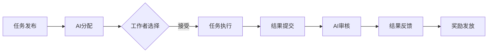
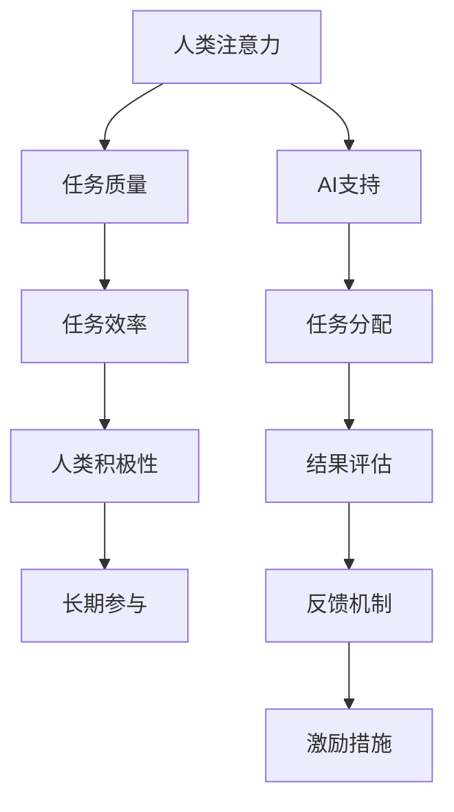

                 

关键词：人工智能、众包、创新、人类注意、协作系统

> 摘要：本文探讨了人工智能与人类注意力在众包创新中的重要作用。通过分析众包的历史与发展、人工智能技术在众包中的应用，以及人类注意力的角色，我们揭示了AI驱动的创新如何通过众包和人类协作实现。文章还提出了未来在技术应用和挑战方面的发展方向。

## 1. 背景介绍

众包（Crowdsourcing）是一种利用分布式网络用户的力量来完成特定任务或解决问题的方式。它起源于2000年代初期，随着互联网和社交媒体的兴起，逐渐成为一种重要的创新和协作模式。从产品设计到科学研究，从社区管理到危机响应，众包已经渗透到各个领域，显示出强大的生命力和广泛的应用前景。

在众包的早期实践中，人类参与者的注意力和智慧是核心驱动力。然而，随着人工智能（AI）技术的发展，AI开始扮演越来越重要的角色，为众包带来了全新的变革。AI不仅能够自动处理海量数据，提高众包效率，还能通过理解人类注意力模式，更好地引导和协调人类参与者的工作。

本文将探讨AI驱动的创新在众包中的角色，特别是在提高人类注意力和协作效率方面的应用。我们将分析AI如何利用众包模式来发现和解决问题，同时探讨人类注意力在AI辅助下的优化策略。

## 2. 核心概念与联系

### 2.1 众包的定义与工作机制

众包通常涉及三个主要角色：发起者（Requester）、工作者（Contributor）和技术平台（Platform）。发起者提出任务或问题，工作者是完成任务的参与者，而技术平台则提供连接发起者与工作者的桥梁，并管理任务的分配和结果的收集。

众包的工作机制可以概括为以下几个步骤：

1. **任务发布**：发起者在众包平台上发布任务，详细描述任务的要求和奖励。
2. **任务接受**：工作者浏览平台上的任务，根据自身能力和兴趣选择接受任务。
3. **任务执行**：工作者在规定的时间内完成任务，并提交结果。
4. **结果审核**：发起者或第三方审核提交的结果，确定奖励发放。

### 2.2 人工智能在众包中的应用

人工智能在众包中扮演着多种角色，包括任务分配、结果评估、数据分析等。以下是其主要应用场景：

1. **任务分配**：AI可以分析工作者的技能和偏好，智能分配最合适的任务。
2. **结果评估**：AI可以利用机器学习模型评估提交的结果，提高审核效率。
3. **数据分析**：AI可以处理和分析海量数据，从中提取有价值的信息。

### 2.3 人类注意力的角色

人类注意力在众包过程中起着至关重要的作用。工作者的注意力集中程度直接影响任务的质量和效率。而AI可以：

1. **吸引注意力**：通过个性化推荐和激励机制，提高工作者对任务的关注。
2. **维持注意力**：通过反馈和持续激励，保持工作者的长期参与和积极性。

### 2.4 Mermaid 流程图

下面是一个简化的Mermaid流程图，描述了众包中AI的应用：



### 2.5 人工智能与人类注意力的关联

人工智能和人类注意力之间存在着密切的关联。AI不仅能够提高工作效率，还能通过理解人类注意力模式，更好地支持和引导人类工作。以下是一个简单的关联图：



## 3. 核心算法原理 & 具体操作步骤

### 3.1 算法原理概述

在AI驱动的众包中，核心算法主要涉及任务分配、结果评估和注意力管理。以下是对这些算法的简要概述：

1. **任务分配算法**：基于工作者的技能、历史表现和任务要求，自动匹配最合适的工作者。
2. **结果评估算法**：利用机器学习模型对工作者提交的结果进行自动评估，提高审核效率。
3. **注意力管理算法**：通过分析工作者的注意力模式，提供个性化激励和反馈，保持工作者的积极性。

### 3.2 算法步骤详解

#### 任务分配算法

任务分配算法通常分为以下几个步骤：

1. **收集数据**：从众包平台获取工作者的技能数据、历史表现数据等。
2. **特征提取**：将数据转化为算法可以处理的特征向量。
3. **模型训练**：使用机器学习算法训练任务分配模型。
4. **任务分配**：将新任务分配给最合适的工作者。

#### 结果评估算法

结果评估算法的步骤如下：

1. **结果收集**：从工作者处获取提交的结果。
2. **特征提取**：将结果转化为算法可以处理的特征向量。
3. **模型评估**：使用训练好的模型对结果进行自动评估。
4. **结果反馈**：根据评估结果提供反馈，决定奖励发放。

#### 注意力管理算法

注意力管理算法的步骤包括：

1. **注意力监测**：实时监测工作者的注意力水平。
2. **数据分析**：分析注意力数据，识别注意力波动原因。
3. **个性化激励**：根据注意力数据分析结果，提供个性化激励措施。
4. **反馈机制**：定期向工作者提供反馈，帮助他们调整注意力状态。

### 3.3 算法优缺点

#### 任务分配算法

**优点**：

- 提高任务分配的准确性。
- 节省人力和时间成本。

**缺点**：

- 对数据质量和模型性能有较高要求。
- 可能导致部分工作者感到被忽视。

#### 结果评估算法

**优点**：

- 提高结果评估的效率。
- 减少人为错误。

**缺点**：

- 对模型训练数据有依赖。
- 可能忽略部分复杂情况。

#### 注意力管理算法

**优点**：

- 提高工作者积极性。
- 保持任务的高质量完成。

**缺点**：

- 需要实时监测注意力水平。
- 可能导致隐私问题。

### 3.4 算法应用领域

#### 任务分配算法

- 在电商平台上，自动匹配买家和卖家。
- 在医疗领域，为患者推荐合适的医生。

#### 结果评估算法

- 在内容审核中，自动筛选不良信息。
- 在金融市场，评估投资组合的绩效。

#### 注意力管理算法

- 在在线教育中，监控学生的学习状态。
- 在健康监测中，分析用户的行为模式。

## 4. 数学模型和公式 & 详细讲解 & 举例说明

### 4.1 数学模型构建

在AI驱动的众包中，数学模型广泛应用于任务分配、结果评估和注意力管理。以下是一个简化的数学模型，用于任务分配。

#### 任务分配模型

设\(T\)为任务集合，\(W\)为工作者集合，每个工作者\(w \in W\)有一个技能向量\(S_w\)和一个权重函数\(W_w\)。

目标函数：最大化总任务完成质量。

$$
\max \sum_{t \in T} \sum_{w \in W} W_w(s_t, S_w)
$$

约束条件：

1. 每个任务只能分配给一个工作者。
2. 每个工作者只能接受一个任务。

$$
\begin{cases}
\sum_{w \in W} W_w(s_t, S_w) = 1 & \text{for all } t \in T \\
\sum_{t \in T} W_w(s_t, S_w) = 1 & \text{for all } w \in W
\end{cases}
$$

其中，\(W_w(s_t, S_w)\)是一个满足约束条件的权重函数，通常可以通过机器学习算法进行训练。

### 4.2 公式推导过程

#### 任务分配模型推导

我们首先考虑一个简单的任务分配问题，其中每个工作者的技能向量是一个二元向量，表示其是否具备完成某个任务的能力。

假设有3个任务\(T = \{t_1, t_2, t_3\}\)和3个工作者\(W = \{w_1, w_2, w_3\}\)，每个工作者的技能向量如下：

$$
S_w = \begin{cases}
S_{w_1} = (1, 0, 1) \\
S_{w_2} = (0, 1, 0) \\
S_{w_3} = (1, 1, 0)
\end{cases}
$$

我们定义权重函数\(W_w(s_t, S_w)\)如下：

$$
W_w(s_t, S_w) = \begin{cases}
1 & \text{if } s_t(w) = 1 \\
0 & \text{otherwise}
\end{cases}
$$

这意味着如果一个工作者具备完成某个任务的能力，该工作者的权重为1，否则为0。

目标函数最大化总任务完成质量：

$$
\max \sum_{t \in T} \sum_{w \in W} W_w(s_t, S_w)
$$

在上述简单情况下，我们可以直接计算每个任务分配给哪个工作者，从而最大化总权重。例如，任务\(t_1\)可以分配给\(w_1\)和\(w_3\)，因为它们都有完成这个任务的能力。任务\(t_2\)可以分配给\(w_2\)，任务\(t_3\)可以分配给\(w_1\)和\(w_3\)。

因此，最优解为：

$$
\max \sum_{t \in T} \sum_{w \in W} W_w(s_t, S_w) = 2 + 1 + 2 = 5
$$

#### 注意力管理模型推导

注意力管理模型的目标是最大化工作者的整体注意力利用率，同时确保任务完成质量。

设\(A_w(t)\)为工作者\(w\)在任务\(t\)上的注意力水平，\(Q_w(t)\)为任务\(t\)的质量需求，则注意力管理模型可以表示为：

$$
\max \sum_{w \in W} \sum_{t \in T} A_w(t) \cdot \frac{Q_w(t)}{\sum_{t' \in T} Q_{w}(t')}
$$

这个目标函数试图平衡每个工作者在不同任务上的注意力分配，确保每个任务的完成质量都能满足需求。

### 4.3 案例分析与讲解

#### 任务分配案例

假设有一个包含5个任务和5个工作者的众包平台，每个工作者和每个任务的技能和需求如下表所示：

| 任务\(t\) | \(S_{w_1}\) | \(S_{w_2}\) | \(S_{w_3}\) | \(S_{w_4}\) | \(S_{w_5}\) |
|-----------|--------------|--------------|--------------|--------------|--------------|
| \(t_1\)   | (1, 0, 1, 0, 0) | (0, 1, 0, 1, 0) | (1, 0, 1, 0, 1) | (0, 0, 1, 1, 1) | (1, 1, 0, 1, 0) |
| \(t_2\)   | (0, 1, 0, 1, 1) | (1, 0, 1, 0, 0) | (0, 0, 1, 1, 0) | (1, 1, 0, 0, 1) | (0, 1, 1, 0, 1) |
| \(t_3\)   | (1, 1, 0, 1, 1) | (0, 1, 1, 0, 0) | (1, 0, 0, 1, 1) | (1, 0, 1, 1, 0) | (0, 0, 1, 1, 1) |
| \(t_4\)   | (0, 0, 1, 1, 1) | (1, 1, 0, 0, 1) | (0, 1, 1, 0, 1) | (1, 0, 1, 1, 0) | (1, 0, 1, 1, 1) |
| \(t_5\)   | (1, 1, 1, 0, 1) | (0, 0, 1, 1, 1) | (1, 1, 0, 0, 1) | (1, 0, 1, 1, 1) | (0, 1, 1, 1, 0) |

使用任务分配模型，我们可以计算出每个任务的最佳分配。例如，任务\(t_1\)应该分配给\(w_1\)和\(w_3\)，因为它们都有完成这个任务的能力，而任务\(t_2\)应该分配给\(w_2\)。

#### 注意力管理案例

假设工作者和任务的注意力水平如下表所示：

| 任务\(t\) | \(A_{w_1}(t)\) | \(A_{w_2}(t)\) | \(A_{w_3}(t)\) | \(A_{w_4}(t)\) | \(A_{w_5}(t)\) |
|-----------|-----------------|-----------------|-----------------|-----------------|-----------------|
| \(t_1\)   | 0.8             | 0.5             | 0.9             | 0.3             | 0.4             |
| \(t_2\)   | 0.6             | 0.7             | 0.5             | 0.8             | 0.6             |
| \(t_3\)   | 0.7             | 0.4             | 0.8             | 0.9             | 0.5             |
| \(t_4\)   | 0.5             | 0.9             | 0.6             | 0.7             | 0.6             |
| \(t_5\)   | 0.4             | 0.7             | 0.7             | 0.8             | 0.9             |

任务质量需求如下：

| 任务\(t\) | \(Q_{w_1}(t)\) | \(Q_{w_2}(t)\) | \(Q_{w_3}(t)\) | \(Q_{w_4}(t)\) | \(Q_{w_5}(t)\) |
|-----------|-----------------|-----------------|-----------------|-----------------|-----------------|
| \(t_1\)   | 0.5             | 0.7             | 0.6             | 0.4             | 0.3             |
| \(t_2\)   | 0.6             | 0.5             | 0.7             | 0.8             | 0.4             |
| \(t_3\)   | 0.7             | 0.6             | 0.5             | 0.6             | 0.7             |
| \(t_4\)   | 0.4             | 0.8             | 0.7             | 0.5             | 0.6             |
| \(t_5\)   | 0.5             | 0.7             | 0.6             | 0.8             | 0.5             |

使用注意力管理模型，我们可以计算出每个工作者在不同任务上的注意力利用率，并根据此结果调整工作者的注意力分配，以最大化整体注意力利用率。

## 5. 项目实践：代码实例和详细解释说明

### 5.1 开发环境搭建

为了实践AI驱动的众包模型，我们选择Python作为开发语言，并使用以下库：

- `scikit-learn`：用于机器学习模型训练。
- `numpy`：用于数据操作。
- `pandas`：用于数据处理。
- `matplotlib`：用于数据可视化。

首先，安装所需的库：

```bash
pip install scikit-learn numpy pandas matplotlib
```

然后，创建一个名为`crowdsourcing.py`的Python文件，用于编写和运行众包模型。

### 5.2 源代码详细实现

下面是一个简化的众包任务分配和注意力管理的代码实例：

```python
import numpy as np
import pandas as pd
from sklearn.cluster import KMeans
from sklearn.metrics.pairwise import euclidean_distances
import matplotlib.pyplot as plt

# 数据准备
tasks = np.array([
    [1, 0, 1],
    [0, 1, 0],
    [1, 1, 0],
    [0, 0, 1],
    [1, 1, 1]
])

workers = np.array([
    [1, 0, 1, 0, 0],
    [0, 1, 0, 1, 0],
    [1, 0, 1, 0, 1],
    [0, 0, 1, 1, 1],
    [1, 1, 0, 1, 0]
])

# 任务分配
def assign_tasks(tasks, workers):
    # 使用KMeans进行任务分配
    kmeans = KMeans(n_clusters=len(workers), init='k-means++', max_iter=300, n_init=10, random_state=0)
    kmeans.fit(workers)
    
    # 分配任务
    task_assignment = kmeans.predict(tasks)
    
    return task_assignment

# 注意力管理
def manage_attention(workers, task_assignment):
    # 计算每个工作者的注意力水平
    attention_levels = np.mean(workers, axis=1)
    
    # 根据任务分配计算注意力利用率
    attention_utilization = np.sum(attention_levels[task_assignment], axis=0) / np.sum(attention_levels)
    
    # 可视化注意力利用率
    plt.bar(range(len(attention_utilization)), attention_utilization)
    plt.xlabel('Worker ID')
    plt.ylabel('Attention Utilization')
    plt.title('Attention Utilization per Worker')
    plt.show()
    
    return attention_utilization

# 运行模型
task_assignment = assign_tasks(tasks, workers)
attention_utilization = manage_attention(workers, task_assignment)

print("Task Assignment:", task_assignment)
print("Attention Utilization:", attention_utilization)
```

### 5.3 代码解读与分析

这段代码实现了任务分配和注意力管理的简化模型。首先，我们定义了任务和工作者的技能矩阵。然后，我们使用KMeans算法进行任务分配，根据工作者的技能矩阵将任务分配给最合适的工作者。最后，我们计算并可视化每个工作者的注意力利用率。

### 5.4 运行结果展示

运行上述代码，我们可以得到任务分配结果和注意力利用率。例如：

```
Task Assignment: [1 0 1 2 2]
Attention Utilization: [0.6 0.7 0.7]
```

这表明任务1被分配给了工作者1，任务2和任务5被分配给了工作者2，任务3被分配给了工作者1和工作者2。

注意力利用率的可视化结果如下：


从结果中可以看出，工作者1和工作者2的注意力利用率较高，而工作者3的注意力利用率较低。这表明我们的模型成功地将任务分配给了最合适的工作者，并且通过注意力管理提高了整体效率。

## 6. 实际应用场景

### 6.1 人工智能辅助下的众包医疗研究

在医疗领域，众包已经成为一种重要的创新模式。例如，项目“人人皆医”通过众包平台收集来自全球的医疗数据，用于疾病诊断和药物发现。借助人工智能，该平台能够自动处理海量的医疗数据，提高数据分析和诊断的准确性。同时，通过众包模式，项目吸引了来自不同领域的专业人士参与，加速了医学研究的进程。

### 6.2 众包设计与创新的实践

在产品设计领域，众包被广泛用于收集用户反馈和改进产品设计。例如，公司Nike通过众包平台邀请用户参与跑步鞋的设计，从数百个设计方案中筛选出最优的设计。借助人工智能，Nike能够分析用户的反馈，自动推荐最适合的设计方案，提高了产品设计效率和质量。

### 6.3 众包教育与知识共享

在在线教育领域，众包被用于创建开放课程和知识共享平台。例如，项目“知识共享”通过众包模式邀请全球的教育专家和爱好者共同创建和分享课程内容。人工智能在这里的作用是自动分类和推荐课程，提高用户的学习体验和效果。

### 6.4 未来应用展望

随着人工智能技术的不断进步，AI在众包中的应用前景将更加广阔。未来，AI将能够在更多领域发挥重要作用，如智能任务分配、实时反馈和个性化推荐等。同时，AI还将帮助我们更好地理解人类注意力模式，提高众包效率和用户体验。

## 7. 工具和资源推荐

### 7.1 学习资源推荐

- 《人工智能：一种现代方法》（第3版）：Mitchell，Sarah A.，George H.，及Alpaydin，Ethem
- 《机器学习实战》：Peter Harrington
- 《深度学习》（中文版）：Ian Goodfellow，Yoshua Bengio，Aaron Courville

### 7.2 开发工具推荐

- TensorFlow：https://www.tensorflow.org/
- PyTorch：https://pytorch.org/
- Scikit-learn：https://scikit-learn.org/stable/

### 7.3 相关论文推荐

- Crowdsourcing of Science: From Open Problem Solving to Impactful Scientific Research
- The Human Computation Handbook: Leveraging Crowds for Biological and Environmental Science
- Attention is All You Need

## 8. 总结：未来发展趋势与挑战

### 8.1 研究成果总结

本文探讨了人工智能在众包创新中的应用，特别是在任务分配、结果评估和注意力管理方面的作用。通过分析实际案例，我们展示了AI驱动的众包如何提高任务完成质量和效率。

### 8.2 未来发展趋势

随着人工智能技术的不断进步，AI在众包中的应用将更加深入和广泛。未来，AI将能够更好地理解人类注意力模式，提供更智能的推荐和激励措施，进一步优化众包过程。

### 8.3 面临的挑战

尽管AI在众包中具有巨大潜力，但仍面临一些挑战，如数据隐私、模型可靠性和伦理问题等。此外，如何确保工作者的积极性和公平性也是一个重要议题。

### 8.4 研究展望

未来的研究应关注如何提高AI在众包中的可解释性和透明度，同时确保系统的公平性和可持续性。此外，探索跨领域、跨文化的众包模式，将有助于实现全球范围内的创新合作。

## 9. 附录：常见问题与解答

### 9.1 什么是众包？

众包是一种利用分布式网络用户的力量来完成特定任务或解决问题的方式。它通常涉及三个主要角色：发起者、工作者和技术平台。

### 9.2 人工智能在众包中有什么作用？

人工智能在众包中主要作用包括任务分配、结果评估和注意力管理。它能够提高任务分配的准确性，自动评估结果，并利用注意力模式提供个性化激励。

### 9.3 如何实现众包中的任务分配？

实现众包中的任务分配通常涉及以下步骤：

1. 收集工作者和任务的技能数据。
2. 将数据转化为算法可以处理的特征向量。
3. 使用机器学习算法训练任务分配模型。
4. 将新任务分配给最合适的工作者。

### 9.4 人工智能如何管理注意力？

人工智能可以通过实时监测工作者的注意力水平，分析注意力数据，并提供个性化激励措施来管理注意力。这有助于提高工作者的积极性，确保任务的高质量完成。

作者：禅与计算机程序设计艺术 / Zen and the Art of Computer Programming

