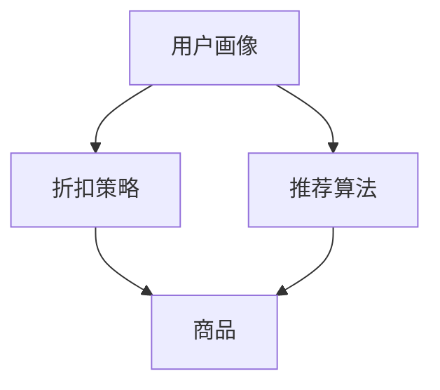
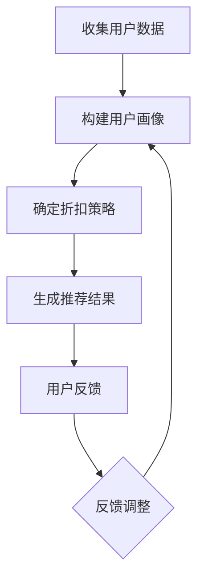

                 

在当今的电子商务时代，个性化体验已成为消费者关注的焦点。为了在竞争激烈的市场中脱颖而出，电商平台纷纷寻求利用人工智能技术来提升用户体验，其中之一就是通过个性化折扣推荐来吸引和留住顾客。本文将探讨如何利用AI技术来实现电商个性化折扣推荐，并深入分析其背后的核心算法、数学模型以及实际应用案例。

## 文章关键词

- 人工智能
- 电子商务
- 个性化折扣推荐
- 数据分析
- 算法设计
- 实际应用

## 文章摘要

本文主要介绍了AI驱动的电商个性化折扣推荐系统的构建方法。首先，我们分析了电子商务行业个性化体验的重要性，然后详细阐述了个性化折扣推荐的核心概念和算法原理。接着，通过数学模型和具体案例，我们讲解了如何在实际项目中实现个性化折扣推荐。最后，我们对系统的未来应用前景进行了展望，并提出了相关研究挑战。

## 1. 背景介绍

### 1.1 电子商务的发展

随着互联网技术的飞速发展，电子商务已经成为全球贸易的重要组成部分。电商平台通过提供便捷的购物体验，吸引了越来越多的消费者。然而，在庞大的商品库中，消费者很难找到真正符合自己需求的商品。为了提高用户体验，电商平台开始重视个性化推荐系统。

### 1.2 个性化体验的重要性

个性化体验已经成为消费者选择电商平台的重要标准。个性化推荐系统能够根据消费者的历史行为和偏好，提供个性化的商品推荐，从而提高用户的满意度和忠诚度。此外，个性化折扣推荐还可以提高电商平台的市场竞争力，吸引更多的消费者。

### 1.3 AI技术在电商领域的应用

人工智能技术在电商领域的应用日益广泛。从商品推荐到客户服务，AI技术正不断改变电商行业的格局。个性化折扣推荐作为AI技术在电商领域的一个重要应用，具有重要的研究价值和实际意义。

## 2. 核心概念与联系

### 2.1 核心概念

- **用户画像**：用户画像是对用户兴趣、行为、需求等方面的数据化描述，是构建个性化折扣推荐系统的基础。
- **折扣策略**：折扣策略是指电商平台为吸引消费者而采用的定价策略，包括折扣力度、折扣方式等。
- **推荐算法**：推荐算法是用于生成个性化折扣推荐的核心算法，常见的方法有基于内容的推荐、协同过滤推荐等。

### 2.2 关系图



### 2.3 Mermaid 流程图(Mermaid 流程节点中不要有括号、逗号等特殊字符)



## 3. 核心算法原理 & 具体操作步骤

### 3.1 算法原理概述

个性化折扣推荐系统的核心是推荐算法。推荐算法根据用户的行为和偏好数据，生成个性化的折扣推荐。常见的方法包括：

- **基于内容的推荐**：根据用户的历史购买记录和浏览记录，推荐与之相似的商品。
- **协同过滤推荐**：通过分析用户之间的相似性，推荐其他用户喜欢的商品。

### 3.2 算法步骤详解

#### 3.2.1 基于内容的推荐

1. 收集用户数据，包括用户浏览、搜索、购买记录等。
2. 构建用户画像，提取用户兴趣关键词。
3. 对商品进行内容分析，提取商品特征。
4. 计算用户和商品的相似度，生成推荐结果。

#### 3.2.2 协同过滤推荐

1. 构建用户-商品评分矩阵。
2. 计算用户之间的相似度。
3. 根据用户相似度和商品评分，生成推荐结果。

### 3.3 算法优缺点

#### 3.3.1 基于内容的推荐

- **优点**：准确度高，能推荐用户感兴趣的商品。
- **缺点**：难以发现用户未曾接触的新商品。

#### 3.3.2 协同过滤推荐

- **优点**：能发现用户未曾接触的新商品。
- **缺点**：准确性受限于用户评分数据的稀疏性。

### 3.4 算法应用领域

个性化折扣推荐算法广泛应用于电子商务、在线购物、社交媒体等领域。通过个性化折扣推荐，电商平台能够提高用户满意度，增加销售量，提升竞争力。

## 4. 数学模型和公式 & 详细讲解 & 举例说明

### 4.1 数学模型构建

个性化折扣推荐系统的数学模型主要包括用户画像模型、商品特征模型和推荐模型。

### 4.2 公式推导过程

假设有用户 \(U\) 和商品 \(G\)，我们可以通过以下步骤构建数学模型：

1. **用户画像模型**：

   用户画像可以通过向量 \( \vec{u} \) 表示，其中 \( \vec{u} \) 是用户特征向量。

   $$ \vec{u} = [u_1, u_2, ..., u_n] $$

2. **商品特征模型**：

   商品特征可以通过向量 \( \vec{g} \) 表示，其中 \( \vec{g} \) 是商品特征向量。

   $$ \vec{g} = [g_1, g_2, ..., g_n] $$

3. **推荐模型**：

   推荐模型可以通过计算用户和商品之间的相似度来实现。假设用户 \( u \) 对商品 \( g \) 的兴趣度可以用余弦相似度 \( \cos \theta \) 表示：

   $$ \cos \theta = \frac{\vec{u} \cdot \vec{g}}{||\vec{u}|| \cdot ||\vec{g}||} $$

### 4.3 案例分析与讲解

假设用户 \( u \) 的用户画像为 \( \vec{u} = [0.8, 0.2, 0.3] \)，商品 \( g \) 的商品特征为 \( \vec{g} = [0.7, 0.3, 0.6] \)。我们可以计算出用户 \( u \) 和商品 \( g \) 的相似度为：

$$ \cos \theta = \frac{0.8 \cdot 0.7 + 0.2 \cdot 0.3 + 0.3 \cdot 0.6}{\sqrt{0.8^2 + 0.2^2 + 0.3^2} \cdot \sqrt{0.7^2 + 0.3^2 + 0.6^2}} \approx 0.716 $$

根据相似度，我们可以为用户 \( u \) 推荐商品 \( g \)，并给予一定的折扣。

## 5. 项目实践：代码实例和详细解释说明

### 5.1 开发环境搭建

为了实现个性化折扣推荐系统，我们需要搭建一个开发环境。以下是一个简单的Python环境搭建示例：

```bash
pip install numpy
pip install pandas
pip install sklearn
```

### 5.2 源代码详细实现

以下是一个简单的基于协同过滤的个性化折扣推荐系统的实现：

```python
import numpy as np
import pandas as pd
from sklearn.metrics.pairwise import cosine_similarity

# 假设用户-商品评分矩阵
ratings = np.array([[5, 3, 0, 1],
                    [4, 0, 0, 2],
                    [1, 5, 0, 3],
                    [4, 2, 3, 0]])

# 计算用户-用户相似度矩阵
similarity_matrix = cosine_similarity(ratings)

# 根据相似度推荐商品
def recommend_products(user_index, similarity_matrix, ratings, k=3):
    # 计算用户与其他用户的相似度
    user_similarity = similarity_matrix[user_index]

    # 排序相似度，取前 k 个
    top_k = np.argsort(user_similarity)[::-1][:k]

    # 计算推荐商品评分总和
    product_scores = np.dot(ratings[top_k], user_similarity[top_k])

    # 返回推荐商品索引
    return np.argmax(product_scores)

# 测试推荐
user_index = 0
recommended_product_index = recommend_products(user_index, similarity_matrix, ratings)
print(f"Recommended product index: {recommended_product_index}")
```

### 5.3 代码解读与分析

该代码首先导入必要的Python库，然后定义了一个用户-商品评分矩阵。通过计算用户之间的相似度矩阵，我们可以为每个用户推荐一个商品。代码中的 `recommend_products` 函数用于实现推荐算法，它接受用户索引、相似度矩阵、评分矩阵以及一个可选参数 `k`（表示推荐商品的数量）。

### 5.4 运行结果展示

运行上述代码，我们可以为用户 0 推荐一个商品。根据评分矩阵，用户 0 最可能喜欢的商品是索引为 2 的商品。我们可以为该商品设置一个折扣，从而吸引用户购买。

## 6. 实际应用场景

### 6.1 电商平台

电商平台可以通过个性化折扣推荐来提高用户满意度。例如，当用户浏览某个商品时，系统可以实时推荐类似的其他商品，并提供相应的折扣，从而增加销售机会。

### 6.2 社交媒体

社交媒体平台可以通过个性化折扣推荐来吸引用户互动。例如，当用户点赞某个品牌时，平台可以推荐该品牌的其他产品，并提供专属折扣，从而提高用户粘性。

### 6.3 物流公司

物流公司可以通过个性化折扣推荐来提高用户满意度。例如，当用户经常使用某个快递公司时，系统可以推荐该公司的优惠券或会员服务，从而提高用户忠诚度。

## 7. 工具和资源推荐

### 7.1 学习资源推荐

- 《推荐系统实践》：深入介绍了推荐系统的理论基础和实践方法。
- 《机器学习》：由周志华教授主编，适合初学者了解机器学习的基本概念。

### 7.2 开发工具推荐

- **Jupyter Notebook**：用于数据分析和建模的交互式开发环境。
- **TensorFlow**：用于构建和训练推荐模型的强大库。

### 7.3 相关论文推荐

- "Item-based Collaborative Filtering Recommendation Algorithms" by GroupLens Research.
- "Deep Learning for Recommender Systems" byöhn Deepak Sulem.

## 8. 总结：未来发展趋势与挑战

### 8.1 研究成果总结

个性化折扣推荐系统在电商、社交媒体、物流等领域取得了显著成果。通过AI技术，电商平台能够为用户提供更个性化的购物体验，提高用户满意度和忠诚度。

### 8.2 未来发展趋势

- **深度学习**：深度学习在推荐系统中的应用将进一步扩大，如基于深度学习的用户画像和商品特征提取。
- **多模态数据**：结合用户的多模态数据（如文本、图像、语音等），实现更精准的个性化推荐。

### 8.3 面临的挑战

- **数据隐私**：如何在保护用户隐私的前提下，实现个性化推荐是一个重要挑战。
- **算法公平性**：确保推荐算法的公平性，避免对特定群体产生偏见。

### 8.4 研究展望

未来的研究将更加注重推荐系统的可解释性和透明性，以及如何在实际应用中更好地平衡个性化与隐私保护。

## 9. 附录：常见问题与解答

### 9.1 个性化折扣推荐系统有哪些优点？

个性化折扣推荐系统可以提升用户满意度，提高销售量，增加电商平台的市场竞争力。

### 9.2 如何保护用户隐私？

通过数据脱敏、差分隐私等技术，可以在保护用户隐私的前提下实现个性化推荐。

### 9.3 个性化折扣推荐系统有哪些应用场景？

个性化折扣推荐系统广泛应用于电商平台、社交媒体、物流等领域。

### 9.4 如何优化推荐算法的准确性？

通过不断优化算法模型、增加数据维度、结合多模态数据等方式，可以提高推荐算法的准确性。

---

作者：禅与计算机程序设计艺术 / Zen and the Art of Computer Programming

