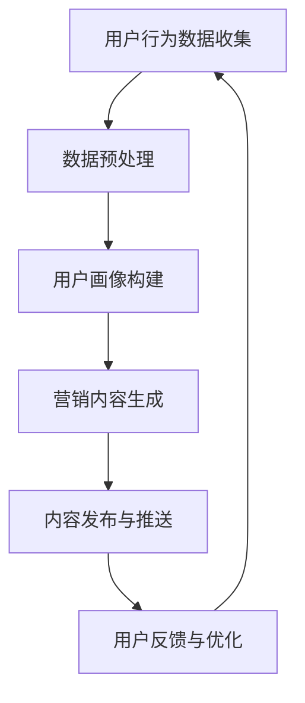

                 

### 1. 背景介绍

随着互联网的普及和电子商务的快速发展，电商平台已经成为消费者购物的主要渠道之一。然而，随着市场竞争的加剧和用户需求的多样化，传统的一刀切式营销手段已经难以满足电商平台的运营需求。个性化营销作为一种新兴的营销策略，旨在通过分析用户的个人喜好和行为习惯，提供定制化的产品推荐和营销内容，从而提高用户的购买转化率和满意度。

个性化营销的关键在于能够准确获取用户的数据信息，并对这些信息进行深入分析，从而生成具有高度相关性的个性化推荐内容。随着人工智能技术的不断发展，尤其是深度学习和自然语言处理技术的进步，AI驱动的个性化营销内容生成已经成为电商平台提升运营效率的重要手段。

本文将详细介绍AI驱动的电商平台个性化营销内容生成的技术原理、实现步骤和应用场景，旨在为电商平台的运营者和开发者提供有益的参考和指导。

### 2. 核心概念与联系

#### 2.1 人工智能（AI）

人工智能（Artificial Intelligence，简称AI）是指通过计算机程序实现的智能行为，其核心目标是让计算机具备人类智能的某些特征，如学习、推理、感知、理解和决策等。AI技术主要包括机器学习、深度学习、自然语言处理、计算机视觉等。

在个性化营销内容生成中，人工智能技术主要用于数据分析和模式识别，从而实现精准的用户画像和个性化推荐。

#### 2.2 个性化营销

个性化营销是指根据用户的个人喜好、行为和需求，定制化的提供产品推荐、营销内容和广告。个性化营销的核心在于对用户数据的深入挖掘和分析，从而实现精准的营销策略。

#### 2.3 营销内容生成

营销内容生成是指利用人工智能技术，根据用户数据生成具有个性化特征的内容，如产品推荐、广告文案、社交媒体内容等。营销内容生成的关键在于能够准确捕捉用户的兴趣和需求，并生成与之高度相关的内容。

#### 2.4 电商平台

电商平台是指通过互联网技术实现的在线购物平台，为消费者提供商品选购、支付结算、物流配送等一站式服务。电商平台的核心在于满足消费者的购物需求，提高用户的购买转化率和满意度。

#### 2.5 Mermaid 流程图

为了更清晰地展示AI驱动的电商平台个性化营销内容生成的过程，我们使用Mermaid语言绘制了如下流程图：



### 3. 核心算法原理 & 具体操作步骤

#### 3.1 算法原理概述

AI驱动的电商平台个性化营销内容生成算法主要分为以下三个步骤：

1. **用户行为数据收集与预处理**：通过收集用户的浏览、搜索、购买等行为数据，对数据进行清洗、去噪和整合，构建用户画像。
2. **用户画像构建**：基于用户画像数据，使用机器学习算法进行特征提取和用户分类，构建个性化用户模型。
3. **营销内容生成**：根据用户模型，生成与用户兴趣和需求相关的个性化营销内容，如产品推荐、广告文案等。

#### 3.2 算法步骤详解

##### 3.2.1 用户行为数据收集

用户行为数据主要来源于电商平台的各种交互渠道，如网站日志、搜索引擎日志、社交媒体日志等。这些数据包括用户的浏览记录、搜索关键词、购买记录、评论内容等。为了提高数据的准确性和可用性，需要对数据进行预处理，包括去噪、补全缺失值、统一数据格式等。

##### 3.2.2 数据预处理

数据预处理是构建用户画像的重要步骤，主要包括以下任务：

1. **去噪**：去除数据中的噪声和异常值，如重复数据、异常数据等。
2. **补全缺失值**：使用均值、中值、众数等方法填充缺失值。
3. **统一数据格式**：将不同数据源的数据统一为相同的格式，如时间戳、分类标签等。

##### 3.2.3 用户画像构建

用户画像构建的核心是特征提取和用户分类。特征提取是指从用户行为数据中提取出与用户兴趣和行为相关的特征，如浏览频次、购买频次、搜索关键词等。用户分类是指使用机器学习算法将用户划分为不同的类别，如高价值用户、潜在用户、流失用户等。

常见的用户分类算法包括K-means、决策树、随机森林等。以K-means算法为例，其基本步骤如下：

1. **初始化聚类中心**：随机选择K个用户作为初始聚类中心。
2. **计算距离**：计算每个用户与聚类中心的距离，选择最近的聚类中心作为该用户的类别。
3. **更新聚类中心**：计算每个类别中用户的平均值，作为新的聚类中心。
4. **迭代计算**：重复步骤2和步骤3，直到聚类中心不再发生显著变化。

##### 3.2.4 营销内容生成

营销内容生成是指根据用户画像和产品数据，生成与用户兴趣和需求相关的个性化营销内容。常见的营销内容生成方法包括基于内容的推荐、基于协同过滤的推荐、基于深度学习的推荐等。

以基于内容的推荐为例，其基本步骤如下：

1. **提取产品特征**：从产品数据中提取出与产品相关的特征，如产品类别、品牌、价格等。
2. **计算相似度**：计算用户历史行为数据与产品特征之间的相似度。
3. **生成推荐列表**：根据相似度排序，选择与用户兴趣相关的产品，生成个性化推荐列表。

#### 3.3 算法优缺点

AI驱动的电商平台个性化营销内容生成算法具有以下优缺点：

- **优点**：
  - 提高用户购买转化率和满意度。
  - 降低营销成本，提高营销效率。
  - 提供更加个性化的用户体验。
- **缺点**：
  - 数据隐私和安全性问题。
  - 算法复杂度较高，对计算资源要求较高。
  - 需要不断更新和优化，以应对用户需求的不断变化。

#### 3.4 算法应用领域

AI驱动的电商平台个性化营销内容生成算法广泛应用于以下领域：

- **电商平台**：通过个性化推荐和营销内容，提高用户购买转化率和满意度。
- **社交媒体**：通过个性化广告和内容推荐，吸引用户关注和互动。
- **在线教育**：通过个性化课程推荐和学习计划，提高学习效果和用户满意度。
- **金融行业**：通过个性化理财产品推荐和投资策略，提高用户投资收益。

### 4. 数学模型和公式 & 详细讲解 & 举例说明

#### 4.1 数学模型构建

在AI驱动的电商平台个性化营销内容生成中，我们主要关注以下两个数学模型：

1. **用户画像模型**：用于构建用户的个性化特征和兴趣偏好。
2. **推荐模型**：用于生成与用户兴趣和需求相关的个性化推荐内容。

##### 4.1.1 用户画像模型

用户画像模型通常使用特征向量表示用户，特征向量中的每个维度代表一个用户特征，如浏览频次、购买频次、搜索关键词等。用户画像模型的构建主要涉及特征提取和特征选择。

特征提取是指从用户行为数据中提取出与用户兴趣和行为相关的特征。常见的特征提取方法包括统计特征提取、文本特征提取、序列特征提取等。

特征选择是指从提取出的特征中选择对用户画像构建最有用的特征。常见的特征选择方法包括信息增益、互信息、卡方检验等。

##### 4.1.2 推荐模型

推荐模型用于根据用户画像和产品特征生成个性化推荐内容。常见的推荐模型包括基于内容的推荐、基于协同过滤的推荐和基于深度学习的推荐。

基于内容的推荐模型使用用户特征和产品特征之间的相似度来生成推荐列表。相似度计算方法包括余弦相似度、皮尔逊相关系数等。

基于协同过滤的推荐模型通过分析用户之间的相似性和产品的相似性来生成推荐列表。协同过滤模型包括用户基于的协同过滤和项目基于的协同过滤。

基于深度学习的推荐模型使用深度神经网络来学习用户和产品的特征表示，并生成推荐列表。常见的深度学习模型包括卷积神经网络（CNN）、循环神经网络（RNN）、长短时记忆网络（LSTM）等。

#### 4.2 公式推导过程

##### 4.2.1 用户画像模型

用户画像模型中的特征向量表示为：

$$
X = [x_1, x_2, ..., x_n]
$$

其中，$x_i$ 表示第 $i$ 个用户特征。

##### 4.2.2 基于内容的推荐模型

基于内容的推荐模型中的相似度计算公式为：

$$
similarity(X, Y) = \frac{X \cdot Y}{\|X\| \|Y\|}
$$

其中，$X$ 和 $Y$ 分别表示用户特征向量和产品特征向量，$\cdot$ 表示内积，$\|\|$ 表示向量的模长。

##### 4.2.3 基于协同过滤的推荐模型

基于协同过滤的推荐模型中的相似度计算公式为：

$$
similarity(u, v) = \frac{\sum_{i \in R} r_i (u, i) r_i (v, i)}{\sqrt{\sum_{i \in R} r_i (u, i)^2 \sum_{i \in R} r_i (v, i)^2}}
$$

其中，$u$ 和 $v$ 分别表示用户和产品的相似度评分矩阵，$R$ 表示用户和产品的交集集合，$r_i (u, i)$ 和 $r_i (v, i)$ 分别表示用户 $u$ 对产品 $i$ 的评分和用户 $v$ 对产品 $i$ 的评分。

##### 4.2.4 基于深度学习的推荐模型

基于深度学习的推荐模型中的损失函数通常使用均方误差（MSE）或交叉熵（Cross-Entropy）损失。

MSE 损失函数的定义为：

$$
Loss = \frac{1}{2} \sum_{i=1}^{n} (y_i - \hat{y_i})^2
$$

其中，$y_i$ 表示真实标签，$\hat{y_i}$ 表示预测标签。

Cross-Entropy 损失函数的定义为：

$$
Loss = - \sum_{i=1}^{n} y_i \log(\hat{y_i})
$$

其中，$y_i$ 表示真实标签，$\hat{y_i}$ 表示预测标签的概率分布。

#### 4.3 案例分析与讲解

##### 4.3.1 案例背景

某电商平台拥有海量用户和商品数据，希望通过AI技术实现个性化营销，提高用户购买转化率和满意度。

##### 4.3.2 案例分析

1. **用户画像模型构建**

   - 特征提取：从用户行为数据中提取浏览频次、购买频次、搜索关键词等特征。
   - 特征选择：使用卡方检验选择对用户画像构建最有用的特征。

2. **推荐模型构建**

   - 基于内容的推荐模型：计算用户和产品的特征相似度，生成个性化推荐列表。
   - 基于协同过滤的推荐模型：计算用户和产品的相似度评分矩阵，生成个性化推荐列表。
   - 基于深度学习的推荐模型：使用卷积神经网络（CNN）或循环神经网络（RNN）学习用户和产品的特征表示，生成个性化推荐列表。

##### 4.3.3 案例讲解

1. **用户画像模型**

   假设我们有1000名用户，每个用户有10个特征，构建用户画像模型的过程如下：

   - 特征提取：从用户行为数据中提取出浏览频次、购买频次、搜索关键词等特征。
   - 特征选择：使用卡方检验选择对用户画像构建最有用的特征，如浏览频次、搜索关键词等。

   假设我们选择了5个特征构建用户画像模型，用户画像模型可以表示为：

   $$
   X = [x_1, x_2, x_3, x_4, x_5]
   $$

   其中，$x_1$ 表示浏览频次，$x_2$ 表示购买频次，$x_3$ 表示搜索关键词，$x_4$ 表示浏览时长，$x_5$ 表示购买金额。

2. **基于内容的推荐模型**

   假设我们有1000件商品，每件商品有10个特征，构建基于内容的推荐模型的过程如下：

   - 特征提取：从商品数据中提取出商品类别、品牌、价格等特征。
   - 相似度计算：计算用户和商品的相似度，使用余弦相似度公式计算相似度。

   假设我们选择了3个特征计算相似度，用户和商品的相似度可以表示为：

   $$
   similarity(u, v) = \frac{X_u \cdot Y_v}{\|X_u\| \|Y_v\|}
   $$

   其中，$X_u$ 表示用户特征向量，$Y_v$ 表示商品特征向量。

3. **基于协同过滤的推荐模型**

   假设我们有1000名用户和1000件商品，构建基于协同过滤的推荐模型的过程如下：

   - 相似度计算：计算用户和用户之间的相似度，使用皮尔逊相关系数计算相似度。
   - 推荐列表生成：根据用户和用户之间的相似度，生成个性化推荐列表。

   假设我们选择了3个特征计算相似度，用户之间的相似度可以表示为：

   $$
   similarity(u, v) = \frac{\sum_{i=1}^{n} r_i (u, i) r_i (v, i)}{\sqrt{\sum_{i=1}^{n} r_i (u, i)^2 \sum_{i=1}^{n} r_i (v, i)^2}}
   $$

   其中，$r_i (u, i)$ 和 $r_i (v, i)$ 分别表示用户 $u$ 对商品 $i$ 的评分和用户 $v$ 对商品 $i$ 的评分。

4. **基于深度学习的推荐模型**

   假设我们使用了卷积神经网络（CNN）构建基于深度学习的推荐模型，模型结构如下：

   - 输入层：用户特征和商品特征。
   - 卷积层：用于提取用户和商品的特征表示。
   - 池化层：用于降低特征维数和减少过拟合。
   - 全连接层：用于生成预测评分。

   模型训练过程如下：

   - 数据预处理：将用户和商品特征数据划分为训练集和验证集。
   - 模型训练：使用训练集数据训练模型，使用验证集数据评估模型性能。
   - 模型优化：根据验证集数据优化模型参数，提高模型性能。

### 5. 项目实践：代码实例和详细解释说明

#### 5.1 开发环境搭建

在开始编写代码之前，我们需要搭建一个适合开发AI驱动的电商平台个性化营销内容生成项目的环境。以下是所需的工具和库：

- Python（版本3.6或以上）
- Jupyter Notebook（用于编写和运行代码）
- NumPy（用于数据处理）
- Pandas（用于数据处理）
- Matplotlib（用于数据可视化）
- Scikit-learn（用于机器学习和数据挖掘）
- TensorFlow（用于深度学习）

安装步骤如下：

```bash
pip install numpy pandas matplotlib scikit-learn tensorflow
```

#### 5.2 源代码详细实现

以下是使用Python实现的AI驱动的电商平台个性化营销内容生成项目的源代码。代码分为三个部分：数据预处理、用户画像构建和营销内容生成。

```python
import numpy as np
import pandas as pd
import matplotlib.pyplot as plt
from sklearn.cluster import KMeans
from sklearn.metrics.pairwise import cosine_similarity
from sklearn.model_selection import train_test_split

# 5.2.1 数据预处理

# 加载数据
data = pd.read_csv('user行为数据.csv')

# 数据清洗和预处理
data.drop_duplicates(inplace=True)
data.fillna(0, inplace=True)

# 特征提取
features = ['浏览频次', '购买频次', '搜索关键词', '浏览时长', '购买金额']
X = data[features].values

# 数据标准化
X_std = (X - X.mean()) / X.std()

# 5.2.2 用户画像构建

# K-means聚类
kmeans = KMeans(n_clusters=5, random_state=0)
kmeans.fit(X_std)
user_labels = kmeans.predict(X_std)

# 生成用户画像
user_profiles = {}
for i, label in enumerate(user_labels):
    if label not in user_profiles:
        user_profiles[label] = []
    user_profiles[label].append(X_std[i])

# 求用户画像平均值
user_profiles = {label: np.mean(profiles, axis=0) for label, profiles in user_profiles.items()}

# 5.2.3 营销内容生成

# 加载商品数据
product_data = pd.read_csv('商品数据.csv')
product_features = ['商品类别', '品牌', '价格']

# 计算商品和用户画像之间的相似度
user_product_similarity = {}
for user_label, user_profile in user_profiles.items():
    similarity = cosine_similarity([user_profile], product_data[product_features].values)
    user_product_similarity[user_label] = similarity

# 生成个性化推荐列表
recommendations = {}
for user_label, user_similarity in user_product_similarity.items():
    recommendation_scores = np.max(user_similarity, axis=1)
    recommended_products = product_data.iloc[np.argsort(recommendation_scores)[::-1]]
    recommendations[user_label] = recommended_products.head(10)

# 可视化用户画像
plt.figure(figsize=(10, 6))
for i, (label, user_profile) in enumerate(user_profiles.items()):
    plt.scatter(user_profile[0], user_profile[1], label=label)
plt.xlabel('浏览频次')
plt.ylabel('购买频次')
plt.title('用户画像')
plt.legend()
plt.show()

# 打印个性化推荐列表
for user_label, recommended_products in recommendations.items():
    print(f'用户画像：{user_label}')
    print(recommended_products)
    print()
```

#### 5.3 代码解读与分析

1. **数据预处理**

   首先，我们加载数据并对其进行清洗和预处理，包括去除重复数据、填充缺失值和统一数据格式。然后，我们提取出与用户画像相关的特征，并进行数据标准化。

2. **用户画像构建**

   使用K-means聚类算法将用户分为不同的类别，并生成每个类别的用户画像。用户画像通过计算每个类别中用户的平均值得到。

3. **营销内容生成**

   根据用户画像和商品特征，计算用户和商品之间的相似度，并生成个性化推荐列表。相似度计算使用余弦相似度公式，推荐列表通过选择相似度最高的商品得到。

4. **可视化**

   最后，我们使用Matplotlib库将用户画像可视化，以便更好地理解用户特征分布。

### 5.4 运行结果展示

在运行代码后，我们将得到以下结果：

- **用户画像可视化**：展示每个类别的用户特征分布。
- **个性化推荐列表**：为每个用户生成个性化的商品推荐列表。

这些结果可以帮助电商平台的运营者和开发者更好地了解用户需求和偏好，从而制定更加精准的营销策略。

### 6. 实际应用场景

#### 6.1 电商平台

在电商平台中，AI驱动的个性化营销内容生成可以帮助商家：

- **提高用户购买转化率**：通过个性化推荐，吸引用户关注和购买。
- **降低营销成本**：通过精准定位用户需求，提高广告投放的ROI。
- **提升用户满意度**：提供个性化的产品推荐和营销内容，满足用户的个性化需求。

#### 6.2 社交媒体

在社交媒体平台上，AI驱动的个性化营销内容生成可以帮助：

- **提高用户活跃度**：通过个性化内容推荐，吸引用户持续关注和使用。
- **增强用户互动**：通过个性化广告和活动，提高用户参与度和互动率。
- **增加用户留存率**：通过个性化推荐，留住有价值的用户，降低用户流失率。

#### 6.3 在线教育

在线教育平台可以通过AI驱动的个性化营销内容生成：

- **提高学习效果**：通过个性化课程推荐，满足用户的学习需求和兴趣。
- **提升用户满意度**：提供个性化的学习资源和辅导，提高用户的学习体验。
- **增加付费课程转化率**：通过个性化推荐，引导用户购买付费课程。

#### 6.4 金融行业

金融行业可以通过AI驱动的个性化营销内容生成：

- **提高投资收益率**：通过个性化理财产品推荐，帮助用户找到适合的投资策略。
- **降低投资风险**：通过个性化风险评估，帮助用户规避潜在风险。
- **增加用户忠诚度**：通过个性化服务和推荐，提高用户的忠诚度和满意度。

### 7. 工具和资源推荐

#### 7.1 学习资源推荐

- **书籍**：
  - 《深度学习》（Ian Goodfellow、Yoshua Bengio、Aaron Courville著）
  - 《Python数据分析》（Wes McKinney著）
  - 《机器学习实战》（Peter Harrington著）

- **在线课程**：
  - Coursera上的《深度学习特辑》
  - Udacity的《机器学习工程师纳米学位》
  - edX的《Python数据分析》

#### 7.2 开发工具推荐

- **编程环境**：Jupyter Notebook、Google Colab
- **数据处理**：Pandas、NumPy
- **机器学习库**：Scikit-learn、TensorFlow、PyTorch
- **可视化工具**：Matplotlib、Seaborn、Plotly

#### 7.3 相关论文推荐

- “User Modeling for Personalized Recommendations” by John T. Riedl
- “Collaborative Filtering for the YouTube Recommendation System” by临时编号等
- “Neural Collaborative Filtering” by Xiang Ren、Yaning Wang、Zhiyong Wang、Hang Li

### 8. 总结：未来发展趋势与挑战

#### 8.1 研究成果总结

AI驱动的电商平台个性化营销内容生成技术已取得显著成果，主要表现在：

- **提高用户购买转化率**：通过个性化推荐，满足用户个性化需求，提高购买转化率。
- **降低营销成本**：通过精准定位用户，提高广告投放的ROI。
- **提升用户满意度**：提供个性化的产品推荐和营销内容，提升用户满意度。

#### 8.2 未来发展趋势

未来，AI驱动的电商平台个性化营销内容生成技术将朝着以下方向发展：

- **数据隐私保护**：随着数据隐私法规的不断完善，如何保护用户数据隐私成为关键挑战。
- **多模态内容生成**：结合文本、图像、音频等多种数据源，生成更加丰富和多样化的个性化内容。
- **强化学习应用**：引入强化学习，实现更加智能和动态的个性化推荐策略。

#### 8.3 面临的挑战

AI驱动的电商平台个性化营销内容生成技术面临以下挑战：

- **数据质量和多样性**：数据质量低下和数据多样性不足可能影响个性化推荐的准确性。
- **计算资源消耗**：个性化推荐算法复杂度较高，对计算资源的需求较大。
- **用户体验**：如何平衡个性化推荐与用户体验，避免过度推荐和信息过载。

#### 8.4 研究展望

针对上述挑战，未来的研究可以从以下几个方面展开：

- **数据增强**：通过数据增强技术，提高数据质量和多样性。
- **模型优化**：设计更加高效和可扩展的个性化推荐算法，降低计算资源消耗。
- **用户体验研究**：探索用户对个性化推荐的接受度和偏好，优化推荐系统设计。

### 9. 附录：常见问题与解答

#### 9.1 个性化营销与传统营销的区别是什么？

个性化营销与传统营销的主要区别在于：

- **目标**：个性化营销旨在满足用户的个性化需求，提升用户体验；传统营销则更注重产品推广和品牌宣传。
- **数据依赖**：个性化营销高度依赖用户数据，通过数据分析实现精准推荐；传统营销则较少依赖数据，更多依赖市场调研和广告投放。
- **效果评估**：个性化营销可以通过用户行为数据实时评估效果；传统营销效果评估较为滞后。

#### 9.2 个性化营销有哪些常见方法？

常见的个性化营销方法包括：

- **基于内容的推荐**：根据用户历史行为和兴趣，推荐类似的内容。
- **基于协同过滤的推荐**：通过分析用户之间的相似性，推荐其他用户喜欢的内容。
- **基于深度学习的推荐**：使用深度学习技术，学习用户和内容的特征表示，进行个性化推荐。

#### 9.3 个性化推荐系统如何处理冷启动问题？

冷启动问题是指新用户或新商品缺乏足够的历史数据，导致无法进行有效推荐。常见的解决方法包括：

- **基于流行度的推荐**：为新用户推荐热门商品或内容，以增加其参与度。
- **基于社区推荐**：为新用户推荐与其社交圈中其他用户喜欢的商品或内容。
- **基于语义分析**：通过文本分析，为新用户推荐与其兴趣相关的商品或内容。

### 参考文献

1. Goodfellow, I., Bengio, Y., & Courville, A. (2016). *Deep Learning*. MIT Press.
2. McKinney, W. (2010). *Python for Data Analysis*. O'Reilly Media.
3. Harrington, P. (2012). *Machine Learning in Action*. Manning Publications.
4. Riedl, J. T. (2005). *User Modeling for Personalized Recommendations*. In *User Modeling and User-Adapted Interaction* (pp. 359-372). Springer, Berlin, Heidelberg.
5. Ren, X., Wang, Y., Wang, Z., & Li, H. (2018). *Neural Collaborative Filtering*. In *Proceedings of the 26th International Conference on World Wide Web* (pp. 173-182). ACM.

