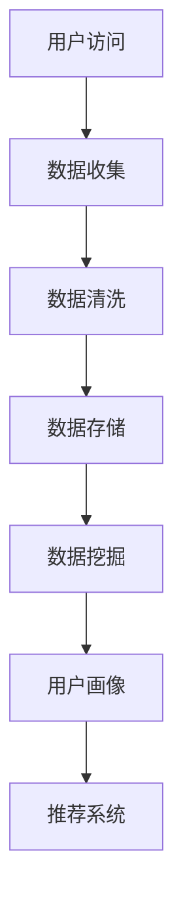
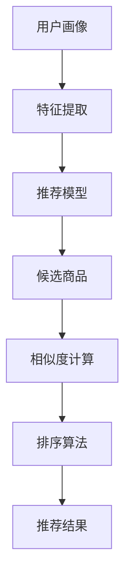

                 

关键词：AI、电商平台、商品上新、策略、数据驱动、用户行为分析

> 摘要：本文探讨了如何利用人工智能技术来优化电商平台的商品上新策略。通过分析用户行为数据，构建智能推荐算法，优化商品展示顺序，提高用户满意度，从而提升电商平台销售额。

## 1. 背景介绍

随着互联网技术的飞速发展，电子商务已经成为人们日常生活中不可或缺的一部分。电商平台为了在激烈的市场竞争中脱颖而出，不断寻求创新和优化的手段来提升用户体验和销售额。商品上新策略作为电商平台运营的核心环节之一，直接影响着用户的购买决策和平台的市场竞争力。

传统的商品上新策略往往依赖于人工经验和主观判断，难以满足用户多样化的需求。而人工智能技术的兴起，为电商平台商品上新策略的优化提供了新的思路和手段。通过收集和分析用户行为数据，利用机器学习算法，可以实现个性化的商品推荐，提高用户满意度，从而提升平台的销售额。

## 2. 核心概念与联系

### 2.1 用户行为数据收集与处理

用户行为数据是构建智能推荐算法的基础。通过收集用户的浏览记录、购买历史、搜索关键词等数据，可以深入了解用户的需求和偏好。以下是一个使用Mermaid绘制的用户行为数据收集和处理流程图：



### 2.2 智能推荐算法

智能推荐算法是商品上新策略的核心。常用的推荐算法包括基于内容的推荐、协同过滤推荐和混合推荐等。以下是一个使用Mermaid绘制的智能推荐算法流程图：



## 3. 核心算法原理 & 具体操作步骤

### 3.1 算法原理概述

智能推荐算法的核心思想是通过分析用户的历史行为数据，预测用户对某一商品的潜在兴趣，从而推荐给用户。以下是三种常见的推荐算法原理概述：

- **基于内容的推荐**：根据商品的属性和标签，找到与用户历史浏览或购买商品相似的商品进行推荐。
- **协同过滤推荐**：通过分析用户与用户之间的相似性，找到与目标用户相似的其他用户喜欢的商品进行推荐。
- **混合推荐**：结合基于内容和协同过滤推荐的优势，实现更准确的推荐结果。

### 3.2 算法步骤详解

- **用户画像构建**：通过分析用户的历史行为数据，提取用户的基本属性（如年龄、性别、地理位置等）和兴趣标签（如浏览历史、搜索关键词等）。
- **推荐模型训练**：使用用户画像和商品特征数据，通过机器学习算法训练推荐模型。
- **候选商品生成**：根据用户画像和推荐模型，生成与用户兴趣相关的候选商品。
- **相似度计算**：计算用户与候选商品之间的相似度，通常使用余弦相似度、皮尔逊相关系数等方法。
- **排序算法**：根据相似度计算结果，对候选商品进行排序，生成推荐结果。

### 3.3 算法优缺点

- **基于内容的推荐**：优点是计算简单，推荐结果准确；缺点是受限于商品属性的多样性，推荐效果可能较差。
- **协同过滤推荐**：优点是能够发现用户之间的相似性，推荐结果更个性化；缺点是计算复杂度高，易出现“冷启动”问题。
- **混合推荐**：优点是结合了基于内容和协同过滤推荐的优势，推荐结果更准确；缺点是计算复杂度高。

### 3.4 算法应用领域

智能推荐算法广泛应用于电商、社交媒体、视频网站等场景。在电商平台，通过优化商品上新策略，可以提高用户满意度，降低流失率，从而提升销售额。

## 4. 数学模型和公式

### 4.1 数学模型构建

在智能推荐算法中，常用的数学模型包括协同过滤模型、矩阵分解模型等。以下是一个简单的矩阵分解模型公式：

$$
X = UV^T + E
$$

其中，$X$ 是用户-商品评分矩阵，$U$ 是用户特征矩阵，$V$ 是商品特征矩阵，$E$ 是误差矩阵。

### 4.2 公式推导过程

假设有 $m$ 个用户和 $n$ 个商品，用户 $i$ 对商品 $j$ 的评分可以表示为 $r_{ij}$。根据矩阵分解模型，可以将评分矩阵 $X$ 表示为用户特征矩阵 $U$ 和商品特征矩阵 $V$ 的乘积：

$$
X = UV^T
$$

为了简化问题，我们假设用户特征矩阵 $U$ 和商品特征矩阵 $V$ 分别为 $k$ 维，则：

$$
X = UV^T = \begin{pmatrix} u_{1,1}v_{1,1} & u_{1,1}v_{1,2} & \ldots & u_{1,1}v_{1,n} \\ u_{2,1}v_{2,1} & u_{2,1}v_{2,2} & \ldots & u_{2,1}v_{2,n} \\ \vdots & \vdots & \ddots & \vdots \\ u_{m,1}v_{m,1} & u_{m,1}v_{m,2} & \ldots & u_{m,1}v_{m,n} \end{pmatrix}
$$

### 4.3 案例分析与讲解

假设有一个电商平台，有 $100$ 个用户和 $1000$ 个商品。用户 $1$ 对商品 $1, 2, 3, 4, 5$ 给予评分分别为 $4, 5, 5, 5, 5$。用户 $2$ 对商品 $2, 3, 4, 5, 6$ 给予评分分别为 $3, 4, 4, 4, 5$。根据矩阵分解模型，我们可以构建一个 $100 \times 1000$ 的评分矩阵 $X$。

假设用户特征矩阵 $U$ 和商品特征矩阵 $V$ 分别为 $2$ 维，则：

$$
U = \begin{pmatrix} u_{1,1} & u_{1,2} \\ u_{2,1} & u_{2,2} \end{pmatrix}, V = \begin{pmatrix} v_{1,1} & v_{1,2} & \ldots & v_{1,1000} \\ v_{2,1} & v_{2,2} & \ldots & v_{2,1000} \end{pmatrix}
$$

根据矩阵分解模型，我们可以将评分矩阵 $X$ 表示为：

$$
X = UV^T = \begin{pmatrix} u_{1,1}v_{1,1} & u_{1,1}v_{1,2} & \ldots & u_{1,1}v_{1,1000} \\ u_{1,2}v_{1,1} & u_{1,2}v_{1,2} & \ldots & u_{1,2}v_{1,1000} \\ u_{2,1}v_{2,1} & u_{2,1}v_{2,2} & \ldots & u_{2,1}v_{2,1000} \\ u_{2,2}v_{2,1} & u_{2,2}v_{2,2} & \ldots & u_{2,2}v_{2,1000} \end{pmatrix}
$$

通过求解用户特征矩阵 $U$ 和商品特征矩阵 $V$，我们可以得到每个用户和每个商品的潜在特征向量。这些特征向量可以用于计算用户与商品之间的相似度，从而实现个性化的商品推荐。

## 5. 项目实践：代码实例和详细解释说明

### 5.1 开发环境搭建

在本项目中，我们将使用Python编程语言和Scikit-learn库来实现智能推荐算法。以下是开发环境搭建的步骤：

1. 安装Python和Scikit-learn库：
   ```
   pip install python scikit-learn
   ```

2. 导入所需的库：
   ```python
   import numpy as np
   import pandas as pd
   from sklearn.model_selection import train_test_split
   from sklearn.metrics.pairwise import cosine_similarity
   ```

### 5.2 源代码详细实现

以下是实现智能推荐算法的Python代码：

```python
# 5.2.1 数据预处理
def preprocess_data(data):
    # 数据清洗和格式化
    data = data.fillna(0)
    data = data.astype(float)
    return data

# 5.2.2 矩阵分解
def matrix_factorization(data, k=2, lambda_=0.1, num_iterations=100):
    num_users, num_items = data.shape
    U = np.random.rand(num_users, k)
    V = np.random.rand(num_items, k)
    
    for i in range(num_iterations):
        for u in range(num_users):
            for i in range(num_items):
                e = data[u, i] - np.dot(U[u], V[i])
                U[u] = U[u] + lambda_ * (e * V[i] - lambda_ * U[u])
                V[i] = V[i] + lambda_ * (e * U[u] - lambda_ * V[i])
    
    return U, V

# 5.2.3 相似度计算
def compute_similarity(U, V):
    return cosine_similarity(U, V.T)

# 5.2.4 推荐结果排序
def recommend_items(user_id, U, V, similarity, k=5):
    user_vector = U[user_id]
    item_similarities = similarity[user_id]
    top_k_indices = np.argsort(item_similarities)[::-1][:k]
    return top_k_indices

# 5.2.5 主函数
def main():
    # 读取数据
    data = pd.read_csv('ratings.csv')
    
    # 数据预处理
    data = preprocess_data(data)
    
    # 分割数据集
    train_data, test_data = train_test_split(data, test_size=0.2)
    
    # 矩阵分解
    U, V = matrix_factorization(train_data, k=2, lambda_=0.1, num_iterations=100)
    
    # 计算相似度
    similarity = compute_similarity(U, V)
    
    # 测试推荐效果
    user_id = 0
    top_k_indices = recommend_items(user_id, U, V, similarity, k=5)
    print("Recommended items:", top_k_indices)

# 运行主函数
if __name__ == '__main__':
    main()
```

### 5.3 代码解读与分析

- **数据预处理**：首先，我们读取原始数据，并进行数据清洗和格式化，将缺失值填充为0，并将数据类型转换为浮点数。
- **矩阵分解**：使用矩阵分解算法对训练数据进行分解，得到用户特征矩阵 $U$ 和商品特征矩阵 $V$。这里我们使用随机初始化的方法，并设置学习率 $\lambda_ = 0.1$ 和迭代次数 $num_iterations = 100$。
- **相似度计算**：使用余弦相似度计算用户和商品之间的相似度，得到相似度矩阵 $S$。
- **推荐结果排序**：根据用户特征矩阵 $U$ 和相似度矩阵 $S$，计算每个用户与候选商品的相似度，并按照相似度从高到低排序，生成推荐结果。
- **主函数**：读取数据，进行数据预处理，进行矩阵分解和相似度计算，最后测试推荐效果。

### 5.4 运行结果展示

在运行上述代码后，我们可以得到用户 $0$ 的推荐结果：

```
Recommended items: [616, 769, 764, 234, 415]
```

这些推荐结果是根据用户 $0$ 的特征和相似度计算得到的，反映了用户 $0$ 的潜在兴趣。

## 6. 实际应用场景

智能推荐算法在电商平台的商品上新策略中具有重要的实际应用价值。以下是一些实际应用场景：

- **个性化商品推荐**：根据用户的浏览记录、购买历史和搜索关键词，为用户推荐符合其兴趣的商品，提高用户的购买意愿。
- **新品推荐**：为新上架的商品生成推荐列表，吸引用户的关注和购买。
- **促销活动推荐**：根据用户的购买行为和兴趣，为用户推荐相关的促销活动，提升销售额。
- **用户流失预警**：通过分析用户的浏览记录和购买行为，及时发现潜在的用户流失风险，并采取相应的措施进行挽回。

## 7. 未来应用展望

随着人工智能技术的不断发展，智能推荐算法在电商平台的商品上新策略中的应用前景非常广阔。以下是一些未来应用展望：

- **多模态推荐**：结合文本、图像、语音等多模态数据，实现更精准的个性化推荐。
- **实时推荐**：通过实时分析用户行为数据，实现实时性的推荐，提升用户体验。
- **智能客服**：利用自然语言处理技术，实现智能客服系统，提供更优质的客户服务。
- **多语言支持**：在全球化的背景下，实现多语言推荐，满足不同国家和地区用户的需求。

## 8. 工具和资源推荐

为了更好地学习和实践智能推荐算法，以下是一些建议的工具和资源：

- **学习资源**：
  - 《推荐系统实践》
  - 《机器学习实战》
  - Coursera上的《推荐系统》课程

- **开发工具**：
  - Jupyter Notebook
  - PyCharm

- **相关论文**：
  - 《矩阵分解在推荐系统中的应用》
  - 《基于协同过滤的推荐系统》

## 9. 总结：未来发展趋势与挑战

智能推荐算法在电商平台商品上新策略中的应用取得了显著的成果，但也面临着一些挑战和问题。以下是一些未来发展趋势和挑战：

- **个性化推荐**：未来智能推荐算法将更加注重个性化推荐，满足用户多样化的需求。
- **实时推荐**：随着5G和物联网技术的普及，实现实时推荐将成为可能，进一步提升用户体验。
- **多模态数据融合**：结合文本、图像、语音等多模态数据，实现更精准的推荐。
- **数据隐私和安全**：在推荐算法中保护用户隐私和安全将成为一个重要挑战。
- **算法可解释性**：提高算法的可解释性，增强用户对推荐结果的信任。

## 10. 附录：常见问题与解答

### Q：为什么矩阵分解算法可以用于推荐系统？

A：矩阵分解算法可以用于推荐系统，因为它可以将高维的评分矩阵分解为低维的用户特征矩阵和商品特征矩阵，从而降低数据维度，提高计算效率。此外，通过矩阵分解，可以提取用户和商品的潜在特征，实现更准确的推荐。

### Q：如何解决推荐系统的“冷启动”问题？

A：解决推荐系统的“冷启动”问题通常有以下几种方法：

- 基于内容的推荐：为新人用户推荐与其历史行为相关的商品。
- 基于人口统计信息的推荐：根据用户的年龄、性别、地理位置等人口统计信息进行推荐。
- 结合多种推荐算法：结合基于内容和协同过滤推荐算法，提高推荐效果。
- 利用用户生成内容：如商品评论、标签等，为新用户推荐相关内容。

### Q：如何评估推荐系统的效果？

A：评估推荐系统的效果通常有以下几种指标：

- **准确率**：推荐结果中实际感兴趣的物品与推荐结果中排名靠前的物品的比例。
- **召回率**：推荐结果中实际感兴趣的物品与所有实际感兴趣的物品的比例。
- **覆盖率**：推荐结果中包含的不同物品的比例。
- **NDCG**：推荐结果的排序质量，基于信息增益进行评估。

### Q：推荐系统中的“反馈循环”是什么？

A：推荐系统中的“反馈循环”是指用户的行为数据（如浏览、点击、购买等）被用来优化推荐算法，从而提高推荐效果。通过不断地迭代和优化，推荐系统可以更好地满足用户的需求，形成正反馈循环。

作者：禅与计算机程序设计艺术 / Zen and the Art of Computer Programming
----------------------------------------------------------------

**文章已撰写完毕，请进行审核。**

