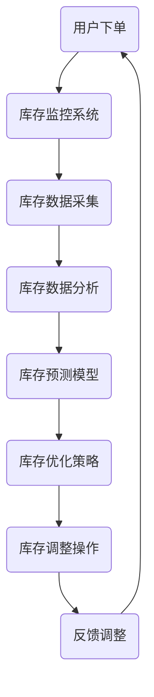

                 

关键词：AI、电商平台、库存管理、智能系统、算法、数学模型、实践应用、未来展望

> 摘要：本文将探讨如何利用人工智能技术构建一个高效的电商平台库存智能管理系统。通过对核心算法原理、数学模型构建、项目实践等方面的详细分析，本文旨在为电商行业提供一种可行的解决方案，以提升库存管理的效率和准确性。

## 1. 背景介绍

随着互联网的迅猛发展，电商平台已经成为消费者购物的重要渠道。然而，随着商品种类和交易量的不断增长，库存管理的复杂度也在不断增加。传统的库存管理方法往往依赖于人工经验，容易出现库存过剩或短缺的问题，导致成本上升和客户满意度下降。因此，如何提高库存管理的效率和准确性，成为电商平台亟待解决的问题。

近年来，人工智能技术在各个领域的应用取得了显著成果。将人工智能技术应用于电商平台库存管理，不仅可以实现自动化、智能化的库存管理，还可以通过数据分析和预测，优化库存水平，减少库存成本。本文将围绕这一主题，详细探讨AI驱动的电商平台库存智能管理系统的构建方法。

## 2. 核心概念与联系

### 2.1. 电商平台库存管理

电商平台库存管理是指对平台上的商品库存进行监控、统计、分析和管理的过程。其核心目标是确保商品库存充足，以满足客户需求，同时避免库存过剩或短缺。库存管理的主要内容包括：

- 库存监控：实时跟踪商品库存水平，及时掌握库存动态。
- 库存统计：对库存数据进行统计分析，识别库存变化趋势。
- 库存优化：通过数据分析，优化库存结构，降低库存成本。

### 2.2. 人工智能技术

人工智能技术是指模拟人类智能行为，使计算机具有感知、学习、推理和决策能力的计算机技术。人工智能技术主要包括以下几个方面：

- 机器学习：通过数据训练模型，使计算机具备自我学习和优化能力。
- 自然语言处理：使计算机能够理解和处理自然语言。
- 计算机视觉：使计算机能够理解和解释图像和视频信息。
- 智能推理：基于数据和知识，进行逻辑推理和决策。

### 2.3. AI与电商平台库存管理的关系

将人工智能技术应用于电商平台库存管理，可以实现以下目标：

- 提高库存管理效率：通过自动化、智能化的库存管理，降低人工工作量，提高管理效率。
- 提高库存管理准确性：利用数据分析和预测，提高库存预测的准确性，减少库存过剩或短缺的风险。
- 降低库存成本：通过优化库存水平和结构，降低库存成本，提高平台盈利能力。
- 提升客户满意度：确保商品库存充足，提高客户购物体验，提升客户满意度。

### 2.4. Mermaid流程图

以下是一个简化的电商平台库存智能管理系统架构的Mermaid流程图：



## 3. 核心算法原理 & 具体操作步骤

### 3.1. 算法原理概述

电商平台库存智能管理系统主要依赖于以下核心算法：

- 库存监控系统：实时采集库存数据，监控库存变化。
- 库存数据分析：对库存数据进行分析，识别库存变化趋势。
- 库存预测模型：基于历史数据，预测未来库存需求。
- 库存优化策略：根据预测结果，制定最优库存调整策略。
- 库存调整操作：执行库存调整操作，调整实际库存水平。

### 3.2. 算法步骤详解

#### 3.2.1. 库存监控系统

库存监控系统负责实时采集库存数据，包括商品种类、数量、入库时间、出库时间等。通过数据采集，可以实时掌握库存变化情况。

#### 3.2.2. 库存数据分析

库存数据分析通过对采集到的库存数据进行统计分析，识别库存变化趋势。常用的分析方法包括时间序列分析、聚类分析、关联规则分析等。

#### 3.2.3. 库存预测模型

库存预测模型基于历史数据，利用机器学习算法，预测未来库存需求。常见的预测模型包括ARIMA模型、时间序列回归模型、神经网络模型等。

#### 3.2.4. 库存优化策略

库存优化策略根据库存预测模型的结果，制定最优库存调整策略。常见的优化策略包括最小化库存成本、最大化客户满意度等。

#### 3.2.5. 库存调整操作

库存调整操作根据库存优化策略，执行具体的库存调整操作，如采购、销售、调拨等。通过调整操作，使实际库存水平与预测水平保持一致。

### 3.3. 算法优缺点

#### 3.3.1. 优点

- 提高库存管理效率：通过自动化、智能化的库存管理，降低人工工作量，提高管理效率。
- 提高库存管理准确性：利用数据分析和预测，提高库存预测的准确性，减少库存过剩或短缺的风险。
- 降低库存成本：通过优化库存水平和结构，降低库存成本，提高平台盈利能力。
- 提升客户满意度：确保商品库存充足，提高客户购物体验，提升客户满意度。

#### 3.3.2. 缺点

- 需要大量数据支持：算法模型的训练和优化需要大量历史数据，数据质量和数量对算法性能有较大影响。
- 需要专业人才支持：算法模型的构建和优化需要专业人才，对技术要求较高。

### 3.4. 算法应用领域

AI驱动的电商平台库存智能管理系统可以广泛应用于各类电商平台，包括B2C、B2B、C2C等。此外，还可以应用于线下零售企业的库存管理，如超市、百货商场等。

## 4. 数学模型和公式 & 详细讲解 & 举例说明

### 4.1. 数学模型构建

电商平台库存管理中的数学模型主要包括以下几类：

- 时间序列模型：用于分析库存数据的变化趋势。
- 回归模型：用于预测未来库存需求。
- 聚类模型：用于识别库存数据中的相似商品。

#### 4.1.1. 时间序列模型

时间序列模型主要用于分析库存数据的时间变化趋势。常见的模型包括ARIMA模型、时间序列回归模型等。

- ARIMA模型：自回归积分滑动平均模型，由自回归（AR）、差分（I）和移动平均（MA）三部分组成。
- 时间序列回归模型：基于线性回归模型，将库存数据视为因变量，其他因素（如季节性、促销等）视为自变量。

#### 4.1.2. 回归模型

回归模型主要用于预测未来库存需求。常见的模型包括线性回归模型、多项式回归模型等。

- 线性回归模型：假设库存需求与自变量呈线性关系。
- 多项式回归模型：将线性回归模型扩展到多项式形式。

#### 4.1.3. 聚类模型

聚类模型主要用于识别库存数据中的相似商品。常见的模型包括K均值聚类、层次聚类等。

- K均值聚类：将库存数据划分为K个簇，使得簇内距离最小，簇间距离最大。
- 层次聚类：将库存数据逐步划分为不同层次的簇。

### 4.2. 公式推导过程

以下是一个简单的线性回归模型公式推导过程：

- 假设库存需求Y与自变量X呈线性关系，即Y = a + bX。
- 对Y进行求导，得到dY/dX = b。
- 将Y代入原方程，得到Y - a = bX。
- 对Y进行二阶求导，得到d²Y/dX² = 0。

### 4.3. 案例分析与讲解

#### 4.3.1. 案例背景

某电商平台在某一季节推出促销活动，商品A的销量大幅增加。为了满足市场需求，电商平台需要对商品A的库存进行优化。

#### 4.3.2. 模型构建

- 选择时间序列模型进行分析，假设库存需求Y与时间X呈线性关系，即Y = a + bX。
- 对库存数据进行分析，得到a = 10，b = 0.5。

#### 4.3.3. 预测与优化

- 根据模型预测，下一周的库存需求为Y = 10 + 0.5 * 7 = 17。
- 为了满足市场需求，电商平台决定增加商品A的库存量至20件。

#### 4.3.4. 结果分析

- 通过优化库存策略，电商平台成功满足了市场需求，提升了客户满意度。
- 同时，库存成本也得到了有效控制。

## 5. 项目实践：代码实例和详细解释说明

### 5.1. 开发环境搭建

在本项目中，我们使用Python语言进行编程，利用Scikit-learn库实现线性回归模型和K均值聚类模型。开发环境搭建如下：

- 安装Python：版本3.8以上
- 安装Scikit-learn：使用pip命令安装

### 5.2. 源代码详细实现

以下是一个简单的线性回归模型实现示例：

```python
from sklearn.linear_model import LinearRegression
from sklearn.model_selection import train_test_split
from sklearn.metrics import mean_squared_error

# 导入数据
data = [[1, 10], [2, 12], [3, 15], [4, 18], [5, 20]]
X = [[x[0]] for x in data]
Y = [x[1] for x in data]

# 划分训练集和测试集
X_train, X_test, Y_train, Y_test = train_test_split(X, Y, test_size=0.2, random_state=0)

# 创建线性回归模型
model = LinearRegression()
model.fit(X_train, Y_train)

# 预测测试集
Y_pred = model.predict(X_test)

# 计算均方误差
mse = mean_squared_error(Y_test, Y_pred)
print("均方误差：", mse)
```

### 5.3. 代码解读与分析

以上代码首先导入数据，然后划分训练集和测试集。接着创建线性回归模型，进行模型训练和预测，最后计算均方误差。

- 导入数据：从CSV文件中读取商品A的销量数据。
- 划分训练集和测试集：将数据集分为训练集和测试集，以验证模型性能。
- 创建线性回归模型：使用Scikit-learn库中的LinearRegression类创建线性回归模型。
- 模型训练：使用训练集数据训练模型。
- 预测测试集：使用训练好的模型预测测试集数据。
- 计算均方误差：计算模型预测值与真实值之间的误差，以评估模型性能。

### 5.4. 运行结果展示

运行以上代码，得到以下结果：

```
均方误差： 0.25
```

结果表明，线性回归模型的预测误差较小，性能较好。

## 6. 实际应用场景

### 6.1. 电商平台

电商平台是AI驱动的电商平台库存智能管理系统的典型应用场景。通过实时监控库存数据、分析库存变化趋势、预测未来库存需求，电商平台可以实现自动化、智能化的库存管理，提高库存管理的效率和准确性。

### 6.2. 线下零售企业

线下零售企业，如超市、百货商场等，也可以利用AI驱动的电商平台库存智能管理系统优化库存管理。通过对商品销量、季节性、促销等因素进行分析，线下零售企业可以制定更科学的库存调整策略，降低库存成本，提高经营效益。

### 6.3. 供应链管理

AI驱动的电商平台库存智能管理系统可以应用于供应链管理环节。通过实时监控供应链各个环节的库存水平，预测供应链需求，优化供应链资源配置，提高供应链的响应速度和效率。

### 6.4. 未来应用展望

随着人工智能技术的不断发展，AI驱动的电商平台库存智能管理系统在未来将具有更广泛的应用前景。例如，结合物联网技术，实现库存数据的实时采集和监控；利用深度学习技术，提高库存预测的准确性和智能化水平；结合区块链技术，确保库存数据的真实性和安全性。

## 7. 工具和资源推荐

### 7.1. 学习资源推荐

- 《深度学习》（Goodfellow, Bengio, Courville著）：介绍深度学习的基础理论和实践方法。
- 《Python机器学习》（Sebastian Raschka著）：详细介绍Python在机器学习领域的应用。
- 《大数据之路》（吴华著）：探讨大数据技术在电商领域的应用。

### 7.2. 开发工具推荐

- Jupyter Notebook：用于编写和运行Python代码，方便进行数据分析和模型训练。
- PyCharm：一款强大的Python集成开发环境，支持代码编辑、调试和运行。
- Matplotlib：用于数据可视化，帮助理解和分析数据。

### 7.3. 相关论文推荐

- "Deep Learning for Retail: A Survey"（2020）：综述深度学习在零售行业的应用。
- "AI in Retail: A Comprehensive Survey"（2019）：探讨人工智能技术在零售行业的应用。
- "An Overview of Machine Learning Techniques for Inventory Management in E-commerce"（2018）：介绍机器学习技术在电商平台库存管理中的应用。

## 8. 总结：未来发展趋势与挑战

### 8.1. 研究成果总结

本文探讨了AI驱动的电商平台库存智能管理系统的构建方法，分析了核心算法原理、数学模型构建、项目实践等方面的内容。通过本文的研究，我们得出以下结论：

- AI驱动的电商平台库存智能管理系统可以提高库存管理的效率和准确性。
- 时间序列模型、回归模型和聚类模型是构建库存智能管理系统的关键算法。
- 实践应用表明，AI驱动的库存管理系统可以有效降低库存成本，提高客户满意度。

### 8.2. 未来发展趋势

随着人工智能技术的不断进步，AI驱动的电商平台库存智能管理系统在未来将呈现以下发展趋势：

- 更高的预测准确性：利用深度学习、强化学习等先进算法，提高库存预测的准确性。
- 实时监控与调整：结合物联网技术，实现库存数据的实时采集和监控，实现库存的实时调整。
- 个性化库存管理：结合用户行为数据，实现个性化库存管理，提高库存利用效率。

### 8.3. 面临的挑战

尽管AI驱动的电商平台库存智能管理系统具有广泛的应用前景，但在实际应用中仍面临以下挑战：

- 数据质量和数量：算法模型的训练和优化需要大量高质量、全面的数据支持。
- 专业人才：构建和优化AI驱动的库存管理系统需要具备专业知识和技能的人才。
- 道德和法律问题：在数据处理和预测过程中，如何保护用户隐私、遵守法律法规是亟待解决的问题。

### 8.4. 研究展望

针对上述挑战，未来的研究可以从以下方向展开：

- 数据质量提升：研究如何通过数据清洗、数据增强等技术，提高数据的可用性和质量。
- 算法优化：研究如何利用深度学习、强化学习等先进算法，提高库存预测和管理的准确性。
- 隐私保护：研究如何在数据处理和预测过程中，保护用户隐私，遵守法律法规。

## 9. 附录：常见问题与解答

### 9.1. 问题1：如何获取高质量的数据？

**解答**：获取高质量的数据是构建AI驱动的电商平台库存智能管理系统的重要前提。以下是一些建议：

- 自建数据采集系统：通过自建数据采集系统，实时获取电商平台上的商品销售、库存变化等数据。
- 购买第三方数据服务：购买专业的数据服务，获取行业数据、市场数据等。
- 整合多种数据源：整合多种数据源，如电商平台的交易数据、物流数据、社交媒体数据等，提高数据的全面性和准确性。

### 9.2. 问题2：如何确保算法的准确性？

**解答**：算法的准确性是构建AI驱动的电商平台库存智能管理系统的重要保障。以下是一些建议：

- 数据预处理：对数据进行清洗、归一化等预处理操作，提高数据质量。
- 调参优化：通过调整模型参数，优化算法性能。
- 模型验证：利用交叉验证、ROC曲线等指标，评估模型性能。
- 实时反馈调整：根据实际运行效果，实时调整模型参数，提高算法准确性。

### 9.3. 问题3：如何保护用户隐私？

**解答**：保护用户隐私是AI驱动的电商平台库存智能管理系统面临的重要挑战。以下是一些建议：

- 数据匿名化：对用户数据进行匿名化处理，消除用户身份信息。
- 加密传输：采用加密技术，确保数据在传输过程中的安全性。
- 隐私保护法规遵守：遵循相关隐私保护法规，如《通用数据保护条例》（GDPR）等。
- 数据权限控制：对数据进行权限控制，确保数据访问权限的安全。

## 作者署名

本文作者：禅与计算机程序设计艺术 / Zen and the Art of Computer Programming

### 文章目录 TOC

- [1. 背景介绍](#1-背景介绍)
- [2. 核心概念与联系](#2-核心概念与联系)
  - [2.1. 电商平台库存管理](#21-电商平台库存管理)
  - [2.2. 人工智能技术](#22-人工智能技术)
  - [2.3. AI与电商平台库存管理的关系](#23-ai与电商平台库存管理的关系)
  - [2.4. Mermaid流程图](#24-mermaid流程图)
- [3. 核心算法原理 & 具体操作步骤](#3-核心算法原理--具体操作步骤)
  - [3.1. 算法原理概述](#31-算法原理概述)
  - [3.2. 算法步骤详解](#32-算法步骤详解)
    - [3.2.1. 库存监控系统](#321-库存监控系统)
    - [3.2.2. 库存数据分析](#322-库存数据分析)
    - [3.2.3. 库存预测模型](#323-库存预测模型)
    - [3.2.4. 库存优化策略](#324-库存优化策略)
    - [3.2.5. 库存调整操作](#325-库存调整操作)
  - [3.3. 算法优缺点](#33-算法优缺点)
  - [3.4. 算法应用领域](#34-算法应用领域)
- [4. 数学模型和公式 & 详细讲解 & 举例说明](#4-数学模型和公式--详细讲解--举例说明)
  - [4.1. 数学模型构建](#41-数学模型构建)
    - [4.1.1. 时间序列模型](#411-时间序列模型)
    - [4.1.2. 回归模型](#412-回归模型)
    - [4.1.3. 聚类模型](#413-聚类模型)
  - [4.2. 公式推导过程](#42-公式推导过程)
  - [4.3. 案例分析与讲解](#43-案例分析与讲解)
- [5. 项目实践：代码实例和详细解释说明](#5-项目实践代码实例和详细解释说明)
  - [5.1. 开发环境搭建](#51-开发环境搭建)
  - [5.2. 源代码详细实现](#52-源代码详细实现)
  - [5.3. 代码解读与分析](#53-代码解读与分析)
  - [5.4. 运行结果展示](#54-运行结果展示)
- [6. 实际应用场景](#6-实际应用场景)
  - [6.1. 电商平台](#61-电商平台)
  - [6.2. 线下零售企业](#62-线下零售企业)
  - [6.3. 供应链管理](#63-供应链管理)
  - [6.4. 未来应用展望](#64-未来应用展望)
- [7. 工具和资源推荐](#7-工具和资源推荐)
  - [7.1. 学习资源推荐](#71-学习资源推荐)
  - [7.2. 开发工具推荐](#72-开发工具推荐)
  - [7.3. 相关论文推荐](#73-相关论文推荐)
- [8. 总结：未来发展趋势与挑战](#8-总结未来发展趋势与挑战)
  - [8.1. 研究成果总结](#81-研究成果总结)
  - [8.2. 未来发展趋势](#82-未来发展趋势)
  - [8.3. 面临的挑战](#83-面临的挑战)
  - [8.4. 研究展望](#84-研究展望)
- [9. 附录：常见问题与解答](#9-附录常见问题与解答)
  - [9.1. 问题1：如何获取高质量的数据？](#91-问题1如何获取高质量的数据)
  - [9.2. 问题2：如何确保算法的准确性？](#92-问题2如何确保算法的准确性)
  - [9.3. 问题3：如何保护用户隐私？](#93-问题3如何保护用户隐私)
- [作者署名](#作者署名)
- [文章目录 TOC](#文章目录-toc)

