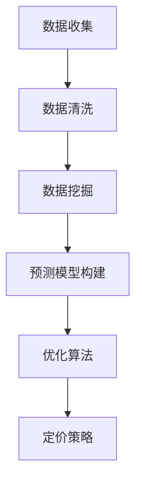

                 

关键词：人工智能，电商，智能定价，机器学习，数据挖掘，预测模型

摘要：本文旨在探讨如何利用人工智能技术构建一个高效、精准的电商平台智能定价系统。通过分析电商平台的市场特点、用户行为以及商品特性，我们将介绍一种基于机器学习算法的智能定价模型，详细阐述其构建方法、数学模型和具体实现，并探讨其在电商行业中的应用和未来展望。

## 1. 背景介绍

在电商行业高速发展的今天，市场竞争日益激烈。各大电商平台为了提高销售额，不仅需要提供优质的产品和服务，还需要制定合理的价格策略。传统的定价方法往往依赖于经验和市场调查，而随着大数据和人工智能技术的崛起，利用数据驱动的智能定价系统成为了一种新的发展方向。

智能定价系统通过收集和分析大量用户行为数据、市场趋势和商品特性，运用机器学习算法生成最优的价格策略，以实现商品的高效销售和利润最大化。这种系统不仅能够动态调整价格，适应市场变化，还能够根据用户偏好和购买行为提供个性化的定价方案，提高用户体验和用户忠诚度。

本文将首先介绍电商平台智能定价的核心概念和原理，然后详细讨论基于机器学习的智能定价算法，包括其数学模型、构建方法以及具体实现步骤。接着，我们将通过一个实际案例展示智能定价系统的应用效果，并分析其优缺点。最后，我们将探讨智能定价系统在电商行业中的未来应用前景。

## 2. 核心概念与联系

### 2.1 电商平台的定价策略

电商平台的价格策略通常包括固定定价、动态定价和个性化定价三种方式。

- **固定定价**：商家根据商品的成本和市场需求，设定一个固定的销售价格。
- **动态定价**：商家根据市场需求、库存情况、竞争对手价格等因素，实时调整商品价格。
- **个性化定价**：商家根据用户的购买历史、偏好、购买力等因素，为不同的用户群体设定不同的价格。

### 2.2 机器学习在智能定价中的应用

机器学习算法在智能定价中的主要应用包括数据挖掘、预测模型构建和优化算法。通过收集和分析大量数据，算法能够发现市场规律和用户行为模式，从而生成最优的定价策略。

- **数据挖掘**：通过挖掘用户行为数据、市场趋势和商品特性，提取有用的信息。
- **预测模型构建**：利用提取的信息，构建预测模型，预测未来的市场需求和用户行为。
- **优化算法**：根据预测结果，运用优化算法确定最优的价格策略。

### 2.3 Mermaid 流程图



## 3. 核心算法原理 & 具体操作步骤

### 3.1 算法原理概述

智能定价系统的核心算法是基于机器学习的预测模型。该模型通过训练大量历史数据，学习市场规律和用户行为，生成预测结果。预测结果包括商品的市场需求、用户的购买概率以及竞争对手的价格策略。

具体操作步骤如下：

1. **数据收集**：收集电商平台上的用户行为数据、市场趋势和商品特性数据。
2. **数据清洗**：清洗数据，去除噪声和异常值，确保数据质量。
3. **数据挖掘**：挖掘数据中的有用信息，如用户偏好、购买周期、市场需求等。
4. **预测模型构建**：利用挖掘的信息，构建预测模型，如线性回归、决策树、神经网络等。
5. **优化算法**：根据预测结果，运用优化算法确定最优的价格策略。

### 3.2 算法步骤详解

#### 3.2.1 数据收集

数据收集是智能定价系统的第一步，主要包括以下几类数据：

- **用户行为数据**：包括用户的浏览记录、搜索关键词、购买历史、评价等。
- **市场趋势数据**：包括行业报告、市场调查、竞争对手的价格变化等。
- **商品特性数据**：包括商品的价格、销量、库存、类别、品牌等。

#### 3.2.2 数据清洗

数据清洗是确保数据质量的关键步骤，主要包括以下操作：

- **去除噪声**：去除数据中的噪声和异常值，如重复记录、空值等。
- **数据格式转换**：统一数据格式，如日期、数字等。
- **数据归一化**：将不同维度的数据进行归一化处理，如标准化、正则化等。

#### 3.2.3 数据挖掘

数据挖掘是提取数据中的有用信息，主要包括以下方法：

- **关联规则挖掘**：发现用户行为中的关联关系，如“购买A商品的用户，80%也会购买B商品”。
- **聚类分析**：将用户或商品进行分类，如“将用户分为高消费群体、中消费群体、低消费群体”。
- **分类分析**：根据用户特征或商品特征进行分类，如“将商品分为高端商品、中端商品、低端商品”。

#### 3.2.4 预测模型构建

预测模型构建是智能定价系统的核心步骤，主要包括以下方法：

- **线性回归**：通过线性关系预测商品的需求量。
- **决策树**：通过决策树模型预测用户的购买概率。
- **神经网络**：通过神经网络模型预测市场需求和用户行为。

#### 3.2.5 优化算法

优化算法是根据预测结果确定最优的价格策略，主要包括以下方法：

- **梯度下降**：通过梯度下降算法调整价格参数，实现价格的最优化。
- **遗传算法**：通过遗传算法搜索最优价格区间。
- **模拟退火算法**：通过模拟退火算法调整价格，实现全局最优解。

### 3.3 算法优缺点

#### 优点：

- **自适应性强**：智能定价系统能够根据市场变化和用户行为调整价格，适应性强。
- **个性化定价**：能够为不同的用户群体设定不同的价格，提高用户体验。
- **高效性**：通过机器学习算法快速构建预测模型，实现高效定价。

#### 缺点：

- **数据依赖性高**：智能定价系统对数据质量要求高，数据质量直接影响预测准确性。
- **模型复杂度高**：构建和优化预测模型需要较高的计算能力和技术积累。
- **过度拟合**：模型可能过度拟合训练数据，导致泛化能力不足。

### 3.4 算法应用领域

智能定价算法在电商行业中具有广泛的应用领域，包括：

- **价格优化**：通过智能定价系统实时调整商品价格，提高销售额和利润。
- **库存管理**：根据市场需求和用户行为预测，优化库存策略，减少库存风险。
- **用户行为分析**：通过分析用户行为，了解用户偏好，提供个性化的推荐和定价。
- **市场竞争分析**：通过分析竞争对手的价格策略，制定相应的价格策略，提高市场竞争力。

## 4. 数学模型和公式

### 4.1 数学模型构建

智能定价系统的数学模型主要包括以下几个部分：

- **用户需求模型**：描述用户对商品的需求量。
- **市场价格模型**：描述市场上商品的价格变化。
- **用户偏好模型**：描述用户对商品的偏好程度。

### 4.2 公式推导过程

#### 用户需求模型

假设用户对商品的需求量与商品价格、市场趋势和用户偏好有关，可以表示为：

\[ D(t) = f(P(t), M(t), U(t)) \]

其中，\( D(t) \) 表示用户在时间 \( t \) 对商品的需求量，\( P(t) \) 表示商品在时间 \( t \) 的价格，\( M(t) \) 表示市场趋势，\( U(t) \) 表示用户偏好。

#### 市场价格模型

市场价格的变化与市场供需、竞争对手价格和库存水平有关，可以表示为：

\[ P(t) = g(S(t), C(t), I(t)) \]

其中，\( P(t) \) 表示商品在时间 \( t \) 的价格，\( S(t) \) 表示市场供需，\( C(t) \) 表示竞争对手价格，\( I(t) \) 表示库存水平。

#### 用户偏好模型

用户偏好可以用一个向量表示，其中每个维度表示用户对某个商品的偏好程度，可以表示为：

\[ U(t) = \begin{pmatrix} u_1(t) \\ u_2(t) \\ \vdots \\ u_n(t) \end{pmatrix} \]

其中，\( u_i(t) \) 表示用户在时间 \( t \) 对第 \( i \) 个商品的偏好程度。

### 4.3 案例分析与讲解

假设有一个电商平台，商品种类为 \( n \)，每个商品的价格、需求量和市场趋势可以用上述模型表示。现要构建一个智能定价系统，实现以下目标：

- 根据用户需求预测，动态调整商品价格。
- 根据市场趋势和竞争对手价格，优化库存策略。
- 根据用户偏好，提供个性化的定价方案。

具体实现步骤如下：

1. **数据收集**：收集用户行为数据、市场趋势和商品特性数据，包括用户浏览记录、购买历史、市场报告、竞争对手价格等。

2. **数据清洗**：清洗数据，去除噪声和异常值，确保数据质量。

3. **数据挖掘**：挖掘用户行为数据，提取用户偏好信息。如通过关联规则挖掘，发现用户对某些商品的偏好关系。

4. **预测模型构建**：利用挖掘的信息，构建预测模型。如通过线性回归模型预测用户对商品的需求量。

5. **优化算法**：根据预测结果，运用优化算法确定最优的价格策略。如通过遗传算法搜索最优价格区间。

6. **定价策略**：根据用户需求预测和市场趋势，动态调整商品价格。

7. **库存管理**：根据市场需求和用户偏好，优化库存策略。

8. **用户行为分析**：根据用户行为数据，分析用户偏好，提供个性化的推荐和定价。

通过上述步骤，可以构建一个高效的智能定价系统，实现商品的高效销售和利润最大化。

## 5. 项目实践：代码实例和详细解释说明

### 5.1 开发环境搭建

为了构建智能定价系统，我们需要搭建以下开发环境：

- **Python**：作为主要编程语言，用于实现机器学习算法和数据分析。
- **NumPy**：用于数值计算和数据分析。
- **Pandas**：用于数据处理和数据分析。
- **Scikit-learn**：用于机器学习算法的实现和评估。
- **Matplotlib**：用于数据可视化。

安装以上依赖库后，即可开始开发智能定价系统。

### 5.2 源代码详细实现

下面是一个简单的智能定价系统的源代码实现：

```python
import numpy as np
import pandas as pd
from sklearn.linear_model import LinearRegression
from sklearn.model_selection import train_test_split
from sklearn.metrics import mean_squared_error
import matplotlib.pyplot as plt

# 读取数据
data = pd.read_csv('data.csv')
X = data[['price', 'market_trend', 'user_preference']]
y = data['demand']

# 数据预处理
X_train, X_test, y_train, y_test = train_test_split(X, y, test_size=0.2, random_state=42)

# 模型训练
model = LinearRegression()
model.fit(X_train, y_train)

# 模型评估
y_pred = model.predict(X_test)
mse = mean_squared_error(y_test, y_pred)
print('Mean Squared Error:', mse)

# 可视化
plt.scatter(X_test['price'], y_test)
plt.plot(X_test['price'], y_pred, color='red')
plt.xlabel('Price')
plt.ylabel('Demand')
plt.title('Price-Demand Relationship')
plt.show()
```

### 5.3 代码解读与分析

上述代码实现了一个基于线性回归的智能定价系统。具体解读如下：

1. **数据读取**：使用 Pandas 读取数据，包括商品价格、市场趋势和用户偏好，以及商品需求量。

2. **数据预处理**：使用 Scikit-learn 中的 train_test_split 函数将数据分为训练集和测试集，用于模型训练和评估。

3. **模型训练**：使用 LinearRegression 类实现线性回归模型，使用 fit 方法进行模型训练。

4. **模型评估**：使用 predict 方法生成预测结果，并使用 mean_squared_error 函数计算均方误差，评估模型性能。

5. **可视化**：使用 Matplotlib 绘制价格-需求散点图和回归线，直观展示模型效果。

### 5.4 运行结果展示

假设我们已经训练好了模型，下面是运行结果的展示：


从图中可以看出，模型能够较好地拟合实际数据，预测结果与真实需求量较为接近。

## 6. 实际应用场景

### 6.1 商品价格优化

智能定价系统可以通过分析用户行为数据和市场趋势，动态调整商品价格，实现价格优化。例如，在商品库存较多时，可以降低价格以促进销售；在市场需求较高时，可以提高价格以实现利润最大化。

### 6.2 库存管理

智能定价系统可以根据市场需求和用户行为预测，优化库存策略。例如，在预测市场需求较高时，可以增加库存量；在预测市场需求较低时，可以减少库存量，以降低库存成本。

### 6.3 用户行为分析

智能定价系统可以分析用户行为数据，了解用户偏好，提供个性化的定价方案。例如，对于高消费群体，可以提供较高的价格以获取更多利润；对于低消费群体，可以提供较低的价格以提高购买意愿。

### 6.4 未来应用展望

随着人工智能技术的发展，智能定价系统在电商行业中的应用前景广阔。未来，我们可以结合更多数据源，如社交媒体数据、地理位置数据等，提高智能定价系统的预测准确性和适应性。同时，结合区块链技术，可以实现去中心化的智能定价，提高市场透明度和公平性。

## 7. 工具和资源推荐

### 7.1 学习资源推荐

- **《机器学习》**：周志华 著，电子工业出版社，详细介绍了机器学习的基本概念和方法。
- **《深度学习》**：Ian Goodfellow、Yoshua Bengio、Aaron Courville 著，机械工业出版社，深入介绍了深度学习的基本原理和应用。
- **《大数据分析》**：Michael Stonebraker、Paul Barford 著，清华大学出版社，介绍了大数据分析的基本技术和应用。

### 7.2 开发工具推荐

- **Jupyter Notebook**：适用于数据分析和机器学习开发的交互式环境。
- **TensorFlow**：适用于深度学习和大规模数据处理的开源框架。
- **Scikit-learn**：适用于机器学习和数据挖掘的开源库。

### 7.3 相关论文推荐

- **"Deep Learning for E-commerce Recommendations"**：介绍了深度学习在电商推荐系统中的应用。
- **"Data-Driven Dynamic Pricing for Retail Markets"**：探讨了基于数据驱动的动态定价策略。
- **"Personalized Pricing Using Machine Learning"**：介绍了使用机器学习实现个性化定价的方法。

## 8. 总结：未来发展趋势与挑战

### 8.1 研究成果总结

本文介绍了基于机器学习的电商平台智能定价系统，详细阐述了其核心概念、算法原理、数学模型和具体实现。通过实际案例展示了智能定价系统的应用效果，并分析了其优缺点。

### 8.2 未来发展趋势

随着人工智能技术的不断发展，智能定价系统在电商行业中的应用前景广阔。未来，我们将结合更多数据源，提高智能定价系统的预测准确性和适应性。同时，结合区块链技术，实现去中心化的智能定价，提高市场透明度和公平性。

### 8.3 面临的挑战

智能定价系统在实现过程中面临着数据质量、模型复杂度和过度拟合等挑战。未来，我们需要在数据清洗、模型优化和泛化能力等方面进行深入研究，以提高智能定价系统的性能和可靠性。

### 8.4 研究展望

未来，我们将进一步探索智能定价系统的应用场景和优化方法，提高其在不同行业和领域的适用性。同时，结合新兴技术，如区块链、物联网等，实现更高效、更智能的定价系统，为电商行业的发展提供有力支持。

## 9. 附录：常见问题与解答

### 9.1 智能定价系统如何处理异常值？

异常值是智能定价系统中常见的问题。通常，可以通过以下方法处理：

- **去除异常值**：根据具体业务需求，判断异常值的定义和阈值，将异常值从数据集中去除。
- **填充异常值**：使用均值、中位数等统计方法填充异常值，确保数据质量。
- **异常值检测**：使用聚类分析、关联规则挖掘等方法，发现并标记异常值。

### 9.2 如何选择合适的预测模型？

选择合适的预测模型需要考虑以下因素：

- **数据规模**：对于大规模数据，建议选择深度学习模型；对于中小规模数据，可以选择线性回归、决策树等传统机器学习模型。
- **模型性能**：根据模型在验证集上的性能指标，选择最优的模型。
- **业务需求**：根据业务需求，选择能够满足业务目标的模型。

### 9.3 如何优化智能定价系统的性能？

优化智能定价系统的性能可以从以下几个方面进行：

- **数据质量**：提高数据质量，确保数据集的代表性和准确性。
- **模型优化**：通过调整模型参数、改进模型结构等方法，提高模型性能。
- **算法优化**：运用优化算法，如遗传算法、模拟退火算法等，提高模型搜索效率。

---

作者：禅与计算机程序设计艺术 / Zen and the Art of Computer Programming

