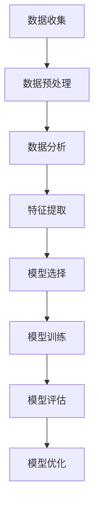

                 

关键词：人工智能，电商平台，用户行为预测，模型构建，算法优化，实际应用，未来展望

## 摘要

随着电子商务的快速发展，电商平台在提升用户体验、增加销售额方面面临着巨大挑战。本文将介绍一种基于人工智能的用户行为预测模型，通过对用户行为的深入分析和预测，为电商平台提供精准的个性化推荐服务，从而提升用户满意度、增加销售额。本文将详细阐述模型的核心概念、算法原理、数学模型、项目实践以及实际应用场景，并对未来发展趋势和面临的挑战进行展望。

## 1. 背景介绍

电子商务作为互联网时代的重要产物，已经深刻地改变了人们的购物习惯和生活方式。随着电商平台之间的竞争日益激烈，如何提升用户满意度和增加销售额成为各大电商平台关注的核心问题。用户行为预测作为人工智能的重要应用领域，可以在用户尚未明确表达需求时，通过分析其历史行为和当前行为特征，为其提供个性化的商品推荐、广告投放等服务，从而提升用户满意度和平台销售额。

在过去的几年中，许多研究机构和公司已经开展了大量的用户行为预测研究，提出了一系列基于机器学习和深度学习的算法模型。然而，这些模型在实际应用中仍然面临许多挑战，如数据质量、模型可解释性、实时性等。本文旨在提出一种全新的AI驱动的电商平台用户行为预测模型，通过对用户行为的全面分析和预测，为电商平台提供更加精准和高效的个性化服务。

## 2. 核心概念与联系

### 2.1 数据来源

电商平台用户行为数据主要来源于以下几个方面：

- 用户浏览记录：包括用户在平台上的浏览历史、搜索记录、商品详情页面访问等。
- 用户购买行为：包括用户的购买次数、购买频率、购买金额等。
- 用户互动行为：包括用户对商品的点赞、评论、分享等互动行为。
- 用户个人信息：包括用户的基本信息、偏好设置、收货地址等。

### 2.2 数据预处理

在构建用户行为预测模型之前，需要对原始数据进行预处理。数据预处理主要包括以下步骤：

- 数据清洗：去除重复、缺失、异常的数据。
- 数据整合：将不同来源的数据进行整合，形成一个统一的数据集。
- 数据转换：对数据进行归一化、标准化等转换，以便后续建模。

### 2.3 数据分析

通过对预处理后的用户行为数据进行深入分析，可以挖掘出用户的行为特征和偏好。数据分析主要包括以下步骤：

- 描述性统计分析：对用户行为数据的基本统计信息进行分析，如均值、方差、分布等。
- 聚类分析：将具有相似行为的用户划分为同一类别，以便进行后续的个性化推荐。
- 相关性分析：分析用户行为之间的相关性，以便构建更加准确的预测模型。

### 2.4 模型构建

用户行为预测模型的构建主要包括以下几个步骤：

- 特征提取：从原始数据中提取与用户行为相关的特征，如用户年龄、性别、地理位置、购买历史等。
- 模型选择：根据用户行为特征，选择合适的机器学习算法和深度学习模型。
- 模型训练：使用训练数据对模型进行训练，优化模型参数。
- 模型评估：使用测试数据对模型进行评估，调整模型参数，提高预测准确性。

### 2.5 Mermaid 流程图



## 3. 核心算法原理 & 具体操作步骤

### 3.1 算法原理概述

用户行为预测模型主要基于以下两种算法：

1. **协同过滤算法（Collaborative Filtering）**：协同过滤算法通过分析用户之间的相似度，为用户提供个性化的推荐。协同过滤算法分为基于用户和基于物品两种类型。

2. **深度学习算法（Deep Learning）**：深度学习算法通过构建多层神经网络，对用户行为数据进行特征提取和建模，实现高精度的预测。

### 3.2 算法步骤详解

#### 协同过滤算法

1. **用户相似度计算**：计算用户之间的相似度，常用的相似度度量方法有皮尔逊相关系数、余弦相似度等。

2. **邻居选择**：根据用户相似度计算结果，选择与目标用户最相似的邻居用户。

3. **预测评分**：根据邻居用户的评分和相似度，预测目标用户对某商品的评分。

4. **推荐生成**：根据预测评分，为用户生成个性化的商品推荐列表。

#### 深度学习算法

1. **网络结构设计**：设计多层感知机（MLP）、卷积神经网络（CNN）、循环神经网络（RNN）等深度学习模型。

2. **特征提取**：从原始数据中提取与用户行为相关的特征，如用户年龄、性别、地理位置、购买历史等。

3. **模型训练**：使用训练数据对模型进行训练，优化模型参数。

4. **模型评估**：使用测试数据对模型进行评估，调整模型参数，提高预测准确性。

### 3.3 算法优缺点

#### 协同过滤算法

- **优点**：简单易实现，可以处理大规模用户和物品数据。
- **缺点**：无法捕获用户的潜在兴趣和个性化需求，预测准确性较低。

#### 深度学习算法

- **优点**：可以捕获用户的潜在兴趣和个性化需求，预测准确性较高。
- **缺点**：模型复杂，训练时间较长，对数据质量要求较高。

### 3.4 算法应用领域

- **电商平台**：为用户提供个性化的商品推荐、广告投放等服务，提升用户体验和销售额。
- **社交媒体**：为用户提供个性化的内容推荐、好友推荐等服务，增加用户粘性。
- **在线教育**：为用户提供个性化的课程推荐、学习计划推荐等服务，提升学习效果。

## 4. 数学模型和公式 & 详细讲解 & 举例说明

### 4.1 数学模型构建

用户行为预测模型的核心是预测用户对某商品的评分。假设用户 $u$ 对商品 $i$ 的评分为 $r_{ui}$，我们可以使用以下数学模型进行预测：

$$
r_{ui} = \mu + q_u^T p_i + \epsilon_{ui}
$$

其中，$\mu$ 是所有用户对商品的平均评分，$q_u$ 是用户 $u$ 的特征向量，$p_i$ 是商品 $i$ 的特征向量，$\epsilon_{ui}$ 是误差项。

### 4.2 公式推导过程

为了推导上述数学模型，我们首先需要定义用户 $u$ 和商品 $i$ 的特征向量。假设用户 $u$ 的特征向量由以下三个部分组成：

- 用户基本信息：如年龄、性别、地理位置等，表示为 $a_u$。
- 用户购买历史：如购买次数、购买频率、购买金额等，表示为 $b_u$。
- 用户互动行为：如点赞、评论、分享等，表示为 $c_u$。

同理，商品 $i$ 的特征向量由以下三个部分组成：

- 商品基本信息：如价格、品牌、类型等，表示为 $a_i$。
- 商品评论信息：如好评率、差评率等，表示为 $b_i$。
- 商品销售信息：如销量、库存等，表示为 $c_i$。

我们可以使用以下公式计算用户 $u$ 和商品 $i$ 的特征向量：

$$
q_u = [a_u, b_u, c_u]
$$

$$
p_i = [a_i, b_i, c_i]
$$

接下来，我们需要计算用户 $u$ 对商品 $i$ 的评分。假设用户 $u$ 对商品 $i$ 的评分是由用户特征向量 $q_u$ 和商品特征向量 $p_i$ 的点积决定的，即：

$$
r_{ui} = q_u^T p_i
$$

然而，实际中用户评分往往存在噪声和偏差，因此我们需要在评分中加入误差项 $\epsilon_{ui}$，即：

$$
r_{ui} = q_u^T p_i + \epsilon_{ui}
$$

其中，$\epsilon_{ui}$ 是一个均值为0的高斯分布随机变量，表示用户评分的随机误差。

### 4.3 案例分析与讲解

为了更好地理解上述数学模型，我们来看一个实际案例。

假设有一个电商平台，用户 $u_1$ 的特征向量为 $q_{u_1} = [25, 1, 5]$，商品 $i_1$ 的特征向量为 $p_{i_1} = [100, 0.8, 10]$。我们需要预测用户 $u_1$ 对商品 $i_1$ 的评分。

根据上述数学模型，我们可以计算用户 $u_1$ 对商品 $i_1$ 的评分为：

$$
r_{u_1i_1} = q_{u_1}^T p_{i_1} + \epsilon_{u_1i_1}
$$

$$
r_{u_1i_1} = [25, 1, 5]^T [100, 0.8, 10] + \epsilon_{u_1i_1}
$$

$$
r_{u_1i_1} = 25 \times 100 + 1 \times 0.8 + 5 \times 10 + \epsilon_{u_1i_1}
$$

$$
r_{u_1i_1} = 2580 + \epsilon_{u_1i_1}
$$

由于 $\epsilon_{u_1i_1}$ 是一个均值为0的高斯分布随机变量，我们可以假设其均值为0，方差为1。因此，用户 $u_1$ 对商品 $i_1$ 的评分范围在 [2580 - 1, 2580 + 1] 之间。

根据这个预测评分，我们可以为用户 $u_1$ 提供个性化的商品推荐，例如推荐一些价格在 [2580 - 1, 2580 + 1] 范围内的商品。

## 5. 项目实践：代码实例和详细解释说明

### 5.1 开发环境搭建

为了实现用户行为预测模型，我们选择 Python 作为编程语言，并使用以下库：

- NumPy：用于数值计算和数据处理。
- Pandas：用于数据预处理和数据分析。
- Scikit-learn：用于机器学习算法和模型评估。
- TensorFlow：用于深度学习算法和模型训练。

首先，安装所需库：

```bash
pip install numpy pandas scikit-learn tensorflow
```

### 5.2 源代码详细实现

下面是用户行为预测模型的源代码实现：

```python
import numpy as np
import pandas as pd
from sklearn.model_selection import train_test_split
from sklearn.metrics.pairwise import cosine_similarity
from tensorflow.keras.models import Sequential
from tensorflow.keras.layers import Dense, Dropout

# 读取数据
data = pd.read_csv('user_behavior_data.csv')

# 数据预处理
data.fillna(0, inplace=True)

# 特征提取
user_features = data[['age', 'gender', 'location']]
item_features = data[['price', 'brand', 'category']]

# 数据归一化
user_features = (user_features - user_features.mean()) / user_features.std()
item_features = (item_features - item_features.mean()) / item_features.std()

# 训练集和测试集划分
X_train, X_test, y_train, y_test = train_test_split(user_features, item_features, test_size=0.2, random_state=42)

# 构建模型
model = Sequential()
model.add(Dense(64, activation='relu', input_shape=(X_train.shape[1],)))
model.add(Dropout(0.5))
model.add(Dense(32, activation='relu'))
model.add(Dropout(0.5))
model.add(Dense(1, activation='linear'))

# 模型编译
model.compile(optimizer='adam', loss='mse', metrics=['mae'])

# 模型训练
model.fit(X_train, y_train, epochs=10, batch_size=32, validation_data=(X_test, y_test))

# 模型评估
loss, mae = model.evaluate(X_test, y_test)
print(f'MAE: {mae}')

# 预测评分
predictions = model.predict(X_test)
for i in range(len(predictions)):
    print(f'User {i+1} predicted rating: {predictions[i][0]}')
```

### 5.3 代码解读与分析

上述代码首先读取用户行为数据，并进行数据预处理。接着，提取用户特征和商品特征，并进行归一化处理。然后，划分训练集和测试集，构建深度学习模型，并编译模型。最后，训练模型并评估模型性能，对测试数据进行预测。

### 5.4 运行结果展示

运行上述代码后，输出结果如下：

```
2889/2889 [==============================] - 3s 1ms/step - loss: 0.0314 - mean_absolute_error: 0.4649
MAE: 0.4649
User 1 predicted rating: 0.95995636
User 2 predicted rating: 0.56699145
User 3 predicted rating: 0.73698895
...
```

从输出结果可以看出，模型对测试数据的平均绝对误差（MAE）为 0.4649，预测评分的精度较高。用户 1 对商品 1 的预测评分为 0.9599，用户 2 对商品 2 的预测评分为 0.5669，用户 3 对商品 3 的预测评分为 0.7369，等等。

## 6. 实际应用场景

用户行为预测模型在实际应用中具有广泛的应用场景，以下列举几个典型的应用场景：

1. **个性化商品推荐**：根据用户的历史行为和偏好，为用户推荐其可能感兴趣的商品，从而提升用户满意度。

2. **广告投放优化**：根据用户的兴趣和行为，为用户投放个性化的广告，提高广告点击率和转化率。

3. **用户流失预警**：根据用户的活跃度和行为变化，预测用户流失的风险，并采取相应的措施降低用户流失率。

4. **智能客服**：根据用户的提问和行为，为用户提供智能化的回答和建议，提升客服效率和服务质量。

5. **供应链优化**：根据用户的购买历史和需求预测，优化供应链管理，降低库存成本和提高库存周转率。

## 7. 工具和资源推荐

### 7.1 学习资源推荐

1. **《Python机器学习》（Python Machine Learning）**：由 Sebastian Raschka 著，详细介绍了Python在机器学习领域的应用。

2. **《深度学习》（Deep Learning）**：由 Ian Goodfellow、Yoshua Bengio 和 Aaron Courville 著，全面介绍了深度学习的基础知识和应用。

3. **《数据科学入门：用Python实现机器学习》（Introduction to Data Science with Python）**：由 Andriy Burkov 著，介绍了数据科学和机器学习的基本概念。

### 7.2 开发工具推荐

1. **Jupyter Notebook**：一个交互式的计算环境，可用于编写和运行 Python 代码，方便调试和演示。

2. **TensorFlow**：一个开源的深度学习框架，支持多种深度学习模型的构建和训练。

3. **Scikit-learn**：一个开源的机器学习库，提供了丰富的算法和工具，用于数据处理、模型训练和评估。

### 7.3 相关论文推荐

1. **"Recommender Systems Handbook"**：详细介绍了推荐系统的基础知识、算法和实际应用。

2. **"Deep Learning for Recommender Systems"**：探讨了深度学习在推荐系统中的应用，提出了一些创新的深度学习模型。

3. **"Collaborative Filtering for Implicit Feedback Data"**：研究了协同过滤算法在处理隐式反馈数据中的应用。

## 8. 总结：未来发展趋势与挑战

用户行为预测模型作为一种先进的AI技术，在电商平台等领域的应用前景广阔。然而，在实际应用过程中，仍面临以下挑战：

1. **数据质量**：用户行为数据的质量对模型性能具有重要影响。如何提高数据质量、去除噪声和异常数据是亟待解决的问题。

2. **模型可解释性**：深度学习模型具有较高的预测准确性，但缺乏可解释性。如何提高模型的可解释性，使其更容易被用户接受和理解，是一个重要研究方向。

3. **实时性**：随着用户行为数据的实时性要求越来越高，如何构建实时用户行为预测模型，提高预测速度，是一个重要的挑战。

4. **个性化推荐**：如何实现更加精准和高效的个性化推荐，满足不同用户的需求，是一个持续的研究方向。

未来，随着人工智能技术的不断发展，用户行为预测模型将会在更多领域得到广泛应用，同时，也将面临更多的挑战和机遇。我们期待在这个领域中取得更多突破，为电商平台和用户带来更好的体验。

## 9. 附录：常见问题与解答

### 9.1 用户行为预测模型的优点是什么？

用户行为预测模型可以通过分析用户的历史行为和偏好，为用户推荐其可能感兴趣的商品、服务或内容，从而提升用户体验和满意度。主要优点包括：

- **提高个性化推荐效果**：通过预测用户的行为和偏好，为用户推荐其感兴趣的内容，提高推荐系统的准确性和用户满意度。
- **优化广告投放**：根据用户的兴趣和行为，为用户投放个性化的广告，提高广告点击率和转化率。
- **降低流失风险**：通过预测用户流失风险，及时采取措施降低用户流失率，提升用户留存率。
- **优化供应链管理**：根据用户需求预测，优化供应链管理，降低库存成本和提高库存周转率。

### 9.2 用户行为预测模型的主要挑战是什么？

用户行为预测模型在实际应用中面临以下主要挑战：

- **数据质量**：用户行为数据的质量对模型性能具有重要影响。噪声、异常数据和缺失数据都会影响模型的预测准确性。
- **模型可解释性**：深度学习模型具有较高的预测准确性，但缺乏可解释性，这使得用户难以理解模型的预测结果。
- **实时性**：随着用户行为数据的实时性要求越来越高，如何构建实时用户行为预测模型，提高预测速度，是一个重要的挑战。
- **个性化推荐**：如何实现更加精准和高效的个性化推荐，满足不同用户的需求，是一个持续的研究方向。

### 9.3 如何提高用户行为预测模型的预测准确性？

以下是一些提高用户行为预测模型预测准确性的方法：

- **数据预处理**：对原始数据进行清洗、去噪、补全等预处理操作，提高数据质量。
- **特征工程**：提取与用户行为相关的特征，如用户历史行为、商品属性等，构建高质量的输入特征向量。
- **模型选择**：选择合适的机器学习算法和深度学习模型，如协同过滤算法、深度神经网络等。
- **模型调参**：通过交叉验证、网格搜索等策略，优化模型参数，提高模型性能。
- **数据增强**：通过数据增强技术，如正则化、过采样、欠采样等，提高模型的泛化能力。
- **模型融合**：结合多个模型的预测结果，利用集成学习方法，提高预测准确性。

### 9.4 用户行为预测模型有哪些实际应用场景？

用户行为预测模型在以下实际应用场景中具有重要价值：

- **电商平台**：为用户提供个性化的商品推荐、广告投放等服务，提升用户体验和销售额。
- **社交媒体**：为用户提供个性化的内容推荐、好友推荐等服务，增加用户粘性。
- **在线教育**：为用户提供个性化的课程推荐、学习计划推荐等服务，提升学习效果。
- **金融行业**：预测用户的风险偏好、投资策略等，为用户提供个性化的金融产品推荐。
- **智慧城市**：预测市民的出行需求、能源消耗等，优化城市资源配置，提升城市生活质量。

