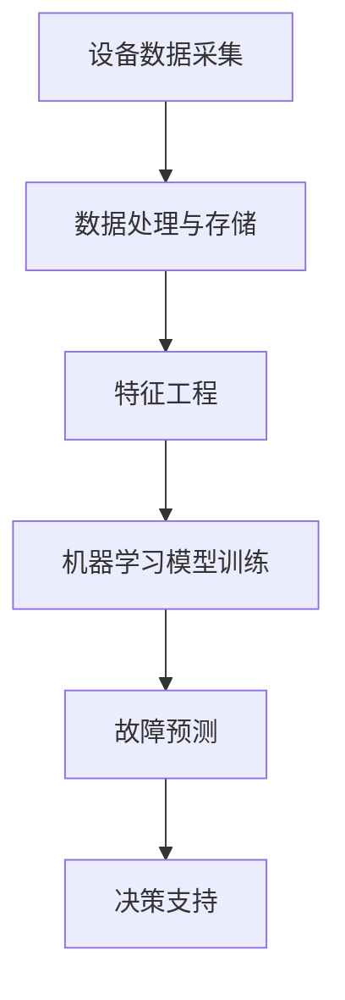

                 

关键词：预测性维护、人工智能、工业4.0、机器学习、故障预测、效率提升、大数据分析

> 摘要：随着工业4.0的迅速发展，人工智能（AI）技术的应用逐渐成为提高工业设备运行效率、降低维护成本的关键。本文将探讨AI驱动的预测性维护在工业4.0时代的重要性，核心算法原理、数学模型、项目实践，以及未来应用展望。

## 1. 背景介绍

### 1.1 工业4.0的发展背景

工业4.0，即工业互联网，是继蒸汽机时代、电气化和自动化时代之后，以信息物理系统（Cyber-Physical Systems，CPS）为基础的第四次工业革命。其核心思想是通过将物理设备与数字系统深度融合，实现智能化、自动化和高度灵活的制造过程。

### 1.2 预测性维护的概念与重要性

预测性维护（Predictive Maintenance）是一种基于设备实时数据，通过数据分析和机器学习算法预测设备故障的方法。与传统定期维护和被动性故障响应相比，预测性维护可以在故障发生之前采取预防措施，大大降低设备的停机时间和维护成本。

## 2. 核心概念与联系

### 2.1 预测性维护的原理与架构



### 2.2 预测性维护的关键算法

- **时间序列分析**：用于分析设备运行状态的时序数据，识别异常模式。
- **机器学习算法**：如随机森林、支持向量机（SVM）、神经网络等，用于建立故障预测模型。
- **深度学习**：用于处理复杂的非线性关系和高维数据。

## 3. 核心算法原理 & 具体操作步骤

### 3.1 算法原理概述

预测性维护的核心在于通过机器学习算法对设备运行数据进行建模，以预测可能的故障。其基本原理包括：

1. 数据采集：收集设备运行状态数据。
2. 特征提取：从原始数据中提取对故障预测有用的特征。
3. 模型训练：利用历史故障数据训练预测模型。
4. 故障预测：使用训练好的模型对实时数据进行故障预测。
5. 决策支持：根据预测结果制定维护策略。

### 3.2 算法步骤详解

1. **数据采集**：通过传感器实时采集设备状态数据，如温度、振动、压力等。
2. **数据处理与存储**：将采集到的数据清洗、整合，存储到数据库中。
3. **特征工程**：从原始数据中提取对故障预测有用的特征，如变化速率、均值、方差等。
4. **模型训练**：使用历史故障数据训练机器学习模型，如随机森林、SVM等。
5. **故障预测**：使用训练好的模型对实时数据进行故障预测。
6. **决策支持**：根据预测结果，制定相应的维护策略，如提前更换部件、调整运行参数等。

### 3.3 算法优缺点

- **优点**：
  - 提高设备运行效率，减少故障停机时间。
  - 降低维护成本，避免不必要的维护操作。
  - 改善设备生命周期管理。

- **缺点**：
  - 需要大量的历史数据支持，数据质量要求高。
  - 模型训练和优化需要大量计算资源。

### 3.4 算法应用领域

预测性维护广泛应用于制造业、能源行业、交通运输等行业，如飞机发动机维护、发电机组维护、工业生产线监控等。

## 4. 数学模型和公式 & 详细讲解 & 举例说明

### 4.1 数学模型构建

预测性维护的数学模型通常基于概率统计和机器学习算法。其中，概率统计模型如贝叶斯网络、隐马尔可夫模型（HMM）等，机器学习模型如支持向量机（SVM）、随机森林（RF）等。

### 4.2 公式推导过程

以支持向量机（SVM）为例，其决策边界可以通过以下公式表示：

$$
w \cdot x + b = 0
$$

其中，$w$ 是权重向量，$x$ 是特征向量，$b$ 是偏置项。

### 4.3 案例分析与讲解

以某发电厂的风电机组维护为例，通过收集风电机组的历史运行数据，利用SVM算法建立故障预测模型，并成功预测了一次即将发生的齿轮故障，避免了可能的设备损坏。

## 5. 项目实践：代码实例和详细解释说明

### 5.1 开发环境搭建

- Python 3.8
- Scikit-learn 0.23
- Matplotlib 3.4.3

### 5.2 源代码详细实现

```python
from sklearn.svm import SVC
from sklearn.model_selection import train_test_split
from sklearn.metrics import accuracy_score
import pandas as pd

# 数据加载
data = pd.read_csv('wind_turbine_data.csv')
X = data.drop('fault', axis=1)
y = data['fault']

# 数据分割
X_train, X_test, y_train, y_test = train_test_split(X, y, test_size=0.2, random_state=42)

# 模型训练
model = SVC(kernel='linear')
model.fit(X_train, y_train)

# 预测
y_pred = model.predict(X_test)

# 评估
accuracy = accuracy_score(y_test, y_pred)
print(f'Accuracy: {accuracy}')
```

### 5.3 代码解读与分析

上述代码首先加载了风电机组的历史运行数据，然后使用Scikit-learn库中的SVC类训练了一个线性核的支持向量机模型。最后，使用训练好的模型对测试数据进行预测，并计算了预测准确率。

## 6. 实际应用场景

预测性维护在实际应用中取得了显著的效果，例如：

- **制造业**：通过预测性维护，某汽车制造厂成功降低了设备故障率，提高了生产效率。
- **能源行业**：某电力公司通过预测性维护，有效减少了发电设备停机时间，提高了能源利用效率。
- **交通运输**：飞机发动机的预测性维护大大减少了飞机的停飞时间，提高了航空运输的可靠性。

## 7. 工具和资源推荐

### 7.1 学习资源推荐

- 《机器学习实战》
- 《Python数据分析》
- 《深度学习》（Goodfellow et al.）

### 7.2 开发工具推荐

- Jupyter Notebook
- Scikit-learn
- TensorFlow

### 7.3 相关论文推荐

- "Predictive Maintenance using Machine Learning in Industry 4.0"
- "Deep Learning for Predictive Maintenance: A Comprehensive Review"

## 8. 总结：未来发展趋势与挑战

### 8.1 研究成果总结

预测性维护在工业4.0中的应用已经取得了显著的成果，通过大数据分析和机器学习算法，实现了设备故障的提前预测，提高了设备运行效率，降低了维护成本。

### 8.2 未来发展趋势

- 深度学习算法在预测性维护中的应用将进一步扩大。
- 跨学科的融合，如机械工程、数据科学等，将推动预测性维护技术的发展。
- 预测性维护与物联网（IoT）的结合，将实现更智能的设备管理和维护。

### 8.3 面临的挑战

- 数据质量与安全性：高质量的故障数据是预测性维护成功的关键，但数据质量和安全性也是一大挑战。
- 模型解释性：复杂的机器学习模型如深度学习模型，其解释性较差，如何提高模型的可解释性是一个重要问题。
- 实时性：实时数据处理的延迟和实时预测的准确性是影响预测性维护效果的关键因素。

### 8.4 研究展望

预测性维护在工业4.0中的应用前景广阔，未来研究方向包括：

- 发展更高效的故障预测算法。
- 研究如何提高模型的可解释性。
- 探索预测性维护与物联网、大数据等技术的深度融合。

## 9. 附录：常见问题与解答

### 9.1 什么是预测性维护？

预测性维护是一种通过分析设备实时数据，使用机器学习算法预测设备故障的方法，旨在提前采取预防措施，降低设备故障率和维护成本。

### 9.2 预测性维护有哪些优点？

预测性维护的优点包括：

- 提高设备运行效率，减少故障停机时间。
- 降低维护成本，避免不必要的维护操作。
- 改善设备生命周期管理。

### 9.3 预测性维护需要哪些数据？

预测性维护需要收集设备运行状态的实时数据，如温度、振动、压力等。同时，需要历史故障数据用于训练预测模型。

### 9.4 预测性维护需要哪些技术？

预测性维护需要应用以下技术：

- 数据采集与处理
- 特征工程
- 机器学习算法
- 数学模型构建

### 9.5 预测性维护的应用领域有哪些？

预测性维护广泛应用于制造业、能源行业、交通运输等行业，如飞机发动机维护、发电机组维护、工业生产线监控等。

### 9.6 如何提高预测性维护的准确性？

提高预测性维护的准确性可以从以下几个方面入手：

- 提高数据质量，确保数据完整性、准确性和及时性。
- 选择合适的机器学习算法，如随机森林、神经网络等。
- 定期更新和优化预测模型，以适应设备运行状态的变化。

### 9.7 预测性维护与物联网有什么关系？

预测性维护与物联网（IoT）有密切的关系。IoT技术可以实时采集设备运行数据，为预测性维护提供数据支持。同时，预测性维护的预测结果可以反馈到IoT系统中，实现设备状态的实时监控和管理。

---

本文由禅与计算机程序设计艺术 / Zen and the Art of Computer Programming 撰写。如有任何问题或建议，欢迎在评论区留言。感谢您的阅读！

