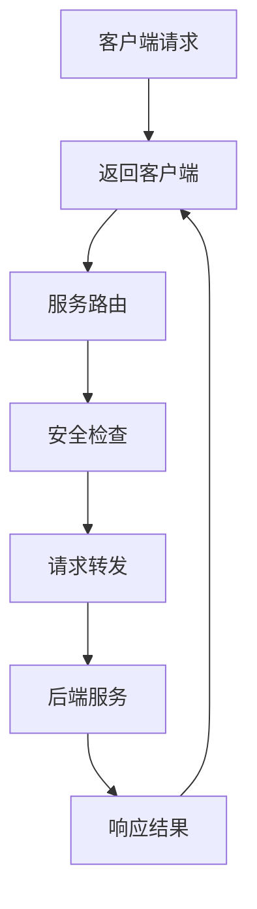

                 

关键词：API网关、微服务架构、服务路由、安全性、性能优化、负载均衡

> 摘要：本文将深入探讨API网关在微服务架构中的应用，从核心概念、算法原理、数学模型、项目实践到实际应用场景，全面解析API网关的设计与使用，并提供未来发展展望。

## 1. 背景介绍

随着互联网的快速发展和企业信息化程度的提高，分布式系统和微服务架构逐渐成为现代软件开发的主流。在这种架构下，系统通常由多个独立的服务组成，这些服务通过API进行通信。然而，随着服务数量的增加，管理和维护这些服务的复杂性也随之增加。API网关作为一种重要的架构组件，能够有效地解决这一问题。

API网关位于客户端和服务器之间，作为系统的统一入口，主要负责服务路由、安全性控制、性能优化等功能。通过API网关，开发者可以更方便地管理和维护系统，提高系统的可靠性和可扩展性。

## 2. 核心概念与联系

### 2.1 API网关的概念

API网关是一种服务器，负责接收客户端的请求，然后根据请求的URL、参数等信息，将请求转发到相应的后端服务。API网关可以提供以下功能：

- **服务路由**：根据请求的URL，将请求路由到相应的服务。
- **安全性控制**：对请求进行认证和授权，确保只有合法的用户才能访问系统。
- **性能优化**：通过缓存、负载均衡等技术，提高系统的响应速度和处理能力。
- **监控和日志**：记录系统的运行状态和请求日志，便于问题的追踪和排查。

### 2.2 API网关与微服务架构的关系

在微服务架构中，API网关是整个系统的核心组成部分。它不仅作为系统的统一入口，还承担了服务管理和维护的重要任务。具体来说，API网关与微服务架构的关系体现在以下几个方面：

- **统一接口**：API网关为客户端提供了一个统一的接口，简化了客户端的调用流程，降低了开发难度。
- **服务聚合**：API网关可以将多个后端服务的功能聚合到一个接口中，提高了系统的可扩展性和灵活性。
- **安全性保障**：API网关可以对客户端请求进行安全检查，防止非法访问和数据泄露。
- **性能优化**：API网关可以通过缓存、负载均衡等技术，提高系统的性能和响应速度。

### 2.3 Mermaid 流程图



## 3. 核心算法原理 & 具体操作步骤

### 3.1 算法原理概述

API网关的核心算法主要包括服务路由算法、安全检查算法和负载均衡算法。

- **服务路由算法**：根据请求的URL、参数等信息，将请求转发到相应的后端服务。常用的服务路由算法有基于URL匹配的路由算法和基于负载均衡的路由算法。
- **安全检查算法**：对请求进行认证和授权，确保只有合法的用户才能访问系统。常用的安全检查算法有基于令牌的认证算法和基于密钥的授权算法。
- **负载均衡算法**：根据后端服务的负载情况，合理分配客户端请求，避免服务过载。常用的负载均衡算法有轮询算法、最小连接数算法和加权轮询算法。

### 3.2 算法步骤详解

#### 服务路由算法

1. 解析请求的URL和参数。
2. 根据请求的URL，查找匹配的路由规则。
3. 根据路由规则，将请求转发到相应的后端服务。

#### 安全检查算法

1. 验证请求的令牌或密钥。
2. 根据用户的权限，判断是否允许访问。
3. 如果允许访问，继续后续处理；否则返回错误响应。

#### 负载均衡算法

1. 采集后端服务的负载信息。
2. 根据负载信息，选择最优的后端服务。
3. 将请求转发到选择的后端服务。

### 3.3 算法优缺点

#### 服务路由算法

- **优点**：简化了服务调用流程，提高了系统的可扩展性。
- **缺点**：路由规则较多时，维护和更新较为复杂。

#### 安全检查算法

- **优点**：提高了系统的安全性，防止非法访问。
- **缺点**：可能对性能产生一定影响。

#### 负载均衡算法

- **优点**：提高了系统的性能和可靠性。
- **缺点**：负载均衡算法复杂度较高，需要合理配置。

### 3.4 算法应用领域

API网关算法在以下领域有广泛的应用：

- **金融领域**：用于处理大量的金融交易请求，确保系统的安全性和可靠性。
- **电商平台**：用于处理海量的用户请求，提高系统的响应速度和处理能力。
- **物联网领域**：用于连接各种物联网设备，实现高效的数据传输和设备管理。

## 4. 数学模型和公式

### 4.1 数学模型构建

为了更好地理解API网关的算法原理，我们可以构建一个简单的数学模型。假设有N个后端服务，每个服务的负载为L_i（i=1,2,...,N），客户端请求的负载为L。

### 4.2 公式推导过程

1. **服务选择公式**：选择负载最小的服务，公式如下：

   $$ S = \arg\min(L_i) $$

2. **负载均衡公式**：根据服务负载，计算客户端请求的负载分配，公式如下：

   $$ L_i' = \frac{L \times L_i}{\sum_{j=1}^{N} L_j} $$

### 4.3 案例分析与讲解

假设有3个后端服务，负载分别为L1=100，L2=150，L3=200。客户端请求负载为L=300。

1. **服务选择**：根据公式$S = \arg\min(L_i)$，选择负载最小的服务S1。

2. **负载分配**：根据公式$L_i' = \frac{L \times L_i}{\sum_{j=1}^{N} L_j}$，计算客户端请求的负载分配：

   $$ L_1' = \frac{300 \times 100}{100 + 150 + 200} = 100 $$
   $$ L_2' = \frac{300 \times 150}{100 + 150 + 200} = 150 $$
   $$ L_3' = \frac{300 \times 200}{100 + 150 + 200} = 200 $$

通过以上计算，我们可以将客户端请求的负载合理地分配到3个后端服务上，确保每个服务的负载均衡。

## 5. 项目实践：代码实例和详细解释说明

### 5.1 开发环境搭建

本文将使用Spring Boot作为API网关的开发框架，需要先搭建Spring Boot的开发环境。

1. 下载Spring Boot的依赖管理工具Spring Boot Starter。
2. 创建Spring Boot项目，添加API网关相关的依赖。
3. 配置开发环境变量，确保Spring Boot能够正常运行。

### 5.2 源代码详细实现

以下是API网关的核心源代码实现：

```java
@RestController
@RequestMapping("/api")
public class ApiGatewayController {

    @Autowired
    private ServiceRouter serviceRouter;

    @PostMapping("/service/{serviceName}")
    public ResponseEntity<Object> handleRequest(@PathVariable String serviceName, @RequestBody Object requestBody) {
        // 调用服务路由器，获取后端服务
        String backendService = serviceRouter.routeService(serviceName);

        // 调用后端服务，获取响应结果
        Object response = callBackendService(backendService, requestBody);

        // 返回响应结果
        return ResponseEntity.ok(response);
    }

    private Object callBackendService(String backendService, Object requestBody) {
        // 根据后端服务名称，调用相应的后端服务
        // 这里使用RestTemplate进行远程调用
        RestTemplate restTemplate = new RestTemplate();
        String url = String.format("http://%s:%d/api/service/%s", backendService, port, serviceName);
        return restTemplate.postForObject(url, requestBody, Object.class);
    }
}
```

### 5.3 代码解读与分析

1. **服务路由器**：使用ServiceRouter类实现服务路由功能，根据服务名称，选择对应的后端服务。
2. **请求处理**：通过@RestController注解，定义API网关的入口，处理客户端的POST请求。
3. **远程调用**：使用RestTemplate类，调用后端服务的API接口，获取响应结果。

### 5.4 运行结果展示

1. 启动API网关服务，访问`http://localhost:8080/api/service/user`，查看返回的响应结果。
2. 修改API网关的配置文件，添加新的后端服务，再次访问，查看是否能够正常路由。

## 6. 实际应用场景

API网关在实际应用中具有广泛的应用场景，以下列举几个常见的应用场景：

- **电商平台**：用于处理海量的用户请求，实现订单、商品、用户等服务的聚合。
- **金融系统**：用于处理金融交易请求，确保系统的安全性和可靠性。
- **物联网平台**：用于连接各种物联网设备，实现数据传输和设备管理。

## 7. 工具和资源推荐

### 7.1 学习资源推荐

- **书籍**：《微服务设计》、《API设计指南》
- **在线教程**：Spring Boot官方文档、Kubernetes官方文档
- **视频课程**：网易云课堂、慕课网

### 7.2 开发工具推荐

- **IDE**：IntelliJ IDEA、Visual Studio Code
- **版本控制**：Git、GitLab
- **持续集成**：Jenkins、GitLab CI/CD

### 7.3 相关论文推荐

- **API网关架构设计**：RESTful API Gateway Design
- **微服务架构**：Microservices: A Developers Guide to Distributed Systems
- **负载均衡**：Load Balancing for High Availability and Performance

## 8. 总结：未来发展趋势与挑战

### 8.1 研究成果总结

本文从核心概念、算法原理、数学模型、项目实践等方面，全面解析了API网关的设计与使用。通过本文的学习，读者可以了解API网关在微服务架构中的应用价值，掌握API网关的核心算法原理和具体实现方法。

### 8.2 未来发展趋势

随着云计算、大数据和人工智能技术的不断发展，API网关在未来将面临以下发展趋势：

- **智能化**：通过引入人工智能技术，实现智能路由、智能监控等功能。
- **服务化**：将API网关功能模块化，实现服务化部署和管理。
- **分布式**：支持分布式架构，提高系统的可扩展性和容错性。

### 8.3 面临的挑战

尽管API网关在微服务架构中具有广泛的应用，但在实际应用过程中，仍面临以下挑战：

- **性能优化**：如何提高API网关的性能和响应速度，满足大规模、高并发的业务需求。
- **安全性**：如何确保API网关的安全，防止非法访问和数据泄露。
- **可扩展性**：如何实现API网关的弹性扩展，满足业务需求的不断变化。

### 8.4 研究展望

未来，API网关的研究将朝着智能化、服务化和分布式方向不断发展。通过引入人工智能技术，实现智能路由和智能监控，提高系统的性能和安全性。同时，通过服务化和分布式架构，实现API网关的弹性扩展和高效管理，为现代软件开发提供强有力的支持。

## 9. 附录：常见问题与解答

### 9.1 如何实现服务路由？

可以使用基于URL匹配的路由算法或基于负载均衡的路由算法。具体实现方法如下：

- **基于URL匹配的路由算法**：根据请求的URL，查找匹配的路由规则，将请求转发到相应的后端服务。
- **基于负载均衡的路由算法**：根据后端服务的负载情况，选择负载最小的服务，将请求转发到该服务。

### 9.2 如何确保API网关的安全性？

可以通过以下方法确保API网关的安全性：

- **认证和授权**：对请求进行认证和授权，确保只有合法的用户才能访问系统。
- **安全策略**：制定安全策略，限制访问权限，防止非法访问和数据泄露。
- **数据加密**：对传输数据进行加密，确保数据的安全传输。

### 9.3 如何进行性能优化？

可以通过以下方法进行性能优化：

- **缓存**：使用缓存技术，减少对后端服务的访问，提高系统的响应速度。
- **负载均衡**：合理分配客户端请求，避免服务过载，提高系统的性能和可靠性。
- **服务优化**：对后端服务进行性能优化，提高服务的处理能力。

### 9.4 如何实现API网关的弹性扩展？

可以通过以下方法实现API网关的弹性扩展：

- **分布式部署**：将API网关部署在多个节点上，实现分布式架构，提高系统的可扩展性和容错性。
- **自动化伸缩**：根据业务需求，自动调整API网关的节点数量，实现弹性扩展。
- **服务化架构**：将API网关功能模块化，实现服务化部署和管理，提高系统的灵活性和可扩展性。

