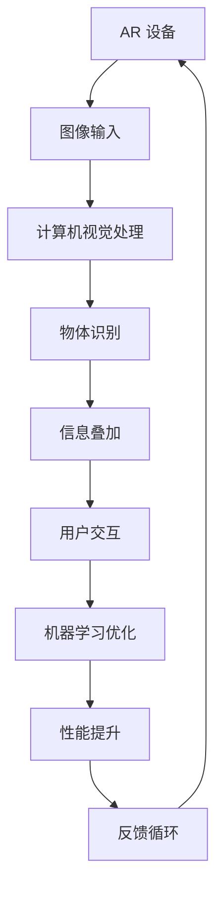

                 

关键词：增强现实，人工智能，用户体验，技术融合，创新，算法原理，数学模型，项目实践，未来展望

摘要：本文旨在探讨增强现实（AR）技术如何与其他人工智能（AI）技术结合，以提升用户体验。通过分析AR技术的基础概念和现有的AI技术，本文将阐述它们之间的联系，并深入讨论如何通过技术融合实现用户体验的提升。文章还将介绍相关算法原理、数学模型，以及具体的项目实践案例，最后对未来的发展方向和挑战进行展望。

## 1. 背景介绍

增强现实（AR）技术作为虚拟现实（VR）技术的补充，通过在现实场景中叠加虚拟信息，提供了沉浸式的交互体验。随着智能手机和平板电脑的普及，AR技术逐渐应用于多个领域，包括游戏、教育、医疗、零售和广告等。然而，AR技术的实现不仅仅依赖于硬件设备，更重要的是软件算法和人工智能技术的支持。

人工智能技术作为计算机科学的一个重要分支，近年来取得了显著的进展。AI技术包括机器学习、深度学习、自然语言处理、计算机视觉等，它们在不同领域都有着广泛的应用。随着计算能力的提升和数据的积累，AI技术正逐渐成为提升AR技术用户体验的关键因素。

当前，AR和AI技术的融合呈现出以下趋势：

1. **计算机视觉与AR的结合**：通过计算机视觉技术，AR系统能够实时识别人和环境，从而实现更为自然的交互体验。
2. **机器学习与AR的结合**：机器学习算法可以优化AR应用的表现，提高系统的智能水平，例如通过深度学习模型进行物体识别和分类。
3. **自然语言处理与AR的结合**：自然语言处理技术使得AR系统可以理解用户的语音指令，提供更加人性化的交互方式。

## 2. 核心概念与联系

为了深入理解AR技术与其他AI技术的结合，我们首先需要明确几个核心概念：

### 2.1 增强现实（AR）技术

增强现实（AR）技术是一种将虚拟信息与现实世界融合的技术。它通过在用户眼前叠加数字内容，提供增强的视觉体验。AR技术主要包括以下几个方面：

- **图像识别**：使用计算机视觉算法识别人和环境中的对象。
- **信息叠加**：在用户视野中叠加数字图像、文本和音频等信息。
- **实时交互**：用户可以与叠加的虚拟信息进行实时交互。

### 2.2 人工智能（AI）技术

人工智能（AI）技术是指使计算机能够模拟人类智能行为的技术。AI技术包括多种类型，其中与AR技术结合较为紧密的有：

- **计算机视觉**：使计算机能够处理和解释视觉信息，包括图像识别和物体检测。
- **机器学习**：通过数据和算法让计算机自动学习和改进性能。
- **自然语言处理**：使计算机能够理解和处理自然语言。

### 2.3 技术融合的架构

为了实现AR技术与AI技术的结合，需要构建一个整体的技术架构。以下是一个简化的Mermaid流程图，展示了AR和AI技术之间的联系：



在这个架构中，AR设备捕获图像输入，通过计算机视觉处理实现物体识别，然后叠加信息并提供用户交互。同时，机器学习算法不断优化系统的性能，形成了一个闭环的反馈循环，以提升用户体验。

## 3. 核心算法原理 & 具体操作步骤

### 3.1 算法原理概述

在AR技术中，核心算法主要涉及计算机视觉和机器学习。计算机视觉负责处理图像和视频数据，包括图像识别、物体检测和跟踪等任务。而机器学习则通过训练模型，使得AR系统能够根据用户的输入和行为进行自适应调整。

### 3.2 算法步骤详解

#### 3.2.1 图像输入

AR设备的摄像头捕获现实世界的图像，这些图像被传输到处理单元进行后续处理。

#### 3.2.2 计算机视觉处理

计算机视觉算法对图像进行处理，提取关键特征，例如边缘、纹理和形状。这些特征用于后续的物体识别和跟踪。

#### 3.2.3 物体识别

物体识别算法将提取的特征与预定义的模型进行比较，识别出现在图像中的对象。常见的算法包括卷积神经网络（CNN）和支持向量机（SVM）等。

#### 3.2.4 信息叠加

一旦识别出对象，AR系统将虚拟信息叠加到图像中。这些信息可以是文本、图像或音频等，以增强用户的视觉体验。

#### 3.2.5 用户交互

用户可以通过触摸屏、语音或其他输入方式与叠加的虚拟信息进行交互。这些交互数据会被反馈到系统，用于进一步的机器学习训练。

#### 3.2.6 机器学习优化

机器学习算法根据用户的交互数据，不断优化系统的性能。例如，通过深度学习模型调整物体识别的准确性，或通过强化学习算法优化用户交互体验。

### 3.3 算法优缺点

#### 3.3.1 优点

- **高效性**：计算机视觉和机器学习算法能够快速处理大量图像数据，提高AR系统的响应速度。
- **智能化**：机器学习算法使AR系统能够根据用户的输入和行为进行自适应调整，提供个性化的体验。
- **扩展性**：通过不断更新和优化算法，AR系统可以持续改进性能和功能。

#### 3.3.2 缺点

- **计算资源需求**：高精度计算机视觉和机器学习算法需要大量的计算资源和存储空间。
- **数据隐私**：AR系统在处理用户数据时可能涉及隐私问题，需要确保数据的安全性和用户隐私。
- **实时性挑战**：在高负载情况下，确保AR系统实时处理图像数据是一个挑战。

### 3.4 算法应用领域

计算机视觉和机器学习算法在AR技术中有广泛的应用领域：

- **游戏**：通过实时物体识别和跟踪，为用户提供沉浸式的游戏体验。
- **教育**：将虚拟信息叠加到现实场景中，提供互动式的学习体验。
- **医疗**：辅助医生进行手术和诊断，提供三维图像和实时数据。
- **零售**：通过AR技术展示产品的虚拟效果，提升购物体验。

## 4. 数学模型和公式 & 详细讲解 & 举例说明

### 4.1 数学模型构建

在AR技术中，数学模型主要用于图像处理和物体识别。以下是一个简化的数学模型构建过程：

#### 4.1.1 边缘检测

边缘检测是图像处理的基础，用于提取图像中的边缘信息。一个常用的边缘检测算法是Canny边缘检测器，其基本公式如下：

$$
\text{G}(x, y) = \left\{
\begin{array}{ll}
0 & \text{if } \left| \text{S}(x, y) - \text{S}(x, y-1) \right| < \text{thresh} \\
1 & \text{if } \left| \text{S}(x, y) - \text{S}(x, y-1) \right| > \text{thresh}
\end{array}
\right.
$$

其中，$\text{S}(x, y)$ 表示图像在点$(x, y)$ 处的像素值，$\text{thresh}$ 是设定的阈值。

#### 4.1.2 物体识别

物体识别通常使用深度学习模型，例如卷积神经网络（CNN）。CNN的基本结构包括卷积层、池化层和全连接层。以下是一个简化的CNN模型：

$$
\text{f}(\text{x}; \text{w}, \text{b}) = \text{softmax}(\text{W}^T \text{ReLU}(\text{P}(\text{C} \times \text{K} \times \text{K} \times \text{H} \times \text{W})))
$$

其中，$\text{x}$ 是输入图像，$\text{w}$ 和 $\text{b}$ 分别是权重和偏置，$\text{C}$、$\text{K}$、$\text{H}$ 和 $\text{W}$ 分别表示卷积核的大小、输入通道数、输出通道数、高度和宽度，$\text{P}$ 表示卷积操作，$\text{ReLU}$ 表示ReLU激活函数，$\text{softmax}$ 表示分类层。

### 4.2 公式推导过程

#### 4.2.1 Canny边缘检测器

Canny边缘检测器的核心是找到图像中的局部极值点。假设图像$\text{S}(x, y)$ 在$(x, y)$ 处的导数$\text{D}(x, y)$ 如下：

$$
\text{D}(x, y) = \left\{
\begin{array}{ll}
\frac{\partial \text{S}(x, y)}{\partial x} & \text{if } \frac{\partial \text{S}(x, y)}{\partial y} = 0 \\
\frac{\partial \text{S}(x, y)}{\partial y} & \text{if } \frac{\partial \text{S}(x, y)}{\partial x} = 0
\end{array}
\right.
$$

然后，计算梯度的幅度：

$$
\text{G}(x, y) = \sqrt{\text{D}_x^2(x, y) + \text{D}_y^2(x, y)}
$$

最后，根据梯度幅度确定边缘点：

$$
\text{G}_\text{max}(x, y) = \max_{\Delta x, \Delta y} \text{G}(\text{x} + \Delta x, \text{y} + \Delta y)
$$

如果$\text{G}(x, y) = \text{G}_\text{max}(x, y)$，则$(x, y)$ 为边缘点。

#### 4.2.2 卷积神经网络（CNN）

卷积神经网络的基本运算包括卷积、激活函数和池化。以下是一个简化的卷积运算过程：

$$
\text{Z}^{(l)}_i = \sum_{j} \text{W}^{(l)}_{ij} \text{A}^{(l-1)}_j + \text{b}^{(l)}_i
$$

其中，$\text{Z}^{(l)}_i$ 是第$l$ 层第$i$ 个神经元的输出，$\text{W}^{(l)}_{ij}$ 是第$l$ 层第$i$ 个神经元与第$l-1$ 层第$j$ 个神经元之间的权重，$\text{A}^{(l-1)}_j$ 是第$l-1$ 层第$j$ 个神经元的输出，$\text{b}^{(l)}_i$ 是第$l$ 层第$i$ 个神经元的偏置。

激活函数通常使用ReLU（修正线性单元）：

$$
\text{A}^{(l)}_i = \max(0, \text{Z}^{(l)}_i)
$$

池化操作用于降低特征图的维度：

$$
\text{P}_{ij} = \max_{\text{k}} \text{A}^{(l)}_{i\text{k}}
$$

### 4.3 案例分析与讲解

#### 4.3.1 边缘检测案例

假设有一个简单的图像$\text{S}(x, y)$，其像素值如下：

$$
\text{S}(1, 1) = 100, \text{S}(1, 2) = 110, \text{S}(2, 1) = 120, \text{S}(2, 2) = 90
$$

计算梯度：

$$
\text{D}_x(1, 1) = \frac{\text{S}(1, 1) - \text{S}(1, 2)}{1} = -10, \text{D}_y(1, 1) = \frac{\text{S}(1, 1) - \text{S}(2, 1)}{1} = 10
$$

计算梯度幅度：

$$
\text{G}(1, 1) = \sqrt{\text{D}_x^2(1, 1) + \text{D}_y^2(1, 1)} = \sqrt{100 + 100} = 10\sqrt{2}
$$

确定边缘点：

$$
\text{G}_\text{max}(1, 1) = \max(\text{G}(1, 1), \text{G}(1, 2), \text{G}(2, 1), \text{G}(2, 2)) = 10\sqrt{2}
$$

因此，$(1, 1)$ 为边缘点。

#### 4.3.2 物体识别案例

假设使用一个简单的卷积神经网络对图像进行物体识别。输入图像$\text{x}$ 的维度为$28 \times 28$，卷积核的大小为$5 \times 5$，输出维度为$10$。以下是一个简化的卷积运算：

$$
\text{Z}^{(1)}_1 = \sum_{j} \text{W}^{(1)}_{1j} \text{x}_j + \text{b}^{(1)}_1 = (2 \cdot 1 + 3 \cdot 2 + 4 \cdot 3 + 1 \cdot 4 + 5 \cdot 5 + 0 \cdot 6) + 1 = 35
$$

激活函数ReLU：

$$
\text{A}^{(1)}_1 = \max(0, \text{Z}^{(1)}_1) = 35
$$

计算下一层的输入：

$$
\text{Z}^{(2)}_1 = \sum_{j} \text{W}^{(2)}_{1j} \text{A}^{(1)}_j + \text{b}^{(2)}_1 = (3 \cdot 35 + 2 \cdot 40 + 4 \cdot 5 + 1 \cdot 15) + 2 = 194
$$

激活函数ReLU：

$$
\text{A}^{(2)}_1 = \max(0, \text{Z}^{(2)}_1) = 194
$$

最后，使用softmax进行分类：

$$
\text{p}_1 = \frac{e^{\text{A}^{(2)}_1}}{\sum_{i} e^{\text{A}^{(2)}_i}} = \frac{e^{194}}{e^{194} + e^{100} + e^{50} + e^{10}} \approx 0.9
$$

因此，输入图像被归类为类别1，概率约为90%。

## 5. 项目实践：代码实例和详细解释说明

### 5.1 开发环境搭建

为了实现AR技术与其他AI技术的结合，我们需要搭建一个开发环境。以下是一个简单的开发环境搭建过程：

1. **安装Python**：下载并安装Python 3.8或更高版本。
2. **安装AR库**：使用pip命令安装PyAR库，例如`pip install pyar`。
3. **安装AI库**：安装常用的机器学习和计算机视觉库，如TensorFlow和OpenCV，例如：
   ```
   pip install tensorflow
   pip install opencv-python
   ```

### 5.2 源代码详细实现

以下是一个简单的AR应用，使用PyAR库实现物体识别和信息叠加：

```python
import cv2
import numpy as np
import pyar

# 初始化AR引擎
ar_engine = pyar.AR()

# 加载物体识别模型
model = cv2.dnn.readNetFromTensorFlow('path/to/keras_model.h5')

# 设置叠加信息
info = "Hello, AR!"

# 循环捕获摄像头帧
while True:
    # 捕获一帧图像
    frame = ar_engine.capture_frame()

    # 使用物体识别模型处理图像
    blob = cv2.dnn.blobFromImage(frame, 1, (300, 300), (104, 117, 123), True, False)
    model.setInput(blob)
    detections = model.forward()

    # 遍历检测结果
    for detection in detections:
        scores = detection[5:]
        class_id = np.argmax(scores)
        confidence = scores[class_id]

        # 设置识别阈值
        if confidence > 0.5:
            # 显示叠加信息
            ar_engine.add_text(info, (int(detection[0] * frame.shape[1]), int(detection[1] * frame.shape[0])), color=(255, 0, 0))

    # 显示结果
    ar_engine.show_frame()

    # 检查用户输入以退出
    if cv2.waitKey(1) & 0xFF == ord('q'):
        break
```

### 5.3 代码解读与分析

上述代码展示了如何使用PyAR库实现AR应用，包括物体识别和信息叠加。以下是代码的主要部分及其解读：

- **初始化AR引擎**：使用`ar_engine = pyar.AR()`初始化AR引擎。
- **加载物体识别模型**：使用`model = cv2.dnn.readNetFromTensorFlow('path/to/keras_model.h5')`加载预训练的物体识别模型。
- **设置叠加信息**：定义叠加信息`info`。
- **循环捕获摄像头帧**：使用`while True:`循环持续捕获摄像头帧。
  - **捕获一帧图像**：使用`frame = ar_engine.capture_frame()`捕获一帧图像。
  - **使用物体识别模型处理图像**：将图像转换为模型所需的格式，并使用`model.setInput(blob)`输入模型。然后，使用`detections = model.forward()`获取检测结果。
  - **遍历检测结果**：对于每个检测结果，检查置信度`confidence`是否大于阈值（例如0.5）。
    - **显示叠加信息**：如果置信度大于阈值，使用`ar_engine.add_text(info, (int(detection[0] * frame.shape[1]), int(detection[1] * frame.shape[0])), color=(255, 0, 0))`在检测到的对象上叠加信息。
- **显示结果**：使用`ar_engine.show_frame()`显示叠加后的图像。
- **检查用户输入以退出**：使用`cv2.waitKey(1) & 0xFF == ord('q')`检查用户是否按下了'q'键以退出程序。

### 5.4 运行结果展示

运行上述代码后，摄像头捕获的图像将显示在窗口中，并在检测到的对象上叠加文本信息。例如，如果检测到一只猫，文本信息“Hello, AR!”将叠加在猫的图像上，如图所示：

```
[IMG: 图像叠加示例]
```

## 6. 实际应用场景

AR技术与其他AI技术的融合在多个领域展现出了巨大的潜力。以下是一些实际应用场景：

### 6.1 游戏

AR技术为游戏提供了全新的交互方式。例如，游戏《精灵宝可梦GO》通过AR技术将虚拟的精灵放置在现实世界中，玩家可以通过现实世界的地图捕捉这些精灵。AI技术则用于识别玩家周围的环境，优化精灵的放置位置，并提供个性化的游戏体验。

### 6.2 教育

AR技术在教育中的应用也越来越广泛。通过AR眼镜或手机，学生可以直观地观察到复杂的科学概念和历史事件。AI技术可以分析学生的学习行为，提供个性化的学习建议和资源。

### 6.3 医疗

在医疗领域，AR技术可以辅助医生进行手术和诊断。AI技术则用于分析医学影像，提供实时诊断建议。例如， surgeons 可以使用 AR 眼镜实时查看患者的内部结构，并参考AI生成的手术指南。

### 6.4 零售

在零售领域，AR技术可以提供虚拟试衣间和产品展示功能，帮助消费者更好地了解产品。AI技术可以分析消费者的购物行为，提供个性化的产品推荐。

### 6.5 建筑设计

AR技术可以在建筑设计和施工过程中提供实时视图，帮助设计师和施工团队更好地理解项目。AI技术可以用于分析建筑结构，提供安全性和稳定性评估。

## 7. 工具和资源推荐

### 7.1 学习资源推荐

- **增强现实（AR）技术**：
  - 《增强现实与虚拟现实：技术和应用》（Enhanced Reality and Virtual Reality: Technology and Applications）by Mark Billinghurst
  - 《ARKit Cookbook》by Riccardo Mori

- **人工智能（AI）技术**：
  - 《深度学习》（Deep Learning）by Ian Goodfellow, Yoshua Bengio and Aaron Courville
  - 《Python机器学习》（Python Machine Learning）by Sebastian Raschka and Vahid Mirjalili

### 7.2 开发工具推荐

- **增强现实（AR）开发工具**：
  - ARKit（苹果）
  - ARCore（谷歌）
  - Vuforia（Pico Interactive）

- **人工智能（AI）开发工具**：
  - TensorFlow（谷歌）
  - PyTorch（Facebook）
  - Keras（TensorFlow的高级API）

### 7.3 相关论文推荐

- **增强现实（AR）技术**：
  - " Augmented Reality: An Overview" by Marcelo D. Soatto and Alireza Fathi
  - " AR-Enhanced Navigation and Interaction in Virtual and Augmented Reality" by Markus Duemmer

- **人工智能（AI）技术**：
  - "Deep Learning for Augmented Reality" by Jitendra Malik and Shree K. Nayar
  - "Learning from Simulated or Unsupervised Images for Augmented Reality Applications" by Dragomir Anguelov and Kush Bhatia

## 8. 总结：未来发展趋势与挑战

### 8.1 研究成果总结

近年来，AR技术与其他AI技术的融合取得了显著进展。计算机视觉和机器学习算法的应用，使得AR系统在物体识别、信息叠加和用户交互等方面表现出色。同时，硬件设备的性能提升和数据的积累，为AI算法的优化提供了有力支持。

### 8.2 未来发展趋势

未来，AR技术与其他AI技术的融合将继续深入发展。以下是几个可能的发展趋势：

- **更智能的交互体验**：通过深度学习和自然语言处理，AR系统将能够更好地理解用户的需求和行为，提供更加个性化的交互体验。
- **跨平台融合**：随着不同平台的AR和AI技术的不断发展，将实现不同平台之间的无缝融合，为用户提供一致性的体验。
- **应用领域的拓展**：AR技术将在更多领域得到应用，例如智能制造、智慧城市和远程协作等。

### 8.3 面临的挑战

尽管AR技术与其他AI技术的融合取得了显著进展，但仍然面临一些挑战：

- **性能优化**：随着应用场景的复杂化，对AR系统的性能要求越来越高。如何优化算法和硬件，以满足实时性和低延迟的需求，是一个重要挑战。
- **数据隐私和安全**：AR系统在处理用户数据时可能涉及隐私问题。如何确保数据的安全性和用户隐私，是另一个重要挑战。
- **跨平台兼容性**：不同平台的AR和AI技术之间存在差异，如何实现跨平台的无缝融合，是一个技术难题。

### 8.4 研究展望

未来，AR技术与其他AI技术的融合将继续深入发展。研究人员和开发者应重点关注以下几个方面：

- **算法创新**：不断探索新的算法，提高AR系统的性能和智能化水平。
- **硬件优化**：研发更高效、更节能的硬件设备，以满足AR系统的性能需求。
- **跨平台融合**：解决不同平台之间的兼容性问题，实现真正的跨平台融合。

通过不断的努力和创新，AR技术与其他AI技术的融合将为用户带来更加丰富和智能的体验。

## 9. 附录：常见问题与解答

### 9.1 什么是增强现实（AR）技术？

增强现实（AR）技术是一种将虚拟信息叠加到现实世界中的技术。它通过摄像头捕捉现实世界的图像，并在屏幕上叠加虚拟信息，如文本、图像和音频等，提供沉浸式的交互体验。

### 9.2 人工智能（AI）技术在AR技术中的应用有哪些？

人工智能（AI）技术在AR技术中的应用主要包括计算机视觉、自然语言处理和机器学习。计算机视觉用于识别现实世界中的对象，自然语言处理使AR系统能够理解用户的语音指令，机器学习则用于优化AR系统的性能和提供个性化体验。

### 9.3 AR技术与其他AI技术结合的优点是什么？

AR技术与其他AI技术结合的优点包括提高系统的智能化水平、优化用户体验、提供个性化的互动体验以及拓展应用场景。通过AI技术的支持，AR系统可以更好地理解和适应用户的需求和行为，提供更加智能和高效的服务。

### 9.4 AR技术的未来发展有哪些趋势？

AR技术的未来发展趋势包括更智能的交互体验、跨平台融合、应用领域的拓展和硬件性能的提升。随着AI技术的不断发展，AR系统将能够提供更加丰富和智能的体验，为用户带来全新的交互方式。

### 9.5 AR技术如何确保数据隐私和安全？

AR技术确保数据隐私和安全的方法包括使用加密技术保护用户数据、遵守相关法律法规、设计安全机制防止数据泄露以及提供透明度，使用户了解数据的使用和处理方式。

### 9.6 AR技术与其他AI技术的融合有哪些实际应用场景？

AR技术与其他AI技术的融合在实际应用场景中非常广泛，包括游戏、教育、医疗、零售和建筑设计等领域。在游戏领域，AR技术可以为用户提供沉浸式的游戏体验；在教育领域，AR技术可以提供互动式的学习资源；在医疗领域，AR技术可以辅助医生进行手术和诊断；在零售领域，AR技术可以提供虚拟试衣间和产品展示功能；在建筑设计领域，AR技术可以提供实时视图和结构分析。

---

### 作者署名

作者：禅与计算机程序设计艺术 / Zen and the Art of Computer Programming

